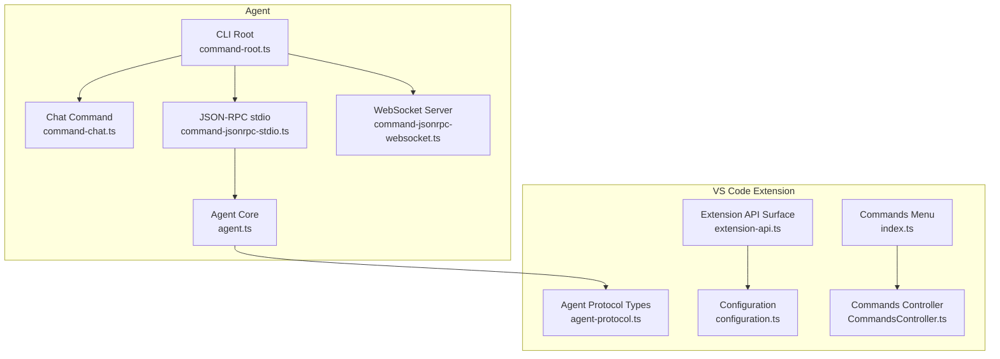
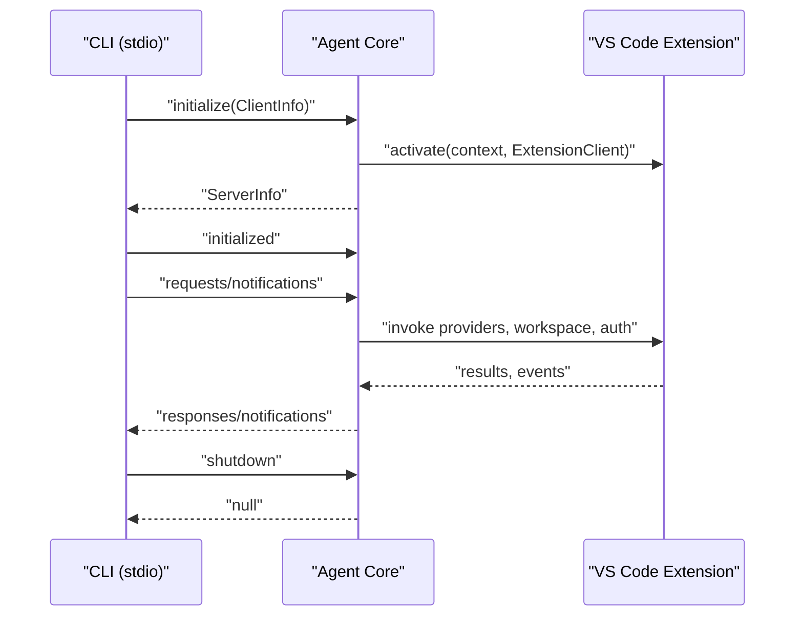
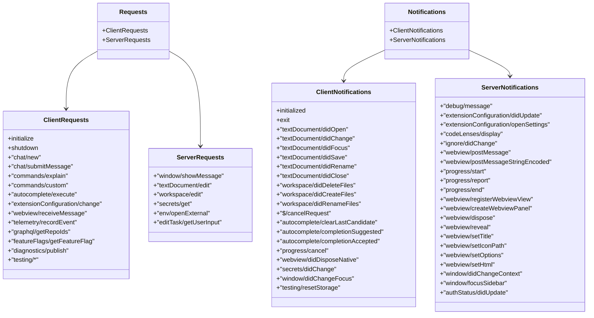
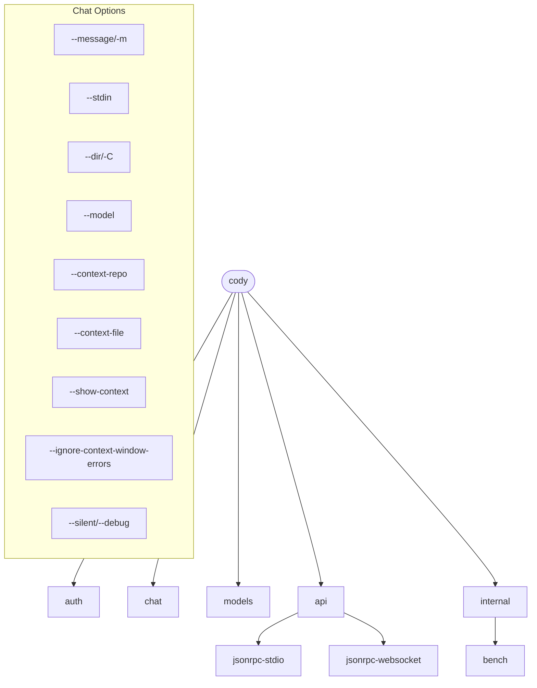
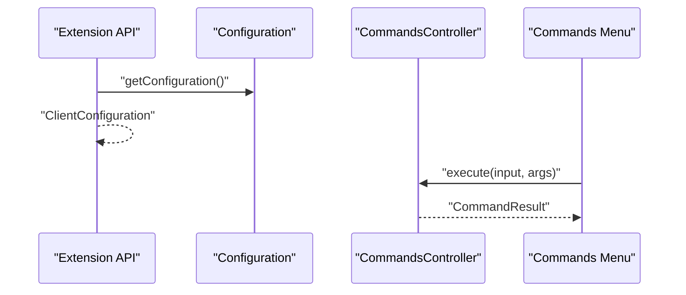
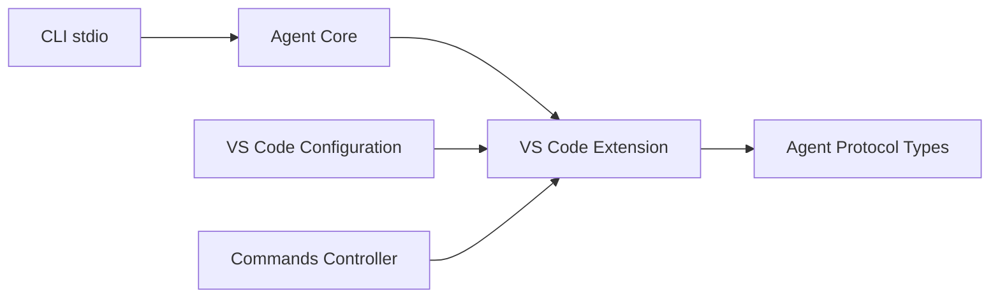

# API Reference

<cite>
**Referenced Files in This Document**
- [protocol.md](file://agent/protocol.md)
- [agent-protocol.ts](file://vscode/src/jsonrpc/agent-protocol.ts)
- [agent.ts](file://agent/src/agent.ts)
- [command-root.ts](file://agent/src/cli/command-root.ts)
- [command-chat.ts](file://agent/src/cli/command-chat.ts)
- [command-jsonrpc-stdio.ts](file://agent/src/cli/command-jsonrpc-stdio.ts)
- [command-jsonrpc-websocket.ts](file://agent/src/cli/command-jsonrpc-websocket.ts)
- [configuration.ts](file://vscode/src/configuration.ts)
- [extension-api.ts](file://vscode/src/extension-api.ts)
- [index.ts](file://vscode/src/commands/index.ts)
- [CommandsController.ts](file://vscode/src/commands/CommandsController.ts)
</cite>

## Table of Contents
1. [Introduction](#introduction)
2. [Project Structure](#project-structure)
3. [Core Components](#core-components)
4. [Architecture Overview](#architecture-overview)
5. [Detailed Component Analysis](#detailed-component-analysis)
6. [Dependency Analysis](#dependency-analysis)
7. [Performance Considerations](#performance-considerations)
8. [Troubleshooting Guide](#troubleshooting-guide)
9. [Conclusion](#conclusion)
10. [Appendices](#appendices)

## Introduction
This document provides comprehensive API documentation for Cody’s public interfaces across multiple integration surfaces:
- VS Code extension APIs: command registration, event handling, configuration APIs, and lifecycle management
- Agent JSON-RPC protocol: method definitions, parameter schemas, response formats, and protocol semantics
- CLI command interfaces: command syntax, options, and usage examples
- WebSocket interfaces: real-time features and HTTP endpoints for web integration
- Security, rate limiting, versioning, and backwards compatibility
- Client implementation guidelines and integration patterns
- Common use cases, debugging tools, and monitoring approaches

## Project Structure
Cody exposes multiple integration surfaces:
- Agent JSON-RPC protocol and CLI for headless operation
- VS Code extension APIs for command registration, configuration, and lifecycle
- Web and native webview integrations for chat and interactive panels

**Diagram sources**
- [command-root.ts:12-23](file://agent/src/cli/command-root.ts#L12-L23)
- [command-chat.ts:45-111](file://agent/src/cli/command-chat.ts#L45-L111)
- [command-jsonrpc-stdio.ts:61-179](file://agent/src/cli/command-jsonrpc-stdio.ts#L61-L179)
- [command-jsonrpc-websocket.ts:12-55](file://agent/src/cli/command-jsonrpc-websocket.ts#L12-L55)
- [agent.ts:295-514](file://agent/src/agent.ts#L295-L514)
- [agent-protocol.ts:24-473](file://vscode/src/jsonrpc/agent-protocol.ts#L24-L473)
- [extension-api.ts:4-18](file://vscode/src/extension-api.ts#L4-L18)
- [configuration.ts:25-204](file://vscode/src/configuration.ts#L25-L204)
- [index.ts:18-90](file://vscode/src/commands/index.ts#L18-L90)
- [CommandsController.ts:27-108](file://vscode/src/commands/CommandsController.ts#L27-L108)

**Section sources**
- [command-root.ts:12-23](file://agent/src/cli/command-root.ts#L12-L23)
- [agent.ts:295-514](file://agent/src/agent.ts#L295-L514)
- [agent-protocol.ts:24-473](file://vscode/src/jsonrpc/agent-protocol.ts#L24-L473)
- [extension-api.ts:4-18](file://vscode/src/extension-api.ts#L4-L18)
- [configuration.ts:25-204](file://vscode/src/configuration.ts#L25-L204)
- [index.ts:18-90](file://vscode/src/commands/index.ts#L18-L90)
- [CommandsController.ts:27-108](file://vscode/src/commands/CommandsController.ts#L27-L108)

## Core Components
- Agent JSON-RPC protocol: defines client-to-server and server-to-client requests and notifications, including initialization, shutdown, chat, autocomplete, diagnostics, webview messaging, and progress reporting
- CLI: provides chat, authentication, benchmarking, and JSON-RPC stdio/websocket entrypoints
- VS Code extension: exposes configuration, command registration, and lifecycle hooks for integration with the Agent

**Section sources**
- [protocol.md:37-482](file://agent/protocol.md#L37-L482)
- [agent-protocol.ts:30-473](file://vscode/src/jsonrpc/agent-protocol.ts#L30-L473)
- [command-root.ts:12-23](file://agent/src/cli/command-root.ts#L12-L23)
- [extension-api.ts:4-18](file://vscode/src/extension-api.ts#L4-L18)
- [configuration.ts:25-204](file://vscode/src/configuration.ts#L25-L204)

## Architecture Overview
The Agent acts as a JSON-RPC server communicating over stdout/stdin or WebSocket. The VS Code extension integrates with the Agent to provide commands, configuration, and UI. CLI tools embed or connect to the Agent for headless operations.

**Diagram sources**
- [agent.ts:381-514](file://agent/src/agent.ts#L381-L514)
- [agent-protocol.ts:35-271](file://vscode/src/jsonrpc/agent-protocol.ts#L35-L271)
- [command-jsonrpc-stdio.ts:181-208](file://agent/src/cli/command-jsonrpc-stdio.ts#L181-L208)

## Detailed Component Analysis

### Agent JSON-RPC Protocol
The Agent JSON-RPC protocol defines:
- Requests (client → server, server → client)
- Notifications (client ↔ server)
- Parameter and response schemas
- Protocol semantics and lifecycle

Key categories:
- Initialization and lifecycle: initialize, shutdown, initialized, exit
- Chat: chat/new, chat/web/new, chat/sidebar/new, chat/submitMessage, chat/editMessage, chat/models, chat/setModel, chat/delete, chat/export, chat/import
- Commands: commands/explain, commands/test, commands/smell, commands/custom, customCommands/list
- Edit tasks: editTask/start, editTask/accept, editTask/undo, editTask/cancel, editTask/retry, editTask/getTaskDetails, editTask/getFoldingRanges
- Autocomplete: autocomplete/execute
- GraphQL and feature flags: graphql/getRepoIds, graphql/currentUserId, graphql/currentUserIsPro, featureFlags/getFeatureFlag, graphql/getCurrentUserCodySubscription
- Telemetry: telemetry/recordEvent
- Git and attribution: git/codebaseName, attribution/search
- Ignore policy: ignore/test, testing/ignore/overridePolicy
- Extension configuration: extensionConfiguration/change, extensionConfiguration/status, extensionConfiguration/getSettingsSchema, extension/reset
- Internal and testing: internal/getAuthHeaders, testing/* endpoints
- Documents and diagnostics: textDocument/change, diagnostics/publish, testing/diagnostics, testing/workspaceDocuments
- Webview: webview/didDispose, webview/resolveWebviewView, webview/receiveMessage, webview/receiveMessageStringEncoded, webview/postMessage, webview/postMessageStringEncoded
- Progress: progress/start, progress/report, progress/end, progress/cancel
- Secrets: secrets/get, secrets/store, secrets/delete
- Window and env: window/showMessage, window/showSaveDialog, env/openExternal
- Code actions: codeActions/provide, codeActions/trigger
- Text editor and workspace: textEditor/selection, textEditor/revealRange, workspace/edit
- Edit task user input: editTask/getUserInput

Parameter and response schemas are defined in the Agent protocol type definitions.

**Diagram sources**
- [agent-protocol.ts:30-473](file://vscode/src/jsonrpc/agent-protocol.ts#L30-L473)

**Section sources**
- [protocol.md:37-482](file://agent/protocol.md#L37-L482)
- [agent-protocol.ts:35-473](file://vscode/src/jsonrpc/agent-protocol.ts#L35-L473)

### CLI Interfaces
- Root command: cody with subcommands for auth, chat, models, api (jsonrpc-stdio, jsonrpc-websocket), and internal (bench)
- Chat command: supports message input via flags, stdin, context files/repos, model selection, and streaming replies
- JSON-RPC stdio: establishes a JSON-RPC connection over stdin/stdout, with optional Polly recording and debug server
- JSON-RPC websocket: placeholder for future WebSocket server support

**Diagram sources**
- [command-root.ts:12-23](file://agent/src/cli/command-root.ts#L12-L23)
- [command-chat.ts:45-111](file://agent/src/cli/command-chat.ts#L45-L111)
- [command-jsonrpc-stdio.ts:61-179](file://agent/src/cli/command-jsonrpc-stdio.ts#L61-L179)
- [command-jsonrpc-websocket.ts:12-55](file://agent/src/cli/command-jsonrpc-websocket.ts#L12-L55)

**Section sources**
- [command-root.ts:12-23](file://agent/src/cli/command-root.ts#L12-L23)
- [command-chat.ts:45-111](file://agent/src/cli/command-chat.ts#L45-L111)
- [command-chat.ts:128-336](file://agent/src/cli/command-chat.ts#L128-L336)
- [command-jsonrpc-stdio.ts:61-179](file://agent/src/cli/command-jsonrpc-stdio.ts#L61-L179)
- [command-jsonrpc-websocket.ts:12-55](file://agent/src/cli/command-jsonrpc-websocket.ts#L12-L55)

### VS Code Extension APIs
- Extension API surface: exposes extensionMode and optional testing hooks
- Configuration: resolves client configuration with sanitization, hidden settings, and overrides
- Commands: menu items and controller for executing default and custom commands
- Lifecycle: initialization, document lifecycle, workspace folders, progress cancellation, and shutdown

**Diagram sources**
- [extension-api.ts:4-18](file://vscode/src/extension-api.ts#L4-L18)
- [configuration.ts:25-204](file://vscode/src/configuration.ts#L25-L204)
- [CommandsController.ts:54-99](file://vscode/src/commands/CommandsController.ts#L54-L99)
- [index.ts:18-90](file://vscode/src/commands/index.ts#L18-L90)

**Section sources**
- [extension-api.ts:4-18](file://vscode/src/extension-api.ts#L4-L18)
- [configuration.ts:25-204](file://vscode/src/configuration.ts#L25-L204)
- [CommandsController.ts:27-108](file://vscode/src/commands/CommandsController.ts#L27-L108)
- [index.ts:18-90](file://vscode/src/commands/index.ts#L18-L90)

### WebSocket Interfaces and HTTP Endpoints
- WebSocket server command: placeholder for future WebSocket-based JSON-RPC server
- HTTP endpoints: not exposed by the Agent; use JSON-RPC over stdio or integrate via the VS Code extension

**Section sources**
- [command-jsonrpc-websocket.ts:12-55](file://agent/src/cli/command-jsonrpc-websocket.ts#L12-L55)

## Dependency Analysis
- Agent depends on the VS Code extension activation to provide providers, workspace, diagnostics, and UI integrations
- CLI relies on embedded Agent client or stdio connection to the Agent process
- VS Code extension consumes Agent protocol types and lifecycle hooks

**Diagram sources**
- [agent.ts:295-514](file://agent/src/agent.ts#L295-L514)
- [agent-protocol.ts:24-473](file://vscode/src/jsonrpc/agent-protocol.ts#L24-L473)
- [configuration.ts:25-204](file://vscode/src/configuration.ts#L25-L204)
- [CommandsController.ts:27-108](file://vscode/src/commands/CommandsController.ts#L27-L108)

**Section sources**
- [agent.ts:295-514](file://agent/src/agent.ts#L295-L514)
- [agent-protocol.ts:24-473](file://vscode/src/jsonrpc/agent-protocol.ts#L24-L473)
- [configuration.ts:25-204](file://vscode/src/configuration.ts#L25-L204)
- [CommandsController.ts:27-108](file://vscode/src/commands/CommandsController.ts#L27-L108)

## Performance Considerations
- Autocomplete and chat operations depend on model availability and context window size; use context filtering and model selection to optimize throughput
- Streaming chat replies improve perceived latency; disable streaming only for debugging (--silent)
- Polly recording can capture network traffic for offline testing; configure recording modes and expiry strategies carefully
- Use progress notifications to provide user feedback for long-running operations

[No sources needed since this section provides general guidance]

## Troubleshooting Guide
Common issues and strategies:
- Authentication failures: verify server endpoint and access token; use extensionConfiguration/change to update credentials
- Context window errors: reduce context files or repositories; use --ignore-context-window-errors to bypass checks
- Debugging: enable debug logging in CLI; subscribe to debug/message notifications; use testing endpoints for diagnostics
- Rate limiting: monitor GraphQL and feature flag endpoints; implement retry with backoff
- Lifecycle: ensure initialized is sent after initialize and exit after shutdown

**Section sources**
- [agent.ts:609-615](file://agent/src/agent.ts#L609-L615)
- [command-chat.ts:393-420](file://agent/src/cli/command-chat.ts#L393-L420)
- [agent-protocol.ts:407-435](file://vscode/src/jsonrpc/agent-protocol.ts#L407-L435)

## Conclusion
Cody provides a robust, extensible API surface spanning JSON-RPC, CLI, and VS Code integration. By leveraging the documented protocol, configuration, and command interfaces, clients can implement reliable, secure, and performant integrations across platforms.

[No sources needed since this section summarizes without analyzing specific files]

## Appendices

### Protocol Semantics and Versioning
- JSON-RPC flavor follows LSP specification; peer-to-peer request/response and notification semantics apply
- Versioning: client and server versions are exchanged during initialize; legacyNameForServerIdentification supports compatibility with older servers

**Section sources**
- [protocol.md:25-34](file://agent/protocol.md#L25-L34)
- [agent-protocol.ts:588-618](file://vscode/src/jsonrpc/agent-protocol.ts#L588-L618)

### Security Considerations
- Access tokens and custom headers are part of ExtensionConfiguration; ensure secure handling and avoid logging sensitive data
- Secrets management: secrets/get/store/delete endpoints for client-managed or stateless secret storage
- Debug logging: restrict debug channels and avoid exposing internal paths

**Section sources**
- [agent-protocol.ts:620-655](file://vscode/src/jsonrpc/agent-protocol.ts#L620-L655)
- [agent.ts:444-457](file://agent/src/agent.ts#L444-L457)

### Rate Limiting and Backwards Compatibility
- Rate limiting: monitor GraphQL and feature flag endpoints; implement retries with exponential backoff
- Backwards compatibility: ProtocolAuthStatus uses string discriminators; legacyNameForServerIdentification supports older clients

**Section sources**
- [agent-protocol.ts:697-741](file://vscode/src/jsonrpc/agent-protocol.ts#L697-L741)
- [agent-protocol.ts:608-612](file://vscode/src/jsonrpc/agent-protocol.ts#L608-L612)

### Client Implementation Guidelines
- Use JSON-RPC over stdio for headless clients; establish initialize → initialized → requests/notifications → shutdown
- For web integrations, leverage VS Code extension webview APIs and Agent’s webview handlers
- Implement progress notifications for long-running tasks; handle debug/message for observability

**Section sources**
- [agent.ts:381-514](file://agent/src/agent.ts#L381-L514)
- [agent-protocol.ts:418-472](file://vscode/src/jsonrpc/agent-protocol.ts#L418-L472)

### Monitoring and Observability
- Subscribe to webview/postMessage for streaming chat replies
- Use telemetry/recordEvent for feature usage insights
- Enable debug/message notifications for runtime diagnostics

**Section sources**
- [agent-protocol.ts:144-144](file://vscode/src/jsonrpc/agent-protocol.ts#L144-L144)
- [agent-protocol.ts:407-407](file://vscode/src/jsonrpc/agent-protocol.ts#L407-L407)