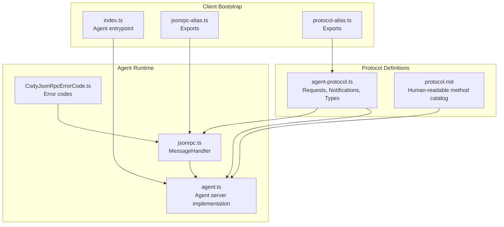
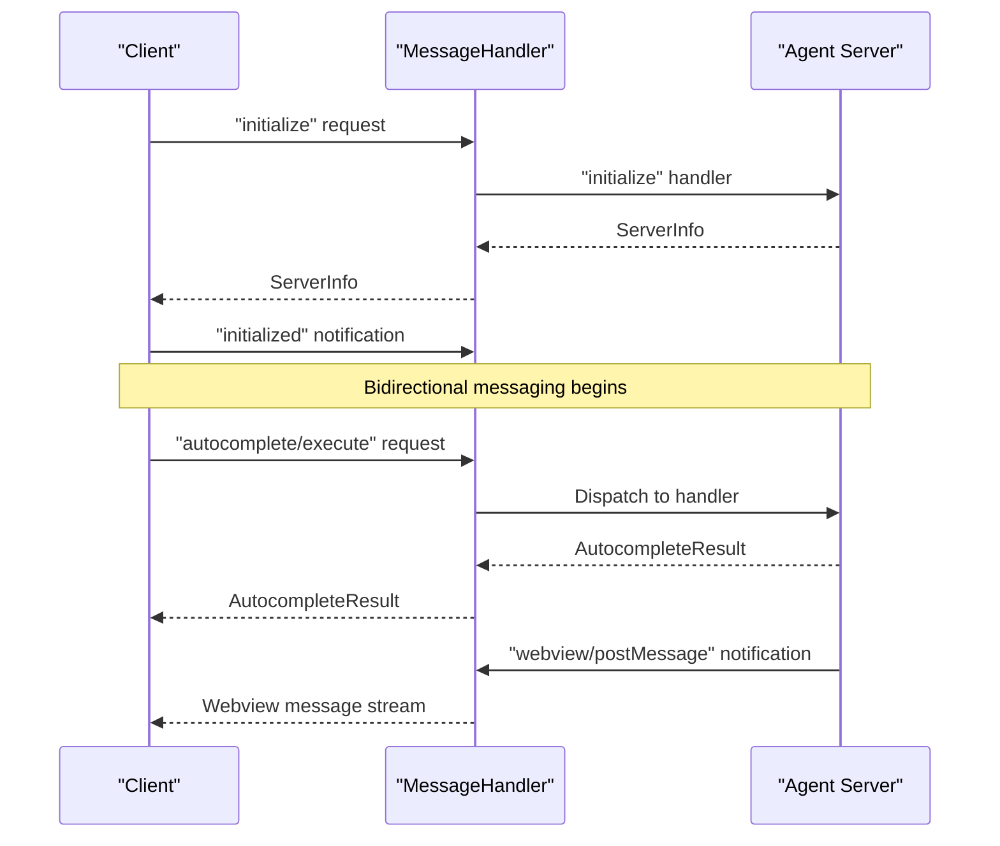
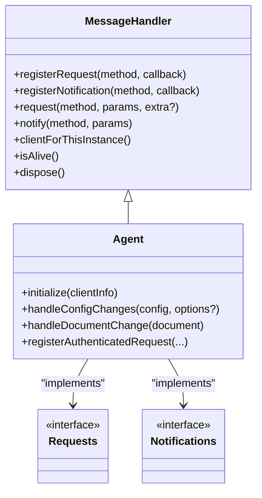
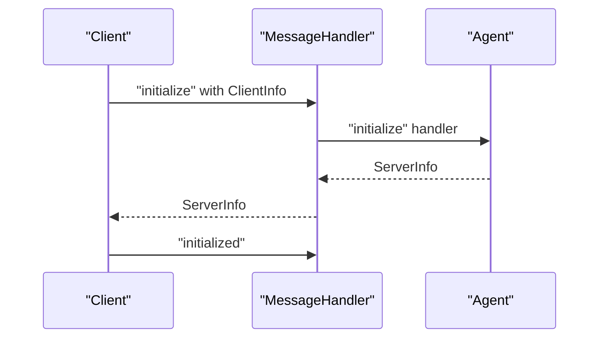
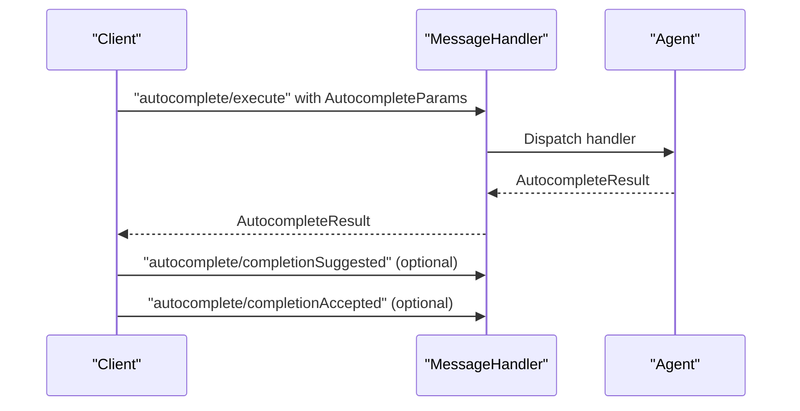
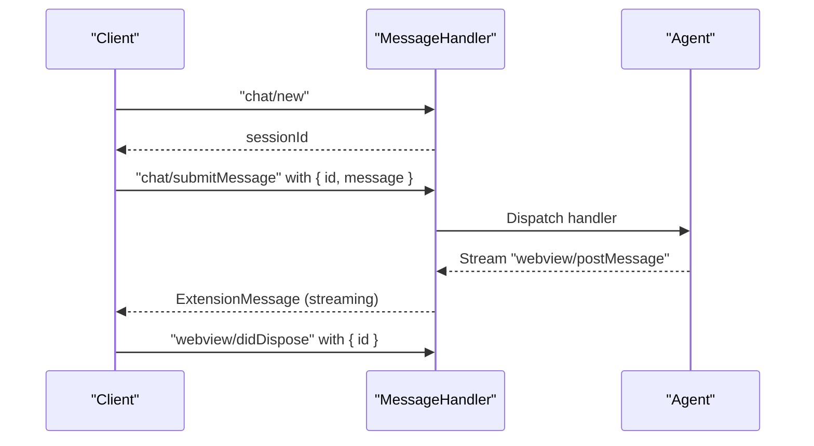
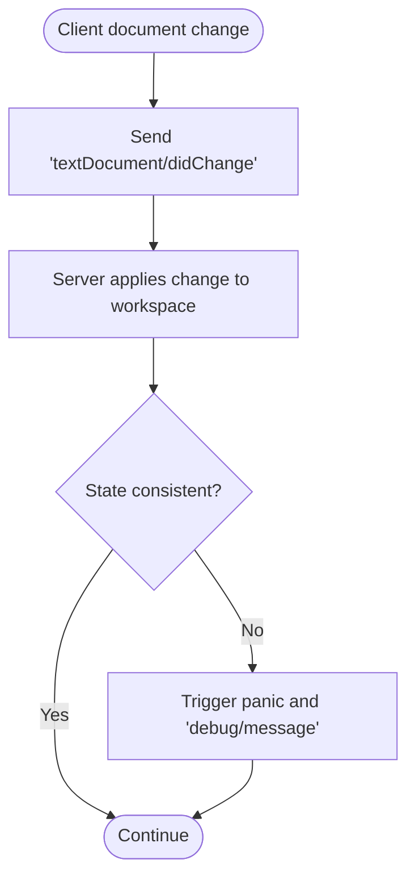
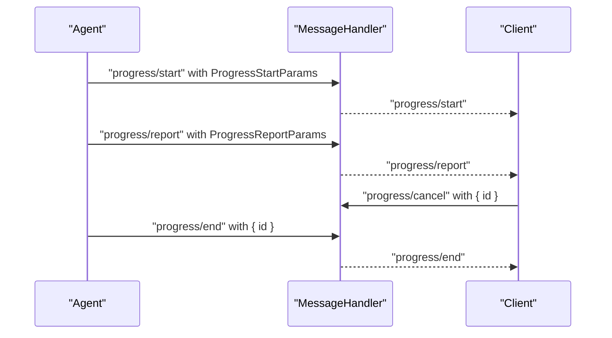
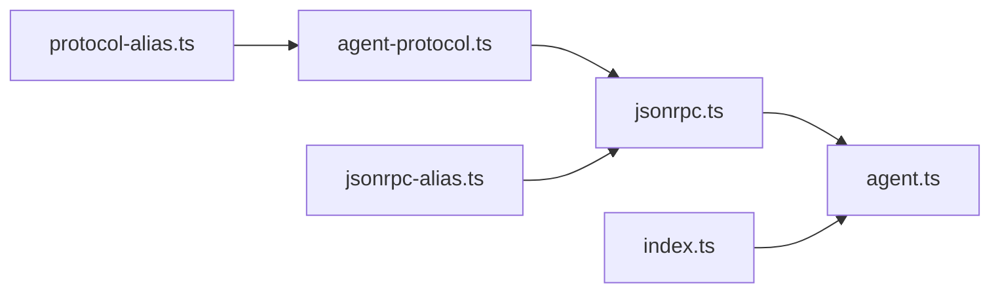

# Agent JSON-RPC Protocol

<cite>
**Referenced Files in This Document**
- [protocol.md](file://agent/protocol.md)
- [agent-protocol.ts](file://vscode/src/jsonrpc/agent-protocol.ts)
- [jsonrpc.ts](file://vscode/src/jsonrpc/jsonrpc.ts)
- [CodyJsonRpcErrorCode.ts](file://vscode/src/jsonrpc/CodyJsonRpcErrorCode.ts)
- [agent.ts](file://agent/src/agent.ts)
- [README.md](file://agent/README.md)
- [index.ts](file://agent/src/index.ts)
- [jsonrpc-alias.ts](file://agent/src/jsonrpc-alias.ts)
- [protocol-alias.ts](file://agent/src/protocol-alias.ts)
</cite>

## Table of Contents
1. [Introduction](#introduction)
2. [Project Structure](#project-structure)
3. [Core Components](#core-components)
4. [Architecture Overview](#architecture-overview)
5. [Detailed Component Analysis](#detailed-component-analysis)
6. [Dependency Analysis](#dependency-analysis)
7. [Performance Considerations](#performance-considerations)
8. [Troubleshooting Guide](#troubleshooting-guide)
9. [Conclusion](#conclusion)
10. [Appendices](#appendices)

## Introduction
This document specifies the Cody Agent JSON-RPC protocol used by non-ECMAScript clients (such as JetBrains and Neovim plugins) to communicate with the Cody agent process over stdin/stdout. The protocol is a bidirectional, peer-to-peer JSON-RPC 2.0 interface aligned with the Language Server Protocol (LSP) base specification. It defines a comprehensive set of requests, notifications, and server-initiated requests that enable features such as autocomplete, chat, code actions, document editing, progress reporting, and webview messaging.

The protocol’s single source of truth is the TypeScript definition file that enumerates all methods, parameter shapes, and return types. The agent runtime implements handlers for these methods and exposes a MessageHandler abstraction to register callbacks for requests and notifications.

## Project Structure
The protocol is defined and implemented across a few key locations:
- Protocol definitions: TypeScript interfaces and method signatures
- JSON-RPC runtime: request/notification registration and dispatch
- Agent server: method handlers and lifecycle management
- Agent client bootstrap: process spawning and initialization handshake

**Diagram sources**
- [agent.ts](file://agent/src/agent.ts)
- [jsonrpc.ts](file://vscode/src/jsonrpc/jsonrpc.ts)
- [CodyJsonRpcErrorCode.ts](file://vscode/src/jsonrpc/CodyJsonRpcErrorCode.ts)
- [agent-protocol.ts](file://vscode/src/jsonrpc/agent-protocol.ts)
- [protocol.md](file://agent/protocol.md)
- [index.ts](file://agent/src/index.ts)
- [jsonrpc-alias.ts](file://agent/src/jsonrpc-alias.ts)
- [protocol-alias.ts](file://agent/src/protocol-alias.ts)

**Section sources**
- [agent-protocol.ts](file://vscode/src/jsonrpc/agent-protocol.ts)
- [agent.ts](file://agent/src/agent.ts)
- [README.md](file://agent/README.md)

## Core Components
- Requests: Client-to-server asynchronous methods that return a value. Examples include initialization, autocomplete execution, GraphQL queries, telemetry recording, and webview message submission.
- Notifications: Client-to-server fire-and-forget messages for continuous streams (e.g., document lifecycle, progress cancellation, completion telemetry).
- Server Requests: Methods initiated by the server to the client (e.g., window/showMessage, textDocument/edit, workspace/edit, webview creation).
- Server Notifications: Messages from the server to the client (e.g., debug messages, progress updates, webview postMessage, authentication status updates).
- MessageHandler: A thin wrapper around vscode-jsonrpc’s MessageConnection that registers request/notification handlers, dispatches calls, and converts errors to standardized JSON-RPC error codes.

Key protocol traits:
- Transport: stdin/stdout only.
- Directionality: Peer-to-peer; both sides can send requests and notifications.
- Synchronization: Document and workspace state is synchronized via notifications; clients must keep state consistent with server expectations.

**Section sources**
- [agent-protocol.ts](file://vscode/src/jsonrpc/agent-protocol.ts)
- [jsonrpc.ts](file://vscode/src/jsonrpc/jsonrpc.ts)
- [protocol.md](file://agent/protocol.md)

## Architecture Overview
The agent runtime listens on stdin/stdout, registers handlers for all protocol methods, and exposes a MessageHandler to clients. The client initializes the agent, waits for the handshake, and then exchanges bidirectional messages for features like autocomplete, chat, and document edits.

**Diagram sources**
- [agent.ts](file://agent/src/agent.ts)
- [jsonrpc.ts](file://vscode/src/jsonrpc/jsonrpc.ts)
- [agent-protocol.ts](file://vscode/src/jsonrpc/agent-protocol.ts)

## Detailed Component Analysis

### Protocol Methods Catalog
Below is a categorized summary of all JSON-RPC methods. Each entry lists the method name, direction, parameter shape, and return value shape. For precise definitions, refer to the protocol definitions.

- Initialization and lifecycle
  - initialize: Client → Server. Params: ClientInfo. Returns: ServerInfo.
  - initialized: Client → Server. No params. No return.
  - shutdown: Client → Server. No params. No return.
  - exit: Client → Server. No params. No return.

- Chat and webview
  - chat/new: Client → Server. No params. Returns: string (session id).
  - chat/web/new: Client → Server. No params. Returns: { panelId: string; chatId: string }.
  - chat/sidebar/new: Client → Server. No params. Returns: { panelId: string; chatId: string }.
  - chat/delete: Client → Server. Params: { chatId: string }. Returns: ChatExportResult[].
  - chat/models: Client → Server. Params: { modelUsage: ModelUsage }. Returns: { readOnly: boolean; models: ModelAvailabilityStatus[] }.
  - chat/export: Client → Server. Params: null | { fullHistory: boolean }. Returns: ChatExportResult[].
  - chat/import: Client → Server. Params: { history: Record<string, Record<string, SerializedChatTranscript>>; merge: boolean }. Returns: null.
  - chat/submitMessage: Client → Server. Params: { id: string; message: WebviewMessage }. Returns: ExtensionMessage.
  - chat/editMessage: Client → Server. Params: { id: string; message: WebviewMessage }. Returns: ExtensionMessage.
  - chat/setModel: Client → Server. Params: { id: string; model: Model['id'] }. Returns: null.
  - webview/didDispose: Client → Server. Params: { id: string }. Returns: null.
  - webview/resolveWebviewView: Client → Server. Params: { viewId: string; webviewHandle: string }. Returns: null.
  - webview/receiveMessage: Client → Server. Params: { id: string; message: WebviewMessage }. Returns: null.
  - webview/receiveMessageStringEncoded: Client → Server. Params: { id: string; messageStringEncoded: string }. Returns: null.

- Commands and tasks
  - commands/explain: Client → Server. No params. Returns: string (panel id).
  - commands/smell: Client → Server. No params. Returns: string (panel id).
  - commands/custom: Client → Server. Params: { key: string }. Returns: CustomCommandResult.
  - customCommands/list: Client → Server. No params. Returns: CodyCommand[].
  - editTask/start: Client → Server. No params. Returns: FixupTaskID | undefined | null.
  - editTask/accept: Client → Server. Params: FixupTaskID. Returns: null.
  - editTask/undo: Client → Server. Params: FixupTaskID. Returns: null.
  - editTask/cancel: Client → Server. Params: FixupTaskID. Returns: null.
  - editTask/retry: Client → Server. Params: FixupTaskID. Returns: FixupTaskID | undefined | null.
  - editTask/getTaskDetails: Client → Server. Params: FixupTaskID. Returns: EditTask.
  - editTask/getFoldingRanges: Client → Server. Params: GetFoldingRangeParams. Returns: GetFoldingRangeResult.
  - codeActions/provide: Client → Server. Params: { location: ProtocolLocation; triggerKind: CodeActionTriggerKind }. Returns: { codeActions: ProtocolCodeAction[] }.
  - codeActions/trigger: Client → Server. Params: FixupTaskID. Returns: FixupTaskID | undefined | null.

- Autocomplete
  - autocomplete/execute: Client → Server. Params: AutocompleteParams. Returns: AutocompleteResult.
  - autocomplete/clearLastCandidate: Client → Server. No params.
  - autocomplete/completionSuggested: Client → Server. Params: CompletionItemParams.
  - autocomplete/completionAccepted: Client → Server. Params: CompletionItemParams.

- GraphQL and configuration
  - graphql/getRepoIds: Client → Server. Params: { names: string[]; first: number }. Returns: { repos: { name: string; id: string }[] }.
  - graphql/currentUserId: Client → Server. No params. Returns: string.
  - graphql/currentUserIsPro: Client → Server. No params. Returns: boolean.
  - graphql/getCurrentUserCodySubscription: Client → Server. No params. Returns: CurrentUserCodySubscription | null.
  - graphql/getRepoIdIfEmbeddingExists: Client → Server. Params: { repoName: string }. Returns: string | null.
  - graphql/getRepoId: Client → Server. Params: { repoName: string }. Returns: string | null.
  - extensionConfiguration/change: Client → Server. Params: ExtensionConfiguration. Returns: ProtocolAuthStatus | null.
  - extensionConfiguration/status: Client → Server. No params. Returns: ProtocolAuthStatus | null.
  - extensionConfiguration/getSettingsSchema: Client → Server. No params. Returns: string.
  - extension/reset: Client → Server. No params.

- Diagnostics and attribution
  - diagnostics/publish: Client → Server. Params: { diagnostics: ProtocolDiagnostic[] }. Returns: null.
  - attribution/search: Client → Server. Params: { id: string; snippet: string }. Returns: { error?: string; repoNames: string[]; limitHit: boolean }.
  - ignore/test: Client → Server. Params: { uri: string }. Returns: { policy: 'ignore' | 'use' }.

- Documents and workspace
  - textDocument/didOpen: Client → Server. Params: ProtocolTextDocument.
  - textDocument/didChange: Client → Server. Params: ProtocolTextDocument.
  - textDocument/didFocus: Client → Server. Params: { uri: string }.
  - textDocument/didSave: Client → Server. Params: { uri: string }.
  - textDocument/didRename: Client → Server. Params: { oldUri: string; newUri: string }.
  - textDocument/didClose: Client → Server. Params: ProtocolTextDocument.
  - textDocument/change: Client → Server. Params: ProtocolTextDocument. Returns: { success: boolean }.
  - workspace/didDeleteFiles: Client → Server. Params: DeleteFilesParams.
  - workspace/didCreateFiles: Client → Server. Params: CreateFilesParams.
  - workspace/didRenameFiles: Client → Server. Params: RenameFilesParams.
  - workspaceFolder/didChange: Client → Server. Params: { uris: string[] }.
  - $/cancelRequest: Client → Server. Params: { id: string }.

- Progress and debugging
  - progress/start: Server → Client. Params: ProgressStartParams.
  - progress/report: Server → Client. Params: ProgressReportParams.
  - progress/end: Server → Client. Params: { id: string }.
  - progress/cancel: Client → Server. Params: { id: string }.
  - debug/message: Server → Client. Params: DebugMessage.

- Server-to-client requests and notifications
  - window/showMessage: Server → Client. Params: ShowWindowMessageParams. Returns: string | null.
  - window/showSaveDialog: Server → Client. Params: SaveDialogOptionsParams. Returns: string | undefined | null.
  - textDocument/edit: Server → Client. Params: TextDocumentEditParams. Returns: boolean.
  - textDocument/show: Server → Client. Params: { uri: string; options?: TextDocumentShowOptionsParams }. Returns: boolean.
  - textEditor/selection: Server → Client. Params: { uri: string; selection: Range }. Returns: null.
  - textEditor/revealRange: Server → Client. Params: { uri: string; range: Range }. Returns: null.
  - workspace/edit: Server → Client. Params: WorkspaceEditParams. Returns: boolean.
  - secrets/get: Server → Client. Params: { key: string }. Returns: string | null | undefined.
  - secrets/store: Server → Client. Params: { key: string; value: string }. Returns: null | undefined.
  - secrets/delete: Server → Client. Params: { key: string }. Returns: null | undefined.
  - env/openExternal: Server → Client. Params: { uri: string }. Returns: boolean.
  - editTask/getUserInput: Server → Client. Params: UserEditPromptRequest. Returns: UserEditPromptResult | undefined | null.
  - webview/create: Server → Client. Params: { id: string; data: any }. Returns: null.
  - webview/postMessage: Server → Client. Params: WebviewPostMessageParams.
  - webview/postMessageStringEncoded: Server → Client. Params: { id: string; stringEncodedMessage: string }.
  - webview/registerWebviewViewProvider: Server → Client. Params: { viewId: string; retainContextWhenHidden: boolean }.
  - webview/createWebviewPanel: Server → Client. Params: { handle: string; viewType: string; title: string; showOptions: { preserveFocus: boolean; viewColumn: number }; options: WebviewCreateWebviewPanelOptions }.
  - webview/dispose: Server → Client. Params: { handle: string }.
  - webview/reveal: Server → Client. Params: { handle: string; viewColumn: number; preserveFocus: boolean }.
  - webview/setTitle: Server → Client. Params: { handle: string; title: string }.
  - webview/setIconPath: Server → Client. Params: { handle: string; iconPathUri?: string | null }.
  - webview/setOptions: Server → Client. Params: { handle: string; options: DefiniteWebviewOptions }.
  - webview/setHtml: Server → Client. Params: { handle: string; html: string }.
  - window/didChangeContext: Server → Client. Params: { key: string; value?: string | undefined | null }.
  - window/focusSidebar: Server → Client. No params.
  - authStatus/didUpdate: Server → Client. Params: ProtocolAuthStatus.

- Testing methods (client → server)
  - testing/progress: Client → Server. Params: { title: string }. Returns: { result: string }.
  - testing/exportedTelemetryEvents: Client → Server. No params. Returns: { events: TestingTelemetryEvent[] }.
  - testing/networkRequests: Client → Server. No params. Returns: { requests: NetworkRequest[] }.
  - testing/requestErrors: Client → Server. No params. Returns: { errors: NetworkRequest[] }.
  - testing/closestPostData: Client → Server. Params: { url: string; postData: string }. Returns: { closestBody: string }.
  - testing/memoryUsage: Client → Server. No params. Returns: { usage: MemoryUsage }.
  - testing/heapdump: Client → Server. No params.
  - testing/awaitPendingPromises: Client → Server. No params.
  - testing/workspaceDocuments: Client → Server. Params: GetDocumentsParams. Returns: GetDocumentsResult.
  - testing/diagnostics: Client → Server. Params: { uri: string }. Returns: { diagnostics: ProtocolDiagnostic[] }.
  - testing/progressCancelation: Client → Server. Params: { title: string }. Returns: { result: string }.
  - testing/reset: Client → Server. No params.
  - testing/autocomplete/completionEvent: Client → Server. Params: CompletionItemParams. Returns: CompletionBookkeepingEvent | undefined | null.
  - testing/autocomplete/autoeditEvent: Client → Server. Params: CompletionItemParams. Returns: AutoeditRequestStateForAgentTesting | undefined | null.
  - testing/autocomplete/awaitPendingVisibilityTimeout: Client → Server. No params. Returns: CompletionItemID | undefined.
  - testing/autocomplete/setCompletionVisibilityDelay: Client → Server. Params: { delay: number }. Returns: null.
  - testing/autocomplete/providerConfig: Client → Server. No params. Returns: { id: string; legacyModel: string; configSource: string } | null | undefined.
  - testing/ignore/overridePolicy: Client → Server. Params: ContextFilters | null. Returns: null.
  - testing/runInAgent: Client → Server. Params: string.

- Internal methods (client → server)
  - internal/getAuthHeaders: Client → Server. Params: string. Returns: Record<string, string>.

Notes:
- Many methods are documented in the human-readable catalog and include descriptions and parameter/return shapes.
- Some methods are marked as testing-only and should not be relied upon in production clients.

**Section sources**
- [protocol.md](file://agent/protocol.md)
- [agent-protocol.ts](file://vscode/src/jsonrpc/agent-protocol.ts)

### Data Models and Types
Representative types used across the protocol include:
- ClientInfo, ServerInfo: Handshake metadata.
- ExtensionConfiguration: Endpoint, credentials, headers, and client-specific settings.
- ProtocolAuthStatus: Authentication state with discriminated union for authenticated/unauthenticated.
- ProtocolTextDocument and variants: Document lifecycle and content change notifications.
- Range and Position: Zero-indexed text positions.
- TelemetryEvent: Event recording payload.
- WorkspaceEditOperation and TextEdit variants: File and text edits.
- AutocompleteParams and AutocompleteResult: Inline completion input and output.
- ProgressStartParams, ProgressReportParams: Progress reporting.
- WebviewPostMessageParams: Streaming chat updates.
- EditTask and related types: Non-stop edit task state and controls.

These types are defined precisely in the protocol definitions and are the canonical schema for all JSON-RPC payloads.

**Section sources**
- [agent-protocol.ts](file://vscode/src/jsonrpc/agent-protocol.ts)

### MessageHandler and Error Handling
MessageHandler wraps a MessageConnection and provides:
- registerRequest: Registers a handler for a request method.
- registerNotification: Registers a handler for a notification method.
- request: Sends a request and awaits a response.
- notify: Sends a notification.
- clientForThisInstance: In-process client for direct invocation.
- Error customization: Converts thrown errors into ResponseError with standardized codes.

Standardized error codes:
- ParseError, InvalidRequest, MethodNotFound, InvalidParams, InternalError, RequestCanceled, RateLimitError.

**Section sources**
- [jsonrpc.ts](file://vscode/src/jsonrpc/jsonrpc.ts)
- [CodyJsonRpcErrorCode.ts](file://vscode/src/jsonrpc/CodyJsonRpcErrorCode.ts)

### Agent Server Implementation
The agent server:
- Initializes VS Code extension shim and global state.
- Registers handlers for all protocol methods.
- Manages document/workspace state, webviews, code lenses, diagnostics, and progress.
- Supports authentication, secrets, and telemetry.
- Exposes testing endpoints for deterministic behavior and diagnostics.

Initialization flow:
- Client sends initialize with ClientInfo.
- Server responds with ServerInfo and auth status.
- Client sends initialized.
- Bidirectional messaging proceeds.

**Section sources**
- [agent.ts](file://agent/src/agent.ts)

## Architecture Overview

**Diagram sources**
- [jsonrpc.ts](file://vscode/src/jsonrpc/jsonrpc.ts)
- [agent.ts](file://agent/src/agent.ts)
- [agent-protocol.ts](file://vscode/src/jsonrpc/agent-protocol.ts)

## Detailed Component Analysis

### Initialization and Handshake
- Client sends initialize with ClientInfo (name, version, IDE version, workspace root, capabilities, optional extension configuration).
- Server responds with ServerInfo (name, authenticated flag, auth status).
- Client sends initialized.
- After this, the client may subscribe to server notifications (e.g., webview/postMessage, progress/*, debug/message).

**Diagram sources**
- [agent.ts](file://agent/src/agent.ts)
- [jsonrpc.ts](file://vscode/src/jsonrpc/jsonrpc.ts)

**Section sources**
- [agent.ts](file://agent/src/agent.ts)

### Autocomplete Flow
- Client sends autocomplete/execute with position and optional trigger kind.
- Server computes inline completions and returns AutocompleteResult with items and decorated edit items.
- Client may send completion telemetry notifications (completionSuggested, completionAccepted).

**Diagram sources**
- [agent.ts](file://agent/src/agent.ts)
- [agent-protocol.ts](file://vscode/src/jsonrpc/agent-protocol.ts)

**Section sources**
- [agent.ts](file://agent/src/agent.ts)
- [agent-protocol.ts](file://vscode/src/jsonrpc/agent-protocol.ts)

### Chat and Webview Messaging
- Client starts a chat session with chat/new and receives a session id.
- Client submits messages via chat/submitMessage; server streams replies via webview/postMessage.
- Client disposes webviews with webview/didDispose.

**Diagram sources**
- [agent.ts](file://agent/src/agent.ts)
- [agent-protocol.ts](file://vscode/src/jsonrpc/agent-protocol.ts)

**Section sources**
- [agent.ts](file://agent/src/agent.ts)
- [agent-protocol.ts](file://vscode/src/jsonrpc/agent-protocol.ts)

### Document Synchronization
- Client notifies server of document lifecycle changes (open, change, focus, save, close, rename).
- Server maintains an in-memory workspace and can request document changes via textDocument/change.
- Tests can assert synchronization via testing/workspaceDocuments.

**Diagram sources**
- [agent.ts](file://agent/src/agent.ts)
- [agent-protocol.ts](file://vscode/src/jsonrpc/agent-protocol.ts)

**Section sources**
- [agent.ts](file://agent/src/agent.ts)
- [agent-protocol.ts](file://vscode/src/jsonrpc/agent-protocol.ts)

### Progress Reporting
- Server initiates progress with progress/start and reports progress via progress/report.
- Client may cancel progress via progress/cancel.
- Server ends progress with progress/end.

**Diagram sources**
- [agent.ts](file://agent/src/agent.ts)
- [agent-protocol.ts](file://vscode/src/jsonrpc/agent-protocol.ts)

**Section sources**
- [agent.ts](file://agent/src/agent.ts)
- [agent-protocol.ts](file://vscode/src/jsonrpc/agent-protocol.ts)

## Dependency Analysis

**Diagram sources**
- [agent-protocol.ts](file://vscode/src/jsonrpc/agent-protocol.ts)
- [jsonrpc.ts](file://vscode/src/jsonrpc/jsonrpc.ts)
- [agent.ts](file://agent/src/agent.ts)
- [index.ts](file://agent/src/index.ts)
- [jsonrpc-alias.ts](file://agent/src/jsonrpc-alias.ts)
- [protocol-alias.ts](file://agent/src/protocol-alias.ts)

**Section sources**
- [agent-protocol.ts](file://vscode/src/jsonrpc/agent-protocol.ts)
- [jsonrpc.ts](file://vscode/src/jsonrpc/jsonrpc.ts)
- [agent.ts](file://agent/src/agent.ts)
- [index.ts](file://agent/src/index.ts)

## Performance Considerations
- Minimize frequent textDocument/didChange notifications; coalesce changes when possible.
- Use progress/report with incremental percentages to avoid flooding the client.
- Avoid unnecessary webview postMessage bursts; batch updates when feasible.
- Leverage cancellation tokens for long-running requests to reduce wasted work.
- Keep extensionConfiguration consistent to prevent repeated authentication retries.

## Troubleshooting Guide
Common issues and remedies:
- Protocol mismatch: Verify method names and parameter shapes against the protocol definitions.
- Authentication failures: Use extensionConfiguration/change to update credentials; monitor authStatus/didUpdate.
- Document sync panics: Ensure textDocument notifications are sent consistently; use testing/workspaceDocuments to validate state.
- Rate limits: Expect RateLimitError responses; back off and retry with exponential delays.
- Debugging: Enable CODY_AGENT_TRACE_PATH to capture all JSON-RPC messages; use testing/exportedTelemetryEvents for telemetry inspection.

**Section sources**
- [README.md](file://agent/README.md)
- [CodyJsonRpcErrorCode.ts](file://vscode/src/jsonrpc/CodyJsonRpcErrorCode.ts)
- [agent.ts](file://agent/src/agent.ts)

## Conclusion
The Cody Agent JSON-RPC protocol provides a robust, bidirectional interface for integrating non-ECMAScript clients with Cody. Its peer-to-peer design, comprehensive method catalog, and strict type definitions enable reliable autocomplete, chat, editing, and diagnostics workflows. Clients should adhere to the initialization handshake, maintain accurate document state, and leverage standardized error handling and progress reporting for a smooth user experience.

## Appendices

### A. Client Implementation Guidelines
- Transport: Spawn the agent executable and communicate over stdin/stdout.
- Initialization: Send initialize with ClientInfo and wait for ServerInfo; then send initialized.
- Subscriptions: Register handlers for server notifications (webview/postMessage, progress/*, debug/message).
- Requests: Use MessageHandler.request for all client-to-server methods; handle ResponseError with standardized codes.
- Testing: Use testing/* methods to validate behavior and inspect telemetry/network activity.

**Section sources**
- [README.md](file://agent/README.md)
- [index.ts](file://agent/src/index.ts)
- [jsonrpc.ts](file://vscode/src/jsonrpc/jsonrpc.ts)

### B. Protocol Evolution and Versioning
- The protocol is defined in TypeScript and is the single source of truth.
- Breaking changes may occur without notice; clients should pin versions and monitor updates.
- Use testing modes and recordings to validate compatibility during upgrades.

**Section sources**
- [README.md](file://agent/README.md)
- [protocol.md](file://agent/protocol.md)