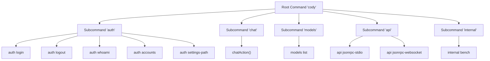
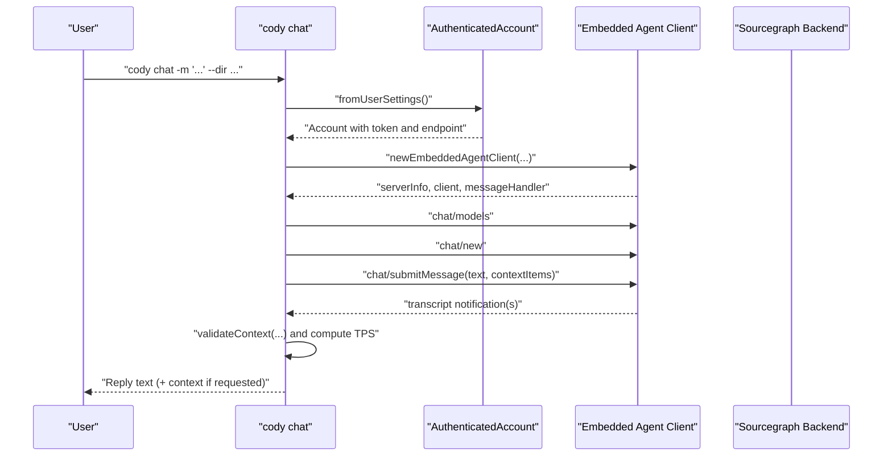
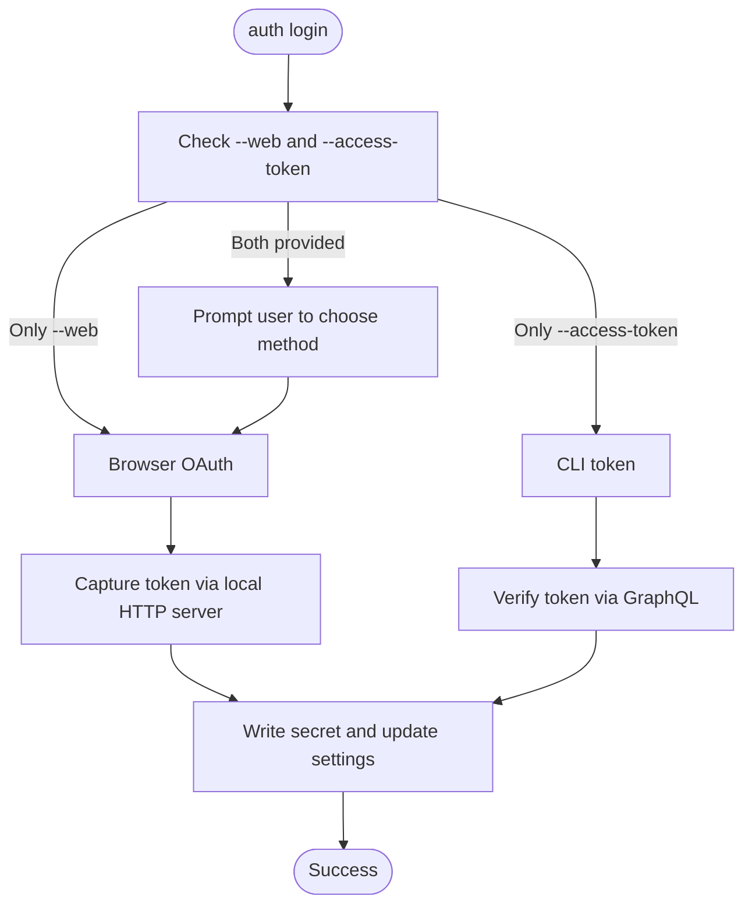
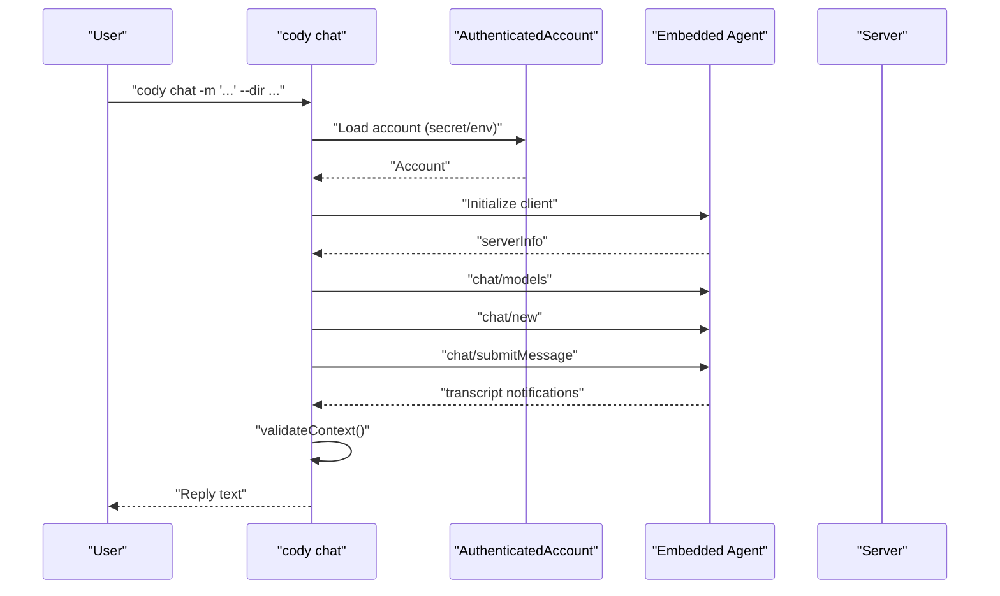
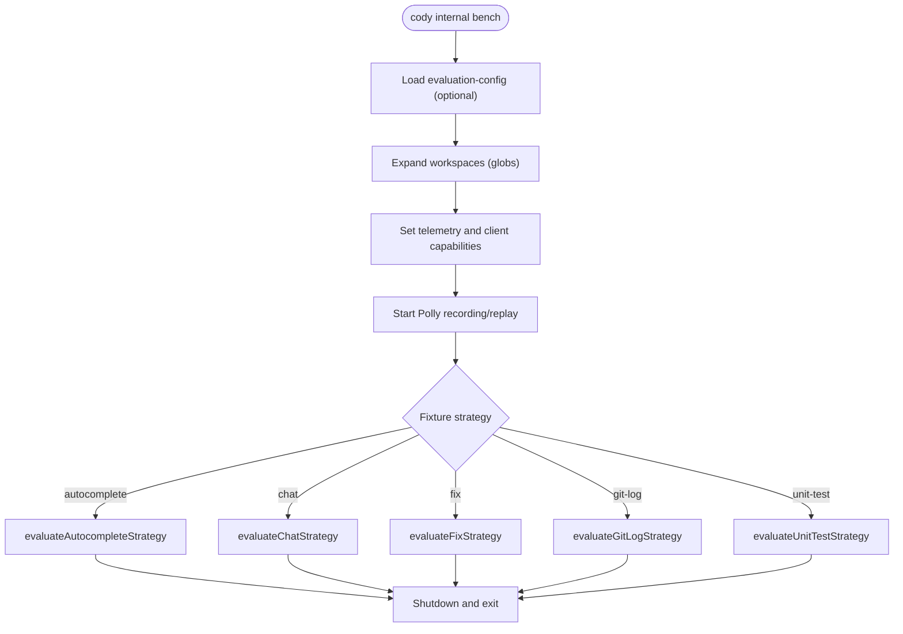
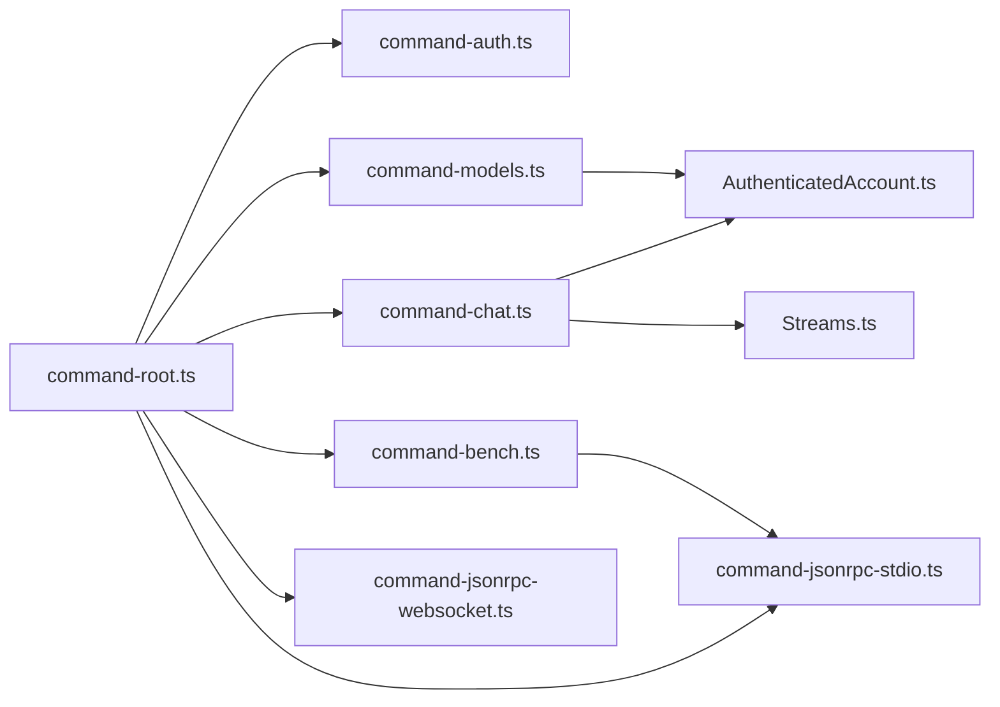

# CLI Command Interface

<cite>
**Referenced Files in This Document**
- [command-root.ts](file://agent/src/cli/command-root.ts)
- [command-chat.ts](file://agent/src/cli/command-chat.ts)
- [command-models.ts](file://agent/src/cli/command-models.ts)
- [command-auth.ts](file://agent/src/cli/command-auth/command-auth.ts)
- [command-login.ts](file://agent/src/cli/command-auth/command-login.ts)
- [command-logout.ts](file://agent/src/cli/command-auth/command-logout.ts)
- [command-accounts.ts](file://agent/src/cli/command-auth/command-accounts.ts)
- [command-whoami.ts](file://agent/src/cli/command-auth/command-whoami.ts)
- [AuthenticatedAccount.ts](file://agent/src/cli/command-auth/AuthenticatedAccount.ts)
- [command-bench.ts](file://agent/src/cli/command-bench/command-bench.ts)
- [command-jsonrpc-stdio.ts](file://agent/src/cli/command-jsonrpc-stdio.ts)
- [command-jsonrpc-websocket.ts](file://agent/src/cli/command-jsonrpc-websocket.ts)
- [Streams.ts](file://agent/src/cli/Streams.ts)
</cite>

## Table of Contents
1. [Introduction](#introduction)
2. [Project Structure](#project-structure)
3. [Core Components](#core-components)
4. [Architecture Overview](#architecture-overview)
5. [Detailed Component Analysis](#detailed-component-analysis)
6. [Dependency Analysis](#dependency-analysis)
7. [Performance Considerations](#performance-considerations)
8. [Troubleshooting Guide](#troubleshooting-guide)
9. [Conclusion](#conclusion)
10. [Appendices](#appendices)

## Introduction
This document describes the Cody CLI command interface. It covers all available commands, their syntax, parameters, options, and usage examples. It also documents authentication commands, chat operations, model management, and benchmarking utilities. You will learn command execution patterns, output formatting, error reporting, environment variables, configuration options, platform-specific considerations, troubleshooting, performance optimization, and scripting/batch integration patterns.

## Project Structure
The CLI is organized under agent/src/cli with a root command that aggregates subcommands:
- Root command registers auth, chat, models, api (jsonrpc-stdio and jsonrpc-websocket), and internal bench.
- Authentication subcommands: login, logout, whoami, accounts, settings-path.
- Chat command supports message input via flags, stdin, or arguments, with optional context files and repositories.
- Models list command fetches supported model IDs from the Sourcegraph instance.
- Bench command runs headless evaluations across strategies (autocomplete, chat, fix, git-log, unit-test).
- API subcommands expose JSON-RPC over stdio and websocket (currently non-functional).

**Diagram sources**
- [command-root.ts:12-23](file://agent/src/cli/command-root.ts#L12-L23)
- [command-auth.ts:8-27](file://agent/src/cli/command-auth/command-auth.ts#L8-L27)
- [command-chat.ts:45-110](file://agent/src/cli/command-chat.ts#L45-L110)
- [command-models.ts:14-51](file://agent/src/cli/command-models.ts#L14-L51)
- [command-bench.ts:146-367](file://agent/src/cli/command-bench/command-bench.ts#L146-L367)
- [command-jsonrpc-stdio.ts:61-179](file://agent/src/cli/command-jsonrpc-stdio.ts#L61-L179)
- [command-jsonrpc-websocket.ts:12-55](file://agent/src/cli/command-jsonrpc-websocket.ts#L12-L55)

**Section sources**
- [command-root.ts:12-23](file://agent/src/cli/command-root.ts#L12-L23)

## Core Components
- Root command defines the CLI name, version, description, and registers subcommands.
- Auth subcommands manage credentials and active account state.
- Chat command orchestrates authentication, context assembly, message submission, and output.
- Models list retrieves supported model IDs from the Sourcegraph instance.
- Bench command runs headless evaluations with configurable strategies and filters.
- API subcommands expose JSON-RPC communication channels for integration.

**Section sources**
- [command-root.ts:12-23](file://agent/src/cli/command-root.ts#L12-L23)
- [command-auth.ts:8-27](file://agent/src/cli/command-auth/command-auth.ts#L8-L27)
- [command-chat.ts:28-43](file://agent/src/cli/command-chat.ts#L28-L43)
- [command-models.ts:9-12](file://agent/src/cli/command-models.ts#L9-L12)
- [command-bench.ts:33-74](file://agent/src/cli/command-bench/command-bench.ts#L33-L74)
- [command-jsonrpc-stdio.ts:13-21](file://agent/src/cli/command-jsonrpc-stdio.ts#L13-L21)

## Architecture Overview
The CLI initializes an embedded agent client, authenticates via stored secrets or environment variables, and communicates with the Sourcegraph backend using JSON-RPC. The chat flow updates a spinner with model progress, validates context sizes, and prints the final reply. Benchmarking runs multiple strategies in parallel with Polly-based network recording/replay.

**Diagram sources**
- [command-chat.ts:82-336](file://agent/src/cli/command-chat.ts#L82-L336)
- [AuthenticatedAccount.ts:89-127](file://agent/src/cli/command-auth/AuthenticatedAccount.ts#L89-L127)

**Section sources**
- [command-chat.ts:128-336](file://agent/src/cli/command-chat.ts#L128-L336)
- [AuthenticatedAccount.ts:19-127](file://agent/src/cli/command-auth/AuthenticatedAccount.ts#L19-L127)

## Detailed Component Analysis

### Authentication Commands
- auth login
  - Options: --web, --access-token, --endpoint.
  - Behavior: Prompts for endpoint if not provided; supports browser-based OAuth or manual token input. Writes secret and updates user settings.
  - Environment variables: SRC_ACCESS_TOKEN, SRC_ENDPOINT.
  - Examples:
    - cody auth login --web
    - cody auth login --access-token TOKEN --endpoint https://sg.example.com
- auth logout
  - Options: --access-token, --endpoint.
  - Behavior: Removes active account secret and updates settings; exits if token provided via environment variable.
- auth whoami
  - Options: --access-token, --endpoint.
  - Behavior: Prints active authenticated account.
- auth accounts
  - Options: --access-token, --endpoint.
  - Behavior: Lists all accounts with active and authenticated status.
- auth settings-path
  - Behavior: Prints the path to the user settings JSON file.

**Diagram sources**
- [command-login.ts:44-145](file://agent/src/cli/command-auth/command-login.ts#L44-L145)

**Section sources**
- [command-login.ts:39-86](file://agent/src/cli/command-auth/command-login.ts#L39-L86)
- [command-login.ts:93-194](file://agent/src/cli/command-auth/command-login.ts#L93-L194)
- [command-logout.ts:13-52](file://agent/src/cli/command-auth/command-logout.ts#L13-L52)
- [command-whoami.ts:8-31](file://agent/src/cli/command-auth/command-whoami.ts#L8-L31)
- [command-accounts.ts:12-45](file://agent/src/cli/command-auth/command-accounts.ts#L12-L45)
- [AuthenticatedAccount.ts:89-127](file://agent/src/cli/command-auth/AuthenticatedAccount.ts#L89-L127)

### Chat Operations
- Command: cody chat
- Options:
  - -m, --message <message>: Message to send.
  - --stdin: Read message from stdin.
  - -C, --dir <dir>: Working directory (required).
  - --model <model>: Chat model to use.
  - --context-repo <repos...>: Enterprise-only repository names.
  - --context-file <files...>: Local files to include in context.
  - --show-context: Print context items used in the reply.
  - --ignore-context-window-errors: Skip context size validation.
  - --silent: Disable streaming reply.
  - --debug: Enable debug logging.
  - --access-token, --endpoint: Override authentication.
- Execution:
  - Initializes embedded agent client and verifies authentication.
  - Retrieves available chat models.
  - Submits message with assembled context items.
  - Streams transcript updates, validates context size, and prints final reply with tokens-per-second.
- Output:
  - Reply text to stdout.
  - Optional context list to stdout when --show-context is used.
  - Progress and error messages to stderr via spinner.
- Examples:
  - cody chat -m 'Explain this diff' --context-file README.md
  - git diff | cody chat --stdin -m 'Explain this diff'

**Diagram sources**
- [command-chat.ts:82-336](file://agent/src/cli/command-chat.ts#L82-L336)

**Section sources**
- [command-chat.ts:45-110](file://agent/src/cli/command-chat.ts#L45-L110)
- [command-chat.ts:128-336](file://agent/src/cli/command-chat.ts#L128-L336)
- [command-chat.ts:393-421](file://agent/src/cli/command-chat.ts#L393-L421)

### Model Management
- Command: cody models list
- Options:
  - --access-token, --endpoint: Override authentication.
- Behavior:
  - Authenticates via stored secrets or provided options.
  - Fetches model IDs from the Sourcegraph instance’s LLM models endpoint.
  - Prints each model ID on a separate line to stdout.
- Output:
  - One model ID per line to stdout.

**Section sources**
- [command-models.ts:14-51](file://agent/src/cli/command-models.ts#L14-L51)

### Benchmarking Utilities
- Command: cody internal bench
- Purpose: Headless evaluation of Cody strategies (autocomplete, chat, fix, git-log, unit-test) across workspaces and fixtures.
- Key options:
  - --workspace: Workspace directory.
  - --test-count, --max-file-test-count: Limits for evaluation.
  - --evaluation-config: JSON configuration file to define multiple workspaces and fixtures.
  - --snapshot-directory: Directory for snapshots.
  - Include/exclude filters: --include-workspace, --exclude-workspace, --include-language, --exclude-language, --include-fixture, --exclude-fixture, --include-filepath, --exclude-filepath, --include-match-kind, --exclude-match-kind.
  - Match tuning: --match-minimum-size, --match-skip-singleline, --match-every-n, --match-kind-distribution.
  - Testing aids: --test-typecheck, --test-parse, --insecure-tls.
  - Authentication: --src-access-token (env: SRC_ACCESS_TOKEN), --src-endpoint (env: SRC_ENDPOINT, default: https://sourcegraph.com).
  - Tree-sitter: --tree-sitter-grammars, --queries-directory.
  - Verbose: --verbose.
- Execution:
  - Loads evaluation configuration and expands workspace globs.
  - Starts Polly recording/replay based on environment variables.
  - Initializes telemetry and client capabilities.
  - Runs selected strategy per fixture/workspace and shuts down cleanly.
- Output:
  - CSV path derived from snapshot directory.
  - Logs to stdout/stderr indicating progress and completion.

**Diagram sources**
- [command-bench.ts:298-458](file://agent/src/cli/command-bench/command-bench.ts#L298-L458)

**Section sources**
- [command-bench.ts:146-367](file://agent/src/cli/command-bench/command-bench.ts#L146-L367)
- [command-bench.ts:369-458](file://agent/src/cli/command-bench/command-bench.ts#L369-L458)

### JSON-RPC API Subcommands
- cody api jsonrpc-stdio
  - Description: Interact with the Agent using JSON-RPC via stdout/stdin.
  - Options:
    - --recording-directory (env: CODY_RECORDING_DIRECTORY)
    - --keep-unused-recordings (env: CODY_KEEP_UNUSED_RECORDINGS)
    - --recording-mode (env: CODY_RECORDING_MODE): record, replay, passthrough, stopped, disabled
    - --recording-name (env: CODY_RECORDING_NAME)
    - --recording-expiry-strategy (env: CODY_RECORDING_EXPIRY_STRATEGY): error, warn, record
    - --recording-expires-in (env: CODY_RECORDING_EXPIRES_IN)
    - --record-if-missing (env: CODY_RECORD_IF_MISSING)
  - Behavior: Sets up a JSON-RPC connection over stdio, optionally wraps network traffic with Polly, and ensures agent process exits on stdin/stdout close.
- cody api jsonrpc-websocket
  - Description: Start a server that opens JSON-RPC connections through websockets.
  - Options: --port <number>
  - Behavior: Currently non-functional; logs connection events and attempts to initialize extension configuration.

**Section sources**
- [command-jsonrpc-stdio.ts:61-179](file://agent/src/cli/command-jsonrpc-stdio.ts#L61-L179)
- [command-jsonrpc-websocket.ts:12-55](file://agent/src/cli/command-jsonrpc-websocket.ts#L12-L55)

## Dependency Analysis
- Root command aggregates subcommands and exposes version metadata from package.json.
- Chat depends on:
  - AuthenticatedAccount for credentials resolution.
  - Embedded agent client initialization and JSON-RPC requests.
  - Streams for stdout/stderr routing.
- Models list depends on:
  - AuthenticatedAccount for credentials.
  - HTTP GET to the LLM models endpoint.
- Bench depends on:
  - Polly recording/replay.
  - Strategy evaluators and client initialization.
- API subcommands depend on:
  - JSON-RPC over stdio/websocket.
  - Optional Polly integration for network traffic control.

**Diagram sources**
- [command-root.ts:12-23](file://agent/src/cli/command-root.ts#L12-L23)
- [command-chat.ts:18-26](file://agent/src/cli/command-chat.ts#L18-L26)
- [command-models.ts:4-7](file://agent/src/cli/command-models.ts#L4-L7)
- [command-bench.ts:8-24](file://agent/src/cli/command-bench/command-bench.ts#L8-L24)
- [command-jsonrpc-stdio.ts:10-11](file://agent/src/cli/command-jsonrpc-stdio.ts#L10-L11)

**Section sources**
- [command-root.ts:12-23](file://agent/src/cli/command-root.ts#L12-L23)
- [command-chat.ts:18-26](file://agent/src/cli/command-chat.ts#L18-L26)
- [command-models.ts:4-7](file://agent/src/cli/command-models.ts#L4-L7)
- [command-bench.ts:8-24](file://agent/src/cli/command-bench/command-bench.ts#L8-L24)
- [command-jsonrpc-stdio.ts:10-11](file://agent/src/cli/command-jsonrpc-stdio.ts#L10-L11)

## Performance Considerations
- Streaming and progress:
  - Chat uses an ora spinner to indicate progress and switches to a token-per-second calculation upon receiving the final reply.
- Context validation:
  - Large context files cause early termination with a detailed table of oversized items unless --ignore-context-window-errors is set.
- Benchmarking:
  - Parallel evaluation across workspaces and fixtures.
  - Polly recording/replay reduces variability and speeds up tests.
  - Optional TLS insecure mode for controlled environments.
- Output formatting:
  - Streams class allows stdout/stderr redirection for testing and scripting.

**Section sources**
- [command-chat.ts:172-205](file://agent/src/cli/command-chat.ts#L172-L205)
- [command-chat.ts:393-421](file://agent/src/cli/command-chat.ts#L393-L421)
- [command-bench.ts:360-367](file://agent/src/cli/command-bench/command-bench.ts#L360-L367)
- [Streams.ts:6-28](file://agent/src/cli/Streams.ts#L6-L28)

## Troubleshooting Guide
- Not authenticated:
  - Symptom: “You are not authenticated” or spinner failure.
  - Resolution: Run cody auth login --web or provide --access-token and --endpoint.
- Invalid or missing message:
  - Symptom: Failure to send message when none provided.
  - Resolution: Provide --message or pipe to stdin via --stdin.
- Context too large:
  - Symptom: Failure with a table of oversized context items.
  - Resolution: Remove files from --context-file or reduce file sizes; optionally set --ignore-context-window-errors.
- No directory provided:
  - Symptom: Failure when --dir is missing.
  - Resolution: Specify --dir explicitly.
- JSON-RPC stdio connection issues:
  - Symptom: Agent process not exiting or hanging.
  - Resolution: Ensure stdin/stdout are properly connected; the process exits on close to avoid zombies.
- WebSocket server:
  - Symptom: Non-functional server command.
  - Resolution: Use jsonrpc-stdio for production integration.

**Section sources**
- [command-chat.ts:86-93](file://agent/src/cli/command-chat.ts#L86-L93)
- [command-chat.ts:268-274](file://agent/src/cli/command-chat.ts#L268-L274)
- [command-chat.ts:393-421](file://agent/src/cli/command-chat.ts#L393-L421)
- [command-chat.ts:135-139](file://agent/src/cli/command-chat.ts#L135-L139)
- [command-jsonrpc-stdio.ts:195-207](file://agent/src/cli/command-jsonrpc-stdio.ts#L195-L207)
- [command-jsonrpc-websocket.ts:12-55](file://agent/src/cli/command-jsonrpc-websocket.ts#L12-L55)

## Conclusion
The Cody CLI provides a robust, extensible command interface for authentication, chat, model management, and benchmarking. It integrates with Sourcegraph backends securely, supports streaming and context-aware replies, and offers powerful headless evaluation capabilities. Proper use of environment variables, context filtering, and Polly-based recording enables reliable automation and performance optimization.

## Appendices

### Command Reference Summary
- cody auth
  - login: Authenticate via browser or token.
  - logout: Remove active account credentials.
  - whoami: Show active authenticated account.
  - accounts: List all accounts and statuses.
  - settings-path: Print user settings JSON path.
- cody chat
  - Options: -m, --stdin, -C, --model, --context-repo, --context-file, --show-context, --ignore-context-window-errors, --silent, --debug, --access-token, --endpoint.
- cody models list
  - Options: --access-token, --endpoint.
- cody internal bench
  - Options: workspace, test-count, max-file-test-count, evaluation-config, snapshot-directory, include/exclude filters, match tuning, test-typecheck, test-parse, insecure-tls, src-access-token, src-endpoint, tree-sitter-grammars, queries-directory, verbose.
- cody api
  - jsonrpc-stdio: JSON-RPC over stdio with Polly recording controls.
  - jsonrpc-websocket: JSON-RPC over websocket (non-functional).

**Section sources**
- [command-auth.ts:8-27](file://agent/src/cli/command-auth/command-auth.ts#L8-L27)
- [command-chat.ts:45-110](file://agent/src/cli/command-chat.ts#L45-L110)
- [command-models.ts:14-51](file://agent/src/cli/command-models.ts#L14-L51)
- [command-bench.ts:146-367](file://agent/src/cli/command-bench/command-bench.ts#L146-L367)
- [command-jsonrpc-stdio.ts:61-179](file://agent/src/cli/command-jsonrpc-stdio.ts#L61-L179)
- [command-jsonrpc-websocket.ts:12-55](file://agent/src/cli/command-jsonrpc-websocket.ts#L12-L55)

### Environment Variables
- Authentication:
  - SRC_ACCESS_TOKEN: Access token for login/logout/whoami.
  - SRC_ENDPOINT: Sourcegraph instance URL for login/logout/whoami.
- Benchmarking:
  - SRC_ACCESS_TOKEN: Sourcegraph access token for evaluation.
  - SRC_ENDPOINT: Sourcegraph endpoint for evaluation.
  - CODY_RECORDING_MODE: Recording mode for Polly (record, replay, passthrough, stopped, disabled).
  - CODY_RECORDING_DIRECTORY: Directory for Polly recordings.
  - CODY_RECORDING_NAME: Recording name for Polly.
  - CODY_RECORDING_EXPIRY_STRATEGY: Expiry strategy for Polly.
  - CODY_RECORDING_EXPIRES_IN: Expiration duration for Polly.
  - CODY_KEEP_UNUSED_RECORDINGS: Keep unused recordings.
  - CODY_RECORD_IF_MISSING: Fail or record if missing.
- JSON-RPC stdio:
  - CODY_AGENT_DEBUG_REMOTE: Enable debug server.
  - CODY_AGENT_DEBUG_PORT: Debug server port (default 3113).

**Section sources**
- [command-login.ts:24-33](file://agent/src/cli/command-auth/command-login.ts#L24-L33)
- [command-bench.ts:217-226](file://agent/src/cli/command-bench/command-bench.ts#L217-L226)
- [command-bench.ts:338-346](file://agent/src/cli/command-bench/command-bench.ts#L338-L346)
- [command-jsonrpc-stdio.ts:56-114](file://agent/src/cli/command-jsonrpc-stdio.ts#L56-L114)

### Scripting and Batch Integration Patterns
- Pipe stdin to chat:
  - git diff | cody chat --stdin -m 'Explain this diff'
- Batch model listing:
  - cody models list | while read model; do echo "Using $model"; done
- Headless benchmarking:
  - cody internal bench --evaluation-config ./eval.json --snapshot-directory ./snapshots
- JSON-RPC integration:
  - Use cody api jsonrpc-stdio for editor integrations requiring JSON-RPC over stdio.

**Section sources**
- [command-chat.ts:353-376](file://agent/src/cli/command-chat.ts#L353-L376)
- [command-models.ts:43-48](file://agent/src/cli/command-models.ts#L43-L48)
- [command-bench.ts:298-367](file://agent/src/cli/command-bench/command-bench.ts#L298-L367)
- [command-jsonrpc-stdio.ts:61-179](file://agent/src/cli/command-jsonrpc-stdio.ts#L61-L179)