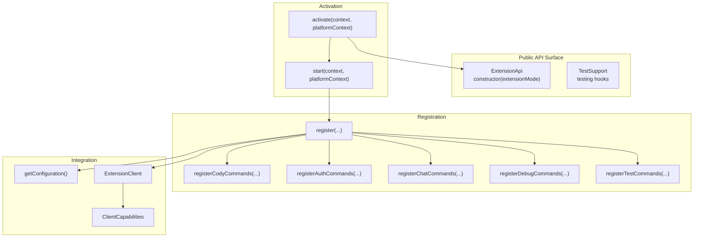
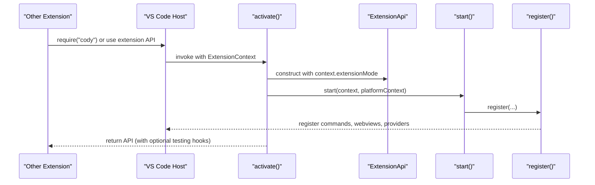
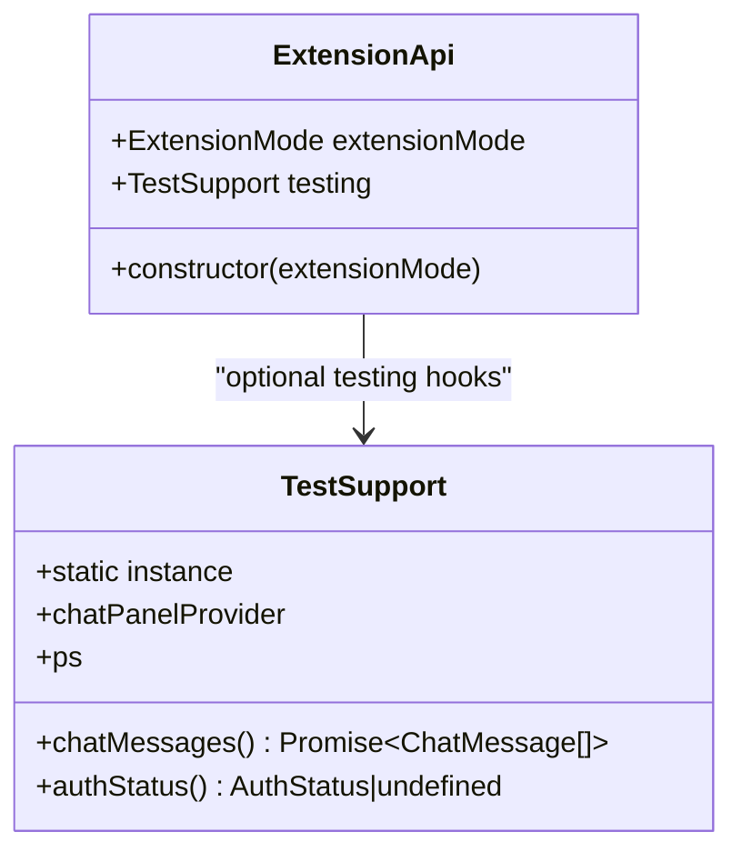
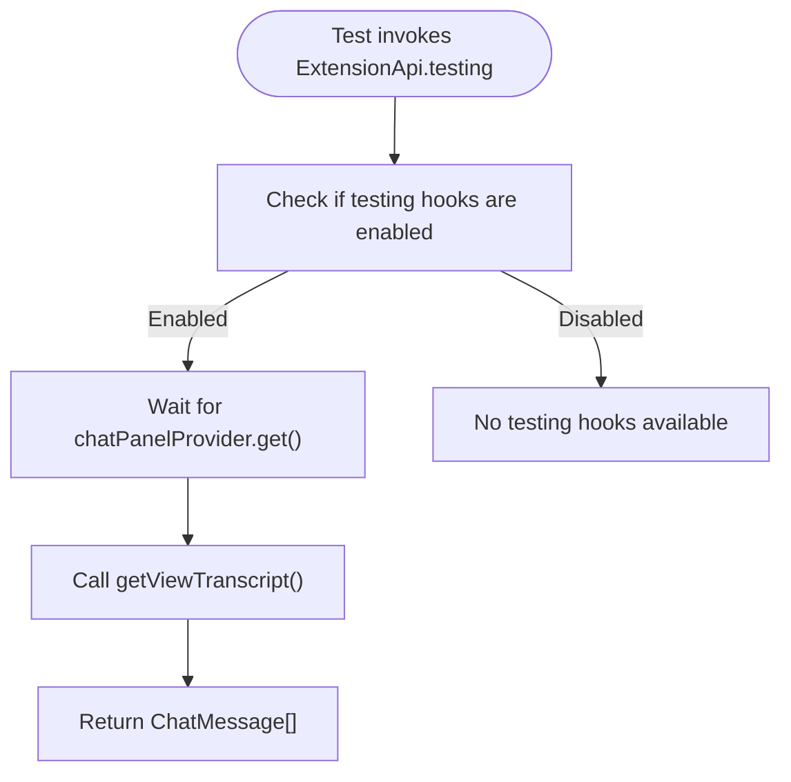
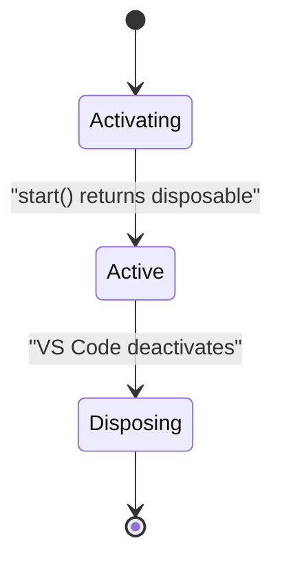
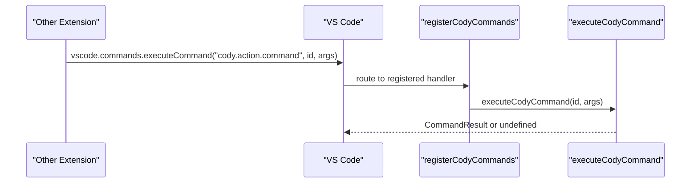
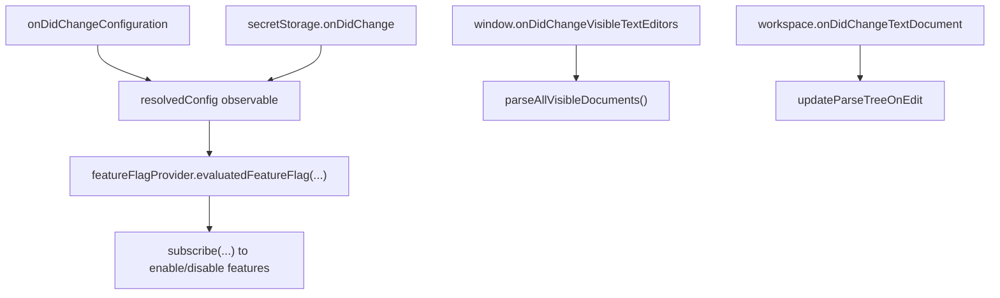
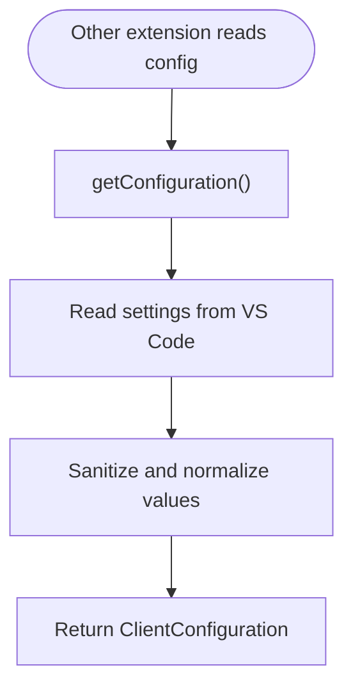
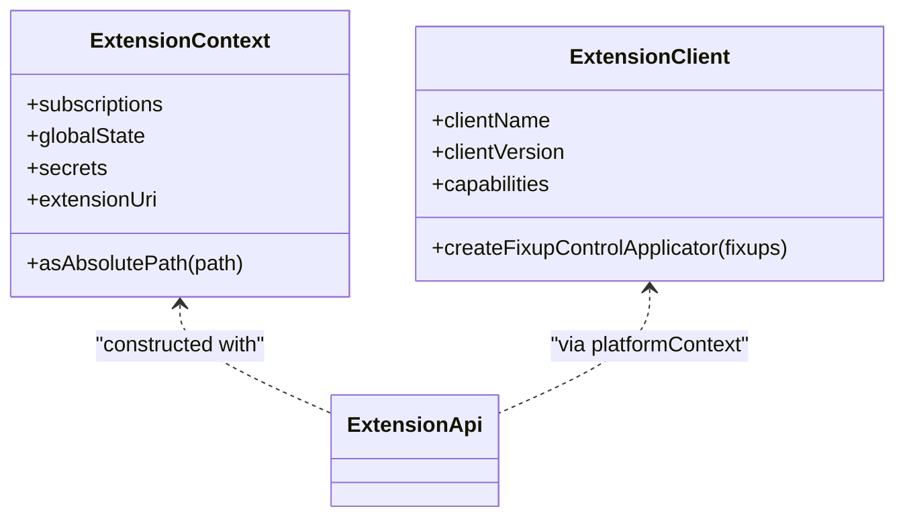
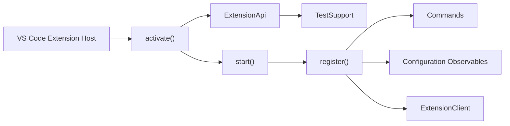

# VS Code Extension APIs

<cite>
**Referenced Files in This Document**
- [extension-api.ts](file://vscode/src/extension-api.ts)
- [test-support.ts](file://vscode/src/test-support.ts)
- [extension.common.ts](file://vscode/src/extension.common.ts)
- [main.ts](file://vscode/src/main.ts)
- [configuration.ts](file://vscode/src/configuration.ts)
- [extension-client.ts](file://vscode/src/extension-client.ts)
- [commands/index.ts](file://vscode/src/commands/index.ts)
- [api.test.ts](file://vscode/test/integration/single-root/api.test.ts)
</cite>

## Table of Contents
1. [Introduction](#introduction)
2. [Project Structure](#project-structure)
3. [Core Components](#core-components)
4. [Architecture Overview](#architecture-overview)
5. [Detailed Component Analysis](#detailed-component-analysis)
6. [Dependency Analysis](#dependency-analysis)
7. [Performance Considerations](#performance-considerations)
8. [Troubleshooting Guide](#troubleshooting-guide)
9. [Conclusion](#conclusion)
10. [Appendices](#appendices)

## Introduction
This document describes the public API surface exposed by the Cody VS Code extension for other extensions to integrate with. It focuses on the ExtensionApi class, its constructor parameters, the extensionMode property, and testing hooks. It also covers command registration patterns, event handling mechanisms, configuration APIs, lifecycle management (activation/deactivation), and integration points with VS Code’s extension host. Practical examples illustrate how other extensions can interact with Cody’s public API, and guidelines are provided for extending Cody’s functionality safely and efficiently.

## Project Structure
The public API surface is centered around a small set of modules:
- ExtensionApi: the primary public API object returned by activation
- TestSupport: testing-only helpers for integration tests
- extension.common.ts: activation entry point and platform context wiring
- main.ts: extension startup, registration of commands and services
- configuration.ts: configuration retrieval and resolution
- extension-client.ts: client capability and component delegation interface
- commands/index.ts: menu/command metadata for discoverability

**Diagram sources**
- [extension.common.ts:44-77](file://vscode/src/extension.common.ts#L44-L77)
- [main.ts:122-357](file://vscode/src/main.ts#L122-L357)
- [configuration.ts:25-204](file://vscode/src/configuration.ts#L25-L204)
- [extension-client.ts:11-43](file://vscode/src/extension-client.ts#L11-L43)

**Section sources**
- [extension.common.ts:44-77](file://vscode/src/extension.common.ts#L44-L77)
- [main.ts:122-357](file://vscode/src/main.ts#L122-L357)
- [configuration.ts:25-204](file://vscode/src/configuration.ts#L25-L204)
- [extension-client.ts:11-43](file://vscode/src/extension-client.ts#L11-L43)

## Core Components
- ExtensionApi
  - Purpose: Provides a stable public API surface to other extensions.
  - Constructor parameter: extensionMode (from VS Code ExtensionMode).
  - Property: extensionMode (exposed as a public field).
  - Testing hook: testing (optional, present only when CODY_TESTING=true).
- TestSupport
  - Purpose: Exposes testing-only helpers for integration tests.
  - Notable members: chatPanelProvider rendezvous, chatMessages(), authStatus().
  - Static singleton: TestSupport.instance for coordinated test access.

**Section sources**
- [extension-api.ts:5-18](file://vscode/src/extension-api.ts#L5-L18)
- [test-support.ts:40-53](file://vscode/src/test-support.ts#L40-L53)

## Architecture Overview
The extension follows a clear activation-start-registration pattern:
- activate() constructs ExtensionApi and delegates to start().
- start() initializes configuration observables, external services, and registers commands and controllers.
- register() orchestrates feature registration, including chat, autocomplete, edits, and debug/test commands.
- ExtensionClient and ClientCapabilities allow the client (VS Code) to control component selection and capabilities.

**Diagram sources**
- [extension.common.ts:44-77](file://vscode/src/extension.common.ts#L44-L77)
- [main.ts:122-357](file://vscode/src/main.ts#L122-L357)

## Detailed Component Analysis

### ExtensionApi Class
- Constructor parameters
  - extensionMode: passed from VS Code ExtensionContext.extensionMode.
- Properties
  - extensionMode: public read-only property exposing the current extension mode.
  - testing: optional TestSupport instance when CODY_TESTING=true.
- Behavior
  - When CODY_TESTING=true, sets up testing hooks and exposes them via the testing property.
  - TestSupport.instance is set to the created TestSupport instance for centralized access.

**Diagram sources**
- [extension-api.ts:5-18](file://vscode/src/extension-api.ts#L5-L18)
- [test-support.ts:40-53](file://vscode/src/test-support.ts#L40-L53)

**Section sources**
- [extension-api.ts:5-18](file://vscode/src/extension-api.ts#L5-L18)

### TestSupport and Testing Hooks
- Rendezvous channel
  - chatPanelProvider is a one-slot rendezvous used to coordinate tests with the chat panel provider.
- Methods
  - chatMessages(): returns the current chat transcript from the active chat panel.
  - authStatus(): returns current auth status or undefined if not ready.
- Environment
  - Enabled only when CODY_TESTING=true; intended for integration tests.

**Diagram sources**
- [test-support.ts:9-35](file://vscode/src/test-support.ts#L9-L35)
- [test-support.ts:46-52](file://vscode/src/test-support.ts#L46-L52)

**Section sources**
- [test-support.ts:40-53](file://vscode/src/test-support.ts#L40-L53)

### Extension Lifecycle Management
- Activation
  - activate(context, platformContext) constructs ExtensionApi, optionally initializes network agent and noxide, calls start(), and pushes disposables into context.subscriptions.
- Deactivation
  - The extension returns a disposable from start() and stores it in context.subscriptions; VS Code disposes it automatically on deactivation.
- Development/Test modes
  - isExtensionModeDevOrTest flag influences registration of development/test-only commands and features.

**Diagram sources**
- [extension.common.ts:44-77](file://vscode/src/extension.common.ts#L44-L77)
- [main.ts:122-214](file://vscode/src/main.ts#L122-L214)

**Section sources**
- [extension.common.ts:44-77](file://vscode/src/extension.common.ts#L44-L77)
- [main.ts:122-214](file://vscode/src/main.ts#L122-L214)

### Command Registration Patterns
- Public commands
  - cody.action.command: executes a named/default command with arguments.
  - cody.command.*: a family of commands for chat, edit, explain, tests, and more.
  - cody.chat.*: chat UI and history commands.
  - cody.auth.*: authentication commands.
  - cody.debug.*: developer diagnostics commands.
  - cody.test.*: development/test-only commands (when in dev/test mode).
- Registration mechanism
  - Commands are registered via vscode.commands.registerCommand(...) inside registerCodyCommands, registerChatCommands, registerAuthCommands, registerDebugCommands, and registerTestCommands.
- Dynamic behavior
  - Some commands depend on feature flags and configuration; they are conditionally enabled/disabled.

**Diagram sources**
- [main.ts:405-526](file://vscode/src/main.ts#L405-L526)

**Section sources**
- [main.ts:405-526](file://vscode/src/main.ts#L405-L526)
- [commands/index.ts:18-89](file://vscode/src/commands/index.ts#L18-L89)

### Event Handling Mechanisms
- Configuration and secrets
  - Configuration changes are observed and combined with secret changes to drive resolvedConfig observables.
- Feature flags
  - FeatureFlagProvider evaluates feature flags and subscribes to changes to enable/disable features dynamically.
- Window/editor events
  - Visible editors and document changes trigger parser updates and related listeners.

**Diagram sources**
- [main.ts:151-203](file://vscode/src/main.ts#L151-L203)
- [main.ts:318-334](file://vscode/src/main.ts#L318-L334)
- [main.ts:373-377](file://vscode/src/main.ts#L373-L377)

**Section sources**
- [main.ts:151-203](file://vscode/src/main.ts#L151-L203)
- [main.ts:318-334](file://vscode/src/main.ts#L318-L334)
- [main.ts:373-377](file://vscode/src/main.ts#L373-L377)

### Configuration APIs Exposed to Other Extensions
- getConfiguration()
  - Reads sanitized configuration values from VS Code settings, including networking, suggestions, chat/edit pre-instructions, code actions, telemetry level, and hidden/internal settings.
  - Returns a ClientConfiguration object suitable for runtime decisions.
- setStaticResolvedConfigurationWithAuthCredentials()
  - Allows setting a static resolved configuration with auth credentials for specialized contexts (e.g., CLI programs).

**Diagram sources**
- [configuration.ts:25-204](file://vscode/src/configuration.ts#L25-L204)
- [configuration.ts:222-232](file://vscode/src/configuration.ts#L222-L232)

**Section sources**
- [configuration.ts:25-204](file://vscode/src/configuration.ts#L25-L204)
- [configuration.ts:222-232](file://vscode/src/configuration.ts#L222-L232)

### Integration Points with VS Code Extension Host
- ExtensionContext
  - Used for subscriptions, storage, secrets, and path resolution.
- ExtensionMode
  - Exposed via ExtensionApi.extensionMode and used to gate development/test features.
- ExtensionClient
  - Delegates component creation (e.g., FixupControlApplicator) to the client (VS Code) based on capabilities.

**Diagram sources**
- [extension.common.ts:24-37](file://vscode/src/extension.common.ts#L24-L37)
- [extension-client.ts:11-43](file://vscode/src/extension-client.ts#L11-L43)

**Section sources**
- [extension.common.ts:24-37](file://vscode/src/extension.common.ts#L24-L37)
- [extension-client.ts:11-43](file://vscode/src/extension-client.ts#L11-L43)

### Practical Examples for Other Extensions
- Discovering commands
  - Example: List all commands containing "cody." to enumerate available actions.
  - Reference: [api.test.ts:6-10](file://vscode/test/integration/single-root/api.test.ts#L6-L10)
- Executing a command
  - Example: Execute a default command with arguments using cody.action.command.
  - Reference: [main.ts:419-450](file://vscode/src/main.ts#L419-L450)
- Using configuration
  - Example: Read configuration values via getConfiguration() to adapt behavior.
  - Reference: [configuration.ts:25-204](file://vscode/src/configuration.ts#L25-L204)
- Accessing testing hooks
  - Example: When CODY_TESTING=true, access ExtensionApi.testing to coordinate with chat panel provider.
  - Reference: [extension-api.ts:11-17](file://vscode/src/extension-api.ts#L11-L17), [test-support.ts:40-53](file://vscode/src/test-support.ts#L40-L53)

**Section sources**
- [api.test.ts:6-10](file://vscode/test/integration/single-root/api.test.ts#L6-L10)
- [main.ts:419-450](file://vscode/src/main.ts#L419-L450)
- [configuration.ts:25-204](file://vscode/src/configuration.ts#L25-L204)
- [extension-api.ts:11-17](file://vscode/src/extension-api.ts#L11-L17)
- [test-support.ts:40-53](file://vscode/src/test-support.ts#L40-L53)

## Dependency Analysis
- ExtensionApi depends on:
  - VS Code ExtensionMode for mode detection.
  - TestSupport for optional testing hooks.
- Activation depends on:
  - PlatformContext for client capabilities and platform-specific factories.
  - ExtensionClient for delegating component creation.
- Registration depends on:
  - Configuration observables and feature flags.
  - VS Code command registry and webview providers.

**Diagram sources**
- [extension.common.ts:44-77](file://vscode/src/extension.common.ts#L44-L77)
- [extension-api.ts:5-18](file://vscode/src/extension-api.ts#L5-L18)
- [main.ts:122-357](file://vscode/src/main.ts#L122-L357)
- [extension-client.ts:11-43](file://vscode/src/extension-client.ts#L11-L43)

**Section sources**
- [extension.common.ts:44-77](file://vscode/src/extension.common.ts#L44-L77)
- [extension-api.ts:5-18](file://vscode/src/extension-api.ts#L5-L18)
- [main.ts:122-357](file://vscode/src/main.ts#L122-L357)
- [extension-client.ts:11-43](file://vscode/src/extension-client.ts#L11-L43)

## Performance Considerations
- Prefer using observables for configuration and feature flags to avoid repeated synchronous reads.
- Avoid awaiting UI-blocking promises during activation; use non-awaited notifications to prevent activation timeouts.
- Minimize expensive initialization work until configuration and authentication status are known.

[No sources needed since this section provides general guidance]

## Troubleshooting Guide
- Commands not found
  - Verify that cody.action.command and other commands are registered; see command registration in registerCodyCommands.
- Authentication status not available
  - Use TestSupport.authStatus() in tests or rely on currentAuthStatus in production code.
- Debug logs and diagnostics
  - Use cody.debug.* commands for exporting logs, enabling verbose mode, reporting issues, and heap dumps.

**Section sources**
- [main.ts:405-526](file://vscode/src/main.ts#L405-L526)
- [test-support.ts:50-52](file://vscode/src/test-support.ts#L50-L52)
- [main.ts:641-652](file://vscode/src/main.ts#L641-L652)

## Conclusion
Cody’s VS Code extension exposes a focused public API surface through ExtensionApi, with optional testing hooks via TestSupport. The extension activates via a well-defined lifecycle, registers commands and services, and integrates with VS Code’s extension host and configuration system. Other extensions can discover and invoke commands, read configuration, and leverage testing hooks under controlled conditions. Following the patterns documented here ensures robust and maintainable integrations.

[No sources needed since this section summarizes without analyzing specific files]

## Appendices

### Best Practices for API Usage
- Respect extension mode: gate development/test-only features behind isExtensionModeDevOrTest checks.
- Use configuration observables: subscribe to resolvedConfig and feature flags rather than polling settings.
- Avoid blocking activation: defer UI notifications to non-awaited flows.
- Leverage ExtensionClient: allow the client to choose capabilities and components.
- Keep tests isolated: use TestSupport.instance and chatPanelProvider rendezvous for deterministic coordination.

[No sources needed since this section provides general guidance]