# Web Integration APIs

<cite>
**Referenced Files in This Document**
- [extension.web.ts](file://vscode/src/extension.web.ts)
- [agent-protocol.ts](file://vscode/src/jsonrpc/agent-protocol.ts)
- [App.tsx](file://vscode/webviews/App.tsx)
- [Chat.tsx](file://vscode/webviews/Chat.tsx)
- [CodyPanel.tsx](file://vscode/webviews/CodyPanel.tsx)
- [AuthPage.tsx](file://vscode/webviews/AuthPage.tsx)
- [UserMenu.tsx](file://vscode/webviews/components/UserMenu.tsx)
- [VSCodeApi.ts](file://vscode/webviews/utils/VSCodeApi.ts)
- [useConfig.tsx](file://vscode/webviews/utils/useConfig.tsx)
- [types.ts](file://vscode/webviews/tabs/types.ts)
- [extension-client.ts](file://vscode/src/extension-client.ts)
</cite>

## Table of Contents
1. [Introduction](#introduction)
2. [Project Structure](#project-structure)
3. [Core Components](#core-components)
4. [Architecture Overview](#architecture-overview)
5. [Detailed Component Analysis](#detailed-component-analysis)
6. [Dependency Analysis](#dependency-analysis)
7. [Performance Considerations](#performance-considerations)
8. [Security Considerations](#security-considerations)
9. [Implementation Guidelines](#implementation-guidelines)
10. [Troubleshooting Guide](#troubleshooting-guide)
11. [Conclusion](#conclusion)

## Introduction
This document describes the web integration APIs for embedding Cody in web applications. It covers the webview communication protocol, message passing mechanisms, state synchronization patterns, the React component library, the VS Code API bridge for web contexts, authentication flows, lifecycle management, styling and theming, responsive design, security considerations, and implementation guidelines for various web frameworks.

## Project Structure
The web integration spans two main areas:
- The VS Code extension activation for web contexts, which wires up the browser-side completion client and Sentry service.
- The webview React application that renders the UI, manages messages with the extension host, and exposes a client API surface.

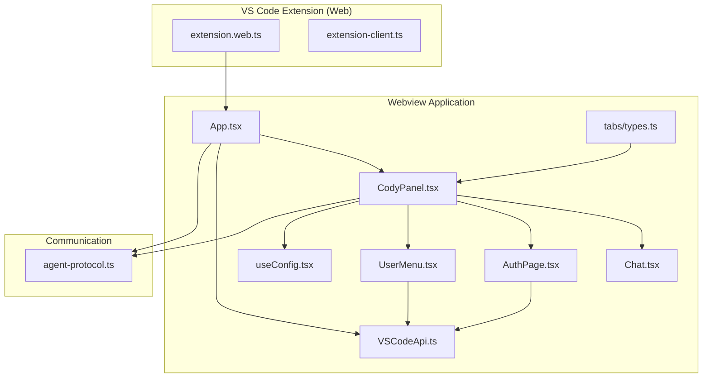

**Diagram sources**
- [extension.web.ts:14-34](file://vscode/src/extension.web.ts#L14-L34)
- [extension-client.ts:11-43](file://vscode/src/extension-client.ts#L11-L43)
- [App.tsx:32-233](file://vscode/webviews/App.tsx#L32-L233)
- [CodyPanel.tsx:67-194](file://vscode/webviews/CodyPanel.tsx#L67-L194)
- [Chat.tsx:46-228](file://vscode/webviews/Chat.tsx#L46-L228)
- [AuthPage.tsx:46-239](file://vscode/webviews/AuthPage.tsx#L46-L239)
- [UserMenu.tsx:57-628](file://vscode/webviews/components/UserMenu.tsx#L57-L628)
- [VSCodeApi.ts:23-44](file://vscode/webviews/utils/VSCodeApi.ts#L23-L44)
- [useConfig.tsx:13-82](file://vscode/webviews/utils/useConfig.tsx#L13-L82)
- [types.ts:1-9](file://vscode/webviews/tabs/types.ts#L1-L9)
- [agent-protocol.ts:35-472](file://vscode/src/jsonrpc/agent-protocol.ts#L35-L472)

**Section sources**
- [extension.web.ts:14-34](file://vscode/src/extension.web.ts#L14-L34)
- [agent-protocol.ts:35-472](file://vscode/src/jsonrpc/agent-protocol.ts#L35-L472)
- [App.tsx:32-233](file://vscode/webviews/App.tsx#L32-L233)
- [CodyPanel.tsx:67-194](file://vscode/webviews/CodyPanel.tsx#L67-L194)
- [Chat.tsx:46-228](file://vscode/webviews/Chat.tsx#L46-L228)
- [AuthPage.tsx:46-239](file://vscode/webviews/AuthPage.tsx#L46-L239)
- [UserMenu.tsx:57-628](file://vscode/webviews/components/UserMenu.tsx#L57-L628)
- [VSCodeApi.ts:23-44](file://vscode/webviews/utils/VSCodeApi.ts#L23-L44)
- [useConfig.tsx:13-82](file://vscode/webviews/utils/useConfig.tsx#L13-L82)
- [types.ts:1-9](file://vscode/webviews/tabs/types.ts#L1-L9)

## Core Components
- Webview activation and client wiring for VS Code Web environments.
- JSON-RPC protocol for bidirectional messaging between webview and extension host.
- React component library for chat, authentication, and navigation.
- VS Code API bridge for web contexts to send/receive messages and persist state.
- Configuration and telemetry providers for the webview.

Key responsibilities:
- Webview activation: initializes browser-side clients and Sentry service for web.
- Protocol: defines requests, notifications, and message types for chat, webview lifecycle, and configuration.
- Components: render UI, manage user interactions, and emit commands to the extension host.
- Bridge: wraps window.postMessage/window.addEventListener and state persistence.

**Section sources**
- [extension.web.ts:14-34](file://vscode/src/extension.web.ts#L14-L34)
- [agent-protocol.ts:35-472](file://vscode/src/jsonrpc/agent-protocol.ts#L35-L472)
- [App.tsx:32-233](file://vscode/webviews/App.tsx#L32-L233)
- [VSCodeApi.ts:23-44](file://vscode/webviews/utils/VSCodeApi.ts#L23-L44)

## Architecture Overview
The web integration uses a React webview app hosted inside VS Code’s webview runtime. Communication is mediated by a thin wrapper around the webview’s postMessage and message event, which serializes/deserializes messages and hydrates URIs. The extension host exposes a JSON-RPC protocol for chat, webview lifecycle, configuration, and telemetry.

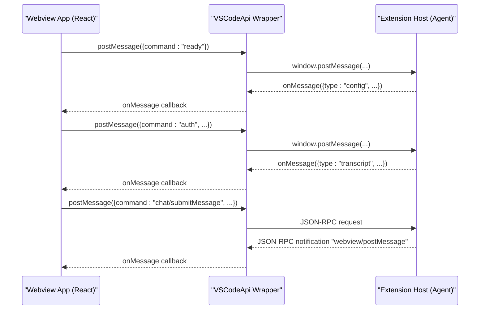

**Diagram sources**
- [App.tsx:67-141](file://vscode/webviews/App.tsx#L67-L141)
- [VSCodeApi.ts:23-44](file://vscode/webviews/utils/VSCodeApi.ts#L23-L44)
- [agent-protocol.ts:71-166](file://vscode/src/jsonrpc/agent-protocol.ts#L71-L166)

## Detailed Component Analysis

### Webview Activation (VS Code Web)
- Initializes the extension for web contexts by creating a browser completions client and a web Sentry service.
- Delegates to a common activation routine with platform-specific factories.

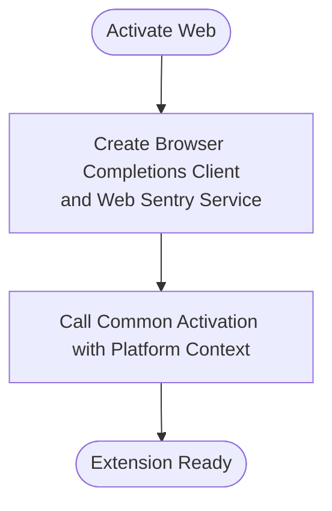

**Diagram sources**
- [extension.web.ts:18-32](file://vscode/src/extension.web.ts#L18-L32)

**Section sources**
- [extension.web.ts:14-34](file://vscode/src/extension.web.ts#L14-L34)

### JSON-RPC Protocol (Requests, Notifications, Messages)
- Defines client-to-server and server-to-client requests and notifications.
- Includes chat operations, webview lifecycle, configuration, diagnostics, telemetry, and testing endpoints.
- Provides typed message envelopes for webview messages and extension messages.

```mermaid
classDiagram
class Requests {
+initialize(ClientInfo, ServerInfo)
+shutdown(null, null)
+chat/new(null, string)
+chat/web/new(null, PanelChatId)
+chat/sidebar/new(null, PanelChatId)
+chat/delete({chatId}, ChatExportResult[])
+chat/submitMessage({id,message}, ExtensionMessage)
+webview/receiveMessage({id,message}, null)
+webview/receiveMessageStringEncoded({id,messageStringEncoded}, null)
+webview/didDispose({id}, null)
+webview/resolveWebviewView({viewId,webviewHandle}, null)
+extensionConfiguration/change(ExtensionConfiguration, ProtocolAuthStatus|null)
+extensionConfiguration/status(null, ProtocolAuthStatus|null)
}
class Notifications {
+initialized(null)
+exit(null)
+textDocument/didOpen(ProtocolTextDocument)
+textDocument/didChange(ProtocolTextDocument)
+textDocument/didFocus({uri})
+textDocument/didSave({uri})
+textDocument/didClose(ProtocolTextDocument)
+webview/postMessage(WebviewPostMessageParams)
+webview/postMessageStringEncoded({id,stringEncodedMessage})
+authStatus/didUpdate(ProtocolAuthStatus)
}
class WebviewMessage {
+type
+...payload
}
class ExtensionMessage {
+type
+...payload
}
Requests --> WebviewMessage : "client -> server"
Notifications --> WebviewMessage : "server -> client"
WebviewMessage --> ExtensionMessage : "mapped by server"
```

**Diagram sources**
- [agent-protocol.ts:35-472](file://vscode/src/jsonrpc/agent-protocol.ts#L35-L472)

**Section sources**
- [agent-protocol.ts:35-472](file://vscode/src/jsonrpc/agent-protocol.ts#L35-L472)

### React Component Library

#### App (Root)
- Manages theme application, configuration, client configuration, transcript, token usage, and error messages.
- Listens to messages from the extension host and updates state accordingly.
- Emits readiness and initialization signals to the extension host.

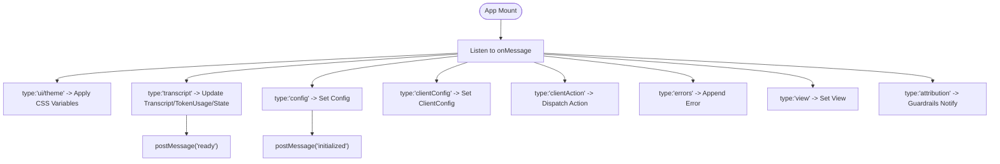

**Diagram sources**
- [App.tsx:67-141](file://vscode/webviews/App.tsx#L67-L141)

**Section sources**
- [App.tsx:32-233](file://vscode/webviews/App.tsx#L32-L233)

#### CodyPanel (Tabs Container)
- Renders tabs for chat, history, MCP, and others.
- Exposes external and extension APIs to consumers.
- Subscribes to client actions broadcast and extension API observables.

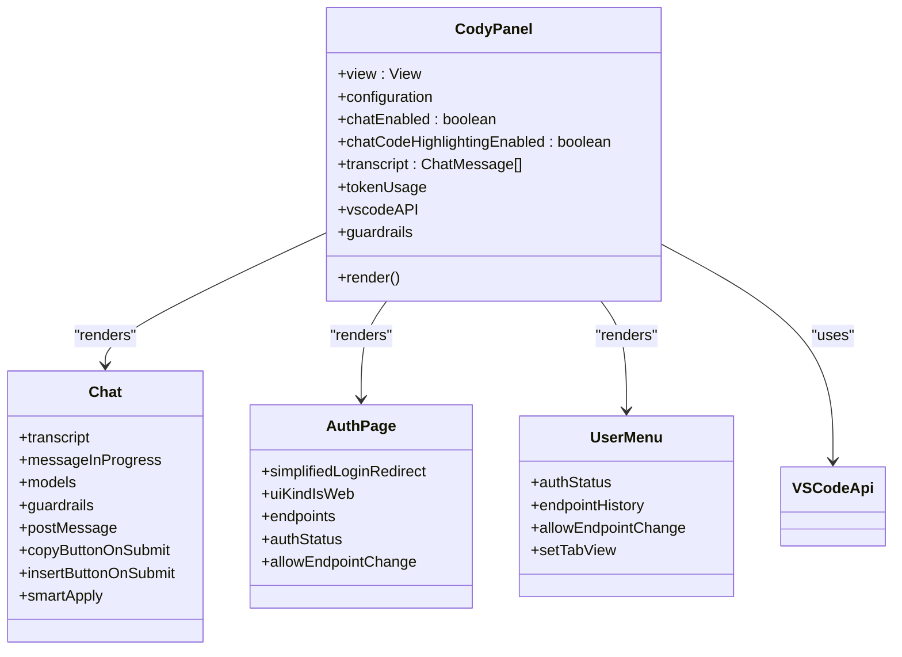

**Diagram sources**
- [CodyPanel.tsx:67-194](file://vscode/webviews/CodyPanel.tsx#L67-L194)
- [Chat.tsx:46-228](file://vscode/webviews/Chat.tsx#L46-L228)
- [AuthPage.tsx:46-239](file://vscode/webviews/AuthPage.tsx#L46-L239)
- [UserMenu.tsx:57-628](file://vscode/webviews/components/UserMenu.tsx#L57-L628)

**Section sources**
- [CodyPanel.tsx:67-194](file://vscode/webviews/CodyPanel.tsx#L67-L194)
- [Chat.tsx:46-228](file://vscode/webviews/Chat.tsx#L46-L228)
- [AuthPage.tsx:46-239](file://vscode/webviews/AuthPage.tsx#L46-L239)
- [UserMenu.tsx:57-628](file://vscode/webviews/components/UserMenu.tsx#L57-L628)

#### Chat Component
- Handles user input, copy/insert/smart apply actions, and aborting in-progress messages.
- Integrates with guardrails and telemetry.
- Exposes a typed postMessage function for outbound commands.

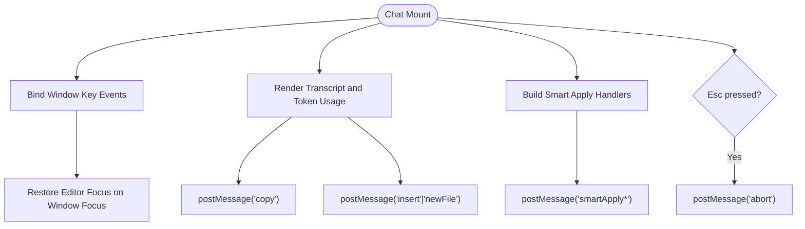

**Diagram sources**
- [Chat.tsx:159-178](file://vscode/webviews/Chat.tsx#L159-L178)
- [Chat.tsx:179-199](file://vscode/webviews/Chat.tsx#L179-L199)
- [Chat.tsx:104-155](file://vscode/webviews/Chat.tsx#L104-L155)

**Section sources**
- [Chat.tsx:46-228](file://vscode/webviews/Chat.tsx#L46-L228)

#### Authentication Page
- Presents provider-based sign-in and manual enterprise sign-in.
- Validates endpoint URLs and access tokens.
- Emits auth commands to the extension host.

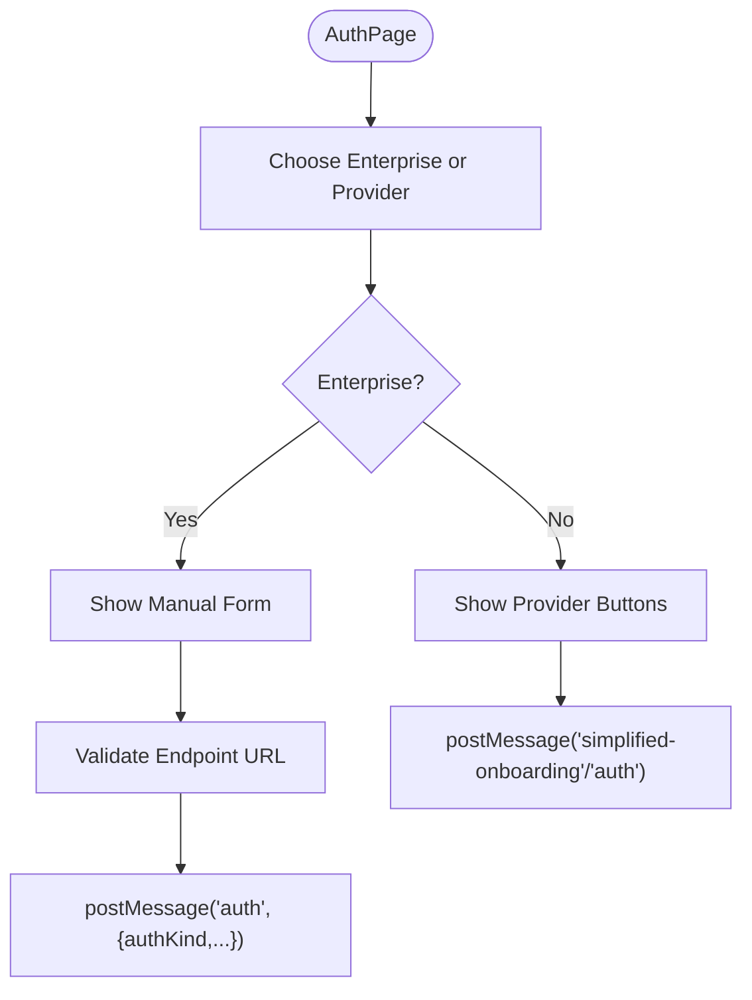

**Diagram sources**
- [AuthPage.tsx:46-239](file://vscode/webviews/AuthPage.tsx#L46-L239)

**Section sources**
- [AuthPage.tsx:46-239](file://vscode/webviews/AuthPage.tsx#L46-L239)

#### User Menu
- Allows switching accounts, adding/removing endpoints, viewing help, and opening debug commands.
- Emits auth and command messages to the extension host.

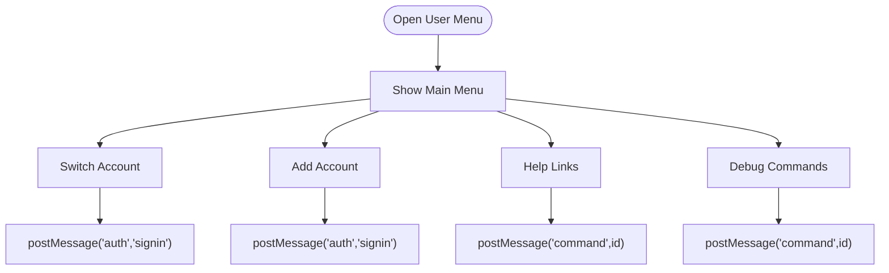

**Diagram sources**
- [UserMenu.tsx:57-628](file://vscode/webviews/components/UserMenu.tsx#L57-L628)

**Section sources**
- [UserMenu.tsx:57-628](file://vscode/webviews/components/UserMenu.tsx#L57-L628)

### VS Code API Bridge for Web Contexts
- Wraps the VS Code webview API to normalize message sending and receiving.
- Hydrates URIs and ensures proper serialization for postMessage.
- Provides state persistence via setState/getState.

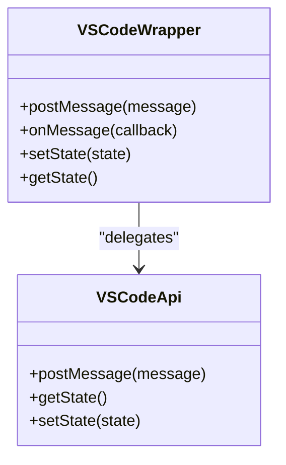

**Diagram sources**
- [VSCodeApi.ts:13-44](file://vscode/webviews/utils/VSCodeApi.ts#L13-L44)

**Section sources**
- [VSCodeApi.ts:23-44](file://vscode/webviews/utils/VSCodeApi.ts#L23-L44)

### Configuration and Context
- Provides configuration context to components, including auth status, client capabilities, and subscription info.
- Enforces authenticated context for account-related hooks.

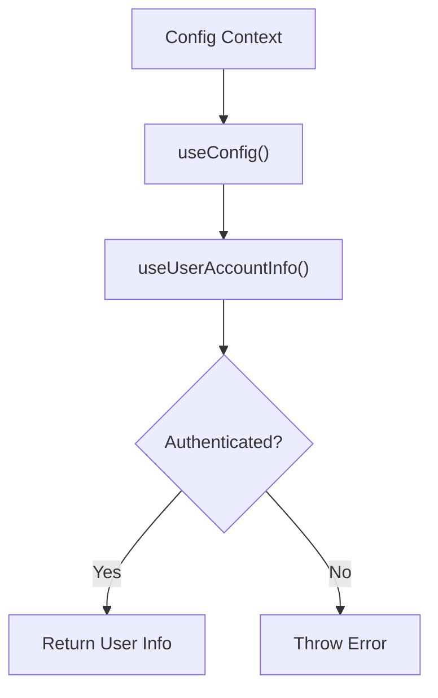

**Diagram sources**
- [useConfig.tsx:13-82](file://vscode/webviews/utils/useConfig.tsx#L13-L82)

**Section sources**
- [useConfig.tsx:13-82](file://vscode/webviews/utils/useConfig.tsx#L13-L82)

### Views and Navigation
- Enumerates views (chat, login, history, account, settings, MCP).
- Managed by the tab container and propagated to child components.

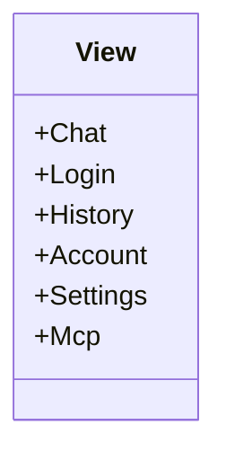

**Diagram sources**
- [types.ts:1-9](file://vscode/webviews/tabs/types.ts#L1-L9)

**Section sources**
- [types.ts:1-9](file://vscode/webviews/tabs/types.ts#L1-L9)

## Dependency Analysis
- The webview app depends on the VS Code API bridge for all IPC.
- Components depend on configuration context and telemetry services.
- The extension host exposes a JSON-RPC protocol that the webview consumes for chat and lifecycle operations.

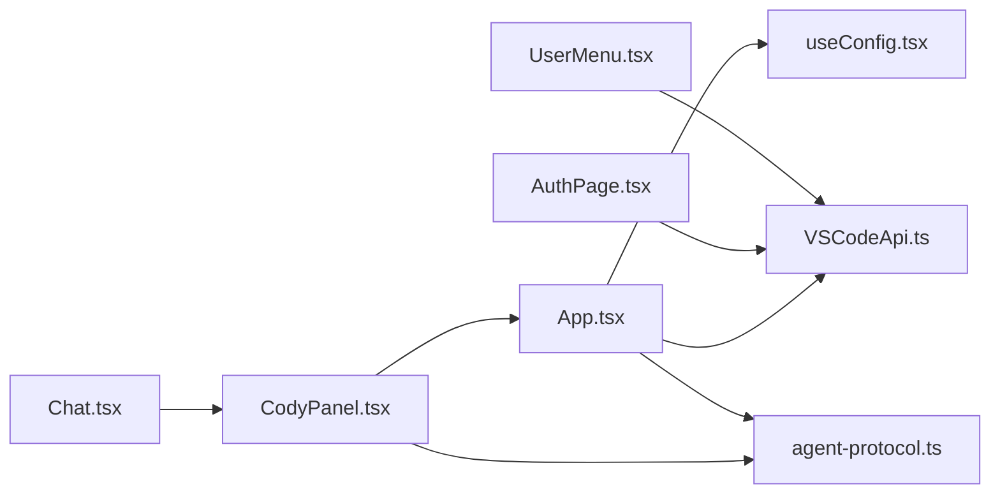

**Diagram sources**
- [App.tsx:32-233](file://vscode/webviews/App.tsx#L32-L233)
- [CodyPanel.tsx:67-194](file://vscode/webviews/CodyPanel.tsx#L67-L194)
- [Chat.tsx:46-228](file://vscode/webviews/Chat.tsx#L46-L228)
- [AuthPage.tsx:46-239](file://vscode/webviews/AuthPage.tsx#L46-L239)
- [UserMenu.tsx:57-628](file://vscode/webviews/components/UserMenu.tsx#L57-L628)
- [VSCodeApi.ts:23-44](file://vscode/webviews/utils/VSCodeApi.ts#L23-L44)
- [useConfig.tsx:13-82](file://vscode/webviews/utils/useConfig.tsx#L13-L82)
- [agent-protocol.ts:35-472](file://vscode/src/jsonrpc/agent-protocol.ts#L35-L472)

**Section sources**
- [App.tsx:32-233](file://vscode/webviews/App.tsx#L32-L233)
- [CodyPanel.tsx:67-194](file://vscode/webviews/CodyPanel.tsx#L67-L194)
- [Chat.tsx:46-228](file://vscode/webviews/Chat.tsx#L46-L228)
- [AuthPage.tsx:46-239](file://vscode/webviews/AuthPage.tsx#L46-L239)
- [UserMenu.tsx:57-628](file://vscode/webviews/components/UserMenu.tsx#L57-L628)
- [VSCodeApi.ts:23-44](file://vscode/webviews/utils/VSCodeApi.ts#L23-L44)
- [useConfig.tsx:13-82](file://vscode/webviews/utils/useConfig.tsx#L13-L82)
- [agent-protocol.ts:35-472](file://vscode/src/jsonrpc/agent-protocol.ts#L35-L472)

## Performance Considerations
- Minimize re-renders by memoizing handlers and derived values in components.
- Debounce or throttle frequent message handling (e.g., transcript updates).
- Use lazy loading for heavy UI sections (e.g., MCP settings).
- Avoid unnecessary deep object cloning in state updates.

## Security Considerations
- Cross-origin isolation: Ensure the hosting page enforces secure contexts and cross-origin policies to protect message boundaries.
- Message validation: Validate incoming messages and enforce strict schemas for payloads.
- Token handling: Do not log or persist tokens; sanitize logs and avoid exposing tokens in DOM attributes.
- CSP: Configure Content-Security-Policy to restrict script execution and external resource loading.
- Origin checks: Verify the origin of messages if embedding in third-party pages.

## Implementation Guidelines

### Embedding in Web Applications
- Initialize the VS Code API bridge and wait for the “ready” signal before rendering.
- Subscribe to configuration and theme updates to adapt UI dynamically.
- Use the JSON-RPC protocol to submit chat messages and handle streaming replies.

References:
- [App.tsx:67-141](file://vscode/webviews/App.tsx#L67-L141)
- [agent-protocol.ts:71-166](file://vscode/src/jsonrpc/agent-protocol.ts#L71-L166)

### Authentication Flows
- Use simplified onboarding or manual enterprise sign-in flows.
- Validate endpoint URLs and access tokens before posting auth commands.
- Handle authentication errors and display user-friendly banners.

References:
- [AuthPage.tsx:46-239](file://vscode/webviews/AuthPage.tsx#L46-L239)
- [UserMenu.tsx:57-628](file://vscode/webviews/components/UserMenu.tsx#L57-L628)

### Managing Webview Lifecycle
- Emit “ready” and “initialized” commands to synchronize state with the extension host.
- Dispose webview resources by sending “webview/didDispose” when appropriate.

References:
- [App.tsx:138-148](file://vscode/webviews/App.tsx#L138-L148)
- [agent-protocol.ts:151-153](file://vscode/src/jsonrpc/agent-protocol.ts#L151-L153)

### Styling, Theming, and Responsive Design
- Apply theme variables received from the extension host to the document element.
- Use CSS modules and responsive breakpoints to adapt to different screen sizes.
- Respect user preferences for reduced motion and high contrast.

References:
- [App.tsx:71-78](file://vscode/webviews/App.tsx#L71-L78)

### Framework Integration Patterns
- React: Use the provided components and context providers to integrate into existing apps.
- Vue/Angular: Wrap the VS Code API bridge and JSON-RPC calls in framework-specific reactive patterns.

References:
- [VSCodeApi.ts:23-44](file://vscode/webviews/utils/VSCodeApi.ts#L23-L44)
- [agent-protocol.ts:35-472](file://vscode/src/jsonrpc/agent-protocol.ts#L35-L472)

## Troubleshooting Guide
- No messages received: Ensure the webview emitted “ready” and “initialized” and that the bridge is listening for messages.
- Authentication failures: Validate endpoint URL format and access token validity; check error banners.
- Theme not applied: Confirm “ui/theme” messages are received and CSS variables are set on the document element.
- Chat not updating: Verify “transcript” messages and that the chat component is subscribed to updates.

**Section sources**
- [App.tsx:67-141](file://vscode/webviews/App.tsx#L67-L141)
- [AuthPage.tsx:46-239](file://vscode/webviews/AuthPage.tsx#L46-L239)
- [UserMenu.tsx:57-628](file://vscode/webviews/components/UserMenu.tsx#L57-L628)

## Conclusion
Cody’s web integration provides a robust, React-based webview application communicating via a well-defined JSON-RPC protocol. The VS Code API bridge simplifies message passing and state management in web contexts. By following the documented patterns for authentication, lifecycle management, theming, and security, developers can reliably embed Cody in diverse web environments.