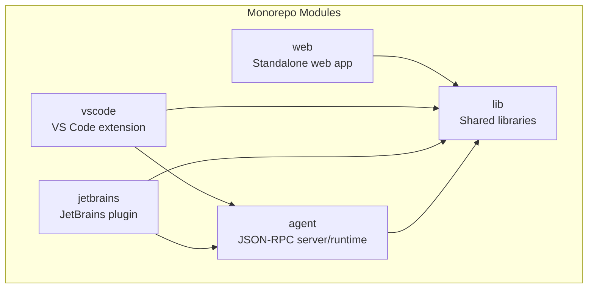
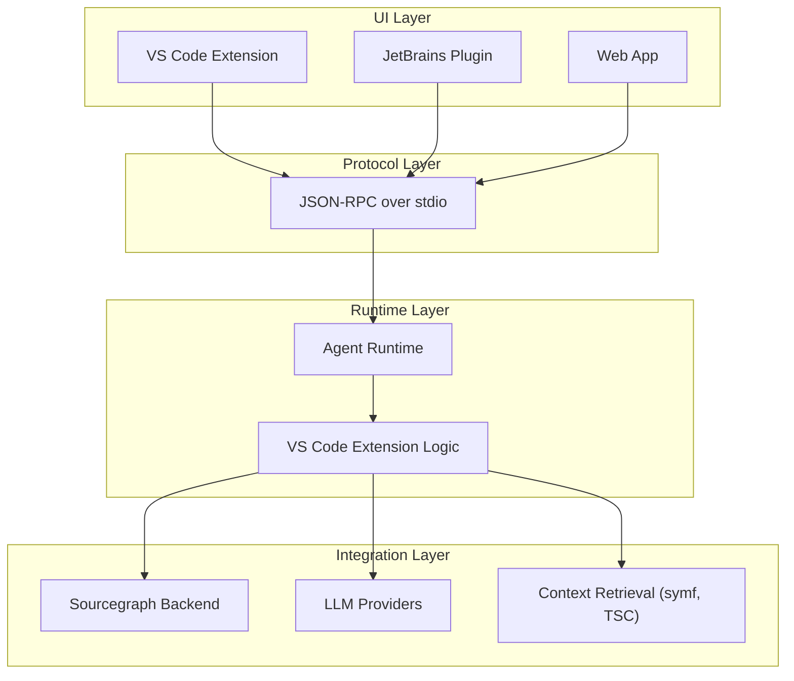
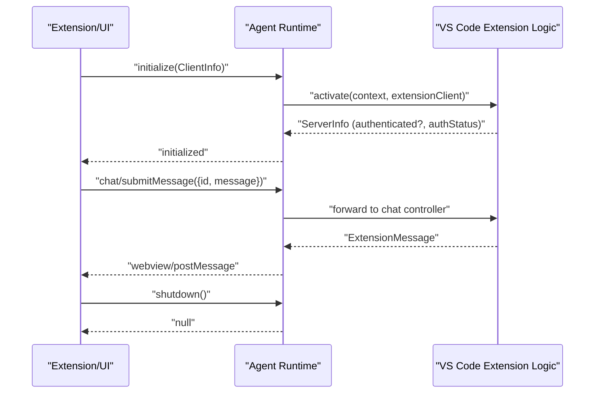
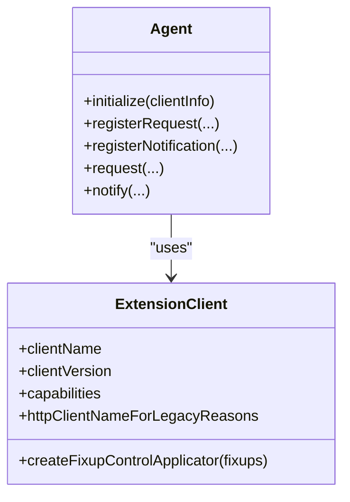
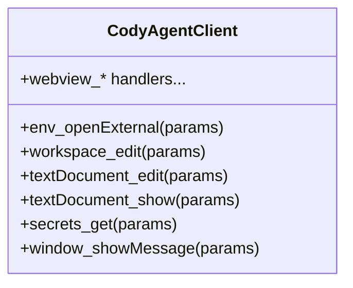
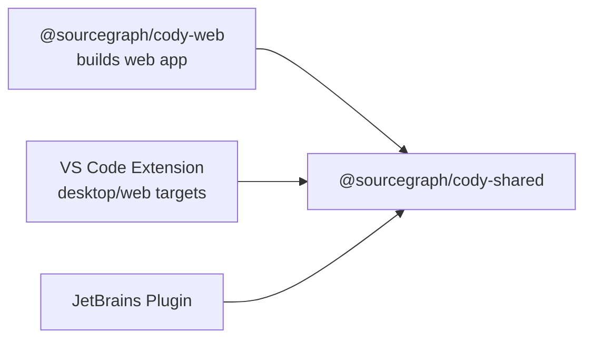
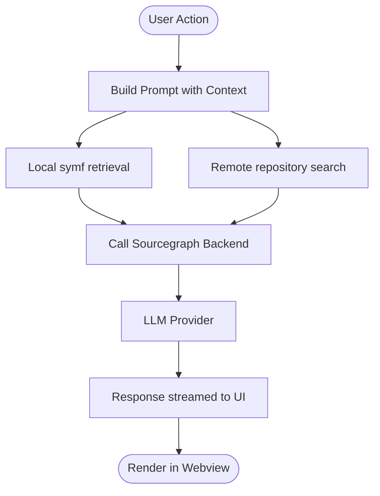
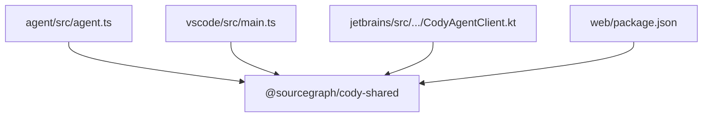

# Architecture Overview

<cite>
**Referenced Files in This Document**
- [ARCHITECTURE.md](file://ARCHITECTURE.md)
- [README.md](file://README.md)
- [agent/README.md](file://agent/README.md)
- [agent/protocol.md](file://agent/protocol.md)
- [agent/src/index.ts](file://agent/src/index.ts)
- [agent/src/agent.ts](file://agent/src/agent.ts)
- [vscode/README.md](file://vscode/README.md)
- [vscode/src/extension-client.ts](file://vscode/src/extension-client.ts)
- [vscode/src/jsonrpc/agent-protocol.ts](file://vscode/src/jsonrpc/agent-protocol.ts)
- [vscode/src/main.ts](file://vscode/src/main.ts)
- [jetbrains/README.md](file://jetbrains/README.md)
- [jetbrains/src/main/kotlin/com/sourcegraph/cody/agent/CodyAgentClient.kt](file://jetbrains/src/main/kotlin/com/sourcegraph/cody/agent/CodyAgentClient.kt)
- [jetbrains/build.gradle.kts](file://jetbrains/build.gradle.kts)
- [web/README.md](file://web/README.md)
- [web/package.json](file://web/package.json)
- [Cargo.toml](file://Cargo.toml)
- [vscode/package.json](file://vscode/package.json)
</cite>

## Table of Contents
1. [Introduction](#introduction)
2. [Project Structure](#project-structure)
3. [Core Components](#core-components)
4. [Architecture Overview](#architecture-overview)
5. [Detailed Component Analysis](#detailed-component-analysis)
6. [Dependency Analysis](#dependency-analysis)
7. [Performance Considerations](#performance-considerations)
8. [Troubleshooting Guide](#troubleshooting-guide)
9. [Conclusion](#conclusion)

## Introduction
This document describes the Cody platform architecture and system design. It explains how the monorepo separates concerns across the VS Code extension, JetBrains plugin, agent runtime, web components, and shared libraries. It details the JSON-RPC protocol that connects the extension to the agent runtime, how the agent interfaces with LLM providers and context retrieval systems, and how the platform scales across multiple IDEs and environments.

## Project Structure
The Cody repository is organized as a monorepo with clear module boundaries:
- agent: JSON-RPC server and runtime for non-ECMAScript clients (e.g., JetBrains, Neovim)
- vscode: VS Code extension with UI, chat, autocomplete, and integrations
- jetbrains: JetBrains plugin with agent client bindings and IDE-specific features
- web: Standalone web application and components
- lib: Shared libraries and utilities used across modules
- Shared libraries (e.g., @sourcegraph/cody-shared) provide cross-cutting concerns like telemetry, configuration, and protocol types

**Section sources**
- [README.md:35-42](file://README.md#L35-L42)
- [agent/README.md:1-180](file://agent/README.md#L1-L180)
- [vscode/README.md:1-88](file://vscode/README.md#L1-L88)
- [jetbrains/README.md:1-207](file://jetbrains/README.md#L1-L207)
- [web/README.md:1-25](file://web/README.md#L1-L25)

## Core Components
- Agent runtime (Node.js): Implements the JSON-RPC server, manages extension lifecycle, and exposes protocol methods for chat, autocomplete, commands, and webview interactions.
- VS Code extension: Provides UI, chat, autocomplete, and commands; integrates with the agent via JSON-RPC; orchestrates context retrieval and LLM interactions.
- JetBrains plugin: Provides IDE-specific UI and commands; communicates with the agent via JSON-RPC and native webview support.
- Web components: Standalone React-based UI for web deployment; integrates with shared libraries and the agent when applicable.
- Shared libraries: Provide telemetry, configuration, models, and protocol types used across modules.

**Section sources**
- [agent/src/agent.ts:295-510](file://agent/src/agent.ts#L295-L510)
- [vscode/src/jsonrpc/agent-protocol.ts:1-120](file://vscode/src/jsonrpc/agent-protocol.ts#L1-L120)
- [vscode/src/main.ts:119-214](file://vscode/src/main.ts#L119-L214)
- [jetbrains/src/main/kotlin/com/sourcegraph/cody/agent/CodyAgentClient.kt:1-120](file://jetbrains/src/main/kotlin/com/sourcegraph/cody/agent/CodyAgentClient.kt#L1-L120)
- [web/package.json:1-52](file://web/package.json#L1-L52)

## Architecture Overview
Cody uses a layered architecture:
- UI layer: VS Code webviews, JetBrains native webviews, and web components
- Protocol layer: JSON-RPC over stdin/stdout between the extension and the agent
- Runtime layer: Agent runtime initializes the VS Code extension logic and exposes protocol methods
- Integration layer: Calls to Sourcegraph backend, LLM providers, and context retrieval systems

**Diagram sources**
- [agent/protocol.md:1-60](file://agent/protocol.md#L1-L60)
- [agent/src/agent.ts:195-283](file://agent/src/agent.ts#L195-L283)
- [vscode/src/jsonrpc/agent-protocol.ts:1-120](file://vscode/src/jsonrpc/agent-protocol.ts#L1-L120)

**Section sources**
- [agent/protocol.md:1-60](file://agent/protocol.md#L1-L60)
- [agent/src/agent.ts:195-283](file://agent/src/agent.ts#L195-L283)
- [vscode/src/jsonrpc/agent-protocol.ts:1-120](file://vscode/src/jsonrpc/agent-protocol.ts#L1-L120)

## Detailed Component Analysis

### JSON-RPC Protocol and Extension-Agent Boundary
- The agent defines a JSON-RPC protocol with requests and notifications for initialization, chat, autocomplete, commands, and webview interactions.
- The extension (VS Code) and JetBrains client both speak JSON-RPC to the agent over stdio.
- The agent initializes the VS Code extension logic and exposes protocol methods for UI and LLM interactions.

**Diagram sources**
- [agent/protocol.md:37-120](file://agent/protocol.md#L37-L120)
- [agent/src/agent.ts:381-510](file://agent/src/agent.ts#L381-L510)
- [vscode/src/jsonrpc/agent-protocol.ts:35-120](file://vscode/src/jsonrpc/agent-protocol.ts#L35-L120)

**Section sources**
- [agent/protocol.md:37-120](file://agent/protocol.md#L37-L120)
- [agent/src/agent.ts:381-510](file://agent/src/agent.ts#L381-L510)
- [vscode/src/jsonrpc/agent-protocol.ts:35-120](file://vscode/src/jsonrpc/agent-protocol.ts#L35-L120)

### Agent Initialization and Extension Client Abstraction
- The agent registers handlers for initialization, document lifecycle, configuration changes, and testing utilities.
- The extension client abstraction allows the agent to adapt behavior based on client capabilities (e.g., webview type, secrets handling).

**Diagram sources**
- [vscode/src/extension-client.ts:11-31](file://vscode/src/extension-client.ts#L11-L31)
- [agent/src/agent.ts:295-380](file://agent/src/agent.ts#L295-L380)

**Section sources**
- [vscode/src/extension-client.ts:11-31](file://vscode/src/extension-client.ts#L11-L31)
- [agent/src/agent.ts:295-380](file://agent/src/agent.ts#L295-L380)

### JetBrains Plugin Client Implementation
- The JetBrains client implements the JSON-RPC protocol for the agent, handling requests like text edits, webview messages, and secrets management.
- It integrates with the IDE’s UI, notifications, and secure storage.

**Diagram sources**
- [jetbrains/src/main/kotlin/com/sourcegraph/cody/agent/CodyAgentClient.kt:50-120](file://jetbrains/src/main/kotlin/com/sourcegraph/cody/agent/CodyAgentClient.kt#L50-L120)

**Section sources**
- [jetbrains/src/main/kotlin/com/sourcegraph/cody/agent/CodyAgentClient.kt:50-120](file://jetbrains/src/main/kotlin/com/sourcegraph/cody/agent/CodyAgentClient.kt#L50-L120)

### Web Components and Multi-Platform Approach
- The web package builds a standalone React application and integrates with shared libraries.
- The VS Code extension supports both desktop and web targets, enabling a consistent UI across environments.

**Diagram sources**
- [web/package.json:1-52](file://web/package.json#L1-L52)
- [vscode/package.json:1-120](file://vscode/package.json#L1-L120)

**Section sources**
- [web/package.json:1-52](file://web/package.json#L1-L52)
- [vscode/package.json:1-120](file://vscode/package.json#L1-L120)

### Context Retrieval and LLM Integration
- The extension orchestrates context retrieval using local and remote codebases, and forwards prompts to LLM providers via the Sourcegraph backend.
- The agent runtime coordinates configuration, authentication, and telemetry for these integrations.

**Section sources**
- [vscode/src/main.ts:244-253](file://vscode/src/main.ts#L244-L253)
- [ARCHITECTURE.md:55-122](file://ARCHITECTURE.md#L55-L122)

## Dependency Analysis
- The agent runtime depends on shared libraries for configuration, telemetry, and protocol types.
- The VS Code extension depends on shared libraries for models, telemetry, and configuration.
- The JetBrains plugin depends on shared libraries and agent protocol bindings.
- The web package depends on shared libraries and React tooling.

**Diagram sources**
- [agent/src/agent.ts:1-60](file://agent/src/agent.ts#L1-L60)
- [vscode/src/main.ts:1-60](file://vscode/src/main.ts#L1-L60)
- [jetbrains/src/main/kotlin/com/sourcegraph/cody/agent/CodyAgentClient.kt:1-45](file://jetbrains/src/main/kotlin/com/sourcegraph/cody/agent/CodyAgentClient.kt#L1-L45)
- [web/package.json:22-50](file://web/package.json#L22-L50)

**Section sources**
- [agent/src/agent.ts:1-60](file://agent/src/agent.ts#L1-L60)
- [vscode/src/main.ts:1-60](file://vscode/src/main.ts#L1-L60)
- [jetbrains/src/main/kotlin/com/sourcegraph/cody/agent/CodyAgentClient.kt:1-45](file://jetbrains/src/main/kotlin/com/sourcegraph/cody/agent/CodyAgentClient.kt#L1-L45)
- [web/package.json:22-50](file://web/package.json#L22-L50)

## Performance Considerations
- Token counting and telemetry are governed by explicit principles to ensure accurate billing and observability.
- The agent runtime uses JSON-RPC over stdio for minimal overhead and predictable performance.
- The VS Code extension supports both desktop and web targets, enabling efficient resource usage across environments.

[No sources needed since this section provides general guidance]

## Troubleshooting Guide
- Agent debugging: Use environment variables to trace JSON-RPC traffic and enable verbose logging.
- Protocol updates: Keep the TypeScript protocol definition in sync with agent and client implementations.
- Testing modes: Use recording/replay modes to stabilize tests and isolate network dependencies.

**Section sources**
- [agent/README.md:62-114](file://agent/README.md#L62-L114)
- [agent/src/index.ts:1-34](file://agent/src/index.ts#L1-L34)

## Conclusion
Cody’s architecture cleanly separates UI, protocol, runtime, and integration concerns across VS Code, JetBrains, and web environments. The JSON-RPC protocol provides a robust boundary between the extension and agent, while shared libraries ensure consistent behavior and observability. The platform’s multi-language agent runtime and multi-target VS Code build enable broad IDE coverage and scalable deployment.