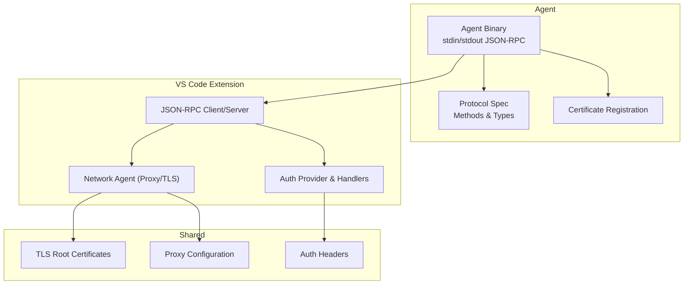
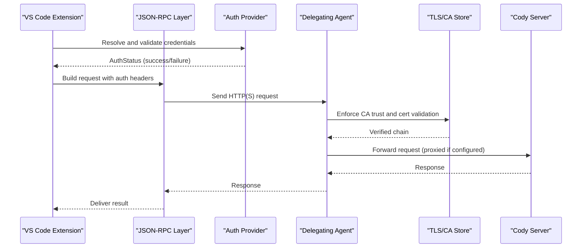
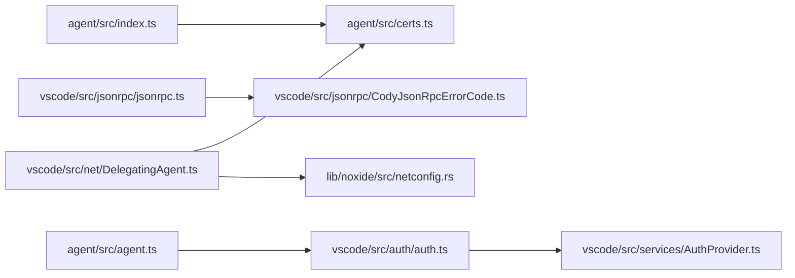

# API Security & Protocols

<cite>
**Referenced Files in This Document**
- [protocol.md](file://agent/protocol.md)
- [index.ts](file://agent/src/index.ts)
- [certs.ts](file://agent/src/certs.ts)
- [jsonrpc.ts](file://vscode/src/jsonrpc/jsonrpc.ts)
- [CodyJsonRpcErrorCode.ts](file://vscode/src/jsonrpc/CodyJsonRpcErrorCode.ts)
- [auth.ts](file://vscode/src/auth/auth.ts)
- [AuthProvider.ts](file://vscode/src/services/AuthProvider.ts)
- [DelegatingAgent.ts](file://vscode/src/net/DelegatingAgent.ts)
- [netconfig.rs](file://lib/noxide/src/netconfig.rs)
- [agent.ts](file://agent/src/agent.ts)
</cite>

## Table of Contents
1. [Introduction](#introduction)
2. [Project Structure](#project-structure)
3. [Core Components](#core-components)
4. [Architecture Overview](#architecture-overview)
5. [Detailed Component Analysis](#detailed-component-analysis)
6. [Dependency Analysis](#dependency-analysis)
7. [Performance Considerations](#performance-considerations)
8. [Troubleshooting Guide](#troubleshooting-guide)
9. [Conclusion](#conclusion)
10. [Appendices](#appendices)

## Introduction
This document provides comprehensive API security documentation for Cody’s communication protocols. It covers JSON-RPC security implementation, authentication headers, encrypted communication channels, agent protocol security features, message validation, integrity checks, certificate management, SSL/TLS configuration, secure network proxy handling, API authentication methods, token validation, authorization patterns, cross-platform communication security, agent runtime security, plugin integration safety, examples of secure API usage, threat mitigation strategies, and enterprise deployment best practices.

## Project Structure
Cody’s security spans three primary areas:
- Agent protocol and JSON-RPC transport
- Authentication and authorization flows
- Network transport, TLS, and proxy handling

**Diagram sources**
- [protocol.md:1-482](file://agent/protocol.md#L1-L482)
- [index.ts:1-33](file://agent/src/index.ts#L1-L33)
- [certs.ts:1-72](file://agent/src/certs.ts#L1-L72)
- [jsonrpc.ts:1-191](file://vscode/src/jsonrpc/jsonrpc.ts#L1-L191)
- [auth.ts:1-603](file://vscode/src/auth/auth.ts#L1-L603)
- [AuthProvider.ts:1-380](file://vscode/src/services/AuthProvider.ts#L1-L380)
- [DelegatingAgent.ts:1-562](file://vscode/src/net/DelegatingAgent.ts#L1-L562)

**Section sources**
- [protocol.md:1-482](file://agent/protocol.md#L1-L482)
- [index.ts:1-33](file://agent/src/index.ts#L1-L33)
- [certs.ts:1-72](file://agent/src/certs.ts#L1-L72)
- [jsonrpc.ts:1-191](file://vscode/src/jsonrpc/jsonrpc.ts#L1-L191)
- [auth.ts:1-603](file://vscode/src/auth/auth.ts#L1-L603)
- [AuthProvider.ts:1-380](file://vscode/src/services/AuthProvider.ts#L1-L380)
- [DelegatingAgent.ts:1-562](file://vscode/src/net/DelegatingAgent.ts#L1-L562)

## Core Components
- JSON-RPC transport and protocol: Defines the agent protocol, request/notification semantics, and error codes.
- Authentication and authorization: Validates tokens, manages endpoints, and emits auth status.
- Network transport and TLS: Centralizes proxy selection, CA trust, and certificate validation.
- Certificate management: Loads platform-native and system root certificates.

**Section sources**
- [protocol.md:1-482](file://agent/protocol.md#L1-L482)
- [jsonrpc.ts:1-191](file://vscode/src/jsonrpc/jsonrpc.ts#L1-L191)
- [CodyJsonRpcErrorCode.ts:1-9](file://vscode/src/jsonrpc/CodyJsonRpcErrorCode.ts#L1-L9)
- [auth.ts:1-603](file://vscode/src/auth/auth.ts#L1-L603)
- [AuthProvider.ts:1-380](file://vscode/src/services/AuthProvider.ts#L1-L380)
- [DelegatingAgent.ts:1-562](file://vscode/src/net/DelegatingAgent.ts#L1-L562)
- [certs.ts:1-72](file://agent/src/certs.ts#L1-L72)

## Architecture Overview
The agent communicates over JSON-RPC via stdin/stdout. The extension validates authentication, constructs authorized requests, and routes them through a configurable proxy with strict TLS verification. Platform-specific certificate stores are integrated to ensure trust chain integrity.

**Diagram sources**
- [jsonrpc.ts:121-136](file://vscode/src/jsonrpc/jsonrpc.ts#L121-L136)
- [auth.ts:458-569](file://vscode/src/auth/auth.ts#L458-L569)
- [AuthProvider.ts:248-280](file://vscode/src/services/AuthProvider.ts#L248-L280)
- [DelegatingAgent.ts:139-245](file://vscode/src/net/DelegatingAgent.ts#L139-L245)
- [certs.ts:13-29](file://agent/src/certs.ts#L13-L29)

## Detailed Component Analysis

### JSON-RPC Security Implementation
- Transport: Uses stdin/stdout JSON-RPC transport. The agent binary registers platform certificates before parsing commands, ensuring outbound HTTPS trust is established early.
- Request/Response lifecycle: Requests return responses; notifications do not. Errors are mapped to standardized JSON-RPC error codes, including rate limit and cancellation codes.
- Logging and tracing: Optional verbose tracing writes low-level JSON messages to a file for debugging.

Security controls:
- Transport isolation: stdin/stdout confines agent-server communication to the local machine.
- Error normalization: Standardized error codes reduce information leakage and aid client-side handling.
- Controlled logging: Debug logs are written to a dedicated path to avoid mixing with protocol traffic.

**Section sources**
- [protocol.md:1-482](file://agent/protocol.md#L1-L482)
- [index.ts:1-33](file://agent/src/index.ts#L1-L33)
- [jsonrpc.ts:1-191](file://vscode/src/jsonrpc/jsonrpc.ts#L1-L191)
- [CodyJsonRpcErrorCode.ts:1-9](file://vscode/src/jsonrpc/CodyJsonRpcErrorCode.ts#L1-L9)

### Authentication Headers and Token Validation
- Endpoint and token resolution: Credentials are resolved from configuration and stored securely. Tokens are validated against the configured endpoint.
- Auth status propagation: AuthProvider updates observable auth status and sets VS Code context flags based on authentication state.
- Token delivery: For plugin integrations, auth headers are computed and passed to cooperating extensions when available.

Security controls:
- Host-bound headers: Authorization headers are only attached when the target URL matches the configured server endpoint.
- Token scope: Tokens are scoped to the configured endpoint to prevent cross-instance misuse.
- Failure handling: Invalid tokens and availability errors are surfaced with specific error types to guide remediation.

**Section sources**
- [auth.ts:1-603](file://vscode/src/auth/auth.ts#L1-L603)
- [AuthProvider.ts:1-380](file://vscode/src/services/AuthProvider.ts#L1-L380)
- [agent.ts:1518-1542](file://agent/src/agent.ts#L1518-L1542)

### Encrypted Communication Channels and TLS
- Platform-native trust: Agent registers macOS, Windows, and Linux root certificates on startup.
- System CA integration: The extension aggregates TLS root certificates, the global HTTPS agent CA list, and optional additional CA bundles.
- Certificate validation: TLS rejects unauthorized certificates by default; certificate validation can be overridden only via explicit configuration/environment variables.
- Rust-based CA loader: A native module loads system certificates and encodes them for transport.

Security controls:
- Default strict validation: Rejecting unauthorized certificates prevents man-in-the-middle attacks.
- Explicit opt-out: Environment variables allow controlled bypass only when necessary for diagnostics.
- Combined trust sources: Multiple CA sources increase resilience and compatibility.

**Section sources**
- [certs.ts:1-72](file://agent/src/certs.ts#L1-L72)
- [DelegatingAgent.ts:298-356](file://vscode/src/net/DelegatingAgent.ts#L298-L356)
- [netconfig.rs:1-53](file://lib/noxide/src/netconfig.rs#L1-L53)

### Agent Protocol Security Features
- Peer-to-peer JSON-RPC: Both sides can initiate requests and notifications, enabling bidirectional control.
- Method contract: Each method defines parameter and result types, reducing ambiguity and aiding validation.
- Lifecycle events: Notifications like initialized and exit enable clean handshake and termination.

Security controls:
- Clear separation: Requests require responses; notifications do not, preventing accidental misuse.
- Contract enforcement: Strongly typed method signatures reduce malformed payload risks.

**Section sources**
- [protocol.md:1-482](file://agent/protocol.md#L1-L482)

### Message Validation and Integrity Checking
- Error mapping: Errors are mapped to standardized JSON-RPC error codes, including cancellation and rate limit scenarios.
- Request cancellation: Cancellation tokens are honored and mapped to a specific error code.
- Logging safeguards: RPC message logging is gated by an environment variable to avoid mixing logs with protocol streams.

Security controls:
- Consistent error reporting: Reduces information leakage and improves client-side resilience.
- Controlled visibility: Optional logging avoids protocol contamination.

**Section sources**
- [jsonrpc.ts:69-88](file://vscode/src/jsonrpc/jsonrpc.ts#L69-L88)
- [CodyJsonRpcErrorCode.ts:1-9](file://vscode/src/jsonrpc/CodyJsonRpcErrorCode.ts#L1-L9)

### Certificate Management and SSL/TLS Configuration
- Agent registration: On startup, platform-specific root certificates are injected into the global HTTPS agent.
- Extension CA aggregation: Combines system roots, global agent CA, and optional additional CA bundles; converts buffers to strings safely.
- Native CA loader: Rust module loads native certificates and encodes them for use in Node environments.

Security controls:
- Minimal conversion failures: Buffers are converted to strings; failures are logged and skipped to maintain trust chain integrity.
- Native integration: Uses platform-native certificate stores for broad compatibility.

**Section sources**
- [certs.ts:1-72](file://agent/src/certs.ts#L1-L72)
- [DelegatingAgent.ts:298-356](file://vscode/src/net/DelegatingAgent.ts#L298-L356)
- [netconfig.rs:1-53](file://lib/noxide/src/netconfig.rs#L1-L53)

### Secure Network Proxy Handling
- Proxy selection: Supports HTTP(S), SOCKS, and Unix domain socket proxies. Proxies are chosen based on NO_PROXY rules and configuration.
- Per-request agent caching: Agents are cached per proxy endpoint to reduce overhead and improve reliability.
- CA and validation: Proxy requests honor CA trust and certificate validation settings.
- NO_PROXY logic: Implements RFC-compatible NO_PROXY matching for IPv4/IPv6 and wildcards.

Security controls:
- Strict defaults: Direct connections are used when NO_PROXY matches; otherwise, proxies are enforced.
- Controlled bypass: Only explicit configuration/environment variables can disable validation.

**Section sources**
- [DelegatingAgent.ts:139-245](file://vscode/src/net/DelegatingAgent.ts#L139-L245)
- [DelegatingAgent.ts:515-561](file://vscode/src/net/DelegatingAgent.ts#L515-L561)

### API Authentication Methods, Token Validation, and Authorization Patterns
- Multi-source auth: Tokens can be provided via interactive flows, URL/token combinations, or external providers.
- Endpoint validation: Tokens are validated against the configured endpoint; cross-endpoint tokens are rejected.
- Auth status observability: AuthProvider exposes observable auth status and updates context flags.
- Plugin integration: Auth headers are forwarded to cooperating plugins when available.

Security controls:
- Endpoint-scoped tokens: Prevents token misuse across instances.
- Observable auth state: Enables UI and feature gating based on authentication.

**Section sources**
- [auth.ts:1-603](file://vscode/src/auth/auth.ts#L1-L603)
- [AuthProvider.ts:1-380](file://vscode/src/services/AuthProvider.ts#L1-L380)
- [agent.ts:1518-1542](file://agent/src/agent.ts#L1518-L1542)

### Cross-Platform Communication, Agent Runtime Security, and Plugin Integration Safety
- Agent runtime: The agent binary registers certificates early and parses commands with console redirection to avoid protocol contamination.
- Platform certificates: macOS, Windows, and Linux root certificates are installed globally.
- Plugin safety: Auth headers are only attached when the URL matches the configured server endpoint; plugin callbacks are gated by presence of cooperating extensions.

Security controls:
- Early trust establishment: Certificates are registered before any network activity.
- URL-bound header injection: Prevents leaking credentials to unintended hosts.

**Section sources**
- [index.ts:1-33](file://agent/src/index.ts#L1-L33)
- [certs.ts:1-72](file://agent/src/certs.ts#L1-L72)
- [auth.ts:37-59](file://vscode/src/auth/auth.ts#L37-L59)

### Examples of Secure API Usage
- Initialize agent with trusted certificates and parse commands safely.
- Validate credentials against the configured endpoint and attach headers only when the URL matches.
- Configure proxies with NO_PROXY rules and strict certificate validation; optionally supply additional CA bundles.
- Use cancellation tokens to gracefully terminate long-running requests and map errors to standardized codes.

**Section sources**
- [index.ts:1-33](file://agent/src/index.ts#L1-L33)
- [auth.ts:458-569](file://vscode/src/auth/auth.ts#L458-L569)
- [DelegatingAgent.ts:139-245](file://vscode/src/net/DelegatingAgent.ts#L139-L245)
- [jsonrpc.ts:121-136](file://vscode/src/jsonrpc/jsonrpc.ts#L121-L136)

### Threat Mitigation Strategies
- Man-in-the-middle prevention: Strict certificate validation and platform-native trust roots.
- Token scope enforcement: Authorization headers bound to the configured endpoint.
- Proxy-aware routing: NO_PROXY rules and explicit proxy configuration reduce exposure to untrusted networks.
- Controlled logging: Optional RPC message logging prevents accidental credential exposure.

**Section sources**
- [DelegatingAgent.ts:139-245](file://vscode/src/net/DelegatingAgent.ts#L139-L245)
- [auth.ts:39-51](file://vscode/src/auth/auth.ts#L39-L51)
- [jsonrpc.ts:336-346](file://vscode/src/jsonrpc/jsonrpc.ts#L336-L346)

### Security Configuration Best Practices
- Prefer direct connections for internal endpoints; configure NO_PROXY to exclude internal domains.
- Supply additional CA bundles only when necessary and validate paths carefully.
- Avoid environment variable overrides unless required for diagnostics; prefer explicit configuration.
- Keep certificate stores updated; rely on platform-native trust roots.

**Section sources**
- [DelegatingAgent.ts:397-424](file://vscode/src/net/DelegatingAgent.ts#L397-L424)
- [certs.ts:1-72](file://agent/src/certs.ts#L1-L72)

## Dependency Analysis

**Diagram sources**
- [index.ts:1-33](file://agent/src/index.ts#L1-L33)
- [certs.ts:1-72](file://agent/src/certs.ts#L1-L72)
- [jsonrpc.ts:1-191](file://vscode/src/jsonrpc/jsonrpc.ts#L1-L191)
- [CodyJsonRpcErrorCode.ts:1-9](file://vscode/src/jsonrpc/CodyJsonRpcErrorCode.ts#L1-L9)
- [auth.ts:1-603](file://vscode/src/auth/auth.ts#L1-L603)
- [AuthProvider.ts:1-380](file://vscode/src/services/AuthProvider.ts#L1-L380)
- [DelegatingAgent.ts:1-562](file://vscode/src/net/DelegatingAgent.ts#L1-L562)
- [netconfig.rs:1-53](file://lib/noxide/src/netconfig.rs#L1-L53)
- [agent.ts:1518-1542](file://agent/src/agent.ts#L1518-L1542)

**Section sources**
- [index.ts:1-33](file://agent/src/index.ts#L1-L33)
- [certs.ts:1-72](file://agent/src/certs.ts#L1-L72)
- [jsonrpc.ts:1-191](file://vscode/src/jsonrpc/jsonrpc.ts#L1-L191)
- [CodyJsonRpcErrorCode.ts:1-9](file://vscode/src/jsonrpc/CodyJsonRpcErrorCode.ts#L1-L9)
- [auth.ts:1-603](file://vscode/src/auth/auth.ts#L1-L603)
- [AuthProvider.ts:1-380](file://vscode/src/services/AuthProvider.ts#L1-L380)
- [DelegatingAgent.ts:1-562](file://vscode/src/net/DelegatingAgent.ts#L1-L562)
- [netconfig.rs:1-53](file://lib/noxide/src/netconfig.rs#L1-L53)
- [agent.ts:1518-1542](file://agent/src/agent.ts#L1518-L1542)

## Performance Considerations
- Agent caching: DelegatingAgent caches per-proxy agents to reduce overhead and improve connection reliability.
- Minimal conversions: CA certificate aggregation converts only string certificates; buffer conversions are logged and skipped to minimize failure impact.
- LIFO scheduling: JSON-RPC prioritizes autocomplete responsiveness under load.

**Section sources**
- [DelegatingAgent.ts:51-77](file://vscode/src/net/DelegatingAgent.ts#L51-L77)
- [DelegatingAgent.ts:317-333](file://vscode/src/net/DelegatingAgent.ts#L317-L333)
- [jsonrpc.ts:158-160](file://vscode/src/jsonrpc/jsonrpc.ts#L158-L160)

## Troubleshooting Guide
Common issues and resolutions:
- Authentication failures:
  - Verify endpoint and token correctness; ensure token matches the configured endpoint.
  - Check for availability errors and retry after resolving network issues.
- Proxy misconfiguration:
  - Confirm NO_PROXY rules and proxy endpoint validity; ensure proxy CA is supplied if self-signed.
- Certificate problems:
  - Ensure platform-native certificates are registered; verify additional CA bundles are readable and absolute paths.
- JSON-RPC errors:
  - Review standardized error codes to diagnose cancellation, rate limits, or internal errors.

**Section sources**
- [auth.ts:500-569](file://vscode/src/auth/auth.ts#L500-L569)
- [DelegatingAgent.ts:397-424](file://vscode/src/net/DelegatingAgent.ts#L397-L424)
- [certs.ts:13-29](file://agent/src/certs.ts#L13-L29)
- [jsonrpc.ts:69-88](file://vscode/src/jsonrpc/jsonrpc.ts#L69-L88)

## Conclusion
Cody’s API security model combines strict transport isolation, standardized JSON-RPC error handling, endpoint-scoped authentication, robust TLS with platform-native trust roots, and configurable proxy routing with NO_PROXY enforcement. These controls collectively mitigate common threats such as MITM, token misuse, and insecure network routing while maintaining flexibility for enterprise environments.

## Appendices
- Secure deployment checklist:
  - Enable strict certificate validation.
  - Configure NO_PROXY for internal domains.
  - Supply additional CA bundles only when necessary.
  - Avoid environment variable overrides unless required.
  - Monitor JSON-RPC error codes for operational insights.

[No sources needed since this section provides general guidance]