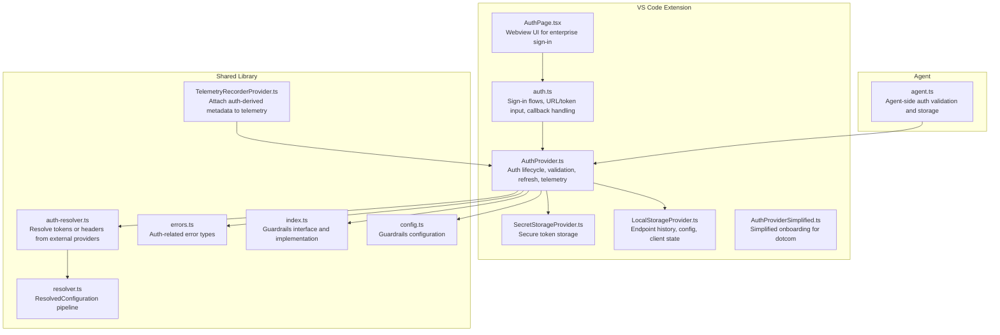
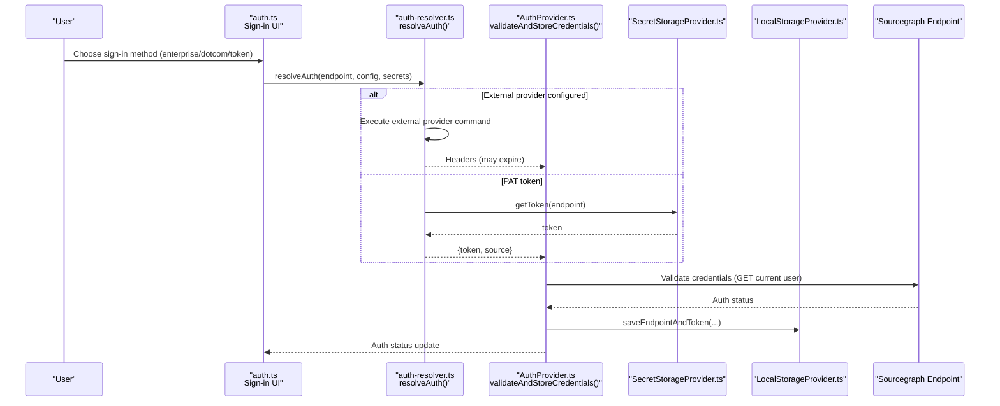
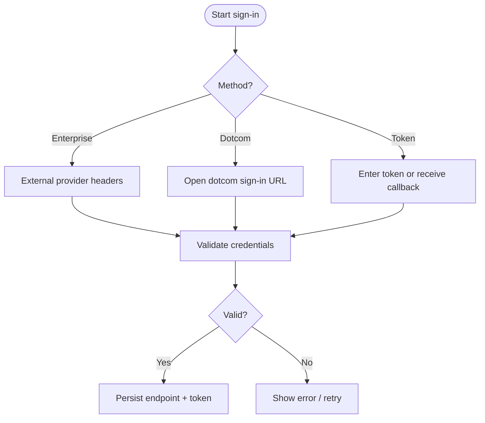
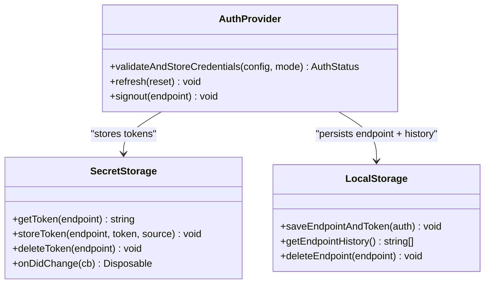
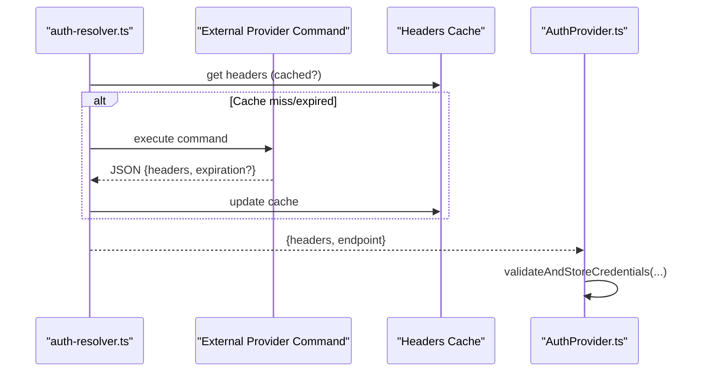
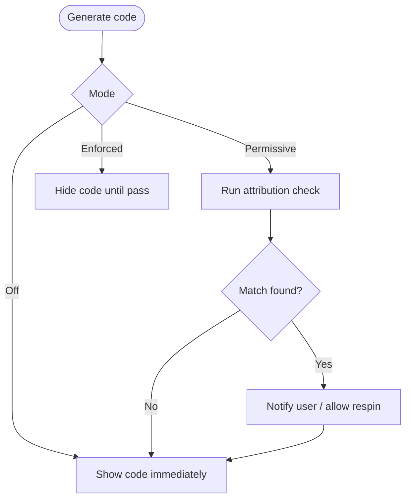
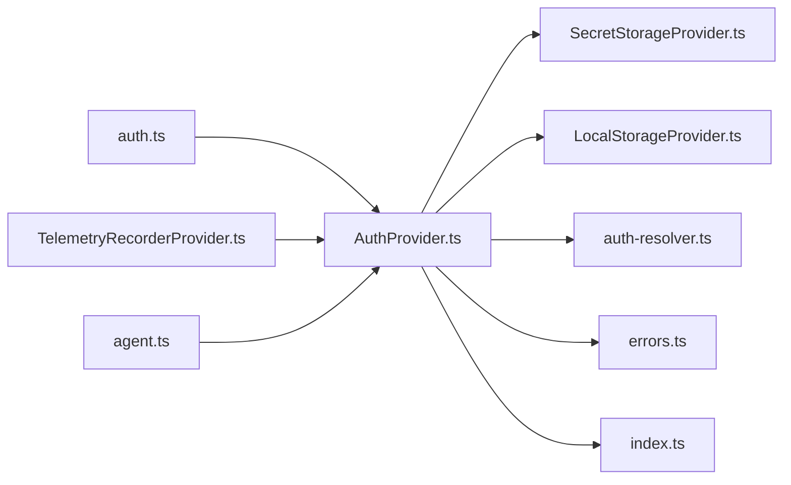

# Authentication & Security

<cite>
**Referenced Files in This Document**
- [auth.ts](file://vscode/src/auth/auth.ts)
- [AuthProvider.ts](file://vscode/src/services/AuthProvider.ts)
- [auth-resolver.ts](file://lib/shared/src/configuration/auth-resolver.ts)
- [resolver.ts](file://lib/shared/src/configuration/resolver.ts)
- [SecretStorageProvider.ts](file://vscode/src/services/SecretStorageProvider.ts)
- [LocalStorageProvider.ts](file://vscode/src/services/LocalStorageProvider.ts)
- [errors.ts](file://lib/shared/src/sourcegraph-api/errors.ts)
- [index.ts](file://lib/shared/src/guardrails/index.ts)
- [config.ts](file://lib/shared/src/guardrails/config.ts)
- [GuardrailsApplicator.tsx](file://vscode/webviews/components/GuardrailsApplicator.tsx)
- [AuthPage.tsx](file://vscode/webviews/AuthPage.tsx)
- [user.ts](file://vscode/src/auth/user.ts)
- [AuthProviderSimplified.ts](file://vscode/src/services/AuthProviderSimplified.ts)
- [TelemetryRecorderProvider.ts](file://lib/shared/src/telemetry-v2/TelemetryRecorderProvider.ts)
- [edit-context-logging.ts](file://vscode/src/edit/edit-context-logging.ts)
- [auth.ts](file://agent/src/agent.ts)
</cite>

## Table of Contents
1. [Introduction](#introduction)
2. [Project Structure](#project-structure)
3. [Core Components](#core-components)
4. [Architecture Overview](#architecture-overview)
5. [Detailed Component Analysis](#detailed-component-analysis)
6. [Dependency Analysis](#dependency-analysis)
7. [Performance Considerations](#performance-considerations)
8. [Troubleshooting Guide](#troubleshooting-guide)
9. [Conclusion](#conclusion)
10. [Appendices](#appendices)

## Introduction
This document explains Cody’s authentication and security systems. It covers multi-provider authentication (Sourcegraph accounts, enterprise SSO, personal access tokens), token management (secure storage, refresh, expiration), enterprise authentication flows (LDAP/OAuth/SAML via external providers), guardrails and safety systems (content filtering, attribution, policy enforcement), developer best practices (API key management, secure communication), configuration examples, troubleshooting, and privacy/compliance considerations.

## Project Structure
Cody’s authentication and security logic spans several modules:
- Authentication orchestration and flows in the VS Code extension
- Centralized credential resolution and external provider support
- Secure storage for tokens and endpoint history
- Guardrails for attribution and content safety
- Telemetry and audit-related metadata derived from auth state

**Diagram sources**
- [auth.ts:1-603](file://vscode/src/auth/auth.ts#L1-L603)
- [AuthProvider.ts:1-380](file://vscode/src/services/AuthProvider.ts#L1-L380)
- [auth-resolver.ts:1-160](file://lib/shared/src/configuration/auth-resolver.ts#L1-L160)
- [resolver.ts:1-191](file://lib/shared/src/configuration/resolver.ts#L1-L191)
- [SecretStorageProvider.ts:1-256](file://vscode/src/services/SecretStorageProvider.ts#L1-L256)
- [LocalStorageProvider.ts:1-432](file://vscode/src/services/LocalStorageProvider.ts#L1-L432)
- [AuthProviderSimplified.ts:1-50](file://vscode/src/services/AuthProviderSimplified.ts#L1-L50)
- [AuthPage.tsx:188-196](file://vscode/webviews/AuthPage.tsx#L188-L196)
- [index.ts:1-208](file://lib/shared/src/guardrails/index.ts#L1-L208)
- [config.ts:1-43](file://lib/shared/src/guardrails/config.ts#L1-L43)
- [TelemetryRecorderProvider.ts:182-207](file://lib/shared/src/telemetry-v2/TelemetryRecorderProvider.ts#L182-L207)
- [agent.ts:1518-1542](file://agent/src/agent.ts#L1518-L1542)

**Section sources**
- [auth.ts:1-603](file://vscode/src/auth/auth.ts#L1-L603)
- [AuthProvider.ts:1-380](file://vscode/src/services/AuthProvider.ts#L1-L380)
- [auth-resolver.ts:1-160](file://lib/shared/src/configuration/auth-resolver.ts#L1-L160)
- [resolver.ts:1-191](file://lib/shared/src/configuration/resolver.ts#L1-L191)
- [SecretStorageProvider.ts:1-256](file://vscode/src/services/SecretStorageProvider.ts#L1-L256)
- [LocalStorageProvider.ts:1-432](file://vscode/src/services/LocalStorageProvider.ts#L1-L432)
- [AuthProviderSimplified.ts:1-50](file://vscode/src/services/AuthProviderSimplified.ts#L1-L50)
- [AuthPage.tsx:188-196](file://vscode/webviews/AuthPage.tsx#L188-L196)
- [index.ts:1-208](file://lib/shared/src/guardrails/index.ts#L1-L208)
- [config.ts:1-43](file://lib/shared/src/guardrails/config.ts#L1-L43)
- [TelemetryRecorderProvider.ts:182-207](file://lib/shared/src/telemetry-v2/TelemetryRecorderProvider.ts#L182-L207)
- [agent.ts:1518-1542](file://agent/src/agent.ts#L1518-L1542)

## Core Components
- Authentication orchestration: sign-in menu, URL and token input, browser callback handling, sign-out, and status reporting.
- Auth provider: validates credentials, manages refresh cycles, emits auth status, and integrates with telemetry.
- Credential resolution: selects between PAT tokens and external provider headers; supports expiration and refresh.
- Secure storage: stores tokens and sources, with fallback to local file-based storage.
- Endpoint history and client state: persists endpoint selection, anonymous user ID, and model preferences.
- Guardrails: attribution checks, enforcement modes, and UI integration.
- Telemetry: attaches auth-derived metadata (e.g., tier) to events.

**Section sources**
- [auth.ts:81-146](file://vscode/src/auth/auth.ts#L81-L146)
- [AuthProvider.ts:45-206](file://vscode/src/services/AuthProvider.ts#L45-L206)
- [auth-resolver.ts:129-160](file://lib/shared/src/configuration/auth-resolver.ts#L129-L160)
- [SecretStorageProvider.ts:26-133](file://vscode/src/services/SecretStorageProvider.ts#L26-L133)
- [LocalStorageProvider.ts:108-132](file://vscode/src/services/LocalStorageProvider.ts#L108-L132)
- [index.ts:25-117](file://lib/shared/src/guardrails/index.ts#L25-L117)
- [TelemetryRecorderProvider.ts:182-207](file://lib/shared/src/telemetry-v2/TelemetryRecorderProvider.ts#L182-L207)

## Architecture Overview
Cody resolves authentication credentials from configuration and secrets, validates them against the target endpoint, and maintains a reactive auth status. Enterprise instances can supply credentials via external providers (executed commands returning headers with optional expiration). Tokens are securely stored and refreshed as needed. Guardrails can enforce policy checks and attribution for generated code. Telemetry enriches events with auth-derived metadata.

**Diagram sources**
- [auth.ts:101-146](file://vscode/src/auth/auth.ts#L101-L146)
- [auth-resolver.ts:129-160](file://lib/shared/src/configuration/auth-resolver.ts#L129-L160)
- [AuthProvider.ts:248-280](file://vscode/src/services/AuthProvider.ts#L248-L280)
- [SecretStorageProvider.ts:89-112](file://vscode/src/services/SecretStorageProvider.ts#L89-L112)
- [LocalStorageProvider.ts:108-132](file://vscode/src/services/LocalStorageProvider.ts#L108-L132)

**Section sources**
- [auth.ts:101-146](file://vscode/src/auth/auth.ts#L101-L146)
- [auth-resolver.ts:129-160](file://lib/shared/src/configuration/auth-resolver.ts#L129-L160)
- [AuthProvider.ts:248-280](file://vscode/src/services/AuthProvider.ts#L248-L280)
- [SecretStorageProvider.ts:89-112](file://vscode/src/services/SecretStorageProvider.ts#L89-L112)
- [LocalStorageProvider.ts:108-132](file://vscode/src/services/LocalStorageProvider.ts#L108-L132)

## Detailed Component Analysis

### Multi-Provider Authentication Support
- Sourcegraph accounts: dotcom sign-in via simplified onboarding and browser redirects.
- Enterprise SSO integration: external provider headers via executable commands; supports expiration and refresh.
- Personal access tokens: manual token entry or callback-based retrieval; stored securely.

**Diagram sources**
- [auth.ts:101-146](file://vscode/src/auth/auth.ts#L101-L146)
- [auth-resolver.ts:129-160](file://lib/shared/src/configuration/auth-resolver.ts#L129-L160)
- [AuthProviderSimplified.ts:14-20](file://vscode/src/services/AuthProviderSimplified.ts#L14-L20)

**Section sources**
- [auth.ts:101-146](file://vscode/src/auth/auth.ts#L101-L146)
- [auth-resolver.ts:129-160](file://lib/shared/src/configuration/auth-resolver.ts#L129-L160)
- [AuthProviderSimplified.ts:14-20](file://vscode/src/services/AuthProviderSimplified.ts#L14-L20)

### Token Management: Secure Storage, Refresh, Expiration
- Secure storage: tokens and sources persisted per endpoint; optional local file fallback.
- Refresh: periodic retries when challenges are pending; headers may expire and are revalidated.
- Expiration handling: external provider headers include an expiration timestamp; expired headers trigger refresh.

**Diagram sources**
- [SecretStorageProvider.ts:26-133](file://vscode/src/services/SecretStorageProvider.ts#L26-L133)
- [LocalStorageProvider.ts:108-132](file://vscode/src/services/LocalStorageProvider.ts#L108-L132)
- [AuthProvider.ts:248-280](file://vscode/src/services/AuthProvider.ts#L248-L280)

**Section sources**
- [SecretStorageProvider.ts:89-118](file://vscode/src/services/SecretStorageProvider.ts#L89-L118)
- [LocalStorageProvider.ts:108-132](file://vscode/src/services/LocalStorageProvider.ts#L108-L132)
- [auth-resolver.ts:47-72](file://lib/shared/src/configuration/auth-resolver.ts#L47-L72)
- [AuthProvider.ts:148-170](file://vscode/src/services/AuthProvider.ts#L148-L170)

### Enterprise Authentication Flows (External Providers)
- External provider headers: executed command returns JSON with headers and optional expiration; cache is invalidated on errors and refreshed.
- Enterprise SSO: sign-in UI routes to enterprise instance; callback handling supports switching instances.

**Diagram sources**
- [auth-resolver.ts:51-127](file://lib/shared/src/configuration/auth-resolver.ts#L51-L127)
- [auth.ts:301-310](file://vscode/src/auth/auth.ts#L301-L310)

**Section sources**
- [auth-resolver.ts:51-127](file://lib/shared/src/configuration/auth-resolver.ts#L51-L127)
- [auth.ts:301-310](file://vscode/src/auth/auth.ts#L301-L310)

### Guardrails and Safety Systems
- Modes: Off, Permissive, Enforced; enforced mode can hide code until checks pass.
- Attribution: long code blocks are checked for attribution; results cached to avoid repeated checks.
- UI integration: webview components surface guardrails status and results.

**Diagram sources**
- [index.ts:25-117](file://lib/shared/src/guardrails/index.ts#L25-L117)
- [config.ts:1-43](file://lib/shared/src/guardrails/config.ts#L1-L43)
- [GuardrailsApplicator.tsx:45-65](file://vscode/webviews/components/GuardrailsApplicator.tsx#L45-L65)

**Section sources**
- [index.ts:25-117](file://lib/shared/src/guardrails/index.ts#L25-L117)
- [config.ts:1-43](file://lib/shared/src/guardrails/config.ts#L1-L43)
- [GuardrailsApplicator.tsx:45-65](file://vscode/webviews/components/GuardrailsApplicator.tsx#L45-L65)

### Telemetry and Audit Metadata
- Auth-derived metadata: tier is attached to telemetry events based on current auth status and subscription.
- Edit context logging: sensitive payloads are conditionally logged only for eligible users and under size limits.

**Section sources**
- [TelemetryRecorderProvider.ts:182-207](file://lib/shared/src/telemetry-v2/TelemetryRecorderProvider.ts#L182-L207)
- [edit-context-logging.ts:293-310](file://vscode/src/edit/edit-context-logging.ts#L293-L310)

### Developer Best Practices
- Prefer external provider headers for enterprise environments to avoid distributing tokens.
- Use agent-side validation before emitting client updates to ensure consistent state.
- Avoid exposing tokens in logs; rely on secure storage and ephemeral headers.

**Section sources**
- [agent.ts:1518-1542](file://agent/src/agent.ts#L1518-L1542)
- [auth-resolver.ts:114-123](file://lib/shared/src/configuration/auth-resolver.ts#L114-L123)

## Dependency Analysis
- Auth orchestration depends on credential resolution and secure storage.
- Auth provider reacts to configuration changes and emits telemetry.
- Guardrails depend on snippet attribution and UI components.
- Telemetry depends on auth status for enrichment.

**Diagram sources**
- [auth.ts:1-603](file://vscode/src/auth/auth.ts#L1-L603)
- [AuthProvider.ts:1-380](file://vscode/src/services/AuthProvider.ts#L1-L380)
- [auth-resolver.ts:1-160](file://lib/shared/src/configuration/auth-resolver.ts#L1-L160)
- [SecretStorageProvider.ts:1-256](file://vscode/src/services/SecretStorageProvider.ts#L1-L256)
- [LocalStorageProvider.ts:1-432](file://vscode/src/services/LocalStorageProvider.ts#L1-L432)
- [errors.ts:1-230](file://lib/shared/src/sourcegraph-api/errors.ts#L1-L230)
- [index.ts:1-208](file://lib/shared/src/guardrails/index.ts#L1-L208)
- [TelemetryRecorderProvider.ts:182-207](file://lib/shared/src/telemetry-v2/TelemetryRecorderProvider.ts#L182-L207)
- [agent.ts:1518-1542](file://agent/src/agent.ts#L1518-L1542)

**Section sources**
- [auth.ts:1-603](file://vscode/src/auth/auth.ts#L1-L603)
- [AuthProvider.ts:1-380](file://vscode/src/services/AuthProvider.ts#L1-L380)
- [auth-resolver.ts:1-160](file://lib/shared/src/configuration/auth-resolver.ts#L1-L160)
- [SecretStorageProvider.ts:1-256](file://vscode/src/services/SecretStorageProvider.ts#L1-L256)
- [LocalStorageProvider.ts:1-432](file://vscode/src/services/LocalStorageProvider.ts#L1-L432)
- [errors.ts:1-230](file://lib/shared/src/sourcegraph-api/errors.ts#L1-L230)
- [index.ts:1-208](file://lib/shared/src/guardrails/index.ts#L1-L208)
- [TelemetryRecorderProvider.ts:182-207](file://lib/shared/src/telemetry-v2/TelemetryRecorderProvider.ts#L182-L207)
- [agent.ts:1518-1542](file://agent/src/agent.ts#L1518-L1542)

## Performance Considerations
- External provider header caching avoids frequent command execution; cache is invalidated on errors and expired entries.
- Auth provider debounces validations and refreshes on configuration changes.
- Guardrails attribution is cached per snippet to reduce repeated network calls.

[No sources needed since this section provides general guidance]

## Troubleshooting Guide
Common issues and resolutions:
- Invalid access token or expired token: re-enter token or use callback to refresh.
- Enterprise user on dotcom: redirected to enterprise instance; sign in via enterprise URL.
- Availability/network errors: retry after connectivity is restored; provider auto-refreshes periodically for challenge-required flows.
- External provider failures: command execution errors are surfaced; check provider configuration and environment.

**Section sources**
- [auth.ts:526-557](file://vscode/src/auth/auth.ts#L526-L557)
- [errors.ts:158-229](file://lib/shared/src/sourcegraph-api/errors.ts#L158-L229)
- [AuthProvider.ts:148-170](file://vscode/src/services/AuthProvider.ts#L148-L170)
- [auth-resolver.ts:54-72](file://lib/shared/src/configuration/auth-resolver.ts#L54-L72)

## Conclusion
Cody’s authentication system provides flexible, secure, and observable authentication across Sourcegraph accounts, enterprise SSO, and PATs. Tokens are stored securely, validated reactively, and refreshed as needed. Guardrails enforce policy and attribution, while telemetry enriches insights with auth-derived metadata. Developers should leverage external providers for enterprise environments, manage tokens carefully, and follow the provided best practices.

[No sources needed since this section summarizes without analyzing specific files]

## Appendices

### Configuration Examples
- External provider headers: configure an executable that returns JSON with headers and optional expiration; used when the endpoint matches a configured provider.
- Override token or endpoint: override mechanisms allow testing or CI-friendly setups.
- Simplified onboarding: dotcom sign-in via external URLs for streamlined authentication.

**Section sources**
- [auth-resolver.ts:92-127](file://lib/shared/src/configuration/auth-resolver.ts#L92-L127)
- [auth.ts:114-146](file://vscode/src/auth/auth.ts#L114-L146)
- [AuthProviderSimplified.ts:24-49](file://vscode/src/services/AuthProviderSimplified.ts#L24-L49)

### Privacy Controls and Compliance
- Edit context logging is gated by auth status and payload size thresholds.
- Anonymous user ID is stored locally for telemetry and can be reset.
- Endpoint history is maintained locally; tokens are not stored as endpoints.

**Section sources**
- [edit-context-logging.ts:293-310](file://vscode/src/edit/edit-context-logging.ts#L293-L310)
- [LocalStorageProvider.ts:303-320](file://vscode/src/services/LocalStorageProvider.ts#L303-L320)
- [LocalStorageProvider.ts:157-172](file://vscode/src/services/LocalStorageProvider.ts#L157-L172)