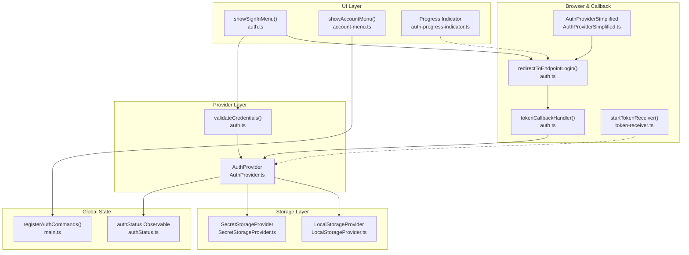
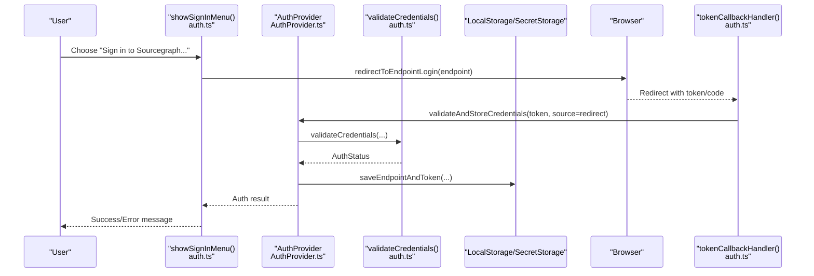
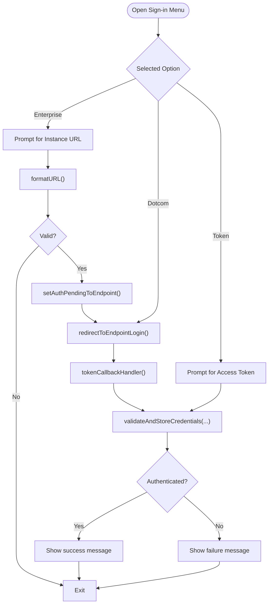
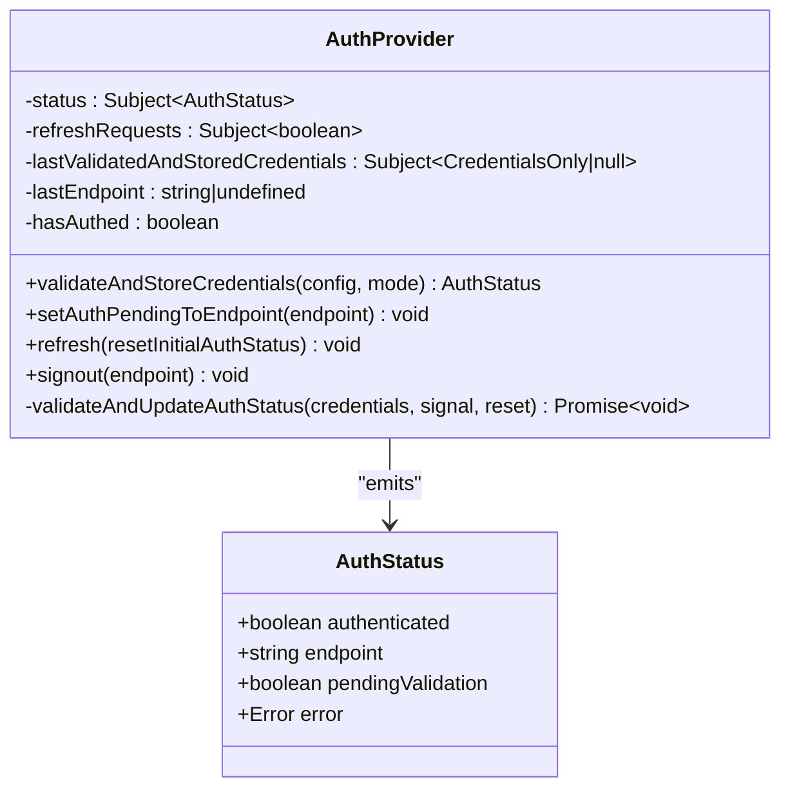
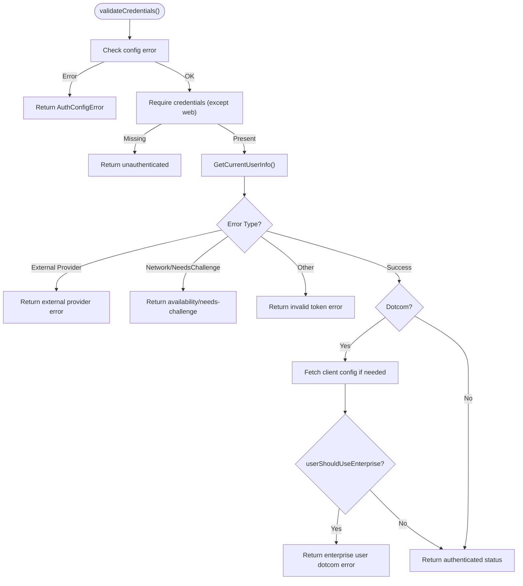
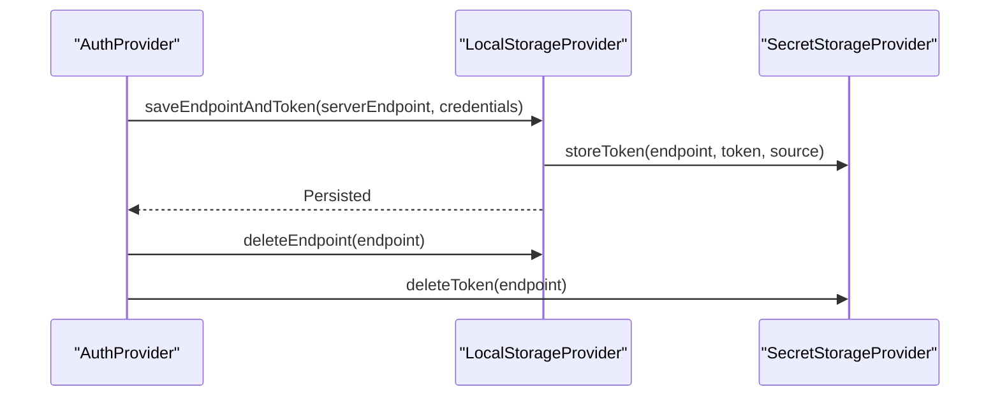
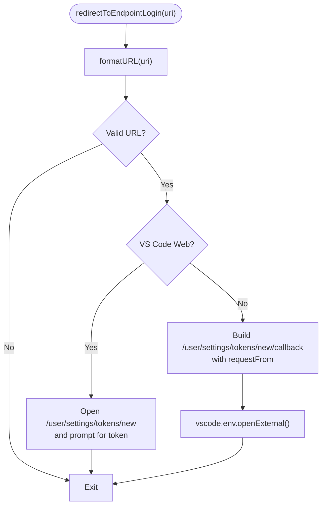
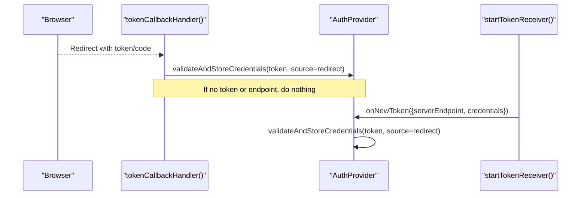
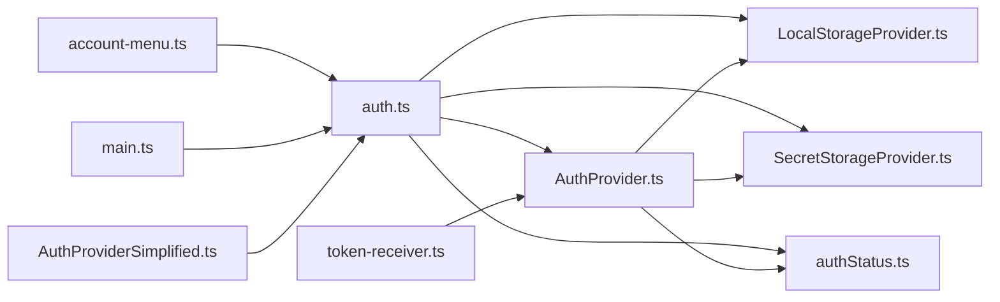

# Authentication Flows and Providers

<cite>
**Referenced Files in This Document**
- [auth.ts](file://vscode/src/auth/auth.ts)
- [AuthProvider.ts](file://vscode/src/services/AuthProvider.ts)
- [account-menu.ts](file://vscode/src/auth/account-menu.ts)
- [token-receiver.ts](file://vscode/src/auth/token-receiver.ts)
- [SecretStorageProvider.ts](file://vscode/src/services/SecretStorageProvider.ts)
- [LocalStorageProvider.ts](file://vscode/src/services/LocalStorageProvider.ts)
- [auth-progress-indicator.ts](file://vscode/src/auth/auth-progress-indicator.ts)
- [AuthProviderSimplified.ts](file://vscode/src/services/AuthProviderSimplified.ts)
- [main.ts](file://vscode/src/main.ts)
- [auth.test.ts](file://vscode/src/auth/auth.test.ts)
- [authStatus.ts](file://lib/shared/src/auth/authStatus.ts)
</cite>

## Table of Contents
1. [Introduction](#introduction)
2. [Project Structure](#project-structure)
3. [Core Components](#core-components)
4. [Architecture Overview](#architecture-overview)
5. [Detailed Component Analysis](#detailed-component-analysis)
6. [Dependency Analysis](#dependency-analysis)
7. [Performance Considerations](#performance-considerations)
8. [Troubleshooting Guide](#troubleshooting-guide)
9. [Conclusion](#conclusion)

## Introduction
This document explains the authentication flows and provider system in the Cody extension. It covers multi-provider authentication for Sourcegraph.com (dotcom), enterprise instances, and personal access tokens. It details URL-based login, token-based authentication, browser callback handling, the AuthProvider service, credential validation, token storage, authentication menu options, URL formatting/validation/redirection, error handling, user experience considerations, authentication state management, automatic token refresh triggers, and endpoint switching.

## Project Structure
The authentication system spans several modules:
- UI and menu orchestration for sign-in/sign-out and account actions
- Provider and validation logic for credentials
- Secure storage for tokens and endpoint history
- Browser callback handling and token receiver fallback
- Global auth state observables and progress indicators

**Diagram sources**
- [auth.ts:81-146](file://vscode/src/auth/auth.ts#L81-L146)
- [account-menu.ts:12-36](file://vscode/src/auth/account-menu.ts#L12-L36)
- [auth-progress-indicator.ts:5-27](file://vscode/src/auth/auth-progress-indicator.ts#L5-L27)
- [AuthProvider.ts:45-335](file://vscode/src/services/AuthProvider.ts#L45-L335)
- [auth.ts:458-569](file://vscode/src/auth/auth.ts#L458-L569)
- [LocalStorageProvider.ts:108-132](file://vscode/src/services/LocalStorageProvider.ts#L108-L132)
- [SecretStorageProvider.ts:89-118](file://vscode/src/services/SecretStorageProvider.ts#L89-L118)
- [auth.ts:284-310](file://vscode/src/auth/auth.ts#L284-L310)
- [auth.ts:336-378](file://vscode/src/auth/auth.ts#L336-L378)
- [token-receiver.ts:15-81](file://vscode/src/auth/token-receiver.ts#L15-L81)
- [AuthProviderSimplified.ts:13-50](file://vscode/src/services/AuthProviderSimplified.ts#L13-L50)
- [authStatus.ts:18-42](file://lib/shared/src/auth/authStatus.ts#L18-L42)
- [main.ts:592-602](file://vscode/src/main.ts#L592-L602)

**Section sources**
- [auth.ts:81-146](file://vscode/src/auth/auth.ts#L81-L146)
- [AuthProvider.ts:45-335](file://vscode/src/services/AuthProvider.ts#L45-L335)
- [LocalStorageProvider.ts:108-132](file://vscode/src/services/LocalStorageProvider.ts#L108-L132)
- [SecretStorageProvider.ts:89-118](file://vscode/src/services/SecretStorageProvider.ts#L89-L118)
- [auth.ts:284-310](file://vscode/src/auth/auth.ts#L284-L310)
- [auth.ts:336-378](file://vscode/src/auth/auth.ts#L336-L378)
- [token-receiver.ts:15-81](file://vscode/src/auth/token-receiver.ts#L15-L81)
- [AuthProviderSimplified.ts:13-50](file://vscode/src/services/AuthProviderSimplified.ts#L13-L50)
- [authStatus.ts:18-42](file://lib/shared/src/auth/authStatus.ts#L18-L42)
- [main.ts:592-602](file://vscode/src/main.ts#L592-L602)

## Core Components
- Authentication menu orchestration: sign-in menu, sign-out menu, and account menu
- AuthProvider: validates credentials, stores tokens, manages auth state, and handles refresh
- Credential validation: checks endpoint reachability, token validity, and enterprise/dotcom constraints
- Token storage: secure secret storage and local endpoint history
- Browser callback handling: URL formatting, redirection, and token extraction
- Simplified onboarding: dotcom external auth flows
- Progress indicator and telemetry: user feedback and event reporting

**Section sources**
- [auth.ts:81-146](file://vscode/src/auth/auth.ts#L81-L146)
- [AuthProvider.ts:45-335](file://vscode/src/services/AuthProvider.ts#L45-L335)
- [auth.ts:458-569](file://vscode/src/auth/auth.ts#L458-L569)
- [LocalStorageProvider.ts:108-132](file://vscode/src/services/LocalStorageProvider.ts#L108-L132)
- [SecretStorageProvider.ts:89-118](file://vscode/src/services/SecretStorageProvider.ts#L89-L118)
- [auth.ts:284-310](file://vscode/src/auth/auth.ts#L284-L310)
- [AuthProviderSimplified.ts:13-50](file://vscode/src/services/AuthProviderSimplified.ts#L13-L50)
- [auth-progress-indicator.ts:5-27](file://vscode/src/auth/auth-progress-indicator.ts#L5-L27)

## Architecture Overview
The authentication architecture centers on an observable auth status that reacts to configuration changes, token updates, and periodic refreshes. Providers and validators coordinate with secure storage and local history to maintain consistent authentication state across sessions.

**Diagram sources**
- [auth.ts:81-146](file://vscode/src/auth/auth.ts#L81-L146)
- [auth.ts:284-310](file://vscode/src/auth/auth.ts#L284-L310)
- [auth.ts:336-378](file://vscode/src/auth/auth.ts#L336-L378)
- [AuthProvider.ts:248-280](file://vscode/src/services/AuthProvider.ts#L248-L280)
- [auth.ts:458-569](file://vscode/src/auth/auth.ts#L458-L569)
- [LocalStorageProvider.ts:108-132](file://vscode/src/services/LocalStorageProvider.ts#L108-L132)
- [SecretStorageProvider.ts:89-118](file://vscode/src/services/SecretStorageProvider.ts#L89-L118)

## Detailed Component Analysis

### Authentication Menu System
- Sign-in menu supports three primary flows:
  - Enterprise instance URL entry and browser login
  - Dotcom login via browser
  - Token-based login for a given endpoint
- Account menu displays current identity, plan/enterprise info, and actions to switch or sign out
- Quick pick options include endpoint history and explicit choices

**Diagram sources**
- [auth.ts:81-146](file://vscode/src/auth/auth.ts#L81-L146)
- [auth.ts:380-403](file://vscode/src/auth/auth.ts#L380-L403)
- [auth.ts:284-310](file://vscode/src/auth/auth.ts#L284-L310)
- [auth.ts:336-378](file://vscode/src/auth/auth.ts#L336-L378)
- [AuthProvider.ts:248-280](file://vscode/src/services/AuthProvider.ts#L248-L280)

**Section sources**
- [auth.ts:81-146](file://vscode/src/auth/auth.ts#L81-L146)
- [account-menu.ts:12-36](file://vscode/src/auth/account-menu.ts#L12-L36)
- [auth.ts:380-403](file://vscode/src/auth/auth.ts#L380-L403)

### AuthProvider Service Implementation
- Validates credentials and emits auth status
- Stores validated credentials and serializes uninstaller info
- Manages pending auth state and refresh cycles
- Triggers periodic refresh on specific errors (e.g., needs auth challenge)
- Updates global context flags for activation and endpoint

**Diagram sources**
- [AuthProvider.ts:45-335](file://vscode/src/services/AuthProvider.ts#L45-L335)

**Section sources**
- [AuthProvider.ts:45-335](file://vscode/src/services/AuthProvider.ts#L45-L335)

### Credential Validation Mechanisms
- Validates configuration readiness and presence of credentials
- Calls GraphQL client to fetch current user info
- Handles availability/network errors, external provider auth errors, and invalid tokens
- Enforces dotcom-specific constraints (e.g., enterprise user on dotcom)
- Emits telemetry and logs for failures and successes

**Diagram sources**
- [auth.ts:458-569](file://vscode/src/auth/auth.ts#L458-L569)

**Section sources**
- [auth.ts:458-569](file://vscode/src/auth/auth.ts#L458-L569)

### Token Storage Strategies
- Local storage persists last used endpoint and endpoint history
- Secret storage persists tokens and token source
- On sign-out, tokens created via redirect are optionally deleted from the instance
- Endpoint history is maintained for quick selection and switching

**Diagram sources**
- [LocalStorageProvider.ts:108-132](file://vscode/src/services/LocalStorageProvider.ts#L108-L132)
- [SecretStorageProvider.ts:89-118](file://vscode/src/services/SecretStorageProvider.ts#L89-L118)
- [auth.ts:423-444](file://vscode/src/auth/auth.ts#L423-L444)

**Section sources**
- [LocalStorageProvider.ts:108-132](file://vscode/src/services/LocalStorageProvider.ts#L108-L132)
- [SecretStorageProvider.ts:89-118](file://vscode/src/services/SecretStorageProvider.ts#L89-L118)
- [auth.ts:423-444](file://vscode/src/auth/auth.ts#L423-L444)

### URL Formatting, Validation, and Redirection
- URL formatting ensures scheme and validity; rejects tokens masquerading as URLs
- Redirects to instance token creation page with referral code
- Special handling for VS Code Web to require manual token entry
- Callback handler extracts token/code and validates credentials

**Diagram sources**
- [auth.ts:284-310](file://vscode/src/auth/auth.ts#L284-L310)
- [auth.ts:380-403](file://vscode/src/auth/auth.ts#L380-L403)

**Section sources**
- [auth.ts:284-310](file://vscode/src/auth/auth.ts#L284-L310)
- [auth.ts:380-403](file://vscode/src/auth/auth.ts#L380-L403)

### Browser Callback Handling and Token Receiver
- Callback handler reads token/code from query, optionally switches instance, and validates
- Token receiver starts a local HTTP server to accept tokens posted by the browser
- Provides fallback when redirect does not occur or fails

**Diagram sources**
- [auth.ts:336-378](file://vscode/src/auth/auth.ts#L336-L378)
- [AuthProvider.ts:248-280](file://vscode/src/services/AuthProvider.ts#L248-L280)
- [token-receiver.ts:15-81](file://vscode/src/auth/token-receiver.ts#L15-L81)

**Section sources**
- [auth.ts:336-378](file://vscode/src/auth/auth.ts#L336-L378)
- [token-receiver.ts:15-81](file://vscode/src/auth/token-receiver.ts#L15-L81)

### Simplified Onboarding (Dotcom External Auth)
- AuthProviderSimplified opens external dotcom auth pages (GitHub, GitLab, Google, or generic)
- Sets pending auth state to dotcom and defers to standard callback flow

**Section sources**
- [AuthProviderSimplified.ts:13-50](file://vscode/src/services/AuthProviderSimplified.ts#L13-L50)

### Authentication State Management and Telemetry
- Global auth status observable tracks authenticated/pending/error states
- AuthProvider updates context flags and reports telemetry events
- First-ever authentication detection prevents duplicate logging

**Section sources**
- [authStatus.ts:18-42](file://lib/shared/src/auth/authStatus.ts#L18-L42)
- [AuthProvider.ts:208-220](file://vscode/src/services/AuthProvider.ts#L208-L220)
- [AuthProvider.ts:346-368](file://vscode/src/services/AuthProvider.ts#L346-L368)

### Automatic Token Refresh and Endpoint Switching
- Periodic refresh triggered when encountering needs-auth-challenge errors
- Manual refresh via command invokes AuthProvider.refresh
- Endpoint switching uses history and explicit URL entry; sets pending state during flow

**Section sources**
- [AuthProvider.ts:148-170](file://vscode/src/services/AuthProvider.ts#L148-L170)
- [AuthProvider.ts:231-234](file://vscode/src/services/AuthProvider.ts#L231-L234)
- [auth.ts:61-77](file://vscode/src/auth/auth.ts#L61-L77)

### Error Handling Patterns and User Experience
- Input validation for URLs and tokens
- Graceful handling of network/availability errors
- Clear error messages and progress indicators
- Tests demonstrate expected behavior for availability and invalid token scenarios

**Section sources**
- [auth.ts:177-208](file://vscode/src/auth/auth.ts#L177-L208)
- [auth.ts:324-331](file://vscode/src/auth/auth.ts#L324-L331)
- [auth-progress-indicator.ts:5-27](file://vscode/src/auth/auth-progress-indicator.ts#L5-L27)
- [auth.test.ts:37-95](file://vscode/src/auth/auth.test.ts#L37-L95)

## Dependency Analysis
The authentication system integrates tightly with:
- Global auth status observable for reactive updates
- VS Code commands for menu actions
- Secret/local storage for persistence
- GraphQL client for validation
- Browser environment for redirects

**Diagram sources**
- [auth.ts:81-146](file://vscode/src/auth/auth.ts#L81-L146)
- [AuthProvider.ts:45-335](file://vscode/src/services/AuthProvider.ts#L45-L335)
- [LocalStorageProvider.ts:108-132](file://vscode/src/services/LocalStorageProvider.ts#L108-L132)
- [SecretStorageProvider.ts:89-118](file://vscode/src/services/SecretStorageProvider.ts#L89-L118)
- [authStatus.ts:18-42](file://lib/shared/src/auth/authStatus.ts#L18-L42)
- [account-menu.ts:12-36](file://vscode/src/auth/account-menu.ts#L12-L36)
- [main.ts:592-602](file://vscode/src/main.ts#L592-L602)
- [token-receiver.ts:15-81](file://vscode/src/auth/token-receiver.ts#L15-L81)
- [AuthProviderSimplified.ts:13-50](file://vscode/src/services/AuthProviderSimplified.ts#L13-L50)

**Section sources**
- [auth.ts:81-146](file://vscode/src/auth/auth.ts#L81-L146)
- [AuthProvider.ts:45-335](file://vscode/src/services/AuthProvider.ts#L45-L335)
- [main.ts:592-602](file://vscode/src/main.ts#L592-L602)

## Performance Considerations
- Debounce and coalesce configuration-driven validations
- Avoid blocking sign-out on network calls; use fire-and-forget for token deletion
- Use short intervals for periodic refresh only when needed (e.g., needs-auth-challenge)
- Minimize redundant storage writes by batching endpoint and token persistence

## Troubleshooting Guide
Common issues and resolutions:
- Invalid URL or token input: ensure URLs start with http/https and are not tokens
- Network/unavailable endpoint: retry after verifying connectivity or wait for periodic refresh
- Invalid access token: re-enter token or switch instance
- VS Code Web limitations: manual token entry required; use “Sign In with URL and Access Token”
- Callback not received: use token receiver fallback to accept tokens posted locally

**Section sources**
- [auth.ts:177-208](file://vscode/src/auth/auth.ts#L177-L208)
- [auth.ts:324-331](file://vscode/src/auth/auth.ts#L324-L331)
- [auth.ts:284-310](file://vscode/src/auth/auth.ts#L284-L310)
- [token-receiver.ts:15-81](file://vscode/src/auth/token-receiver.ts#L15-L81)

## Conclusion
The authentication system provides a robust, multi-provider solution spanning dotcom, enterprise, and token-based flows. It emphasizes secure storage, observable state management, resilient validation, and user-friendly UX through menus, progress indicators, and clear error messaging. The provider orchestrates validation, persistence, and refresh behavior, while browser callbacks and token receivers ensure reliable token acquisition across environments.