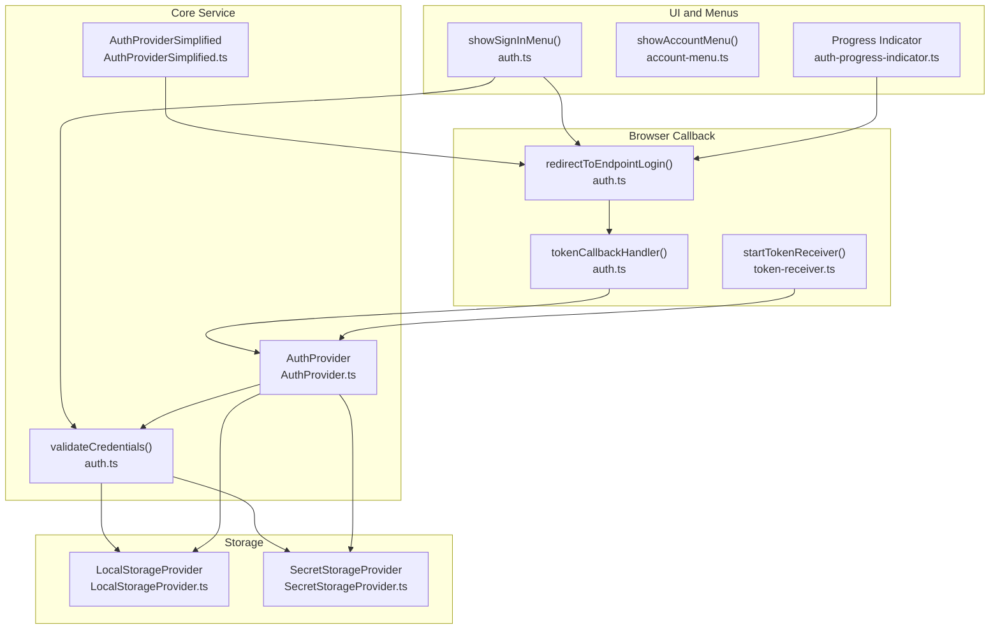
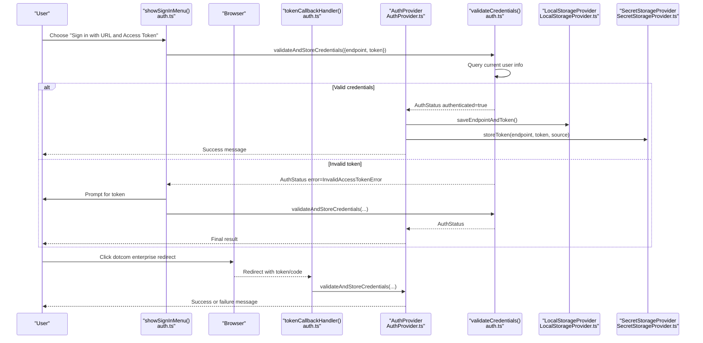
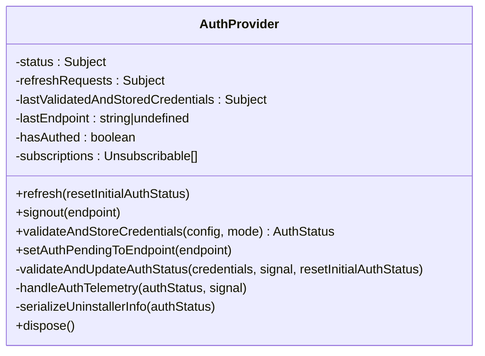
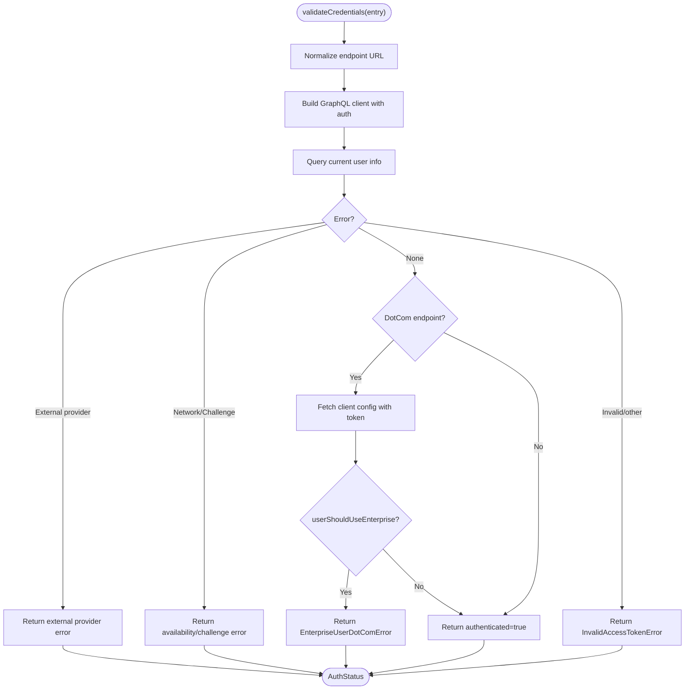
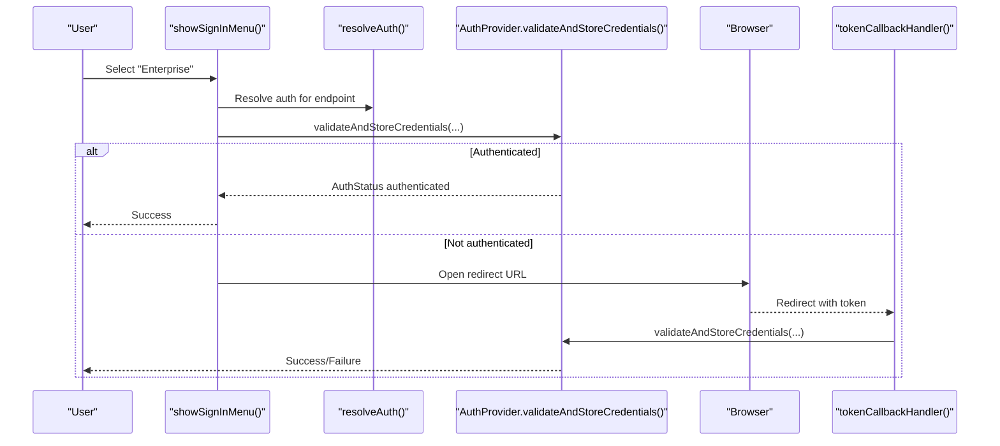
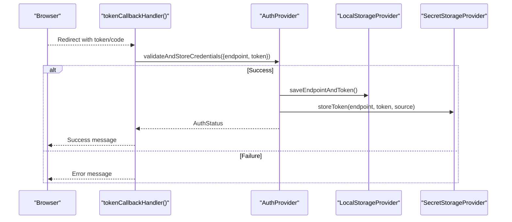
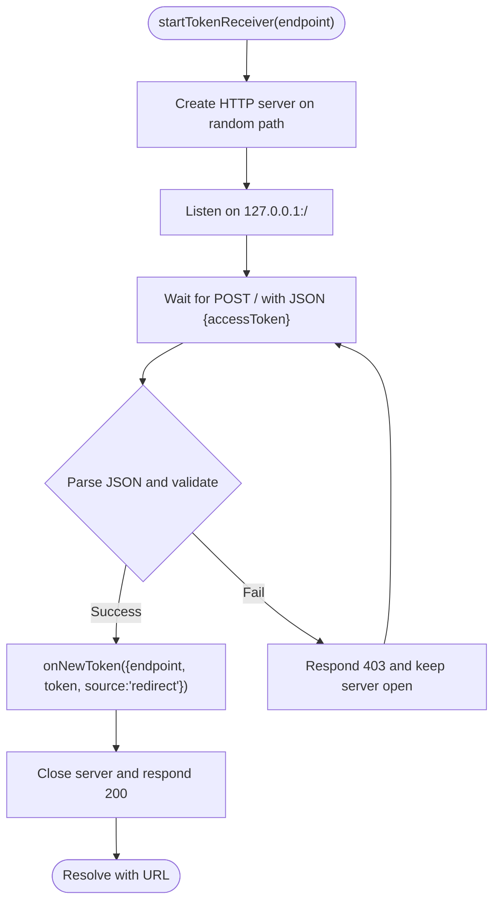
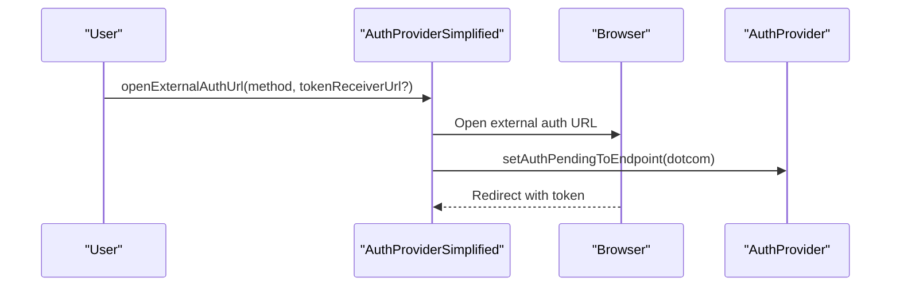
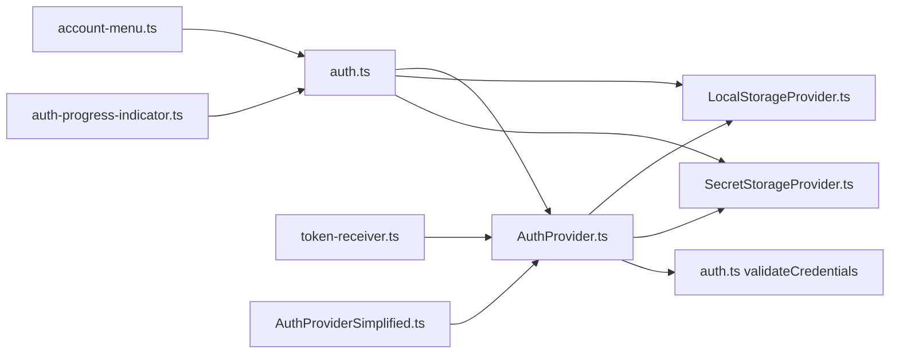

# Authentication System

<cite>
**Referenced Files in This Document**
- [AuthProvider.ts](file://vscode/src/services/AuthProvider.ts)
- [auth.ts](file://vscode/src/auth/auth.ts)
- [token-receiver.ts](file://vscode/src/auth/token-receiver.ts)
- [account-menu.ts](file://vscode/src/auth/account-menu.ts)
- [user.ts](file://vscode/src/auth/user.ts)
- [SecretStorageProvider.ts](file://vscode/src/services/SecretStorageProvider.ts)
- [LocalStorageProvider.ts](file://vscode/src/services/LocalStorageProvider.ts)
- [auth-progress-indicator.ts](file://vscode/src/auth/auth-progress-indicator.ts)
- [AuthProviderSimplified.ts](file://vscode/src/services/AuthProviderSimplified.ts)
- [auth.test.ts](file://vscode/src/auth/auth.test.ts)
</cite>

## Table of Contents
1. [Introduction](#introduction)
2. [Project Structure](#project-structure)
3. [Core Components](#core-components)
4. [Architecture Overview](#architecture-overview)
5. [Detailed Component Analysis](#detailed-component-analysis)
6. [Dependency Analysis](#dependency-analysis)
7. [Performance Considerations](#performance-considerations)
8. [Troubleshooting Guide](#troubleshooting-guide)
9. [Conclusion](#conclusion)
10. [Appendices](#appendices)

## Introduction
This document explains Cody’s authentication system across three primary environments:
- Sourcegraph.com (dotcom)
- Enterprise instances (SSO, LDAP, OAuth, SAML)
- Personal access tokens (PATs)

It covers the multi-provider authentication architecture, authentication flows (URL-based login, token-based authentication, browser callback handling), the AuthProvider service, credential validation, token storage, enterprise SSO integration, authentication menu and account management, endpoint switching, configuration examples, troubleshooting, and security best practices.

## Project Structure
Authentication spans several modules:
- UI and menu orchestration for sign-in, switching, and sign-out
- Browser-based token callback handling
- Local and secret storage for endpoints and tokens
- Centralized AuthProvider service that validates credentials and emits status
- Simplified onboarding provider for dotcom external auth
- Token receiver for agent/desktop environments

**Diagram sources**
- [auth.ts:81-146](file://vscode/src/auth/auth.ts#L81-L146)
- [account-menu.ts:12-36](file://vscode/src/auth/account-menu.ts#L12-L36)
- [auth-progress-indicator.ts:5-27](file://vscode/src/auth/auth-progress-indicator.ts#L5-L27)
- [auth.ts:284-310](file://vscode/src/auth/auth.ts#L284-L310)
- [auth.ts:336-378](file://vscode/src/auth/auth.ts#L336-L378)
- [token-receiver.ts:15-81](file://vscode/src/auth/token-receiver.ts#L15-L81)
- [LocalStorageProvider.ts:108-132](file://vscode/src/services/LocalStorageProvider.ts#L108-L132)
- [SecretStorageProvider.ts:89-118](file://vscode/src/services/SecretStorageProvider.ts#L89-L118)
- [AuthProvider.ts:45-206](file://vscode/src/services/AuthProvider.ts#L45-L206)
- [auth.ts:458-569](file://vscode/src/auth/auth.ts#L458-L569)
- [AuthProviderSimplified.ts:13-21](file://vscode/src/services/AuthProviderSimplified.ts#L13-L21)

**Section sources**
- [auth.ts:81-146](file://vscode/src/auth/auth.ts#L81-L146)
- [AuthProvider.ts:45-206](file://vscode/src/services/AuthProvider.ts#L45-L206)
- [LocalStorageProvider.ts:108-132](file://vscode/src/services/LocalStorageProvider.ts#L108-L132)
- [SecretStorageProvider.ts:89-118](file://vscode/src/services/SecretStorageProvider.ts#L89-L118)
- [AuthProviderSimplified.ts:13-21](file://vscode/src/services/AuthProviderSimplified.ts#L13-L21)
- [token-receiver.ts:15-81](file://vscode/src/auth/token-receiver.ts#L15-L81)
- [auth-progress-indicator.ts:5-27](file://vscode/src/auth/auth-progress-indicator.ts#L5-L27)

## Core Components
- AuthProvider: central service that validates credentials, updates auth status, handles periodic retries, and emits context flags for activation.
- Credential validation: validateCredentials resolves endpoint and token, queries current user info, checks enterprise/dotcom constraints, and classifies errors.
- Storage: LocalStorageProvider persists endpoint and endpoint history; SecretStorageProvider stores tokens securely keyed by endpoint.
- Menu and UI: showSignInMenu orchestrates URL-based login, PAT entry, and endpoint switching; showAccountMenu manages account actions.
- Browser callback: redirectToEndpointLogin opens the browser; tokenCallbackHandler receives tokens and finalizes authentication.
- Token receiver: startTokenReceiver enables agent/desktop to receive tokens via a local HTTP endpoint.
- Simplified onboarding: AuthProviderSimplified opens external dotcom auth flows.

**Section sources**
- [AuthProvider.ts:45-206](file://vscode/src/services/AuthProvider.ts#L45-L206)
- [auth.ts:458-569](file://vscode/src/auth/auth.ts#L458-L569)
- [LocalStorageProvider.ts:108-132](file://vscode/src/services/LocalStorageProvider.ts#L108-L132)
- [SecretStorageProvider.ts:89-118](file://vscode/src/services/SecretStorageProvider.ts#L89-L118)
- [auth.ts:81-146](file://vscode/src/auth/auth.ts#L81-L146)
- [account-menu.ts:12-36](file://vscode/src/auth/account-menu.ts#L12-L36)
- [auth.ts:284-310](file://vscode/src/auth/auth.ts#L284-L310)
- [auth.ts:336-378](file://vscode/src/auth/auth.ts#L336-L378)
- [token-receiver.ts:15-81](file://vscode/src/auth/token-receiver.ts#L15-L81)
- [AuthProviderSimplified.ts:13-21](file://vscode/src/services/AuthProviderSimplified.ts#L13-L21)

## Architecture Overview
The authentication system is event-driven and observable. It reacts to configuration changes, user actions, and periodic retries to maintain accurate auth status.

**Diagram sources**
- [auth.ts:81-146](file://vscode/src/auth/auth.ts#L81-L146)
- [auth.ts:336-378](file://vscode/src/auth/auth.ts#L336-L378)
- [auth.ts:458-569](file://vscode/src/auth/auth.ts#L458-L569)
- [AuthProvider.ts:248-280](file://vscode/src/services/AuthProvider.ts#L248-L280)
- [LocalStorageProvider.ts:108-132](file://vscode/src/services/LocalStorageProvider.ts#L108-L132)
- [SecretStorageProvider.ts:89-118](file://vscode/src/services/SecretStorageProvider.ts#L89-L118)

## Detailed Component Analysis

### AuthProvider Service
Responsibilities:
- Validate credentials and emit AuthStatus
- Periodically retry authentication when challenges are needed
- Update VS Code context flags and telemetry
- Serialize uninstaller snapshot on successful auth
- Support manual refresh and sign-out

Key behaviors:
- Subscribes to resolved configuration changes and triggers validation when credentials differ from last validated
- Emits pending validation state while validating
- On availability or challenge errors, schedules periodic retries
- Updates cody.activated and cody.serverEndpoint context keys

**Diagram sources**
- [AuthProvider.ts:45-206](file://vscode/src/services/AuthProvider.ts#L45-L206)
- [AuthProvider.ts:248-332](file://vscode/src/services/AuthProvider.ts#L248-L332)

**Section sources**
- [AuthProvider.ts:45-206](file://vscode/src/services/AuthProvider.ts#L45-L206)
- [AuthProvider.ts:248-332](file://vscode/src/services/AuthProvider.ts#L248-L332)

### Credential Validation and Error Handling
validateCredentials:
- Normalizes endpoint URL
- Builds GraphQL client with custom headers and auth
- Queries current user info
- Classifies errors:
  - External provider auth errors
  - Availability/network errors
  - NeedsAuthChallengeError (e.g., MFA/device auth renewal)
  - Invalid access token
  - Enterprise user on dotcom (redirect suggestion)
- Returns AuthStatus with authenticated flag and error classification

**Diagram sources**
- [auth.ts:458-569](file://vscode/src/auth/auth.ts#L458-L569)

**Section sources**
- [auth.ts:458-569](file://vscode/src/auth/auth.ts#L458-L569)

### Authentication Menu System and Endpoint Switching
- showSignInMenu presents options:
  - Enterprise instance login (URL + browser redirect)
  - Token-based login (URL + token)
  - Switch account (history and current endpoint)
- showEnterpriseInstanceUrlFlow attempts to auto-login using stored or resolved auth; otherwise starts redirect flow
- showAccountMenu allows managing account, switching, and signing out

**Diagram sources**
- [auth.ts:81-146](file://vscode/src/auth/auth.ts#L81-L146)
- [auth.ts:336-378](file://vscode/src/auth/auth.ts#L336-L378)
- [AuthProvider.ts:248-280](file://vscode/src/services/AuthProvider.ts#L248-L280)

**Section sources**
- [auth.ts:81-146](file://vscode/src/auth/auth.ts#L81-L146)
- [auth.ts:336-378](file://vscode/src/auth/auth.ts#L336-L378)
- [account-menu.ts:12-36](file://vscode/src/auth/account-menu.ts#L12-L36)

### Browser Callback Handling and Token Storage
- redirectToEndpointLogin constructs the callback URL and opens the browser
- tokenCallbackHandler parses the callback, optionally switches to another instance, validates and stores credentials, and reports telemetry
- validateAndStoreCredentials writes endpoint and token to LocalStorageProvider and SecretStorageProvider

**Diagram sources**
- [auth.ts:284-310](file://vscode/src/auth/auth.ts#L284-L310)
- [auth.ts:336-378](file://vscode/src/auth/auth.ts#L336-L378)
- [AuthProvider.ts:248-280](file://vscode/src/services/AuthProvider.ts#L248-L280)
- [LocalStorageProvider.ts:108-132](file://vscode/src/services/LocalStorageProvider.ts#L108-L132)
- [SecretStorageProvider.ts:89-118](file://vscode/src/services/SecretStorageProvider.ts#L89-L118)

**Section sources**
- [auth.ts:284-310](file://vscode/src/auth/auth.ts#L284-L310)
- [auth.ts:336-378](file://vscode/src/auth/auth.ts#L336-L378)
- [AuthProvider.ts:248-280](file://vscode/src/services/AuthProvider.ts#L248-L280)
- [LocalStorageProvider.ts:108-132](file://vscode/src/services/LocalStorageProvider.ts#L108-L132)
- [SecretStorageProvider.ts:89-118](file://vscode/src/services/SecretStorageProvider.ts#L89-L118)

### Token Receiver for Agent/Desktop
startTokenReceiver spins up a local HTTP server with a random token path to accept POST requests containing accessToken. On success, it invokes onNewToken with normalized credentials and closes the server.

**Diagram sources**
- [token-receiver.ts:15-81](file://vscode/src/auth/token-receiver.ts#L15-L81)

**Section sources**
- [token-receiver.ts:15-81](file://vscode/src/auth/token-receiver.ts#L15-L81)

### Simplified Onboarding (Dotcom External Auth)
AuthProviderSimplified opens external auth pages (GitHub, GitLab, Google, or dotcom sign-in) and sets pending auth to dotcom endpoint.

**Diagram sources**
- [AuthProviderSimplified.ts:13-21](file://vscode/src/services/AuthProviderSimplified.ts#L13-L21)
- [AuthProviderSimplified.ts:24-49](file://vscode/src/services/AuthProviderSimplified.ts#L24-L49)
- [AuthProvider.ts:282-285](file://vscode/src/services/AuthProvider.ts#L282-L285)

**Section sources**
- [AuthProviderSimplified.ts:13-21](file://vscode/src/services/AuthProviderSimplified.ts#L13-L21)
- [AuthProviderSimplified.ts:24-49](file://vscode/src/services/AuthProviderSimplified.ts#L24-L49)
- [AuthProvider.ts:282-285](file://vscode/src/services/AuthProvider.ts#L282-L285)

### Authentication State Management and Telemetry
- AuthProvider emits distinct AuthStatus updates and sets VS Code context keys cody.activated and cody.serverEndpoint
- Reports telemetry events for auth transitions and first-ever login detection
- Serializes uninstaller snapshot on successful auth for post-uninstall diagnostics

**Section sources**
- [AuthProvider.ts:172-196](file://vscode/src/services/AuthProvider.ts#L172-L196)
- [AuthProvider.ts:346-368](file://vscode/src/services/AuthProvider.ts#L346-L368)
- [AuthProvider.ts:312-332](file://vscode/src/services/AuthProvider.ts#L312-L332)

## Dependency Analysis
- AuthProvider depends on:
  - Auth status observables and resolved configuration
  - LocalStorageProvider for endpoint/token persistence
  - SecretStorageProvider for secure token storage
  - validateCredentials for credential verification
- auth.ts orchestrates UI flows and delegates validation/storage to AuthProvider
- token-receiver.ts is independent and complements browser callback handling
- account-menu.ts depends on current auth status and invokes sign-in/sign-out

**Diagram sources**
- [AuthProvider.ts:45-206](file://vscode/src/services/AuthProvider.ts#L45-L206)
- [auth.ts:81-146](file://vscode/src/auth/auth.ts#L81-L146)
- [token-receiver.ts:15-81](file://vscode/src/auth/token-receiver.ts#L15-L81)
- [account-menu.ts:12-36](file://vscode/src/auth/account-menu.ts#L12-L36)
- [auth-progress-indicator.ts:5-27](file://vscode/src/auth/auth-progress-indicator.ts#L5-L27)
- [AuthProviderSimplified.ts:13-21](file://vscode/src/services/AuthProviderSimplified.ts#L13-L21)

**Section sources**
- [AuthProvider.ts:45-206](file://vscode/src/services/AuthProvider.ts#L45-L206)
- [auth.ts:81-146](file://vscode/src/auth/auth.ts#L81-L146)
- [token-receiver.ts:15-81](file://vscode/src/auth/token-receiver.ts#L15-L81)
- [account-menu.ts:12-36](file://vscode/src/auth/account-menu.ts#L12-L36)
- [auth-progress-indicator.ts:5-27](file://vscode/src/auth/auth-progress-indicator.ts#L5-L27)
- [AuthProviderSimplified.ts:13-21](file://vscode/src/services/AuthProviderSimplified.ts#L13-L21)

## Performance Considerations
- AuthProvider debounces repeated validations by comparing normalized credentials and only triggering when they change
- Periodic retries for NeedsAuthChallengeError occur at a short interval to minimize user wait
- Telemetry reporting is decoupled and only emitted on meaningful state changes
- Local and secret storage operations are batched to reduce churn and avoid inconsistent reads

[No sources needed since this section provides general guidance]

## Troubleshooting Guide
Common issues and resolutions:
- Invalid access token:
  - Symptom: Authentication fails with invalid token error
  - Resolution: Re-enter token via the token-based sign-in flow
- Network/unavailable endpoint:
  - Symptom: Availability error; UI shows “Network Error”
  - Resolution: Verify endpoint reachability and retry; AuthProvider automatically retries
- Device/MFA challenge required:
  - Symptom: NeedsAuthChallengeError prompts for device authentication
  - Resolution: Complete the challenge in-browser; AuthProvider retries automatically
- Enterprise user on dotcom:
  - Symptom: EnterpriseUserDotComError suggests using enterprise instance
  - Resolution: Use enterprise sign-in flow or switch endpoint
- Browser callback not received:
  - Symptom: Redirect completes but token not stored
  - Resolution: Use token receiver for agent/desktop; ensure callback URL is correct; re-open redirect

Operational tips:
- Use cody.auth.refresh command to force revalidation
- Check cody.activated and cody.serverEndpoint context keys for current state
- Review telemetry events cody.auth and cody.auth.login for diagnostics

**Section sources**
- [auth.test.ts:37-95](file://vscode/src/auth/auth.test.ts#L37-L95)
- [auth.ts:458-569](file://vscode/src/auth/auth.ts#L458-L569)
- [AuthProvider.ts:148-170](file://vscode/src/services/AuthProvider.ts#L148-L170)

## Conclusion
Cody’s authentication system provides a robust, observable, and user-friendly mechanism spanning dotcom, enterprise, and PAT-based flows. It integrates browser callbacks, local and secret storage, simplified onboarding, and comprehensive error handling. The AuthProvider centralizes validation and state, while UI flows guide users through sign-in, switching, and sign-out. Proper configuration, token storage, and troubleshooting practices ensure reliable authentication across environments.

[No sources needed since this section summarizes without analyzing specific files]

## Appendices

### Configuration Examples
- Dotcom login:
  - Use “Sign in with URL and Access Token” and paste a PAT for dotcom
  - Alternatively, use simplified onboarding external auth (GitHub/GitLab/Google)
- Enterprise login:
  - Use “Sign in to Sourcegraph Enterprise Instance” and follow browser redirect
  - For PAT-based enterprise, choose “Sign in with URL and Access Token”
- Agent/Desktop environments:
  - Use token receiver URL to accept tokens via local HTTP endpoint

[No sources needed since this section provides general guidance]

### Security Best Practices for Token Management
- Prefer browser-based redirects when available; tokens are short-lived and scoped
- Avoid storing tokens in plaintext outside secret storage
- Use token sources to track whether tokens were created via redirect or manually pasted
- Regularly review and rotate tokens; sign out when leaving shared machines
- Keep endpoints and tokens synchronized; avoid mixing tokens across instances

[No sources needed since this section provides general guidance]