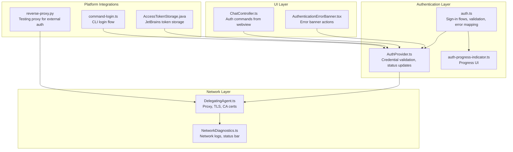
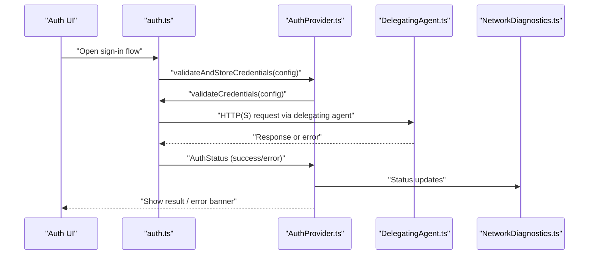
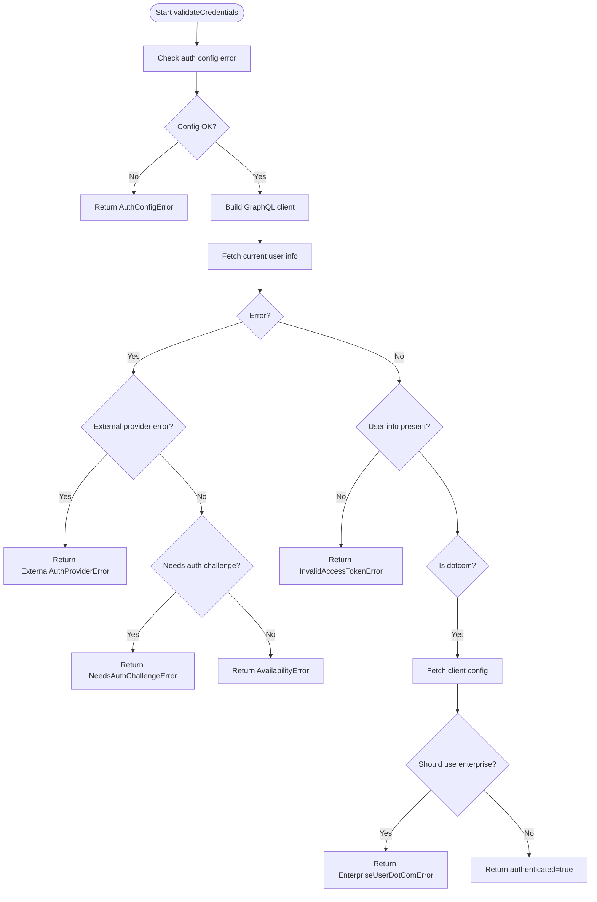
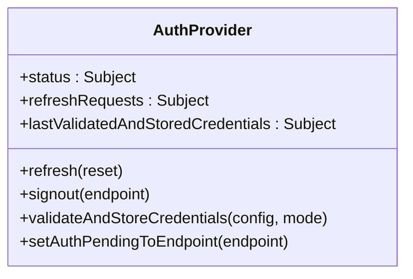
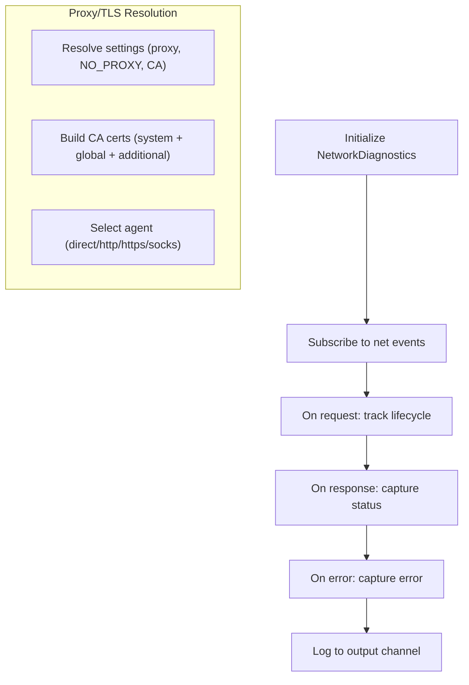
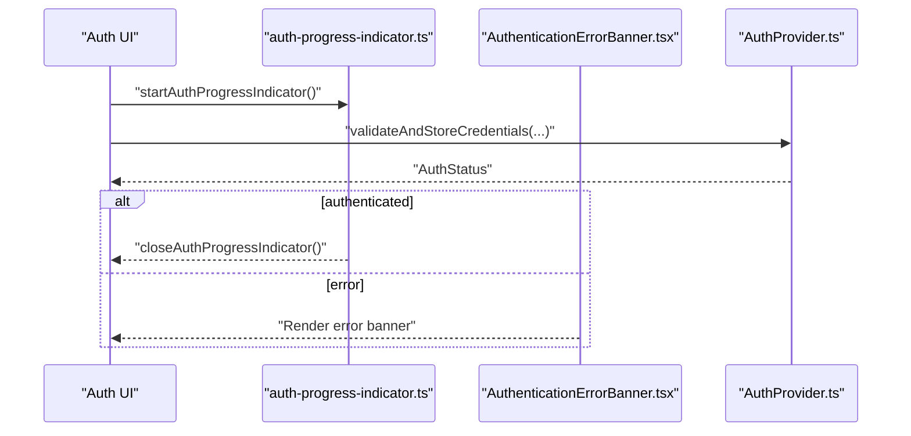
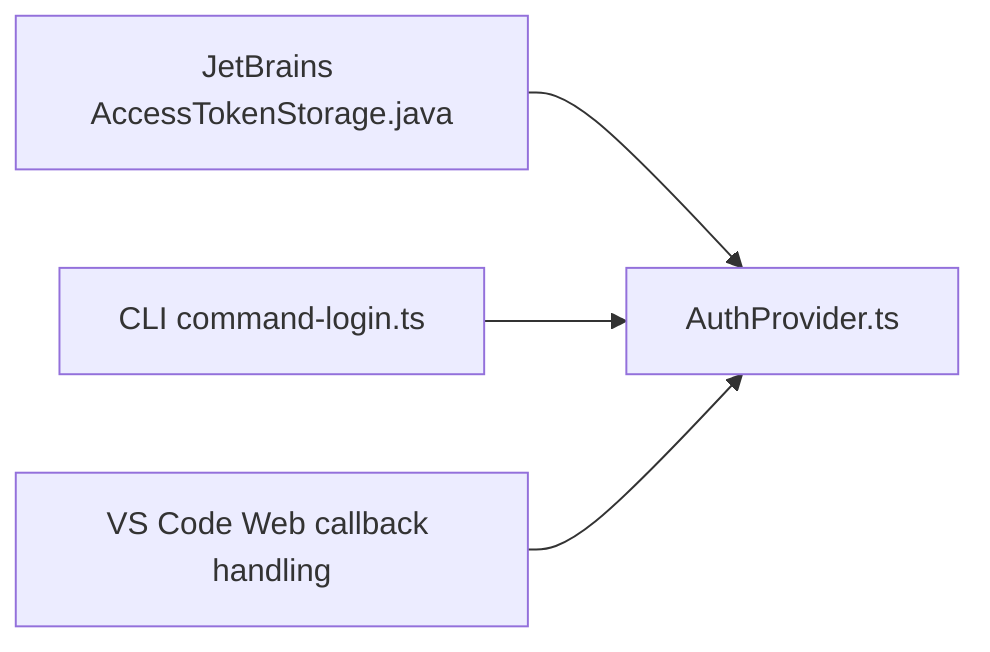
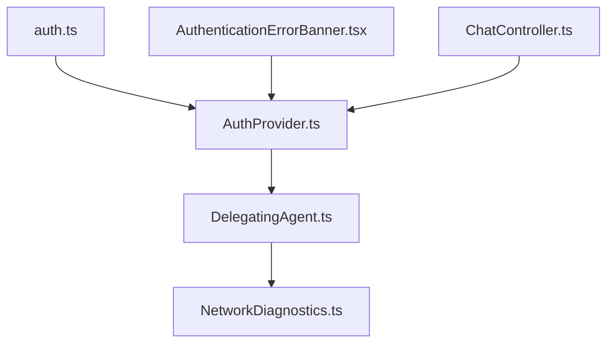

# Authentication Troubleshooting

<cite>
**Referenced Files in This Document**
- [auth.ts](file://vscode/src/auth/auth.ts)
- [auth-progress-indicator.ts](file://vscode/src/auth/auth-progress-indicator.ts)
- [AuthProvider.ts](file://vscode/src/services/AuthProvider.ts)
- [NetworkDiagnostics.ts](file://vscode/src/services/NetworkDiagnostics.ts)
- [DelegatingAgent.ts](file://vscode/src/net/DelegatingAgent.ts)
- [errors.ts](file://lib/shared/src/sourcegraph-api/errors.ts)
- [ChatController.ts](file://vscode/src/chat/chat-view/ChatController.ts)
- [AuthenticationErrorBanner.tsx](file://vscode/webviews/components/AuthenticationErrorBanner.tsx)
- [output-channel-logger.ts](file://vscode/src/autoedits/output-channel-logger.ts)
- [reverse-proxy.py](file://agent/scripts/reverse-proxy.py)
- [AccessTokenStorage.java](file://jetbrains/src/main/java/com/sourcegraph/config/AccessTokenStorage.java)
- [command-login.ts](file://agent/src/cli/command-auth/command-login.ts)
- [nodeClient.ts](file://vscode/src/completions/nodeClient.ts)
</cite>

## Table of Contents
1. [Introduction](#introduction)
2. [Project Structure](#project-structure)
3. [Core Components](#core-components)
4. [Architecture Overview](#architecture-overview)
5. [Detailed Component Analysis](#detailed-component-analysis)
6. [Dependency Analysis](#dependency-analysis)
7. [Performance Considerations](#performance-considerations)
8. [Troubleshooting Guide](#troubleshooting-guide)
9. [Conclusion](#conclusion)

## Introduction
This document provides comprehensive troubleshooting guidance for authentication issues across desktop, web, and JetBrains IDEs. It explains how authentication is performed, how to diagnose root causes, interpret error messages, and resolve common problems such as invalid tokens, network connectivity issues, endpoint unavailability, and SSO/proxy/certificate failures. It also covers platform-specific behaviors, diagnostic tools (including the output channel logger, authentication progress indicators, and network diagnostics), and step-by-step recovery procedures.

## Project Structure
Authentication spans several subsystems:
- Authentication orchestration and validation
- Credential storage and refresh
- Network configuration and proxy handling
- UI feedback and progress indicators
- Platform-specific integrations (JetBrains, CLI, VS Code Web)

**Diagram sources**
- [auth.ts:458-569](file://vscode/src/auth/auth.ts#L458-L569)
- [AuthProvider.ts:61-88](file://vscode/src/services/AuthProvider.ts#L61-L88)
- [auth-progress-indicator.ts:5-27](file://vscode/src/auth/auth-progress-indicator.ts#L5-L27)
- [DelegatingAgent.ts:139-245](file://vscode/src/net/DelegatingAgent.ts#L139-L245)
- [NetworkDiagnostics.ts:180-217](file://vscode/src/services/NetworkDiagnostics.ts#L180-L217)
- [AuthenticationErrorBanner.tsx:11-40](file://vscode/webviews/components/AuthenticationErrorBanner.tsx#L11-L40)
- [ChatController.ts:615-643](file://vscode/src/chat/chat-view/ChatController.ts#L615-L643)
- [AccessTokenStorage.java:1-30](file://jetbrains/src/main/java/com/sourcegraph/config/AccessTokenStorage.java#L1-L30)
- [command-login.ts:171-194](file://agent/src/cli/command-auth/command-login.ts#L171-L194)
- [reverse-proxy.py:32-94](file://agent/scripts/reverse-proxy.py#L32-L94)

**Section sources**
- [auth.ts:1-603](file://vscode/src/auth/auth.ts#L1-L603)
- [AuthProvider.ts:1-380](file://vscode/src/services/AuthProvider.ts#L1-L380)
- [DelegatingAgent.ts:1-562](file://vscode/src/net/DelegatingAgent.ts#L1-L562)
- [NetworkDiagnostics.ts:1-382](file://vscode/src/services/NetworkDiagnostics.ts#L1-L382)
- [AuthenticationErrorBanner.tsx:1-41](file://vscode/webviews/components/AuthenticationErrorBanner.tsx#L1-L41)
- [ChatController.ts:615-643](file://vscode/src/chat/chat-view/ChatController.ts#L615-L643)
- [AccessTokenStorage.java:1-30](file://jetbrains/src/main/java/com/sourcegraph/config/AccessTokenStorage.java#L1-L30)
- [command-login.ts:171-194](file://agent/src/cli/command-auth/command-login.ts#L171-L194)
- [reverse-proxy.py:32-94](file://agent/scripts/reverse-proxy.py#L32-L94)

## Core Components
- Authentication orchestration and validation: Central logic validates credentials, maps errors, and determines success/failure.
- Credential provider: Manages status updates, retries, telemetry, and storage.
- Network diagnostics: Captures request timelines, errors, and exposes a status bar indicator.
- Proxy/TLS agent: Builds CA certificates, supports HTTP/HTTPS/SOCKS proxies, and honors NO_PROXY rules.
- UI feedback: Progress indicator during sign-in and error banner with action buttons.
- Platform integrations: JetBrains secure storage, CLI login flow, and testing proxy for external auth scenarios.

**Section sources**
- [auth.ts:458-569](file://vscode/src/auth/auth.ts#L458-L569)
- [AuthProvider.ts:61-88](file://vscode/src/services/AuthProvider.ts#L61-L88)
- [NetworkDiagnostics.ts:180-217](file://vscode/src/services/NetworkDiagnostics.ts#L180-L217)
- [DelegatingAgent.ts:298-356](file://vscode/src/net/DelegatingAgent.ts#L298-L356)
- [auth-progress-indicator.ts:5-27](file://vscode/src/auth/auth-progress-indicator.ts#L5-L27)
- [AuthenticationErrorBanner.tsx:11-40](file://vscode/webviews/components/AuthenticationErrorBanner.tsx#L11-L40)

## Architecture Overview
The authentication flow integrates UI, validation, and network layers. It emits telemetry, updates status, and surfaces actionable errors.

**Diagram sources**
- [auth.ts:458-569](file://vscode/src/auth/auth.ts#L458-L569)
- [AuthProvider.ts:248-280](file://vscode/src/services/AuthProvider.ts#L248-L280)
- [DelegatingAgent.ts:139-245](file://vscode/src/net/DelegatingAgent.ts#L139-L245)
- [NetworkDiagnostics.ts:251-294](file://vscode/src/services/NetworkDiagnostics.ts#L251-L294)

## Detailed Component Analysis

### Authentication Orchestration and Validation
- Validates credentials against the configured endpoint.
- Maps external provider errors, availability/network errors, and invalid tokens.
- Handles enterprise dotcom redirection and user role checks.

**Diagram sources**
- [auth.ts:458-569](file://vscode/src/auth/auth.ts#L458-L569)
- [errors.ts:158-229](file://lib/shared/src/sourcegraph-api/errors.ts#L158-L229)

**Section sources**
- [auth.ts:458-569](file://vscode/src/auth/auth.ts#L458-L569)
- [errors.ts:127-229](file://lib/shared/src/sourcegraph-api/errors.ts#L127-L229)

### Credential Provider and Status Management
- Emits pending validation, tracks last validated credentials, and refreshes automatically on configuration changes.
- Periodically retries authentication when a challenge is needed.
- Updates context flags and telemetry.

**Diagram sources**
- [AuthProvider.ts:45-206](file://vscode/src/services/AuthProvider.ts#L45-L206)

**Section sources**
- [AuthProvider.ts:61-88](file://vscode/src/services/AuthProvider.ts#L61-L88)
- [AuthProvider.ts:148-170](file://vscode/src/services/AuthProvider.ts#L148-L170)
- [AuthProvider.ts:231-280](file://vscode/src/services/AuthProvider.ts#L231-L280)

### Network Diagnostics and Proxy/TLS Handling
- Captures request lifecycle events (created, socket, response, error, timeout, close) and logs them to an output channel.
- Provides a status bar indicator for configuration errors and a command to reveal logs.
- DelegatingAgent resolves proxy settings, builds CA certificates, and supports HTTP/HTTPS/SOCKS proxies with NO_PROXY rules.

**Diagram sources**
- [NetworkDiagnostics.ts:180-217](file://vscode/src/services/NetworkDiagnostics.ts#L180-L217)
- [DelegatingAgent.ts:247-296](file://vscode/src/net/DelegatingAgent.ts#L247-L296)
- [DelegatingAgent.ts:298-356](file://vscode/src/net/DelegatingAgent.ts#L298-L356)

**Section sources**
- [NetworkDiagnostics.ts:180-217](file://vscode/src/services/NetworkDiagnostics.ts#L180-L217)
- [NetworkDiagnostics.ts:251-294](file://vscode/src/services/NetworkDiagnostics.ts#L251-L294)
- [DelegatingAgent.ts:247-296](file://vscode/src/net/DelegatingAgent.ts#L247-L296)
- [DelegatingAgent.ts:298-356](file://vscode/src/net/DelegatingAgent.ts#L298-L356)

### UI Feedback and Progress Indicators
- Authentication progress indicator shows “Signing in…” with cancellation support.
- Authentication error banner displays a title/content and offers Try Again and Sign Out actions.

**Diagram sources**
- [auth-progress-indicator.ts:5-27](file://vscode/src/auth/auth-progress-indicator.ts#L5-L27)
- [AuthenticationErrorBanner.tsx:11-40](file://vscode/webviews/components/AuthenticationErrorBanner.tsx#L11-L40)
- [AuthProvider.ts:248-280](file://vscode/src/services/AuthProvider.ts#L248-L280)

**Section sources**
- [auth-progress-indicator.ts:5-27](file://vscode/src/auth/auth-progress-indicator.ts#L5-L27)
- [AuthenticationErrorBanner.tsx:11-40](file://vscode/webviews/components/AuthenticationErrorBanner.tsx#L11-L40)

### Platform-Specific Authentication
- JetBrains IDEs: Secure storage for enterprise and dotcom tokens.
- CLI: Starts a local callback server, opens browser, and waits for tokens.
- VS Code Web: Uses manual token entry flow for callback limitations.

**Diagram sources**
- [AccessTokenStorage.java:1-30](file://jetbrains/src/main/java/com/sourcegraph/config/AccessTokenStorage.java#L1-L30)
- [command-login.ts:171-194](file://agent/src/cli/command-auth/command-login.ts#L171-L194)
- [auth.ts:284-310](file://vscode/src/auth/auth.ts#L284-L310)

**Section sources**
- [AccessTokenStorage.java:1-30](file://jetbrains/src/main/java/com/sourcegraph/config/AccessTokenStorage.java#L1-L30)
- [command-login.ts:171-194](file://agent/src/cli/command-auth/command-login.ts#L171-L194)
- [auth.ts:284-310](file://vscode/src/auth/auth.ts#L284-L310)

## Dependency Analysis
- auth.ts depends on AuthProvider.ts for validation and status updates.
- AuthProvider.ts depends on DelegatingAgent.ts for network requests and on NetworkDiagnostics.ts for status reporting.
- UI components depend on AuthProvider.ts for status and actions.

**Diagram sources**
- [auth.ts:458-569](file://vscode/src/auth/auth.ts#L458-L569)
- [AuthProvider.ts:61-88](file://vscode/src/services/AuthProvider.ts#L61-L88)
- [DelegatingAgent.ts:139-245](file://vscode/src/net/DelegatingAgent.ts#L139-L245)
- [NetworkDiagnostics.ts:251-294](file://vscode/src/services/NetworkDiagnostics.ts#L251-L294)
- [AuthenticationErrorBanner.tsx:11-40](file://vscode/webviews/components/AuthenticationErrorBanner.tsx#L11-L40)
- [ChatController.ts:615-643](file://vscode/src/chat/chat-view/ChatController.ts#L615-L643)

**Section sources**
- [auth.ts:458-569](file://vscode/src/auth/auth.ts#L458-L569)
- [AuthProvider.ts:61-88](file://vscode/src/services/AuthProvider.ts#L61-L88)
- [DelegatingAgent.ts:139-245](file://vscode/src/net/DelegatingAgent.ts#L139-L245)
- [NetworkDiagnostics.ts:251-294](file://vscode/src/services/NetworkDiagnostics.ts#L251-L294)
- [AuthenticationErrorBanner.tsx:11-40](file://vscode/webviews/components/AuthenticationErrorBanner.tsx#L11-L40)
- [ChatController.ts:615-643](file://vscode/src/chat/chat-view/ChatController.ts#L615-L643)

## Performance Considerations
- Avoid enabling verbose logging in production environments to reduce I/O overhead.
- Prefer direct connections when NO_PROXY matches the target to avoid unnecessary proxy overhead.
- Reuse agents per endpoint to minimize connection churn.

## Troubleshooting Guide

### Diagnostic Procedures
- Use the network diagnostics output channel to inspect request lifecycles and errors.
- Trigger the “Show Network Output Channel” command to review logs.
- Observe the status bar indicator for configuration errors and click to open logs.

**Section sources**
- [NetworkDiagnostics.ts:180-217](file://vscode/src/services/NetworkDiagnostics.ts#L180-L217)
- [NetworkDiagnostics.ts:251-294](file://vscode/src/services/NetworkDiagnostics.ts#L251-L294)

### Error Message Interpretation
- AvailabilityError: Endpoint unreachable due to network or server issues.
- InvalidAccessTokenError: Token is invalid or expired.
- NeedsAuthChallengeError: Device authentication (e.g., U2F/YubiKey) required.
- EnterpriseUserDotComError: User should sign in via their enterprise instance.
- ExternalAuthProviderError: SSO provider returned an error.

**Section sources**
- [errors.ts:158-229](file://lib/shared/src/sourcegraph-api/errors.ts#L158-L229)
- [auth.ts:500-524](file://vscode/src/auth/auth.ts#L500-L524)

### Step-by-Step Resolution Guides

#### Invalid Token
- Action: Paste a new token or sign in again.
- Validation: The system will validate the token and update status.
- Recovery: Clear stored token and retry sign-in.

**Section sources**
- [auth.ts:132-141](file://vscode/src/auth/auth.ts#L132-L141)
- [auth.ts:526-538](file://vscode/src/auth/auth.ts#L526-L538)

#### Network Connectivity Issues
- Action: Verify proxy settings and NO_PROXY rules.
- Validation: Use the network diagnostics output channel to confirm request failures.
- Recovery: Adjust proxy configuration or disable proxy for the target endpoint.

**Section sources**
- [DelegatingAgent.ts:515-561](file://vscode/src/net/DelegatingAgent.ts#L515-L561)
- [NetworkDiagnostics.ts:180-217](file://vscode/src/services/NetworkDiagnostics.ts#L180-L217)

#### Endpoint Unavailability
- Action: Confirm endpoint reachability and server status.
- Validation: Look for availability errors in logs.
- Recovery: Retry after server is restored or switch to a different endpoint.

**Section sources**
- [auth.ts:510-524](file://vscode/src/auth/auth.ts#L510-L524)
- [NetworkDiagnostics.ts:180-217](file://vscode/src/services/NetworkDiagnostics.ts#L180-L217)

#### SSO Failures (External Provider)
- Action: Review external provider configuration and permissions.
- Validation: The system returns an external provider error when detected.
- Recovery: Reconfigure SSO settings or contact your administrator.

**Section sources**
- [auth.ts:500-509](file://vscode/src/auth/auth.ts#L500-L509)

#### Authentication Challenge Required (Device Auth)
- Action: Complete the device authentication challenge (e.g., tap YubiKey).
- Validation: The system reports a needs-auth-challenge error and retries automatically.
- Recovery: Complete the challenge promptly; the system will retry.

**Section sources**
- [auth.ts:510-524](file://vscode/src/auth/auth.ts#L510-L524)
- [AuthProvider.ts:148-170](file://vscode/src/services/AuthProvider.ts#L148-L170)
- [nodeClient.ts:184-187](file://vscode/src/completions/nodeClient.ts#L184-L187)

#### VS Code Web Authentication
- Action: Use manual token entry due to callback limitations.
- Validation: The system opens the token creation page and prompts for a token.
- Recovery: Paste the token and retry.

**Section sources**
- [auth.ts:284-310](file://vscode/src/auth/auth.ts#L284-L310)

#### JetBrains IDE Authentication
- Action: Retrieve tokens from secure storage and ensure correct instance selection.
- Validation: Tokens are cached and retrieved from secure storage.
- Recovery: Clear cached tokens and re-enter credentials.

**Section sources**
- [AccessTokenStorage.java:1-30](file://jetbrains/src/main/java/com/sourcegraph/config/AccessTokenStorage.java#L1-L30)

#### CLI Authentication
- Action: Start local callback server, open browser, paste token if needed.
- Validation: The CLI waits for the callback and stores the token.
- Recovery: Restart the CLI login flow if the callback times out.

**Section sources**
- [command-login.ts:171-194](file://agent/src/cli/command-auth/command-login.ts#L171-L194)

#### Enterprise Authentication Troubleshooting
- Action: Ensure the user belongs to the correct enterprise instance.
- Validation: The system checks client configuration and may redirect to enterprise.
- Recovery: Sign in to the enterprise instance or adjust client configuration.

**Section sources**
- [auth.ts:540-557](file://vscode/src/auth/auth.ts#L540-L557)

#### Proxy Configuration Issues
- Action: Validate proxy endpoint, NO_PROXY entries, and credentials.
- Validation: The agent resolves proxy settings and logs errors if invalid.
- Recovery: Correct proxy settings or bypass proxy for the target endpoint.

**Section sources**
- [DelegatingAgent.ts:369-425](file://vscode/src/net/DelegatingAgent.ts#L369-L425)
- [DelegatingAgent.ts:515-561](file://vscode/src/net/DelegatingAgent.ts#L515-L561)

#### Certificate-Related Failures
- Action: Ensure CA certificates are loaded and trusted.
- Validation: The agent builds CA certs from system/global/additional sources.
- Recovery: Add missing CA certificates or adjust certificate validation settings.

**Section sources**
- [DelegatingAgent.ts:298-356](file://vscode/src/net/DelegatingAgent.ts#L298-L356)

### Issue Reporting Mechanisms
- Use the network diagnostics output channel to collect logs and reproduce steps.
- Include the authentication status, error type, and request timelines when reporting.

**Section sources**
- [NetworkDiagnostics.ts:180-217](file://vscode/src/services/NetworkDiagnostics.ts#L180-L217)

### Testing External Auth Providers
- Use the reverse proxy script to simulate external auth provider behavior and test U2F challenges.

**Section sources**
- [reverse-proxy.py:32-94](file://agent/scripts/reverse-proxy.py#L32-L94)

## Conclusion
Authentication troubleshooting hinges on understanding the validation flow, interpreting error types, and leveraging diagnostic tools. Use the network diagnostics output channel, progress indicators, and platform-specific flows to isolate and resolve issues efficiently. For enterprise, proxy, and certificate problems, validate configuration and CA trust, and rely on automatic retries for temporary availability errors.