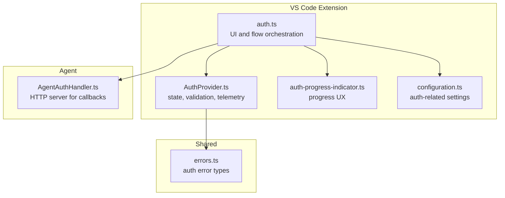
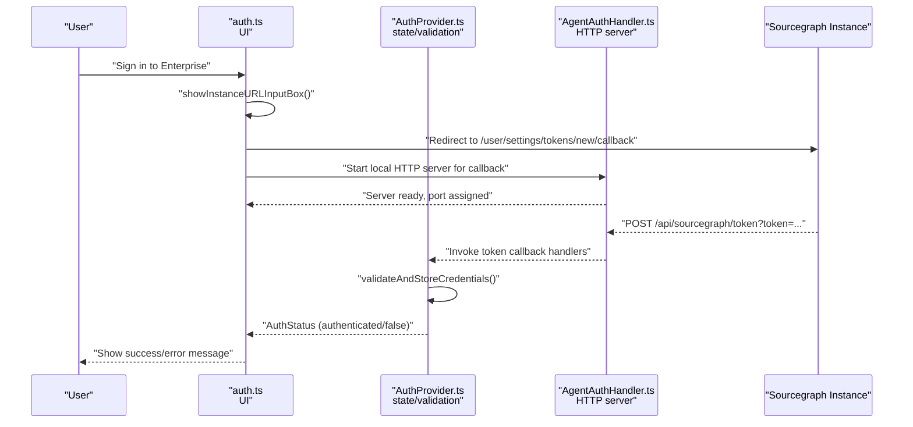
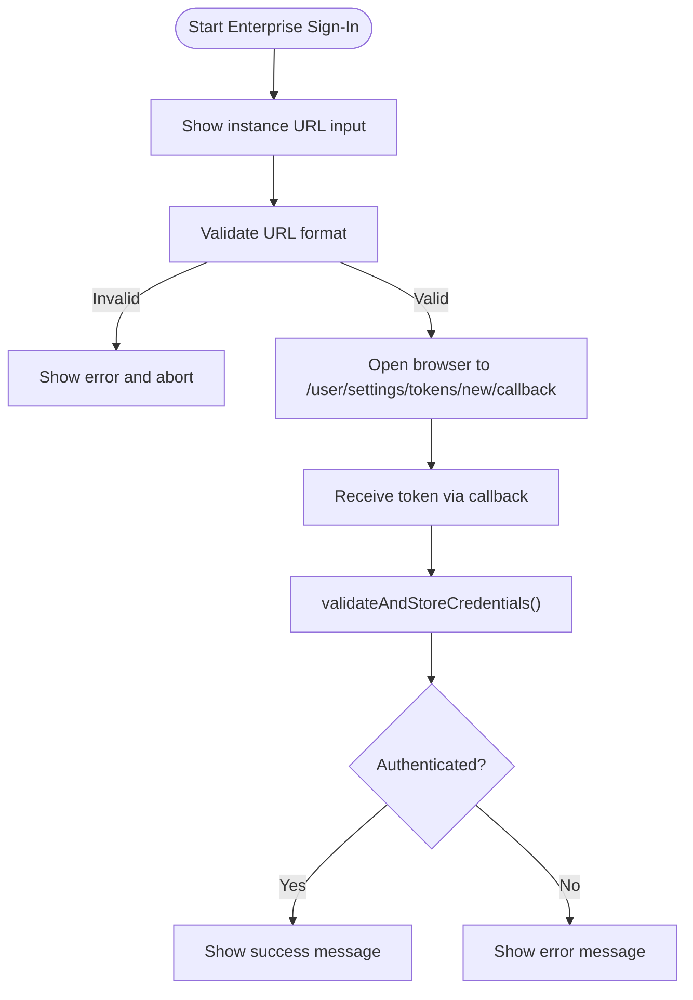
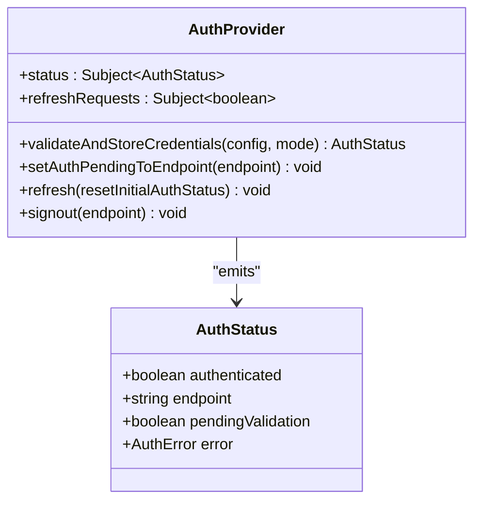
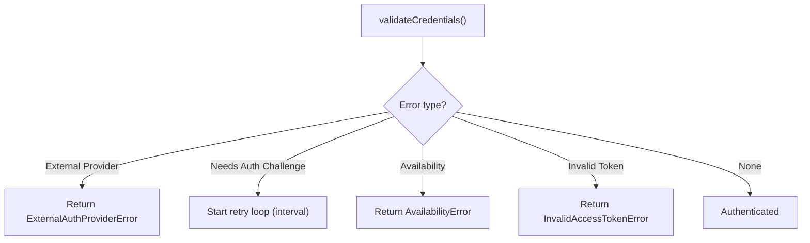
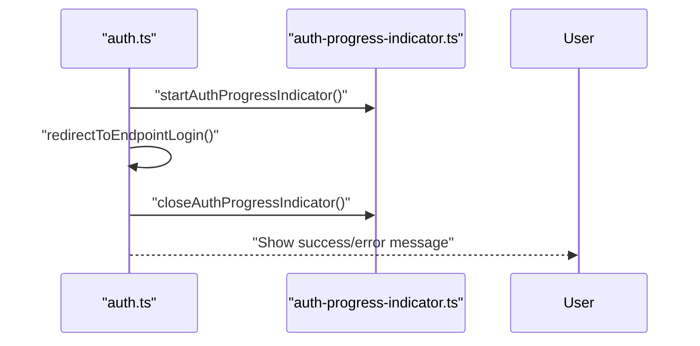
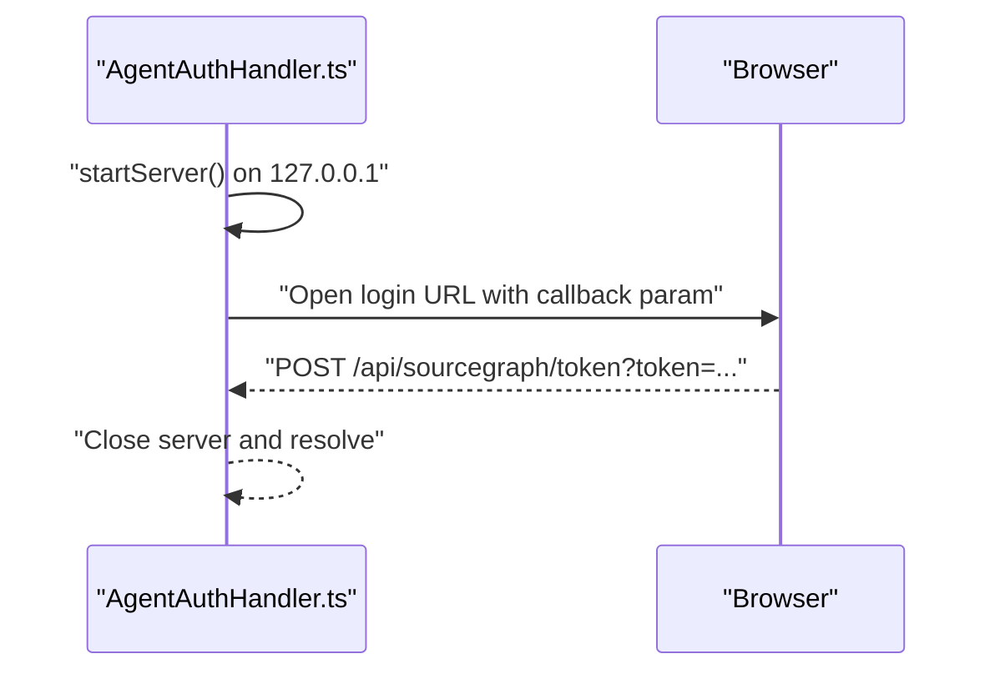
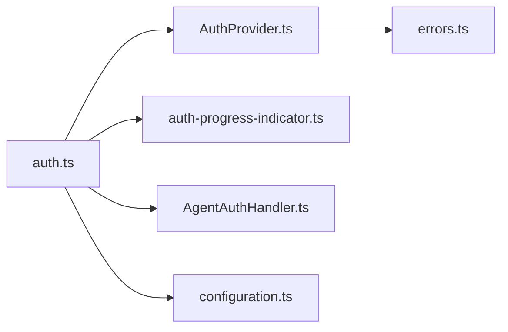

# Enterprise SSO Integration

<cite>
**Referenced Files in This Document**
- [auth.ts](file://vscode/src/auth/auth.ts)
- [AuthProvider.ts](file://vscode/src/services/AuthProvider.ts)
- [auth-progress-indicator.ts](file://vscode/src/auth/auth-progress-indicator.ts)
- [AgentAuthHandler.ts](file://agent/src/AgentAuthHandler.ts)
- [errors.ts](file://lib/shared/src/sourcegraph-api/errors.ts)
- [AccessTokenStorage.java](file://jetbrains/src/main/java/com/sourcegraph/config/AccessTokenStorage.java)
- [configuration.ts](file://vscode/src/configuration.ts)
- [README.md](file://README.md)
</cite>

## Table of Contents
1. [Introduction](#introduction)
2. [Project Structure](#project-structure)
3. [Core Components](#core-components)
4. [Architecture Overview](#architecture-overview)
5. [Detailed Component Analysis](#detailed-component-analysis)
6. [Dependency Analysis](#dependency-analysis)
7. [Performance Considerations](#performance-considerations)
8. [Troubleshooting Guide](#troubleshooting-guide)
9. [Conclusion](#conclusion)
10. [Appendices](#appendices)

## Introduction
This document explains enterprise Single Sign-On (SSO) integration capabilities across the Cody codebase, focusing on how enterprise authentication is resolved, validated, and surfaced to users. It covers:
- Supported enterprise authentication methods and flows
- Instance URL validation and endpoint detection
- Authentication provider resolution and challenge handling
- Progress indicators, user feedback, and error reporting
- Configuration examples, troubleshooting, and best practices
- Security considerations, compliance, and audit logging

## Project Structure
The enterprise authentication system spans three main areas:
- VS Code extension authentication orchestration and UX
- Shared error types and authentication utilities
- Agent-side authentication handler for token callbacks

**Diagram sources**
- [auth.ts:1-603](file://vscode/src/auth/auth.ts#L1-L603)
- [AuthProvider.ts:1-380](file://vscode/src/services/AuthProvider.ts#L1-L380)
- [auth-progress-indicator.ts:1-28](file://vscode/src/auth/auth-progress-indicator.ts#L1-L28)
- [configuration.ts:1-200](file://vscode/src/configuration.ts#L1-L200)
- [errors.ts:171-229](file://lib/shared/src/sourcegraph-api/errors.ts#L171-L229)
- [AgentAuthHandler.ts:1-171](file://agent/src/AgentAuthHandler.ts#L1-L171)

**Section sources**
- [auth.ts:1-603](file://vscode/src/auth/auth.ts#L1-L603)
- [AuthProvider.ts:1-380](file://vscode/src/services/AuthProvider.ts#L1-L380)
- [auth-progress-indicator.ts:1-28](file://vscode/src/auth/auth-progress-indicator.ts#L1-L28)
- [configuration.ts:1-200](file://vscode/src/configuration.ts#L1-L200)
- [errors.ts:171-229](file://lib/shared/src/sourcegraph-api/errors.ts#L171-L229)
- [AgentAuthHandler.ts:1-171](file://agent/src/AgentAuthHandler.ts#L1-L171)

## Core Components
- Enterprise authentication flow and UI:
  - Instance URL input and validation
  - Browser-based token callback redirection
  - Auth result messaging and failure handling
- Authentication provider:
  - Centralized state, validation, periodic retries, and telemetry
  - Pending-validation UX and context updates
- Agent authentication handler:
  - Local HTTP server for token callbacks
  - Loopback binding and secure callback handling
- Error types:
  - Availability, invalid token, external provider, and needs-auth-challenge errors
- Configuration:
  - External provider configuration and network/proxy settings affecting enterprise auth

**Section sources**
- [auth.ts:61-146](file://vscode/src/auth/auth.ts#L61-L146)
- [AuthProvider.ts:45-206](file://vscode/src/services/AuthProvider.ts#L45-L206)
- [AgentAuthHandler.ts:17-99](file://agent/src/AgentAuthHandler.ts#L17-L99)
- [errors.ts:171-229](file://lib/shared/src/sourcegraph-api/errors.ts#L171-L229)
- [configuration.ts:126-126](file://vscode/src/configuration.ts#L126-L126)

## Architecture Overview
The enterprise SSO flow integrates UI, validation, and callback handling across platforms.

**Diagram sources**
- [auth.ts:101-146](file://vscode/src/auth/auth.ts#L101-L146)
- [auth.ts:284-310](file://vscode/src/auth/auth.ts#L284-L310)
- [AuthProvider.ts:248-280](file://vscode/src/services/AuthProvider.ts#L248-L280)
- [AgentAuthHandler.ts:38-99](file://agent/src/AgentAuthHandler.ts#L38-L99)

## Detailed Component Analysis

### Enterprise Authentication Flow
- Instance URL validation:
  - Accepts https or auto-fixes missing scheme
  - Rejects tokens passed as URLs
  - Ensures valid URL format
- Endpoint detection:
  - Uses current resolved configuration to resolve auth for the target endpoint
  - Normalizes endpoint URLs before validation
- Authentication provider resolution:
  - Validates credentials against the resolved endpoint
  - Stores valid credentials and updates persistent state
- Browser-based token callback:
  - Opens the instance’s token creation page with a referral code
  - On VS Code Web, falls back to manual token entry
- Auth result messaging:
  - Success: shows signed-in message
  - Failure: displays error message from auth status

**Diagram sources**
- [auth.ts:177-208](file://vscode/src/auth/auth.ts#L177-L208)
- [auth.ts:284-310](file://vscode/src/auth/auth.ts#L284-L310)
- [auth.ts:336-378](file://vscode/src/auth/auth.ts#L336-L378)
- [AuthProvider.ts:248-280](file://vscode/src/services/AuthProvider.ts#L248-L280)

**Section sources**
- [auth.ts:61-146](file://vscode/src/auth/auth.ts#L61-L146)
- [auth.ts:177-208](file://vscode/src/auth/auth.ts#L177-L208)
- [auth.ts:284-310](file://vscode/src/auth/auth.ts#L284-L310)
- [auth.ts:336-378](file://vscode/src/auth/auth.ts#L336-L378)
- [AuthProvider.ts:248-280](file://vscode/src/services/AuthProvider.ts#L248-L280)

### Authentication Provider Resolution and Validation
- Centralized state and validation:
  - Emits pending-validation status immediately upon initiating validation
  - Validates credentials against the current resolved configuration
  - Updates persistent state and context flags on success
- Periodic retry:
  - Automatically retries when a challenge is needed
- Telemetry:
  - Reports connection state and first-ever authentication events

**Diagram sources**
- [AuthProvider.ts:45-206](file://vscode/src/services/AuthProvider.ts#L45-L206)
- [AuthProvider.ts:248-332](file://vscode/src/services/AuthProvider.ts#L248-L332)

**Section sources**
- [AuthProvider.ts:61-88](file://vscode/src/services/AuthProvider.ts#L61-L88)
- [AuthProvider.ts:90-170](file://vscode/src/services/AuthProvider.ts#L90-L170)
- [AuthProvider.ts:208-220](file://vscode/src/services/AuthProvider.ts#L208-L220)
- [AuthProvider.ts:248-280](file://vscode/src/services/AuthProvider.ts#L248-L280)

### Authentication Challenge Handling
- Needs-auth-challenge errors trigger a short-interval retry loop
- Availability errors and invalid tokens are surfaced as distinct error types
- External provider errors are handled and reported appropriately

**Diagram sources**
- [auth.ts:496-524](file://vscode/src/auth/auth.ts#L496-L524)
- [errors.ts:171-229](file://lib/shared/src/sourcegraph-api/errors.ts#L171-L229)

**Section sources**
- [auth.ts:496-524](file://vscode/src/auth/auth.ts#L496-L524)
- [errors.ts:171-229](file://lib/shared/src/sourcegraph-api/errors.ts#L171-L229)

### Authentication Progress Indicator and User Feedback
- Progress indicator:
  - Starts a cancellable notification during sign-in
  - Closes on callback or cancellation
- User feedback:
  - Success: shows signed-in message with endpoint authority
  - Failure: shows error message from auth status

**Diagram sources**
- [auth.ts:336-378](file://vscode/src/auth/auth.ts#L336-L378)
- [auth-progress-indicator.ts:5-27](file://vscode/src/auth/auth-progress-indicator.ts#L5-L27)

**Section sources**
- [auth.ts:312-331](file://vscode/src/auth/auth.ts#L312-L331)
- [auth-progress-indicator.ts:5-27](file://vscode/src/auth/auth-progress-indicator.ts#L5-L27)

### Agent Authentication Handler
- Creates a local HTTP server bound to the loopback interface
- Redirects the user to the instance login page with updated callback parameters
- Receives token via callback and closes the server after receiving the token
- Ensures secure handling with a fixed lifetime

**Diagram sources**
- [AgentAuthHandler.ts:38-99](file://agent/src/AgentAuthHandler.ts#L38-L99)
- [AgentAuthHandler.ts:118-142](file://agent/src/AgentAuthHandler.ts#L118-L142)

**Section sources**
- [AgentAuthHandler.ts:17-99](file://agent/src/AgentAuthHandler.ts#L17-L99)
- [AgentAuthHandler.ts:118-142](file://agent/src/AgentAuthHandler.ts#L118-L142)

### Enterprise Identity Providers and External Providers
- External provider configuration:
  - The configuration key for external providers exists and can be used to configure enterprise identity providers
- JetBrains storage:
  - Secure storage of enterprise and dotcom access tokens is supported

**Section sources**
- [configuration.ts:126-126](file://vscode/src/configuration.ts#L126-L126)
- [AccessTokenStorage.java:16-29](file://jetbrains/src/main/java/com/sourcegraph/config/AccessTokenStorage.java#L16-L29)

## Dependency Analysis
- UI depends on:
  - Auth provider for validation and status
  - Progress indicator for UX
  - Agent handler for token callbacks
- Auth provider depends on:
  - Shared error types
  - Configuration and secret storage
- Agent handler depends on:
  - Local HTTP server and loopback binding

**Diagram sources**
- [auth.ts:1-603](file://vscode/src/auth/auth.ts#L1-L603)
- [AuthProvider.ts:1-380](file://vscode/src/services/AuthProvider.ts#L1-L380)
- [auth-progress-indicator.ts:1-28](file://vscode/src/auth/auth-progress-indicator.ts#L1-L28)
- [AgentAuthHandler.ts:1-171](file://agent/src/AgentAuthHandler.ts#L1-L171)
- [errors.ts:171-229](file://lib/shared/src/sourcegraph-api/errors.ts#L171-L229)
- [configuration.ts:1-200](file://vscode/src/configuration.ts#L1-L200)

**Section sources**
- [auth.ts:1-603](file://vscode/src/auth/auth.ts#L1-L603)
- [AuthProvider.ts:1-380](file://vscode/src/services/AuthProvider.ts#L1-L380)
- [errors.ts:171-229](file://lib/shared/src/sourcegraph-api/errors.ts#L171-L229)

## Performance Considerations
- Retry intervals:
  - Short retry interval for needs-auth-challenge scenarios to minimize downtime
- Telemetry overhead:
  - Minimal telemetry emission on auth changes to avoid frequent writes
- Network settings:
  - Proxy and certificate settings can affect endpoint availability and retry behavior

[No sources needed since this section provides general guidance]

## Troubleshooting Guide
Common issues and resolutions:
- Invalid URL or token passed as URL:
  - The system validates URLs and rejects tokens as URLs
- Availability errors:
  - Indicates transient network or endpoint issues; retry occurs automatically
- Needs-auth-challenge:
  - Device-based authentication expired; user must complete the challenge
- External provider errors:
  - Indicates upstream identity provider issues; check provider configuration
- VS Code Web limitations:
  - Uses manual token entry due to callback restrictions

Operational tips:
- Verify instance URL and scheme
- Confirm proxy and certificate settings if behind corporate firewall
- Re-run sign-in to trigger retry loop for challenge-required scenarios

**Section sources**
- [auth.ts:186-201](file://vscode/src/auth/auth.ts#L186-L201)
- [auth.ts:511-523](file://vscode/src/auth/auth.ts#L511-L523)
- [errors.ts:195-209](file://lib/shared/src/sourcegraph-api/errors.ts#L195-L209)
- [auth.ts:294-300](file://vscode/src/auth/auth.ts#L294-L300)

## Conclusion
The enterprise SSO integration leverages a robust validation pipeline, secure callback handling, and clear user feedback. It supports enterprise identity providers via configuration, handles authentication challenges gracefully, and provides progress indicators and telemetry for operational visibility. Following the best practices and troubleshooting steps outlined here will help ensure reliable enterprise deployments.

[No sources needed since this section summarizes without analyzing specific files]

## Appendices

### Configuration Examples
- Configure external providers:
  - Use the external provider configuration key to integrate enterprise identity providers
- Network and proxy settings:
  - Adjust proxy endpoint, CA certificates, and certificate validation as needed

**Section sources**
- [configuration.ts:75-89](file://vscode/src/configuration.ts#L75-L89)
- [configuration.ts:126-126](file://vscode/src/configuration.ts#L126-L126)

### Best Practices for Enterprise Deployment
- Prefer browser-based token callbacks for seamless UX
- Use loopback-bound servers for agent environments
- Monitor telemetry events for authentication failures and availability issues
- Ensure proxy and certificate settings match enterprise policies

[No sources needed since this section provides general guidance]

### Security Considerations and Compliance
- Loopback binding and short-lived servers reduce exposure
- Token deletion on logout for redirected tokens
- Audit-ready telemetry and uninstaller configuration serialization

**Section sources**
- [AgentAuthHandler.ts:82-93](file://agent/src/AgentAuthHandler.ts#L82-L93)
- [auth.ts:423-444](file://vscode/src/auth/auth.ts#L423-L444)
- [AuthProvider.ts:312-332](file://vscode/src/services/AuthProvider.ts#L312-L332)

### Audit Logging Capabilities
- Auth telemetry events:
  - Connected, failed, and disconnected states are recorded
- Uninstaller configuration snapshot:
  - Serialized configuration and auth status for post-uninstall reporting

**Section sources**
- [AuthProvider.ts:352-368](file://vscode/src/services/AuthProvider.ts#L352-L368)
- [AuthProvider.ts:312-332](file://vscode/src/services/AuthProvider.ts#L312-L332)