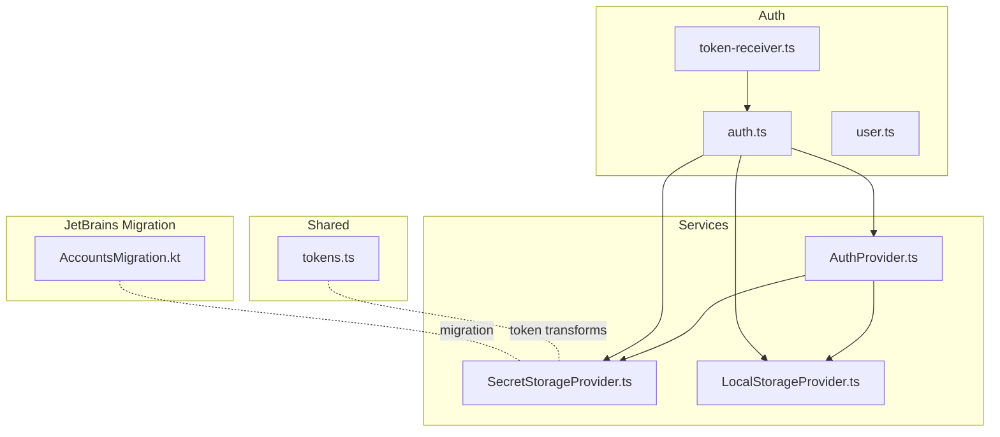
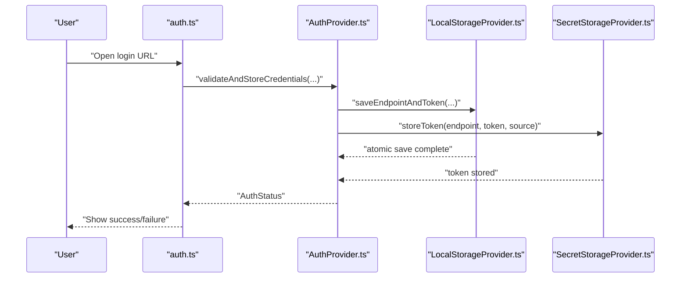
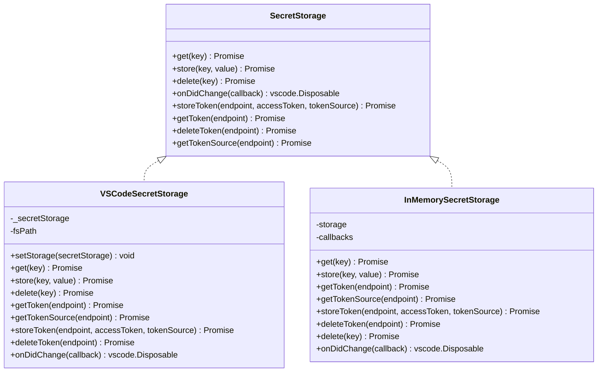
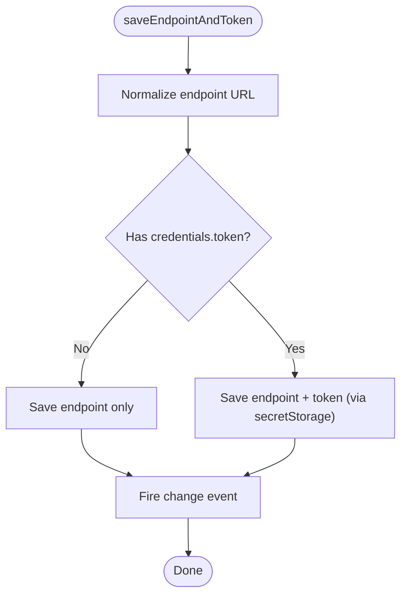
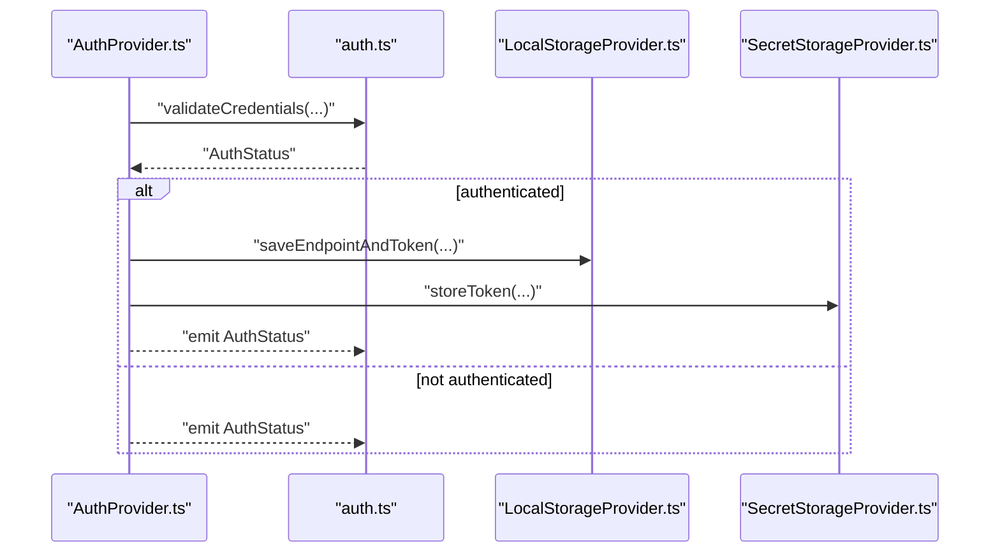
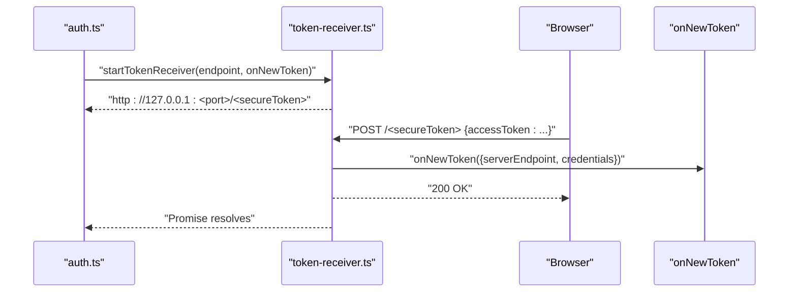
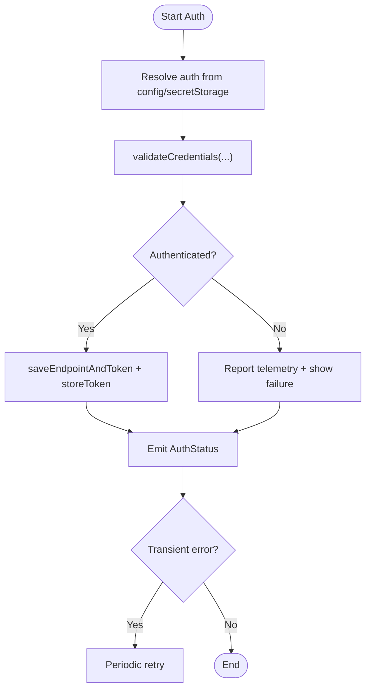
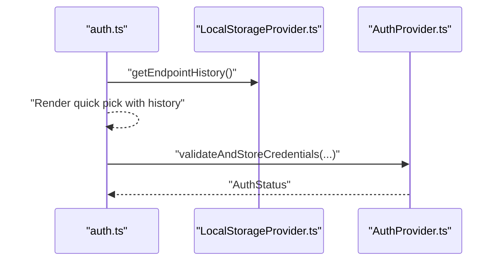
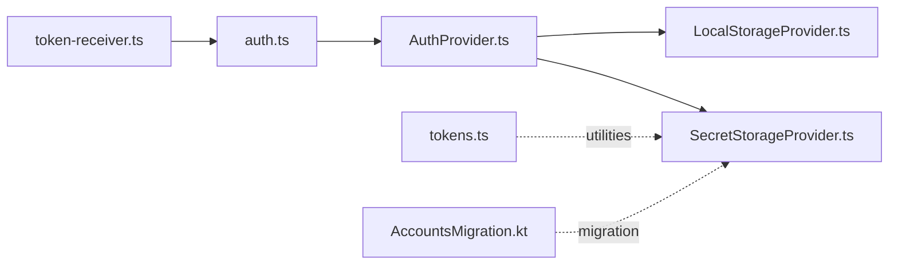

# Token Management and Storage

<cite>
**Referenced Files in This Document**
- [SecretStorageProvider.ts](file://vscode/src/services/SecretStorageProvider.ts)
- [LocalStorageProvider.ts](file://vscode/src/services/LocalStorageProvider.ts)
- [token-receiver.ts](file://vscode/src/auth/token-receiver.ts)
- [auth.ts](file://vscode/src/auth/auth.ts)
- [AuthProvider.ts](file://vscode/src/services/AuthProvider.ts)
- [user.ts](file://vscode/src/auth/user.ts)
- [LocalStorageProvider.test.ts](file://vscode/src/services/LocalStorageProvider.test.ts)
- [tokens.ts](file://lib/shared/src/auth/tokens.ts)
- [AccountsMigration.kt](file://jetbrains/src/main/kotlin/com/sourcegraph/cody/config/migration/AccountsMigration.kt)
</cite>

## Table of Contents
1. [Introduction](#introduction)
2. [Project Structure](#project-structure)
3. [Core Components](#core-components)
4. [Architecture Overview](#architecture-overview)
5. [Detailed Component Analysis](#detailed-component-analysis)
6. [Dependency Analysis](#dependency-analysis)
7. [Performance Considerations](#performance-considerations)
8. [Troubleshooting Guide](#troubleshooting-guide)
9. [Conclusion](#conclusion)

## Introduction
This document explains the token management and storage systems used by the application. It covers secure token storage via SecretStorageProvider, persistent storage via LocalStorageProvider, token lifecycle management (creation, validation, refresh, deletion), authentication callbacks and URL-based authentication, user identity and account switching, multi-instance token handling, security best practices, token expiration handling, automatic cleanup, storage migration strategies, and the relationship between tokens and user sessions, endpoint history tracking, and credential persistence across application restarts.

## Project Structure
The token management system spans several modules:
- Services for secure and local storage
- Authentication orchestration and validation
- Token receiver for URL-based authentication
- Shared utilities for token transformations
- Migration utilities for cross-platform compatibility

**Diagram sources**
- [SecretStorageProvider.ts:1-256](file://vscode/src/services/SecretStorageProvider.ts#L1-L256)
- [LocalStorageProvider.ts:1-432](file://vscode/src/services/LocalStorageProvider.ts#L1-L432)
- [AuthProvider.ts:1-380](file://vscode/src/services/AuthProvider.ts#L1-L380)
- [auth.ts:1-603](file://vscode/src/auth/auth.ts#L1-L603)
- [token-receiver.ts:1-82](file://vscode/src/auth/token-receiver.ts#L1-L82)
- [tokens.ts:1-25](file://lib/shared/src/auth/tokens.ts#L1-L25)
- [AccountsMigration.kt:1-16](file://jetbrains/src/main/kotlin/com/sourcegraph/cody/config/migration/AccountsMigration.kt#L1-L16)

**Section sources**
- [SecretStorageProvider.ts:1-256](file://vscode/src/services/SecretStorageProvider.ts#L1-L256)
- [LocalStorageProvider.ts:1-432](file://vscode/src/services/LocalStorageProvider.ts#L1-L432)
- [AuthProvider.ts:1-380](file://vscode/src/services/AuthProvider.ts#L1-L380)
- [auth.ts:1-603](file://vscode/src/auth/auth.ts#L1-L603)
- [token-receiver.ts:1-82](file://vscode/src/auth/token-receiver.ts#L1-L82)
- [tokens.ts:1-25](file://lib/shared/src/auth/tokens.ts#L1-L25)
- [AccountsMigration.kt:1-16](file://jetbrains/src/main/kotlin/com/sourcegraph/cody/config/migration/AccountsMigration.kt#L1-L16)

## Core Components
- SecretStorageProvider: Provides secure token storage abstraction with a singleton instance, supporting both real secret storage and in-memory fallback for testing/profile runs. It stores tokens per endpoint and tracks token source.
- LocalStorageProvider: Manages persistent client state including endpoint history, chat history keyed by endpoint and username, configuration, anonymous user ID, and model preferences. It coordinates saving endpoint and token atomically and exposes change observables.
- AuthProvider: Orchestrates authentication lifecycle, validates credentials against endpoints, emits auth status, handles periodic retries for transient errors, serializes uninstaller info, and manages sign-out.
- Authentication flows: URL redirection to instance login, token callback handler, and a token receiver server for direct token posting.
- Token utilities: Shared helpers for token transformations (e.g., dotcom to gateway token).
- Migration utilities: Cross-platform migration of tokens from legacy stores.

**Section sources**
- [SecretStorageProvider.ts:26-133](file://vscode/src/services/SecretStorageProvider.ts#L26-L133)
- [LocalStorageProvider.ts:27-385](file://vscode/src/services/LocalStorageProvider.ts#L27-L385)
- [AuthProvider.ts:45-335](file://vscode/src/services/AuthProvider.ts#L45-L335)
- [auth.ts:283-378](file://vscode/src/auth/auth.ts#L283-L378)
- [tokens.ts:1-25](file://lib/shared/src/auth/tokens.ts#L1-L25)
- [AccountsMigration.kt:1-16](file://jetbrains/src/main/kotlin/com/sourcegraph/cody/config/migration/AccountsMigration.kt#L1-L16)

## Architecture Overview
The system separates concerns between secure token storage and persistent client state. Authentication flows populate both stores atomically, and AuthProvider validates and maintains auth status. Token receiver complements redirect-based flows by accepting tokens posted directly to a localhost endpoint.

**Diagram sources**
- [auth.ts:262-281](file://vscode/src/auth/auth.ts#L262-L281)
- [AuthProvider.ts:248-280](file://vscode/src/services/AuthProvider.ts#L248-L280)
- [LocalStorageProvider.ts:108-132](file://vscode/src/services/LocalStorageProvider.ts#L108-L132)
- [SecretStorageProvider.ts:97-112](file://vscode/src/services/SecretStorageProvider.ts#L97-L112)

## Detailed Component Analysis

### Secure Token Storage: SecretStorageProvider
- Responsibilities:
  - Store, retrieve, and delete tokens per endpoint.
  - Track token source (e.g., redirect vs. paste).
  - Support a fallback to filesystem-backed token retrieval via a configurable path.
  - Expose change events for the primary token key.
- Implementation highlights:
  - Singleton pattern with lazy initialization via a setter.
  - Two storage modes: real secret storage and in-memory for testing/profile runs.
  - Optional experimental local token path for environments without secret storage.
  - Atomicity: storeToken writes endpoint-specific token, a global token key, and optional token source.

**Diagram sources**
- [SecretStorageProvider.ts:8-133](file://vscode/src/services/SecretStorageProvider.ts#L8-L133)
- [SecretStorageProvider.ts:135-223](file://vscode/src/services/SecretStorageProvider.ts#L135-L223)

**Section sources**
- [SecretStorageProvider.ts:26-133](file://vscode/src/services/SecretStorageProvider.ts#L26-L133)
- [SecretStorageProvider.ts:135-223](file://vscode/src/services/SecretStorageProvider.ts#L135-L223)

### Persistent Client State: LocalStorageProvider
- Responsibilities:
  - Maintain endpoint history and last used endpoint.
  - Store and retrieve chat histories keyed by endpoint and username.
  - Persist configuration, anonymous user ID, device pixel ratio, model preferences, and enrollment history.
  - Provide atomic updates for endpoint and token to avoid inconsistent state.
- Implementation highlights:
  - Uses VSCode Memento for persistence with optional in-memory/noop modes.
  - Ensures endpoint history uniqueness and filters out Sourcegraph tokens as endpoints.
  - Emits change events via an EventEmitter and exposes an Observable for client state.

**Diagram sources**
- [LocalStorageProvider.ts:108-132](file://vscode/src/services/LocalStorageProvider.ts#L108-L132)

**Section sources**
- [LocalStorageProvider.ts:27-385](file://vscode/src/services/LocalStorageProvider.ts#L27-L385)

### Authentication Orchestration: AuthProvider
- Responsibilities:
  - Validate credentials against endpoints and emit AuthStatus.
  - Manage periodic retries for transient errors.
  - Serialize uninstaller info snapshot on successful authentication.
  - Coordinate sign-out and clean up state consistently.
- Implementation highlights:
  - Subscribes to configuration changes and revalidates automatically.
  - Supports explicit refresh requests and telemetry reporting.
  - Ensures ordering of sign-out operations to avoid races.

**Diagram sources**
- [AuthProvider.ts:61-88](file://vscode/src/services/AuthProvider.ts#L61-L88)
- [auth.ts:458-569](file://vscode/src/auth/auth.ts#L458-L569)
- [AuthProvider.ts:248-280](file://vscode/src/services/AuthProvider.ts#L248-L280)
- [LocalStorageProvider.ts:108-132](file://vscode/src/services/LocalStorageProvider.ts#L108-L132)
- [SecretStorageProvider.ts:97-112](file://vscode/src/services/SecretStorageProvider.ts#L97-L112)

**Section sources**
- [AuthProvider.ts:45-335](file://vscode/src/services/AuthProvider.ts#L45-L335)
- [auth.ts:458-569](file://vscode/src/auth/auth.ts#L458-L569)

### Token Receiver: URL-based Callback Alternative
- Purpose:
  - Start a local HTTP server on a random port and expose a secure-token-scoped endpoint to accept tokens posted directly.
  - Used alongside redirect-based flows to support environments where redirects are not feasible.
- Behavior:
  - Generates a random token and serves a POST endpoint under that path.
  - Parses JSON payload expecting an accessToken field.
  - Invokes a callback with serverEndpoint and credentials, then closes the server.

**Diagram sources**
- [token-receiver.ts:15-81](file://vscode/src/auth/token-receiver.ts#L15-L81)
- [auth.ts:283-310](file://vscode/src/auth/auth.ts#L283-L310)

**Section sources**
- [token-receiver.ts:1-82](file://vscode/src/auth/token-receiver.ts#L1-L82)
- [auth.ts:283-310](file://vscode/src/auth/auth.ts#L283-L310)

### Token Lifecycle Management
- Creation:
  - User initiates login via URL or token paste.
  - AuthProvider.validateAndStoreCredentials validates and, if authenticated, saves endpoint and token atomically via LocalStorageProvider and SecretStorageProvider.
- Validation:
  - AuthProvider subscribes to configuration changes and revalidates credentials, emitting AuthStatus.
  - Transient errors trigger periodic retries; permanent failures surface via error telemetry.
- Refresh:
  - Explicit refresh via command triggers revalidation with reset initial auth status.
- Deletion:
  - Sign-out removes token from secret storage and clears endpoint from local storage.
  - For tokens created via redirect, attempts to delete the token on the server side.

**Diagram sources**
- [AuthProvider.ts:93-146](file://vscode/src/services/AuthProvider.ts#L93-L146)
- [auth.ts:458-569](file://vscode/src/auth/auth.ts#L458-L569)
- [auth.ts:420-444](file://vscode/src/auth/auth.ts#L420-L444)

**Section sources**
- [auth.ts:420-444](file://vscode/src/auth/auth.ts#L420-L444)
- [AuthProvider.ts:93-146](file://vscode/src/services/AuthProvider.ts#L93-L146)

### User Identity Management and Account Switching
- Endpoint history and selection:
  - LocalStorageProvider tracks endpoint history and presents a quick pick menu for switching accounts.
  - Current endpoint is derived from client state and filtered if it is a token.
- Multi-instance token handling:
  - Tokens are stored per endpoint URL; chat histories are keyed by endpoint and username.
  - On sign-in with a different instance, the system validates and stores credentials for that endpoint independently.
- Identity retrieval:
  - Utility to fetch current user ID via GraphQL client.

**Diagram sources**
- [auth.ts:153-172](file://vscode/src/auth/auth.ts#L153-L172)
- [LocalStorageProvider.ts:157-172](file://vscode/src/services/LocalStorageProvider.ts#L157-L172)
- [AuthProvider.ts:248-280](file://vscode/src/services/AuthProvider.ts#L248-L280)

**Section sources**
- [auth.ts:153-172](file://vscode/src/auth/auth.ts#L153-L172)
- [LocalStorageProvider.ts:157-172](file://vscode/src/services/LocalStorageProvider.ts#L157-L172)
- [AuthProvider.ts:248-280](file://vscode/src/services/AuthProvider.ts#L248-L280)
- [user.ts:1-14](file://vscode/src/auth/user.ts#L1-L14)

### Token Expiration Handling and Automatic Cleanup
- Token deletion on sign-out:
  - If the token source is redirect, the system attempts to delete the token on the server side.
  - Tokens are removed from secret storage and endpoint cleared from local storage.
- No automatic refresh:
  - There is no built-in token refresh mechanism; authentication relies on revalidation and manual refresh.
- Expiration-aware behavior:
  - Transient network or availability errors trigger periodic retries; invalid tokens surface as authentication failures.

**Section sources**
- [auth.ts:420-444](file://vscode/src/auth/auth.ts#L420-L444)
- [AuthProvider.ts:148-170](file://vscode/src/services/AuthProvider.ts#L148-L170)

### Storage Migration Strategies
- VS Code to JetBrains migration:
  - Legacy accounts are migrated by reading tokens from deprecated managers and writing them to the secure store.
- Local token path fallback:
  - An experimental configuration allows retrieving tokens from a file path when secret storage is unavailable.

**Section sources**
- [AccountsMigration.kt:1-16](file://jetbrains/src/main/kotlin/com/sourcegraph/cody/config/migration/AccountsMigration.kt#L1-L16)
- [SecretStorageProvider.ts:48-57](file://vscode/src/services/SecretStorageProvider.ts#L48-L57)

### Relationship Between Tokens and Sessions, Endpoint History, and Persistence
- Tokens and sessions:
  - AuthProvider maintains the current AuthStatus and updates context flags for the extension.
- Endpoint history:
  - LocalStorageProvider maintains a history of endpoints and filters out token strings as endpoints.
- Persistence across restarts:
  - Tokens are persisted in secret storage; endpoint and related state are persisted in local storage, ensuring continuity across restarts.

**Section sources**
- [AuthProvider.ts:172-196](file://vscode/src/services/AuthProvider.ts#L172-L196)
- [LocalStorageProvider.ts:157-172](file://vscode/src/services/LocalStorageProvider.ts#L157-L172)
- [LocalStorageProvider.ts:92-100](file://vscode/src/services/LocalStorageProvider.ts#L92-L100)

## Dependency Analysis
- SecretStorageProvider depends on VS Code SecretStorage and optionally a filesystem fallback.
- LocalStorageProvider depends on VS Code Memento and SecretStorageProvider for atomic endpoint+token storage.
- AuthProvider orchestrates validation and integrates with both storage providers.
- auth.ts coordinates user-facing flows and invokes AuthProvider and storage operations.
- token-receiver.ts is used by auth.ts to support direct token posting.
- tokens.ts provides shared token transformation utilities.
- AccountsMigration.kt migrates tokens for JetBrains.

**Diagram sources**
- [auth.ts:1-603](file://vscode/src/auth/auth.ts#L1-L603)
- [AuthProvider.ts:1-380](file://vscode/src/services/AuthProvider.ts#L1-L380)
- [LocalStorageProvider.ts:1-432](file://vscode/src/services/LocalStorageProvider.ts#L1-L432)
- [SecretStorageProvider.ts:1-256](file://vscode/src/services/SecretStorageProvider.ts#L1-L256)
- [token-receiver.ts:1-82](file://vscode/src/auth/token-receiver.ts#L1-L82)
- [tokens.ts:1-25](file://lib/shared/src/auth/tokens.ts#L1-L25)
- [AccountsMigration.kt:1-16](file://jetbrains/src/main/kotlin/com/sourcegraph/cody/config/migration/AccountsMigration.kt#L1-L16)

**Section sources**
- [auth.ts:1-603](file://vscode/src/auth/auth.ts#L1-L603)
- [AuthProvider.ts:1-380](file://vscode/src/services/AuthProvider.ts#L1-L380)
- [LocalStorageProvider.ts:1-432](file://vscode/src/services/LocalStorageProvider.ts#L1-L432)
- [SecretStorageProvider.ts:1-256](file://vscode/src/services/SecretStorageProvider.ts#L1-L256)
- [token-receiver.ts:1-82](file://vscode/src/auth/token-receiver.ts#L1-L82)
- [tokens.ts:1-25](file://lib/shared/src/auth/tokens.ts#L1-L25)
- [AccountsMigration.kt:1-16](file://jetbrains/src/main/kotlin/com/sourcegraph/cody/config/migration/AccountsMigration.kt#L1-L16)

## Performance Considerations
- Atomic writes: LocalStorageProvider saves endpoint and token together to avoid partial state.
- Event throttling: AuthProvider debounces frequent revalidations and retries only when appropriate.
- Observables: Client state changes are exposed as observables to minimize redundant computations.

[No sources needed since this section provides general guidance]

## Troubleshooting Guide
- Authentication fails immediately:
  - Verify endpoint normalization and URL format.
  - Check for transient network errors; the system retries periodically.
- Token not saved:
  - Confirm secret storage is available; if not, the experimental local token path may be used.
  - Ensure atomic save of endpoint and token succeeded.
- Sign-out did not remove token:
  - Tokens created via redirect may be deleted on the server; verify token source and server-side deletion attempts.
- Chat history mismatch after switching accounts:
  - Histories are keyed by endpoint and username; ensure correct account is selected.

**Section sources**
- [auth.ts:380-403](file://vscode/src/auth/auth.ts#L380-L403)
- [AuthProvider.ts:148-170](file://vscode/src/services/AuthProvider.ts#L148-L170)
- [auth.ts:420-444](file://vscode/src/auth/auth.ts#L420-L444)
- [LocalStorageProvider.ts:174-188](file://vscode/src/services/LocalStorageProvider.ts#L174-L188)

## Conclusion
The token management system combines secure secret storage with persistent client state to provide reliable authentication across instances and sessions. It supports URL-based and direct token posting flows, enforces atomic updates, and offers robust error handling and telemetry. Migration utilities and token transformation helpers further enhance cross-platform compatibility and operational flexibility.