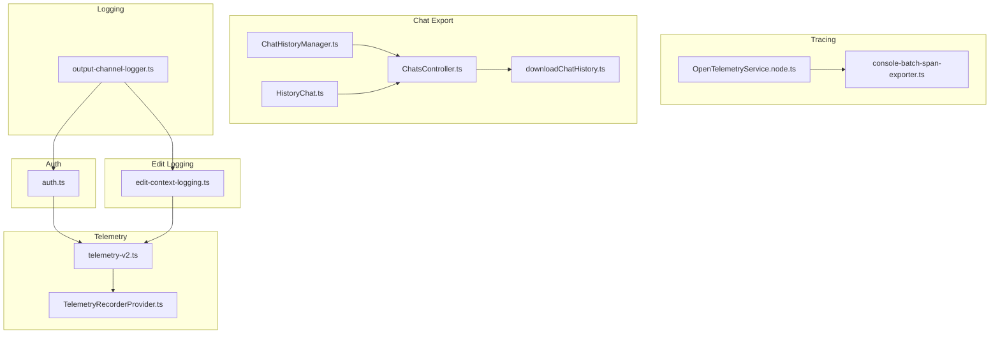
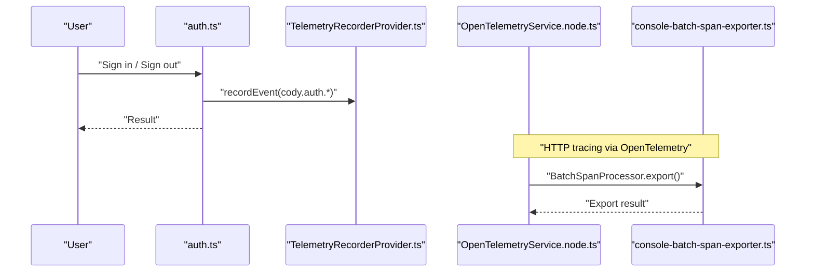
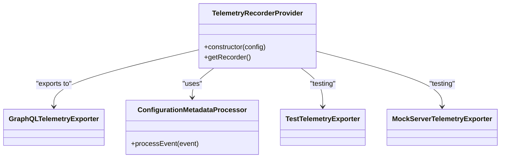
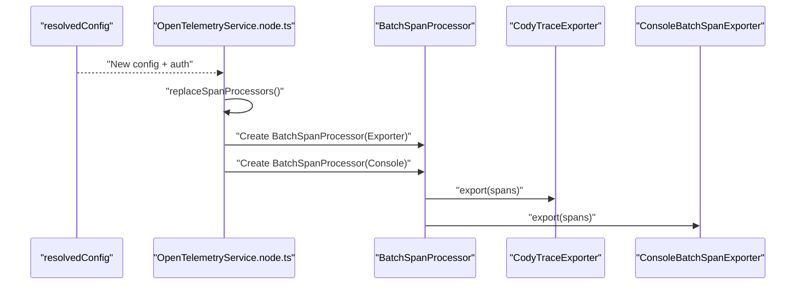
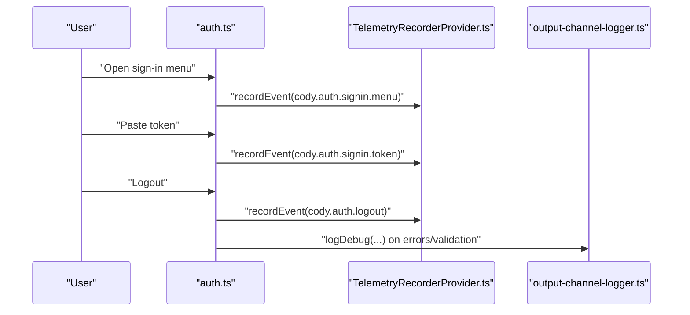
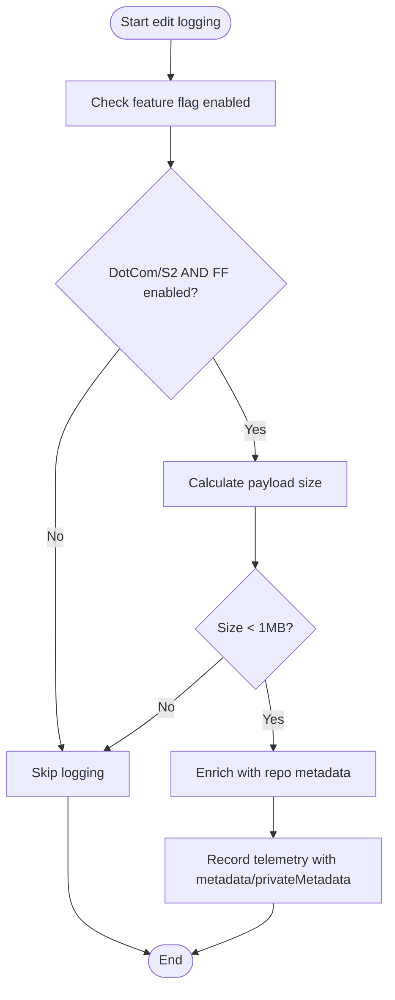
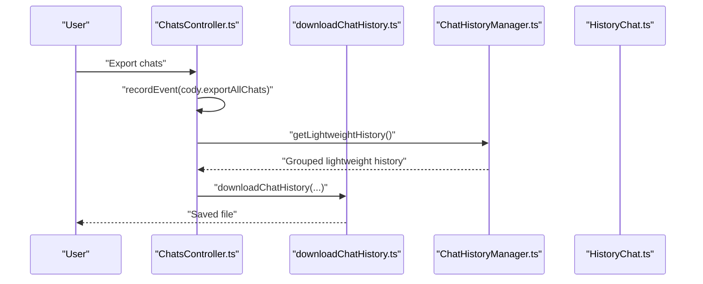
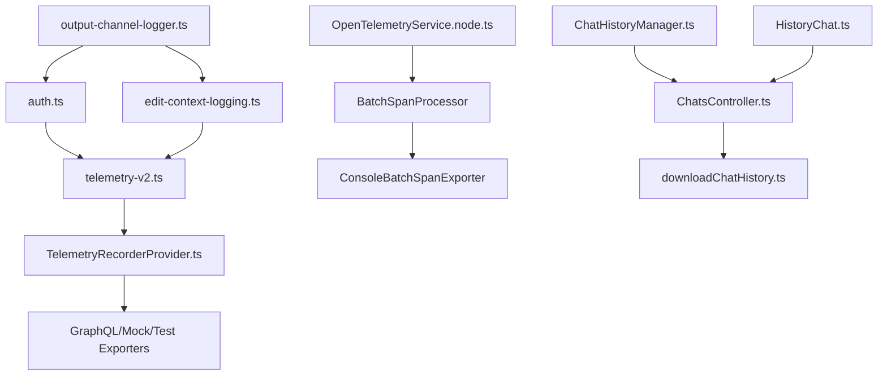

# Audit Logging & Compliance

<cite>
**Referenced Files in This Document**
- [output-channel-logger.ts](file://vscode/src/output-channel-logger.ts)
- [telemetry-v2.ts](file://vscode/src/services/telemetry-v2.ts)
- [TelemetryRecorderProvider.ts](file://lib/shared/src/telemetry-v2/TelemetryRecorderProvider.ts)
- [OpenTelemetryService.node.ts](file://vscode/src/services/open-telemetry/OpenTelemetryService.node.ts)
- [console-batch-span-exporter.ts](file://vscode/src/services/open-telemetry/console-batch-span-exporter.ts)
- [auth.ts](file://vscode/src/auth/auth.ts)
- [edit-context-logging.ts](file://vscode/src/edit/edit-context-logging.ts)
- [ChatsController.ts](file://vscode/src/chat/chat-view/ChatsController.ts)
- [downloadChatHistory.ts](file://vscode/webviews/chat/downloadChatHistory.ts)
- [ChatHistoryManager.ts](file://vscode/src/chat/chat-view/ChatHistoryManager.ts)
- [HistoryChat.ts](file://vscode/src/services/HistoryChat.ts)
</cite>

## Table of Contents
1. [Introduction](#introduction)
2. [Project Structure](#project-structure)
3. [Core Components](#core-components)
4. [Architecture Overview](#architecture-overview)
5. [Detailed Component Analysis](#detailed-component-analysis)
6. [Dependency Analysis](#dependency-analysis)
7. [Performance Considerations](#performance-considerations)
8. [Troubleshooting Guide](#troubleshooting-guide)
9. [Conclusion](#conclusion)
10. [Appendices](#appendices)

## Introduction
This document describes Cody’s audit logging and compliance tracking systems with a focus on:
- Structured telemetry and tracing for security and compliance
- Event categorization and metadata enrichment
- Log export capabilities for compliance reporting and security investigations
- Security event tracking for authentication, authorization, and policy-related actions
- Privacy controls, payload limits, and anonymization considerations
- Log aggregation, secure transmission, and operational performance impact

It consolidates the telemetry stack, OpenTelemetry tracing, authentication audit events, and chat history export features to provide a practical guide for enterprise deployments requiring audit trails and compliance reporting.

## Project Structure
The audit and compliance features span several subsystems:
- Telemetry framework and providers
- OpenTelemetry tracing and exporters
- Authentication and authorization audit events
- Edit operation context logging with privacy safeguards
- Chat history export for compliance reporting

**Diagram sources**
- [telemetry-v2.ts:1-172](file://vscode/src/services/telemetry-v2.ts#L1-L172)
- [TelemetryRecorderProvider.ts:1-208](file://lib/shared/src/telemetry-v2/TelemetryRecorderProvider.ts#L1-L208)
- [OpenTelemetryService.node.ts:1-163](file://vscode/src/services/open-telemetry/OpenTelemetryService.node.ts#L1-L163)
- [console-batch-span-exporter.ts:32-115](file://vscode/src/services/open-telemetry/console-batch-span-exporter.ts#L32-L115)
- [auth.ts:1-603](file://vscode/src/auth/auth.ts#L1-L603)
- [edit-context-logging.ts:1-311](file://vscode/src/edit/edit-context-logging.ts#L1-L311)
- [ChatsController.ts:435-464](file://vscode/src/chat/chat-view/ChatsController.ts#L435-L464)
- [downloadChatHistory.ts](file://vscode/webviews/chat/downloadChatHistory.ts)
- [ChatHistoryManager.ts:49-79](file://vscode/src/chat/chat-view/ChatHistoryManager.ts#L49-L79)
- [HistoryChat.ts:41-85](file://vscode/src/services/HistoryChat.ts#L41-L85)
- [output-channel-logger.ts:1-165](file://vscode/src/output-channel-logger.ts#L1-L165)

**Section sources**
- [telemetry-v2.ts:1-172](file://vscode/src/services/telemetry-v2.ts#L1-L172)
- [TelemetryRecorderProvider.ts:1-208](file://lib/shared/src/telemetry-v2/TelemetryRecorderProvider.ts#L1-L208)
- [OpenTelemetryService.node.ts:1-163](file://vscode/src/services/open-telemetry/OpenTelemetryService.node.ts#L1-L163)
- [console-batch-span-exporter.ts:32-115](file://vscode/src/services/open-telemetry/console-batch-span-exporter.ts#L32-L115)
- [auth.ts:1-603](file://vscode/src/auth/auth.ts#L1-L603)
- [edit-context-logging.ts:1-311](file://vscode/src/edit/edit-context-logging.ts#L1-L311)
- [ChatsController.ts:435-464](file://vscode/src/chat/chat-view/ChatsController.ts#L435-L464)
- [downloadChatHistory.ts](file://vscode/webviews/chat/downloadChatHistory.ts)
- [ChatHistoryManager.ts:49-79](file://vscode/src/chat/chat-view/ChatHistoryManager.ts#L49-L79)
- [HistoryChat.ts:41-85](file://vscode/src/services/HistoryChat.ts#L41-L85)
- [output-channel-logger.ts:1-165](file://vscode/src/output-channel-logger.ts#L1-L165)

## Core Components
- Telemetry recorder provider and event recording pipeline
- OpenTelemetry tracing with batch processors and exporters
- Authentication and authorization audit events
- Edit operation context logging with privacy controls
- Chat history export for compliance reporting

**Section sources**
- [telemetry-v2.ts:26-99](file://vscode/src/services/telemetry-v2.ts#L26-L99)
- [TelemetryRecorderProvider.ts:61-99](file://lib/shared/src/telemetry-v2/TelemetryRecorderProvider.ts#L61-L99)
- [OpenTelemetryService.node.ts:35-99](file://vscode/src/services/open-telemetry/OpenTelemetryService.node.ts#L35-L99)
- [auth.ts:81-146](file://vscode/src/auth/auth.ts#L81-L146)
- [edit-context-logging.ts:193-207](file://vscode/src/edit/edit-context-logging.ts#L193-L207)
- [ChatsController.ts:439-464](file://vscode/src/chat/chat-view/ChatsController.ts#L439-L464)

## Architecture Overview
Cody’s audit and compliance architecture integrates telemetry and tracing to capture security-relevant events and operational data. Telemetry events are enriched with configuration metadata and optionally exported to a backend. Tracing captures end-to-end spans for HTTP operations and can be exported to a remote collector. Authentication actions are instrumented to record login, logout, and token-based sign-in events. Edit operations log context under strict privacy controls. Chat history can be exported for compliance reporting.

**Diagram sources**
- [auth.ts:81-146](file://vscode/src/auth/auth.ts#L81-L146)
- [TelemetryRecorderProvider.ts:61-99](file://lib/shared/src/telemetry-v2/TelemetryRecorderProvider.ts#L61-L99)
- [OpenTelemetryService.node.ts:121-152](file://vscode/src/services/open-telemetry/OpenTelemetryService.node.ts#L121-L152)
- [console-batch-span-exporter.ts:99-107](file://vscode/src/services/open-telemetry/console-batch-span-exporter.ts#L99-L107)

## Detailed Component Analysis

### Telemetry Recorder Provider and Event Recording
- The telemetry provider initializes a recorder with a GraphQL exporter and processors, including a configuration metadata processor that attaches tier metadata to all events.
- Events are recorded with structured metadata and optional private metadata. Billing metadata is used for compliance categorization.
- In development or testing modes, a mock or test exporter is used to capture events locally.

**Diagram sources**
- [TelemetryRecorderProvider.ts:61-99](file://lib/shared/src/telemetry-v2/TelemetryRecorderProvider.ts#L61-L99)
- [TelemetryRecorderProvider.ts:186-207](file://lib/shared/src/telemetry-v2/TelemetryRecorderProvider.ts#L186-L207)

**Section sources**
- [TelemetryRecorderProvider.ts:61-99](file://lib/shared/src/telemetry-v2/TelemetryRecorderProvider.ts#L61-L99)
- [TelemetryRecorderProvider.ts:186-207](file://lib/shared/src/telemetry-v2/TelemetryRecorderProvider.ts#L186-L207)
- [telemetry-v2.ts:26-99](file://vscode/src/services/telemetry-v2.ts#L26-L99)

### OpenTelemetry Tracing and Export
- The OpenTelemetry service registers HTTP instrumentations and replaces span processors dynamically based on configuration and feature flags.
- Batch span processors export spans to a custom exporter and optionally to a console exporter for verbose debugging.
- Authentication headers are injected into trace exports for secure transport.

**Diagram sources**
- [OpenTelemetryService.node.ts:65-99](file://vscode/src/services/open-telemetry/OpenTelemetryService.node.ts#L65-L99)
- [OpenTelemetryService.node.ts:121-152](file://vscode/src/services/open-telemetry/OpenTelemetryService.node.ts#L121-L152)
- [console-batch-span-exporter.ts:99-107](file://vscode/src/services/open-telemetry/console-batch-span-exporter.ts#L99-L107)

**Section sources**
- [OpenTelemetryService.node.ts:35-99](file://vscode/src/services/open-telemetry/OpenTelemetryService.node.ts#L35-L99)
- [OpenTelemetryService.node.ts:121-152](file://vscode/src/services/open-telemetry/OpenTelemetryService.node.ts#L121-L152)
- [console-batch-span-exporter.ts:32-115](file://vscode/src/services/open-telemetry/console-batch-span-exporter.ts#L32-L115)

### Authentication and Authorization Audit Events
- Authentication menu clicks, token-based sign-ins, and logout actions are recorded as telemetry events with billing metadata.
- Validation and credential flows log diagnostic information to the output channel logger, including error conditions.

**Diagram sources**
- [auth.ts:81-146](file://vscode/src/auth/auth.ts#L81-L146)
- [auth.ts:405-444](file://vscode/src/auth/auth.ts#L405-L444)
- [output-channel-logger.ts:47-104](file://vscode/src/output-channel-logger.ts#L47-L104)

**Section sources**
- [auth.ts:81-146](file://vscode/src/auth/auth.ts#L81-L146)
- [auth.ts:405-444](file://vscode/src/auth/auth.ts#L405-L444)
- [output-channel-logger.ts:47-104](file://vscode/src/output-channel-logger.ts#L47-L104)

### Edit Operation Context Logging and Privacy Controls
- Smart-apply and edit context logging collect metadata about selections, models, timing, and repository info.
- Payload size is checked against a maximum threshold and only collected for allowed users (DotCom or S2) and when feature flags are enabled.
- Private metadata is separated from safe metadata for export policies.

**Diagram sources**
- [edit-context-logging.ts:293-310](file://vscode/src/edit/edit-context-logging.ts#L293-L310)
- [edit-context-logging.ts:191-207](file://vscode/src/edit/edit-context-logging.ts#L191-L207)

**Section sources**
- [edit-context-logging.ts:191-207](file://vscode/src/edit/edit-context-logging.ts#L191-L207)
- [edit-context-logging.ts:293-310](file://vscode/src/edit/edit-context-logging.ts#L293-L310)

### Chat History Export for Compliance Reporting
- Users can export chat transcripts to files for compliance and auditing. Events around exporting are recorded for auditability.
- Lightweight history retrieval supports grouping and display of recent chats.

**Diagram sources**
- [ChatsController.ts:439-464](file://vscode/src/chat/chat-view/ChatsController.ts#L439-L464)
- [ChatHistoryManager.ts:49-79](file://vscode/src/chat/chat-view/ChatHistoryManager.ts#L49-L79)
- [HistoryChat.ts:41-85](file://vscode/src/services/HistoryChat.ts#L41-L85)
- [downloadChatHistory.ts](file://vscode/webviews/chat/downloadChatHistory.ts)

**Section sources**
- [ChatsController.ts:439-464](file://vscode/src/chat/chat-view/ChatsController.ts#L439-L464)
- [ChatHistoryManager.ts:49-79](file://vscode/src/chat/chat-view/ChatHistoryManager.ts#L49-L79)
- [HistoryChat.ts:41-85](file://vscode/src/services/HistoryChat.ts#L41-L85)
- [downloadChatHistory.ts](file://vscode/webviews/chat/downloadChatHistory.ts)

## Dependency Analysis
- Telemetry depends on the recorder provider and exporters; metadata processors enrich events with tier and client identifiers.
- OpenTelemetry tracing depends on HTTP instrumentations and batch processors; exporters are swapped based on configuration.
- Authentication and edit logging depend on telemetry for audit events; output channel logger provides diagnostics.
- Chat export depends on history managers and webview utilities.

**Diagram sources**
- [TelemetryRecorderProvider.ts:61-99](file://lib/shared/src/telemetry-v2/TelemetryRecorderProvider.ts#L61-L99)
- [telemetry-v2.ts:26-99](file://vscode/src/services/telemetry-v2.ts#L26-L99)
- [OpenTelemetryService.node.ts:121-152](file://vscode/src/services/open-telemetry/OpenTelemetryService.node.ts#L121-L152)
- [console-batch-span-exporter.ts:99-107](file://vscode/src/services/open-telemetry/console-batch-span-exporter.ts#L99-L107)
- [auth.ts:81-146](file://vscode/src/auth/auth.ts#L81-L146)
- [edit-context-logging.ts:191-207](file://vscode/src/edit/edit-context-logging.ts#L191-L207)
- [ChatsController.ts:439-464](file://vscode/src/chat/chat-view/ChatsController.ts#L439-L464)
- [ChatHistoryManager.ts:49-79](file://vscode/src/chat/chat-view/ChatHistoryManager.ts#L49-L79)
- [HistoryChat.ts:41-85](file://vscode/src/services/HistoryChat.ts#L41-L85)
- [output-channel-logger.ts:47-104](file://vscode/src/output-channel-logger.ts#L47-L104)

**Section sources**
- [TelemetryRecorderProvider.ts:61-99](file://lib/shared/src/telemetry-v2/TelemetryRecorderProvider.ts#L61-L99)
- [OpenTelemetryService.node.ts:121-152](file://vscode/src/services/open-telemetry/OpenTelemetryService.node.ts#L121-L152)
- [auth.ts:81-146](file://vscode/src/auth/auth.ts#L81-L146)
- [edit-context-logging.ts:191-207](file://vscode/src/edit/edit-context-logging.ts#L191-L207)
- [ChatsController.ts:439-464](file://vscode/src/chat/chat-view/ChatsController.ts#L439-L464)
- [ChatHistoryManager.ts:49-79](file://vscode/src/chat/chat-view/ChatHistoryManager.ts#L49-L79)
- [HistoryChat.ts:41-85](file://vscode/src/services/HistoryChat.ts#L41-L85)
- [output-channel-logger.ts:47-104](file://vscode/src/output-channel-logger.ts#L47-L104)

## Performance Considerations
- Telemetry buffering is disabled in the recorder provider to reduce latency for tests and immediate feedback; production environments should monitor throughput and adjust exporters accordingly.
- OpenTelemetry span processors use batching; dynamic replacement avoids downtime while switching exporters.
- Edit context logging enforces a 1 MB payload size limit and restricts collection to allowed users and feature-flagged scenarios to minimize overhead.
- Chat export operations aggregate large datasets; ensure disk I/O and file system capacity are considered during bulk exports.

[No sources needed since this section provides general guidance]

## Troubleshooting Guide
- Enable verbose debug logging to inspect telemetry and tracing:
  - Use the output channel logger to capture debug messages and errors.
  - Toggle verbose mode to include detailed event payloads.
- Authentication issues:
  - Review authentication flows and error messages; invalid tokens and network errors are logged with context.
  - Confirm authentication headers are applied to trace exports.
- Tracing problems:
  - Verify that span processors are replaced and exporters are active.
  - Check console exporter output for span trees and attributes.
- Edit logging not appearing:
  - Ensure feature flags are enabled and user tier allows logging.
  - Confirm payload size is below the 1 MB limit.
- Chat export issues:
  - Validate that chat history exists and is not empty.
  - Confirm export permissions and destination path.

**Section sources**
- [output-channel-logger.ts:47-104](file://vscode/src/output-channel-logger.ts#L47-L104)
- [auth.ts:458-569](file://vscode/src/auth/auth.ts#L458-L569)
- [OpenTelemetryService.node.ts:101-114](file://vscode/src/services/open-telemetry/OpenTelemetryService.node.ts#L101-L114)
- [console-batch-span-exporter.ts:99-107](file://vscode/src/services/open-telemetry/console-batch-span-exporter.ts#L99-L107)
- [edit-context-logging.ts:293-310](file://vscode/src/edit/edit-context-logging.ts#L293-L310)
- [ChatsController.ts:439-464](file://vscode/src/chat/chat-view/ChatsController.ts#L439-L464)

## Conclusion
Cody’s audit and compliance system combines a robust telemetry framework with OpenTelemetry tracing, privacy-aware edit logging, and chat history export. Authentication and authorization actions are instrumented for security audits, while structured metadata and billing categories support enterprise compliance reporting. Privacy controls and payload limits ensure sensitive data is handled responsibly, and secure trace exports protect transport integrity.

[No sources needed since this section summarizes without analyzing specific files]

## Appendices

### Structured Logging Format and Event Categorization
- Events include:
  - feature/action pairs
  - metadata (safe numeric/boolean values)
  - privateMetadata (unsanitized values)
  - billingMetadata (product, category)
  - timestamps generated client-side
- Example categories:
  - Authentication: cody.auth.*
  - Edit operations: cody.smart-apply.context
  - Chat export: cody.exportAllChats

**Section sources**
- [TelemetryRecorderProvider.ts:186-207](file://lib/shared/src/telemetry-v2/TelemetryRecorderProvider.ts#L186-L207)
- [telemetry-v2.ts:126-171](file://vscode/src/services/telemetry-v2.ts#L126-L171)
- [auth.ts:81-146](file://vscode/src/auth/auth.ts#L81-L146)
- [edit-context-logging.ts:191-207](file://vscode/src/edit/edit-context-logging.ts#L191-L207)
- [ChatsController.ts:439-464](file://vscode/src/chat/chat-view/ChatsController.ts#L439-L464)

### Security Event Tracking
- Authentication attempts and outcomes are recorded with billing metadata.
- Logout actions are captured for audit trails.
- Edit operations log context under strict privacy controls.

**Section sources**
- [auth.ts:81-146](file://vscode/src/auth/auth.ts#L81-L146)
- [auth.ts:405-444](file://vscode/src/auth/auth.ts#L405-L444)
- [edit-context-logging.ts:191-207](file://vscode/src/edit/edit-context-logging.ts#L191-L207)

### Log Aggregation and Secure Transmission
- Traces are exported via a custom exporter and console exporter for debugging.
- Authentication headers are added to trace exports for secure transport.
- Telemetry events are exported to a GraphQL exporter in production.

**Section sources**
- [OpenTelemetryService.node.ts:77-97](file://vscode/src/services/open-telemetry/OpenTelemetryService.node.ts#L77-L97)
- [OpenTelemetryService.node.ts:121-152](file://vscode/src/services/open-telemetry/OpenTelemetryService.node.ts#L121-L152)
- [TelemetryRecorderProvider.ts:86-88](file://lib/shared/src/telemetry-v2/TelemetryRecorderProvider.ts#L86-L88)

### Data Retention Policies
- Retention behavior is governed by the connected Sourcegraph instance and telemetry exporter configuration. Configure exporter settings according to organizational policies.

[No sources needed since this section provides general guidance]

### Compliance Reporting Templates
- Use chat export to produce JSON transcripts for compliance review.
- Combine authentication and edit telemetry events with billing metadata for audit dashboards.

**Section sources**
- [ChatsController.ts:439-464](file://vscode/src/chat/chat-view/ChatsController.ts#L439-L464)
- [auth.ts:81-146](file://vscode/src/auth/auth.ts#L81-L146)
- [edit-context-logging.ts:191-207](file://vscode/src/edit/edit-context-logging.ts#L191-L207)