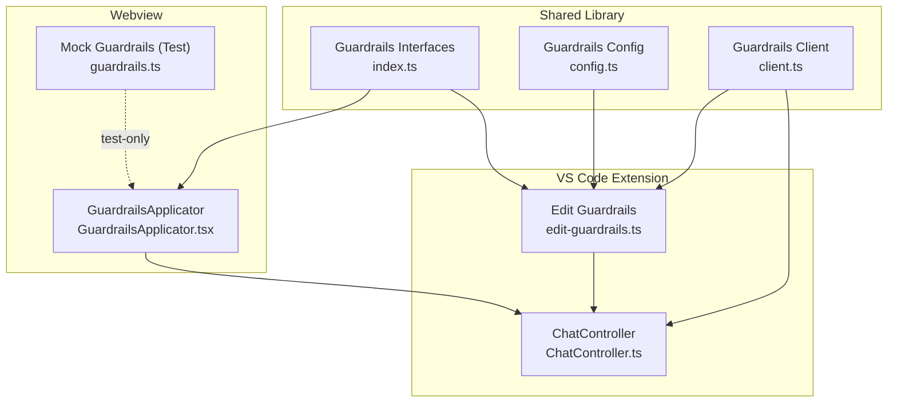
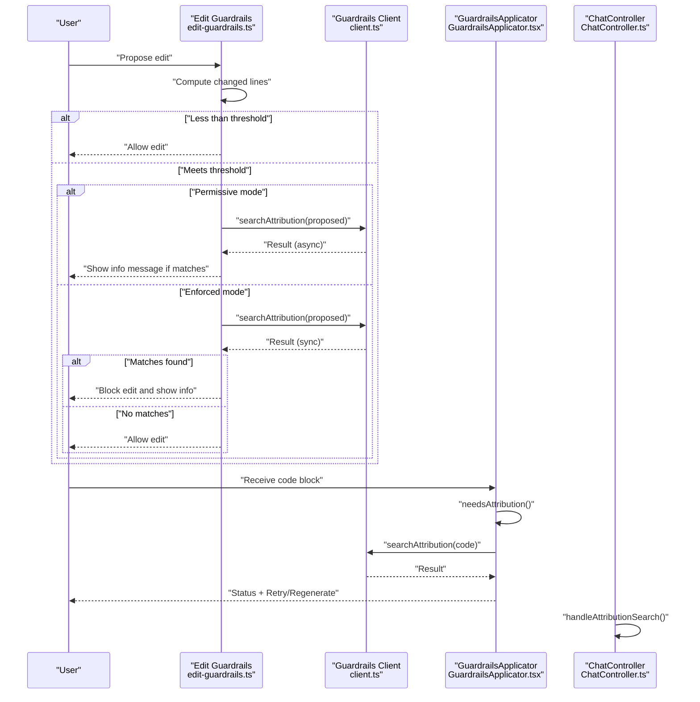
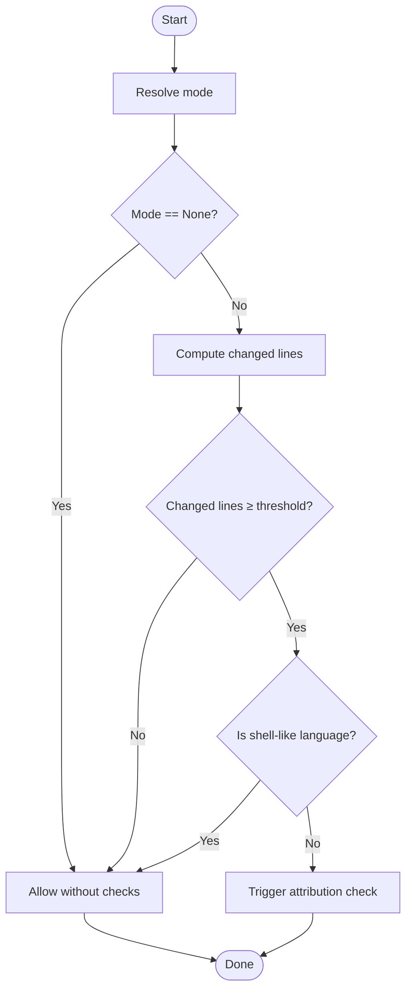
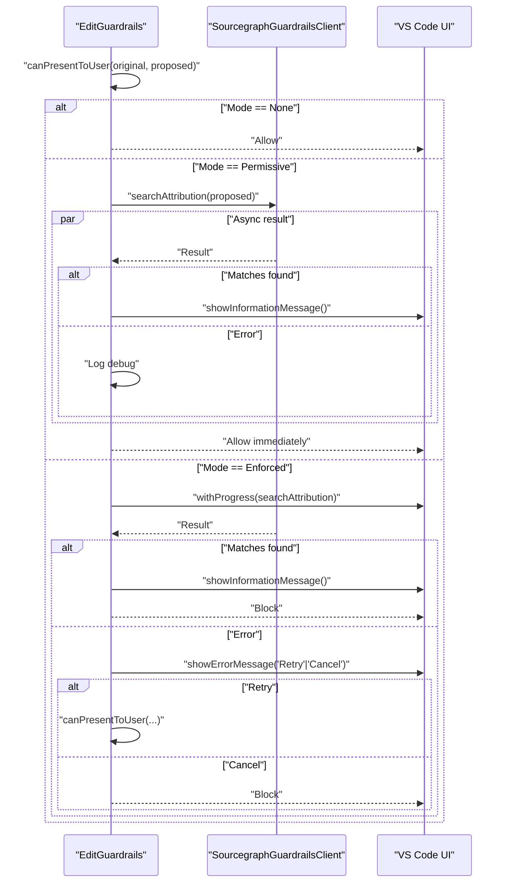
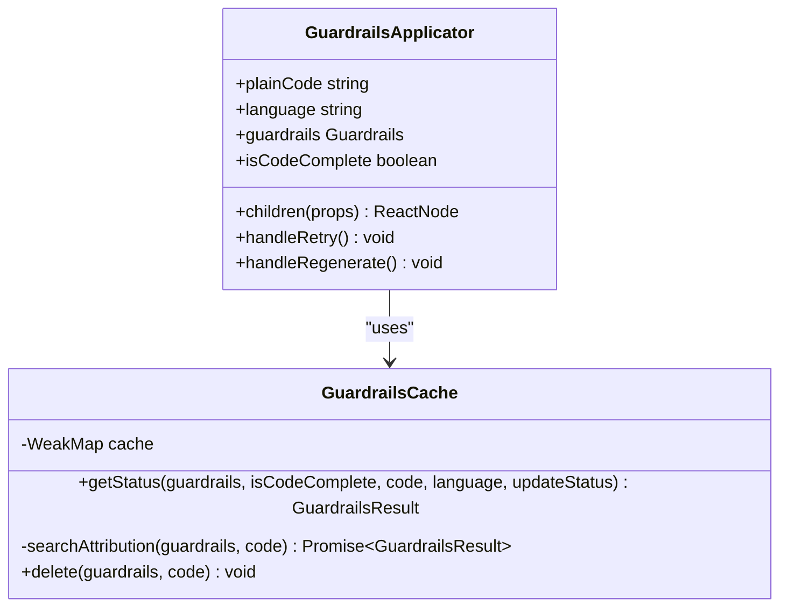
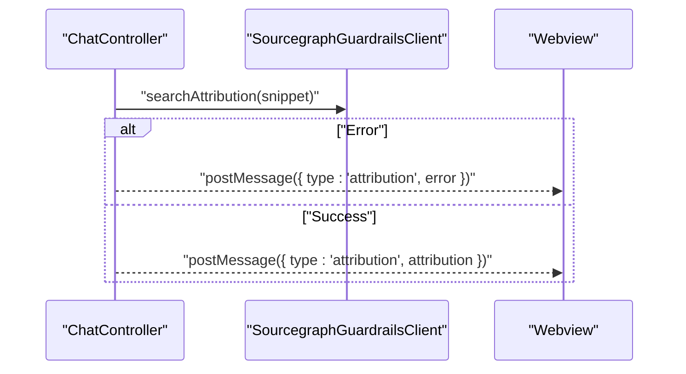
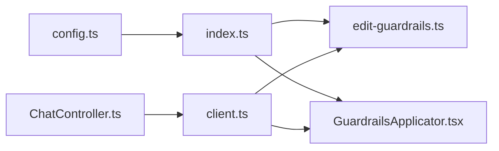

# Content Filtering & Safety

<cite>
**Referenced Files in This Document**
- [index.ts](file://lib/shared/src/guardrails/index.ts)
- [config.ts](file://lib/shared/src/guardrails/config.ts)
- [client.ts](file://lib/shared/src/guardrails/client.ts)
- [edit-guardrails.ts](file://vscode/src/edit/edit-guardrails.ts)
- [GuardrailsApplicator.tsx](file://vscode/webviews/components/GuardrailsApplicator.tsx)
- [guardrails.ts](file://vscode/webviews/utils/guardrails.ts)
- [ChatController.ts](file://vscode/src/chat/chat-view/ChatController.ts)
</cite>

## Table of Contents
1. [Introduction](#introduction)
2. [Project Structure](#project-structure)
3. [Core Components](#core-components)
4. [Architecture Overview](#architecture-overview)
5. [Detailed Component Analysis](#detailed-component-analysis)
6. [Dependency Analysis](#dependency-analysis)
7. [Performance Considerations](#performance-considerations)
8. [Troubleshooting Guide](#troubleshooting-guide)
9. [Conclusion](#conclusion)

## Introduction
This document explains Cody’s content filtering and safety systems with a focus on attribution guardrails. These guardrails prevent code plagiarism by checking proposed edits and generated code snippets against repository content and surfacing potential matches to users. The system supports three operational modes:
- None (disabled)
- Permissive (warning-only)
- Enforced (blocking)

It also documents the line change threshold logic that decides when checks are triggered, the asynchronous/synchronous processing modes, user notifications for detected matches, retry mechanisms for failed checks, and performance considerations for large codebases.

## Project Structure
The guardrails feature spans shared libraries, the VS Code extension, and webview components:
- Shared guardrails interfaces and implementations define the contract and runtime behavior.
- The VS Code extension integrates guardrails into editing workflows and chat responses.
- Webview components render guardrails status and provide retry/regenerate actions.

**Diagram sources**
- [index.ts:1-208](file://lib/shared/src/guardrails/index.ts#L1-L208)
- [config.ts:1-44](file://lib/shared/src/guardrails/config.ts#L1-L44)
- [client.ts:1-58](file://lib/shared/src/guardrails/client.ts#L1-L58)
- [edit-guardrails.ts:1-142](file://vscode/src/edit/edit-guardrails.ts#L1-L142)
- [GuardrailsApplicator.tsx:1-312](file://vscode/webviews/components/GuardrailsApplicator.tsx#L1-L312)
- [guardrails.ts:1-22](file://vscode/webviews/utils/guardrails.ts#L1-L22)
- [ChatController.ts:1380-1406](file://vscode/src/chat/chat-view/ChatController.ts#L1380-L1406)

**Section sources**
- [index.ts:1-208](file://lib/shared/src/guardrails/index.ts#L1-L208)
- [config.ts:1-44](file://lib/shared/src/guardrails/config.ts#L1-L44)
- [client.ts:1-58](file://lib/shared/src/guardrails/client.ts#L1-L58)
- [edit-guardrails.ts:1-142](file://vscode/src/edit/edit-guardrails.ts#L1-L142)
- [GuardrailsApplicator.tsx:1-312](file://vscode/webviews/components/GuardrailsApplicator.tsx#L1-L312)
- [guardrails.ts:1-22](file://vscode/webviews/utils/guardrails.ts#L1-L22)
- [ChatController.ts:1380-1406](file://vscode/src/chat/chat-view/ChatController.ts#L1380-L1406)

## Core Components
- Guardrails interface and modes: Defines the contract for attribution checks, mode enumeration, and result/status types.
- Guardrails client: Resolves mode and performs attribution search via GraphQL with configurable timeouts.
- Edit guardrails: Integrates guardrails into edit operations, enforcing line-change thresholds and mode-specific behavior.
- Webview applicator: Manages attribution checks for chat-generated code, caching, retries, and UI feedback.
- Mock guardrails: Test-only implementation that simulates disabled guardrails.

Key responsibilities:
- Mode selection and enforcement
- Threshold-based triggering of checks
- Asynchronous/synchronous processing
- User notifications and retry controls
- Caching and deduplication of requests

**Section sources**
- [index.ts:25-74](file://lib/shared/src/guardrails/index.ts#L25-L74)
- [client.ts:21-57](file://lib/shared/src/guardrails/client.ts#L21-L57)
- [edit-guardrails.ts:9-17](file://vscode/src/edit/edit-guardrails.ts#L9-L17)
- [GuardrailsApplicator.tsx:55-145](file://vscode/webviews/components/GuardrailsApplicator.tsx#L55-L145)
- [guardrails.ts:11-22](file://vscode/webviews/utils/guardrails.ts#L11-L22)

## Architecture Overview
The system orchestrates guardrails across chat and edit contexts. Chat responses trigger asynchronous attribution checks in the webview, while edits enforce synchronous checks under enforced mode and asynchronous checks under permissive mode.

**Diagram sources**
- [edit-guardrails.ts:49-140](file://vscode/src/edit/edit-guardrails.ts#L49-L140)
- [client.ts:21-57](file://lib/shared/src/guardrails/client.ts#L21-L57)
- [GuardrailsApplicator.tsx:71-134](file://vscode/webviews/components/GuardrailsApplicator.tsx#L71-L134)
- [ChatController.ts:1380-1406](file://vscode/src/chat/chat-view/ChatController.ts#L1380-L1406)

## Detailed Component Analysis

### Guardrails Modes and Threshold Logic
- Modes:
  - None: Disabled
  - Permissive: Show code with status; warn on matches
  - Enforced: Hide code until checks pass
- Threshold:
  - Checks are triggered when the number of new or changed lines is greater than or equal to a minimum threshold.
  - Shell-like languages are excluded from checks.
- Implementation:
  - Mode resolution and defaults are provided by shared interfaces and configuration.
  - Threshold evaluation is performed before initiating attribution checks.

**Diagram sources**
- [index.ts:25-33](file://lib/shared/src/guardrails/index.ts#L25-L33)
- [index.ts:142-163](file://lib/shared/src/guardrails/index.ts#L142-L163)
- [config.ts:4-8](file://lib/shared/src/guardrails/config.ts#L4-L8)
- [edit-guardrails.ts:58-65](file://vscode/src/edit/edit-guardrails.ts#L58-L65)

**Section sources**
- [index.ts:25-33](file://lib/shared/src/guardrails/index.ts#L25-L33)
- [index.ts:142-163](file://lib/shared/src/guardrails/index.ts#L142-L163)
- [config.ts:4-8](file://lib/shared/src/guardrails/config.ts#L4-L8)
- [edit-guardrails.ts:58-65](file://vscode/src/edit/edit-guardrails.ts#L58-L65)

### Edit Guardrails: Asynchronous vs Synchronous Processing
- Permissive mode:
  - Initiates attribution check asynchronously.
  - Immediately allows the edit to proceed.
  - Shows an information message if matches are found.
- Enforced mode:
  - Uses a progress dialog to synchronously await the result.
  - Blocks the edit if matches are found or errors occur.
  - Offers a retry option on errors; otherwise cancels.

**Diagram sources**
- [edit-guardrails.ts:49-140](file://vscode/src/edit/edit-guardrails.ts#L49-L140)
- [client.ts:21-57](file://lib/shared/src/guardrails/client.ts#L21-L57)

**Section sources**
- [edit-guardrails.ts:49-140](file://vscode/src/edit/edit-guardrails.ts#L49-L140)

### Webview GuardrailsApplicator: Caching, Retries, and UI
- Caching:
  - Maintains separate LRU caches for in-flight requests and parsed results.
  - Deduplicates concurrent checks for identical code.
- Status reporting:
  - Generates synchronous status for rendering, transitioning to asynchronous updates.
  - Supports “Checking,” “Success,” “Failed,” “Error,” and “Skipped.”
- User actions:
  - Retry button for errored checks.
  - Regenerate button for failed checks after message completion.

**Diagram sources**
- [GuardrailsApplicator.tsx:55-145](file://vscode/webviews/components/GuardrailsApplicator.tsx#L55-L145)

**Section sources**
- [GuardrailsApplicator.tsx:55-145](file://vscode/webviews/components/GuardrailsApplicator.tsx#L55-L145)

### Chat Attribution Flow
- The extension receives code blocks and triggers attribution checks.
- Results are posted back to the webview with repository names and limit-hit indicators.
- The webview renders status and offers retry/regenerate actions.

**Diagram sources**
- [ChatController.ts:1380-1406](file://vscode/src/chat/chat-view/ChatController.ts#L1380-L1406)
- [client.ts:21-41](file://lib/shared/src/guardrails/client.ts#L21-L41)

**Section sources**
- [ChatController.ts:1380-1406](file://vscode/src/chat/chat-view/ChatController.ts#L1380-L1406)

### Mock Guardrails (Test Utilities)
- Provides a test-only implementation that simulates disabled guardrails.
- Ensures no attribution requests are made when checks are not needed.

**Section sources**
- [guardrails.ts:11-22](file://vscode/webviews/utils/guardrails.ts#L11-L22)

## Dependency Analysis
- Shared interfaces and configuration define the contract and defaults.
- The client encapsulates mode resolution and attribution search with timeouts.
- Edit guardrails depend on client configuration and mode to decide behavior.
- Webview applicator depends on shared interfaces and caches results for efficient rendering.

**Diagram sources**
- [config.ts:1-44](file://lib/shared/src/guardrails/config.ts#L1-L44)
- [index.ts:1-208](file://lib/shared/src/guardrails/index.ts#L1-L208)
- [client.ts:1-58](file://lib/shared/src/guardrails/client.ts#L1-L58)
- [edit-guardrails.ts:1-142](file://vscode/src/edit/edit-guardrails.ts#L1-L142)
- [GuardrailsApplicator.tsx:1-312](file://vscode/webviews/components/GuardrailsApplicator.tsx#L1-L312)
- [ChatController.ts:1380-1406](file://vscode/src/chat/chat-view/ChatController.ts#L1380-L1406)

**Section sources**
- [config.ts:1-44](file://lib/shared/src/guardrails/config.ts#L1-L44)
- [index.ts:1-208](file://lib/shared/src/guardrails/index.ts#L1-L208)
- [client.ts:1-58](file://lib/shared/src/guardrails/client.ts#L1-L58)
- [edit-guardrails.ts:1-142](file://vscode/src/edit/edit-guardrails.ts#L1-L142)
- [GuardrailsApplicator.tsx:1-312](file://vscode/webviews/components/GuardrailsApplicator.tsx#L1-L312)
- [ChatController.ts:1380-1406](file://vscode/src/chat/chat-view/ChatController.ts#L1380-L1406)

## Performance Considerations
- Threshold-based skipping:
  - Avoids unnecessary checks for small diffs or shell-like languages.
- Request deduplication:
  - LRU caches prevent repeated network calls for identical code.
- Asynchronous processing:
  - Permissive mode avoids blocking the UI; enforced mode uses a progress dialog to keep users informed.
- Timeout configuration:
  - Client uses a long default timeout to accommodate multiple code blocks in a single chat.
- Caching strategy:
  - Separate caches for in-flight requests and results reduce redundant work and stabilize UI rendering.

Recommendations:
- Tune the minimum line threshold for your repository size and risk profile.
- Monitor cache sizes and adjust LRU capacities if needed.
- Consider batching or debouncing checks for rapid successive edits.

**Section sources**
- [index.ts:142-163](file://lib/shared/src/guardrails/index.ts#L142-L163)
- [GuardrailsApplicator.tsx:103-134](file://vscode/webviews/components/GuardrailsApplicator.tsx#L103-L134)
- [client.ts:8-11](file://lib/shared/src/guardrails/client.ts#L8-L11)

## Troubleshooting Guide
Common scenarios and resolutions:
- No matches found:
  - Expected behavior; code is allowed to proceed.
- Matches found:
  - In enforced mode, edits are blocked; in permissive mode, users receive an informational message.
- API error during check:
  - Enforced mode shows an error dialog with a retry option; permissive mode logs the error and proceeds.
- Retry mechanism:
  - Webview provides a retry button to re-run checks; edit flow supports retry on error.
- Large repository impact:
  - Consider increasing thresholds or enabling caching to reduce load.

Operational tips:
- Verify mode configuration resolves correctly.
- Confirm attribution search is permitted for the selected mode.
- Inspect logs for guardrails-related errors.

**Section sources**
- [edit-guardrails.ts:77-140](file://vscode/src/edit/edit-guardrails.ts#L77-L140)
- [GuardrailsApplicator.tsx:229-244](file://vscode/webviews/components/GuardrailsApplicator.tsx#L229-L244)
- [client.ts:21-41](file://lib/shared/src/guardrails/client.ts#L21-L41)

## Conclusion
Cody’s attribution guardrails provide a flexible, configurable safety layer that protects against code plagiarism. By combining threshold-based triggering, mode-aware processing, robust caching, and user-friendly notifications, the system balances safety, performance, and usability. Administrators can choose between permissive warnings and enforced blocking, while developers benefit from clear feedback and retry capabilities.