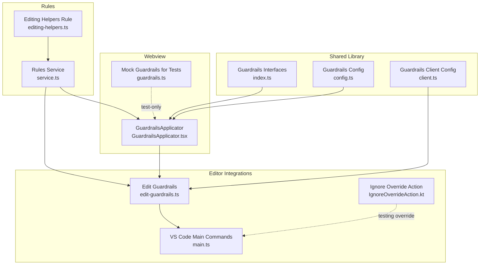
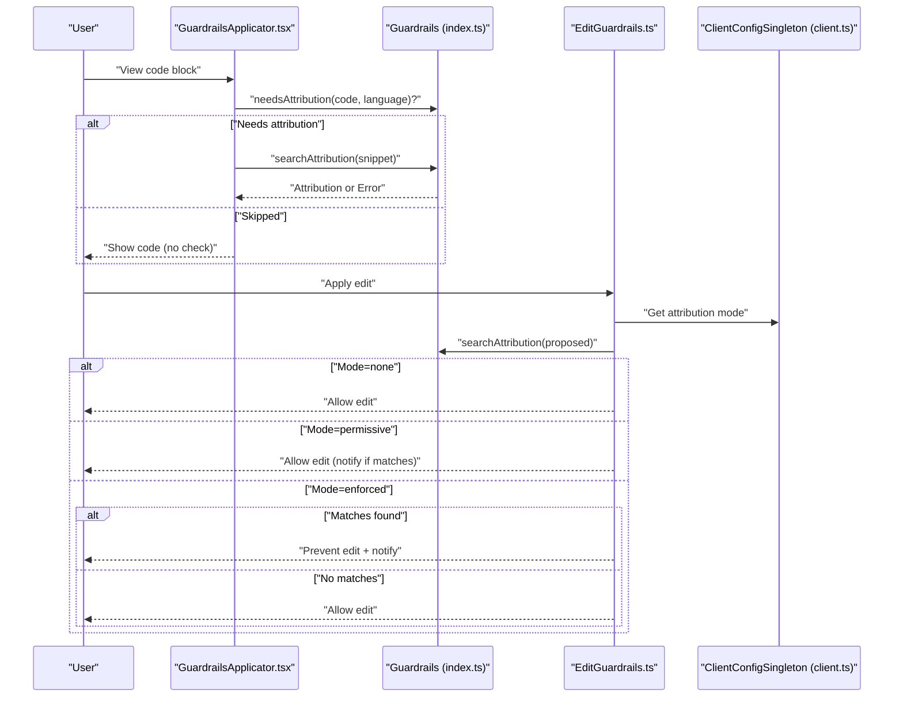
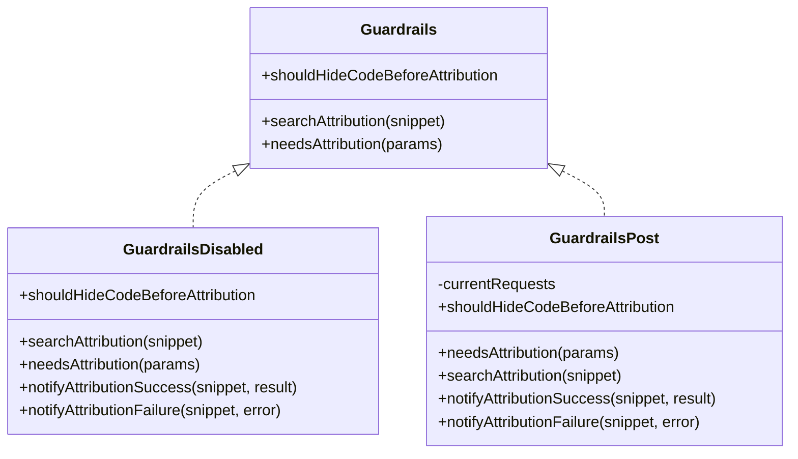
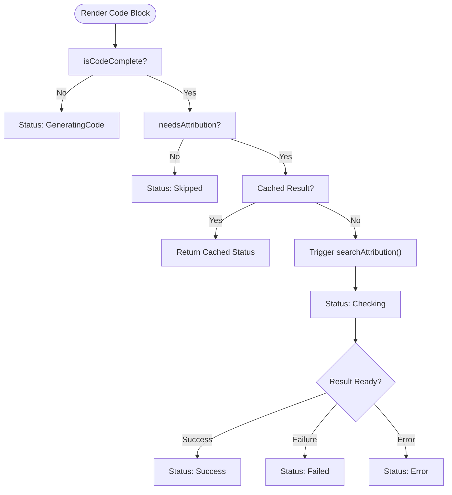
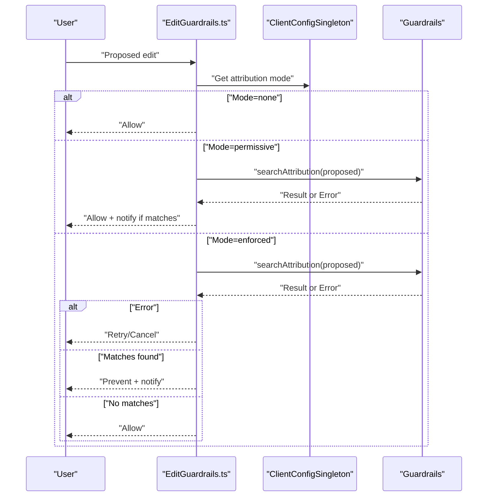
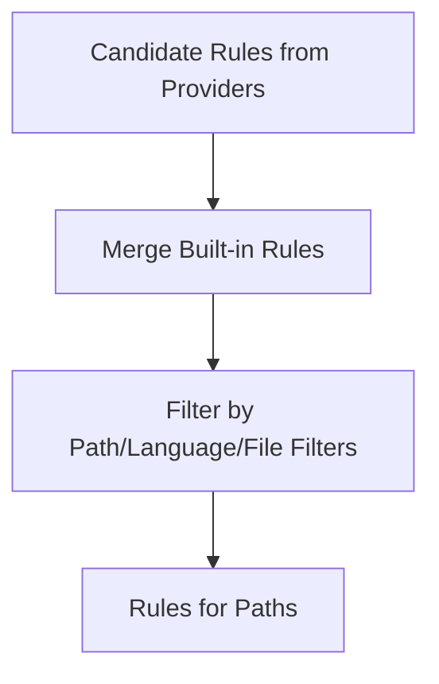
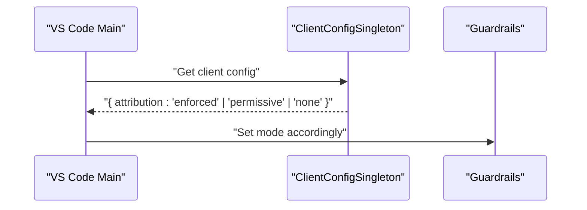
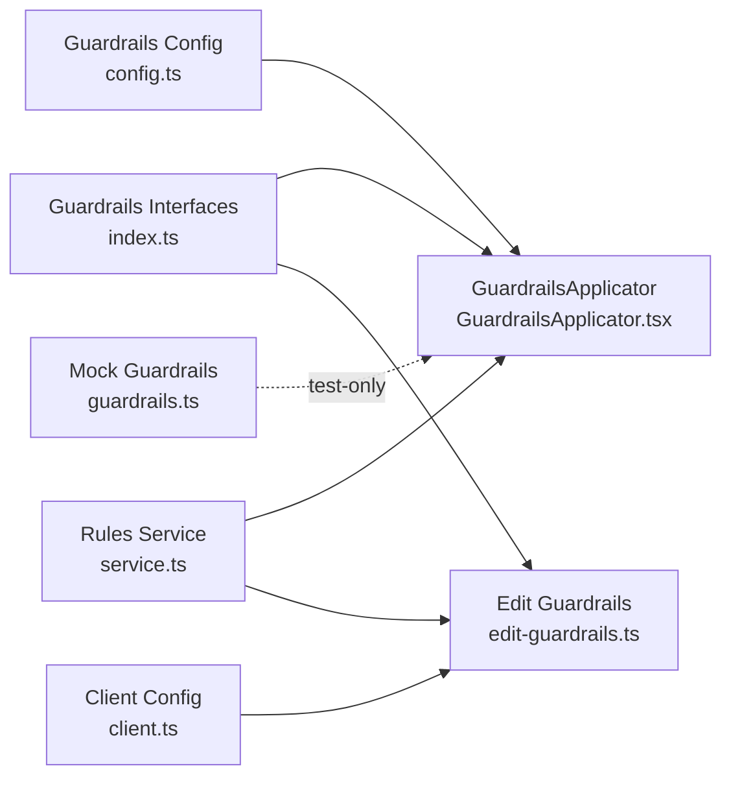

# Policy Enforcement Engine

<cite>
**Referenced Files in This Document**
- [index.ts](file://lib/shared/src/guardrails/index.ts)
- [config.ts](file://lib/shared/src/guardrails/config.ts)
- [client.ts](file://lib/shared/src/guardrails/client.ts)
- [GuardrailsApplicator.tsx](file://vscode/webviews/components/GuardrailsApplicator.tsx)
- [guardrails.ts](file://vscode/webviews/utils/guardrails.ts)
- [edit-guardrails.ts](file://vscode/src/edit/edit-guardrails.ts)
- [service.ts](file://lib/shared/src/rules/service.ts)
- [editing-helpers.ts](file://lib/shared/src/rules/editing-helpers.ts)
- [IgnoreOverrideAction.kt](file://jetbrains/src/main/kotlin/com/sourcegraph/cody/internals/IgnoreOverrideAction.kt)
- [main.ts](file://vscode/src/main.ts)
</cite>

## Table of Contents
1. [Introduction](#introduction)
2. [Project Structure](#project-structure)
3. [Core Components](#core-components)
4. [Architecture Overview](#architecture-overview)
5. [Detailed Component Analysis](#detailed-component-analysis)
6. [Dependency Analysis](#dependency-analysis)
7. [Performance Considerations](#performance-considerations)
8. [Troubleshooting Guide](#troubleshooting-guide)
9. [Conclusion](#conclusion)
10. [Appendices](#appendices)

## Introduction
This document describes Cody’s policy enforcement engine that governs AI-generated content and user interactions. It focuses on the rule-based content safety system, including prohibited content detection, policy violation scoring, and automated decision-making. It also covers integration with enterprise policy management systems, custom rule creation, real-time policy evaluation during chat interactions, code generation, and edit operations. The documentation details policy configuration options, rule prioritization, exception handling, user notifications for policy violations, and appeal processes. Finally, it provides examples of common policy scenarios, custom rule development, troubleshooting enforcement issues, and balancing safety with usability.

## Project Structure
Cody’s policy enforcement spans shared libraries, webview UI, and editor integrations:
- Shared guardrails interfaces and runtime behavior live in the shared library.
- Webview components orchestrate real-time attribution checks and user feedback.
- Editor integrations enforce policies during code generation and edit operations.
- Rules service enables enterprise policy authoring and application to files.

**Diagram sources**
- [index.ts:1-208](file://lib/shared/src/guardrails/index.ts#L1-L208)
- [config.ts:1-44](file://lib/shared/src/guardrails/config.ts#L1-L44)
- [client.ts:37-57](file://lib/shared/src/guardrails/client.ts#L37-L57)
- [GuardrailsApplicator.tsx:1-312](file://vscode/webviews/components/GuardrailsApplicator.tsx#L1-L312)
- [guardrails.ts:1-22](file://vscode/webviews/utils/guardrails.ts#L1-L22)
- [edit-guardrails.ts:1-142](file://vscode/src/edit/edit-guardrails.ts#L1-L142)
- [service.ts:1-128](file://lib/shared/src/rules/service.ts#L1-L128)
- [editing-helpers.ts:1-30](file://lib/shared/src/rules/editing-helpers.ts#L1-L30)
- [IgnoreOverrideAction.kt:38-81](file://jetbrains/src/main/kotlin/com/sourcegraph/cody/internals/IgnoreOverrideAction.kt#L38-L81)
- [main.ts:621-636](file://vscode/src/main.ts#L621-L636)

**Section sources**
- [index.ts:1-208](file://lib/shared/src/guardrails/index.ts#L1-L208)
- [config.ts:1-44](file://lib/shared/src/guardrails/config.ts#L1-L44)
- [client.ts:37-57](file://lib/shared/src/guardrails/client.ts#L37-L57)
- [GuardrailsApplicator.tsx:1-312](file://vscode/webviews/components/GuardrailsApplicator.tsx#L1-L312)
- [guardrails.ts:1-22](file://vscode/webviews/utils/guardrails.ts#L1-L22)
- [edit-guardrails.ts:1-142](file://vscode/src/edit/edit-guardrails.ts#L1-L142)
- [service.ts:1-128](file://lib/shared/src/rules/service.ts#L1-L128)
- [editing-helpers.ts:1-30](file://lib/shared/src/rules/editing-helpers.ts#L1-L30)
- [IgnoreOverrideAction.kt:38-81](file://jetbrains/src/main/kotlin/com/sourcegraph/cody/internals/IgnoreOverrideAction.kt#L38-L81)
- [main.ts:621-636](file://vscode/src/main.ts#L621-L636)

## Core Components
- Guardrails interfaces define enforcement modes, statuses, and attribution results. They separate policy decisions from UI rendering and editor integration.
- GuardrailsApplicator orchestrates real-time attribution checks in the webview, caching results and exposing a simple render prop to child components.
- EditGuardrails enforces policies during edit operations, deciding whether to hide intermediate results and whether to present a proposed edit to the user.
- Rules service discovers and applies enterprise-authored rules to files, enabling custom policy creation and prioritization.
- Enterprise integration points include client configuration retrieval and testing overrides for policy behavior.

**Section sources**
- [index.ts:1-208](file://lib/shared/src/guardrails/index.ts#L1-L208)
- [GuardrailsApplicator.tsx:1-312](file://vscode/webviews/components/GuardrailsApplicator.tsx#L1-L312)
- [edit-guardrails.ts:1-142](file://vscode/src/edit/edit-guardrails.ts#L1-L142)
- [service.ts:1-128](file://lib/shared/src/rules/service.ts#L1-L128)

## Architecture Overview
The policy enforcement engine integrates three layers:
- Policy definition and discovery via the rules service.
- Real-time evaluation during user actions (chat, generation, edits).
- UI and editor feedback with user notifications and retry/appeal options.

**Diagram sources**
- [GuardrailsApplicator.tsx:167-200](file://vscode/webviews/components/GuardrailsApplicator.tsx#L167-L200)
- [index.ts:149-192](file://lib/shared/src/guardrails/index.ts#L149-L192)
- [edit-guardrails.ts:49-140](file://vscode/src/edit/edit-guardrails.ts#L49-L140)
- [client.ts:43-56](file://lib/shared/src/guardrails/client.ts#L43-L56)

## Detailed Component Analysis

### Guardrails Interfaces and Modes
- GuardrailsMode defines three enforcement modes: Off, Permissive, and Enforced.
- GuardrailsCheckStatus enumerates states for attribution checks, including success, failure, error, and skipped.
- Guardrails interface exposes:
  - needsAttribution(params): determines if a code block should be checked.
  - searchAttribution(snippet): performs attribution lookup.
  - shouldHideCodeBeforeAttribution: controls whether to hide code until checks complete.
- Implementations:
  - GuardrailsDisabled: no-op, always allows.
  - GuardrailsPost: posts snippets to the extension for attribution and synchronizes results.

**Diagram sources**
- [index.ts:122-192](file://lib/shared/src/guardrails/index.ts#L122-L192)

**Section sources**
- [index.ts:25-81](file://lib/shared/src/guardrails/index.ts#L25-L81)
- [index.ts:122-192](file://lib/shared/src/guardrails/index.ts#L122-L192)

### Real-Time Policy Evaluation in Webview
- GuardrailsApplicator manages attribution checks for code blocks:
  - Determines if a check is needed based on code length and language.
  - Caches requests and results to avoid redundant work.
  - Provides UI status and actions (retry, regenerate) depending on mode and result.
- It parses raw attribution results into GuardrailsResult and surfaces user-facing tooltips.

**Diagram sources**
- [GuardrailsApplicator.tsx:71-98](file://vscode/webviews/components/GuardrailsApplicator.tsx#L71-L98)
- [GuardrailsApplicator.tsx:103-134](file://vscode/webviews/components/GuardrailsApplicator.tsx#L103-L134)

**Section sources**
- [GuardrailsApplicator.tsx:1-312](file://vscode/webviews/components/GuardrailsApplicator.tsx#L1-L312)

### Edit Operation Policy Enforcement
- EditGuardrails evaluates proposed edits against policy:
  - Retrieves attribution mode from client configuration.
  - Skips checks for small diffs (<10 new/changed lines).
  - In permissive mode, asynchronously logs and informs the user without blocking.
  - In enforced mode, waits for results and either allows or prevents the edit, offering retry/cancel on error.

**Diagram sources**
- [edit-guardrails.ts:49-140](file://vscode/src/edit/edit-guardrails.ts#L49-L140)
- [client.ts:43-56](file://lib/shared/src/guardrails/client.ts#L43-L56)

**Section sources**
- [edit-guardrails.ts:1-142](file://vscode/src/edit/edit-guardrails.ts#L1-L142)

### Rules-Based Policy Creation and Prioritization
- Rules service discovers candidate rules from providers and applies filters to determine which rules apply to target files.
- Built-in rules (e.g., editing helpers) are always included for Sourcegraph-specific guidance.
- Rule prioritization occurs implicitly through filtering and ordering returned by providers and the service pipeline.

**Diagram sources**
- [service.ts:71-119](file://lib/shared/src/rules/service.ts#L71-L119)
- [editing-helpers.ts:3-30](file://lib/shared/src/rules/editing-helpers.ts#L3-L30)

**Section sources**
- [service.ts:1-128](file://lib/shared/src/rules/service.ts#L1-L128)
- [editing-helpers.ts:1-30](file://lib/shared/src/rules/editing-helpers.ts#L1-L30)

### Enterprise Policy Management Integration
- Client configuration drives enforcement mode and behavior. The client retrieves configuration and maps it to GuardrailsMode.
- Testing override actions allow temporarily bypassing or altering policy behavior for development and QA.

**Diagram sources**
- [client.ts:43-56](file://lib/shared/src/guardrails/client.ts#L43-L56)
- [main.ts:621-636](file://vscode/src/main.ts#L621-L636)
- [IgnoreOverrideAction.kt:64-74](file://jetbrains/src/main/kotlin/com/sourcegraph/cody/internals/IgnoreOverrideAction.kt#L64-L74)

**Section sources**
- [client.ts:37-57](file://lib/shared/src/guardrails/client.ts#L37-L57)
- [IgnoreOverrideAction.kt:38-81](file://jetbrains/src/main/kotlin/com/sourcegraph/cody/internals/IgnoreOverrideAction.kt#L38-L81)
- [main.ts:621-636](file://vscode/src/main.ts#L621-L636)

## Dependency Analysis
- GuardrailsApplicator depends on shared Guardrails interfaces and caches attribution results.
- EditGuardrails depends on client configuration retrieval and Guardrails attribution.
- Rules service composes providers and built-in rules, applying filters to produce applicable rules for files.
- UI mock implementations exist for testing without invoking real attribution.

**Diagram sources**
- [index.ts:1-208](file://lib/shared/src/guardrails/index.ts#L1-L208)
- [config.ts:1-44](file://lib/shared/src/guardrails/config.ts#L1-L44)
- [client.ts:37-57](file://lib/shared/src/guardrails/client.ts#L37-L57)
- [GuardrailsApplicator.tsx:1-312](file://vscode/webviews/components/GuardrailsApplicator.tsx#L1-L312)
- [guardrails.ts:1-22](file://vscode/webviews/utils/guardrails.ts#L1-L22)
- [edit-guardrails.ts:1-142](file://vscode/src/edit/edit-guardrails.ts#L1-L142)
- [service.ts:1-128](file://lib/shared/src/rules/service.ts#L1-L128)

**Section sources**
- [index.ts:1-208](file://lib/shared/src/guardrails/index.ts#L1-L208)
- [config.ts:1-44](file://lib/shared/src/guardrails/config.ts#L1-L44)
- [client.ts:37-57](file://lib/shared/src/guardrails/client.ts#L37-L57)
- [GuardrailsApplicator.tsx:1-312](file://vscode/webviews/components/GuardrailsApplicator.tsx#L1-L312)
- [guardrails.ts:1-22](file://vscode/webviews/utils/guardrails.ts#L1-L22)
- [edit-guardrails.ts:1-142](file://vscode/src/edit/edit-guardrails.ts#L1-L142)
- [service.ts:1-128](file://lib/shared/src/rules/service.ts#L1-L128)

## Performance Considerations
- Caching: GuardrailsApplicator caches attribution requests and results to minimize redundant network calls and UI thrash.
- De-duplication: In-flight attribution requests are deduplicated to avoid repeated lookups.
- Thresholds: Checks are skipped for short code blocks and shell scripts to reduce overhead.
- Asynchronous UX: Permissive mode avoids blocking by deferring checks while still informing users.

[No sources needed since this section provides general guidance]

## Troubleshooting Guide
Common issues and resolutions:
- API errors during attribution:
  - Webview: Retry button appears when attribution fails; clicking retries the check.
  - Editor: In enforced mode, an error dialog offers Retry or Cancel; choose Retry to reattempt.
- No matches vs. matches:
  - If matches are found, the user receives a notification listing repositories; choose Regenerate to propose alternatives.
- Configuration mismatches:
  - Ensure client configuration reflects the intended attribution mode; verify via enterprise settings and testing overrides.
- Small diffs:
  - Edits with fewer than the configured threshold of new/changed lines are automatically allowed without checks.

**Section sources**
- [GuardrailsApplicator.tsx:229-298](file://vscode/webviews/components/GuardrailsApplicator.tsx#L229-L298)
- [edit-guardrails.ts:106-139](file://vscode/src/edit/edit-guardrails.ts#L106-L139)

## Conclusion
Cody’s policy enforcement engine balances safety and usability by providing configurable enforcement modes, real-time attribution checks, and user-centric feedback. The shared guardrails interfaces decouple policy decisions from UI and editor logic, while the rules service enables enterprise-authored policies tailored to specific files and contexts. Through caching, thresholds, and asynchronous UX, the engine minimizes friction while ensuring compliance with organizational policies.

[No sources needed since this section summarizes without analyzing specific files]

## Appendices

### Policy Configuration Options
- Enforcement mode: none, permissive, enforced.
- Minimum lines for checks: numeric threshold controlling when attribution is triggered.
- Metrics: toggle for collecting usage metrics.

**Section sources**
- [config.ts:4-20](file://lib/shared/src/guardrails/config.ts#L4-L20)

### Example Policy Scenarios
- Chat code blocks:
  - Long code blocks without shell language trigger attribution checks; results appear as UI status with optional retry.
- Edit operations:
  - Proposed edits under the threshold are allowed; larger diffs require attribution; enforced mode blocks edits with matches.
- Rules-driven policies:
  - Enterprise-authored rules apply filters to files; built-in rules assist with rule authoring.

**Section sources**
- [GuardrailsApplicator.tsx:167-200](file://vscode/webviews/components/GuardrailsApplicator.tsx#L167-L200)
- [edit-guardrails.ts:49-140](file://vscode/src/edit/edit-guardrails.ts#L49-L140)
- [service.ts:71-119](file://lib/shared/src/rules/service.ts#L71-L119)

### Custom Rule Development
- Create Markdown files with YAML front matter and a prompt body describing the desired behavior.
- Use language and path filters to scope applicability.
- Leverage built-in editing helpers for guidance on authoring rules.

**Section sources**
- [editing-helpers.ts:3-30](file://lib/shared/src/rules/editing-helpers.ts#L3-L30)
- [service.ts:1-128](file://lib/shared/src/rules/service.ts#L1-L128)

### Appeal Processes
- Retry failed checks from the webview UI.
- In enforced mode, choose Retry to reattempt checks or Cancel to abort edits.
- Enterprise settings and testing overrides can be adjusted for development and QA.

**Section sources**
- [GuardrailsApplicator.tsx:229-298](file://vscode/webviews/components/GuardrailsApplicator.tsx#L229-L298)
- [edit-guardrails.ts:106-139](file://vscode/src/edit/edit-guardrails.ts#L106-L139)
- [IgnoreOverrideAction.kt:64-74](file://jetbrains/src/main/kotlin/com/sourcegraph/cody/internals/IgnoreOverrideAction.kt#L64-L74)
- [main.ts:621-636](file://vscode/src/main.ts#L621-L636)