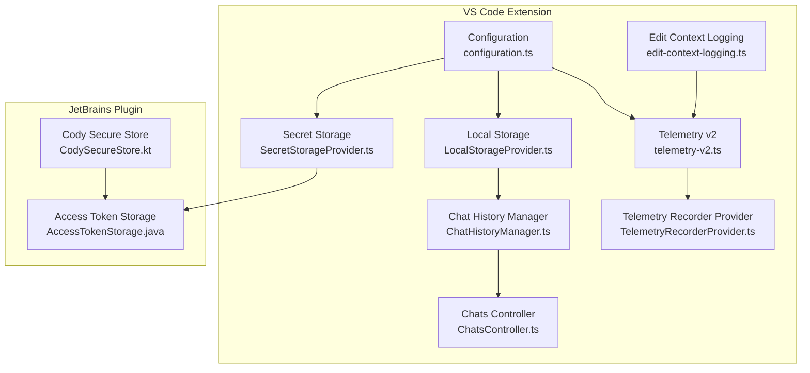
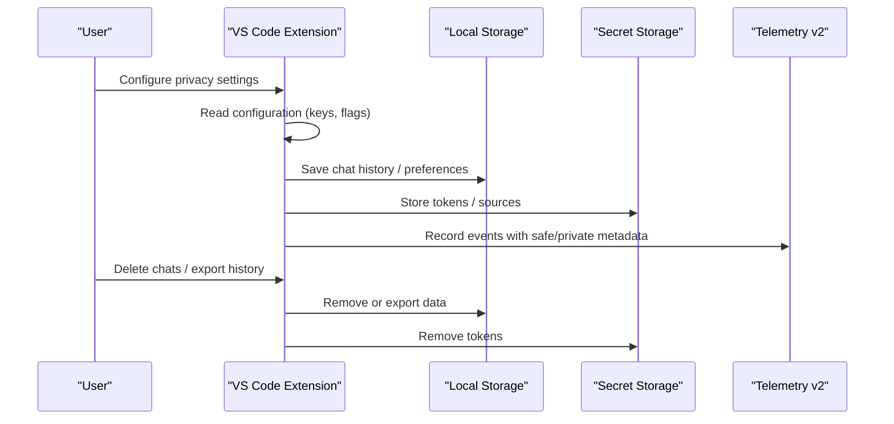
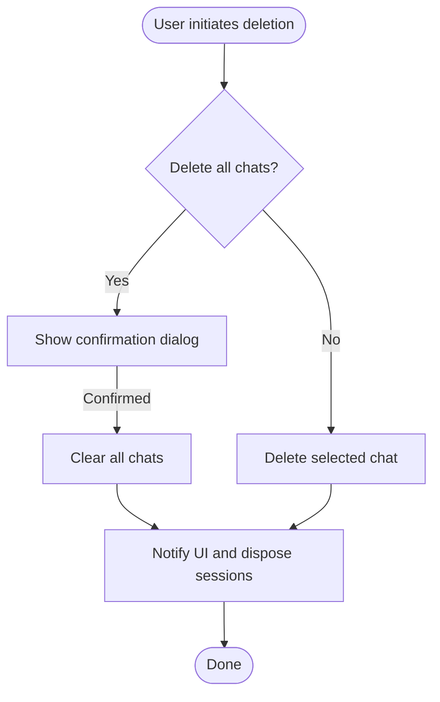
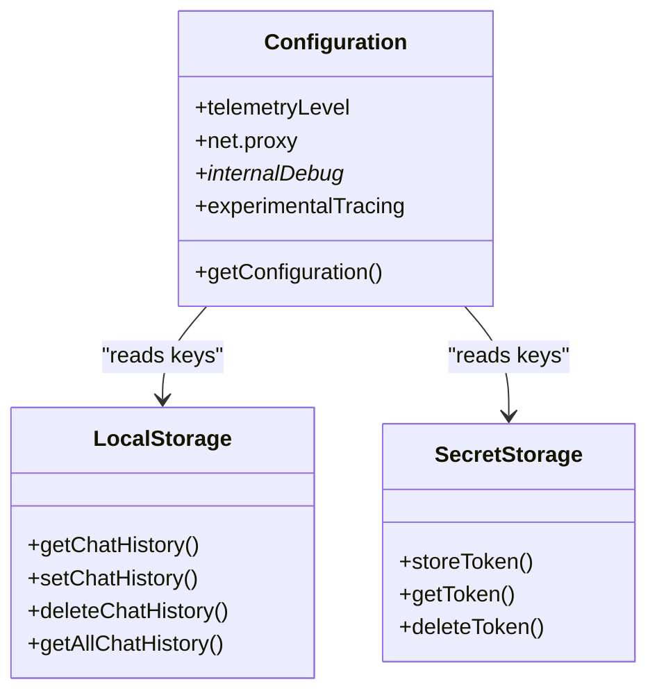
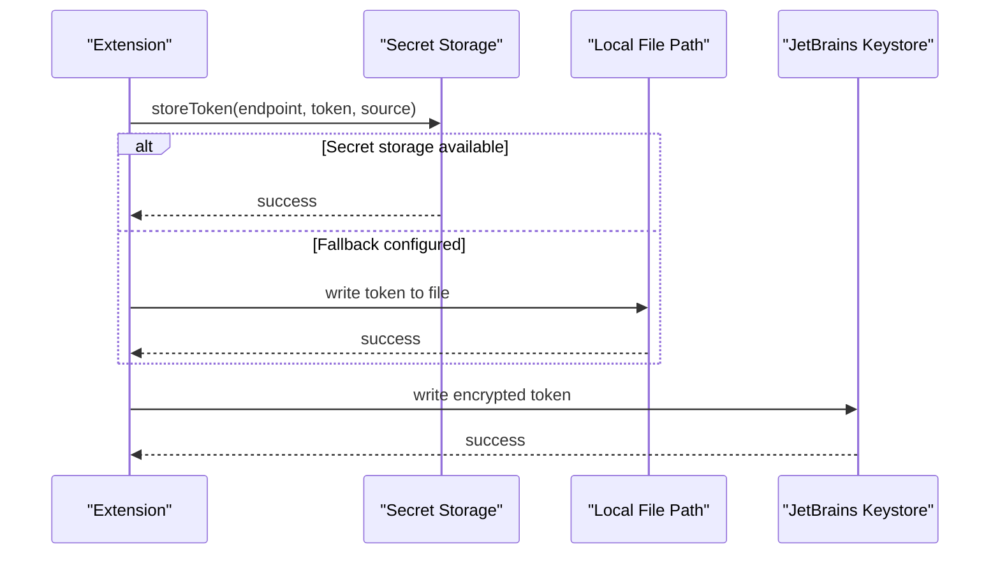
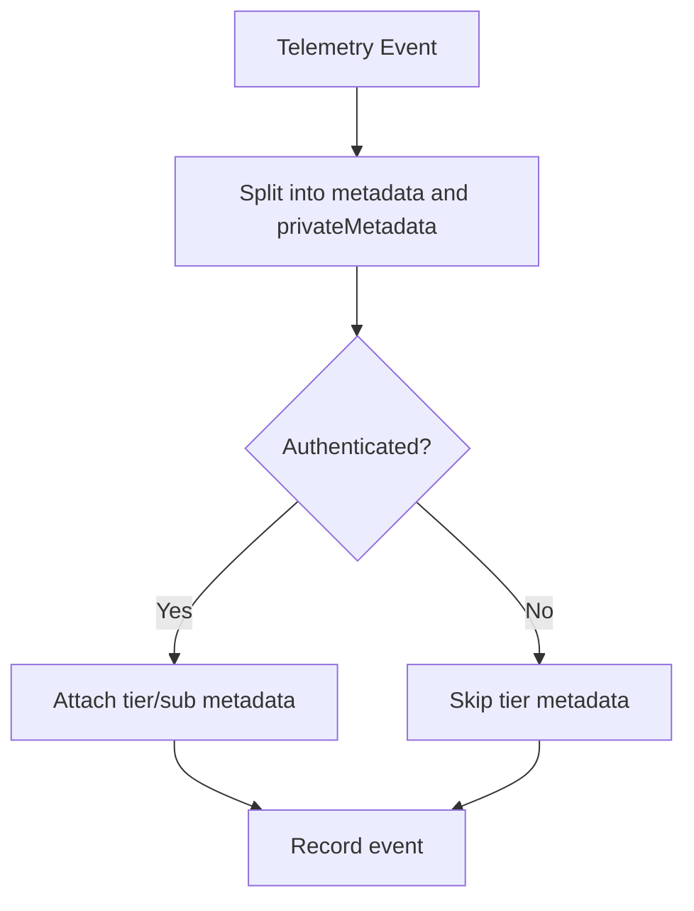
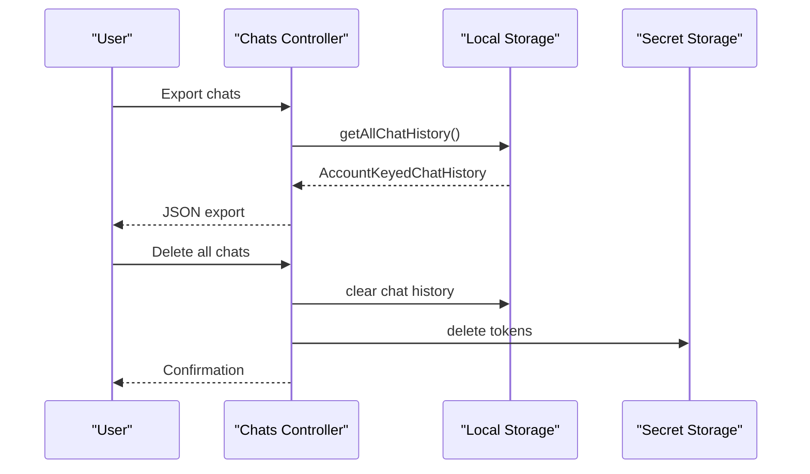
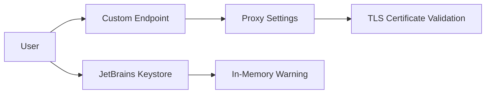
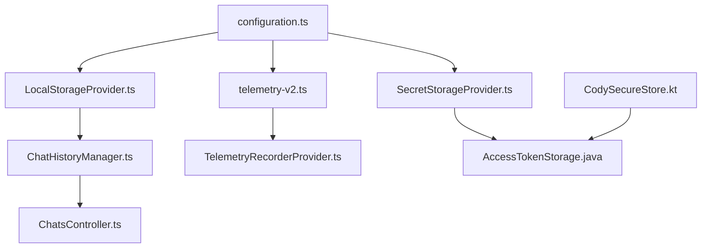

# Privacy Controls & Data Protection

<cite>
**Referenced Files in This Document**
- [configuration.ts](file://vscode/src/configuration.ts)
- [configuration-keys.ts](file://vscode/src/configuration-keys.ts)
- [package.json](file://vscode/package.json)
- [LocalStorageProvider.ts](file://vscode/src/services/LocalStorageProvider.ts)
- [SecretStorageProvider.ts](file://vscode/src/services/SecretStorageProvider.ts)
- [ChatHistoryManager.ts](file://vscode/src/chat/chat-view/ChatHistoryManager.ts)
- [ChatsController.ts](file://vscode/src/chat/chat-view/ChatsController.ts)
- [time-date.ts](file://vscode/src/common/time-date.ts)
- [CodySecureStore.kt](file://jetbrains/src/main/kotlin/com/sourcegraph/cody/auth/CodySecureStore.kt)
- [AccessTokenStorage.java](file://jetbrains/src/main/java/com/sourcegraph/config/AccessTokenStorage.java)
- [telemetry-v2.ts](file://vscode/src/services/telemetry-v2.ts)
- [TelemetryRecorderProvider.ts](file://lib/shared/src/telemetry-v2/TelemetryRecorderProvider.ts)
- [telemetry-v2.test.ts](file://vscode/src/services/telemetry-v2.test.ts)
- [edit-context-logging.ts](file://vscode/src/edit/edit-context-logging.ts)
- [plg-es-access.ts](file://vscode/src/utils/plg-es-access.ts)
</cite>

## Table of Contents
1. [Introduction](#introduction)
2. [Project Structure](#project-structure)
3. [Core Components](#core-components)
4. [Architecture Overview](#architecture-overview)
5. [Detailed Component Analysis](#detailed-component-analysis)
6. [Dependency Analysis](#dependency-analysis)
7. [Performance Considerations](#performance-considerations)
8. [Troubleshooting Guide](#troubleshooting-guide)
9. [Conclusion](#conclusion)
10. [Appendices](#appendices)

## Introduction
This document explains Cody’s privacy controls and data protection mechanisms across chat transcripts, code context, and user interactions. It covers configuration options for data retention and deletion, consent and telemetry management, encryption for secrets at rest, transport security, anonymization of telemetry, user data portability, and enterprise-focused controls such as data residency and cross-border transfers. It also includes practical configuration scenarios, data minimization strategies, and privacy impact assessment considerations.

## Project Structure
Cody’s privacy-related capabilities span:
- Configuration and feature flags that govern data handling behavior
- Local storage for chat history and client state
- Secret storage for tokens and sensitive credentials
- Telemetry processors that separate safe metadata from private data
- JetBrains-specific secure keystore and credential storage
- Edit context logging safeguards and payload size limits

**Diagram sources**
- [configuration.ts:25-204](file://vscode/src/configuration.ts#L25-L204)
- [LocalStorageProvider.ts:174-241](file://vscode/src/services/LocalStorageProvider.ts#L174-L241)
- [SecretStorageProvider.ts:89-118](file://vscode/src/services/SecretStorageProvider.ts#L89-L118)
- [ChatHistoryManager.ts:94-109](file://vscode/src/chat/chat-view/ChatHistoryManager.ts#L94-L109)
- [ChatsController.ts:511-531](file://vscode/src/chat/chat-view/ChatsController.ts#L511-L531)
- [telemetry-v2.ts:67-96](file://vscode/src/services/telemetry-v2.ts#L67-L96)
- [TelemetryRecorderProvider.ts:182-207](file://lib/shared/src/telemetry-v2/TelemetryRecorderProvider.ts#L182-L207)
- [edit-context-logging.ts:293-310](file://vscode/src/edit/edit-context-logging.ts#L293-L310)
- [CodySecureStore.kt:53-79](file://jetbrains/src/main/kotlin/com/sourcegraph/cody/auth/CodySecureStore.kt#L53-L79)
- [AccessTokenStorage.java:22-41](file://jetbrains/src/main/java/com/sourcegraph/config/AccessTokenStorage.java#L22-L41)

**Section sources**
- [configuration.ts:25-204](file://vscode/src/configuration.ts#L25-L204)
- [LocalStorageProvider.ts:174-241](file://vscode/src/services/LocalStorageProvider.ts#L174-L241)
- [SecretStorageProvider.ts:89-118](file://vscode/src/services/SecretStorageProvider.ts#L89-L118)
- [ChatHistoryManager.ts:94-109](file://vscode/src/chat/chat-view/ChatHistoryManager.ts#L94-L109)
- [ChatsController.ts:511-531](file://vscode/src/chat/chat-view/ChatsController.ts#L511-L531)
- [telemetry-v2.ts:67-96](file://vscode/src/services/telemetry-v2.ts#L67-L96)
- [TelemetryRecorderProvider.ts:182-207](file://lib/shared/src/telemetry-v2/TelemetryRecorderProvider.ts#L182-L207)
- [edit-context-logging.ts:293-310](file://vscode/src/edit/edit-context-logging.ts#L293-L310)
- [CodySecureStore.kt:53-79](file://jetbrains/src/main/kotlin/com/sourcegraph/cody/auth/CodySecureStore.kt#L53-L79)
- [AccessTokenStorage.java:22-41](file://jetbrains/src/main/java/com/sourcegraph/config/AccessTokenStorage.java#L22-L41)

## Core Components
- Configuration and feature flags: Centralized via typed configuration keys and sanitized values, enabling privacy-related toggles such as telemetry level, network proxy settings, and internal debug flags.
- Local storage: Stores chat history per account, endpoint history, anonymous user ID, and model preferences. Includes explicit deletion and export APIs.
- Secret storage: Persists tokens and token sources securely, with optional fallback to a local file path for environments without secret storage.
- Telemetry: Separates safe metadata from private data, attaches computed metadata (e.g., tier), and supports opt-in telemetry levels.
- JetBrains secure store: Manages a keystore-backed secure store with password-protected entries and warnings for in-memory-only storage.
- Edit context logging: Applies feature-flag gating and payload size checks to limit sensitive data exposure.

**Section sources**
- [configuration-keys.ts:12-55](file://vscode/src/configuration-keys.ts#L12-L55)
- [configuration.ts:25-204](file://vscode/src/configuration.ts#L25-L204)
- [LocalStorageProvider.ts:174-241](file://vscode/src/services/LocalStorageProvider.ts#L174-L241)
- [SecretStorageProvider.ts:89-118](file://vscode/src/services/SecretStorageProvider.ts#L89-L118)
- [telemetry-v2.ts:67-96](file://vscode/src/services/telemetry-v2.ts#L67-L96)
- [TelemetryRecorderProvider.ts:182-207](file://lib/shared/src/telemetry-v2/TelemetryRecorderProvider.ts#L182-L207)
- [CodySecureStore.kt:53-79](file://jetbrains/src/main/kotlin/com/sourcegraph/cody/auth/CodySecureStore.kt#L53-L79)
- [edit-context-logging.ts:293-310](file://vscode/src/edit/edit-context-logging.ts#L293-L310)

## Architecture Overview
Cody’s privacy architecture integrates configuration-driven behavior, local persistence, secure secret storage, and telemetry separation. Data flows are constrained by feature flags and explicit user actions (e.g., deletion and export).

**Diagram sources**
- [configuration.ts:25-204](file://vscode/src/configuration.ts#L25-L204)
- [LocalStorageProvider.ts:174-241](file://vscode/src/services/LocalStorageProvider.ts#L174-L241)
- [SecretStorageProvider.ts:89-118](file://vscode/src/services/SecretStorageProvider.ts#L89-L118)
- [telemetry-v2.ts:67-96](file://vscode/src/services/telemetry-v2.ts#L67-L96)

## Detailed Component Analysis

### Data Retention and Automatic Deletion Policies
- Chat history retention is controlled by local storage and user actions:
  - Lightweight history retrieval and sorting by timestamp
  - Explicit deletion of single chats and bulk deletion with confirmation
  - Export of chat history without authentication for portability
- Endpoint history and last-used endpoint are maintained separately to avoid storing tokens as endpoints.

**Diagram sources**
- [ChatsController.ts:511-531](file://vscode/src/chat/chat-view/ChatsController.ts#L511-L531)
- [ChatHistoryManager.ts:94-109](file://vscode/src/chat/chat-view/ChatHistoryManager.ts#L94-L109)

**Section sources**
- [ChatHistoryManager.ts:81-118](file://vscode/src/chat/chat-view/ChatHistoryManager.ts#L81-L118)
- [ChatsController.ts:511-531](file://vscode/src/chat/chat-view/ChatsController.ts#L511-L531)
- [LocalStorageProvider.ts:215-241](file://vscode/src/services/LocalStorageProvider.ts#L215-L241)

### Privacy Configuration Options
- Telemetry level: Controlled via hidden setting to restrict event recording.
- Network proxy and certificate settings: Allow restricted outbound traffic and certificate validation behavior.
- Internal debug flags: Enable or disable sensitive logging and tracing for debugging.
- Feature flags: Gate advanced features like edit context logging based on user tier and payload size thresholds.

**Diagram sources**
- [configuration.ts:25-204](file://vscode/src/configuration.ts#L25-L204)
- [LocalStorageProvider.ts:174-241](file://vscode/src/services/LocalStorageProvider.ts#L174-L241)
- [SecretStorageProvider.ts:89-118](file://vscode/src/services/SecretStorageProvider.ts#L89-L118)

**Section sources**
- [configuration.ts:95-139](file://vscode/src/configuration.ts#L95-L139)
- [configuration.ts:164-185](file://vscode/src/configuration.ts#L164-L185)
- [LocalStorageProvider.ts:174-241](file://vscode/src/services/LocalStorageProvider.ts#L174-L241)
- [SecretStorageProvider.ts:89-118](file://vscode/src/services/SecretStorageProvider.ts#L89-L118)

### Encryption Mechanisms for Secrets at Rest and in Transit
- Secrets at rest:
  - VS Code secret storage: Uses the platform’s secret storage API when available; falls back to a local file path if configured.
  - JetBrains keystore: AES-secured entries stored in a Java keystore with a generated password managed via the IDE’s credential store.
- Transport security:
  - Proxy configuration allows specifying endpoint, CA certificates, and certificate validation behavior.
  - TLS is enforced by default via HTTPS endpoints; certificate validation can be adjusted via configuration.

**Diagram sources**
- [SecretStorageProvider.ts:97-118](file://vscode/src/services/SecretStorageProvider.ts#L97-L118)
- [SecretStorageProvider.ts:75-77](file://vscode/src/services/SecretStorageProvider.ts#L75-L77)
- [CodySecureStore.kt:64-79](file://jetbrains/src/main/kotlin/com/sourcegraph/cody/auth/CodySecureStore.kt#L64-L79)

**Section sources**
- [SecretStorageProvider.ts:48-57](file://vscode/src/services/SecretStorageProvider.ts#L48-L57)
- [SecretStorageProvider.ts:97-118](file://vscode/src/services/SecretStorageProvider.ts#L97-L118)
- [CodySecureStore.kt:53-79](file://jetbrains/src/main/kotlin/com/sourcegraph/cody/auth/CodySecureStore.kt#L53-L79)
- [AccessTokenStorage.java:45-57](file://jetbrains/src/main/java/com/sourcegraph/config/AccessTokenStorage.java#L45-L57)

### Anonymization Techniques in Logs and Analytics
- Telemetry separation: Safe metadata and private metadata are explicitly separated before recording.
- Metadata enrichment: Tier and subscription metadata are attached only when authenticated; non-authenticated states are handled gracefully.
- Edit context logging: Enabled only for specific tiers and gated by a feature flag and payload size threshold.

**Diagram sources**
- [telemetry-v2.test.ts:119-161](file://vscode/src/services/telemetry-v2.test.ts#L119-L161)
- [TelemetryRecorderProvider.ts:182-207](file://lib/shared/src/telemetry-v2/TelemetryRecorderProvider.ts#L182-L207)
- [edit-context-logging.ts:293-310](file://vscode/src/edit/edit-context-logging.ts#L293-L310)

**Section sources**
- [telemetry-v2.ts:67-96](file://vscode/src/services/telemetry-v2.ts#L67-L96)
- [TelemetryRecorderProvider.ts:182-207](file://lib/shared/src/telemetry-v2/TelemetryRecorderProvider.ts#L182-L207)
- [telemetry-v2.test.ts:119-161](file://vscode/src/services/telemetry-v2.test.ts#L119-L161)
- [edit-context-logging.ts:293-310](file://vscode/src/edit/edit-context-logging.ts#L293-L310)

### User Data Portability and Deletion Requests
- Data portability:
  - Export chat history as JSON without requiring authentication.
  - Import merged chat history from external JSON.
- Deletion:
  - Delete single chat or clear all chats with confirmation.
  - Reset storage to remove persisted keys.
  - Delete tokens and endpoint history from secret storage.

**Diagram sources**
- [ChatsController.ts:511-531](file://vscode/src/chat/chat-view/ChatsController.ts#L511-L531)
- [LocalStorageProvider.ts:215-229](file://vscode/src/services/LocalStorageProvider.ts#L215-L229)
- [LocalStorageProvider.ts:270-276](file://vscode/src/services/LocalStorageProvider.ts#L270-L276)
- [SecretStorageProvider.ts:114-118](file://vscode/src/services/SecretStorageProvider.ts#L114-L118)

**Section sources**
- [LocalStorageProvider.ts:215-229](file://vscode/src/services/LocalStorageProvider.ts#L215-L229)
- [ChatsController.ts:511-531](file://vscode/src/chat/chat-view/ChatsController.ts#L511-L531)
- [SecretStorageProvider.ts:114-118](file://vscode/src/services/SecretStorageProvider.ts#L114-L118)

### Enterprise Privacy Requirements, Data Residency, and Cross-Border Transfers
- Data residency:
  - Users can configure custom server endpoints and tokens; endpoint history is maintained separately from tokens.
- Cross-border transfers:
  - Proxy settings allow routing traffic through trusted endpoints and validating certificates; certificate verification can be toggled.
- Access control:
  - JetBrains keystore enforces password-protected storage and warns when using in-memory-only storage.

**Diagram sources**
- [configuration.ts:75-89](file://vscode/src/configuration.ts#L75-L89)
- [LocalStorageProvider.ts:108-132](file://vscode/src/services/LocalStorageProvider.ts#L108-L132)
- [CodySecureStore.kt:91-108](file://jetbrains/src/main/kotlin/com/sourcegraph/cody/auth/CodySecureStore.kt#L91-L108)

**Section sources**
- [configuration.ts:75-89](file://vscode/src/configuration.ts#L75-L89)
- [LocalStorageProvider.ts:108-132](file://vscode/src/services/LocalStorageProvider.ts#L108-L132)
- [CodySecureStore.kt:91-108](file://jetbrains/src/main/kotlin/com/sourcegraph/cody/auth/CodySecureStore.kt#L91-L108)

### Examples of Privacy Configuration Scenarios
- Minimal data collection:
  - Set telemetry level to off via hidden configuration.
  - Disable internal debug flags and tracing.
- Data minimization for editing:
  - Keep edit context logging disabled or gate it behind feature flags and payload size checks.
- Secure token handling:
  - Prefer secret storage; if unavailable, configure a local token path and ensure file permissions are restrictive.
- Export and deletion:
  - Periodically export chats for backup, then delete locally and from secret storage.

**Section sources**
- [configuration.ts:95-139](file://vscode/src/configuration.ts#L95-L139)
- [configuration.ts:146-149](file://vscode/src/configuration.ts#L146-L149)
- [edit-context-logging.ts:293-310](file://vscode/src/edit/edit-context-logging.ts#L293-L310)
- [SecretStorageProvider.ts:48-57](file://vscode/src/services/SecretStorageProvider.ts#L48-L57)
- [LocalStorageProvider.ts:215-229](file://vscode/src/services/LocalStorageProvider.ts#L215-L229)
- [SecretStorageProvider.ts:114-118](file://vscode/src/services/SecretStorageProvider.ts#L114-L118)

### Compliance and Privacy Impact Assessments
- Data minimization:
  - Separate safe metadata from private data in telemetry; avoid recording sensitive fields.
  - Limit edit context logging to permitted tiers and sizes.
- Consent and transparency:
  - Respect user-selected telemetry level and disable internal debug flags.
  - Provide clear export and deletion controls.
- Data lifecycle:
  - Implement explicit deletion of chats, tokens, and endpoint history.
  - Maintain endpoint history separately from tokens to avoid accidental persistence of secrets.

**Section sources**
- [telemetry-v2.test.ts:119-161](file://vscode/src/services/telemetry-v2.test.ts#L119-L161)
- [TelemetryRecorderProvider.ts:182-207](file://lib/shared/src/telemetry-v2/TelemetryRecorderProvider.ts#L182-L207)
- [edit-context-logging.ts:293-310](file://vscode/src/edit/edit-context-logging.ts#L293-L310)
- [LocalStorageProvider.ts:108-132](file://vscode/src/services/LocalStorageProvider.ts#L108-L132)
- [SecretStorageProvider.ts:114-118](file://vscode/src/services/SecretStorageProvider.ts#L114-L118)

## Dependency Analysis
Cody’s privacy stack exhibits low coupling between concerns:
- Configuration drives behavior for storage, telemetry, and transport.
- Local storage and secret storage are independent providers with clear APIs.
- Telemetry processors enforce separation between safe and private data.
- JetBrains keystore complements secret storage for desktop environments.

**Diagram sources**
- [configuration.ts:25-204](file://vscode/src/configuration.ts#L25-L204)
- [LocalStorageProvider.ts:174-241](file://vscode/src/services/LocalStorageProvider.ts#L174-L241)
- [SecretStorageProvider.ts:89-118](file://vscode/src/services/SecretStorageProvider.ts#L89-L118)
- [ChatHistoryManager.ts:94-109](file://vscode/src/chat/chat-view/ChatHistoryManager.ts#L94-L109)
- [ChatsController.ts:511-531](file://vscode/src/chat/chat-view/ChatsController.ts#L511-L531)
- [telemetry-v2.ts:67-96](file://vscode/src/services/telemetry-v2.ts#L67-L96)
- [TelemetryRecorderProvider.ts:182-207](file://lib/shared/src/telemetry-v2/TelemetryRecorderProvider.ts#L182-L207)
- [AccessTokenStorage.java:22-41](file://jetbrains/src/main/java/com/sourcegraph/config/AccessTokenStorage.java#L22-L41)
- [CodySecureStore.kt:53-79](file://jetbrains/src/main/kotlin/com/sourcegraph/cody/auth/CodySecureStore.kt#L53-L79)

**Section sources**
- [configuration.ts:25-204](file://vscode/src/configuration.ts#L25-L204)
- [LocalStorageProvider.ts:174-241](file://vscode/src/services/LocalStorageProvider.ts#L174-L241)
- [SecretStorageProvider.ts:89-118](file://vscode/src/services/SecretStorageProvider.ts#L89-L118)
- [ChatHistoryManager.ts:94-109](file://vscode/src/chat/chat-view/ChatHistoryManager.ts#L94-L109)
- [ChatsController.ts:511-531](file://vscode/src/chat/chat-view/ChatsController.ts#L511-L531)
- [telemetry-v2.ts:67-96](file://vscode/src/services/telemetry-v2.ts#L67-L96)
- [TelemetryRecorderProvider.ts:182-207](file://lib/shared/src/telemetry-v2/TelemetryRecorderProvider.ts#L182-L207)
- [AccessTokenStorage.java:22-41](file://jetbrains/src/main/java/com/sourcegraph/config/AccessTokenStorage.java#L22-L41)
- [CodySecureStore.kt:53-79](file://jetbrains/src/main/kotlin/com/sourcegraph/cody/auth/CodySecureStore.kt#L53-L79)

## Performance Considerations
- Local storage size limits: Large histories trigger warnings and may influence retention strategies.
- Payload size checks: Edit context logging avoids oversized payloads to reduce risk and overhead.
- Telemetry batching: Metadata separation reduces event size and improves performance.

[No sources needed since this section provides general guidance]

## Troubleshooting Guide
- Telemetry not recorded:
  - Verify telemetry level setting and that internal debug flags are not overriding behavior.
- Tokens not persisted:
  - Check secret storage availability; if disabled, confirm local token path configuration and file permissions.
- Edit context logs missing:
  - Ensure feature flag is enabled and payload size is within limits.
- Endpoint history confusion:
  - Tokens are not saved as endpoints; verify endpoint history vs. token storage.

**Section sources**
- [telemetry-v2.ts:67-96](file://vscode/src/services/telemetry-v2.ts#L67-L96)
- [SecretStorageProvider.ts:48-57](file://vscode/src/services/SecretStorageProvider.ts#L48-L57)
- [edit-context-logging.ts:293-310](file://vscode/src/edit/edit-context-logging.ts#L293-L310)
- [LocalStorageProvider.ts:108-132](file://vscode/src/services/LocalStorageProvider.ts#L108-L132)

## Conclusion
Cody’s privacy controls center on configurable behavior, secure secret storage, local data portability, and telemetry separation. Administrators and users can tailor data retention, enforce minimal logging, and manage tokens securely across platforms. Enterprise-grade controls such as proxy settings, certificate validation, and keystore-backed storage further strengthen data residency and cross-border transfer governance.

[No sources needed since this section summarizes without analyzing specific files]

## Appendices

### Appendix A: Key Privacy Configuration Keys
- Telemetry level: Hidden setting to control event recording.
- Net proxy: Endpoint, CA cert path, and certificate validation toggle.
- Internal debug flags: Enable/disable sensitive logging and tracing.
- Experimental features: Auto-edit, guardrails timeout, and tracing.

**Section sources**
- [configuration.ts:95-139](file://vscode/src/configuration.ts#L95-L139)
- [configuration.ts:164-185](file://vscode/src/configuration.ts#L164-L185)

### Appendix B: Data Handling Lifecycle
- Collect: Configuration and user actions
- Store: Local storage for history and preferences; secret storage for tokens
- Process: Telemetry processors separate safe and private metadata
- Delete: Per-user deletion and bulk clearing; token removal and endpoint cleanup

**Section sources**
- [LocalStorageProvider.ts:174-241](file://vscode/src/services/LocalStorageProvider.ts#L174-L241)
- [SecretStorageProvider.ts:89-118](file://vscode/src/services/SecretStorageProvider.ts#L89-L118)
- [TelemetryRecorderProvider.ts:182-207](file://lib/shared/src/telemetry-v2/TelemetryRecorderProvider.ts#L182-L207)