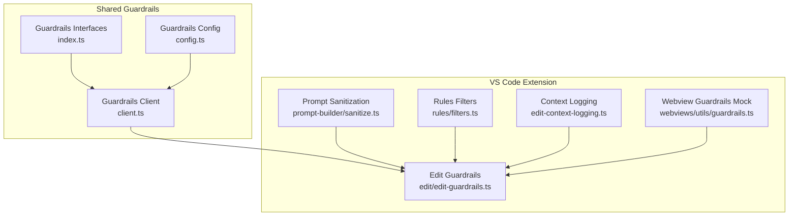
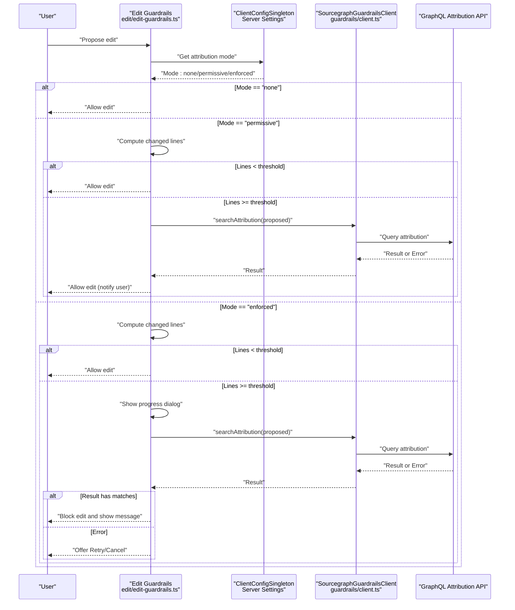
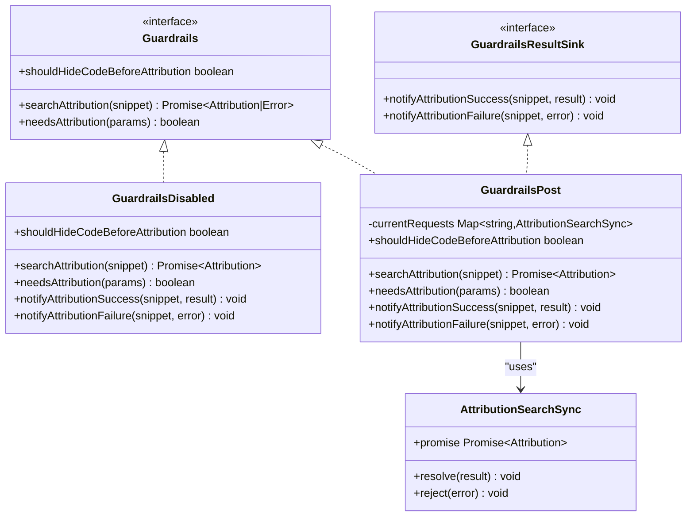
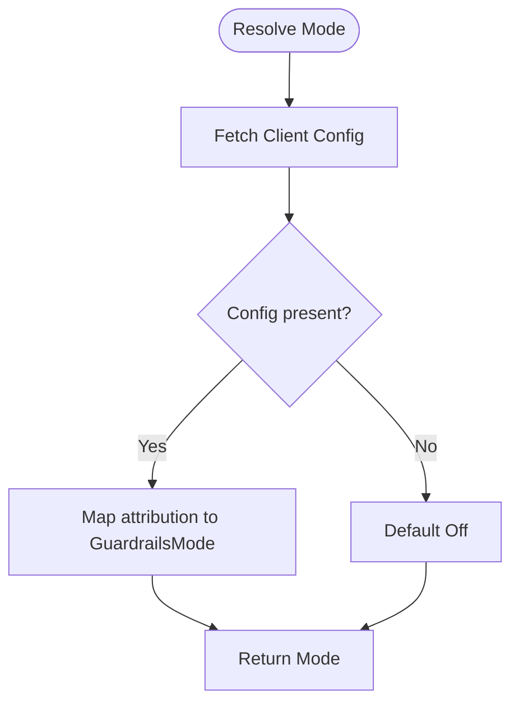
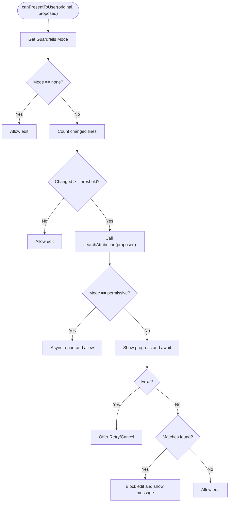
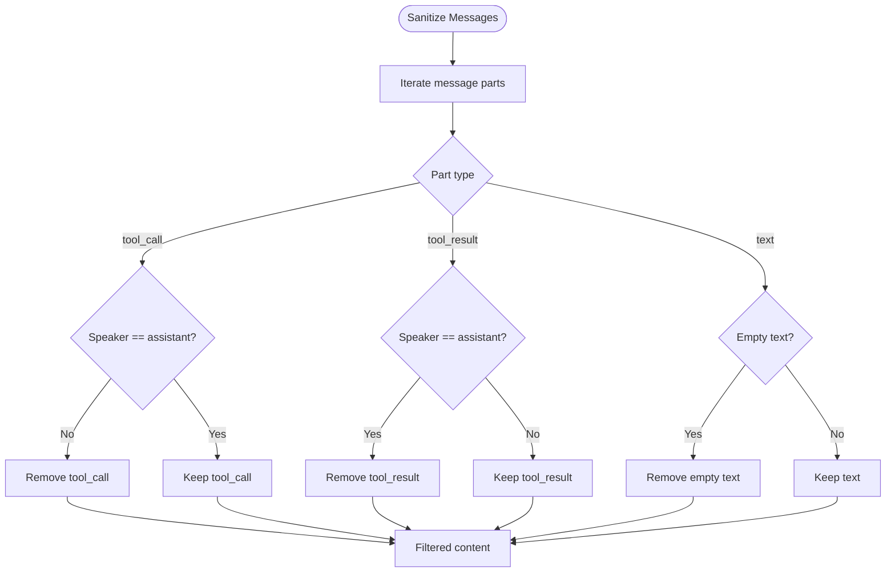
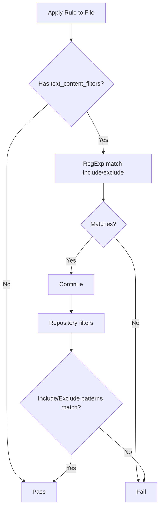
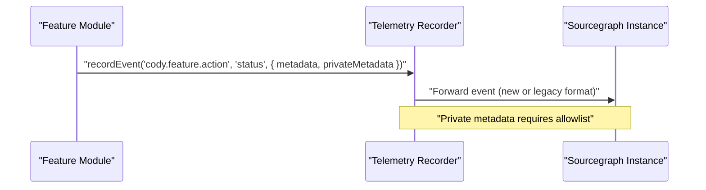
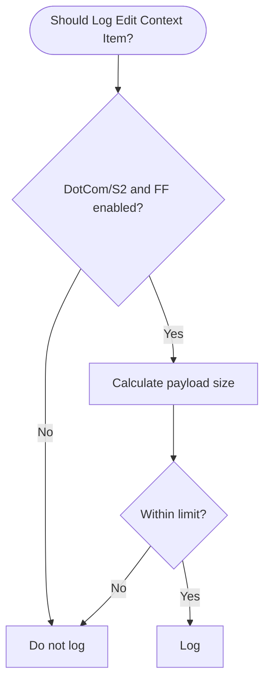
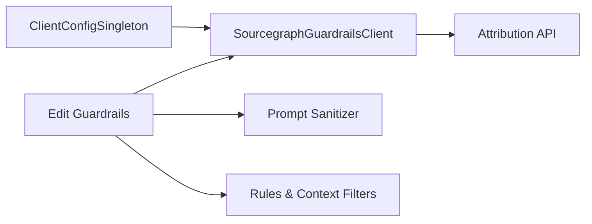

# Security & Guardrails

<cite>
**Referenced Files in This Document**
- [guardrails/index.ts](file://lib/shared/src/guardrails/index.ts)
- [guardrails/config.ts](file://lib/shared/src/guardrails/config.ts)
- [guardrails/client.ts](file://lib/shared/src/guardrails/client.ts)
- [edit/edit-guardrails.ts](file://vscode/src/edit/edit-guardrails.ts)
- [webviews/utils/guardrails.ts](file://vscode/webviews/utils/guardrails.ts)
- [prompt-builder/sanitize.ts](file://vscode/src/prompt-builder/sanitize.ts)
- [rules/filters.ts](file://lib/shared/src/rules/filters.ts)
- [cody-ignore/context-filters-provider.test.ts](file://lib/shared/src/cody-ignore/context-filters-provider.test.ts)
- [edit-context-logging.ts](file://vscode/src/edit/edit-context-logging.ts)
- [ARCHITECTURE.md](file://ARCHITECTURE.md)
- [TelemetryRecorderProvider.ts](file://lib/shared/src/telemetry-v2/TelemetryRecorderProvider.ts)
</cite>

## Table of Contents
1. [Introduction](#introduction)
2. [Project Structure](#project-structure)
3. [Core Components](#core-components)
4. [Architecture Overview](#architecture-overview)
5. [Detailed Component Analysis](#detailed-component-analysis)
6. [Dependency Analysis](#dependency-analysis)
7. [Performance Considerations](#performance-considerations)
8. [Troubleshooting Guide](#troubleshooting-guide)
9. [Conclusion](#conclusion)
10. [Appendices](#appendices)

## Introduction
This document explains Cody’s security and guardrails systems with a focus on content filtering, policy enforcement, and compliance features. It covers how guardrails prevent unsafe code generation, protect sensitive information, and enforce organizational policies. It also documents the audit logging system, security event tracking, and compliance reporting capabilities, along with content safety measures such as prompt injection prevention, output filtering, and context data sanitization. Administrators can configure guardrails and customize policies, and the document includes examples of violations, enforcement scenarios, and troubleshooting steps for security-related issues.

## Project Structure
Cody’s security and guardrails features are implemented across shared libraries and the VS Code extension. The most relevant areas include:
- Shared guardrails interfaces and implementations
- Client-side guardrails configuration and attribution lookup
- Edit-time guardrails enforcement
- Prompt sanitization and content filtering
- Context filtering and policy enforcement
- Audit logging and telemetry for security events

**Diagram sources**
- [guardrails/index.ts:1-208](file://lib/shared/src/guardrails/index.ts#L1-L208)
- [guardrails/config.ts:1-44](file://lib/shared/src/guardrails/config.ts#L1-L44)
- [guardrails/client.ts:1-58](file://lib/shared/src/guardrails/client.ts#L1-L58)
- [edit/edit-guardrails.ts:1-142](file://vscode/src/edit/edit-guardrails.ts#L1-L142)
- [webviews/utils/guardrails.ts:1-22](file://vscode/webviews/utils/guardrails.ts#L1-L22)
- [prompt-builder/sanitize.ts:1-371](file://vscode/src/prompt-builder/sanitize.ts#L1-L371)
- [rules/filters.ts:47-82](file://lib/shared/src/rules/filters.ts#L47-L82)
- [edit-context-logging.ts:293-310](file://vscode/src/edit/edit-context-logging.ts#L293-L310)

**Section sources**
- [guardrails/index.ts:1-208](file://lib/shared/src/guardrails/index.ts#L1-L208)
- [guardrails/config.ts:1-44](file://lib/shared/src/guardrails/config.ts#L1-L44)
- [guardrails/client.ts:1-58](file://lib/shared/src/guardrails/client.ts#L1-L58)
- [edit/edit-guardrails.ts:1-142](file://vscode/src/edit/edit-guardrails.ts#L1-L142)
- [webviews/utils/guardrails.ts:1-22](file://vscode/webviews/utils/guardrails.ts#L1-L22)
- [prompt-builder/sanitize.ts:1-371](file://vscode/src/prompt-builder/sanitize.ts#L1-L371)
- [rules/filters.ts:47-82](file://lib/shared/src/rules/filters.ts#L47-L82)
- [edit-context-logging.ts:293-310](file://vscode/src/edit/edit-context-logging.ts#L293-L310)

## Core Components
- Guardrails interfaces define attribution checks, enforcement modes, and result statuses.
- Guardrails configuration exposes mode, minimum lines threshold, and metrics toggles.
- Guardrails client resolves server-side mode and performs attribution lookups with timeouts.
- Edit guardrails enforces policy during code edits, optionally hiding intermediate results in enforced mode.
- Prompt sanitization removes sensitive or unsafe content from chat messages.
- Rules filters and context filters enforce repository and content patterns.
- Context logging includes safeguards for payload size and user scope.
- Telemetry and audit logging capture security-relevant events.

**Section sources**
- [guardrails/index.ts:1-208](file://lib/shared/src/guardrails/index.ts#L1-L208)
- [guardrails/config.ts:1-44](file://lib/shared/src/guardrails/config.ts#L1-L44)
- [guardrails/client.ts:1-58](file://lib/shared/src/guardrails/client.ts#L1-L58)
- [edit/edit-guardrails.ts:1-142](file://vscode/src/edit/edit-guardrails.ts#L1-L142)
- [prompt-builder/sanitize.ts:1-371](file://vscode/src/prompt-builder/sanitize.ts#L1-L371)
- [rules/filters.ts:47-82](file://lib/shared/src/rules/filters.ts#L47-L82)
- [edit-context-logging.ts:293-310](file://vscode/src/edit/edit-context-logging.ts#L293-L310)
- [ARCHITECTURE.md:75-119](file://ARCHITECTURE.md#L75-L119)
- [TelemetryRecorderProvider.ts:182-207](file://lib/shared/src/telemetry-v2/TelemetryRecorderProvider.ts#L182-L207)

## Architecture Overview
The guardrails system integrates shared interfaces with client-side configuration and enforcement logic in the editor. Attribution requests are made to the backend with configurable timeouts, and enforcement depends on server-provided mode. Edit-time enforcement can block or delay presentation of code depending on mode and thresholds. Prompt sanitization and context filters further reduce risk by removing or ignoring sensitive content.

**Diagram sources**
- [edit/edit-guardrails.ts:9-142](file://vscode/src/edit/edit-guardrails.ts#L9-L142)
- [guardrails/client.ts:21-57](file://lib/shared/src/guardrails/client.ts#L21-L57)
- [guardrails/index.ts:25-49](file://lib/shared/src/guardrails/index.ts#L25-L49)

**Section sources**
- [edit/edit-guardrails.ts:1-142](file://vscode/src/edit/edit-guardrails.ts#L1-L142)
- [guardrails/client.ts:1-58](file://lib/shared/src/guardrails/client.ts#L1-L58)
- [guardrails/index.ts:1-208](file://lib/shared/src/guardrails/index.ts#L1-L208)

## Detailed Component Analysis

### Guardrails Interfaces and Modes
- GuardrailsMode: Off, Permissive, Enforced.
- GuardrailsCheckStatus: GeneratingCode, Checking, Skipped, Success, Failed, Error.
- Guardrails interface supports attribution queries, attribution needs detection, and code-hiding decisions.
- Implementations:
  - GuardrailsDisabled: disables all checks and ignores results.
  - GuardrailsPost: posts snippets for attribution and synchronizes via promises; hides code in enforced mode; skips checks for small code blocks or shell scripts.

**Diagram sources**
- [guardrails/index.ts:1-208](file://lib/shared/src/guardrails/index.ts#L1-L208)

**Section sources**
- [guardrails/index.ts:1-208](file://lib/shared/src/guardrails/index.ts#L1-L208)

### Guardrails Configuration and Client
- Configuration includes mode, minimum lines threshold, and metrics toggle.
- Client resolves server-side mode and performs attribution lookups with a configurable timeout.
- Mode resolution maps server settings to GuardrailsMode.

**Diagram sources**
- [guardrails/config.ts:1-44](file://lib/shared/src/guardrails/config.ts#L1-L44)
- [guardrails/client.ts:43-56](file://lib/shared/src/guardrails/client.ts#L43-L56)

**Section sources**
- [guardrails/config.ts:1-44](file://lib/shared/src/guardrails/config.ts#L1-L44)
- [guardrails/client.ts:1-58](file://lib/shared/src/guardrails/client.ts#L1-L58)

### Edit-Time Guardrails Enforcement
- Determines whether to hide intermediate code based on mode.
- Computes changed lines between original and proposed content; skips checks below threshold.
- In permissive mode, asynchronously reports matches and allows presentation; in enforced mode, waits for synchronous results and blocks on matches or errors.
- Provides retry/cancel on errors in enforced mode.

**Diagram sources**
- [edit/edit-guardrails.ts:49-142](file://vscode/src/edit/edit-guardrails.ts#L49-L142)

**Section sources**
- [edit/edit-guardrails.ts:1-142](file://vscode/src/edit/edit-guardrails.ts#L1-L142)

### Prompt Injection Prevention and Output Filtering
- Prompt sanitization removes content between specific tags in the first human message and filters tool calls/results based on speaker role.
- Ensures that assistant cannot inject tool calls and human cannot include tool results, reducing prompt injection risks.

**Diagram sources**
- [prompt-builder/sanitize.ts:69-91](file://vscode/src/prompt-builder/sanitize.ts#L69-L91)

**Section sources**
- [prompt-builder/sanitize.ts:1-371](file://vscode/src/prompt-builder/sanitize.ts#L1-L371)

### Content Safety Measures and Policy Enforcement
- Rules filters support include/exclude patterns for repository and content matching.
- Context filters enforce repository inclusion/exclusion and pattern-based filtering.
- These mechanisms help prevent unsafe or sensitive content from being used in prompts or completions.

**Diagram sources**
- [rules/filters.ts:47-82](file://lib/shared/src/rules/filters.ts#L47-L82)
- [cody-ignore/context-filters-provider.test.ts:84-118](file://lib/shared/src/cody-ignore/context-filters-provider.test.ts#L84-L118)

**Section sources**
- [rules/filters.ts:47-82](file://lib/shared/src/rules/filters.ts#L47-L82)
- [cody-ignore/context-filters-provider.test.ts:84-118](file://lib/shared/src/cody-ignore/context-filters-provider.test.ts#L84-L118)

### Audit Logging and Security Event Tracking
- Telemetry follows a strict schema with feature-scoped names, actions, numeric metadata, and optional private metadata.
- Private metadata is not exported by default and requires server-side allowlisting.
- Security-relevant events should be recorded with appropriate categorization and minimal sensitive data.

**Diagram sources**
- [ARCHITECTURE.md:75-119](file://ARCHITECTURE.md#L75-L119)
- [TelemetryRecorderProvider.ts:182-207](file://lib/shared/src/telemetry-v2/TelemetryRecorderProvider.ts#L182-L207)

**Section sources**
- [ARCHITECTURE.md:75-119](file://ARCHITECTURE.md#L75-L119)
- [TelemetryRecorderProvider.ts:182-207](file://lib/shared/src/telemetry-v2/TelemetryRecorderProvider.ts#L182-L207)

### Privacy Controls and Data Handling
- Context logging includes safeguards: only enabled for DotCom or S2 users under feature flags and subject to payload size limits.
- Payload size calculation ensures potentially large payloads are not logged.

**Diagram sources**
- [edit-context-logging.ts:293-310](file://vscode/src/edit/edit-context-logging.ts#L293-L310)

**Section sources**
- [edit-context-logging.ts:293-310](file://vscode/src/edit/edit-context-logging.ts#L293-L310)

## Dependency Analysis
- Guardrails client depends on server configuration resolution and GraphQL attribution API.
- Edit guardrails depends on client configuration and the guardrails client for attribution.
- Prompt sanitization is used by chat flows to filter content before sending to models.
- Rules and context filters integrate with repository and content policies.

**Diagram sources**
- [guardrails/client.ts:1-58](file://lib/shared/src/guardrails/client.ts#L1-L58)
- [edit/edit-guardrails.ts:1-142](file://vscode/src/edit/edit-guardrails.ts#L1-L142)
- [prompt-builder/sanitize.ts:1-371](file://vscode/src/prompt-builder/sanitize.ts#L1-L371)
- [rules/filters.ts:47-82](file://lib/shared/src/rules/filters.ts#L47-L82)

**Section sources**
- [guardrails/client.ts:1-58](file://lib/shared/src/guardrails/client.ts#L1-L58)
- [edit/edit-guardrails.ts:1-142](file://vscode/src/edit/edit-guardrails.ts#L1-L142)
- [prompt-builder/sanitize.ts:1-371](file://vscode/src/prompt-builder/sanitize.ts#L1-L371)
- [rules/filters.ts:47-82](file://lib/shared/src/rules/filters.ts#L47-L82)

## Performance Considerations
- Attribution requests can be slow; the client uses a generous timeout and may issue multiple concurrent requests per chat.
- Edit guardrails avoids unnecessary checks by skipping small diffs and shell scripts.
- Telemetry recording should minimize payload sizes and avoid excessive private metadata to reduce overhead.

[No sources needed since this section provides general guidance]

## Troubleshooting Guide
Common guardrail violation and enforcement scenarios:
- Violation example: Proposed edit triggers attribution matches in enforced mode; user sees a message listing matching repositories and the edit is blocked.
- Enforcement scenario: Permissive mode with sufficient changed lines triggers asynchronous attribution; user is notified but edit proceeds.
- Timeout or error: In enforced mode, errors trigger a retry/cancel dialog; retries re-run the attribution check.

Administrative controls and configuration:
- Configure guardrails mode and thresholds via server-side settings and client configuration.
- Adjust timeout for attribution requests to balance responsiveness and accuracy.
- Use prompt sanitization and context filters to reduce risk exposure.

Privacy and data handling:
- Verify that context logging is enabled only for permitted users and under feature flags.
- Monitor payload sizes to avoid logging oversized data.

**Section sources**
- [edit/edit-guardrails.ts:49-142](file://vscode/src/edit/edit-guardrails.ts#L49-L142)
- [guardrails/client.ts:21-57](file://lib/shared/src/guardrails/client.ts#L21-L57)
- [prompt-builder/sanitize.ts:69-91](file://vscode/src/prompt-builder/sanitize.ts#L69-L91)
- [edit-context-logging.ts:293-310](file://vscode/src/edit/edit-context-logging.ts#L293-L310)

## Conclusion
Cody’s security and guardrails systems combine server-driven configuration, client-side enforcement, and content safety measures to prevent unsafe code generation, protect sensitive information, and enforce organizational policies. Guardrails operate across editing, prompting, and context ingestion, with robust telemetry and privacy safeguards. Administrators can tune enforcement modes, thresholds, and timeouts to meet enterprise needs while maintaining strong audit logging and compliance visibility.

[No sources needed since this section summarizes without analyzing specific files]

## Appendices

### Security Configuration Options
- Guardrails mode: Off, Permissive, Enforced.
- Minimum lines threshold for attribution checks.
- Metrics collection toggle.
- Experimental timeout for attribution requests.

**Section sources**
- [guardrails/config.ts:1-44](file://lib/shared/src/guardrails/config.ts#L1-L44)
- [guardrails/client.ts:17-29](file://lib/shared/src/guardrails/client.ts#L17-L29)

### Compliance Reporting Capabilities
- Telemetry schema supports categorizing security-related events with numeric metadata and optional private metadata.
- Private metadata requires server-side allowlisting.

**Section sources**
- [ARCHITECTURE.md:75-119](file://ARCHITECTURE.md#L75-L119)
- [TelemetryRecorderProvider.ts:182-207](file://lib/shared/src/telemetry-v2/TelemetryRecorderProvider.ts#L182-L207)