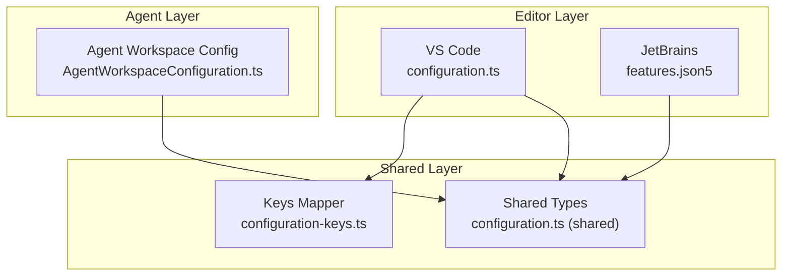
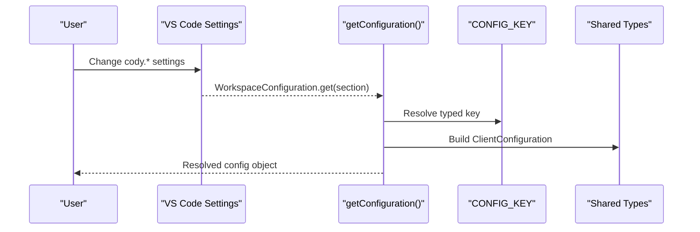
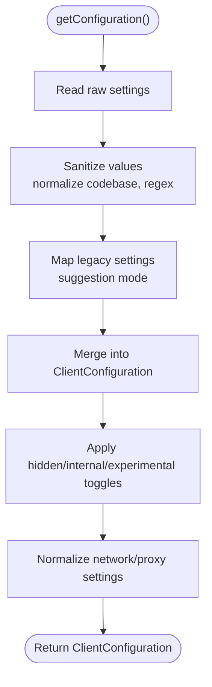
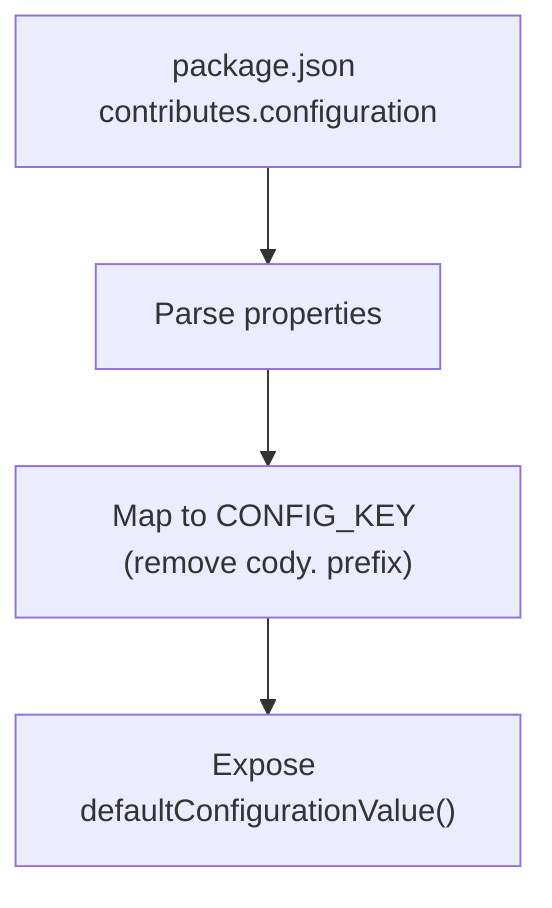
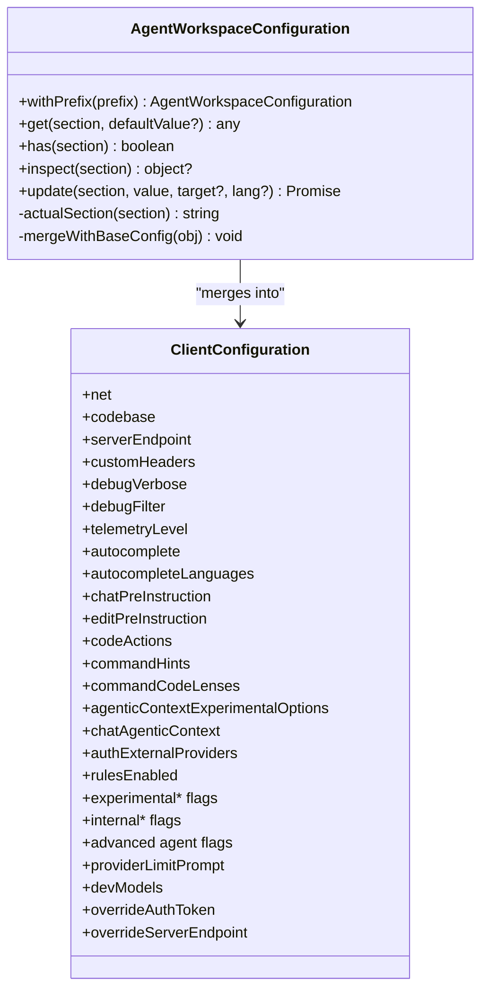
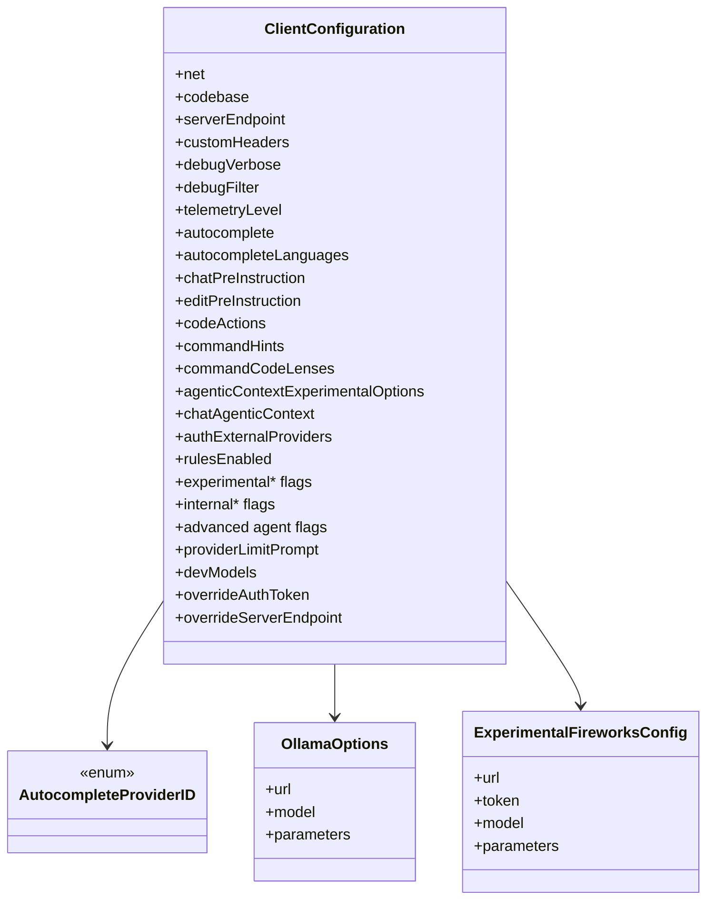
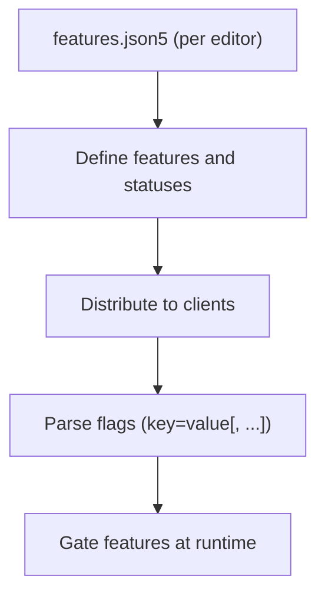
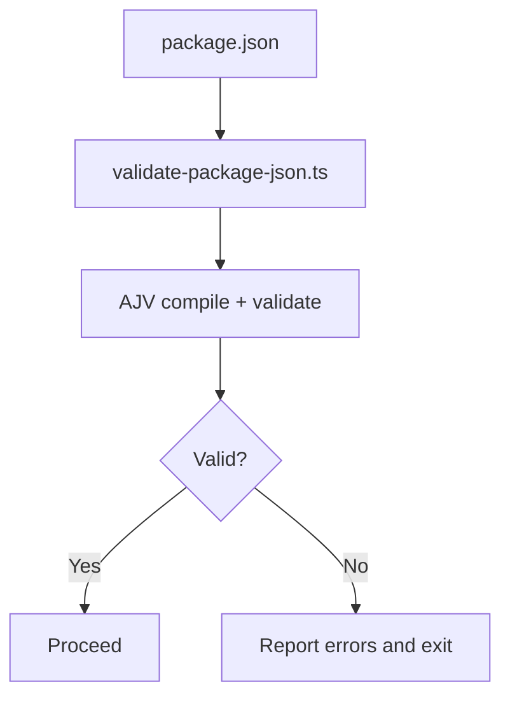
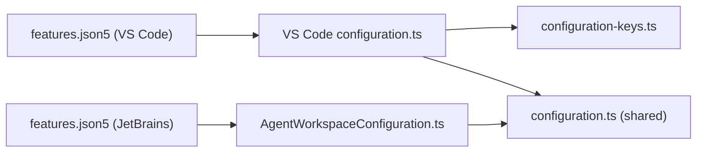

# Configuration & Customization

<cite>
**Referenced Files in This Document**
- [configuration.ts](file://vscode/src/configuration.ts)
- [configuration-keys.ts](file://vscode/src/configuration-keys.ts)
- [AgentWorkspaceConfiguration.ts](file://agent/src/AgentWorkspaceConfiguration.ts)
- [configuration.ts (shared)](file://lib/shared/src/configuration.ts)
- [features.json5 (VS Code)](file://vscode/features.json5)
- [features.json5 (JetBrains)](file://jetbrains/features.json5)
- [configuration.test.ts](file://vscode/src/configuration.test.ts)
- [package.json](file://vscode/package.json)
- [validate-package-json.ts](file://vscode/scripts/validate-package-json.ts)
- [AgentWorkspaceConfiguration.ts (test)](file://agent/src/AgentWorkspaceConfiguration.test.ts)
</cite>

## Table of Contents
1. [Introduction](#introduction)
2. [Project Structure](#project-structure)
3. [Core Components](#core-components)
4. [Architecture Overview](#architecture-overview)
5. [Detailed Component Analysis](#detailed-component-analysis)
6. [Dependency Analysis](#dependency-analysis)
7. [Performance Considerations](#performance-considerations)
8. [Troubleshooting Guide](#troubleshooting-guide)
9. [Conclusion](#conclusion)
10. [Appendices](#appendices)

## Introduction
This document explains how Cody’s configuration and customization system works across environments and editors. It covers:
- Multi-layer configuration: user preferences, workspace settings, and agent overrides
- Feature flags and staged rollouts
- Environment detection and dynamic updates
- Customization for LLM providers, model selection, and prompt engineering
- Programmatic configuration access and validation
- Deployment scenarios and best practices for individuals, teams, and enterprises

## Project Structure
Cody’s configuration spans three layers:
- Editor-level configuration (VS Code and JetBrains)
- Shared configuration types and constants
- Agent-side configuration adapter for non-editor environments

**Diagram sources**
- [configuration.ts:1-233](file://vscode/src/configuration.ts#L1-L233)
- [configuration-keys.ts:1-55](file://vscode/src/configuration-keys.ts#L1-L55)
- [configuration.ts (shared):115-214](file://lib/shared/src/configuration.ts#L115-L214)
- [AgentWorkspaceConfiguration.ts:1-214](file://agent/src/AgentWorkspaceConfiguration.ts#L1-L214)
- [features.json5 (VS Code):1-91](file://vscode/features.json5#L1-L91)
- [features.json5 (JetBrains):1-69](file://jetbrains/features.json5#L1-L69)

**Section sources**
- [configuration.ts:1-233](file://vscode/src/configuration.ts#L1-L233)
- [configuration-keys.ts:1-55](file://vscode/src/configuration-keys.ts#L1-L55)
- [configuration.ts (shared):115-214](file://lib/shared/src/configuration.ts#L115-L214)
- [AgentWorkspaceConfiguration.ts:1-214](file://agent/src/AgentWorkspaceConfiguration.ts#L1-L214)
- [features.json5 (VS Code):1-91](file://vscode/features.json5#L1-L91)
- [features.json5 (JetBrains):1-69](file://jetbrains/features.json5#L1-L69)

## Core Components
- Editor configuration builder: transforms VS Code settings into a normalized ClientConfiguration object, including sanitization and hidden/internal/experimental toggles.
- Keys mapper: derives strongly typed configuration keys from the extension manifest.
- Agent workspace configuration adapter: merges base configuration with custom overrides and supports runtime updates.
- Shared configuration types: defines the canonical ClientConfiguration shape, provider IDs, and model/provider options.
- Feature flags: define product features and their availability per editor and status.

Key responsibilities:
- Normalize and validate configuration values
- Expose feature flags and experimental controls
- Support dynamic updates and agent-side overrides
- Provide programmatic access to settings

**Section sources**
- [configuration.ts:25-204](file://vscode/src/configuration.ts#L25-L204)
- [configuration-keys.ts:7-55](file://vscode/src/configuration-keys.ts#L7-L55)
- [AgentWorkspaceConfiguration.ts:59-160](file://agent/src/AgentWorkspaceConfiguration.ts#L59-L160)
- [configuration.ts (shared):115-214](file://lib/shared/src/configuration.ts#L115-L214)
- [features.json5 (VS Code):1-91](file://vscode/features.json5#L1-L91)

## Architecture Overview
The configuration pipeline reads VS Code settings, normalizes them, and exposes a unified ClientConfiguration consumed by the rest of the app. Agent environments use an adapter that merges base configuration with custom overrides and supports runtime updates.

**Diagram sources**
- [configuration.ts:25-204](file://vscode/src/configuration.ts#L25-L204)
- [configuration-keys.ts:18-55](file://vscode/src/configuration-keys.ts#L18-L55)
- [configuration.ts (shared):115-214](file://lib/shared/src/configuration.ts#L115-L214)

## Detailed Component Analysis

### Editor Configuration Builder
- Reads VS Code settings via a ConfigGetter abstraction
- Applies sanitization (e.g., codebase normalization, debug regex parsing)
- Maps legacy or transitional settings to modern equivalents
- Exposes hidden/internal/experimental toggles for advanced use cases
- Supports network/proxy settings and telemetry level

**Diagram sources**
- [configuration.ts:25-204](file://vscode/src/configuration.ts#L25-L204)

**Section sources**
- [configuration.ts:25-204](file://vscode/src/configuration.ts#L25-L204)

### Keys Mapper
- Derives strongly typed configuration keys from the extension manifest
- Removes prefixes and camelCases nested keys
- Provides default values lookup for validation and UX

**Diagram sources**
- [configuration-keys.ts:18-55](file://vscode/src/configuration-keys.ts#L18-L55)
- [package.json](file://vscode/package.json#L123-L...)

**Section sources**
- [configuration-keys.ts:7-55](file://vscode/src/configuration-keys.ts#L7-L55)
- [package.json](file://vscode/package.json#L123-L...)

### Agent Workspace Configuration Adapter
- Merges base configuration with custom overrides (JSON or object)
- Supports runtime updates and dictionary-backed overrides
- Normalizes IDE/client capabilities for agent environments
- Returns structured values with fallbacks to defaultConfigurationValue()

**Diagram sources**
- [AgentWorkspaceConfiguration.ts:10-214](file://agent/src/AgentWorkspaceConfiguration.ts#L10-L214)
- [configuration.ts (shared):115-214](file://lib/shared/src/configuration.ts#L115-L214)

**Section sources**
- [AgentWorkspaceConfiguration.ts:59-160](file://agent/src/AgentWorkspaceConfiguration.ts#L59-L160)
- [AgentWorkspaceConfiguration.ts:114-150](file://agent/src/AgentWorkspaceConfiguration.ts#L114-L150)

### Shared Configuration Types and Provider Options
- Defines ClientConfiguration shape and readonly deep typing
- Enumerates autocomplete provider IDs and model/provider options
- Includes Ollama and Fireworks configuration interfaces
- Provides enums for IDE types and suggestion modes

**Diagram sources**
- [configuration.ts (shared):115-214](file://lib/shared/src/configuration.ts#L115-L214)
- [configuration.ts (shared):256-347](file://lib/shared/src/configuration.ts#L256-L347)
- [configuration.ts (shared):349-366](file://lib/shared/src/configuration.ts#L349-L366)
- [configuration.ts (shared):475-480](file://lib/shared/src/configuration.ts#L475-L480)

**Section sources**
- [configuration.ts (shared):115-214](file://lib/shared/src/configuration.ts#L115-L214)
- [configuration.ts (shared):256-347](file://lib/shared/src/configuration.ts#L256-L347)
- [configuration.ts (shared):349-366](file://lib/shared/src/configuration.ts#L349-L366)
- [configuration.ts (shared):475-480](file://lib/shared/src/configuration.ts#L475-L480)

### Feature Flags and Staged Rollouts
- Feature definitions are declared in editor-specific features.json5 files
- Flags include product features (e.g., NotebookChatUI, Mixtral8x22BPreview)
- Status indicates stability and rollout stage per editor
- Parsing utilities handle comma-separated key=value pairs with trimming and type coercion

**Diagram sources**
- [features.json5 (VS Code):1-91](file://vscode/features.json5#L1-L91)
- [features.json5 (JetBrains):1-69](file://jetbrains/features.json5#L1-L69)

**Section sources**
- [features.json5 (VS Code):1-91](file://vscode/features.json5#L1-L91)
- [features.json5 (JetBrains):1-69](file://jetbrains/features.json5#L1-L69)

### Configuration Validation and Schema
- package.json contributes a configuration schema validated by a script
- The validator compiles against a schema and supports remote caching
- Ensures configuration manifests align with expected shapes

**Diagram sources**
- [validate-package-json.ts:9-35](file://vscode/scripts/validate-package-json.ts#L9-L35)
- [package.json:1-10](file://vscode/package.json#L1-L10)

**Section sources**
- [validate-package-json.ts:9-35](file://vscode/scripts/validate-package-json.ts#L9-L35)
- [package.json:1-10](file://vscode/package.json#L1-L10)

## Dependency Analysis
- Editor configuration depends on:
  - Keys mapper for typed access
  - Shared configuration types for shape and enums
  - VS Code workspace configuration API
- Agent configuration depends on:
  - Shared configuration types
  - Custom overrides and JSON inputs
  - Client capability hints for agent environments

**Diagram sources**
- [configuration.ts:1-233](file://vscode/src/configuration.ts#L1-L233)
- [configuration-keys.ts:1-55](file://vscode/src/configuration-keys.ts#L1-L55)
- [configuration.ts (shared):115-214](file://lib/shared/src/configuration.ts#L115-L214)
- [AgentWorkspaceConfiguration.ts:1-214](file://agent/src/AgentWorkspaceConfiguration.ts#L1-L214)
- [features.json5 (VS Code):1-91](file://vscode/features.json5#L1-L91)
- [features.json5 (JetBrains):1-69](file://jetbrains/features.json5#L1-L69)

**Section sources**
- [configuration.ts:1-233](file://vscode/src/configuration.ts#L1-L233)
- [configuration-keys.ts:1-55](file://vscode/src/configuration-keys.ts#L1-L55)
- [configuration.ts (shared):115-214](file://lib/shared/src/configuration.ts#L115-L214)
- [AgentWorkspaceConfiguration.ts:1-214](file://agent/src/AgentWorkspaceConfiguration.ts#L1-L214)
- [features.json5 (VS Code):1-91](file://vscode/features.json5#L1-L91)
- [features.json5 (JetBrains):1-69](file://jetbrains/features.json5#L1-L69)

## Performance Considerations
- Prefer minimal re-computation of configuration by caching resolved values where appropriate
- Avoid expensive operations in hot paths; sanitize and normalize once during resolution
- Use targeted updates for agent environments to limit merge overhead
- Keep feature flag parsing lightweight and memoized

## Troubleshooting Guide
Common issues and resolutions:
- Regex parsing errors for debug filters: the configuration builder falls back to a broad pattern when parsing fails and surfaces an error message
- Legacy suggestion mode migration: transitional values are automatically migrated to the modern equivalent and persisted
- Unexpected configuration values in agent environments: verify customConfiguration/customConfigurationJson merges and dictionary overrides
- Validation failures for package.json configuration: run the manifest validator and review reported errors

**Section sources**
- [configuration.ts:32-48](file://vscode/src/configuration.ts#L32-L48)
- [configuration.ts:59-72](file://vscode/src/configuration.ts#L59-L72)
- [AgentWorkspaceConfiguration.ts:114-150](file://agent/src/AgentWorkspaceConfiguration.ts#L114-L150)
- [validate-package-json.ts:24-35](file://vscode/scripts/validate-package-json.ts#L24-L35)

## Conclusion
Cody’s configuration system provides a robust, layered approach to settings across editors and agents. It offers strong typing, validation, and flexibility for experimentation and staged rollouts. Teams can tailor autocomplete behavior, chat interactions, and code editing preferences while maintaining consistency and safety across environments.

## Appendices

### Configuration API and Programmatic Access
- Editor configuration builder: [getConfiguration:25-204](file://vscode/src/configuration.ts#L25-L204)
- Typed keys: [CONFIG_KEY:52-55](file://vscode/src/configuration-keys.ts#L52-L55)
- Agent configuration adapter: [AgentWorkspaceConfiguration:59-160](file://agent/src/AgentWorkspaceConfiguration.ts#L59-L160)
- Shared configuration types: [ClientConfiguration:219-219](file://lib/shared/src/configuration.ts#L219-L219)

**Section sources**
- [configuration.ts:25-204](file://vscode/src/configuration.ts#L25-L204)
- [configuration-keys.ts:52-55](file://vscode/src/configuration-keys.ts#L52-L55)
- [AgentWorkspaceConfiguration.ts:59-160](file://agent/src/AgentWorkspaceConfiguration.ts#L59-L160)
- [configuration.ts (shared):219-219](file://lib/shared/src/configuration.ts#L219-L219)

### Customization Examples by Deployment Scenario
- Individual developer
  - Adjust autocomplete provider and model via advanced settings
  - Tune suggestion behavior (accept widget selection, format on accept, comments exclusion)
  - Add pre-instructions for chat and edit contexts
- Team
  - Enforce codebase context and proxy settings centrally
  - Gate experimental features with feature flags
  - Standardize telemetry and debug verbosity
- Enterprise
  - Use agent-side overrides for centralized configuration
  - Configure external auth providers and guardrails timeouts
  - Control provider limits and developer model lists

[No sources needed since this section provides general guidance]

### Best Practices for Managing Settings Across Teams
- Centralize sensitive overrides and enterprise policies in agent environments
- Use feature flags for controlled rollouts and A/B testing
- Keep configuration manifests validated and documented
- Prefer explicit overrides over environment-wide changes

[No sources needed since this section provides general guidance]