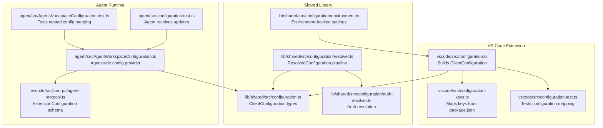
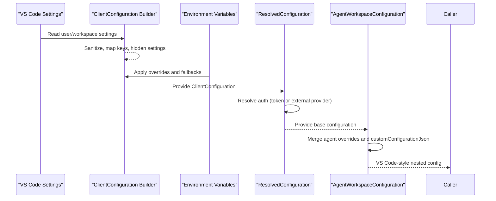
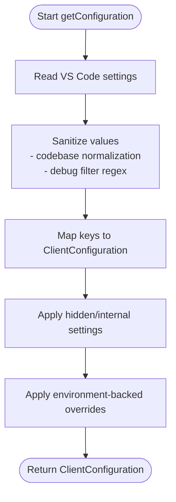
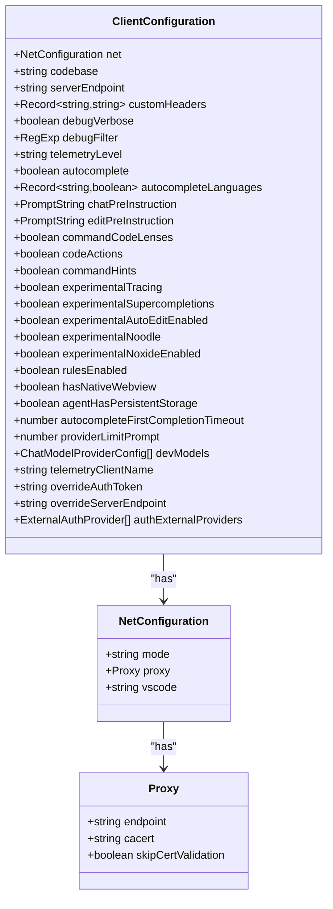
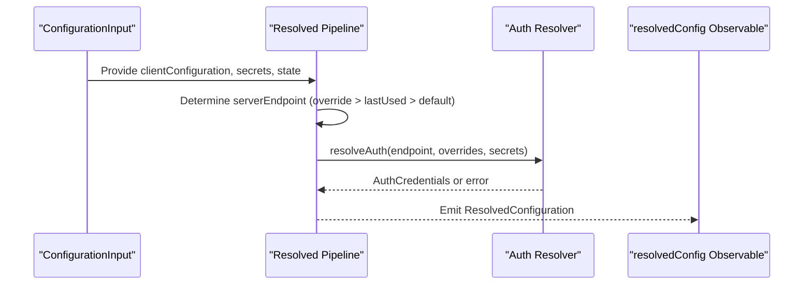
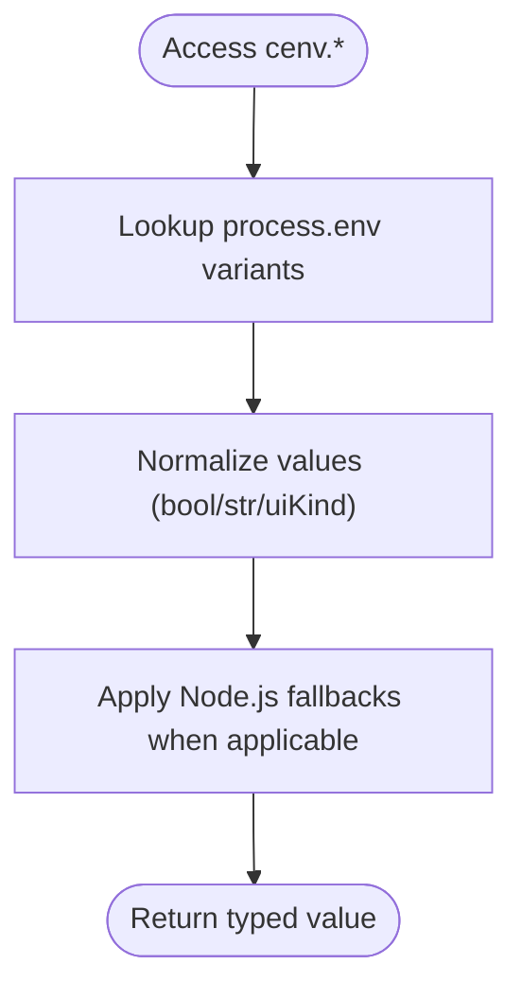
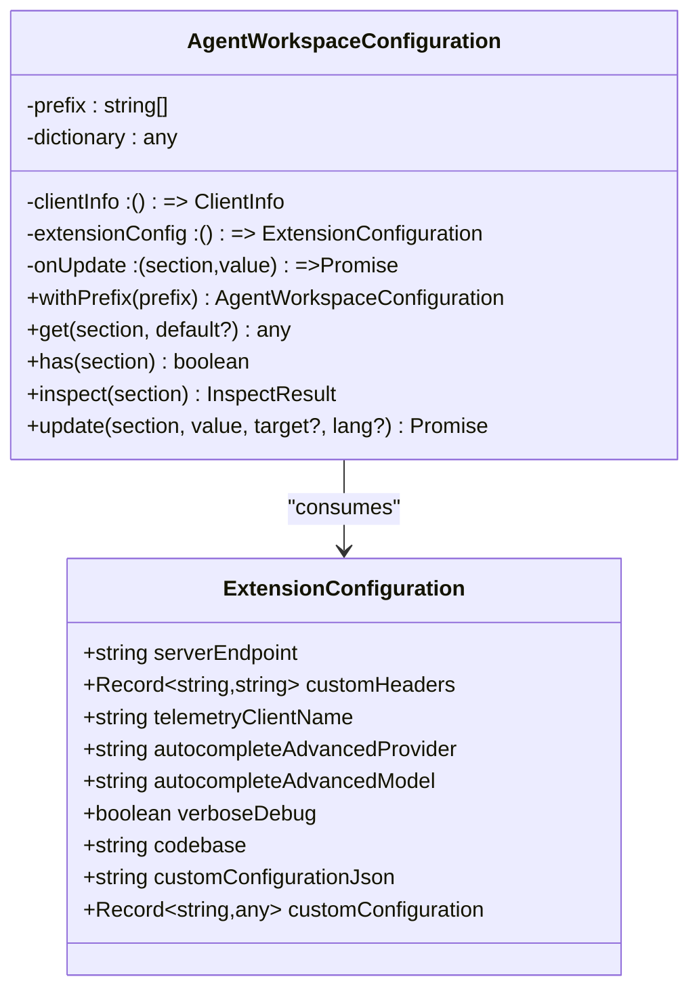
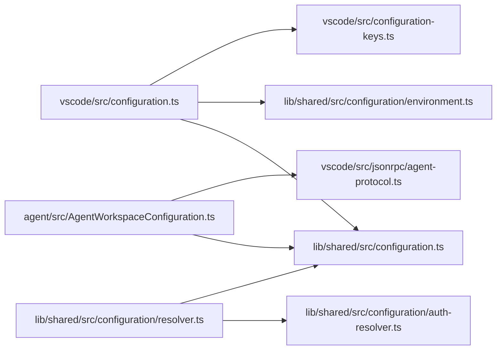

# Configuration System

<cite>
**Referenced Files in This Document**
- [vscode/src/configuration.ts](file://vscode/src/configuration.ts)
- [vscode/src/configuration-keys.ts](file://vscode/src/configuration-keys.ts)
- [vscode/src/configuration.test.ts](file://vscode/src/configuration.test.ts)
- [lib/shared/src/configuration.ts](file://lib/shared/src/configuration.ts)
- [lib/shared/src/configuration/resolver.ts](file://lib/shared/src/configuration/resolver.ts)
- [lib/shared/src/configuration/environment.ts](file://lib/shared/src/configuration/environment.ts)
- [lib/shared/src/configuration/auth-resolver.ts](file://lib/shared/src/configuration/auth-resolver.ts)
- [agent/src/AgentWorkspaceConfiguration.ts](file://agent/src/AgentWorkspaceConfiguration.ts)
- [agent/src/AgentWorkspaceConfiguration.test.ts](file://agent/src/AgentWorkspaceConfiguration.test.ts)
- [agent/src/configuration.test.ts](file://agent/src/configuration.test.ts)
- [vscode/src/jsonrpc/agent-protocol.ts](file://vscode/src/jsonrpc/agent-protocol.ts)
- [vscode/src/main.ts](file://vscode/src/main.ts)
</cite>

## Table of Contents
1. [Introduction](#introduction)
2. [Project Structure](#project-structure)
3. [Core Components](#core-components)
4. [Architecture Overview](#architecture-overview)
5. [Detailed Component Analysis](#detailed-component-analysis)
6. [Dependency Analysis](#dependency-analysis)
7. [Performance Considerations](#performance-considerations)
8. [Troubleshooting Guide](#troubleshooting-guide)
9. [Conclusion](#conclusion)
10. [Appendices](#appendices)

## Introduction
This document explains Cody’s multi-layer configuration system across three primary layers:
- User preferences (VS Code settings)
- Workspace settings (per-folder and multi-root configurations)
- Enterprise policies (agent-provided overrides and runtime configuration)

It covers configuration providers, environment detection, dynamic updates, the configuration API surface, type safety, and the relationship between VS Code settings, agent configuration, and shared utilities. It also documents precedence rules, inheritance patterns, conflict resolution, persistence, cross-platform synchronization, and troubleshooting.

## Project Structure
The configuration system spans the VS Code extension, the shared library, and the Agent runtime:
- VS Code extension reads user/workspace settings and exposes a typed ClientConfiguration.
- Shared library defines the canonical ClientConfiguration types, environment variables, and the resolved configuration pipeline.
- Agent runtime provides an AgentWorkspaceConfiguration shim that merges agent-provided settings with VS Code-style nested configuration.

**Diagram sources**
- [vscode/src/configuration.ts:1-233](file://vscode/src/configuration.ts#L1-L233)
- [vscode/src/configuration-keys.ts:1-55](file://vscode/src/configuration-keys.ts#L1-L55)
- [vscode/src/configuration.test.ts:1-221](file://vscode/src/configuration.test.ts#L1-L221)
- [lib/shared/src/configuration.ts:1-549](file://lib/shared/src/configuration.ts#L1-L549)
- [lib/shared/src/configuration/resolver.ts:1-191](file://lib/shared/src/configuration/resolver.ts#L1-L191)
- [lib/shared/src/configuration/environment.ts:1-204](file://lib/shared/src/configuration/environment.ts#L1-L204)
- [lib/shared/src/configuration/auth-resolver.ts:1-160](file://lib/shared/src/configuration/auth-resolver.ts#L1-L160)
- [agent/src/AgentWorkspaceConfiguration.ts:1-214](file://agent/src/AgentWorkspaceConfiguration.ts#L1-L214)
- [agent/src/AgentWorkspaceConfiguration.test.ts:1-304](file://agent/src/AgentWorkspaceConfiguration.test.ts#L1-L304)
- [agent/src/configuration.test.ts:1-49](file://agent/src/configuration.test.ts#L1-L49)
- [vscode/src/jsonrpc/agent-protocol.ts:614-655](file://vscode/src/jsonrpc/agent-protocol.ts#L614-L655)

**Section sources**
- [vscode/src/configuration.ts:1-233](file://vscode/src/configuration.ts#L1-L233)
- [lib/shared/src/configuration.ts:1-549](file://lib/shared/src/configuration.ts#L1-L549)
- [agent/src/AgentWorkspaceConfiguration.ts:1-214](file://agent/src/AgentWorkspaceConfiguration.ts#L1-L214)

## Core Components
- VS Code configuration builder: Translates VS Code settings into ClientConfiguration with sanitization and hidden/internal settings.
- Shared configuration types: Define the canonical ClientConfiguration shape, enums, and provider IDs.
- Resolved configuration pipeline: Combines ClientConfiguration, secrets, client state, and environment to produce a single ResolvedConfiguration observable.
- Environment detection: Provides environment-backed fallbacks and overrides for network, UI, and testing scenarios.
- Agent configuration provider: Merges agent-provided settings with nested JSON and VS Code-style prefixes to emulate VS Code configuration semantics.
- Authentication resolver: Chooses between token-based and external provider headers, with caching and refresh.

**Section sources**
- [vscode/src/configuration.ts:25-204](file://vscode/src/configuration.ts#L25-L204)
- [lib/shared/src/configuration.ts:115-214](file://lib/shared/src/configuration.ts#L115-L214)
- [lib/shared/src/configuration/resolver.ts:19-106](file://lib/shared/src/configuration/resolver.ts#L19-L106)
- [lib/shared/src/configuration/environment.ts:22-85](file://lib/shared/src/configuration/environment.ts#L22-L85)
- [agent/src/AgentWorkspaceConfiguration.ts:10-160](file://agent/src/AgentWorkspaceConfiguration.ts#L10-L160)
- [lib/shared/src/configuration/auth-resolver.ts:129-160](file://lib/shared/src/configuration/auth-resolver.ts#L129-L160)

## Architecture Overview
The configuration architecture follows a layered approach:
- Layer 1: VS Code settings (user/workspace) feed ClientConfiguration.
- Layer 2: Environment variables and hidden settings refine ClientConfiguration.
- Layer 3: ResolvedConfiguration merges ClientConfiguration with secrets and client state.
- Layer 4: AgentWorkspaceConfiguration merges agent-provided overrides and nested JSON into a VS Code-like configuration object.

**Diagram sources**
- [vscode/src/configuration.ts:25-204](file://vscode/src/configuration.ts#L25-L204)
- [lib/shared/src/configuration/resolver.ts:76-106](file://lib/shared/src/configuration/resolver.ts#L76-L106)
- [lib/shared/src/configuration/environment.ts:22-85](file://lib/shared/src/configuration/environment.ts#L22-L85)
- [agent/src/AgentWorkspaceConfiguration.ts:59-160](file://agent/src/AgentWorkspaceConfiguration.ts#L59-L160)

## Detailed Component Analysis

### VS Code Configuration Builder
- Reads VS Code settings via a ConfigGetter interface.
- Applies sanitization (e.g., codebase normalization, regex parsing).
- Maps configuration keys to a strongly typed ClientConfiguration.
- Supports hidden/internal settings and environment-backed toggles.
- Produces a normalized ClientConfiguration suitable for downstream consumers.

**Diagram sources**
- [vscode/src/configuration.ts:25-204](file://vscode/src/configuration.ts#L25-L204)

**Section sources**
- [vscode/src/configuration.ts:25-204](file://vscode/src/configuration.ts#L25-L204)
- [vscode/src/configuration-keys.ts:7-55](file://vscode/src/configuration-keys.ts#L7-L55)
- [vscode/src/configuration.test.ts:15-221](file://vscode/src/configuration.test.ts#L15-L221)

### Shared Configuration Types and Enums
- Defines ClientConfiguration shape, enums (e.g., CodyAutoSuggestionMode), provider IDs, and nested structures (e.g., OllamaOptions, Fireworks params).
- Ensures type safety across the codebase and agent communication.

**Diagram sources**
- [lib/shared/src/configuration.ts:115-214](file://lib/shared/src/configuration.ts#L115-L214)
- [lib/shared/src/configuration.ts:85-93](file://lib/shared/src/configuration.ts#L85-L93)

**Section sources**
- [lib/shared/src/configuration.ts:115-214](file://lib/shared/src/configuration.ts#L115-L214)

### Resolved Configuration Pipeline
- Accepts ConfigurationInput (ClientConfiguration, ClientSecrets, ClientState, reinstall hooks).
- Computes ResolvedConfiguration by selecting server endpoint (override > last used > default), resolving auth, and returning a stable observable.
- Emits distinct updates and logs errors without terminating the stream.

**Diagram sources**
- [lib/shared/src/configuration/resolver.ts:19-106](file://lib/shared/src/configuration/resolver.ts#L19-L106)
- [lib/shared/src/configuration/auth-resolver.ts:129-160](file://lib/shared/src/configuration/auth-resolver.ts#L129-L160)

**Section sources**
- [lib/shared/src/configuration/resolver.ts:19-106](file://lib/shared/src/configuration/resolver.ts#L19-L106)
- [lib/shared/src/configuration/auth-resolver.ts:129-160](file://lib/shared/src/configuration/auth-resolver.ts#L129-L160)

### Environment Detection and Overrides
- Centralized environment-backed settings via cenv, including proxy, TLS, UI kind, and testing flags.
- Provides fallbacks to Node.js environment variables and supports disabling proxy or forcing endpoints.

**Diagram sources**
- [lib/shared/src/configuration/environment.ts:22-85](file://lib/shared/src/configuration/environment.ts#L22-L85)
- [lib/shared/src/configuration/environment.ts:180-203](file://lib/shared/src/configuration/environment.ts#L180-L203)

**Section sources**
- [lib/shared/src/configuration/environment.ts:22-85](file://lib/shared/src/configuration/environment.ts#L22-L85)
- [lib/shared/src/configuration/environment.ts:180-203](file://lib/shared/src/configuration/environment.ts#L180-L203)

### Agent Workspace Configuration Provider
- Emulates VS Code configuration semantics in the Agent runtime.
- Merges base configuration from client info and extension config with:
  - ExtensionConfiguration.customConfiguration (flat object)
  - ExtensionConfiguration.customConfigurationJson (nested JSON parsed and merged)
  - An in-memory dictionary for dynamic updates
- Supports nested keys, prefix scoping, inspection, and update semantics.

**Diagram sources**
- [agent/src/AgentWorkspaceConfiguration.ts:10-214](file://agent/src/AgentWorkspaceConfiguration.ts#L10-L214)
- [vscode/src/jsonrpc/agent-protocol.ts:620-655](file://vscode/src/jsonrpc/agent-protocol.ts#L620-L655)

**Section sources**
- [agent/src/AgentWorkspaceConfiguration.ts:10-214](file://agent/src/AgentWorkspaceConfiguration.ts#L10-L214)
- [agent/src/AgentWorkspaceConfiguration.test.ts:77-304](file://agent/src/AgentWorkspaceConfiguration.test.ts#L77-L304)
- [vscode/src/jsonrpc/agent-protocol.ts:620-655](file://vscode/src/jsonrpc/agent-protocol.ts#L620-L655)

### Configuration API Surface
- Programmatic access:
  - VS Code: getConfiguration(configGetter) produces ClientConfiguration.
  - Shared: resolvedConfig observable and currentResolvedConfig() for synchronous access.
  - Agent: AgentWorkspaceConfiguration.get/has/inspect/update for nested configuration emulation.
- Validation and type safety:
  - Strongly typed ClientConfiguration and enums ensure compile-time correctness.
  - Tests validate key mappings and default values.
- Dynamic updates:
  - Agent receives ExtensionConfiguration updates and triggers configuration change callbacks.
  - VS Code extension watches http settings and may trigger re-auth flows.

**Section sources**
- [vscode/src/configuration.ts:25-204](file://vscode/src/configuration.ts#L25-L204)
- [lib/shared/src/configuration/resolver.ts:157-173](file://lib/shared/src/configuration/resolver.ts#L157-L173)
- [agent/src/AgentWorkspaceConfiguration.ts:59-214](file://agent/src/AgentWorkspaceConfiguration.ts#L59-L214)
- [agent/src/configuration.test.ts:31-47](file://agent/src/configuration.test.ts#L31-L47)

### Configuration Precedence and Inheritance
- Precedence (highest to lowest):
  - Overrides: override.authToken, override.serverEndpoint
  - Agent-provided: ExtensionConfiguration (merged with nested JSON)
  - VS Code settings: user/workspace
  - Environment variables: cenv-backed settings
  - Defaults: inferred from package.json and shared defaults
- Inheritance patterns:
  - Nested keys are merged deeply; arrays are replaced, objects extended.
  - Prefix scoping allows sub-sections (e.g., withPrefix('cody')).

**Section sources**
- [lib/shared/src/configuration/resolver.ts:87-94](file://lib/shared/src/configuration/resolver.ts#L87-L94)
- [agent/src/AgentWorkspaceConfiguration.ts:114-160](file://agent/src/AgentWorkspaceConfiguration.ts#L114-L160)
- [vscode/src/configuration-keys.ts:7-10](file://vscode/src/configuration-keys.ts#L7-L10)

### Persistence and Cross-Platform Synchronization
- VS Code settings persist per user/workspace and synchronize across platforms via VS Code’s settings storage.
- Agent-side updates are ephemeral unless persisted by the host; AgentWorkspaceConfiguration maintains an in-memory dictionary for runtime changes.
- Environment variables are platform-dependent and should be set consistently across machines for reproducible behavior.

**Section sources**
- [vscode/src/main.ts:134-140](file://vscode/src/main.ts#L134-L140)
- [agent/src/AgentWorkspaceConfiguration.ts:193-212](file://agent/src/AgentWorkspaceConfiguration.ts#L193-L212)

## Dependency Analysis
The configuration system exhibits low coupling and high cohesion:
- VS Code extension depends on shared types and environment utilities.
- Resolved configuration pipeline depends on auth resolver and observable utilities.
- Agent configuration provider depends on shared types and agent protocol schema.

**Diagram sources**
- [vscode/src/configuration.ts:1-233](file://vscode/src/configuration.ts#L1-L233)
- [lib/shared/src/configuration.ts:1-549](file://lib/shared/src/configuration.ts#L1-L549)
- [lib/shared/src/configuration/resolver.ts:1-191](file://lib/shared/src/configuration/resolver.ts#L1-L191)
- [lib/shared/src/configuration/auth-resolver.ts:1-160](file://lib/shared/src/configuration/auth-resolver.ts#L1-L160)
- [agent/src/AgentWorkspaceConfiguration.ts:1-214](file://agent/src/AgentWorkspaceConfiguration.ts#L1-L214)
- [vscode/src/jsonrpc/agent-protocol.ts:614-655](file://vscode/src/jsonrpc/agent-protocol.ts#L614-L655)

**Section sources**
- [vscode/src/configuration.ts:1-233](file://vscode/src/configuration.ts#L1-L233)
- [lib/shared/src/configuration/resolver.ts:1-191](file://lib/shared/src/configuration/resolver.ts#L1-L191)
- [agent/src/AgentWorkspaceConfiguration.ts:1-214](file://agent/src/AgentWorkspaceConfiguration.ts#L1-L214)

## Performance Considerations
- Avoid synchronous configuration access in constructors; use resolvedConfig observable to react to changes.
- Minimize deep merges by limiting nested JSON complexity in customConfigurationJson.
- Prefer targeted updates (AgentWorkspaceConfiguration.update) over replacing large objects.
- Use environment variables judiciously; they bypass VS Code settings and can be harder to audit.

[No sources needed since this section provides general guidance]

## Troubleshooting Guide
Common issues and resolutions:
- Regex parsing errors in debug filter: The builder catches and falls back to a default pattern.
- External auth provider failures: Errors are logged, and a refresh subject is signaled; verify command-line and JSON output format.
- Agent configuration not updating: Ensure onUpdate callback is wired and ExtensionConfiguration updates are sent; verify nested JSON parsing.
- Telemetry mismatch: Check telemetry level and clientName; agent sets telemetry.level to agent by default.

**Section sources**
- [vscode/src/configuration.ts:32-48](file://vscode/src/configuration.ts#L32-L48)
- [lib/shared/src/configuration/auth-resolver.ts:114-127](file://lib/shared/src/configuration/auth-resolver.ts#L114-L127)
- [agent/src/AgentWorkspaceConfiguration.ts:193-212](file://agent/src/AgentWorkspaceConfiguration.ts#L193-L212)

## Conclusion
Cody’s configuration system cleanly separates concerns across layers, enforces type safety, and supports dynamic updates. VS Code settings form the foundation, environment variables provide safe overrides, and the resolved configuration pipeline centralizes auth and state. The Agent runtime extends this with a VS Code-like nested configuration provider, enabling flexible enterprise policy overrides and seamless integration with shared utilities.

[No sources needed since this section summarizes without analyzing specific files]

## Appendices

### Configuration Access Examples
- Accessing configuration values:
  - VS Code: Use getConfiguration(vscode.workspace.getConfiguration()) to obtain ClientConfiguration.
  - Agent: Use AgentWorkspaceConfiguration.get('cody.serverEndpoint') for nested access.
- Setting up configuration watchers:
  - VS Code: Watch http settings to trigger re-auth flows.
  - Agent: Subscribe to resolvedConfig observable and handle updates via onUpdate.
- Implementing custom configuration providers:
  - Extend AgentWorkspaceConfiguration.update to persist changes and call onUpdate.
  - Use customConfigurationJson to merge nested objects following VS Code semantics.

**Section sources**
- [vscode/src/configuration.ts:25-204](file://vscode/src/configuration.ts#L25-L204)
- [agent/src/AgentWorkspaceConfiguration.ts:59-214](file://agent/src/AgentWorkspaceConfiguration.ts#L59-L214)
- [agent/src/AgentWorkspaceConfiguration.test.ts:247-302](file://agent/src/AgentWorkspaceConfiguration.test.ts#L247-L302)