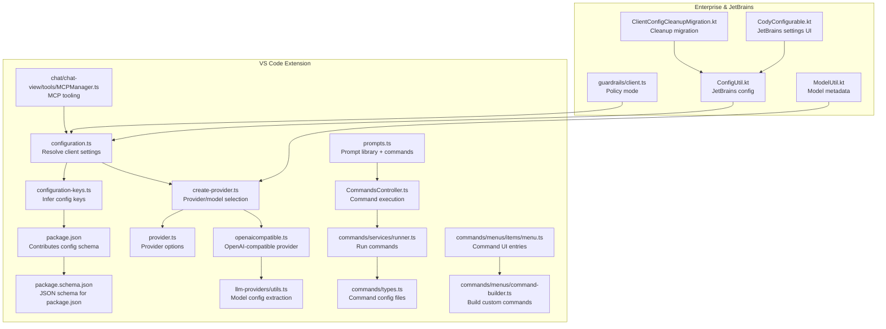
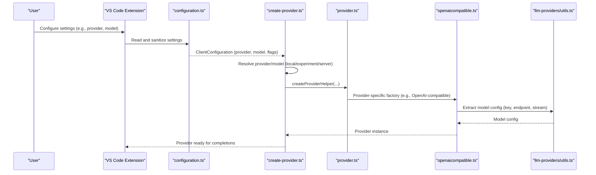
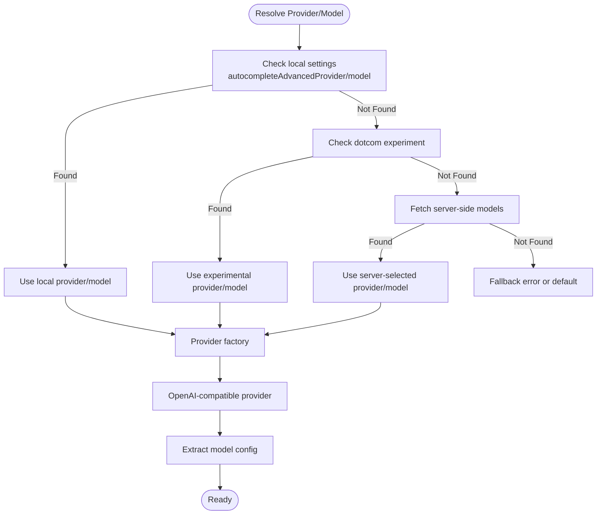
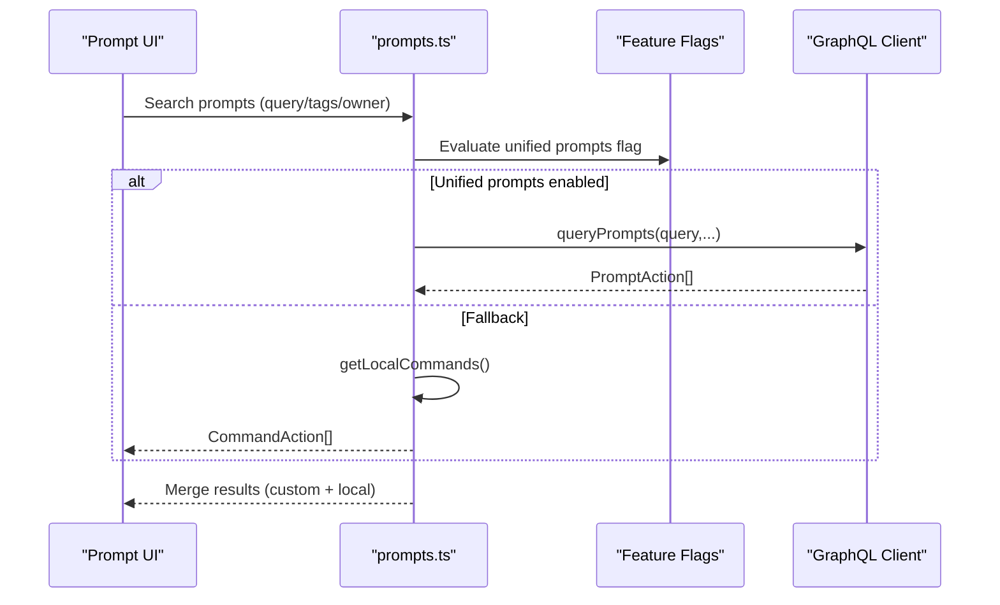
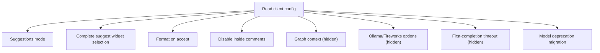
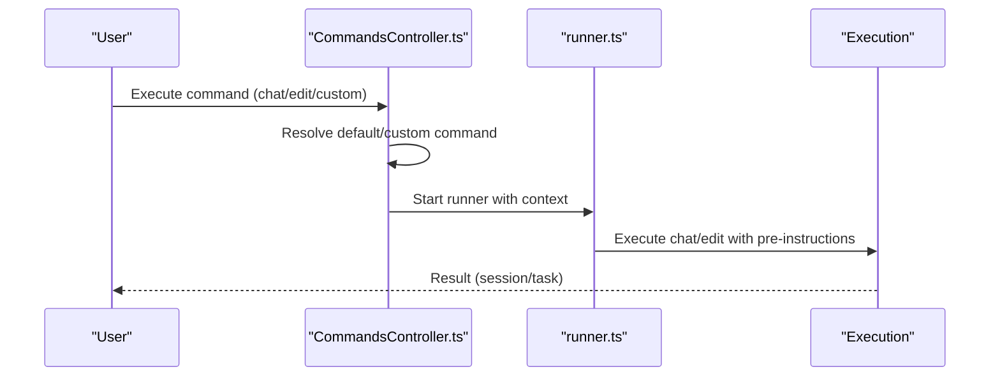
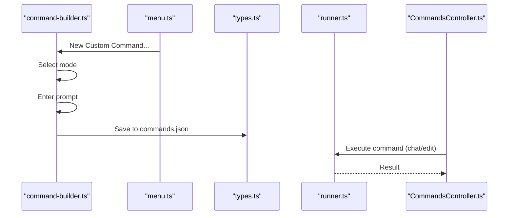
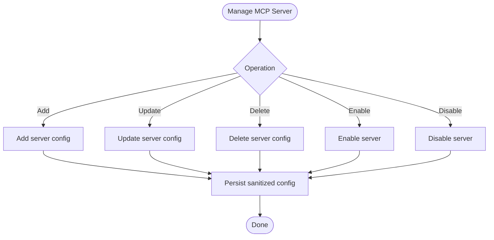
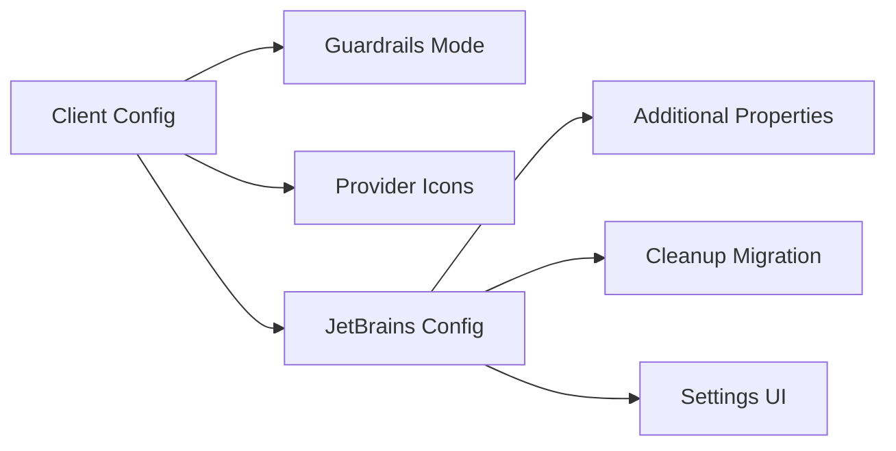
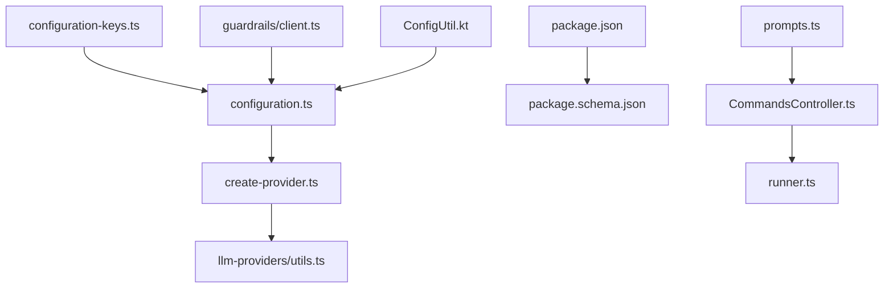

# Customization Options

<cite>
**Referenced Files in This Document**
- [configuration.ts](file://vscode/src/configuration.ts)
- [configuration-keys.ts](file://vscode/src/configuration-keys.ts)
- [package.json](file://vscode/package.json)
- [package.schema.json](file://vscode/package.schema.json)
- [create-provider.ts](file://vscode/src/completions/providers/shared/create-provider.ts)
- [provider.ts](file://vscode/src/completions/providers/shared/provider.ts)
- [openaicompatible.ts](file://vscode/src/completions/providers/openaicompatible.ts)
- [utils.ts](file://lib/shared/src/llm-providers/utils.ts)
- [modelMigrator.ts](file://vscode/src/models/modelMigrator.ts)
- [prompts.ts](file://vscode/src/prompts/prompts.ts)
- [CommandsController.ts](file://vscode/src/commands/CommandsController.ts)
- [types.ts](file://vscode/src/commands/types.ts)
- [runner.ts](file://vscode/src/commands/services/runner.ts)
- [menu.ts](file://vscode/src/commands/menus/items/menu.ts)
- [command-builder.ts](file://vscode/src/commands/menus/command-builder.ts)
- [MCPManager.ts](file://vscode/src/chat/chat-view/tools/MCPManager.ts)
- [AgentWorkspaceConfiguration.ts](file://agent/src/AgentWorkspaceConfiguration.ts)
- [client.ts](file://lib/shared/src/guardrails/client.ts)
- [ModelUtil.kt](file://jetbrains/src/main/kotlin/com/sourcegraph/cody/agent/protocol_extensions/ModelUtil.kt)
- [ConfigUtil.kt](file://jetbrains/src/main/kotlin/com/sourcegraph/config/ConfigUtil.kt)
- [ClientConfigCleanupMigration.kt](file://jetbrains/src/main/kotlin/com/sourcegraph/cody/config/migration/ClientConfigCleanupMigration.kt)
- [CodyConfigurable.kt](file://jetbrains/src/main/kotlin/com/sourcegraph/cody/config/ui/CodyConfigurable.kt)
</cite>

## Table of Contents
1. [Introduction](#introduction)
2. [Project Structure](#project-structure)
3. [Core Components](#core-components)
4. [Architecture Overview](#architecture-overview)
5. [Detailed Component Analysis](#detailed-component-analysis)
6. [Dependency Analysis](#dependency-analysis)
7. [Performance Considerations](#performance-considerations)
8. [Troubleshooting Guide](#troubleshooting-guide)
9. [Conclusion](#conclusion)
10. [Appendices](#appendices)

## Introduction
This document explains how to customize Cody across user types and deployment scenarios. It covers LLM provider configurations, model selection criteria, prompt engineering customization, autocomplete behavior, chat and code editing preferences, custom commands and prompt templates, workflow customization, and enterprise-grade controls such as policy enforcement, branding, and compliance. It also documents configuration APIs, extension points, integration patterns, and practical examples for individuals, teams, and enterprises.

## Project Structure
Cody exposes customization via:
- VS Code extension configuration keys and schema
- Shared client configuration resolution
- Provider creation and model selection logic
- Prompt libraries and custom commands
- Enterprise policy enforcement and MCP tooling
- JetBrains client configuration and UI

**Diagram sources**
- [configuration.ts:25-204](file://vscode/src/configuration.ts#L25-L204)
- [configuration-keys.ts:18-52](file://vscode/src/configuration-keys.ts#L18-L52)
- [package.json:123-105](file://vscode/package.json#L123-L105)
- [package.schema.json:1-105](file://vscode/package.schema.json#L1-L105)
- [create-provider.ts:31-130](file://vscode/src/completions/providers/shared/create-provider.ts#L31-L130)
- [provider.ts:84-132](file://vscode/src/completions/providers/shared/provider.ts#L84-L132)
- [openaicompatible.ts:34-50](file://vscode/src/completions/providers/openaicompatible.ts#L34-L50)
- [utils.ts:4-26](file://lib/shared/src/llm-providers/utils.ts#L4-L26)
- [prompts.ts:93-133](file://vscode/src/prompts/prompts.ts#L93-L133)
- [CommandsController.ts:27-108](file://vscode/src/commands/CommandsController.ts#L27-L108)
- [types.ts:9-25](file://vscode/src/commands/types.ts#L9-L25)
- [runner.ts:118-156](file://vscode/src/commands/services/runner.ts#L118-L156)
- [menu.ts:34-71](file://vscode/src/commands/menus/items/menu.ts#L34-L71)
- [command-builder.ts:79-210](file://vscode/src/commands/menus/command-builder.ts#L79-L210)
- [MCPManager.ts:348-578](file://vscode/src/chat/chat-view/tools/MCPManager.ts#L348-L578)
- [client.ts:43-57](file://lib/shared/src/guardrails/client.ts#L43-L57)
- [ModelUtil.kt:7-24](file://jetbrains/src/main/kotlin/com/sourcegraph/cody/agent/protocol_extensions/ModelUtil.kt#L7-L24)
- [ConfigUtil.kt:174-241](file://jetbrains/src/main/kotlin/com/sourcegraph/config/ConfigUtil.kt#L174-L241)
- [ClientConfigCleanupMigration.kt:15-56](file://jetbrains/src/main/kotlin/com/sourcegraph/cody/config/migration/ClientConfigCleanupMigration.kt#L15-L56)
- [CodyConfigurable.kt:72-109](file://jetbrains/src/main/kotlin/com/sourcegraph/cody/config/ui/CodyConfigurable.kt#L72-L109)

**Section sources**
- [configuration.ts:25-204](file://vscode/src/configuration.ts#L25-L204)
- [configuration-keys.ts:18-52](file://vscode/src/configuration-keys.ts#L18-L52)
- [package.json:123-105](file://vscode/package.json#L123-L105)
- [package.schema.json:1-105](file://vscode/package.schema.json#L1-L105)

## Core Components
- Client configuration resolution: Centralizes all user-facing settings and hidden overrides into a typed client configuration object.
- Provider/model selection: Chooses providers and models from local settings, experiments, or server-side configuration.
- Prompt library and commands: Merges prompt library, built-in commands, and custom commands for unified UX.
- Custom commands: Build, persist, and execute reusable commands with prompt templates and context.
- Enterprise policy enforcement: Guardrails mode selection based on client configuration.
- MCP tooling: Manage server-side tools and policies for chat interactions.
- JetBrains configuration: Provide UI and migration for client-side settings.

**Section sources**
- [configuration.ts:25-204](file://vscode/src/configuration.ts#L25-L204)
- [create-provider.ts:31-130](file://vscode/src/completions/providers/shared/create-provider.ts#L31-L130)
- [prompts.ts:93-133](file://vscode/src/prompts/prompts.ts#L93-L133)
- [CommandsController.ts:27-108](file://vscode/src/commands/CommandsController.ts#L27-L108)
- [client.ts:43-57](file://lib/shared/src/guardrails/client.ts#L43-L57)
- [MCPManager.ts:348-578](file://vscode/src/chat/chat-view/tools/MCPManager.ts#L348-L578)
- [ConfigUtil.kt:174-241](file://jetbrains/src/main/kotlin/com/sourcegraph/config/ConfigUtil.kt#L174-L241)

## Architecture Overview
Cody’s customization architecture centers on resolving configuration, selecting providers/models, and applying policies. The flow below shows how configuration drives autocomplete provider selection and how prompts and commands integrate with chat/edit workflows.

**Diagram sources**
- [configuration.ts:25-204](file://vscode/src/configuration.ts#L25-L204)
- [create-provider.ts:31-130](file://vscode/src/completions/providers/shared/create-provider.ts#L31-L130)
- [provider.ts:84-132](file://vscode/src/completions/providers/shared/provider.ts#L84-L132)
- [openaicompatible.ts:34-50](file://vscode/src/completions/providers/openaicompatible.ts#L34-L50)
- [utils.ts:4-26](file://lib/shared/src/llm-providers/utils.ts#L4-L26)

## Detailed Component Analysis

### LLM Provider Configurations and Model Selection
- Provider selection sources:
  - Local editor settings (user overrides)
  - Feature-flag experiments (dotcom)
  - Server-side model configuration (enterprise)
  - Legacy site configuration fallback
- Provider options include model identifiers, context limits, and source provenance.
- OpenAI-compatible provider supports context size hints and streaming options.
- Model config extraction strips provider prefixes and normalizes endpoint/stream options.

**Diagram sources**
- [create-provider.ts:31-130](file://vscode/src/completions/providers/shared/create-provider.ts#L31-L130)
- [provider.ts:84-132](file://vscode/src/completions/providers/shared/provider.ts#L84-L132)
- [openaicompatible.ts:34-50](file://vscode/src/completions/providers/openaicompatible.ts#L34-L50)
- [utils.ts:4-26](file://lib/shared/src/llm-providers/utils.ts#L4-L26)

**Section sources**
- [create-provider.ts:31-130](file://vscode/src/completions/providers/shared/create-provider.ts#L31-L130)
- [provider.ts:84-132](file://vscode/src/completions/providers/shared/provider.ts#L84-L132)
- [openaicompatible.ts:34-50](file://vscode/src/completions/providers/openaicompatible.ts#L34-L50)
- [utils.ts:4-26](file://lib/shared/src/llm-providers/utils.ts#L4-L26)

### Prompt Engineering Customization
- Prompt library integration: Unified prompts and built-in prompts are fetched and merged with local commands.
- Standard prompts and commands are available for actions like edit, document, explain, tests, and smells.
- Query filtering supports tags, owners, drafts, and recommended sets.

**Diagram sources**
- [prompts.ts:93-133](file://vscode/src/prompts/prompts.ts#L93-L133)
- [prompts.ts:186-215](file://vscode/src/prompts/prompts.ts#L186-L215)

**Section sources**
- [prompts.ts:93-133](file://vscode/src/prompts/prompts.ts#L93-L133)
- [prompts.ts:186-215](file://vscode/src/prompts/prompts.ts#L186-L215)

### Autocomplete Behavior Customization
- Suggestion modes, accept behavior, format-on-accept, and comment suppression are configurable.
- Hidden settings enable graph context, Ollama/Fireworks options, timeouts, and experimental features.
- Model deprecation migration ensures modern models are used when available.

**Diagram sources**
- [configuration.ts:50-191](file://vscode/src/configuration.ts#L50-L191)
- [modelMigrator.ts:32-49](file://vscode/src/models/modelMigrator.ts#L32-L49)

**Section sources**
- [configuration.ts:50-191](file://vscode/src/configuration.ts#L50-L191)
- [modelMigrator.ts:32-49](file://vscode/src/models/modelMigrator.ts#L32-L49)

### Chat Interaction Preferences and Code Editing Preferences
- Chat pre-instruction and edit pre-instruction allow injecting context into conversations and edits.
- Code actions, command hints, and agentic context toggles shape interaction preferences.
- Edit commands are gated by client capabilities; unsupported instances will surface errors.

**Diagram sources**
- [CommandsController.ts:54-99](file://vscode/src/commands/CommandsController.ts#L54-L99)
- [runner.ts:118-156](file://vscode/src/commands/services/runner.ts#L118-L156)

**Section sources**
- [configuration.ts:96-124](file://vscode/src/configuration.ts#L96-L124)
- [CommandsController.ts:54-99](file://vscode/src/commands/CommandsController.ts#L54-L99)
- [runner.ts:118-156](file://vscode/src/commands/services/runner.ts#L118-L156)

### Custom Commands Configuration and Prompt Templates
- Build custom commands via a guided builder with modes, prompts, and context.
- Persist commands in user/workspace JSON files (.vscode/cody.json or .cody/commands.json).
- Execute commands as chat sessions or edit tasks with optional shell context injection.

**Diagram sources**
- [command-builder.ts:79-210](file://vscode/src/commands/menus/command-builder.ts#L79-L210)
- [menu.ts:34-71](file://vscode/src/commands/menus/items/menu.ts#L34-L71)
- [types.ts:9-25](file://vscode/src/commands/types.ts#L9-L25)
- [runner.ts:118-156](file://vscode/src/commands/services/runner.ts#L118-L156)
- [CommandsController.ts:54-99](file://vscode/src/commands/CommandsController.ts#L54-L99)

**Section sources**
- [command-builder.ts:79-210](file://vscode/src/commands/menus/command-builder.ts#L79-L210)
- [menu.ts:34-71](file://vscode/src/commands/menus/items/menu.ts#L34-L71)
- [types.ts:9-25](file://vscode/src/commands/types.ts#L9-L25)
- [runner.ts:118-156](file://vscode/src/commands/services/runner.ts#L118-L156)
- [CommandsController.ts:54-99](file://vscode/src/commands/CommandsController.ts#L54-L99)

### Workflow Customization and MCP Tooling
- MCP server configuration supports adding/updating/deleting servers and enabling/disabling tools.
- Changes are persisted with sanitized fields and guarded against repeated events.

**Diagram sources**
- [MCPManager.ts:348-578](file://vscode/src/chat/chat-view/tools/MCPManager.ts#L348-L578)

**Section sources**
- [MCPManager.ts:348-578](file://vscode/src/chat/chat-view/tools/MCPManager.ts#L348-L578)

### Enterprise Customization Options
- Policy enforcement: Guardrails mode is derived from client configuration (enforced/permissive/off).
- Branding and compliance: Provider icons and model metadata aid identification; deprecation migration ensures modern models.
- JetBrains client: Additional properties are injected into custom configuration; cleanup migration removes temporary values; UI exposes autocomplete and other settings.

**Diagram sources**
- [client.ts:43-57](file://lib/shared/src/guardrails/client.ts#L43-L57)
- [ModelUtil.kt:7-24](file://jetbrains/src/main/kotlin/com/sourcegraph/cody/agent/protocol_extensions/ModelUtil.kt#L7-L24)
- [ConfigUtil.kt:174-241](file://jetbrains/src/main/kotlin/com/sourcegraph/config/ConfigUtil.kt#L174-L241)
- [ClientConfigCleanupMigration.kt:15-56](file://jetbrains/src/main/kotlin/com/sourcegraph/cody/config/migration/ClientConfigCleanupMigration.kt#L15-L56)
- [CodyConfigurable.kt:72-109](file://jetbrains/src/main/kotlin/com/sourcegraph/cody/config/ui/CodyConfigurable.kt#L72-L109)

**Section sources**
- [client.ts:43-57](file://lib/shared/src/guardrails/client.ts#L43-L57)
- [ModelUtil.kt:7-24](file://jetbrains/src/main/kotlin/com/sourcegraph/cody/agent/protocol_extensions/ModelUtil.kt#L7-L24)
- [ConfigUtil.kt:174-241](file://jetbrains/src/main/kotlin/com/sourcegraph/config/ConfigUtil.kt#L174-L241)
- [ClientConfigCleanupMigration.kt:15-56](file://jetbrains/src/main/kotlin/com/sourcegraph/cody/config/migration/ClientConfigCleanupMigration.kt#L15-L56)
- [CodyConfigurable.kt:72-109](file://jetbrains/src/main/kotlin/com/sourcegraph/cody/config/ui/CodyConfigurable.kt#L72-L109)

## Dependency Analysis
- Configuration keys are inferred from the extension manifest, ensuring type-safe access.
- The configuration resolver sanitizes and merges hidden settings, network proxies, and feature flags.
- Provider selection depends on configuration sources and server-side model availability.
- Prompt library and commands depend on feature flags and GraphQL client capabilities.

**Diagram sources**
- [configuration-keys.ts:18-52](file://vscode/src/configuration-keys.ts#L18-L52)
- [configuration.ts:25-204](file://vscode/src/configuration.ts#L25-L204)
- [package.json:123-105](file://vscode/package.json#L123-L105)
- [package.schema.json:1-105](file://vscode/package.schema.json#L1-L105)
- [create-provider.ts:31-130](file://vscode/src/completions/providers/shared/create-provider.ts#L31-L130)
- [utils.ts:4-26](file://lib/shared/src/llm-providers/utils.ts#L4-L26)
- [prompts.ts:93-133](file://vscode/src/prompts/prompts.ts#L93-L133)
- [CommandsController.ts:27-108](file://vscode/src/commands/CommandsController.ts#L27-L108)
- [runner.ts:118-156](file://vscode/src/commands/services/runner.ts#L118-L156)
- [client.ts:43-57](file://lib/shared/src/guardrails/client.ts#L43-L57)
- [ConfigUtil.kt:174-241](file://jetbrains/src/main/kotlin/com/sourcegraph/config/ConfigUtil.kt#L174-L241)

**Section sources**
- [configuration-keys.ts:18-52](file://vscode/src/configuration-keys.ts#L18-L52)
- [configuration.ts:25-204](file://vscode/src/configuration.ts#L25-L204)
- [create-provider.ts:31-130](file://vscode/src/completions/providers/shared/create-provider.ts#L31-L130)
- [prompts.ts:93-133](file://vscode/src/prompts/prompts.ts#L93-L133)
- [CommandsController.ts:27-108](file://vscode/src/commands/CommandsController.ts#L27-L108)

## Performance Considerations
- Tune first-completion timeout for responsiveness.
- Prefer server-side model configuration for consistent defaults and reduced local overrides.
- Limit graph context and experimental features to environments where they are beneficial.
- Use provider streaming options appropriately to balance latency and throughput.

[No sources needed since this section provides general guidance]

## Troubleshooting Guide
- Provider not supported: Ensure the configured provider is valid and supported by local settings.
- Model deprecation: Outdated models are migrated automatically when available; otherwise keep models current.
- MCP server/tool updates: Use MCP manager APIs to add/update/delete servers and toggle tools; ensure sanitized persistence.
- JetBrains configuration: Use cleanup migration to remove temporary values; leverage UI to adjust autocomplete and other settings.

**Section sources**
- [create-provider.ts:56-71](file://vscode/src/completions/providers/shared/create-provider.ts#L56-L71)
- [modelMigrator.ts:32-49](file://vscode/src/models/modelMigrator.ts#L32-L49)
- [MCPManager.ts:348-578](file://vscode/src/chat/chat-view/tools/MCPManager.ts#L348-L578)
- [ClientConfigCleanupMigration.kt:40-56](file://jetbrains/src/main/kotlin/com/sourcegraph/cody/config/migration/ClientConfigCleanupMigration.kt#L40-L56)
- [CodyConfigurable.kt:72-109](file://jetbrains/src/main/kotlin/com/sourcegraph/cody/config/ui/CodyConfigurable.kt#L72-L109)

## Conclusion
Cody’s customization spans configuration resolution, provider/model selection, prompt libraries, commands, and enterprise policy enforcement. By leveraging the documented APIs and extension points—local settings, server-side model configuration, prompt templates, MCP tooling, and JetBrains UI—you can tailor autocomplete, chat, and editing experiences for individuals, teams, and enterprises while maintaining compliance and performance.

[No sources needed since this section summarizes without analyzing specific files]

## Appendices

### Configuration Keys Reference
- Autocomplete behavior: suggestions mode, accept behavior, format-on-accept, disable-inside-comments, graph context, Ollama/Fireworks options, first-completion timeout.
- Chat/edit pre-instructions: inject context into conversations and edits.
- Experimental flags: tracing, supercompletions, auto-edit, minion Anthropic key, native webview, agent flags.
- Network/proxy: mode, endpoint, CA cert, certificate validation.
- Rules and guardrails: enable rules, guardrails timeout.

**Section sources**
- [configuration.ts:50-191](file://vscode/src/configuration.ts#L50-L191)

### Example Scenarios and Patterns
- Individual developer:
  - Switch provider locally and tune autocomplete behavior.
  - Create custom commands for frequent tasks.
- Development team:
  - Enforce guardrails mode via server configuration.
  - Share prompt templates and commands via workspace settings.
- Enterprise organization:
  - Use server-side model configuration for consistent defaults.
  - Manage MCP tools centrally and enforce policy via guardrails.
  - Use JetBrains UI to standardize autocomplete and other settings.

[No sources needed since this section provides general guidance]