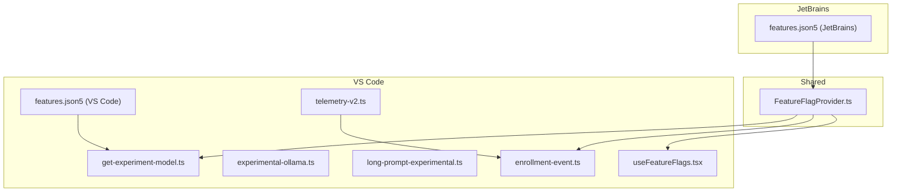
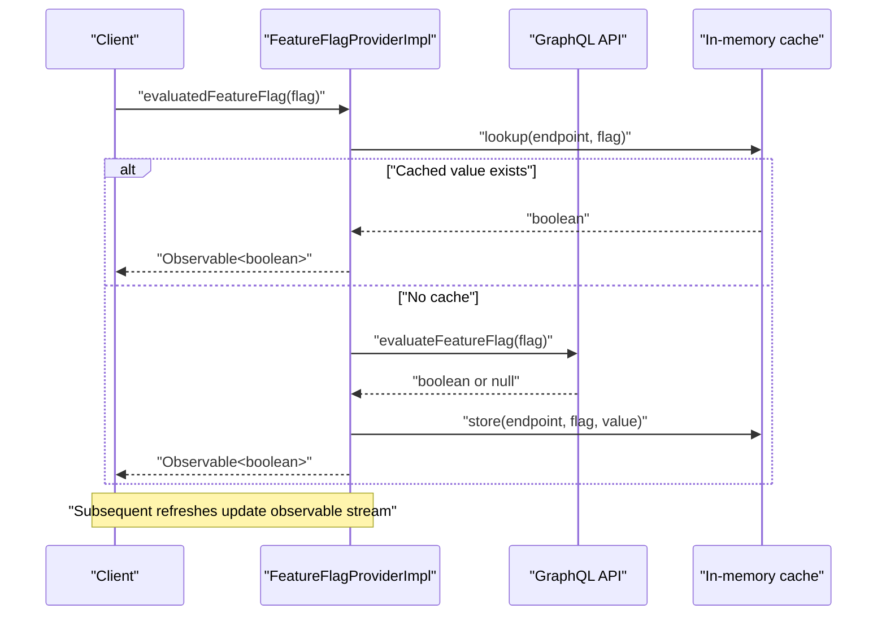
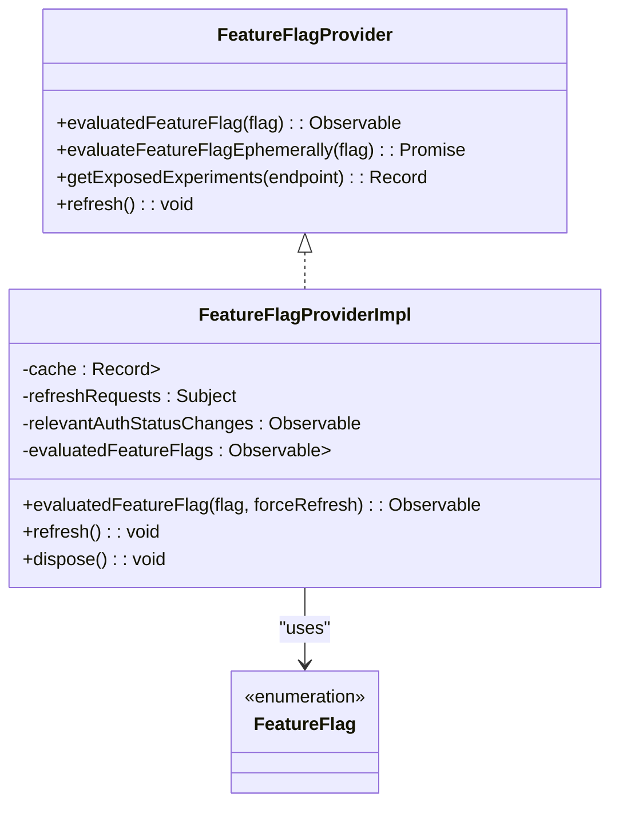
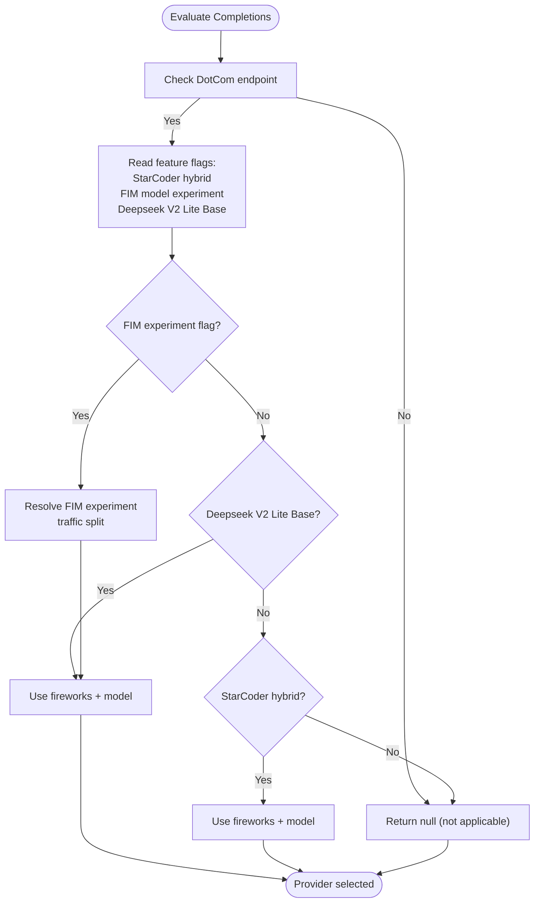
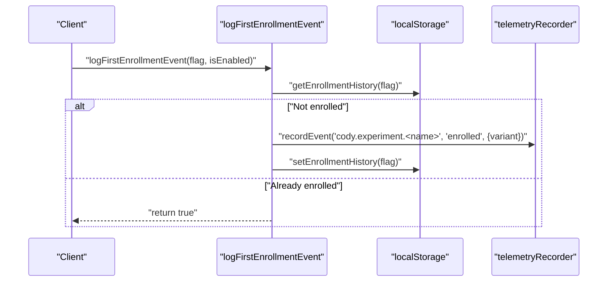
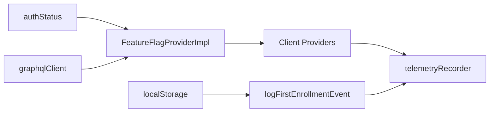

# Feature Flags & Experiments

<cite>
**Referenced Files in This Document**
- [FeatureFlagProvider.ts](file://lib/shared/src/experimentation/FeatureFlagProvider.ts)
- [FeatureFlagProvider.test.ts](file://lib/shared/src/experimentation/FeatureFlagProvider.test.ts)
- [features.json5 (VS Code)](file://vscode/features.json5)
- [features.json5 (JetBrains)](file://jetbrains/features.json5)
- [get-experiment-model.ts](file://vscode/src/completions/providers/shared/get-experiment-model.ts)
- [experimental-ollama.ts](file://vscode/src/completions/providers/experimental-ollama.ts)
- [long-prompt-experimental.ts](file://vscode/src/autoedits/prompt/long-prompt-experimental.ts)
- [useFeatureFlags.tsx](file://vscode/webviews/utils/useFeatureFlags.tsx)
- [telemetry-v2.ts](file://vscode/src/services/telemetry-v2.ts)
- [enrollment-event.ts](file://vscode/src/services/utils/enrollment-event.ts)
</cite>

## Table of Contents
1. [Introduction](#introduction)
2. [Project Structure](#project-structure)
3. [Core Components](#core-components)
4. [Architecture Overview](#architecture-overview)
5. [Detailed Component Analysis](#detailed-component-analysis)
6. [Dependency Analysis](#dependency-analysis)
7. [Performance Considerations](#performance-considerations)
8. [Troubleshooting Guide](#troubleshooting-guide)
9. [Conclusion](#conclusion)
10. [Appendices](#appendices)

## Introduction
This document explains Cody’s feature flag and experimentation system. It covers the A/B testing framework, gradual rollout mechanisms, and experimental feature management. It documents the enrollment algorithms, bucket assignment strategies, and experiment tracking. It also details the feature flag API for programmatic access, conditional feature activation, and dynamic flag updates. Finally, it outlines the experimentation pipeline from feature definition to data collection and analysis, with practical examples for implementing custom experiments, configuring flag variations, and measuring impact.

## Project Structure
Cody’s feature flag and experimentation system spans shared libraries, platform-specific configurations, and client integrations:
- Shared experimentation provider and flag registry
- Editor-specific feature catalogs
- Client-side providers that gate experiments
- Telemetry and enrollment utilities
- Webview and React integration hooks

**Diagram sources**
- [FeatureFlagProvider.ts:207-347](file://lib/shared/src/experimentation/FeatureFlagProvider.ts#L207-L347)
- [get-experiment-model.ts:20-67](file://vscode/src/completions/providers/shared/get-experiment-model.ts#L20-L67)
- [experimental-ollama.ts:58-221](file://vscode/src/completions/providers/experimental-ollama.ts#L58-L221)
- [long-prompt-experimental.ts:21-98](file://vscode/src/autoedits/prompt/long-prompt-experimental.ts#L21-L98)
- [useFeatureFlags.tsx:11-14](file://vscode/webviews/utils/useFeatureFlags.tsx#L11-L14)
- [enrollment-event.ts:14-42](file://vscode/src/services/utils/enrollment-event.ts#L14-L42)
- [telemetry-v2.ts:26-99](file://vscode/src/services/telemetry-v2.ts#L26-L99)
- [features.json5 (VS Code):1-91](file://vscode/features.json5#L1-L91)
- [features.json5 (JetBrains):1-69](file://jetbrains/features.json5#L1-L69)

**Section sources**
- [FeatureFlagProvider.ts:207-347](file://lib/shared/src/experimentation/FeatureFlagProvider.ts#L207-L347)
- [features.json5 (VS Code):1-91](file://vscode/features.json5#L1-L91)
- [features.json5 (JetBrains):1-69](file://jetbrains/features.json5#L1-L69)

## Core Components
- FeatureFlagProvider: Centralized provider for evaluating and watching feature flags, with caching, refresh scheduling, and error handling.
- Feature flags: Strongly typed enumerations of flags used across the product.
- Experiment providers: Client-side logic that reads flags to conditionally enable experiments (e.g., model selection, UI toggles).
- Feature catalogs: JSON definitions of features per editor, including statuses and tags.
- Telemetry and enrollment: Utilities to log first-time enrollment and record telemetry events.

**Section sources**
- [FeatureFlagProvider.ts:22-178](file://lib/shared/src/experimentation/FeatureFlagProvider.ts#L22-L178)
- [FeatureFlagProvider.ts:207-347](file://lib/shared/src/experimentation/FeatureFlagProvider.ts#L207-L347)
- [get-experiment-model.ts:15-67](file://vscode/src/completions/providers/shared/get-experiment-model.ts#L15-L67)
- [features.json5 (VS Code):1-91](file://vscode/features.json5#L1-L91)
- [features.json5 (JetBrains):1-69](file://jetbrains/features.json5#L1-L69)
- [enrollment-event.ts:14-42](file://vscode/src/services/utils/enrollment-event.ts#L14-L42)

## Architecture Overview
The system integrates a shared provider with client-side consumers:
- The provider fetches evaluated flags from the backend and caches them per endpoint.
- Consumers subscribe to flag observables to react to changes without restarts.
- Experiments are gated by feature flags and can be rolled out gradually via flag traffic allocation.
- Telemetry records enrollment and usage events for analysis.

**Diagram sources**
- [FeatureFlagProvider.ts:288-335](file://lib/shared/src/experimentation/FeatureFlagProvider.ts#L288-L335)
- [FeatureFlagProvider.ts:241-264](file://lib/shared/src/experimentation/FeatureFlagProvider.ts#L241-L264)

## Detailed Component Analysis

### FeatureFlagProvider
The provider manages:
- Typed feature flags enumeration
- Observable evaluation of flags with caching and refresh
- Endpoint-aware caching and exposure reporting
- Graceful fallback and error logging

Key behaviors:
- Watches authentication status and endpoint changes to re-evaluate flags.
- Periodically refreshes exposed flags and merges with cached values.
- Emits flag values as observables and supports ephemeral reads for compatibility.

**Diagram sources**
- [FeatureFlagProvider.ts:182-205](file://lib/shared/src/experimentation/FeatureFlagProvider.ts#L182-L205)
- [FeatureFlagProvider.ts:207-347](file://lib/shared/src/experimentation/FeatureFlagProvider.ts#L207-L347)
- [FeatureFlagProvider.ts:22-178](file://lib/shared/src/experimentation/FeatureFlagProvider.ts#L22-L178)

**Section sources**
- [FeatureFlagProvider.ts:207-347](file://lib/shared/src/experimentation/FeatureFlagProvider.ts#L207-L347)
- [FeatureFlagProvider.test.ts:41-87](file://lib/shared/src/experimentation/FeatureFlagProvider.test.ts#L41-L87)

### Feature Catalogs (features.json5)
Feature catalogs define product features per editor with status and tags. These catalogs inform product and marketing about feature availability and lifecycle stage.

- VS Code catalog includes features like NotebookChatUI, Mixtral8x22BPreview, and ContextTokenCounter.
- JetBrains catalog mirrors feature names with status per editor.

These catalogs are separate from the flag evaluation logic but guide product decisions and visibility.

**Section sources**
- [features.json5 (VS Code):1-91](file://vscode/features.json5#L1-L91)
- [features.json5 (JetBrains):1-69](file://jetbrains/features.json5#L1-L69)

### Experiment Providers
Clients gate experiments behind feature flags:
- Model experiment selection: Reads flags to choose providers/models for completions.
- Auto-edit prompt strategies: Uses flag-driven strategies for prompt construction.
- Local-only providers: Experimental providers (e.g., Ollama) demonstrate how experiments can be isolated.

**Diagram sources**
- [get-experiment-model.ts:20-67](file://vscode/src/completions/providers/shared/get-experiment-model.ts#L20-L67)
- [get-experiment-model.ts:73-88](file://vscode/src/completions/providers/shared/get-experiment-model.ts#L73-L88)

**Section sources**
- [get-experiment-model.ts:20-67](file://vscode/src/completions/providers/shared/get-experiment-model.ts#L20-L67)
- [experimental-ollama.ts:58-221](file://vscode/src/completions/providers/experimental-ollama.ts#L58-L221)
- [long-prompt-experimental.ts:21-98](file://vscode/src/autoedits/prompt/long-prompt-experimental.ts#L21-L98)

### Telemetry and Enrollment
- Enrollment events: Logged once per user lifetime per experiment to avoid duplication.
- Event naming: Mapped from feature flag keys to event names for consistent analytics.
- Telemetry recorder: Configured globally and supports dev/test modes and whitelisted events.

**Diagram sources**
- [enrollment-event.ts:14-42](file://vscode/src/services/utils/enrollment-event.ts#L14-L42)
- [telemetry-v2.ts:26-99](file://vscode/src/services/telemetry-v2.ts#L26-L99)

**Section sources**
- [enrollment-event.ts:14-42](file://vscode/src/services/utils/enrollment-event.ts#L14-L42)
- [telemetry-v2.ts:26-99](file://vscode/src/services/telemetry-v2.ts#L26-L99)

### Webview Integration
React hooks integrate feature flags into webviews:
- A simple hook exposes the evaluated flag observable to React components.
- Consumers should treat undefined as false until the value is known.

**Section sources**
- [useFeatureFlags.tsx:11-14](file://vscode/webviews/utils/useFeatureFlags.tsx#L11-L14)

## Dependency Analysis
The experimentation system exhibits clear separation of concerns:
- Shared provider depends on authentication status, GraphQL client, and observables.
- Client providers depend on the shared provider and configuration.
- Telemetry utilities depend on the shared telemetry recorder and local storage.

**Diagram sources**
- [FeatureFlagProvider.ts:223-264](file://lib/shared/src/experimentation/FeatureFlagProvider.ts#L223-L264)
- [get-experiment-model.ts:30-66](file://vscode/src/completions/providers/shared/get-experiment-model.ts#L30-L66)
- [enrollment-event.ts:14-26](file://vscode/src/services/utils/enrollment-event.ts#L14-L26)

**Section sources**
- [FeatureFlagProvider.ts:223-264](file://lib/shared/src/experimentation/FeatureFlagProvider.ts#L223-L264)
- [get-experiment-model.ts:30-66](file://vscode/src/completions/providers/shared/get-experiment-model.ts#L30-L66)
- [enrollment-event.ts:14-26](file://vscode/src/services/utils/enrollment-event.ts#L14-L26)

## Performance Considerations
- Caching: Per-endpoint caching avoids redundant network calls and accelerates initial evaluations.
- Debounce and replay: Observables debounce refreshes and share last emitted values to minimize churn.
- Refresh cadence: Hourly refresh ensures freshness without constant polling.
- Conditional gating: Experiments are gated by endpoint and configuration to limit unnecessary computation.

[No sources needed since this section provides general guidance]

## Troubleshooting Guide
Common issues and resolutions:
- Flags not updating: Trigger a manual refresh and verify authentication status changes propagate.
- Stale values: Ensure consumers subscribe to the observable rather than relying on ephemeral reads.
- API errors: The provider logs errors and falls back to safe defaults; check logs for failures.
- Enrollment duplicates: Verify local storage history and event mapping.

**Section sources**
- [FeatureFlagProvider.ts:246-253](file://lib/shared/src/experimentation/FeatureFlagProvider.ts#L246-L253)
- [FeatureFlagProvider.test.ts:80-87](file://lib/shared/src/experimentation/FeatureFlagProvider.test.ts#L80-L87)
- [enrollment-event.ts:14-26](file://vscode/src/services/utils/enrollment-event.ts#L14-L26)

## Conclusion
Cody’s feature flag and experimentation system provides a robust, observable foundation for gradual rollouts and controlled experiments. The shared provider centralizes evaluation and caching, while client providers gate experiments with clear logic. Feature catalogs and telemetry ensure product visibility and insight. Together, these components enable safe, scalable experimentation aligned with user segmentation and performance goals.

[No sources needed since this section summarizes without analyzing specific files]

## Appendices

### Implementing a Custom Experiment
Steps to add a new experiment:
1. Define a new feature flag in the shared provider enumeration.
2. Gate client logic on the flag using the observable API.
3. Configure rollout via backend flag traffic allocation.
4. Log enrollment once per user and record relevant events.
5. Monitor impact via telemetry and adjust rollout as needed.

**Section sources**
- [FeatureFlagProvider.ts:22-178](file://lib/shared/src/experimentation/FeatureFlagProvider.ts#L22-L178)
- [get-experiment-model.ts:30-66](file://vscode/src/completions/providers/shared/get-experiment-model.ts#L30-L66)
- [enrollment-event.ts:14-42](file://vscode/src/services/utils/enrollment-event.ts#L14-L42)

### Best Practices
- Prefer observables for dynamic updates; avoid ephemeral reads except for legacy compatibility.
- Keep experiments scoped and temporary; remove flags after analysis.
- Use enrollment events to avoid double-counting users.
- Segment by endpoint and configuration to isolate environments.
- Document feature catalogs and statuses for transparency.

[No sources needed since this section provides general guidance]