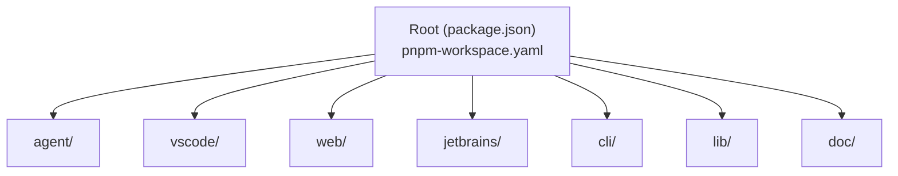
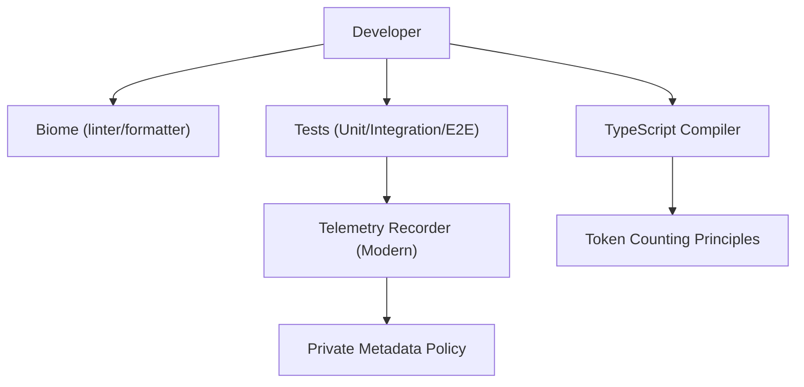
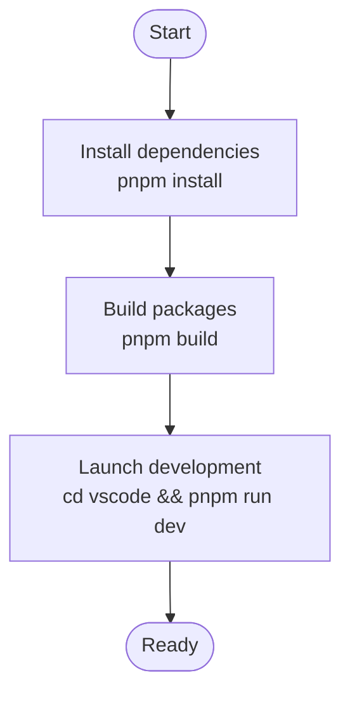
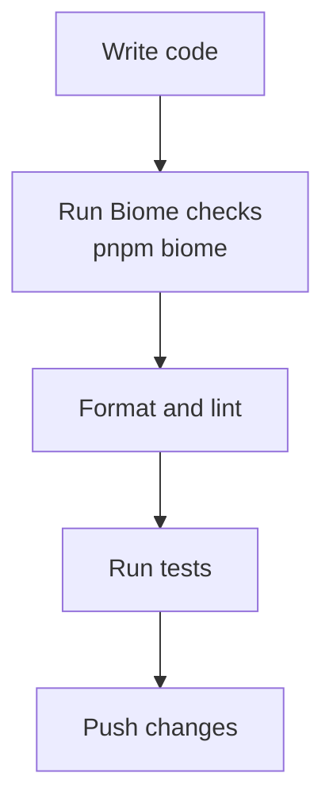
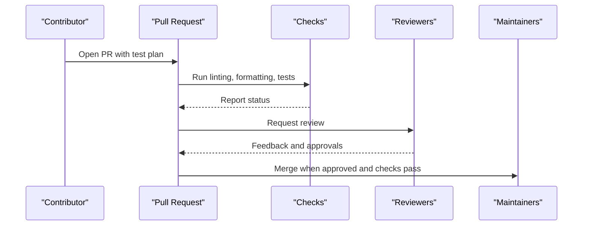
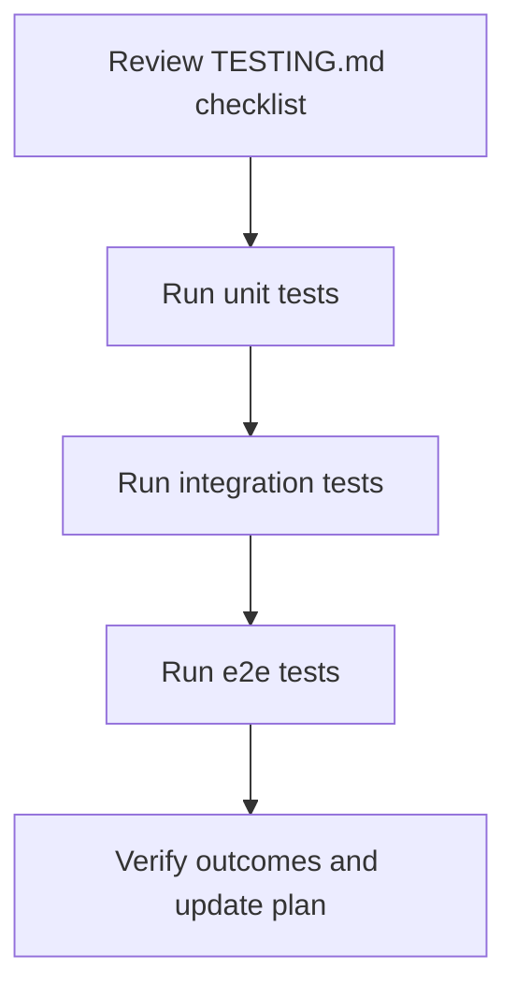
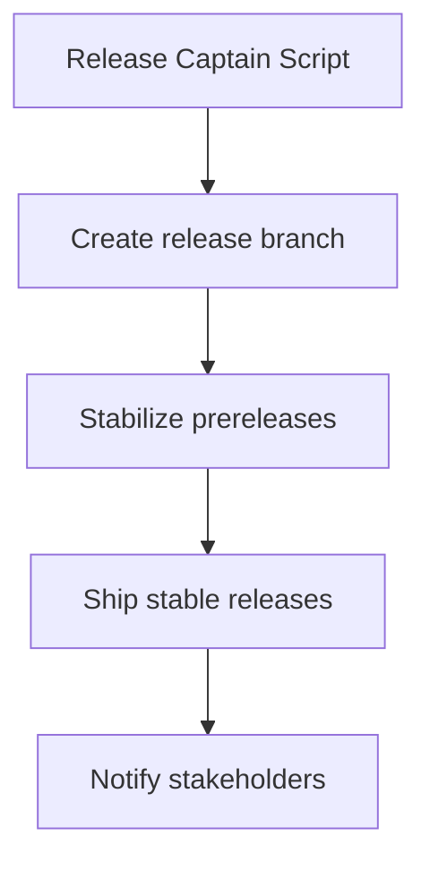
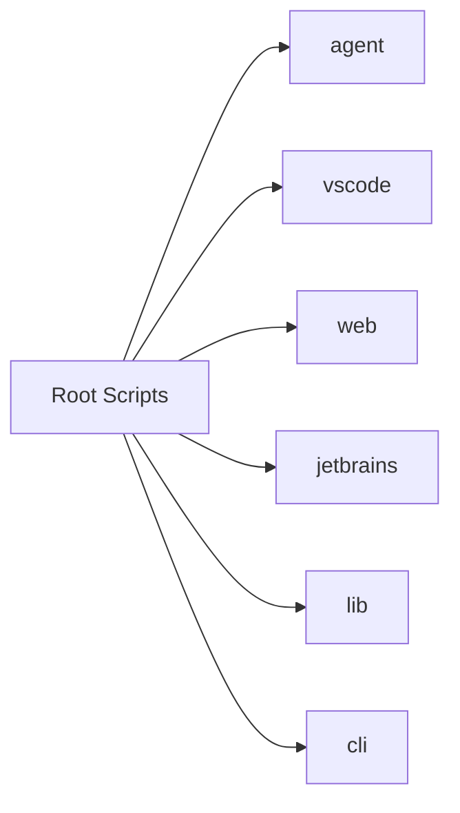

# Contributing Guidelines

<cite>
**Referenced Files in This Document**
- [README.md](file://README.md)
- [ARCHITECTURE.md](file://ARCHITECTURE.md)
- [TESTING.md](file://TESTING.md)
- [.github/PULL_REQUEST_TEMPLATE.md](file://.github/PULL_REQUEST_TEMPLATE.md)
- [biome.jsonc](file://biome.jsonc)
- [.editorconfig](file://.editorconfig)
- [doc/dev/index.md](file://doc/dev/index.md)
- [package.json](file://package.json)
- [pnpm-workspace.yaml](file://pnpm-workspace.yaml)
- [release/README.md](file://release/README.md)
- [jetbrains/CONTRIBUTING.md](file://jetbrains/CONTRIBUTING.md)
- [vscode/CONTRIBUTING.md](file://vscode/CONTRIBUTING.md)
- [web/CONTRIBUTING.md](file://web/CONTRIBUTING.md)
</cite>

## Table of Contents
1. [Introduction](#introduction)
2. [Project Structure](#project-structure)
3. [Core Components](#core-components)
4. [Architecture Overview](#architecture-overview)
5. [Detailed Component Analysis](#detailed-component-analysis)
6. [Dependency Analysis](#dependency-analysis)
7. [Performance Considerations](#performance-considerations)
8. [Troubleshooting Guide](#troubleshooting-guide)
9. [Conclusion](#conclusion)
10. [Appendices](#appendices)

## Introduction
This document provides comprehensive contributing guidelines for the Cody open-source project. It covers development setup, environment configuration, code style and commit conventions, pull request process, testing requirements, release procedures, governance, and licensing/IP considerations. The guidance consolidates information from module-specific contributing docs, architecture principles, and repository tooling.

## Project Structure
Cody is a multi-package monorepo managed with pnpm workspaces. The primary packages include:
- agent: The Cody Agent (TypeScript) and related tooling
- vscode: VS Code extension
- web: Web UI package
- jetbrains: JetBrains plugin
- cli: Command-line utilities
- lib: Shared libraries used across packages
- doc: Developer documentation

**Diagram sources**
- [pnpm-workspace.yaml:1-8](file://pnpm-workspace.yaml#L1-L8)
- [package.json:1-99](file://package.json#L1-L99)

**Section sources**
- [pnpm-workspace.yaml:1-8](file://pnpm-workspace.yaml#L1-L8)
- [package.json:1-99](file://package.json#L1-L99)

## Core Components
- Development environment setup and toolchain
  - Node.js and pnpm versions are enforced; asdf is recommended for toolchain management.
  - Build and watch scripts are provided at the root and per-package level.
- Code quality and style
  - Biome linter/formatter enforces style and correctness rules.
  - EditorConfig defines universal formatting rules.
- Testing
  - Unit, integration, and end-to-end tests are supported across packages.
  - A comprehensive manual testing checklist is maintained for key features.
- Release automation
  - A release captain CLI automates release workflows across VS Code, JetBrains, and Agent.

**Section sources**
- [doc/dev/index.md:1-35](file://doc/dev/index.md#L1-L35)
- [package.json:18-38](file://package.json#L18-L38)
- [biome.jsonc:1-149](file://biome.jsonc#L1-L149)
- [.editorconfig:1-24](file://.editorconfig#L1-L24)
- [TESTING.md:1-317](file://TESTING.md#L1-L317)
- [release/README.md:1-107](file://release/README.md#L1-L107)

## Architecture Overview
Cody’s architecture emphasizes strong type safety, telemetry hygiene, and token accounting. Contributors should follow these principles when making changes:
- Prefer explicit types and avoid unsafe type assertions.
- Record telemetry using the modern telemetry framework and protect sensitive data.
- Account for tokens accurately and apply limits after model selection.

**Diagram sources**
- [ARCHITECTURE.md:16-165](file://ARCHITECTURE.md#L16-L165)
- [biome.jsonc:1-149](file://biome.jsonc#L1-L149)

**Section sources**
- [ARCHITECTURE.md:16-165](file://ARCHITECTURE.md#L16-L165)

## Detailed Component Analysis

### Development Setup and Environment Configuration
- Toolchain
  - Node.js version and pnpm version are specified at the root.
  - asdf is recommended for reproducible toolchains.
- Build and watch
  - Root scripts orchestrate builds across packages.
  - Per-package scripts provide targeted development tasks.
- Quick-start
  - The repository README outlines a quickstart to run the VS Code extension locally.

**Diagram sources**
- [package.json:18-38](file://package.json#L18-L38)
- [doc/dev/index.md:3-13](file://doc/dev/index.md#L3-L13)
- [README.md:60-67](file://README.md#L60-L67)

**Section sources**
- [package.json:11-14](file://package.json#L11-L14)
- [doc/dev/index.md:3-13](file://doc/dev/index.md#L3-L13)
- [README.md:60-67](file://README.md#L60-L67)

### Code Style Guidelines and Commit Conventions
- Formatting and linting
  - Biome organizes imports, enforces linter rules, and formats code.
  - EditorConfig ensures consistent line endings, indentation, and whitespace.
- TypeScript conventions
  - Avoid unsafe type assertions; prefer type narrowing and satisfies.
  - Use modern TypeScript features and avoid deprecated telemetry APIs.
- Commit conventions
  - No explicit commit convention is defined in the repository. Contributors should follow a conventional commit style when applicable and keep commits focused and descriptive.

**Diagram sources**
- [biome.jsonc:1-149](file://biome.jsonc#L1-L149)
- [.editorconfig:1-24](file://.editorconfig#L1-L24)

**Section sources**
- [biome.jsonc:1-149](file://biome.jsonc#L1-L149)
- [.editorconfig:1-24](file://.editorconfig#L1-L24)
- [ARCHITECTURE.md:29-41](file://ARCHITECTURE.md#L29-L41)

### Pull Request Process
- Test plan requirement
  - Pull Requests must include a test plan referencing the testing principles.
- Review criteria
  - Follow architecture principles (type safety, telemetry, token accounting).
  - Ensure code style compliance via Biome and EditorConfig.
  - Validate tests pass across relevant packages.
- Merge procedures
  - Maintainers review and approve PRs.
  - Automated checks (tests, linting) must pass before merging.

**Diagram sources**
- [.github/PULL_REQUEST_TEMPLATE.md:1-5](file://.github/PULL_REQUEST_TEMPLATE.md#L1-L5)
- [biome.jsonc:1-149](file://biome.jsonc#L1-L149)
- [TESTING.md:1-317](file://TESTING.md#L1-L317)

**Section sources**
- [.github/PULL_REQUEST_TEMPLATE.md:1-5](file://.github/PULL_REQUEST_TEMPLATE.md#L1-L5)
- [biome.jsonc:1-149](file://biome.jsonc#L1-L149)
- [TESTING.md:1-317](file://TESTING.md#L1-L317)

### Testing Requirements
- Coverage
  - Manual testing checklist covers commands, chat, autocomplete, and telemetry.
  - Unit, integration, and end-to-end tests are available per package.
- Execution
  - Use root scripts to run tests across packages.
  - VS Code contributing guide provides specific test commands and debugging tips.

**Diagram sources**
- [TESTING.md:1-317](file://TESTING.md#L1-L317)
- [vscode/CONTRIBUTING.md:38-43](file://vscode/CONTRIBUTING.md#L38-L43)

**Section sources**
- [TESTING.md:1-317](file://TESTING.md#L1-L317)
- [vscode/CONTRIBUTING.md:38-43](file://vscode/CONTRIBUTING.md#L38-L43)

### Release Process, Versioning, and Backward Compatibility
- Release automation
  - The release captain CLI automates branching, stabilization, and shipping across VS Code, JetBrains, and Agent.
- Versioning
  - JetBrains plugin uses a major.minor versioning scheme (e.g., v7.x.y).
  - Publishing to NPM for the web package is manual and requires appropriate credentials.
- Backward compatibility
  - Maintain compatibility across the Agent, VS Code, and JetBrains clients.
  - Use backport labels for release branches to manage fixes.

**Diagram sources**
- [release/README.md:1-107](file://release/README.md#L1-L107)
- [jetbrains/CONTRIBUTING.md:168-210](file://jetbrains/CONTRIBUTING.md#L168-L210)
- [web/CONTRIBUTING.md:48-68](file://web/CONTRIBUTING.md#L48-L68)

**Section sources**
- [release/README.md:1-107](file://release/README.md#L1-L107)
- [jetbrains/CONTRIBUTING.md:168-210](file://jetbrains/CONTRIBUTING.md#L168-L210)
- [web/CONTRIBUTING.md:48-68](file://web/CONTRIBUTING.md#L48-L68)

### Project Governance, Maintainer Responsibilities, and Community Guidelines
- Decision-making
  - Maintainers review and approve PRs; automated checks must pass.
- Community channels
  - Use the issue tracker for bugs and feature requests.
  - Engage on Discord and the community forum for discussions.
- Licensing
  - The repository is licensed under Apache 2.0.

**Section sources**
- [README.md:60-76](file://README.md#L60-L76)
- [package.json](file://package.json#L5)

### Examples of Good Contributions and Common Pitfalls
- Good contributions
  - Focus on a single concern per PR.
  - Include a test plan and ensure tests pass.
  - Follow architecture principles (type safety, telemetry hygiene).
- Common pitfalls
  - Overuse of unsafe type assertions.
  - Deprecated telemetry APIs.
  - Ignoring formatting/linting rules.

**Section sources**
- [ARCHITECTURE.md:29-41](file://ARCHITECTURE.md#L29-L41)
- [biome.jsonc:10-24](file://biome.jsonc#L10-L24)

### Guidance for Different Types of Contributions
- Bug fixes
  - Reproduce with the manual testing checklist, add or update tests, and include a test plan.
- Feature additions
  - Align with architecture principles, add telemetry following the modern framework, and document behavior.
- Documentation improvements
  - Keep documentation consistent with EditorConfig and Biome formatting.

**Section sources**
- [TESTING.md:1-317](file://TESTING.md#L1-L317)
- [ARCHITECTURE.md:55-122](file://ARCHITECTURE.md#L55-L122)
- [.editorconfig:1-24](file://.editorconfig#L1-L24)
- [biome.jsonc:52-64](file://biome.jsonc#L52-L64)

## Dependency Analysis
Cody uses a monorepo layout with interdependent packages. The root orchestrates builds and tests across agent, vscode, web, jetbrains, and lib.

**Diagram sources**
- [pnpm-workspace.yaml:1-8](file://pnpm-workspace.yaml#L1-L8)
- [package.json:18-38](file://package.json#L18-L38)

**Section sources**
- [pnpm-workspace.yaml:1-8](file://pnpm-workspace.yaml#L1-L8)
- [package.json:18-38](file://package.json#L18-L38)

## Performance Considerations
- Token counting
  - Apply limits after model selection and prefer accurate counting strategies.
- Telemetry
  - Use numeric metadata and avoid sensitive data in public metadata.
- Build and watch
  - Use per-package watch/build scripts to speed up development iteration.

**Section sources**
- [ARCHITECTURE.md:123-165](file://ARCHITECTURE.md#L123-L165)
- [doc/dev/index.md:21-35](file://doc/dev/index.md#L21-L35)

## Troubleshooting Guide
- Formatting and linting
  - Run Biome to apply fixes and address warnings.
- Editor configuration
  - Ensure EditorConfig settings are respected by your editor.
- Module-specific tips
  - VS Code: enable verbose debug logging and use the autocomplete trace view.
  - JetBrains: use run configurations for dual-side debugging (TypeScript and Java/Kotlin).
  - Web: build and link locally to Sourcegraph client for integration testing.

**Section sources**
- [biome.jsonc:25-50](file://biome.jsonc#L25-L50)
- [.editorconfig:1-24](file://.editorconfig#L1-L24)
- [vscode/CONTRIBUTING.md:24-37](file://vscode/CONTRIBUTING.md#L24-L37)
- [jetbrains/CONTRIBUTING.md:228-450](file://jetbrains/CONTRIBUTING.md#L228-L450)
- [web/CONTRIBUTING.md:31-68](file://web/CONTRIBUTING.md#L31-L68)

## Conclusion
By following these guidelines—development setup, code style, testing, PR process, release automation, and governance—contributors can efficiently collaborate on Cody while maintaining high quality and consistency across clients and packages.

## Appendices

### Appendix A: Quick Links and References
- Development quickstart: [README.md:60-67](file://README.md#L60-L67)
- VS Code contributing guide: [vscode/CONTRIBUTING.md:1-123](file://vscode/CONTRIBUTING.md#L1-L123)
- JetBrains contributing guide: [jetbrains/CONTRIBUTING.md:1-450](file://jetbrains/CONTRIBUTING.md#L1-L450)
- Web contributing guide: [web/CONTRIBUTING.md:1-68](file://web/CONTRIBUTING.md#L1-L68)
- Architecture and style: [ARCHITECTURE.md:1-165](file://ARCHITECTURE.md#L1-L165)
- Testing checklist: [TESTING.md:1-317](file://TESTING.md#L1-L317)
- Release captain CLI: [release/README.md:1-107](file://release/README.md#L1-L107)