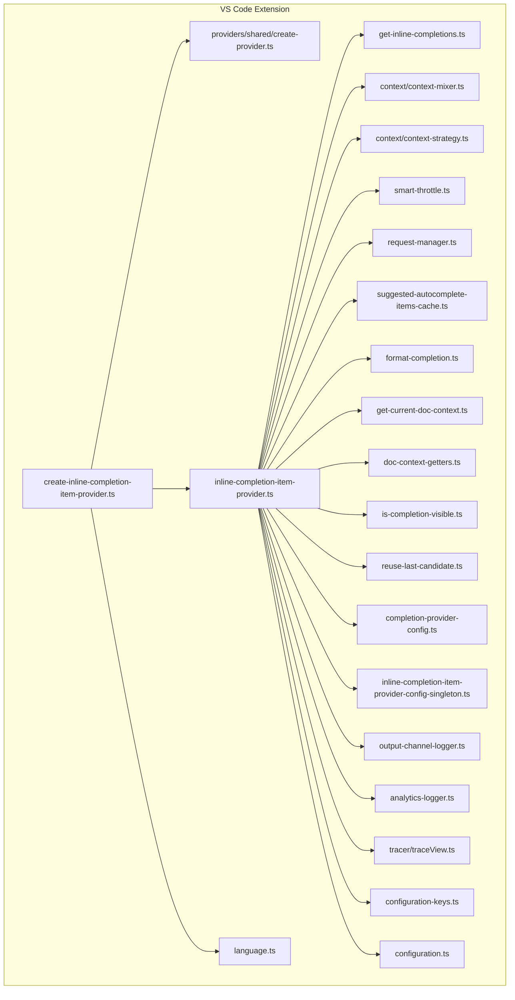
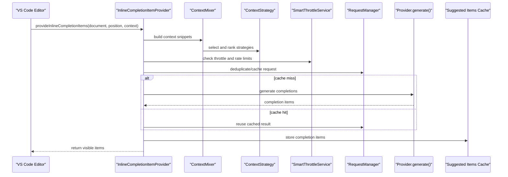
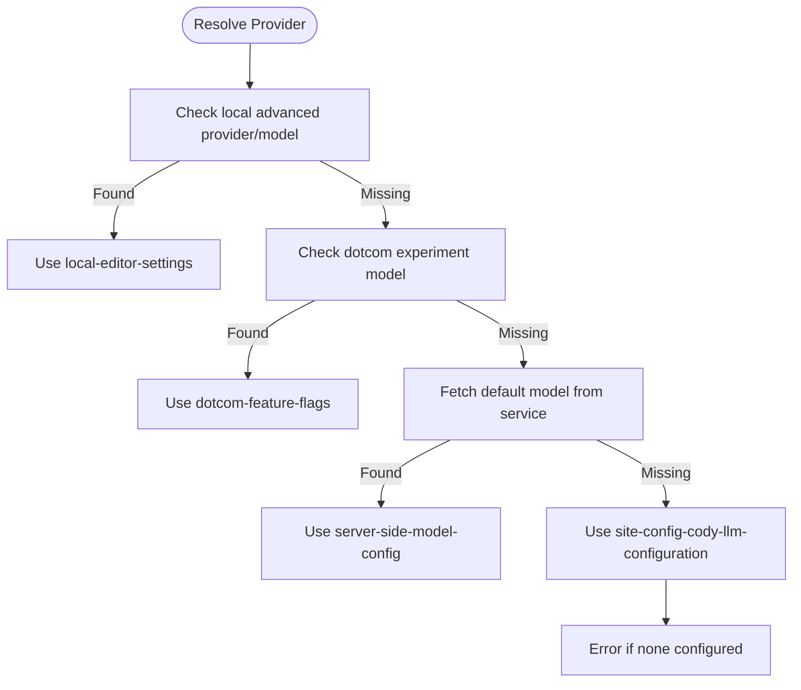
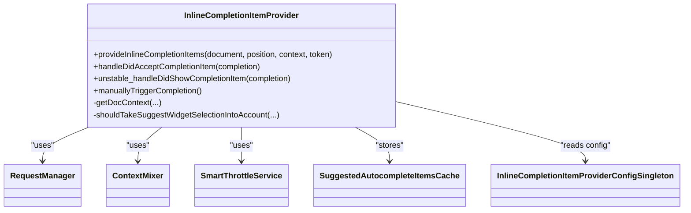
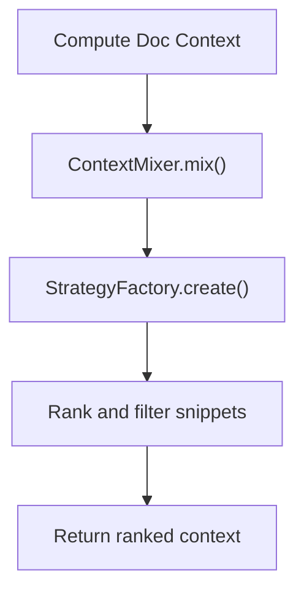
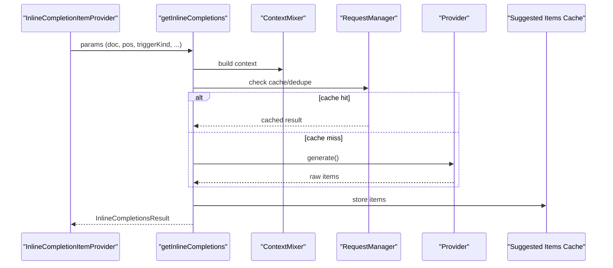
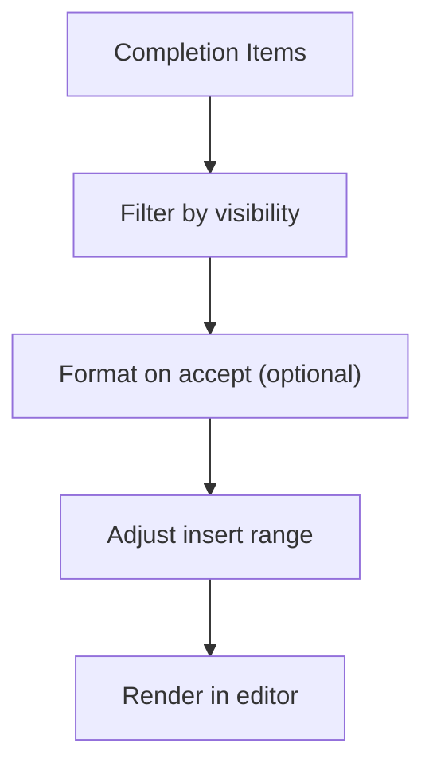
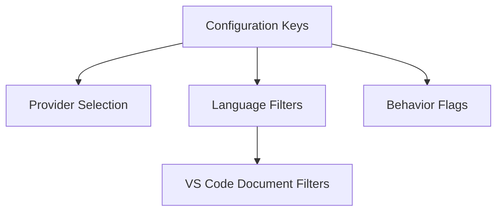
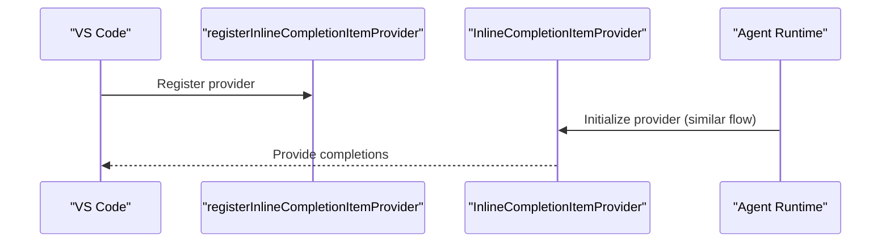
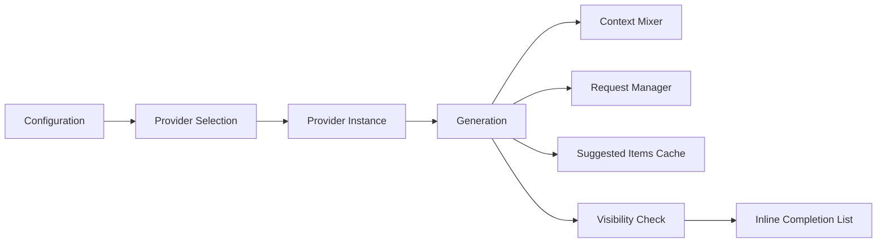

# Autocomplete Engine

<cite>
**Referenced Files in This Document**
- [create-inline-completion-item-provider.ts](file://vscode/src/completions/create-inline-completion-item-provider.ts)
- [inline-completion-item-provider.ts](file://vscode/src/completions/inline-completion-item-provider.ts)
- [create-provider.ts](file://vscode/src/completions/providers/shared/create-provider.ts)
- [get-inline-completions.ts](file://vscode/src/completions/get-inline-completions.ts)
- [context-mixer.ts](file://vscode/src/completions/context/context-mixer.ts)
- [context-strategy.ts](file://vscode/src/completions/context/context-strategy.ts)
- [smart-throttle.ts](file://vscode/src/completions/smart-throttle.ts)
- [request-manager.ts](file://vscode/src/completions/request-manager.ts)
- [suggested-autocomplete-items-cache.ts](file://vscode/src/completions/suggested-autocomplete-items-cache.ts)
- [format-completion.ts](file://vscode/src/completions/format-completion.ts)
- [get-current-doc-context.ts](file://vscode/src/completions/get-current-doc-context.ts)
- [doc-context-getters.ts](file://vscode/src/completions/doc-context-getters.ts)
- [is-completion-visible.ts](file://vscode/src/completions/is-completion-visible.ts)
- [reuse-last-candidate.ts](file://vscode/src/completions/reuse-last-candidate.ts)
- [completion-provider-config.ts](file://vscode/src/completions/completion-provider-config.ts)
- [inline-completion-item-provider-config-singleton.ts](file://vscode/src/completions/inline-completion-item-provider-config-singleton.ts)
- [output-channel-logger.ts](file://vscode/src/completions/output-channel-logger.ts)
- [analytics-logger.ts](file://vscode/src/completions/analytics-logger.ts)
- [tracer/traceView.ts](file://vscode/src/completions/tracer/traceView.ts)
- [configuration-keys.ts](file://vscode/src/configuration-keys.ts)
- [configuration.ts](file://vscode/src/configuration.ts)
- [language.ts](file://vscode/src/language.ts)
- [agent.ts](file://agent/src/agent.ts)
</cite>

## Table of Contents
1. [Introduction](#introduction)
2. [Project Structure](#project-structure)
3. [Core Components](#core-components)
4. [Architecture Overview](#architecture-overview)
5. [Detailed Component Analysis](#detailed-component-analysis)
6. [Dependency Analysis](#dependency-analysis)
7. [Performance Considerations](#performance-considerations)
8. [Troubleshooting Guide](#troubleshooting-guide)
9. [Conclusion](#conclusion)
10. [Appendices](#appendices)

## Introduction
This document explains the architecture and implementation of Cody’s intelligent inline autocomplete engine in the VS Code extension. It covers the provider pattern, completion item generation, language-specific provider selection, context retrieval and ranking, performance optimizations, text processing, configuration, and integration with VS Code’s completion system. It also includes diagrams, examples, and troubleshooting guidance.

## Project Structure
The autocomplete engine lives primarily under vscode/src/completions and integrates with shared services and configuration. Key areas:
- Provider creation and selection
- Inline completion orchestration
- Context mixing and retrieval
- Request management and throttling
- Completion item caching and formatting
- Telemetry and tracing
- VS Code integration and configuration

**Diagram sources**
- [create-inline-completion-item-provider.ts:31-107](file://vscode/src/completions/create-inline-completion-item-provider.ts#L31-L107)
- [inline-completion-item-provider.ts:97-247](file://vscode/src/completions/inline-completion-item-provider.ts#L97-L247)
- [get-inline-completions.ts:184-200](file://vscode/src/completions/get-inline-completions.ts#L184-L200)
- [create-provider.ts:31-130](file://vscode/src/completions/providers/shared/create-provider.ts#L31-L130)
- [context-mixer.ts](file://vscode/src/completions/context/context-mixer.ts)
- [context-strategy.ts](file://vscode/src/completions/context/context-strategy.ts)
- [smart-throttle.ts](file://vscode/src/completions/smart-throttle.ts)
- [request-manager.ts](file://vscode/src/completions/request-manager.ts)
- [suggested-autocomplete-items-cache.ts](file://vscode/src/completions/suggested-autocomplete-items-cache.ts)
- [format-completion.ts](file://vscode/src/completions/format-completion.ts)
- [get-current-doc-context.ts](file://vscode/src/completions/get-current-doc-context.ts)
- [doc-context-getters.ts](file://vscode/src/completions/doc-context-getters.ts)
- [is-completion-visible.ts](file://vscode/src/completions/is-completion-visible.ts)
- [reuse-last-candidate.ts](file://vscode/src/completions/reuse-last-candidate.ts)
- [completion-provider-config.ts](file://vscode/src/completions/completion-provider-config.ts)
- [inline-completion-item-provider-config-singleton.ts](file://vscode/src/completions/inline-completion-item-provider-config-singleton.ts)
- [output-channel-logger.ts](file://vscode/src/completions/output-channel-logger.ts)
- [analytics-logger.ts](file://vscode/src/completions/analytics-logger.ts)
- [tracer/traceView.ts](file://vscode/src/completions/tracer/traceView.ts)
- [configuration-keys.ts](file://vscode/src/configuration-keys.ts)
- [configuration.ts](file://vscode/src/configuration.ts)
- [language.ts](file://vscode/src/language.ts)

**Section sources**
- [create-inline-completion-item-provider.ts:31-131](file://vscode/src/completions/create-inline-completion-item-provider.ts#L31-L131)
- [inline-completion-item-provider.ts:97-247](file://vscode/src/completions/inline-completion-item-provider.ts#L97-L247)

## Core Components
- Provider selection and creation: Resolves the active provider and model from configuration, experiments, or server defaults.
- Inline completion provider: Orchestrates requests, context retrieval, throttling, caching, and UI integration.
- Context mixer: Aggregates and ranks diverse context sources.
- Request manager: Deduplicates, caches, and manages concurrent requests.
- Smart throttle: Controls request frequency and rate limiting behavior.
- Completion item cache: Stores and updates completion items for telemetry and UI.
- Formatting and visibility: Post-processes completions and checks visibility before rendering.
- Tracing and analytics: Records stages, events, and sampling for diagnostics and performance.

**Section sources**
- [create-provider.ts:31-130](file://vscode/src/completions/providers/shared/create-provider.ts#L31-L130)
- [inline-completion-item-provider.ts:97-247](file://vscode/src/completions/inline-completion-item-provider.ts#L97-L247)
- [context-mixer.ts](file://vscode/src/completions/context/context-mixer.ts)
- [request-manager.ts](file://vscode/src/completions/request-manager.ts)
- [smart-throttle.ts](file://vscode/src/completions/smart-throttle.ts)
- [suggested-autocomplete-items-cache.ts](file://vscode/src/completions/suggested-autocomplete-items-cache.ts)
- [is-completion-visible.ts](file://vscode/src/completions/is-completion-visible.ts)

## Architecture Overview
The inline completion flow integrates VS Code’s provider API with Cody’s internal engine. The provider resolves configuration, builds context, throttles requests, fetches or reuses completions, formats them, and surfaces them to the editor.

**Diagram sources**
- [inline-completion-item-provider.ts:317-654](file://vscode/src/completions/inline-completion-item-provider.ts#L317-L654)
- [get-inline-completions.ts:184-200](file://vscode/src/completions/get-inline-completions.ts#L184-L200)
- [context-mixer.ts](file://vscode/src/completions/context/context-mixer.ts)
- [context-strategy.ts](file://vscode/src/completions/context/context-strategy.ts)
- [smart-throttle.ts](file://vscode/src/completions/smart-throttle.ts)
- [request-manager.ts](file://vscode/src/completions/request-manager.ts)
- [suggested-autocomplete-items-cache.ts](file://vscode/src/completions/suggested-autocomplete-items-cache.ts)

## Detailed Component Analysis

### Provider Pattern and Selection
- The provider is created based on local settings, experiments, server-side defaults, or site configuration.
- Supported providers include Anthropic, OpenAI-compatible, Google/Gemini, Fireworks, and local providers.
- The selection logic maps provider IDs to factory functions and constructs the provider with resolved model and configuration.

**Diagram sources**
- [create-provider.ts:31-130](file://vscode/src/completions/providers/shared/create-provider.ts#L31-L130)

**Section sources**
- [create-provider.ts:31-130](file://vscode/src/completions/providers/shared/create-provider.ts#L31-L130)
- [create-provider.ts:183-231](file://vscode/src/completions/providers/shared/create-provider.ts#L183-L231)

### Inline Completion Orchestration
- The provider validates configuration, filters ignored URIs, computes document context, determines intent, and invokes the generation pipeline.
- It handles manual, automatic, hover, suggest widget, and preload triggers.
- It applies a configurable trigger delay, manages loading indicators, and clears last candidates on rejection or staleness.
- It formats completions on accept and records telemetry for suggestions and accepts.

**Diagram sources**
- [inline-completion-item-provider.ts:97-247](file://vscode/src/completions/inline-completion-item-provider.ts#L97-L247)
- [request-manager.ts](file://vscode/src/completions/request-manager.ts)
- [context-mixer.ts](file://vscode/src/completions/context/context-mixer.ts)
- [smart-throttle.ts](file://vscode/src/completions/smart-throttle.ts)
- [suggested-autocomplete-items-cache.ts](file://vscode/src/completions/suggested-autocomplete-items-cache.ts)
- [inline-completion-item-provider-config-singleton.ts](file://vscode/src/completions/inline-completion-item-provider-config-singleton.ts)

**Section sources**
- [inline-completion-item-provider.ts:317-654](file://vscode/src/completions/inline-completion-item-provider.ts#L317-L654)
- [inline-completion-item-provider.ts:660-718](file://vscode/src/completions/inline-completion-item-provider.ts#L660-L718)

### Context Retrieval and Ranking
- Context is built from the current document and surrounding context, with strategies for different scenarios.
- The mixer aggregates multiple context sources and ranks them to improve relevance.
- Strategies are configurable and can be prefetched to warm caches.

**Diagram sources**
- [get-current-doc-context.ts](file://vscode/src/completions/get-current-doc-context.ts)
- [context-mixer.ts](file://vscode/src/completions/context/context-mixer.ts)
- [context-strategy.ts](file://vscode/src/completions/context/context-strategy.ts)
- [completion-provider-config.ts](file://vscode/src/completions/completion-provider-config.ts)

**Section sources**
- [get-current-doc-context.ts](file://vscode/src/completions/get-current-doc-context.ts)
- [context-mixer.ts](file://vscode/src/completions/context/context-mixer.ts)
- [context-strategy.ts](file://vscode/src/completions/context/context-strategy.ts)
- [completion-provider-config.ts](file://vscode/src/completions/completion-provider-config.ts)

### Generation Pipeline and Completion Item Creation
- The generation function coordinates provider invocation, request management, and result processing.
- It supports reuse of last candidate when still valid, and marks results stale if superseded.
- Items are transformed into VS Code-compatible completion items and filtered for visibility.

**Diagram sources**
- [get-inline-completions.ts:184-200](file://vscode/src/completions/get-inline-completions.ts#L184-L200)
- [reuse-last-candidate.ts](file://vscode/src/completions/reuse-last-candidate.ts)
- [suggested-autocomplete-items-cache.ts](file://vscode/src/completions/suggested-autocomplete-items-cache.ts)

**Section sources**
- [get-inline-completions.ts:184-200](file://vscode/src/completions/get-inline-completions.ts#L184-L200)
- [reuse-last-candidate.ts](file://vscode/src/completions/reuse-last-candidate.ts)

### Text Processing, Formatting, and Visibility
- Completions are formatted according to user settings on accept.
- Insert ranges are adjusted to avoid UI jitter.
- Visibility checks ensure only applicable completions are shown.

**Diagram sources**
- [is-completion-visible.ts](file://vscode/src/completions/is-completion-visible.ts)
- [format-completion.ts](file://vscode/src/completions/format-completion.ts)
- [inline-completion-item-provider.ts:617-628](file://vscode/src/completions/inline-completion-item-provider.ts#L617-L628)

**Section sources**
- [format-completion.ts](file://vscode/src/completions/format-completion.ts)
- [is-completion-visible.ts](file://vscode/src/completions/is-completion-visible.ts)
- [inline-completion-item-provider.ts:617-628](file://vscode/src/completions/inline-completion-item-provider.ts#L617-L628)

### Configuration and Language Filters
- Providers and models are selected from configuration keys and site configuration.
- Language filters are computed from VS Code language IDs and per-language toggles.
- Additional settings control trigger delay, suggest widget behavior, formatting on accept, and comment filtering.

**Diagram sources**
- [configuration-keys.ts](file://vscode/src/configuration-keys.ts)
- [configuration.ts](file://vscode/src/configuration.ts)
- [create-inline-completion-item-provider.ts:116-131](file://vscode/src/completions/create-inline-completion-item-provider.ts#L116-L131)
- [create-inline-completion-item-provider.ts:74-89](file://vscode/src/completions/create-inline-completion-item-provider.ts#L74-L89)

**Section sources**
- [configuration-keys.ts](file://vscode/src/configuration-keys.ts)
- [configuration.ts](file://vscode/src/configuration.ts)
- [create-inline-completion-item-provider.ts:116-131](file://vscode/src/completions/create-inline-completion-item-provider.ts#L116-L131)
- [create-inline-completion-item-provider.ts:74-89](file://vscode/src/completions/create-inline-completion-item-provider.ts#L74-L89)

### Integration with VS Code and Agent
- The provider registers itself with VS Code’s inline completion provider API and exposes a manual trigger command.
- The Agent runtime initializes the provider similarly and logs configuration for debugging.
- The trace view enables detailed tracing of completion stages.

**Diagram sources**
- [create-inline-completion-item-provider.ts:95-98](file://vscode/src/completions/create-inline-completion-item-provider.ts#L95-L98)
- [agent.ts](file://agent/src/agent.ts)
- [tracer/traceView.ts](file://vscode/src/completions/tracer/traceView.ts)

**Section sources**
- [create-inline-completion-item-provider.ts:31-107](file://vscode/src/completions/create-inline-completion-item-provider.ts#L31-L107)
- [agent.ts](file://agent/src/agent.ts)
- [tracer/traceView.ts](file://vscode/src/completions/tracer/traceView.ts)

## Dependency Analysis
- Provider selection depends on configuration, experiments, and server defaults.
- The inline provider depends on context, request management, throttling, and caching.
- Telemetry and tracing are integrated throughout the pipeline.

**Diagram sources**
- [create-provider.ts:31-130](file://vscode/src/completions/providers/shared/create-provider.ts#L31-L130)
- [inline-completion-item-provider.ts:97-247](file://vscode/src/completions/inline-completion-item-provider.ts#L97-L247)
- [get-inline-completions.ts:184-200](file://vscode/src/completions/get-inline-completions.ts#L184-L200)
- [context-mixer.ts](file://vscode/src/completions/context/context-mixer.ts)
- [request-manager.ts](file://vscode/src/completions/request-manager.ts)
- [suggested-autocomplete-items-cache.ts](file://vscode/src/completions/suggested-autocomplete-items-cache.ts)
- [is-completion-visible.ts](file://vscode/src/completions/is-completion-visible.ts)

**Section sources**
- [create-provider.ts:31-130](file://vscode/src/completions/providers/shared/create-provider.ts#L31-L130)
- [inline-completion-item-provider.ts:97-247](file://vscode/src/completions/inline-completion-item-provider.ts#L97-L247)
- [get-inline-completions.ts:184-200](file://vscode/src/completions/get-inline-completions.ts#L184-L200)

## Performance Considerations
- Smart throttling reduces redundant requests and respects rate limits.
- Request deduplication and caching minimize repeated work.
- Trigger delay smooths UX and reduces churn.
- Preload requests anticipate next-line completions to reduce latency.
- Prefetching configuration warms caches for faster first completions.

Recommendations:
- Tune trigger delay and debounce intervals for your workflow.
- Monitor rate limit errors and adjust throttling policies.
- Prefer caching-friendly context strategies to improve reuse.

**Section sources**
- [smart-throttle.ts](file://vscode/src/completions/smart-throttle.ts)
- [request-manager.ts](file://vscode/src/completions/request-manager.ts)
- [inline-completion-item-provider.ts:253-310](file://vscode/src/completions/inline-completion-item-provider.ts#L253-L310)
- [inline-completion-item-provider.ts:244-247](file://vscode/src/completions/inline-completion-item-provider.ts#L244-L247)

## Troubleshooting Guide
Common issues and resolutions:
- Not signed in or missing provider configuration: The provider creation logs and may surface errors; ensure configuration is set or site config is applied.
- Autocomplete disabled by client config: Requests are blocked and surfaced as errors.
- Rate limit errors: Status bar shows rate limit indicators; requests are suppressed to avoid visual churn.
- Ignored URIs: Requests from ignored paths are skipped.
- Stale or unwanted completions: Rejection logic clears last candidate and removes unwanted entries.
- Visibility problems: If the completion would not be visible, it is not returned.

Actions:
- Use the manual trigger command to force a completion.
- Check the output channel for debug logs.
- Verify language filters and per-language settings.
- Review telemetry and trace views for detailed insights.

**Section sources**
- [create-inline-completion-item-provider.ts:41-47](file://vscode/src/completions/create-inline-completion-item-provider.ts#L41-L47)
- [inline-completion-item-provider.ts:354-363](file://vscode/src/completions/inline-completion-item-provider.ts#L354-L363)
- [inline-completion-item-provider.ts:374-385](file://vscode/src/completions/inline-completion-item-provider.ts#L374-L385)
- [inline-completion-item-provider.ts:340-343](file://vscode/src/completions/inline-completion-item-provider.ts#L340-L343)
- [inline-completion-item-provider.ts:498-503](file://vscode/src/completions/inline-completion-item-provider.ts#L498-L503)
- [inline-completion-item-provider.ts:540-565](file://vscode/src/completions/inline-completion-item-provider.ts#L540-L565)
- [output-channel-logger.ts](file://vscode/src/completions/output-channel-logger.ts)

## Conclusion
Cody’s autocomplete engine combines a flexible provider pattern, robust context management, and performance-conscious request handling to deliver responsive, accurate inline completions. Its integration with VS Code’s APIs and Agent runtime, along with extensive telemetry and tracing, provides a strong foundation for continuous improvement and reliable operation.

## Appendices

### Provider Implementation Examples
- Anthropic provider: Constructed via the provider factory and used for Claude-based models.
- OpenAI-compatible provider: Supports generic OpenAI-style APIs.
- Google/Gemini provider: Handles Google’s Gemini models.
- Fireworks provider: Uses the Fireworks backend.
- Local providers: Includes experimental Ollama variants.

These are selected based on provider IDs and configuration, then instantiated with resolved model and auth context.

**Section sources**
- [create-provider.ts:183-231](file://vscode/src/completions/providers/shared/create-provider.ts#L183-L231)

### Context Mixing Strategies
- Strategy factory selects appropriate strategies based on configuration.
- Context is mixed and ranked to maximize relevance.
- Prefetching improves responsiveness for first completions.

**Section sources**
- [context-strategy.ts](file://vscode/src/completions/context/context-strategy.ts)
- [completion-provider-config.ts](file://vscode/src/completions/completion-provider-config.ts)

### Configuration Options
Key settings include:
- Provider and model selection
- Trigger delay
- Complete suggest widget selection behavior
- Format on accept
- Disable inside comments
- Per-language enablement

These are read during provider initialization and applied to the inline completion behavior.

**Section sources**
- [create-inline-completion-item-provider.ts:74-89](file://vscode/src/completions/create-inline-completion-item-provider.ts#L74-L89)
- [configuration-keys.ts](file://vscode/src/configuration-keys.ts)
- [configuration.ts](file://vscode/src/configuration.ts)