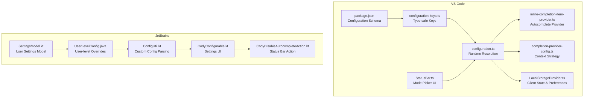
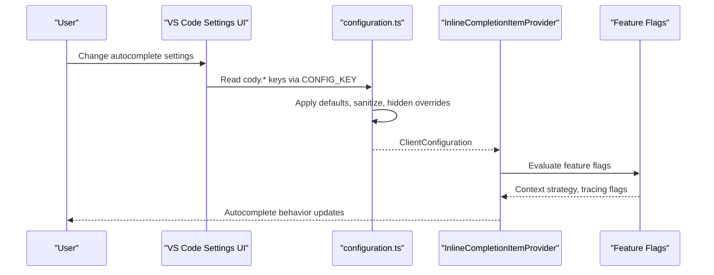
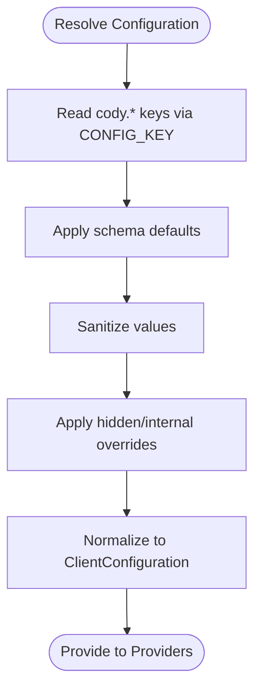
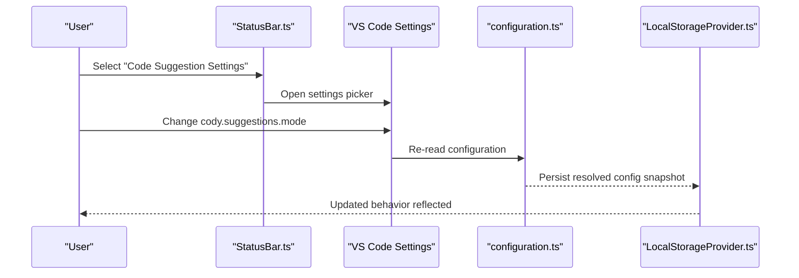
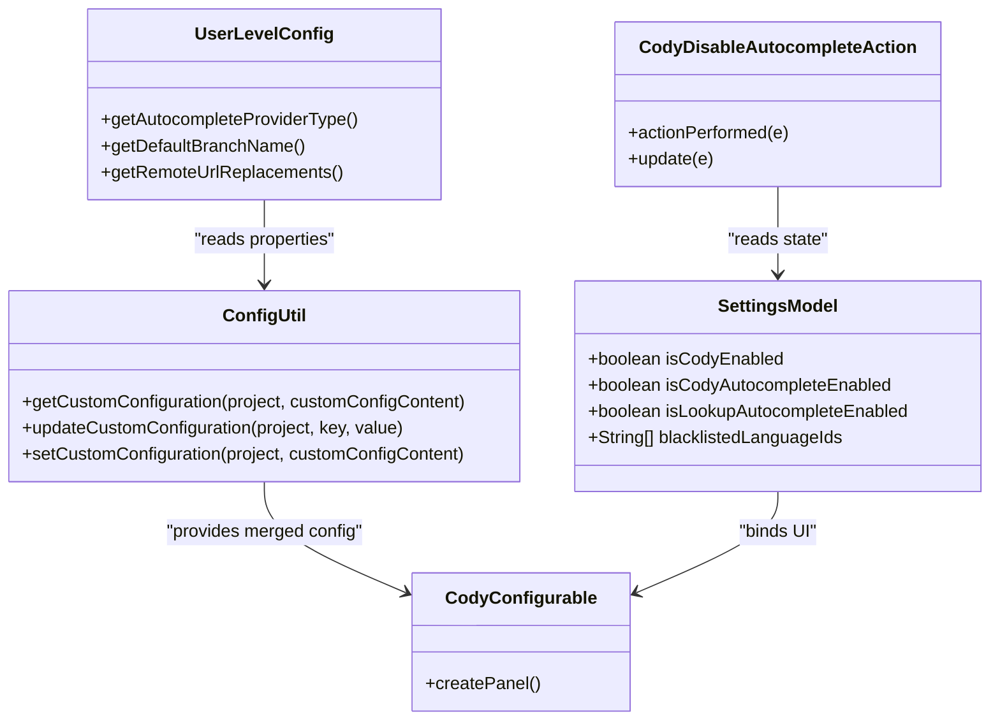
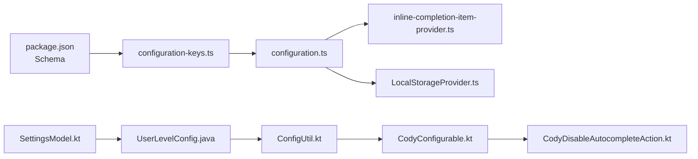

# Configuration & Settings

<cite>
**Referenced Files in This Document**
- [configuration.ts](file://vscode/src/configuration.ts)
- [configuration-keys.ts](file://vscode/src/configuration-keys.ts)
- [package.json](file://vscode/package.json)
- [inline-completion-item-provider.ts](file://vscode/src/completions/inline-completion-item-provider.ts)
- [completion-provider-config.ts](file://vscode/src/completions/completion-provider-config.ts)
- [StatusBar.ts](file://vscode/src/services/StatusBar.ts)
- [LocalStorageProvider.ts](file://vscode/src/services/LocalStorageProvider.ts)
- [SettingsModel.kt](file://jetbrains/src/main/kotlin/com/sourcegraph/cody/config/SettingsModel.kt)
- [UserLevelConfig.java](file://jetbrains/src/main/java/com/sourcegraph/config/UserLevelConfig.java)
- [ConfigUtil.kt](file://jetbrains/src/main/kotlin/com/sourcegraph/config/ConfigUtil.kt)
- [CodyConfigurable.kt](file://jetbrains/src/main/kotlin/com/sourcegraph/cody/config/ui/CodyConfigurable.kt)
- [CodyDisableAutocompleteAction.kt](file://jetbrains/src/main/kotlin/com/sourcegraph/cody/statusbar/CodyDisableAutocompleteAction.kt)
</cite>

## Table of Contents
1. [Introduction](#introduction)
2. [Project Structure](#project-structure)
3. [Core Components](#core-components)
4. [Architecture Overview](#architecture-overview)
5. [Detailed Component Analysis](#detailed-component-analysis)
6. [Dependency Analysis](#dependency-analysis)
7. [Performance Considerations](#performance-considerations)
8. [Troubleshooting Guide](#troubleshooting-guide)
9. [Conclusion](#conclusion)
10. [Appendices](#appendices)

## Introduction
This document explains the autocomplete configuration and settings management across the VS Code extension and JetBrains plugin. It covers how user preferences, workspace settings, and global overrides are merged, validated, and applied. It documents autocomplete-related configuration options (model selection, trigger delays, completion formatting, language-specific toggles), configuration UI, synchronization, and preference management. It also provides examples, troubleshooting guidance, and best practices for different development environments.

## Project Structure
The configuration system spans:
- VS Code extension: configuration schema, runtime resolution, and UI integration
- JetBrains plugin: configuration UI, user-level settings, and property overrides

**Diagram sources**
- [package.json:877-1271](file://vscode/package.json#L877-L1271)
- [configuration-keys.ts:1-55](file://vscode/src/configuration-keys.ts#L1-L55)
- [configuration.ts:1-233](file://vscode/src/configuration.ts#L1-L233)
- [inline-completion-item-provider.ts:1-200](file://vscode/src/completions/inline-completion-item-provider.ts#L1-L200)
- [completion-provider-config.ts:1-144](file://vscode/src/completions/completion-provider-config.ts#L1-L144)
- [StatusBar.ts:602-792](file://vscode/src/services/StatusBar.ts#L602-L792)
- [LocalStorageProvider.ts:1-432](file://vscode/src/services/LocalStorageProvider.ts#L1-L432)
- [SettingsModel.kt:1-18](file://jetbrains/src/main/kotlin/com/sourcegraph/cody/config/SettingsModel.kt#L1-L18)
- [UserLevelConfig.java:1-42](file://jetbrains/src/main/java/com/sourcegraph/config/UserLevelConfig.java#L1-L42)
- [ConfigUtil.kt:174-241](file://jetbrains/src/main/kotlin/com/sourcegraph/config/ConfigUtil.kt#L174-L241)
- [CodyConfigurable.kt:1-109](file://jetbrains/src/main/kotlin/com/sourcegraph/cody/config/ui/CodyConfigurable.kt#L1-L109)
- [CodyDisableAutocompleteAction.kt:1-25](file://jetbrains/src/main/kotlin/com/sourcegraph/cody/statusbar/CodyDisableAutocompleteAction.kt#L1-L25)

**Section sources**
- [package.json:877-1271](file://vscode/package.json#L877-L1271)
- [configuration.ts:25-204](file://vscode/src/configuration.ts#L25-L204)
- [configuration-keys.ts:18-55](file://vscode/src/configuration-keys.ts#L18-L55)
- [inline-completion-item-provider.ts:134-199](file://vscode/src/completions/inline-completion-item-provider.ts#L134-L199)
- [completion-provider-config.ts:46-131](file://vscode/src/completions/completion-provider-config.ts#L46-L131)
- [StatusBar.ts:602-792](file://vscode/src/services/StatusBar.ts#L602-L792)
- [LocalStorageProvider.ts:322-344](file://vscode/src/services/LocalStorageProvider.ts#L322-L344)
- [SettingsModel.kt:5-18](file://jetbrains/src/main/kotlin/com/sourcegraph/cody/config/SettingsModel.kt#L5-L18)
- [UserLevelConfig.java:15-42](file://jetbrains/src/main/java/com/sourcegraph/config/UserLevelConfig.java#L15-L42)
- [ConfigUtil.kt:174-241](file://jetbrains/src/main/kotlin/com/sourcegraph/config/ConfigUtil.kt#L174-L241)
- [CodyConfigurable.kt:26-109](file://jetbrains/src/main/kotlin/com/sourcegraph/cody/config/ui/CodyConfigurable.kt#L26-L109)
- [CodyDisableAutocompleteAction.kt:10-24](file://jetbrains/src/main/kotlin/com/sourcegraph/cody/statusbar/CodyDisableAutocompleteAction.kt#L10-L24)

## Core Components
- Configuration schema and defaults: defined in the VS Code package.json under contributes.configuration. Includes autocomplete options, provider selection, language toggles, and hidden/internal settings.
- Runtime configuration resolution: transforms VS Code settings into a strongly-typed ClientConfiguration object, applying defaults and sanitization.
- Type-safe configuration keys: generated from the schema to avoid drift between keys and defaults.
- Autocomplete provider configuration: reads resolved config and feature flags to select context strategies and behavior.
- UI integration: status bar quick pick to switch suggestion modes and open autocomplete settings; VS Code settings page for autocomplete controls.
- Preference storage: local storage for client state, model preferences, and resolved configuration snapshots.
- JetBrains configuration: user-level settings model, property overrides, custom configuration merging, and UI for autocomplete controls.

**Section sources**
- [package.json:877-1271](file://vscode/package.json#L877-L1271)
- [configuration.ts:25-204](file://vscode/src/configuration.ts#L25-L204)
- [configuration-keys.ts:18-55](file://vscode/src/configuration-keys.ts#L18-L55)
- [completion-provider-config.ts:46-131](file://vscode/src/completions/completion-provider-config.ts#L46-L131)
- [StatusBar.ts:602-792](file://vscode/src/services/StatusBar.ts#L602-L792)
- [LocalStorageProvider.ts:322-344](file://vscode/src/services/LocalStorageProvider.ts#L322-L344)
- [SettingsModel.kt:5-18](file://jetbrains/src/main/kotlin/com/sourcegraph/cody/config/SettingsModel.kt#L5-L18)
- [UserLevelConfig.java:15-42](file://jetbrains/src/main/java/com/sourcegraph/config/UserLevelConfig.java#L15-L42)
- [ConfigUtil.kt:174-241](file://jetbrains/src/main/kotlin/com/sourcegraph/config/ConfigUtil.kt#L174-L241)
- [CodyConfigurable.kt:26-109](file://jetbrains/src/main/kotlin/com/sourcegraph/cody/config/ui/CodyConfigurable.kt#L26-L109)

## Architecture Overview
The configuration pipeline resolves user preferences from VS Code settings, merges them with defaults, applies hidden/internal overrides, and exposes a normalized ClientConfiguration consumed by the autocomplete provider and other subsystems. Feature flags and resolved configuration drive context strategies and behavior.

**Diagram sources**
- [configuration.ts:25-204](file://vscode/src/configuration.ts#L25-L204)
- [configuration-keys.ts:18-55](file://vscode/src/configuration-keys.ts#L18-L55)
- [inline-completion-item-provider.ts:134-199](file://vscode/src/completions/inline-completion-item-provider.ts#L134-L199)
- [completion-provider-config.ts:46-131](file://vscode/src/completions/completion-provider-config.ts#L46-L131)

## Detailed Component Analysis

### VS Code Configuration Resolution
- Reads cody.* keys from VS Code configuration using type-safe keys.
- Applies defaults from the schema and sanitizes values (e.g., codebase normalization).
- Honors hidden/internal overrides and environment-based defaults.
- Exposes a normalized ClientConfiguration consumed by providers and services.

**Diagram sources**
- [configuration.ts:25-204](file://vscode/src/configuration.ts#L25-L204)
- [configuration-keys.ts:18-55](file://vscode/src/configuration-keys.ts#L18-L55)
- [package.json:877-1271](file://vscode/package.json#L877-L1271)

**Section sources**
- [configuration.ts:25-204](file://vscode/src/configuration.ts#L25-L204)
- [configuration-keys.ts:18-55](file://vscode/src/configuration-keys.ts#L18-L55)
- [package.json:877-1271](file://vscode/package.json#L877-L1271)

### Autocomplete Options and Defaults
Key autocomplete-related settings and defaults:
- Suggestions mode: autocomplete, auto-edit, off
- Trigger delay: milliseconds before showing suggestions
- Language-specific toggles: enable/disable for language ids; default fallback "*"
- Advanced provider: default, experimental-ollama
- Complete suggest widget selection: align VS Code inline suggest behavior
- Format on accept: format completions using default formatter
- Disable inside comments: avoid autocomplete requests in comments
- Experimental graph context: tsc, tsc-mixed, or null
- Experimental providers: fireworksOptions, ollamaOptions
- Hidden internal settings: timeouts, tracing, supercompletions, agent flags

These are defined in the configuration schema and read by the resolver.

**Section sources**
- [package.json:907-1269](file://vscode/package.json#L907-L1269)
- [configuration.ts:96-175](file://vscode/src/configuration.ts#L96-L175)

### Configuration Validation and Defaults
- Regex debug filter parsing with fallback to default pattern on error.
- Codebase sanitization removes protocol and trailing slashes.
- Hidden settings use environment-based defaults when unspecified.
- Defaults are sourced from the configuration schema.

**Section sources**
- [configuration.ts:32-48](file://vscode/src/configuration.ts#L32-L48)
- [configuration.ts:206-213](file://vscode/src/configuration.ts#L206-L213)
- [configuration.ts:132-203](file://vscode/src/configuration.ts#L132-L203)
- [package.json:877-1271](file://vscode/package.json#L877-L1271)

### Setting Inheritance and Overrides
- VS Code settings are read from workspace/global scopes and merged with defaults.
- Hidden/internal overrides take precedence over other values.
- The resolver consolidates user preferences, environment, and internal flags into a single configuration object.

**Section sources**
- [configuration.ts:25-204](file://vscode/src/configuration.ts#L25-L204)

### Configuration UI and Synchronization
- Status bar quick pick to switch suggestion modes and open autocomplete settings.
- Keyboard shortcuts and commands integrate with settings visibility and availability.
- Local storage persists client state and resolved configuration snapshots for telemetry and debugging.

**Diagram sources**
- [StatusBar.ts:602-792](file://vscode/src/services/StatusBar.ts#L602-L792)
- [configuration.ts:25-204](file://vscode/src/configuration.ts#L25-L204)
- [LocalStorageProvider.ts:322-344](file://vscode/src/services/LocalStorageProvider.ts#L322-L344)

**Section sources**
- [StatusBar.ts:602-792](file://vscode/src/services/StatusBar.ts#L602-L792)
- [LocalStorageProvider.ts:322-344](file://vscode/src/services/LocalStorageProvider.ts#L322-L344)

### JetBrains Configuration System
- Settings model encapsulates user preferences such as enabling autocomplete, disabling for specific languages, and UI hints.
- User-level configuration reads properties from a settings file and falls back to global defaults.
- Custom configuration merging adds additional properties and handles comments/trailing commas.
- Settings UI provides controls for autocomplete behavior and language blacklists.
- Status bar action disables autocomplete when enabled.

**Diagram sources**
- [SettingsModel.kt:5-18](file://jetbrains/src/main/kotlin/com/sourcegraph/cody/config/SettingsModel.kt#L5-L18)
- [UserLevelConfig.java:15-42](file://jetbrains/src/main/java/com/sourcegraph/config/UserLevelConfig.java#L15-L42)
- [ConfigUtil.kt:174-241](file://jetbrains/src/main/kotlin/com/sourcegraph/config/ConfigUtil.kt#L174-L241)
- [CodyConfigurable.kt:26-109](file://jetbrains/src/main/kotlin/com/sourcegraph/cody/config/ui/CodyConfigurable.kt#L26-L109)
- [CodyDisableAutocompleteAction.kt:10-24](file://jetbrains/src/main/kotlin/com/sourcegraph/cody/statusbar/CodyDisableAutocompleteAction.kt#L10-L24)

**Section sources**
- [SettingsModel.kt:5-18](file://jetbrains/src/main/kotlin/com/sourcegraph/cody/config/SettingsModel.kt#L5-L18)
- [UserLevelConfig.java:15-42](file://jetbrains/src/main/java/com/sourcegraph/config/UserLevelConfig.java#L15-L42)
- [ConfigUtil.kt:174-241](file://jetbrains/src/main/kotlin/com/sourcegraph/config/ConfigUtil.kt#L174-L241)
- [CodyConfigurable.kt:26-109](file://jetbrains/src/main/kotlin/com/sourcegraph/cody/config/ui/CodyConfigurable.kt#L26-L109)
- [CodyDisableAutocompleteAction.kt:10-24](file://jetbrains/src/main/kotlin/com/sourcegraph/cody/statusbar/CodyDisableAutocompleteAction.kt#L10-L24)

### Autocomplete Provider Configuration
- Context strategy selection depends on resolved configuration and feature flags.
- Provider configuration singleton caches relevant flags and config values to avoid repeated lookups.

**Section sources**
- [completion-provider-config.ts:46-131](file://vscode/src/completions/completion-provider-config.ts#L46-L131)
- [inline-completion-item-provider.ts:134-199](file://vscode/src/completions/inline-completion-item-provider.ts#L134-L199)

## Dependency Analysis
- VS Code configuration depends on:
  - Package.json schema for defaults and validation
  - Type-safe keys to prevent drift
  - Feature flags for dynamic behavior
- JetBrains configuration depends on:
  - Settings model and user-level properties
  - Custom configuration merging and fallbacks
  - UI components binding to settings

**Diagram sources**
- [package.json:877-1271](file://vscode/package.json#L877-L1271)
- [configuration-keys.ts:18-55](file://vscode/src/configuration-keys.ts#L18-L55)
- [configuration.ts:25-204](file://vscode/src/configuration.ts#L25-L204)
- [inline-completion-item-provider.ts:134-199](file://vscode/src/completions/inline-completion-item-provider.ts#L134-L199)
- [LocalStorageProvider.ts:322-344](file://vscode/src/services/LocalStorageProvider.ts#L322-L344)
- [SettingsModel.kt:5-18](file://jetbrains/src/main/kotlin/com/sourcegraph/cody/config/SettingsModel.kt#L5-L18)
- [UserLevelConfig.java:15-42](file://jetbrains/src/main/java/com/sourcegraph/config/UserLevelConfig.java#L15-L42)
- [ConfigUtil.kt:174-241](file://jetbrains/src/main/kotlin/com/sourcegraph/config/ConfigUtil.kt#L174-L241)
- [CodyConfigurable.kt:26-109](file://jetbrains/src/main/kotlin/com/sourcegraph/cody/config/ui/CodyConfigurable.kt#L26-L109)
- [CodyDisableAutocompleteAction.kt:10-24](file://jetbrains/src/main/kotlin/com/sourcegraph/cody/statusbar/CodyDisableAutocompleteAction.kt#L10-L24)

**Section sources**
- [package.json:877-1271](file://vscode/package.json#L877-L1271)
- [configuration.ts:25-204](file://vscode/src/configuration.ts#L25-L204)
- [inline-completion-item-provider.ts:134-199](file://vscode/src/completions/inline-completion-item-provider.ts#L134-L199)
- [completion-provider-config.ts:46-131](file://vscode/src/completions/completion-provider-config.ts#L46-L131)
- [SettingsModel.kt:5-18](file://jetbrains/src/main/kotlin/com/sourcegraph/cody/config/SettingsModel.kt#L5-L18)
- [UserLevelConfig.java:15-42](file://jetbrains/src/main/java/com/sourcegraph/config/UserLevelConfig.java#L15-L42)
- [ConfigUtil.kt:174-241](file://jetbrains/src/main/kotlin/com/sourcegraph/config/ConfigUtil.kt#L174-L241)

## Performance Considerations
- Minimize repeated configuration reads by using the singleton provider configuration and caching resolved values.
- Use feature flags judiciously; prefetch commonly used flags to avoid first-hit latency.
- Keep hidden/internal overrides minimal to reduce branching complexity.
- Avoid expensive operations in configuration resolution paths; defer heavy work to lazy initialization.

[No sources needed since this section provides general guidance]

## Troubleshooting Guide
Common issues and resolutions:
- Autocomplete not triggering:
  - Verify suggestions mode is set to autocomplete.
  - Check language-specific toggles and disable-inside-comments settings.
  - Confirm trigger delay is appropriate for your workflow.
- Unexpected provider behavior:
  - Review advanced provider selection and experimental options.
  - Check hidden internal overrides that may alter behavior.
- Debugging configuration:
  - Use status bar quick pick to switch modes and open autocomplete settings.
  - Inspect resolved configuration snapshot in local storage for diagnostics.
- JetBrains autocomplete disabled:
  - Use the status bar action to disable autocomplete when enabled.
  - Adjust settings UI controls for autocomplete and language blacklists.

**Section sources**
- [StatusBar.ts:602-792](file://vscode/src/services/StatusBar.ts#L602-L792)
- [configuration.ts:25-204](file://vscode/src/configuration.ts#L25-L204)
- [LocalStorageProvider.ts:322-344](file://vscode/src/services/LocalStorageProvider.ts#L322-L344)
- [CodyDisableAutocompleteAction.kt:10-24](file://jetbrains/src/main/kotlin/com/sourcegraph/cody/statusbar/CodyDisableAutocompleteAction.kt#L10-L24)
- [CodyConfigurable.kt:26-109](file://jetbrains/src/main/kotlin/com/sourcegraph/cody/config/ui/CodyConfigurable.kt#L26-L109)

## Conclusion
The configuration system harmonizes user preferences, workspace settings, and global overrides into a normalized ClientConfiguration consumed by the autocomplete provider. VS Code and JetBrains clients share similar concerns—schema-driven defaults, runtime resolution, UI integration, and preference persistence—while adapting to platform-specific capabilities. By understanding the configuration pipeline, validation, and UI flows, teams can tailor autocomplete behavior to diverse development environments and troubleshoot issues effectively.

[No sources needed since this section summarizes without analyzing specific files]

## Appendices

### Configuration Scenarios and Best Practices
- Team-wide policy enforcement:
  - Use workspace settings to enforce language-specific toggles and provider selection.
  - Leverage hidden internal overrides for controlled experiments.
- Developer ergonomics:
  - Tune trigger delay and format-on-accept for faster iteration.
  - Disable autocomplete inside comments for cleaner diffs.
- Multi-environment setups:
  - VS Code: rely on the settings UI and status bar quick pick for mode switching.
  - JetBrains: use the settings UI and status bar action to manage autocomplete behavior.

[No sources needed since this section provides general guidance]