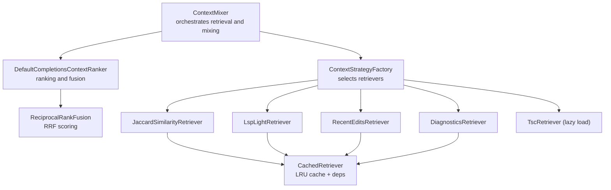
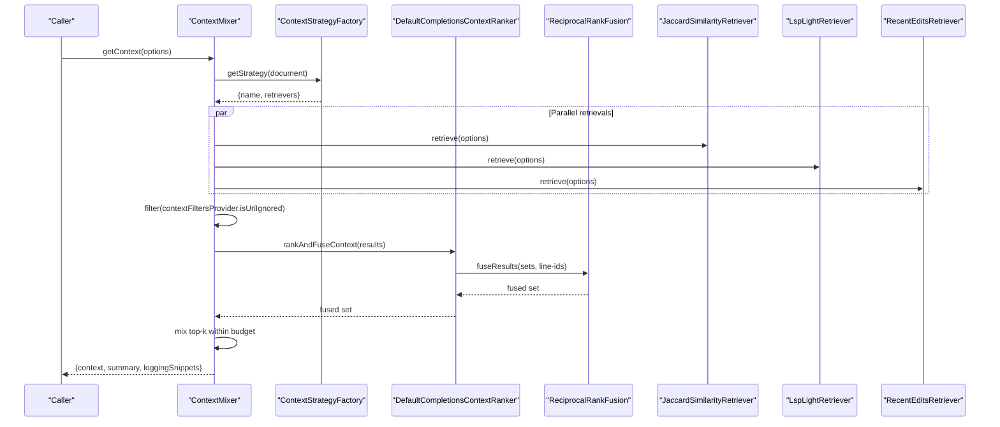
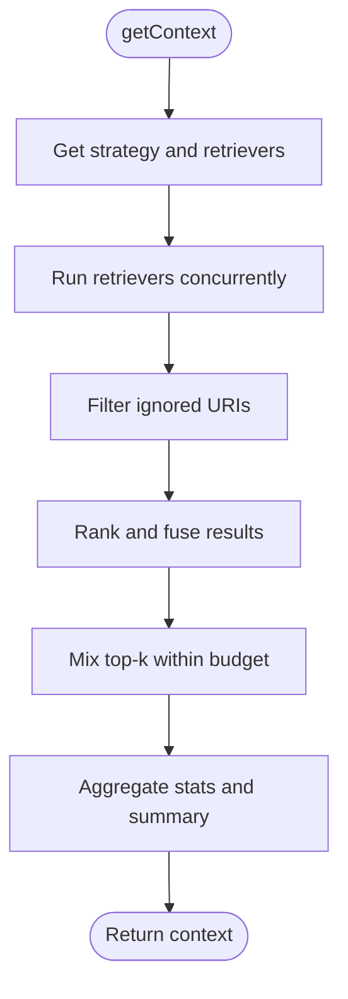
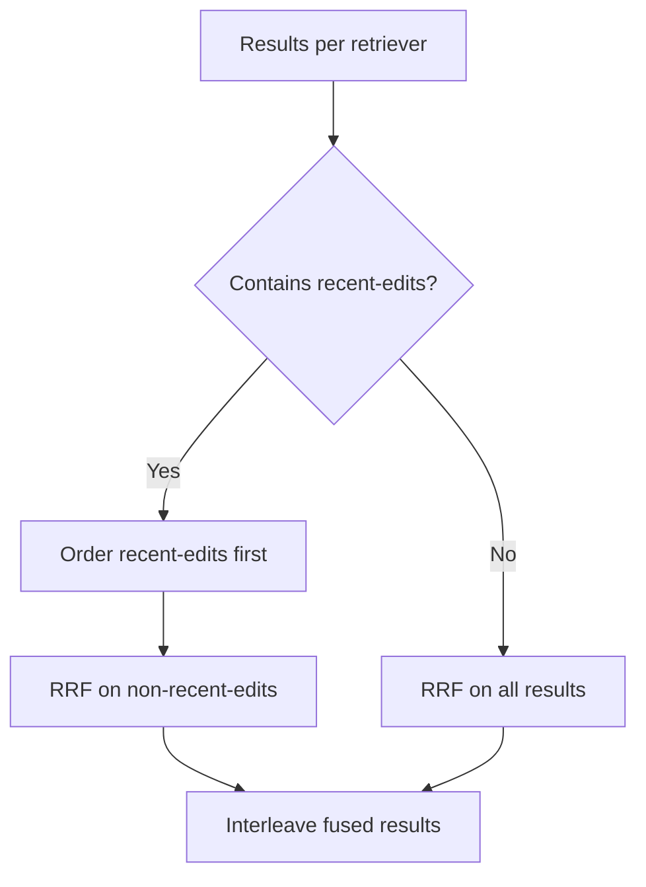
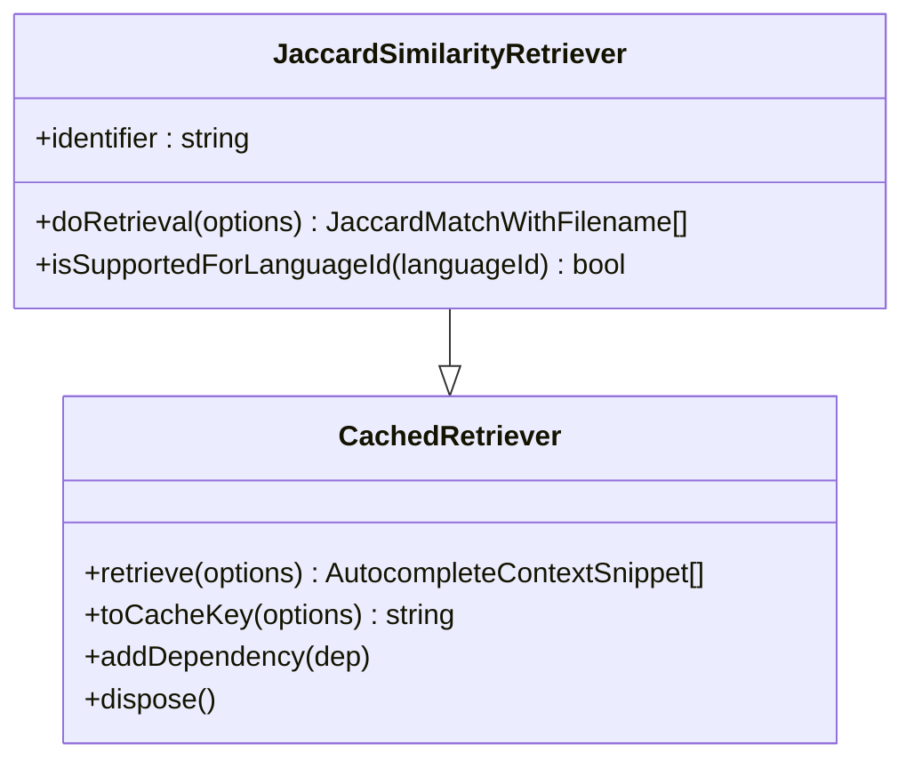
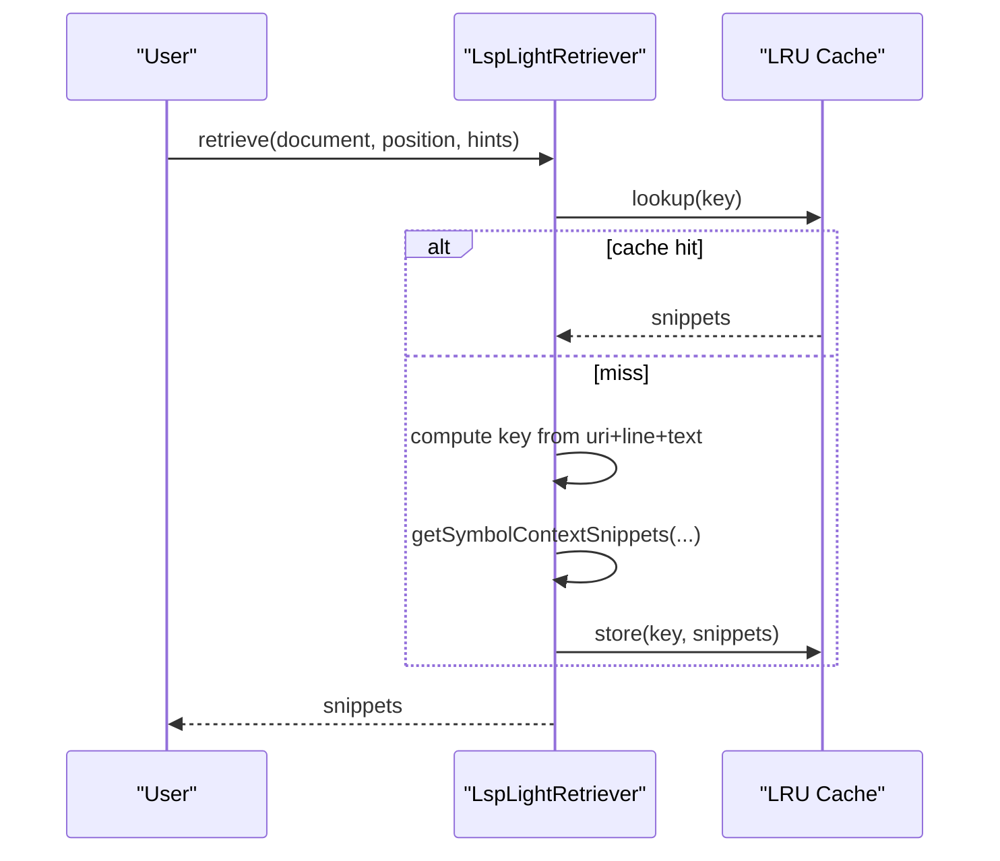
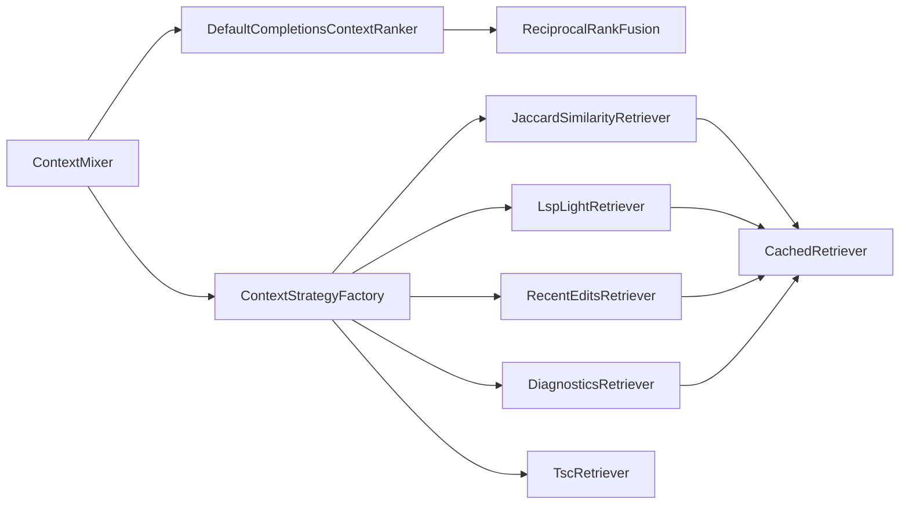
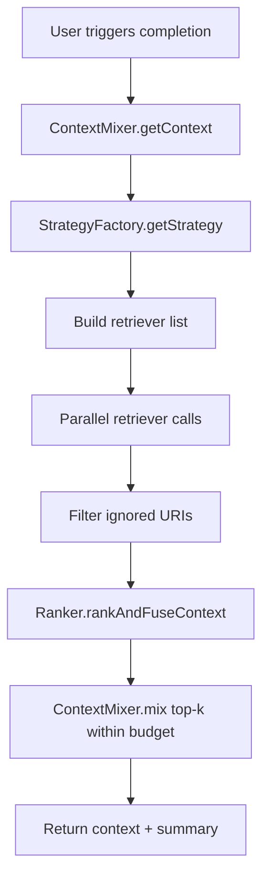
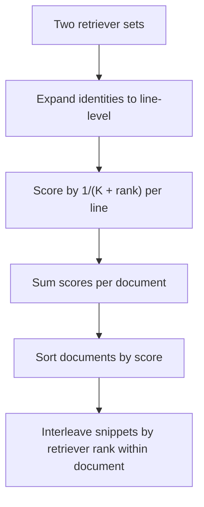

# Context Retrieval & Ranking

<cite>
**Referenced Files in This Document**
- [context-mixer.ts](file://vscode/src/completions/context/context-mixer.ts)
- [context-strategy.ts](file://vscode/src/completions/context/context-strategy.ts)
- [reciprocal-rank-fusion.ts](file://vscode/src/completions/context/reciprocal-rank-fusion.ts)
- [completions-context-ranker.ts](file://vscode/src/completions/context/completions-context-ranker.ts)
- [jaccard-similarity-retriever.ts](file://vscode/src/completions/context/retrievers/jaccard-similarity/jaccard-similarity-retriever.ts)
- [lsp-light-retriever.ts](file://vscode/src/completions/context/retrievers/lsp-light/lsp-light-retriever.ts)
- [recent-edits-retriever.ts](file://vscode/src/completions/context/retrievers/recent-user-actions/recent-edits-retriever.ts)
- [diagnostics-retriever.ts](file://vscode/src/completions/context/retrievers/recent-user-actions/diagnostics-retriever.ts)
- [cached-retriever.ts](file://vscode/src/completions/context/retrievers/cached-retriever.ts)
- [load-tsc-retriever.ts](file://vscode/src/completions/context/retrievers/tsc/load-tsc-retriever.ts)
- [context-mixer.test.ts](file://vscode/src/completions/context/context-mixer.test.ts)
- [reciprocal-rank-fusion.test.ts](file://vscode/src/completions/context/reciprocal-rank-fusion.test.ts)
- [context-strategy.test.ts](file://vscode/src/completions/context/context-strategy.test.ts)
- [context-data-logging.ts](file://vscode/src/completions/context/context-data-logging.ts)
</cite>

## Table of Contents
1. [Introduction](#introduction)
2. [Project Structure](#project-structure)
3. [Core Components](#core-components)
4. [Architecture Overview](#architecture-overview)
5. [Detailed Component Analysis](#detailed-component-analysis)
6. [Dependency Analysis](#dependency-analysis)
7. [Performance Considerations](#performance-considerations)
8. [Troubleshooting Guide](#troubleshooting-guide)
9. [Conclusion](#conclusion)
10. [Appendices](#appendices)

## Introduction
This document explains the context retrieval and ranking system used by the autocomplete pipeline. It covers the context mixer architecture that integrates multiple context sources, the reciprocal rank fusion algorithm for combining ranked results, language-specific strategies, caching and performance optimizations, and practical troubleshooting guidance. The system supports:
- Jaccard similarity matching against local editor content
- Recent user actions (edits, diagnostics, clipboard selections, viewport)
- TypeScript symbols via TSC integration
- Lightweight LSP symbol context

## Project Structure
The context system is organized under a cohesive set of modules:
- Context mixer orchestrates retrieval, filtering, ranking, and mixing
- Strategy factory selects appropriate retrievers per language and configuration
- Ranker applies RRF or time-based ranking
- Individual retrievers implement specialized strategies
- Cached retriever base class provides LRU caching and dependency-aware invalidation
- TSC and LSP-light retrievers integrate with external language servers



**Diagram sources**
- [context-mixer.ts:88-244](file://vscode/src/completions/context/context-mixer.ts#L88-L244)
- [context-strategy.ts:42-229](file://vscode/src/completions/context/context-strategy.ts#L42-L229)
- [completions-context-ranker.ts:35-154](file://vscode/src/completions/context/completions-context-ranker.ts#L35-L154)
- [reciprocal-rank-fusion.ts:38-125](file://vscode/src/completions/context/reciprocal-rank-fusion.ts#L38-L125)
- [jaccard-similarity-retriever.ts:40-99](file://vscode/src/completions/context/retrievers/jaccard-similarity/jaccard-similarity-retriever.ts#L40-L99)
- [lsp-light-retriever.ts:29-132](file://vscode/src/completions/context/retrievers/lsp-light/lsp-light-retriever.ts#L29-L132)
- [recent-edits-retriever.ts:32-84](file://vscode/src/completions/context/retrievers/recent-user-actions/recent-edits-retriever.ts#L32-L84)
- [diagnostics-retriever.ts:32-71](file://vscode/src/completions/context/retrievers/recent-user-actions/diagnostics-retriever.ts#L32-L71)
- [cached-retriever.ts:27-87](file://vscode/src/completions/context/retrievers/cached-retriever.ts#L27-L87)
- [load-tsc-retriever.ts:7-21](file://vscode/src/completions/context/retrievers/tsc/load-tsc-retriever.ts#L7-L21)

**Section sources**
- [context-mixer.ts:107-244](file://vscode/src/completions/context/context-mixer.ts#L107-L244)
- [context-strategy.ts:42-229](file://vscode/src/completions/context/context-strategy.ts#L42-L229)

## Core Components
- ContextMixer: Executes retrievers concurrently, filters ignored URIs, collects stats, and mixes results into a final context list respecting a character budget.
- ContextStrategyFactory: Selects retrievers based on configuration and language support, composing local and graph retrievers.
- DefaultCompletionsContextRanker: Applies RRF fusion, prioritizes recent edits, or linear fusion depending on strategy.
- ReciprocalRankFusion: Scores and interleaves results by line-level identities to emphasize overlapping context.
- CachedRetriever: Base class providing LRU caching, dependency tracking, and automatic invalidation on document/text changes.

**Section sources**
- [context-mixer.ts:88-244](file://vscode/src/completions/context/context-mixer.ts#L88-L244)
- [context-strategy.ts:42-229](file://vscode/src/completions/context/context-strategy.ts#L42-L229)
- [completions-context-ranker.ts:35-154](file://vscode/src/completions/context/completions-context-ranker.ts#L35-L154)
- [reciprocal-rank-fusion.ts:38-125](file://vscode/src/completions/context/reciprocal-rank-fusion.ts#L38-L125)
- [cached-retriever.ts:27-87](file://vscode/src/completions/context/retrievers/cached-retriever.ts#L27-L87)

## Architecture Overview
The system retrieves context from multiple sources, ranks and fuses them, then truncates to stay within a character budget. Graph retrievers (TSC, LSP-light) are conditionally included based on language support and strategy.



**Diagram sources**
- [context-mixer.ts:107-244](file://vscode/src/completions/context/context-mixer.ts#L107-L244)
- [context-strategy.ts:175-224](file://vscode/src/completions/context/context-strategy.ts#L175-L224)
- [completions-context-ranker.ts:38-76](file://vscode/src/completions/context/completions-context-ranker.ts#L38-L76)
- [reciprocal-rank-fusion.ts:38-125](file://vscode/src/completions/context/reciprocal-rank-fusion.ts#L38-L125)
- [jaccard-similarity-retriever.ts:53-99](file://vscode/src/completions/context/retrievers/jaccard-similarity/jaccard-similarity-retriever.ts#L53-L99)
- [lsp-light-retriever.ts:57-121](file://vscode/src/completions/context/retrievers/lsp-light/lsp-light-retriever.ts#L57-L121)
- [recent-edits-retriever.ts:52-84](file://vscode/src/completions/context/retrievers/recent-user-actions/recent-edits-retriever.ts#L52-L84)

## Detailed Component Analysis

### ContextMixer
Responsibilities:
- Resolve strategy and retrievers
- Run retrievers concurrently with timeouts and spans
- Filter out ignored URIs
- Compute per-retriever stats and total context size
- Mix fused results respecting a character budget

Key behaviors:
- Uses a 150 ms per-retriever time budget hint
- Aggregates retriever stats into a bitmap for first 32 positions
- Filters results through context filters provider



**Diagram sources**
- [context-mixer.ts:107-244](file://vscode/src/completions/context/context-mixer.ts#L107-L244)

**Section sources**
- [context-mixer.ts:107-244](file://vscode/src/completions/context/context-mixer.ts#L107-L244)

### ContextStrategyFactory
- Defines multiple strategies: none, jaccard-similarity, recent-edits(-1m/-5m), recent-edits-mixed, tsc, tsc-mixed, lsp-light, recent-copy, diagnostics, recent-view-port, auto-edit
- Builds retriever sets per strategy, including local retrievers and graph retrievers (when supported)
- Supports dynamic switching via an Observable

```mermaid
classDiagram
class DefaultContextStrategyFactory {
-allLocalRetrievers : ContextRetriever[]
-graphRetriever : ContextRetriever
+getStrategy(document) ContextStrategy
+dispose()
}
class ContextStrategy {
<<enumeration>>
"none","jaccard-similarity","recent-edits","recent-edits-1m","recent-edits-5m","recent-edits-mixed","tsc","tsc-mixed","lsp-light","recent-copy","diagnostics","recent-view-port","auto-edit"
}
DefaultContextStrategyFactory --> ContextStrategy : "selects"
```

**Diagram sources**
- [context-strategy.ts:42-229](file://vscode/src/completions/context/context-strategy.ts#L42-L229)

**Section sources**
- [context-strategy.ts:42-229](file://vscode/src/completions/context/context-strategy.ts#L42-L229)

### DefaultCompletionsContextRanker and Reciprocal Rank Fusion
- Default strategy:
  - If recent-edits present, prioritizes them and applies RRF to the remainder
  - Otherwise, applies RRF across all retrievers
- RRF scoring uses a fixed K=60 and scores by document identity expanded to line-level identities
- Linear fusion is used for recent edits to preserve temporal order



**Diagram sources**
- [completions-context-ranker.ts:69-97](file://vscode/src/completions/context/completions-context-ranker.ts#L69-L97)
- [reciprocal-rank-fusion.ts:38-125](file://vscode/src/completions/context/reciprocal-rank-fusion.ts#L38-L125)

**Section sources**
- [completions-context-ranker.ts:35-154](file://vscode/src/completions/context/completions-context-ranker.ts#L35-L154)
- [reciprocal-rank-fusion.ts:1-126](file://vscode/src/completions/context/reciprocal-rank-fusion.ts#L1-L126)

### Jaccard Similarity Retriever
- Local-only, sparse matching against open tabs and recent files
- Uses a sliding window over the editor prefix to find best matches
- Excludes matches overlapping the current context window
- Caching via CachedRetriever with dependency invalidation



**Diagram sources**
- [cached-retriever.ts:27-87](file://vscode/src/completions/context/retrievers/cached-retriever.ts#L27-L87)
- [jaccard-similarity-retriever.ts:40-99](file://vscode/src/completions/context/retrievers/jaccard-similarity/jaccard-similarity-retriever.ts#L40-L99)

**Section sources**
- [jaccard-similarity-retriever.ts:40-245](file://vscode/src/completions/context/retrievers/jaccard-similarity/jaccard-similarity-retriever.ts#L40-L245)
- [cached-retriever.ts:27-290](file://vscode/src/completions/context/retrievers/cached-retriever.ts#L27-L290)

### LSP Light Retriever
- Graph-based symbol context for supported languages
- Preload on selection changes; caches results keyed by identifier and text signature
- Invalidates cache on document changes



**Diagram sources**
- [lsp-light-retriever.ts:57-121](file://vscode/src/completions/context/retrievers/lsp-light/lsp-light-retriever.ts#L57-L121)

**Section sources**
- [lsp-light-retriever.ts:29-161](file://vscode/src/completions/context/retrievers/lsp-light/lsp-light-retriever.ts#L29-L161)

### Recent Edits Retriever
- Tracks recent changes across documents and converts them to diff hunks using pluggable strategies
- Applies LRU caching per tracked document
- Filters candidates by language compatibility

**Section sources**
- [recent-edits-retriever.ts:32-171](file://vscode/src/completions/context/retrievers/recent-user-actions/recent-edits-retriever.ts#L32-L171)

### Diagnostics Retriever
- Gathers diagnostics for notebooks or documents and formats them into context snippets
- Caches diagnostics per URI and invalidates on diagnostic changes
- Supports XML or plaintext rendering

**Section sources**
- [diagnostics-retriever.ts:32-312](file://vscode/src/completions/context/retrievers/recent-user-actions/diagnostics-retriever.ts#L32-L312)

### TSC Retriever (Lazy Load)
- Dynamically loads TSC retriever if TypeScript is available
- Used in tsc and tsc-mixed strategies

**Section sources**
- [load-tsc-retriever.ts:7-21](file://vscode/src/completions/context/retrievers/tsc/load-tsc-retriever.ts#L7-L21)

## Dependency Analysis
- ContextMixer depends on:
  - Strategy factory for retrievers
  - Ranker for fusion
  - Context filters provider for URI filtering
  - Data collection for logging snippets
- CachedRetriever underpins local retrievers and provides:
  - LRU cache
  - Dependency tracking and invalidation
  - Preload triggers on selection changes
- Strategy composition:
  - lsp-light: adds LSP-light graph retriever plus local retrievers
  - tsc/tsc-mixed: adds TSC graph retriever plus local retrievers
  - others: local retrievers only



**Diagram sources**
- [context-mixer.ts:88-244](file://vscode/src/completions/context/context-mixer.ts#L88-L244)
- [context-strategy.ts:42-229](file://vscode/src/completions/context/context-strategy.ts#L42-L229)
- [completions-context-ranker.ts:35-154](file://vscode/src/completions/context/completions-context-ranker.ts#L35-L154)
- [cached-retriever.ts:27-87](file://vscode/src/completions/context/retrievers/cached-retriever.ts#L27-L87)

**Section sources**
- [context-mixer.ts:88-244](file://vscode/src/completions/context/context-mixer.ts#L88-L244)
- [context-strategy.ts:42-229](file://vscode/src/completions/context/context-strategy.ts#L42-L229)

## Performance Considerations
- Concurrency: retrievers run in parallel with per-call timing budgets
- Caching:
  - LRU caches per retriever
  - Dependency-aware invalidation on document/text changes
  - Preload on selection changes to reduce latency
- Budgeting: ContextMixer enforces a character budget; stops adding snippets once exceeded
- Filtering: URIs ignored by filters are excluded early to save compute
- Memory:
  - LRU caches bounded by configured capacity
  - Disposal clears caches and subscriptions

Recommendations:
- Tune snippet window sizes and match limits for Jaccard similarity to balance recall vs. cost
- Adjust RRF K parameter if tuning hybrid search behavior
- Monitor retriever durations and suggest items in summaries to identify bottlenecks

**Section sources**
- [context-mixer.ts:107-244](file://vscode/src/completions/context/context-mixer.ts#L107-L244)
- [cached-retriever.ts:27-290](file://vscode/src/completions/context/retrievers/cached-retriever.ts#L27-L290)
- [jaccard-similarity-retriever.ts:30-48](file://vscode/src/completions/context/retrievers/jaccard-similarity/jaccard-similarity-retriever.ts#L30-L48)

## Troubleshooting Guide
Common issues and resolutions:
- Empty context returned
  - Verify strategy resolves to retrievers; check “none” strategy
  - Confirm context filters are not ignoring all results
- Slow context retrieval
  - Check retriever durations in context summary
  - Reduce snippet window or matches per file for Jaccard similarity
  - Limit concurrent retrievers by selecting simpler strategies
- Incorrect or stale context
  - Ensure document change events invalidate caches (LSP-light, cached retrievers)
  - For LSP-light, confirm language support and symbol resolution
- Overly large context
  - Lower maxChars or adjust context size hints
  - Review retriever stats to see which sources contribute most

Validation and tests:
- Unit tests cover fusion behavior and strategy selection
- Mixer tests validate empty/no-retriever scenarios and single-retriever behavior

**Section sources**
- [context-mixer.test.ts:73-124](file://vscode/src/completions/context/context-mixer.test.ts#L73-L124)
- [reciprocal-rank-fusion.test.ts:1-31](file://vscode/src/completions/context/reciprocal-rank-fusion.test.ts#L1-L31)
- [context-strategy.test.ts](file://vscode/src/completions/context/context-strategy.test.ts)

## Conclusion
The context retrieval and ranking system combines local and graph-based strategies with robust caching and fusion. The mixer coordinates retrieval, filters, ranking, and budgeting to produce concise, relevant context for completions. Strategies enable flexible combinations tailored to language and user actions, while caching and preloading optimize responsiveness.

## Appendices

### Configuration Options and Strategies
- Strategies (selected by configuration):
  - none, jaccard-similarity, recent-edits, recent-edits-1m, recent-edits-5m, recent-edits-mixed, tsc, tsc-mixed, lsp-light, recent-copy, diagnostics, recent-view-port, auto-edit
- Ranking strategies:
  - default (RRF), no-ranker (linear), time-based (by action timestamps)
- Retriever-specific options:
  - JaccardSimilarityRetriever: snippetWindowSize, maxMatchesPerFile
  - RecentEditsRetriever: maxAgeMs, diffStrategyList
  - DiagnosticsRetriever: contextLines, useXMLForPromptRendering, useCaretToIndicateErrorLocation
  - LspLightRetriever: supported languages and cache behavior
  - TSC retriever: lazy-loaded when TypeScript is available

**Section sources**
- [context-strategy.ts:20-35](file://vscode/src/completions/context/context-strategy.ts#L20-L35)
- [completions-context-ranker.ts:4-18](file://vscode/src/completions/context/completions-context-ranker.ts#L4-L18)
- [jaccard-similarity-retriever.ts:30-48](file://vscode/src/completions/context/retrievers/jaccard-similarity/jaccard-similarity-retriever.ts#L30-L48)
- [recent-edits-retriever.ts:19-22](file://vscode/src/completions/context/retrievers/recent-user-actions/recent-edits-retriever.ts#L19-L22)
- [diagnostics-retriever.ts:14-18](file://vscode/src/completions/context/retrievers/recent-user-actions/diagnostics-retriever.ts#L14-L18)
- [lsp-light-retriever.ts:16-23](file://vscode/src/completions/context/retrievers/lsp-light/lsp-light-retriever.ts#L16-L23)
- [load-tsc-retriever.ts:7-21](file://vscode/src/completions/context/retrievers/tsc/load-tsc-retriever.ts#L7-L21)

### Example Workflows

#### Context Retrieval and Ranking Workflow


**Diagram sources**
- [context-mixer.ts:107-244](file://vscode/src/completions/context/context-mixer.ts#L107-L244)
- [context-strategy.ts:175-224](file://vscode/src/completions/context/context-strategy.ts#L175-L224)
- [completions-context-ranker.ts:38-76](file://vscode/src/completions/context/completions-context-ranker.ts#L38-L76)

#### Reciprocal Rank Fusion Example


**Diagram sources**
- [reciprocal-rank-fusion.ts:38-125](file://vscode/src/completions/context/reciprocal-rank-fusion.ts#L38-L125)