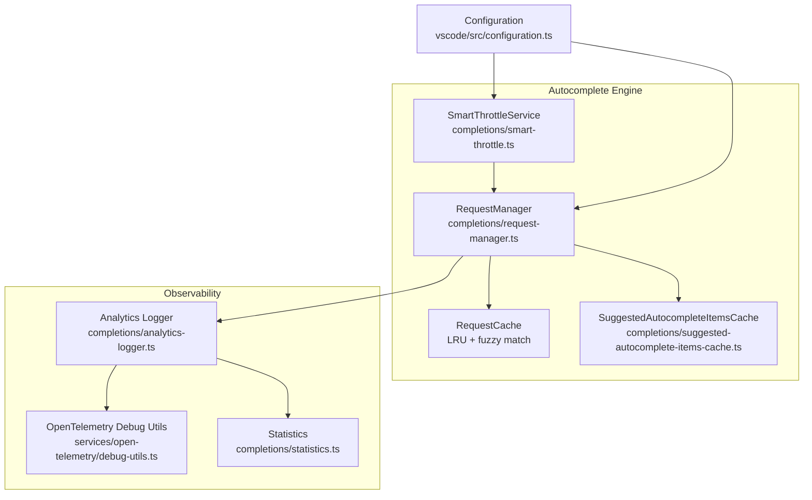
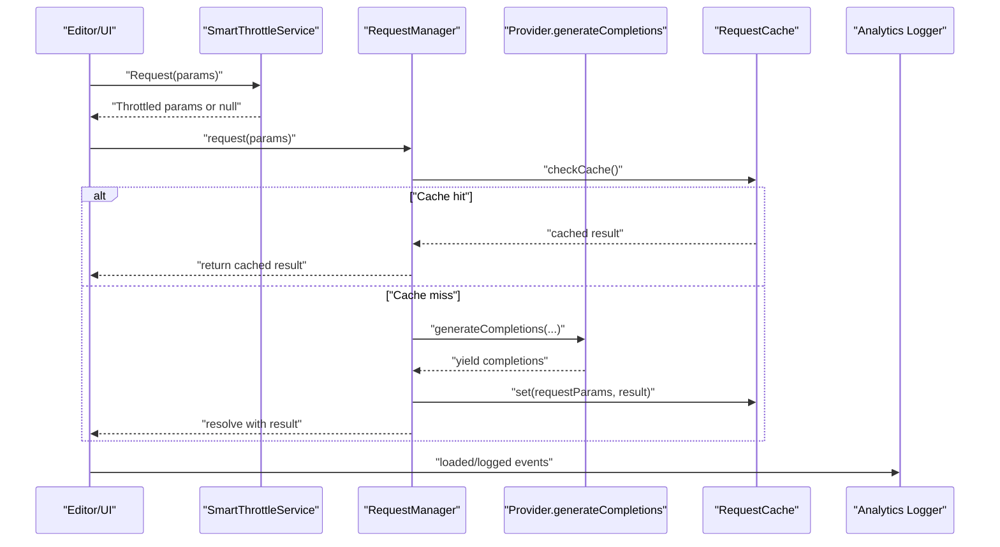
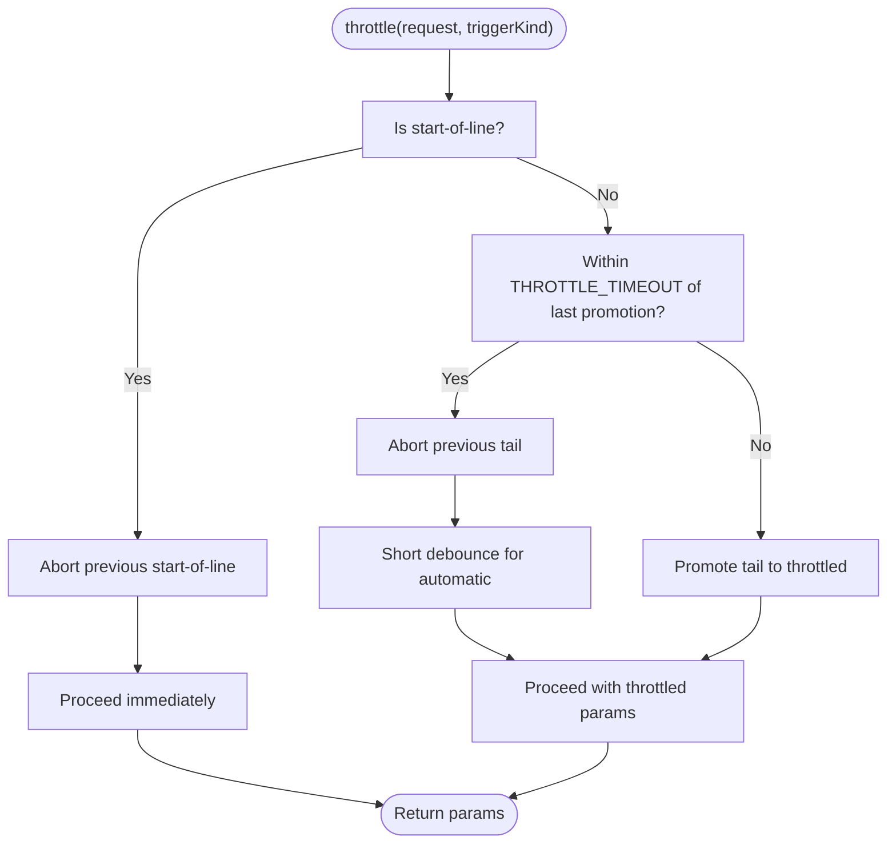
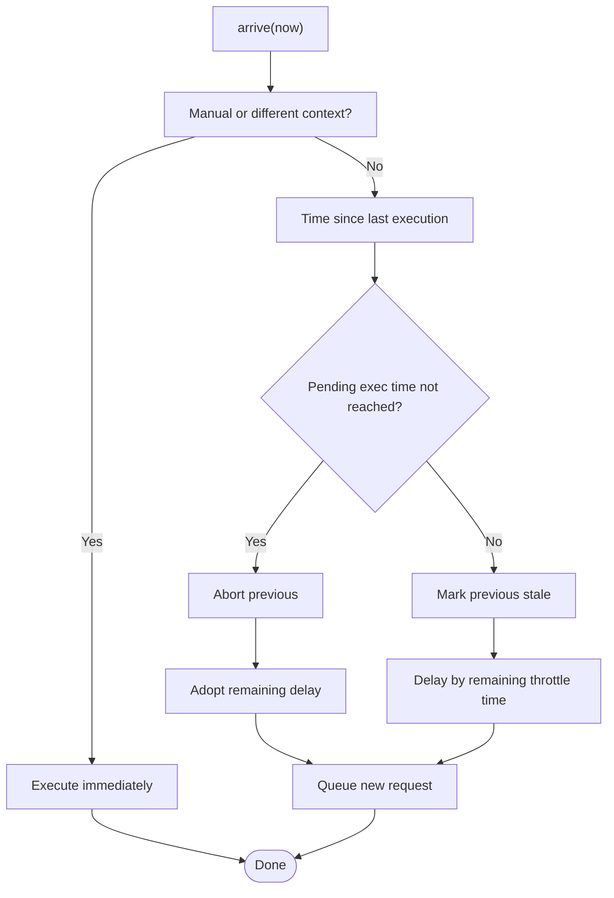
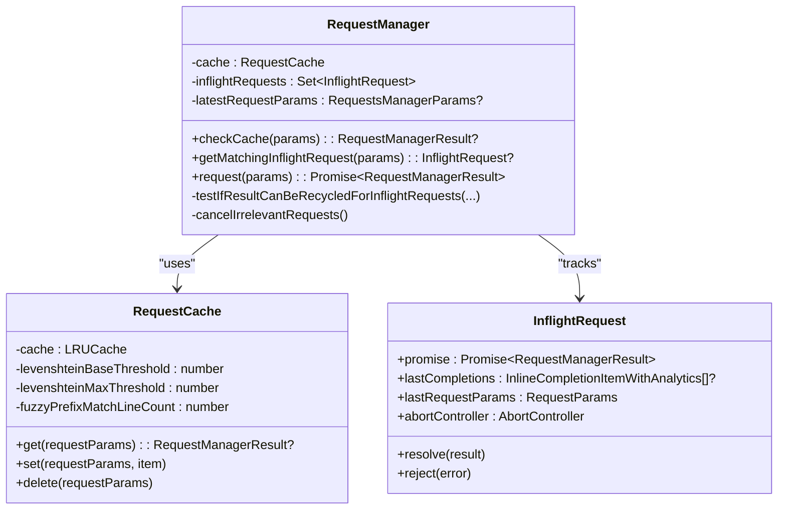
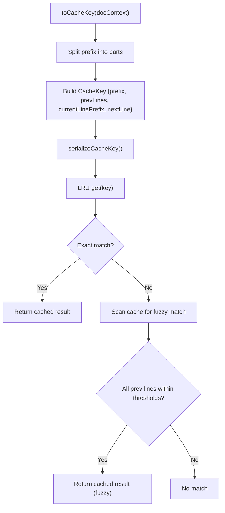
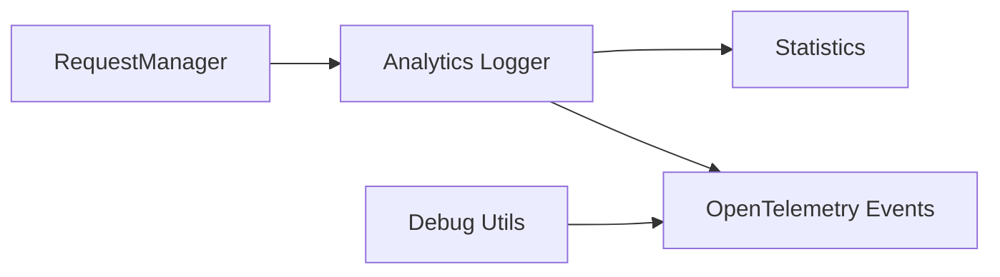
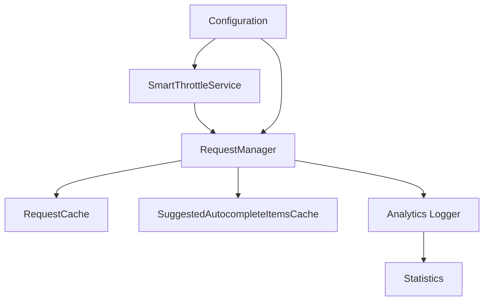

# Performance Optimization

<cite>
**Referenced Files in This Document**
- [smart-throttle.ts](file://vscode/src/completions/smart-throttle.ts)
- [request-manager.ts](file://vscode/src/completions/request-manager.ts)
- [suggested-autocomplete-items-cache.ts](file://vscode/src/completions/suggested-autocomplete-items-cache.ts)
- [analytics-logger.ts](file://vscode/src/completions/analytics-logger.ts)
- [debug-utils.ts](file://vscode/src/services/open-telemetry/debug-utils.ts)
- [configuration.ts](file://vscode/src/configuration.ts)
- [statistics.ts](file://vscode/src/completions/statistics.ts)
- [smart-throttle.ts](file://vscode/src/autoedits/smart-throttle.ts)
</cite>

## Table of Contents
1. [Introduction](#introduction)
2. [Project Structure](#project-structure)
3. [Core Components](#core-components)
4. [Architecture Overview](#architecture-overview)
5. [Detailed Component Analysis](#detailed-component-analysis)
6. [Dependency Analysis](#dependency-analysis)
7. [Performance Considerations](#performance-considerations)
8. [Troubleshooting Guide](#troubleshooting-guide)
9. [Conclusion](#conclusion)
10. [Appendices](#appendices)

## Introduction
This document explains the performance optimization strategies in the autocomplete engine, focusing on:
- Smart throttling to limit API call frequency and reduce redundant work
- Request management with queuing, prioritization, and cancellation
- Caching strategies for autocomplete items, context data, and model responses
- Performance monitoring, metrics collection, and profiling aids
- Trade-offs between responsiveness and accuracy, with practical tuning guidelines

## Project Structure
The autocomplete performance stack centers around three modules:
- Smart throttling: controls when requests are executed to balance responsiveness and cost
- Request management: orchestrates concurrent requests, caching, and cancellation
- Caching and analytics: stores and reuses results, tracks timing, and logs metrics

**Diagram sources**
- [smart-throttle.ts:1-125](file://vscode/src/completions/smart-throttle.ts#L1-L125)
- [request-manager.ts:1-530](file://vscode/src/completions/request-manager.ts#L1-L530)
- [suggested-autocomplete-items-cache.ts:1-213](file://vscode/src/completions/suggested-autocomplete-items-cache.ts#L1-L213)
- [analytics-logger.ts:1-800](file://vscode/src/completions/analytics-logger.ts#L1-L800)
- [debug-utils.ts:1-27](file://vscode/src/services/open-telemetry/debug-utils.ts#L1-L27)
- [configuration.ts:1-233](file://vscode/src/configuration.ts#L1-L233)

**Section sources**
- [smart-throttle.ts:1-125](file://vscode/src/completions/smart-throttle.ts#L1-L125)
- [request-manager.ts:1-530](file://vscode/src/completions/request-manager.ts#L1-L530)
- [suggested-autocomplete-items-cache.ts:1-213](file://vscode/src/completions/suggested-autocomplete-items-cache.ts#L1-L213)
- [analytics-logger.ts:1-800](file://vscode/src/completions/analytics-logger.ts#L1-L800)
- [debug-utils.ts:1-27](file://vscode/src/services/open-telemetry/debug-utils.ts#L1-L27)
- [configuration.ts:1-233](file://vscode/src/configuration.ts#L1-L233)

## Core Components
- SmartThrottleService: Implements a three-phase throttling strategy to reduce redundant network calls while keeping the UI responsive. It cancels stale start-of-line and tail requests, promotes old tail requests after a timeout, and applies short debounces for automatic triggers.
- RequestManager: Manages concurrent requests, caches results, recycles results across inflight requests, and cancels irrelevant requests based on document context drift.
- RequestCache: LRU cache keyed by a fuzzy document context to reuse completions across minor edits.
- SuggestedAutocompleteItemsCache: Maintains a small LRU cache of suggested items for analytics and agent tracking.
- Analytics Logger: Records lifecycle events, stage timings, and metrics for performance analysis and billing categorization.
- OpenTelemetry Debug Utils: Adds structured debug events to spans for development diagnostics.
- Configuration: Exposes tunables such as first-completion timeouts and feature flags that influence performance.

**Section sources**
- [smart-throttle.ts:11-125](file://vscode/src/completions/smart-throttle.ts#L11-L125)
- [request-manager.ts:74-303](file://vscode/src/completions/request-manager.ts#L74-L303)
- [request-manager.ts:348-459](file://vscode/src/completions/request-manager.ts#L348-L459)
- [suggested-autocomplete-items-cache.ts:101-117](file://vscode/src/completions/suggested-autocomplete-items-cache.ts#L101-L117)
- [analytics-logger.ts:636-745](file://vscode/src/completions/analytics-logger.ts#L636-L745)
- [debug-utils.ts:10-26](file://vscode/src/services/open-telemetry/debug-utils.ts#L10-L26)
- [configuration.ts:186-189](file://vscode/src/configuration.ts#L186-L189)

## Architecture Overview
The autocomplete pipeline integrates throttling, request orchestration, caching, and observability:

**Diagram sources**
- [smart-throttle.ts:33-87](file://vscode/src/completions/smart-throttle.ts#L33-L87)
- [request-manager.ts:116-214](file://vscode/src/completions/request-manager.ts#L116-L214)
- [request-manager.ts:411-447](file://vscode/src/completions/request-manager.ts#L411-L447)
- [analytics-logger.ts:694-745](file://vscode/src/completions/analytics-logger.ts#L694-L745)

## Detailed Component Analysis

### Smart Throttling (Autocomplete)
SmartThrottleService implements a three-case strategy:
- Start-of-line requests: immediately cancel prior start-of-line requests and proceed
- Tail promotion: after a configured timeout, promote the latest tail request to a throttled request
- Automatic triggers: apply a short debounce before executing

- THROTTLE_TIMEOUT is tuned to sustain a small number of concurrent requests aligned with median latency
- Abort signals are forked per request to avoid interfering with unrelated user actions

**Diagram sources**
- [smart-throttle.ts:33-87](file://vscode/src/completions/smart-throttle.ts#L33-L87)

**Section sources**
- [smart-throttle.ts:7-10](file://vscode/src/completions/smart-throttle.ts#L7-L10)
- [smart-throttle.ts:33-87](file://vscode/src/completions/smart-throttle.ts#L33-L87)
- [smart-throttle.ts:103-124](file://vscode/src/completions/smart-throttle.ts#L103-L124)

### Smart Throttling (Auto-Edits)
Auto-edits use a simpler throttle anchored to the last executed request:
- Immediate execution for manual triggers or different contexts
- Pending request adoption with adjusted delay when a new request arrives before the previous executes
- Throttle window enforcement to avoid excessive processing

**Diagram sources**
- [smart-throttle.ts:79-112](file://vscode/src/autoedits/smart-throttle.ts#L79-L112)

**Section sources**
- [smart-throttle.ts:3-4](file://vscode/src/autoedits/smart-throttle.ts#L3-L4)
- [smart-throttle.ts:79-112](file://vscode/src/autoedits/smart-throttle.ts#L79-L112)
- [smart-throttle.ts:126-159](file://vscode/src/autoedits/smart-throttle.ts#L126-L159)

### Request Management (Queuing, Prioritization, Cancellation)
RequestManager coordinates:
- Caching: LRU cache keyed by a fuzzy document context
- Inflight tracking: detects and cancels irrelevant requests
- Recycling: synthesizes results from parallel requests when safe
- Post-processing: shared processing applied to all results before caching

**Diagram sources**
- [request-manager.ts:74-303](file://vscode/src/completions/request-manager.ts#L74-L303)
- [request-manager.ts:305-332](file://vscode/src/completions/request-manager.ts#L305-L332)
- [request-manager.ts:348-459](file://vscode/src/completions/request-manager.ts#L348-L459)

**Section sources**
- [request-manager.ts:74-114](file://vscode/src/completions/request-manager.ts#L74-L114)
- [request-manager.ts:116-214](file://vscode/src/completions/request-manager.ts#L116-L214)
- [request-manager.ts:224-274](file://vscode/src/completions/request-manager.ts#L224-L274)
- [request-manager.ts:276-302](file://vscode/src/completions/request-manager.ts#L276-L302)
- [request-manager.ts:348-459](file://vscode/src/completions/request-manager.ts#L348-L459)

### Caching Strategies
- RequestCache: LRU cache keyed by a compact representation of the document context, including:
  - Prefix without current line prefix
  - Fixed number of previous non-empty lines
  - Current line prefix
  - Next non-empty line
- Fuzzy matching: Uses dynamic Levenshtein thresholds to tolerate minor edits across a bounded number of lines
- SuggestedAutocompleteItemsCache: Small LRU cache of suggested items for analytics and agent tracking

**Diagram sources**
- [request-manager.ts:366-397](file://vscode/src/completions/request-manager.ts#L366-L397)
- [request-manager.ts:399-447](file://vscode/src/completions/request-manager.ts#L399-L447)

**Section sources**
- [request-manager.ts:348-459](file://vscode/src/completions/request-manager.ts#L348-L459)
- [suggested-autocomplete-items-cache.ts:101-117](file://vscode/src/completions/suggested-autocomplete-items-cache.ts#L101-L117)

### Performance Monitoring, Metrics, and Profiling
- Analytics Logger: Tracks lifecycle events (started, loaded, suggested, accepted, partially accepted), stage timings, and metadata for billing and analysis
- Statistics: Lightweight counters for suggested and accepted completions with subscription support
- OpenTelemetry Debug Utils: Adds structured debug events to the active span in development builds

**Diagram sources**
- [analytics-logger.ts:636-745](file://vscode/src/completions/analytics-logger.ts#L636-L745)
- [statistics.ts:1-29](file://vscode/src/completions/statistics.ts#L1-L29)
- [debug-utils.ts:10-26](file://vscode/src/services/open-telemetry/debug-utils.ts#L10-L26)

**Section sources**
- [analytics-logger.ts:1-800](file://vscode/src/completions/analytics-logger.ts#L1-L800)
- [statistics.ts:1-29](file://vscode/src/completions/statistics.ts#L1-L29)
- [debug-utils.ts:1-27](file://vscode/src/services/open-telemetry/debug-utils.ts#L1-L27)

## Dependency Analysis
- SmartThrottleService depends on AbortSignals and timing utilities to coordinate request lifecycles
- RequestManager depends on Provider.generateCompletions, RequestCache, and analytics/logging
- Caches depend on LRU caches and Levenshtein distance for fuzzy matching
- Configuration influences throttling behavior and timeouts

**Diagram sources**
- [smart-throttle.ts:1-125](file://vscode/src/completions/smart-throttle.ts#L1-L125)
- [request-manager.ts:1-530](file://vscode/src/completions/request-manager.ts#L1-L530)
- [suggested-autocomplete-items-cache.ts:1-213](file://vscode/src/completions/suggested-autocomplete-items-cache.ts#L1-L213)
- [analytics-logger.ts:1-800](file://vscode/src/completions/analytics-logger.ts#L1-L800)
- [configuration.ts:186-189](file://vscode/src/configuration.ts#L186-L189)

**Section sources**
- [smart-throttle.ts:1-125](file://vscode/src/completions/smart-throttle.ts#L1-L125)
- [request-manager.ts:1-530](file://vscode/src/completions/request-manager.ts#L1-L530)
- [configuration.ts:186-189](file://vscode/src/configuration.ts#L186-L189)

## Performance Considerations
- Concurrency control: THROTTLE_TIMEOUT balances concurrent requests with median latency to avoid queue buildup
- Cancellation: Irrelevant inflight requests are aborted early to free resources
- Caching: LRU plus fuzzy matching reduces repeated network calls for similar contexts
- Recycling: Results from parallel requests can be reused when safe, reducing latency for subsequent keystrokes
- Debouncing: Short automatic debounce avoids immediate thrashing while preserving responsiveness
- Tunables: Configuration exposes first-completion timeouts and feature flags for experimentation

[No sources needed since this section provides general guidance]

## Troubleshooting Guide
- Symptom: High CPU or frequent network calls
  - Verify throttling is active and THROTTLE_TIMEOUT aligns with observed latencies
  - Check that irrelevant requests are being canceled and caches are effective
- Symptom: Slow first completion
  - Review first-completion timeout configuration and provider latency
- Symptom: Missed suggestions or stale results
  - Inspect request relevance computation and fuzzy cache thresholds
- Debugging
  - Enable OpenTelemetry debug events in development to inspect span events
  - Use analytics logs to correlate stage timings and outcomes

**Section sources**
- [smart-throttle.ts:7-10](file://vscode/src/completions/smart-throttle.ts#L7-L10)
- [request-manager.ts:276-302](file://vscode/src/completions/request-manager.ts#L276-L302)
- [request-manager.ts:466-523](file://vscode/src/completions/request-manager.ts#L466-L523)
- [debug-utils.ts:10-26](file://vscode/src/services/open-telemetry/debug-utils.ts#L10-L26)
- [configuration.ts:186-189](file://vscode/src/configuration.ts#L186-L189)

## Conclusion
The autocomplete engine achieves strong performance through:
- Smart throttling that reduces redundant work while maintaining responsiveness
- A robust request manager that queues, prioritizes, and cancels appropriately
- Effective caching with fuzzy context matching and result recycling
- Comprehensive observability for metrics and profiling

These mechanisms, combined with tunable configuration, provide a solid foundation for balancing responsiveness and accuracy.

[No sources needed since this section summarizes without analyzing specific files]

## Appendices

### Throttle Configuration Examples
- Adjust THROTTLE_TIMEOUT to match median latency and desired concurrency
- Tune first-completion timeout for provider latency characteristics
- Use feature flags to enable/disable experimental behaviors during testing

**Section sources**
- [smart-throttle.ts:7-10](file://vscode/src/completions/smart-throttle.ts#L7-L10)
- [configuration.ts:186-189](file://vscode/src/configuration.ts#L186-L189)

### Cache Tuning Guidelines
- LRU capacity: Balance memory usage vs. recall rate
- Fuzzy thresholds: Increase tolerance for minor edits; adjust based on typical noise
- Prefix line count: Larger windows improve reuse but increase matching cost

**Section sources**
- [request-manager.ts:348-459](file://vscode/src/completions/request-manager.ts#L348-L459)

### Performance Profiling Tips
- Use analytics logs to measure stage timings and source of completions
- Track suggested/accepted counts to assess UX impact
- Add OpenTelemetry debug events to pinpoint bottlenecks in development

**Section sources**
- [analytics-logger.ts:636-745](file://vscode/src/completions/analytics-logger.ts#L636-L745)
- [statistics.ts:1-29](file://vscode/src/completions/statistics.ts#L1-L29)
- [debug-utils.ts:10-26](file://vscode/src/services/open-telemetry/debug-utils.ts#L10-L26)