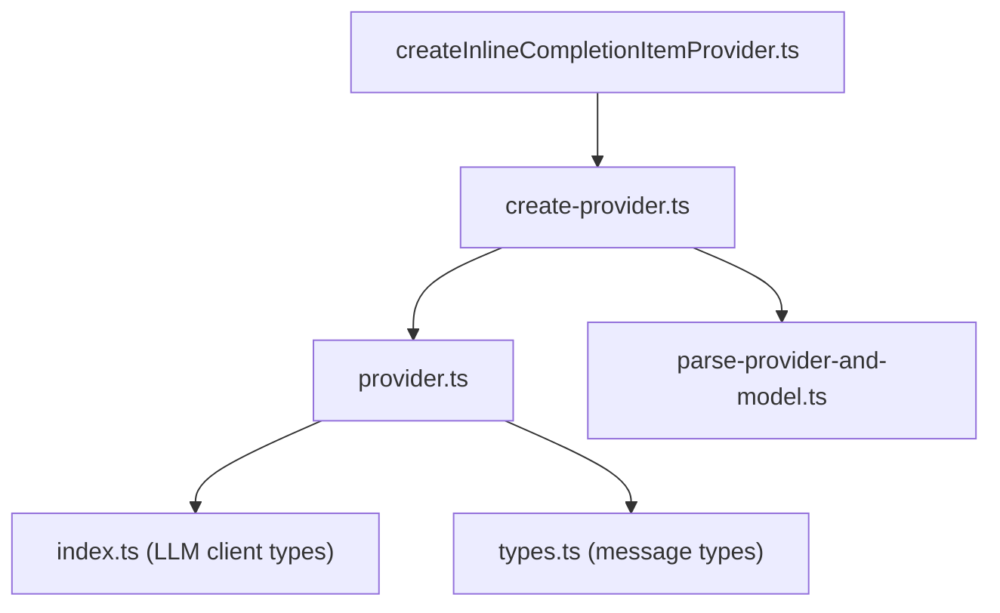
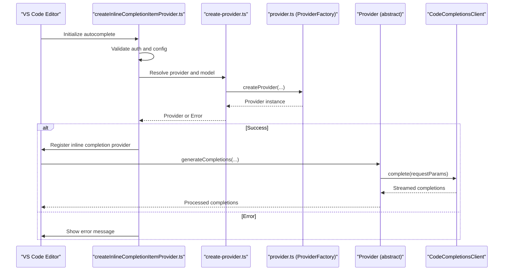
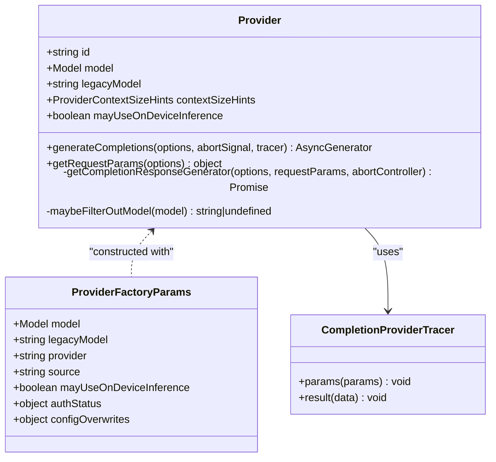
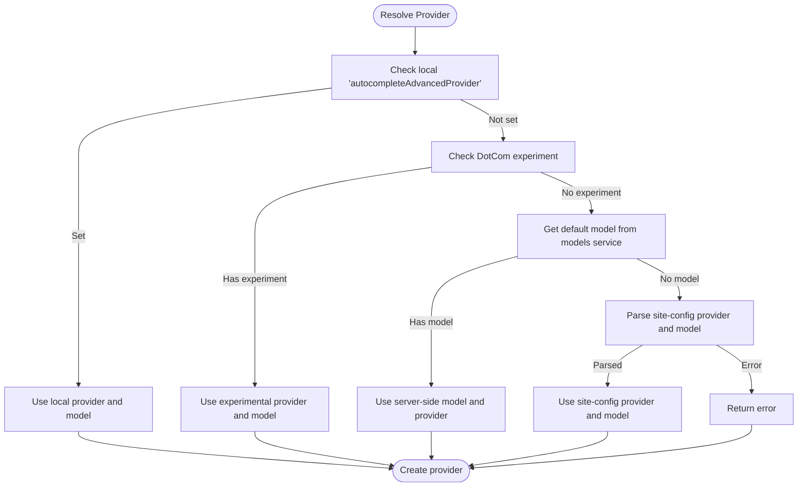
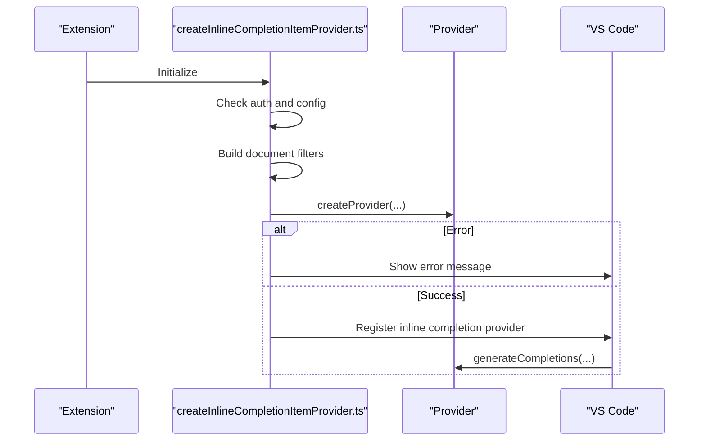
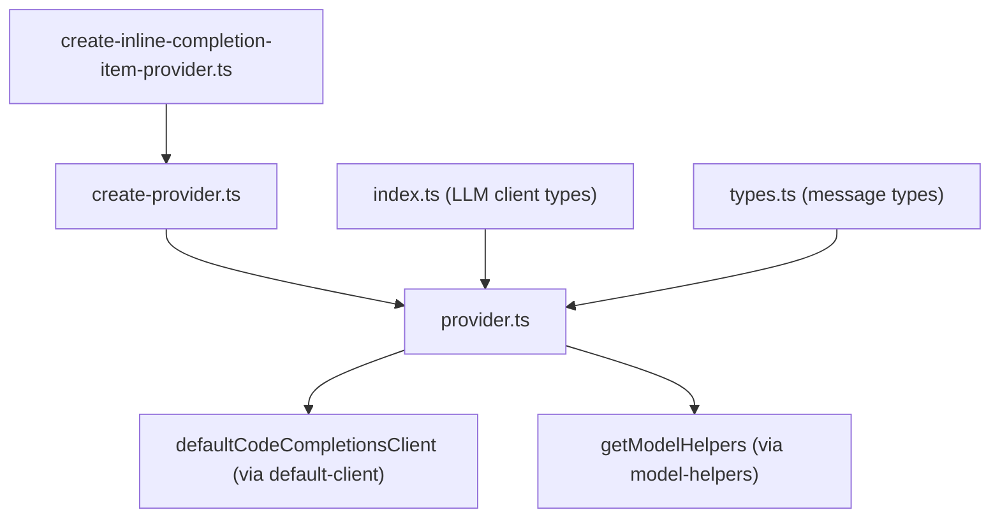

# Provider System

<cite>
**Referenced Files in This Document**
- [create-inline-completion-item-provider.ts](file://vscode/src/completions/create-inline-completion-item-provider.ts)
- [create-provider.ts](file://vscode/src/completions/providers/shared/create-provider.ts)
- [provider.ts](file://vscode/src/completions/providers/shared/provider.ts)
- [parse-provider-and-model.ts](file://vscode/src/completions/providers/shared/parse-provider-and-model.ts)
- [index.ts](file://lib/shared/src/llm-providers/index.ts)
- [types.ts](file://lib/shared/src/llm-providers/types.ts)
</cite>

## Table of Contents
1. [Introduction](#introduction)
2. [Project Structure](#project-structure)
3. [Core Components](#core-components)
4. [Architecture Overview](#architecture-overview)
5. [Detailed Component Analysis](#detailed-component-analysis)
6. [Dependency Analysis](#dependency-analysis)
7. [Performance Considerations](#performance-considerations)
8. [Troubleshooting Guide](#troubleshooting-guide)
9. [Conclusion](#conclusion)
10. [Appendices](#appendices)

## Introduction
This document explains the autocomplete provider system architecture used by the application. It covers the provider pattern implementation, the shared provider interface, factory functions, provider selection logic, model configuration, authentication handling, lifecycle management, error handling, and fallback mechanisms. It also documents configuration options, rate limiting, performance monitoring, provider-specific features, limitations, and optimization strategies. Finally, it provides practical guidance for implementing custom providers and integrating new AI services.

## Project Structure
The provider system spans several modules:
- The creation and registration pipeline for inline completion providers
- Shared provider abstractions and factories
- Provider selection logic and configuration parsing
- Low-level LLM client interfaces and message types

**Diagram sources**
- [create-inline-completion-item-provider.ts:1-131](file://vscode/src/completions/create-inline-completion-item-provider.ts#L1-L131)
- [create-provider.ts:1-261](file://vscode/src/completions/providers/shared/create-provider.ts#L1-L261)
- [provider.ts:1-329](file://vscode/src/completions/providers/shared/provider.ts#L1-L329)
- [parse-provider-and-model.ts:1-45](file://vscode/src/completions/providers/shared/parse-provider-and-model.ts#L1-L45)
- [index.ts:1-24](file://lib/shared/src/llm-providers/index.ts#L1-L24)
- [types.ts:1-8](file://lib/shared/src/llm-providers/types.ts#L1-L8)

**Section sources**
- [create-inline-completion-item-provider.ts:1-131](file://vscode/src/completions/create-inline-completion-item-provider.ts#L1-L131)
- [create-provider.ts:1-261](file://vscode/src/completions/providers/shared/create-provider.ts#L1-L261)
- [provider.ts:1-329](file://vscode/src/completions/providers/shared/provider.ts#L1-L329)
- [parse-provider-and-model.ts:1-45](file://vscode/src/completions/providers/shared/parse-provider-and-model.ts#L1-L45)
- [index.ts:1-24](file://lib/shared/src/llm-providers/index.ts#L1-L24)
- [types.ts:1-8](file://lib/shared/src/llm-providers/types.ts#L1-L8)

## Core Components
- Provider abstraction: Defines the contract for generating completions, including request parameter construction, context size hints, and generation lifecycle.
- Factory functions: Create provider instances based on resolved configuration and provider ID.
- Selection logic: Resolves the provider and model from local settings, experiments, server-side model configuration, or site configuration.
- Registration pipeline: Creates providers, registers them with the editor, and wires up tracing and status reporting.

Key responsibilities:
- Provider: Encapsulates model identity, context limits, request defaults, and generation logic.
- Factory: Translates configuration into a concrete provider instance.
- Selection: Chooses provider and model via precedence rules and handles fallbacks.
- Registration: Integrates providers into the editor’s language service.

**Section sources**
- [provider.ts:136-309](file://vscode/src/completions/providers/shared/provider.ts#L136-L309)
- [create-provider.ts:31-130](file://vscode/src/completions/providers/shared/create-provider.ts#L31-L130)
- [create-inline-completion-item-provider.ts:31-107](file://vscode/src/completions/create-inline-completion-item-provider.ts#L31-L107)

## Architecture Overview
The provider system follows a layered design:
- Editor integration creates and registers providers based on configuration and authentication state.
- Provider selection resolves the effective provider and model from multiple sources.
- Providers implement a common interface to generate completions via a shared client.

**Diagram sources**
- [create-inline-completion-item-provider.ts:31-107](file://vscode/src/completions/create-inline-completion-item-provider.ts#L31-L107)
- [create-provider.ts:31-130](file://vscode/src/completions/providers/shared/create-provider.ts#L31-L130)
- [provider.ts:136-309](file://vscode/src/completions/providers/shared/provider.ts#L136-L309)

## Detailed Component Analysis

### Shared Provider Interface and Lifecycle
The Provider class defines:
- Identity and model metadata
- Context size hints and token-to-character conversions
- Default request parameters (timeout, stop sequences, sampling)
- Generation lifecycle: constructing request parameters, invoking the client, processing streamed responses, and applying model-specific post-processing

Lifecycle highlights:
- Construction computes context size hints and initializes model helpers.
- Generation wraps client calls with timeouts and error observers.
- Post-processing adapts completions to the specific model’s output format.

**Diagram sources**
- [provider.ts:136-329](file://vscode/src/completions/providers/shared/provider.ts#L136-L329)

**Section sources**
- [provider.ts:136-309](file://vscode/src/completions/providers/shared/provider.ts#L136-L309)

### Provider Selection Logic and Model Configuration
Provider selection resolves the effective provider and model from multiple sources in order of precedence:
- Local editor settings (advanced provider override)
- DotCom experiment (feature flags)
- Server-side model configuration (models service)
- Site configuration (fallback)

The selection logic maps provider IDs to factory functions and applies special cases (for example, Bedrock or Google/Gemini model naming).

**Diagram sources**
- [create-provider.ts:31-130](file://vscode/src/completions/providers/shared/create-provider.ts#L31-L130)
- [create-provider.ts:143-176](file://vscode/src/completions/providers/shared/create-provider.ts#L143-L176)
- [create-provider.ts:183-231](file://vscode/src/completions/providers/shared/create-provider.ts#L183-L231)

**Section sources**
- [create-provider.ts:31-130](file://vscode/src/completions/providers/shared/create-provider.ts#L31-L130)
- [create-provider.ts:143-176](file://vscode/src/completions/providers/shared/create-provider.ts#L143-L176)
- [create-provider.ts:183-231](file://vscode/src/completions/providers/shared/create-provider.ts#L183-L231)

### Authentication and Registration Pipeline
The registration pipeline validates authentication and configuration, constructs provider filters for supported languages, and registers the provider with the editor. It also wires up tracing and status reporting.

Key steps:
- Verify authentication and configuration presence
- Compute document filters for enabled languages
- Create provider via factory
- On error, log and surface messages to the UI or throw in agent mode
- Instantiate the editor provider and register it

**Diagram sources**
- [create-inline-completion-item-provider.ts:31-107](file://vscode/src/completions/create-inline-completion-item-provider.ts#L31-L107)

**Section sources**
- [create-inline-completion-item-provider.ts:31-107](file://vscode/src/completions/create-inline-completion-item-provider.ts#L31-L107)

### Provider-Specific Features, Limitations, and Optimizations
- Context size hints: Derived from token budgets to balance prefix/suffix/context while reserving headroom for prompts.
- Request defaults: Standardized timeout, stop sequences, sampling parameters, and maximum response tokens.
- Model-specific post-processing: Applied via model helpers to normalize provider outputs.
- Compatibility handling: Detects unsupported model errors and adapts behavior for older backends.
- Parallel generation: Generates multiple completions concurrently and zips results to maintain synchronous semantics for the consumer.

Optimization strategies:
- Tune first-completion timeout and request parameters per provider.
- Adjust max context tokens and response tokens to balance latency and quality.
- Use model-specific post-processing to reduce downstream normalization work.

**Section sources**
- [provider.ts:33-78](file://vscode/src/completions/providers/shared/provider.ts#L33-L78)
- [provider.ts:163-169](file://vscode/src/completions/providers/shared/provider.ts#L163-L169)
- [provider.ts:227-308](file://vscode/src/completions/providers/shared/provider.ts#L227-L308)

### Implementing Custom Providers and Integrating New AI Services
Steps to add a new provider:
1. Define a factory function that accepts ProviderFactoryParams and returns a concrete Provider subclass.
2. Add a mapping from the provider ID to your factory in the selector logic.
3. Implement getRequestParams to construct request parameters for your service.
4. Integrate with the shared client and handle streaming responses.
5. Optionally implement model-specific post-processing and adjust context size hints.

Guidance:
- Reuse the shared client and tracer interfaces.
- Honor request defaults and timeouts.
- Surface meaningful errors and leverage fallbacks.

**Section sources**
- [create-provider.ts:183-231](file://vscode/src/completions/providers/shared/create-provider.ts#L183-L231)
- [provider.ts:136-170](file://vscode/src/completions/providers/shared/provider.ts#L136-L170)

## Dependency Analysis
The provider system depends on:
- Editor integration for registration and configuration
- Shared client for LLM network calls
- Model helpers for provider-specific adjustments
- Tracing and status reporting for observability

**Diagram sources**
- [provider.ts:21-25](file://vscode/src/completions/providers/shared/provider.ts#L21-L25)
- [create-provider.ts:20-25](file://vscode/src/completions/providers/shared/create-provider.ts#L20-L25)
- [create-inline-completion-item-provider.ts:19-22](file://vscode/src/completions/create-inline-completion-item-provider.ts#L19-L22)
- [index.ts:1-24](file://lib/shared/src/llm-providers/index.ts#L1-L24)
- [types.ts:1-8](file://lib/shared/src/llm-providers/types.ts#L1-L8)

**Section sources**
- [provider.ts:1-329](file://vscode/src/completions/providers/shared/provider.ts#L1-L329)
- [create-provider.ts:1-261](file://vscode/src/completions/providers/shared/create-provider.ts#L1-L261)
- [create-inline-completion-item-provider.ts:1-131](file://vscode/src/completions/create-inline-completion-item-provider.ts#L1-L131)
- [index.ts:1-24](file://lib/shared/src/llm-providers/index.ts#L1-L24)
- [types.ts:1-8](file://lib/shared/src/llm-providers/types.ts#L1-L8)

## Performance Considerations
- Latency-sensitive defaults: Requests are bounded by a fixed timeout and stop sequences to minimize perceived latency.
- Streaming processing: Responses are processed incrementally to improve responsiveness.
- Concurrency: Multiple completions can be generated in parallel; results are coordinated to preserve synchronous semantics.
- Context trimming: Context size hints enforce upper bounds on prefix/suffix lengths to prevent oversized prompts.

Recommendations:
- Monitor first-completion timeout and adjust per environment.
- Tune max context tokens and response tokens to balance quality and speed.
- Use model-specific post-processing to reduce downstream overhead.

**Section sources**
- [provider.ts:163-169](file://vscode/src/completions/providers/shared/provider.ts#L163-L169)
- [provider.ts:227-308](file://vscode/src/completions/providers/shared/provider.ts#L227-L308)

## Troubleshooting Guide
Common issues and resolutions:
- Authentication failure: If not authenticated, provider creation is skipped and a debug log is emitted. Ensure proper sign-in.
- Provider creation errors: Errors are logged and surfaced to the UI; in agent mode, initialization fails with detailed configuration context.
- Unsupported model errors: Detected automatically; the client adapts to older backend compatibility modes.
- Configuration precedence: If server-side model configuration is unavailable, the system falls back to site configuration parsing.

Actions:
- Review configuration sources in order of precedence.
- Validate provider ID and model name resolution.
- Inspect logs for detailed error messages and configuration snapshots.

**Section sources**
- [create-inline-completion-item-provider.ts:41-71](file://vscode/src/completions/create-inline-completion-item-provider.ts#L41-L71)
- [create-provider.ts:166-175](file://vscode/src/completions/providers/shared/create-provider.ts#L166-L175)
- [provider.ts:259-278](file://vscode/src/completions/providers/shared/provider.ts#L259-L278)

## Conclusion
The provider system offers a robust, extensible framework for autocomplete generation across multiple AI services. Its layered design separates concerns between selection, instantiation, and generation, while shared abstractions and defaults simplify integration. By following the documented patterns and leveraging the provided utilities, teams can reliably add new providers and optimize performance for diverse environments.

## Appendices

### Provider Configuration Options
- Local overrides: Advanced provider and model selection via editor settings.
- Experimentation: DotCom feature flags can route users to experimental models/providers.
- Server-side configuration: Models service supplies default models and provider mappings.
- Site configuration: Legacy configuration path for provider and model identification.

**Section sources**
- [create-provider.ts:236-258](file://vscode/src/completions/providers/shared/create-provider.ts#L236-L258)

### Rate Limiting and Monitoring
- Request timeouts: Enforced per request to bound latency.
- Streaming monitoring: Tracer interface captures request parameters and results for diagnostics.
- Status reporting: Integration with status bar and telemetry for visibility.

**Section sources**
- [provider.ts:163-169](file://vscode/src/completions/providers/shared/provider.ts#L163-L169)
- [provider.ts:314-328](file://vscode/src/completions/providers/shared/provider.ts#L314-L328)
- [create-inline-completion-item-provider.ts:19-22](file://vscode/src/completions/create-inline-completion-item-provider.ts#L19-L22)

### Provider-Specific Notes
- Model naming: Some providers require parsing composite model names (for example, sourcegraph-delimited names).
- Compatibility: Automatic detection of unsupported model identifiers and graceful degradation.

**Section sources**
- [parse-provider-and-model.ts:6-39](file://vscode/src/completions/providers/shared/parse-provider-and-model.ts#L6-L39)
- [provider.ts:211-225](file://vscode/src/completions/providers/shared/provider.ts#L211-L225)