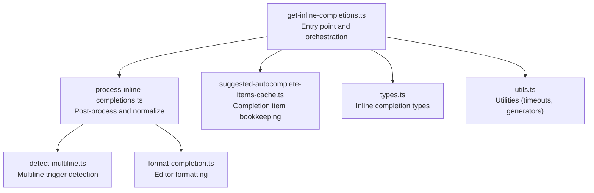
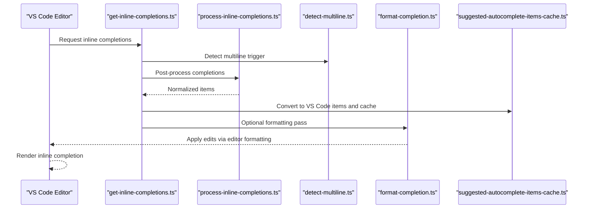
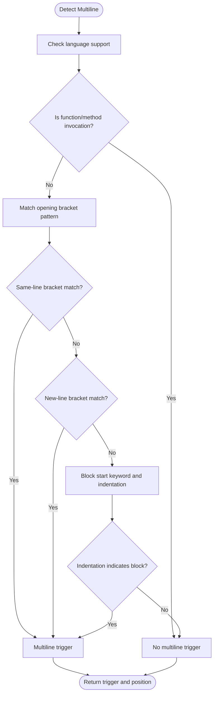
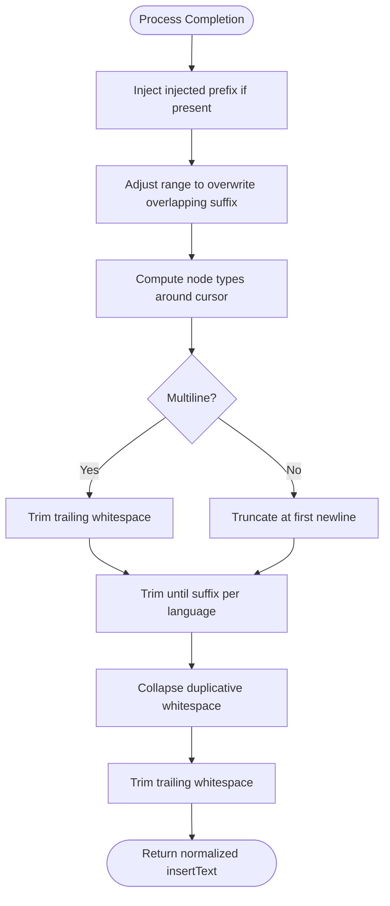
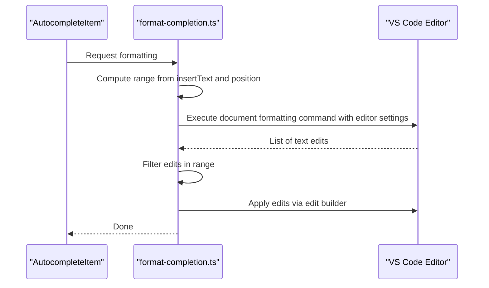
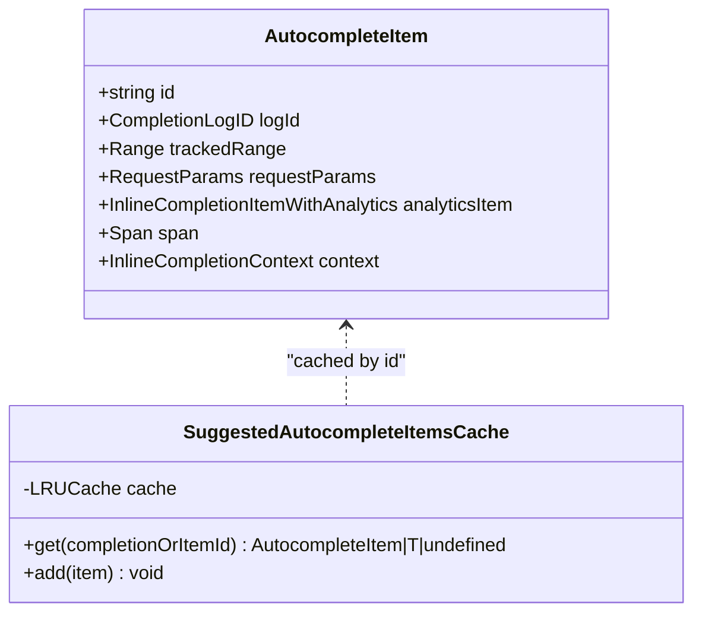
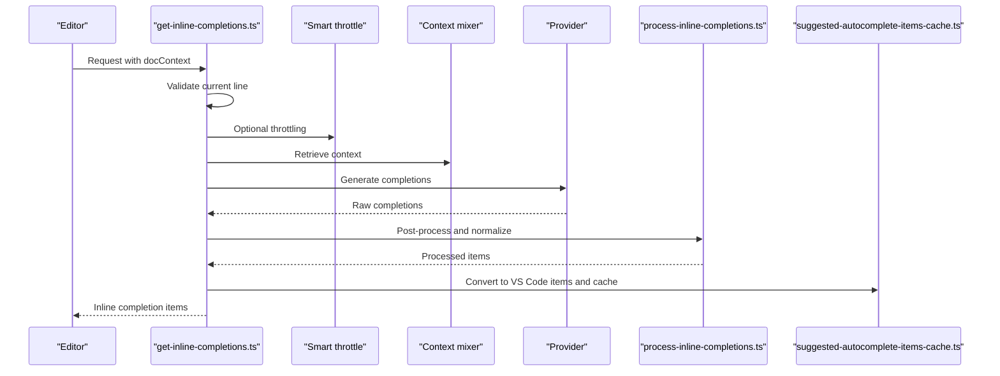
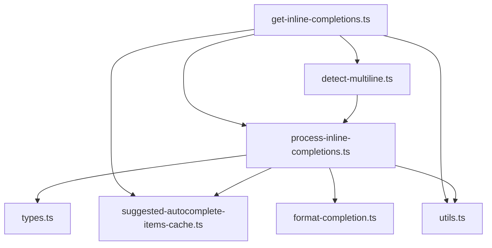

# Text Processing & Formatting

<cite>
**Referenced Files in This Document**
- [format-completion.ts](file://vscode/src/completions/format-completion.ts)
- [detect-multiline.ts](file://vscode/src/completions/detect-multiline.ts)
- [get-inline-completions.ts](file://vscode/src/completions/get-inline-completions.ts)
- [process-inline-completions.ts](file://vscode/src/completions/text-processing/process-inline-completions.ts)
- [suggested-autocomplete-items-cache.ts](file://vscode/src/completions/suggested-autocomplete-items-cache.ts)
- [types.ts](file://vscode/src/completions/types.ts)
- [utils.ts](file://vscode/src/completions/utils.ts)
</cite>

## Table of Contents
1. [Introduction](#introduction)
2. [Project Structure](#project-structure)
3. [Core Components](#core-components)
4. [Architecture Overview](#architecture-overview)
5. [Detailed Component Analysis](#detailed-component-analysis)
6. [Dependency Analysis](#dependency-analysis)
7. [Performance Considerations](#performance-considerations)
8. [Troubleshooting Guide](#troubleshooting-guide)
9. [Conclusion](#conclusion)
10. [Appendices](#appendices)

## Introduction
This document explains the text processing pipeline for inline code completions, focusing on parsing, formatting, and post-processing. It covers:
- Completion parsing and truncation strategies for single-line vs. multiline contexts
- Smart indentation handling and whitespace normalization
- Formatting options including editor defaults and syntax-aware beautification
- Validation, sanitization, and security considerations
- Examples of workflows, language-specific handling, and custom formatting rules
- Configuration options affecting completion behavior, truncation limits, and formatting preferences

## Project Structure
The text processing pipeline resides under the completions subsystem. Key areas:
- Multiline detection and trigger logic
- Post-processing and ranking of parsed completions
- Editor-side formatting using VS Code’s formatter APIs
- Caching and conversion of completion items for VS Code’s inline completion API

**Diagram sources**
- [get-inline-completions.ts:184-527](file://vscode/src/completions/get-inline-completions.ts#L184-L527)
- [process-inline-completions.ts:36-134](file://vscode/src/completions/text-processing/process-inline-completions.ts#L36-L134)
- [detect-multiline.ts:59-161](file://vscode/src/completions/detect-multiline.ts#L59-L161)
- [format-completion.ts:8-58](file://vscode/src/completions/format-completion.ts#L8-L58)
- [suggested-autocomplete-items-cache.ts:101-213](file://vscode/src/completions/suggested-autocomplete-items-cache.ts#L101-L213)
- [types.ts:9-62](file://vscode/src/completions/types.ts#L9-L62)
- [utils.ts:32-103](file://vscode/src/completions/utils.ts#L32-L103)

**Section sources**
- [get-inline-completions.ts:184-527](file://vscode/src/completions/get-inline-completions.ts#L184-L527)
- [process-inline-completions.ts:36-134](file://vscode/src/completions/text-processing/process-inline-completions.ts#L36-L134)
- [detect-multiline.ts:59-161](file://vscode/src/completions/detect-multiline.ts#L59-L161)
- [format-completion.ts:8-58](file://vscode/src/completions/format-completion.ts#L8-L58)
- [suggested-autocomplete-items-cache.ts:101-213](file://vscode/src/completions/suggested-autocomplete-items-cache.ts#L101-L213)
- [types.ts:9-62](file://vscode/src/completions/types.ts#L9-L62)
- [utils.ts:32-103](file://vscode/src/completions/utils.ts#L32-L103)

## Core Components
- Multiline detection: Determines whether a completion should span multiple lines based on language context and bracket/block markers.
- Post-processing: Removes low-quality results, deduplicates, ranks, truncates, trims, and normalizes whitespace.
- Editor formatting: Applies VS Code’s formatter to the affected region using configured tab size and insert spaces.
- Completion item lifecycle: Converts provider results into VS Code-compatible items, tracks ranges, and caches items for analytics and acceptance callbacks.

**Section sources**
- [detect-multiline.ts:59-161](file://vscode/src/completions/detect-multiline.ts#L59-L161)
- [process-inline-completions.ts:36-134](file://vscode/src/completions/text-processing/process-inline-completions.ts#L36-L134)
- [format-completion.ts:8-58](file://vscode/src/completions/format-completion.ts#L8-L58)
- [suggested-autocomplete-items-cache.ts:101-213](file://vscode/src/completions/suggested-autocomplete-items-cache.ts#L101-L213)

## Architecture Overview
The pipeline integrates provider-generated completions with VS Code’s inline completion API and editor formatting.

**Diagram sources**
- [get-inline-completions.ts:184-527](file://vscode/src/completions/get-inline-completions.ts#L184-L527)
- [process-inline-completions.ts:36-134](file://vscode/src/completions/text-processing/process-inline-completions.ts#L36-L134)
- [detect-multiline.ts:59-161](file://vscode/src/completions/detect-multiline.ts#L59-L161)
- [format-completion.ts:8-58](file://vscode/src/completions/format-completion.ts#L8-L58)
- [suggested-autocomplete-items-cache.ts:125-181](file://vscode/src/completions/suggested-autocomplete-items-cache.ts#L125-L181)

## Detailed Component Analysis

### Multiline Detection
Purpose: Decide when to allow completions to continue onto subsequent lines based on language constructs and indentation.

Key behaviors:
- Excludes invocation contexts (e.g., function or method calls) and unsupported languages.
- Triggers on opening brackets or block-start keywords when indentation indicates a new block.
- Computes a precise trigger position to adjust during streaming.

**Diagram sources**
- [detect-multiline.ts:59-161](file://vscode/src/completions/detect-multiline.ts#L59-L161)

**Section sources**
- [detect-multiline.ts:59-161](file://vscode/src/completions/detect-multiline.ts#L59-L161)

### Post-Processing and Truncation
Purpose: Normalize, truncate, and prepare completions for insertion.

Key steps:
- Remove low-quality or prompt-like continuations.
- Deduplicate by insert text.
- Rank by parse error presence and line count.
- Truncate:
  - Multiline: remove trailing whitespace.
  - Single-line: keep only up to the first newline.
- Trim suffix overlap with current line suffix.
- Collapse duplicative whitespace based on prefix context.
- Trim trailing whitespace.

**Diagram sources**
- [process-inline-completions.ts:69-134](file://vscode/src/completions/text-processing/process-inline-completions.ts#L69-L134)

**Section sources**
- [process-inline-completions.ts:36-134](file://vscode/src/completions/text-processing/process-inline-completions.ts#L36-L134)

### Editor Formatting
Purpose: Apply editor formatting to the region covered by the completion to ensure consistent indentation and style.

Key steps:
- Determine the range to format (from start of current line to end of completion).
- Query VS Code’s formatter with current editor tab size and insert-spaces settings.
- Filter edits that fall within the target range and apply them via an edit builder.
- Record timing and formatter identity for telemetry.

**Diagram sources**
- [format-completion.ts:8-58](file://vscode/src/completions/format-completion.ts#L8-L58)

**Section sources**
- [format-completion.ts:8-58](file://vscode/src/completions/format-completion.ts#L8-L58)

### Completion Item Lifecycle and Caching
Purpose: Bridge provider results to VS Code’s inline completion API, track ranges, and maintain a cache for analytics and acceptance.

Highlights:
- Convert provider items to VS Code-compatible items.
- Adjust insert ranges to start at the beginning of the current line to reduce UI jitter.
- Track ranges for post-insert monitoring.
- Cache items by UUID for later analytics and acceptance callbacks.

**Diagram sources**
- [suggested-autocomplete-items-cache.ts:23-91](file://vscode/src/completions/suggested-autocomplete-items-cache.ts#L23-L91)
- [suggested-autocomplete-items-cache.ts:101-181](file://vscode/src/completions/suggested-autocomplete-items-cache.ts#L101-L181)

**Section sources**
- [suggested-autocomplete-items-cache.ts:101-213](file://vscode/src/completions/suggested-autocomplete-items-cache.ts#L101-L213)

### Orchestration and Workflows
Purpose: Coordinate context retrieval, provider generation, caching, and result processing.

Key stages:
- Validate current line conditions to avoid triggering on word suffixes or closing symbols.
- Reuse last candidate when appropriate to minimize latency.
- Optionally throttle and debounce based on trigger kind and multiline mode.
- Retrieve context, generate completions, and process results.
- Convert to VS Code items and optionally apply formatting.

**Diagram sources**
- [get-inline-completions.ts:184-527](file://vscode/src/completions/get-inline-completions.ts#L184-L527)
- [process-inline-completions.ts:36-134](file://vscode/src/completions/text-processing/process-inline-completions.ts#L36-L134)
- [suggested-autocomplete-items-cache.ts:125-181](file://vscode/src/completions/suggested-autocomplete-items-cache.ts#L125-L181)

**Section sources**
- [get-inline-completions.ts:184-527](file://vscode/src/completions/get-inline-completions.ts#L184-L527)

## Dependency Analysis
- Multiline detection depends on language configuration and line context utilities.
- Post-processing relies on tree-sitter parse trees for node type inference and on whitespace normalization utilities.
- Formatting depends on VS Code’s formatter command and editor settings.
- Caching depends on VS Code’s inline completion types and analytics identifiers.

**Diagram sources**
- [detect-multiline.ts:59-161](file://vscode/src/completions/detect-multiline.ts#L59-L161)
- [process-inline-completions.ts:36-134](file://vscode/src/completions/text-processing/process-inline-completions.ts#L36-L134)
- [types.ts:9-62](file://vscode/src/completions/types.ts#L9-L62)
- [suggested-autocomplete-items-cache.ts:101-213](file://vscode/src/completions/suggested-autocomplete-items-cache.ts#L101-L213)
- [utils.ts:32-103](file://vscode/src/completions/utils.ts#L32-L103)
- [format-completion.ts:8-58](file://vscode/src/completions/format-completion.ts#L8-L58)
- [get-inline-completions.ts:184-527](file://vscode/src/completions/get-inline-completions.ts#L184-L527)

**Section sources**
- [detect-multiline.ts:59-161](file://vscode/src/completions/detect-multiline.ts#L59-L161)
- [process-inline-completions.ts:36-134](file://vscode/src/completions/text-processing/process-inline-completions.ts#L36-L134)
- [types.ts:9-62](file://vscode/src/completions/types.ts#L9-L62)
- [suggested-autocomplete-items-cache.ts:101-213](file://vscode/src/completions/suggested-autocomplete-items-cache.ts#L101-L213)
- [utils.ts:32-103](file://vscode/src/completions/utils.ts#L32-L103)
- [format-completion.ts:8-58](file://vscode/src/completions/format-completion.ts#L8-L58)
- [get-inline-completions.ts:184-527](file://vscode/src/completions/get-inline-completions.ts#L184-L527)

## Performance Considerations
- Debounce and smart throttle reduce redundant work and improve responsiveness.
- Early cancellation on invalid current-line suffixes prevents unnecessary network calls.
- Formatting is scoped to the affected range and filtered to edits inside that range.
- LRU caching of suggested items minimizes repeated conversions and improves acceptance callback performance.

[No sources needed since this section provides general guidance]

## Troubleshooting Guide
Common issues and mitigations:
- Unexpected single-line truncation in multiline contexts:
  - Verify that multiline detection recognizes the language and indentation pattern.
  - Confirm that the completion is not excluded due to invocation context.
- Formatting not applied:
  - Ensure the editor’s default formatter is configured for the language or globally.
  - Confirm that the computed range overlaps with the formatted edits.
- UI jitter or overlapping characters:
  - Adjust insert ranges to start at the beginning of the current line.
  - Use range adjustment logic to overwrite suffix overlap.
- Low-quality completions:
  - Post-processing removes short or prompt-like continuations; consider adjusting provider settings or context.

**Section sources**
- [detect-multiline.ts:59-161](file://vscode/src/completions/detect-multiline.ts#L59-L161)
- [process-inline-completions.ts:266-273](file://vscode/src/completions/text-processing/process-inline-completions.ts#L266-L273)
- [format-completion.ts:8-58](file://vscode/src/completions/format-completion.ts#L8-L58)
- [suggested-autocomplete-items-cache.ts:189-212](file://vscode/src/completions/suggested-autocomplete-items-cache.ts#L189-L212)

## Conclusion
The text processing pipeline ensures high-quality, language-aware, and editor-consistent completions. It combines robust post-processing, precise multiline detection, and targeted formatting to deliver reliable inline completions across diverse languages and contexts.

[No sources needed since this section summarizes without analyzing specific files]

## Appendices

### Configuration Options
- Editor formatting:
  - Language-specific default formatter and global default formatter are consulted.
  - Tab size and insert spaces are derived from the active editor/workspace/window settings.
- Multiline support:
  - Supported languages list influences when multiline triggers are considered.
- Truncation and normalization:
  - Multiline: trailing whitespace removal.
  - Single-line: truncation at the first newline.
  - Whitespace normalization: trimming and collapsing duplicative whitespace based on prefix and suffix context.

**Section sources**
- [format-completion.ts:60-74](file://vscode/src/completions/format-completion.ts#L60-L74)
- [detect-multiline.ts:34-57](file://vscode/src/completions/detect-multiline.ts#L34-L57)
- [process-inline-completions.ts:116-134](file://vscode/src/completions/text-processing/process-inline-completions.ts#L116-L134)