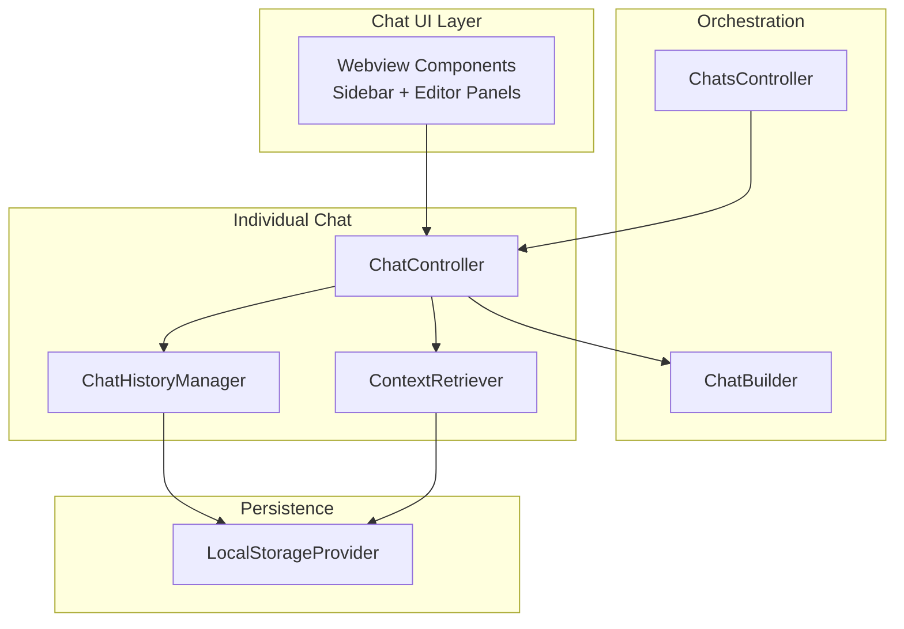
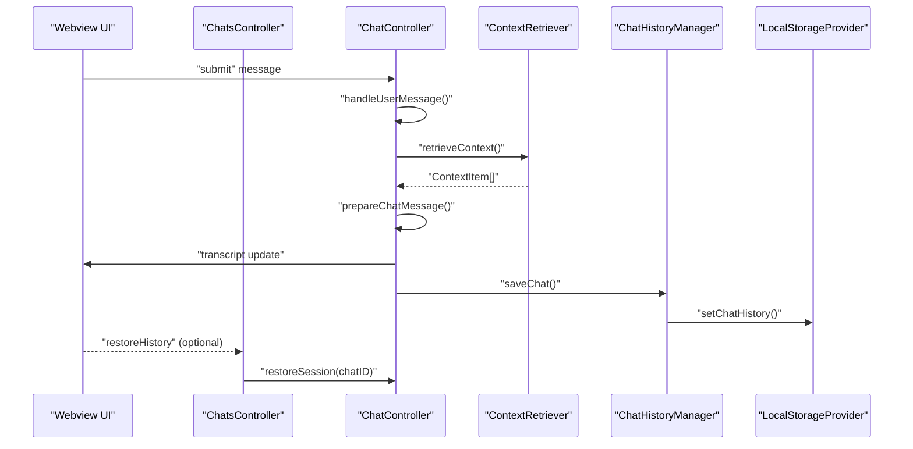
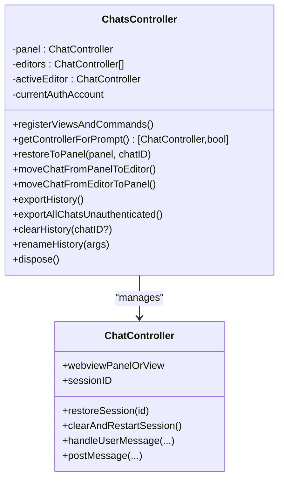
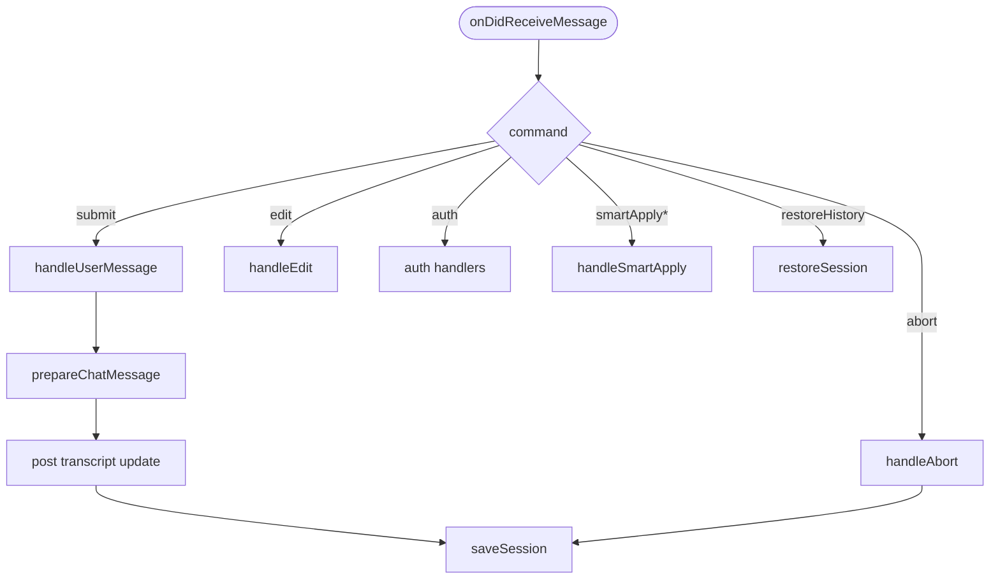
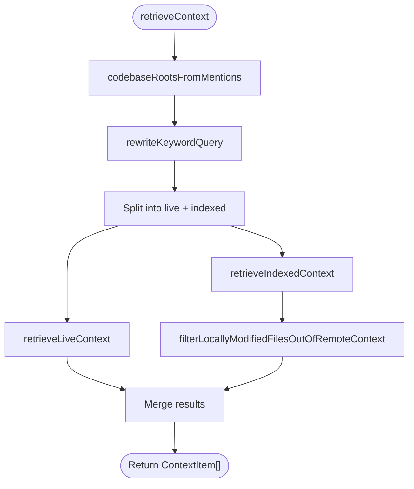
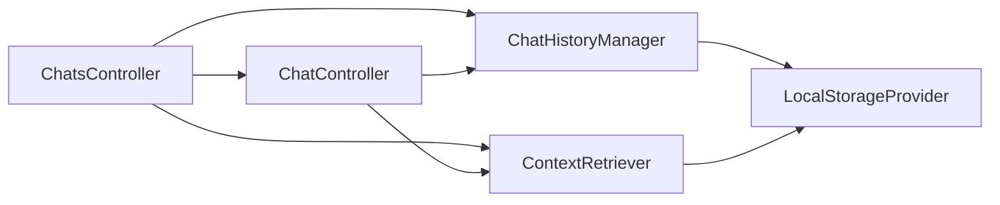

# Chat System

<cite>
**Referenced Files in This Document**
- [protocol.ts](file://vscode/src/chat/protocol.ts)
- [utils.ts](file://vscode/src/chat/utils.ts)
- [initialContext.ts](file://vscode/src/chat/initialContext.ts)
- [ChatsController.ts](file://vscode/src/chat/chat-view/ChatsController.ts)
- [ChatController.ts](file://vscode/src/chat/chat-view/ChatController.ts)
- [ChatHistoryManager.ts](file://vscode/src/chat/chat-view/ChatHistoryManager.ts)
- [ContextRetriever.ts](file://vscode/src/chat/chat-view/ContextRetriever.ts)
- [LocalStorageProvider.ts](file://vscode/src/services/LocalStorageProvider.ts)
</cite>

## Table of Contents
1. [Introduction](#introduction)
2. [Project Structure](#project-structure)
3. [Core Components](#core-components)
4. [Architecture Overview](#architecture-overview)
5. [Detailed Component Analysis](#detailed-component-analysis)
6. [Dependency Analysis](#dependency-analysis)
7. [Performance Considerations](#performance-considerations)
8. [Troubleshooting Guide](#troubleshooting-guide)
9. [Conclusion](#conclusion)
10. [Appendices](#appendices)

## Introduction
This document explains Cody’s chat system with a focus on the multi-modal conversation interface supporting both the sidebar and editor panels. It covers orchestration via the ChatsController, per-session chat management handled by ChatController, context-aware responses powered by ContextRetriever, and persistent chat history managed through LocalStorageProvider and ChatHistoryManager. Practical workflows, command integration, configuration options, performance characteristics, memory management, and error handling strategies are included to help both developers and users understand and operate the system effectively.

## Project Structure
The chat system spans several modules:
- Protocol and messaging contracts define the webview ↔ extension host communication surface.
- Initial context construction builds default context chips from editor state and repository metadata.
- Orchestration layer (ChatsController) manages multiple chat instances, session restoration, and cross-panel communication.
- Individual chat interactions are handled by ChatController, including message lifecycle, webview integration, and telemetry.
- Context retrieval integrates semantic search and code understanding from local and remote sources.
- Persistence is handled by LocalStorageProvider and ChatHistoryManager for local storage, export, and renaming/clearing.

**Diagram sources**
- [ChatsController.ts:54-696](file://vscode/src/chat/chat-view/ChatsController.ts#L54-L696)
- [ChatController.ts:193-800](file://vscode/src/chat/chat-view/ChatController.ts#L193-L800)
- [ChatHistoryManager.ts:21-197](file://vscode/src/chat/chat-view/ChatHistoryManager.ts#L21-L197)
- [ContextRetriever.ts:171-492](file://vscode/src/chat/chat-view/ContextRetriever.ts#L171-L492)
- [LocalStorageProvider.ts:27-432](file://vscode/src/services/LocalStorageProvider.ts#L27-L432)

**Section sources**
- [ChatsController.ts:54-696](file://vscode/src/chat/chat-view/ChatsController.ts#L54-L696)
- [ChatController.ts:193-800](file://vscode/src/chat/chat-view/ChatController.ts#L193-L800)
- [ChatHistoryManager.ts:21-197](file://vscode/src/chat/chat-view/ChatHistoryManager.ts#L21-L197)
- [ContextRetriever.ts:171-492](file://vscode/src/chat/chat-view/ContextRetriever.ts#L171-L492)
- [LocalStorageProvider.ts:27-432](file://vscode/src/services/LocalStorageProvider.ts#L27-L432)

## Core Components
- Webview messaging protocol: Defines bidirectional RPC-like messages for submit/edit, auth, telemetry, smart apply, and more.
- Initial context builder: Observably constructs default context chips from current file/selection, corpus repositories, and OpenCtx providers.
- ChatsController: Manages multiple ChatController instances, supports sticky/editor/sidebar modality, session restoration, and cross-panel commands.
- ChatController: Handles per-session chat lifecycle, webview integration, message handling, context retrieval, and persistence.
- ContextRetriever: Performs semantic search across local and remote codebases, merges live and indexed results, and filters duplicates.
- ChatHistoryManager and LocalStorageProvider: Persist, export, rename, and clear chat transcripts; manage endpoint history and device pixel ratio.

**Section sources**
- [protocol.ts:55-179](file://vscode/src/chat/protocol.ts#L55-L179)
- [initialContext.ts:68-119](file://vscode/src/chat/initialContext.ts#L68-L119)
- [ChatsController.ts:54-696](file://vscode/src/chat/chat-view/ChatsController.ts#L54-L696)
- [ChatController.ts:193-800](file://vscode/src/chat/chat-view/ChatController.ts#L193-L800)
- [ContextRetriever.ts:171-492](file://vscode/src/chat/chat-view/ContextRetriever.ts#L171-L492)
- [ChatHistoryManager.ts:21-197](file://vscode/src/chat/chat-view/ChatHistoryManager.ts#L21-L197)
- [LocalStorageProvider.ts:27-432](file://vscode/src/services/LocalStorageProvider.ts#L27-L432)

## Architecture Overview
The chat system is a layered architecture:
- UI layer: Webviews for sidebar and editor panels.
- Orchestration layer: ChatsController coordinates sessions and routes commands.
- Chat layer: ChatController manages a single chat session, integrates with webview, and persists state.
- Context layer: ContextRetriever retrieves context from local symf and remote GraphQL APIs.
- Persistence layer: LocalStorageProvider stores chat history keyed by endpoint and username; ChatHistoryManager exposes lightweight history and change observables.

**Diagram sources**
- [ChatController.ts:287-667](file://vscode/src/chat/chat-view/ChatController.ts#L287-L667)
- [ContextRetriever.ts:182-254](file://vscode/src/chat/chat-view/ContextRetriever.ts#L182-L254)
- [ChatHistoryManager.ts:94-109](file://vscode/src/chat/chat-view/ChatHistoryManager.ts#L94-L109)
- [LocalStorageProvider.ts:190-213](file://vscode/src/services/LocalStorageProvider.ts#L190-L213)

## Detailed Component Analysis

### ChatsController: Multi-instance Orchestration
Responsibilities:
- Maintains a sidebar ChatController and multiple editor panel ChatControllers.
- Switches active editor based on visibility and configuration.
- Restores sessions to panels and moves chats between sidebar and editor panels.
- Exposes commands for new chat, history export/clear/rename, and context injection.
- Disposes chats on authentication changes and on panel disposal.

Key behaviors:
- Sticky vs explicit modality: Reads configuration cody.chat.defaultLocation and last-used modality to decide where new chats appear.
- Cross-panel communication: Broadcasts client actions to the active chat controller and routes smart apply results and context additions.
- Session lifecycle: Supports duplicate, restart, and restore operations; clears and restarts the panel session when needed.

**Diagram sources**
- [ChatsController.ts:54-696](file://vscode/src/chat/chat-view/ChatsController.ts#L54-L696)
- [ChatController.ts:193-800](file://vscode/src/chat/chat-view/ChatController.ts#L193-L800)

**Section sources**
- [ChatsController.ts:54-696](file://vscode/src/chat/chat-view/ChatsController.ts#L54-L696)

### ChatController: Per-session Chat Lifecycle
Responsibilities:
- WebviewViewProvider and message router for inbound webview commands.
- Config and client config broadcasting to the webview.
- Message handling for submit/edit/abort, auth, telemetry, smart apply, and file/link navigation.
- Session management: clear/restart, restore, duplicate, and save on changes.
- Integration with ChatBuilder for transcript assembly and context retrieval.

Processing logic highlights:
- onDidReceiveMessage dispatches to typed handlers for each command.
- handleUserMessage orchestrates context retrieval, prepares messages, and posts transcript updates.
- getConfigForWebview computes webviewType, capability flags, and endpoint history.

**Diagram sources**
- [ChatController.ts:287-667](file://vscode/src/chat/chat-view/ChatController.ts#L287-L667)
- [ChatController.ts:719-799](file://vscode/src/chat/chat-view/ChatController.ts#L719-L799)

**Section sources**
- [ChatController.ts:193-800](file://vscode/src/chat/chat-view/ChatController.ts#L193-L800)

### Initial Context Construction
Responsibilities:
- Builds default context chips for the chat input, combining:
  - Current file and selection from the active editor.
  - Corpus context from workspace folders and remote repositories.
  - OpenCtx auto-included mentions from active editor context.
- Applies feature flags to control inclusion of corpus items and symf retrieval.

Observables:
- Debounces editor selection changes and combines with context window limits and feature flags.
- Emits pendingOperation while operations are in progress.

**Section sources**
- [initialContext.ts:68-119](file://vscode/src/chat/initialContext.ts#L68-L119)
- [initialContext.ts:210-339](file://vscode/src/chat/initialContext.ts#L210-L339)
- [initialContext.ts:341-390](file://vscode/src/chat/initialContext.ts#L341-L390)

### Context Retrieval Integration
Responsibilities:
- Converts structured mentions into roots (local and remote).
- Rewrites queries and retrieves:
  - Live context from local symf for recently modified files.
  - Indexed context from remote GraphQL and/or local symf.
- Filters out remote context items that overlap with local modified files.
- Produces ContextItem[] enriched with metadata and sources.

**Diagram sources**
- [ContextRetriever.ts:182-254](file://vscode/src/chat/chat-view/ContextRetriever.ts#L182-L254)
- [ContextRetriever.ts:256-414](file://vscode/src/chat/chat-view/ContextRetriever.ts#L256-L414)
- [ContextRetriever.ts:444-491](file://vscode/src/chat/chat-view/ContextRetriever.ts#L444-L491)

**Section sources**
- [ContextRetriever.ts:171-492](file://vscode/src/chat/chat-view/ContextRetriever.ts#L171-L492)

### Chat History Management and Persistence
Responsibilities:
- Save/load chat transcripts keyed by account (endpoint + username).
- Export/import history, rename/delete chats, and clear all history.
- Provide lightweight history for UI lists and observable change streams.
- Enforce storage size limits and notify when exceeded.

Persistence details:
- LocalStorageProvider stores AccountKeyedChatHistory under a versioned key and supports getAllChatHistory for unauthenticated export.
- ChatHistoryManager wraps localStorage with observable change notifications and lightweight conversions.

**Section sources**
- [ChatHistoryManager.ts:21-197](file://vscode/src/chat/chat-view/ChatHistoryManager.ts#L21-L197)
- [LocalStorageProvider.ts:174-241](file://vscode/src/services/LocalStorageProvider.ts#L174-L241)
- [LocalStorageProvider.ts:215-229](file://vscode/src/services/LocalStorageProvider.ts#L215-L229)

### Webview Protocol and Authentication
- WebviewMessage and ExtensionMessage define the wire protocol for commands, telemetry, auth, and UI actions.
- Authentication flows include simplified onboarding, sign-in/sign-out, and callback handling.
- Endpoint history and allowEndpointChange are exposed to the webview for configuration.

**Section sources**
- [protocol.ts:55-179](file://vscode/src/chat/protocol.ts#L55-L179)
- [protocol.ts:188-235](file://vscode/src/chat/protocol.ts#L188-L235)
- [ChatController.ts:518-642](file://vscode/src/chat/chat-view/ChatController.ts#L518-L642)

## Dependency Analysis
High-level dependencies:
- ChatsController depends on ChatController, ChatHistoryManager, ContextRetriever, and LocalStorageProvider.
- ChatController depends on ChatHistoryManager, ContextRetriever, ChatBuilder, and protocol definitions.
- ContextRetriever depends on editor, symf, and GraphQL client for context search.
- ChatHistoryManager depends on LocalStorageProvider and auth status.

**Diagram sources**
- [ChatsController.ts:69-75](file://vscode/src/chat/chat-view/ChatsController.ts#L69-L75)
- [ChatController.ts:139-142](file://vscode/src/chat/chat-view/ChatController.ts#L139-L142)
- [ChatHistoryManager.ts:19](file://vscode/src/chat/chat-view/ChatHistoryManager.ts#L19)
- [ContextRetriever.ts:22-28](file://vscode/src/chat/chat-view/ContextRetriever.ts#L22-L28)

**Section sources**
- [ChatsController.ts:69-75](file://vscode/src/chat/chat-view/ChatsController.ts#L69-L75)
- [ChatController.ts:139-142](file://vscode/src/chat/chat-view/ChatController.ts#L139-L142)
- [ChatHistoryManager.ts:19](file://vscode/src/chat/chat-view/ChatHistoryManager.ts#L19)
- [ContextRetriever.ts:22-28](file://vscode/src/chat/chat-view/ContextRetriever.ts#L22-L28)

## Performance Considerations
- Debouncing and distinctUntilChanged: Initial context construction debounces selection changes and avoids redundant emissions.
- Pending operations: Observables return pendingOperation during long-running tasks (e.g., corpus context retrieval).
- Symf and GraphQL: Live context retrieval is gated by availability; indexed context retrieval is parallelized for remote and local sources.
- Memory management: ChatController disposes subscriptions and resets ChatBuilder on endpoint changes to avoid stale model usage.
- Storage limits: ChatHistoryManager checks storage size thresholds and notifies when exceeded.

[No sources needed since this section provides general guidance]

## Troubleshooting Guide
Common scenarios:
- Authentication failures: ChatController’s auth handlers surface errors and post user-facing messages; endpoint history is refreshed after sign-out.
- Rate limits and context window errors: Handlers detect and surface rate limit and context window limit errors.
- Export failures: ChatsController logs errors and displays user-friendly messages for export operations.
- Panel restoration: If restoring a panel fails, ChatsController falls back to creating a new editor panel and disposes the old one.

**Section sources**
- [ChatController.ts:518-642](file://vscode/src/chat/chat-view/ChatController.ts#L518-L642)
- [ChatsController.ts:96-106](file://vscode/src/chat/chat-view/ChatsController.ts#L96-L106)
- [ChatsController.ts:401-433](file://vscode/src/chat/chat-view/ChatsController.ts#L401-L433)
- [ChatController.ts:48-57](file://vscode/src/chat/chat-view/ChatController.ts#L48-L57)

## Conclusion
Cody’s chat system provides a robust, multi-modal conversational interface with strong orchestration, context-awareness, and persistence. ChatsController coordinates sessions across sidebar and editor panels, while ChatController encapsulates per-session behavior, webview integration, and telemetry. ContextRetriever powers semantic search and code understanding, and LocalStorageProvider/ChatHistoryManager ensure reliable persistence and export. The system balances performance with observability and error resilience, enabling scalable developer workflows.

[No sources needed since this section summarizes without analyzing specific files]

## Appendices

### Practical Workflows and Examples
- New chat in preferred modality:
  - Use cody.chat.new; ChatsController decides sidebar vs editor based on configuration and last-used modality.
- Move chat between sidebar and editor:
  - cody.chat.moveToEditor and cody.chat.moveFromEditor coordinate session restoration and panel disposal.
- Submit prompt with context:
  - ChatController.handleUserMessage triggers context retrieval, prepares messages, and updates the transcript.
- Export chat history:
  - cody.chat.history.export exports authenticated user’s history; cody.chat.history.export.all exports all local chats without authentication.

**Section sources**
- [ChatsController.ts:184-224](file://vscode/src/chat/chat-view/ChatsController.ts#L184-L224)
- [ChatsController.ts:274-292](file://vscode/src/chat/chat-view/ChatsController.ts#L274-L292)
- [ChatController.ts:297-322](file://vscode/src/chat/chat-view/ChatController.ts#L297-L322)
- [ChatsController.ts:401-503](file://vscode/src/chat/chat-view/ChatsController.ts#L401-L503)

### Configuration Options
- cody.chat.defaultLocation: sticky | sidebar | editor.
- cody.internal.serverSideContext: Prefer server-side context retrieval when enabled.
- Endpoint history and allowEndpointChange are surfaced to the webview for configuration.
- Device pixel ratio is persisted for UI scaling.

**Section sources**
- [ChatsController.ts:685-695](file://vscode/src/chat/chat-view/ChatsController.ts#L685-L695)
- [ContextRetriever.ts:308-310](file://vscode/src/chat/chat-view/ContextRetriever.ts#L308-L310)
- [ChatController.ts:677-713](file://vscode/src/chat/chat-view/ChatController.ts#L677-L713)
- [LocalStorageProvider.ts:346-352](file://vscode/src/services/LocalStorageProvider.ts#L346-L352)

### Authentication Requirements
- Auth flows include simplified onboarding, sign-in/sign-out, and callback handling.
- Auth status drives config broadcasting and endpoint resets to avoid stale model usage.

**Section sources**
- [ChatController.ts:518-642](file://vscode/src/chat/chat-view/ChatController.ts#L518-L642)
- [ChatController.ts:264-279](file://vscode/src/chat/chat-view/ChatController.ts#L264-L279)