# Context Integration

<cite>
**Referenced Files in This Document**
- [context-strategy.ts](file://vscode/src/completions/context/context-strategy.ts)
- [context-mixer.ts](file://vscode/src/completions/context/context-mixer.ts)
- [completions-context-ranker.ts](file://vscode/src/completions/context/completions-context-ranker.ts)
- [reciprocal-rank-fusion.ts](file://vscode/src/completions/context/reciprocal-rank-fusion.ts)
- [openctx.ts](file://vscode/src/context/openctx.ts)
- [initialContext.ts](file://vscode/src/chat/initialContext.ts)
- [symf.ts](file://vscode/src/local-context/symf.ts)
- [remoteRepos.ts](file://vscode/src/repository/remoteRepos.ts)
- [selection.ts](file://vscode/src/commands/context/selection.ts)
- [CodyTool.ts](file://vscode/src/chat/agentic/CodyTool.ts)
- [messages.ts](file://lib/shared/src/codebase-context/messages.ts)
</cite>

## Table of Contents
1. [Introduction](#introduction)
2. [Project Structure](#project-structure)
3. [Core Components](#core-components)
4. [Architecture Overview](#architecture-overview)
5. [Detailed Component Analysis](#detailed-component-analysis)
6. [Dependency Analysis](#dependency-analysis)
7. [Performance Considerations](#performance-considerations)
8. [Troubleshooting Guide](#troubleshooting-guide)
9. [Conclusion](#conclusion)
10. [Appendices](#appendices)

## Introduction
This document describes the context integration subsystem that powers semantic search and contextual awareness across local workspaces and remote repositories. It covers:
- ContextRetriever implementations for local workspace indexing and graph-based retrieval
- Remote repository integration and corpus context composition
- Chat context system that aggregates editor selections, recent files, and repository metadata
- OpenCtx integration for external context providers and repository search
- Ranking algorithms (Reciprocal Rank Fusion, priority-based fusion, time-based ordering)
- Performance optimization techniques, caching, and security considerations

## Project Structure
The context integration spans several subsystems:
- Completion-time context retrieval pipeline: strategy selection, retrievers, mixing, ranking, and filtering
- Chat-time context construction: editor selections, repository chips, and OpenCtx auto-includes
- Local workspace indexing via symf with index lifecycle management
- Remote repository discovery and metadata exposure
- OpenCtx provider orchestration and configuration merging

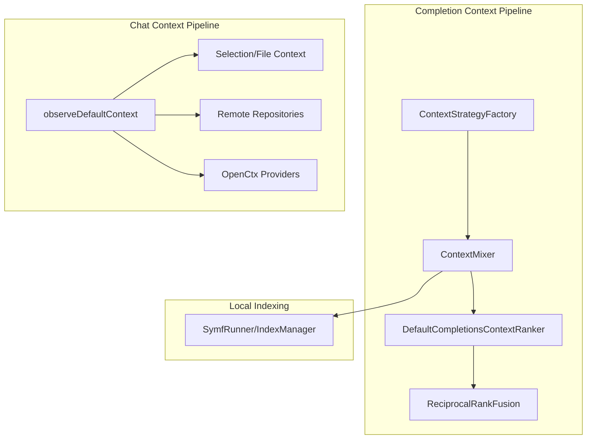

**Diagram sources**
- [context-strategy.ts:36-229](file://vscode/src/completions/context/context-strategy.ts#L36-L229)
- [context-mixer.ts:88-244](file://vscode/src/completions/context/context-mixer.ts#L88-L244)
- [completions-context-ranker.ts:35-154](file://vscode/src/completions/context/completions-context-ranker.ts#L35-L154)
- [reciprocal-rank-fusion.ts:38-125](file://vscode/src/completions/context/reciprocal-rank-fusion.ts#L38-L125)
- [initialContext.ts:68-118](file://vscode/src/chat/initialContext.ts#L68-L118)
- [selection.ts:75-101](file://vscode/src/commands/context/selection.ts#L75-L101)
- [remoteRepos.ts:40-96](file://vscode/src/repository/remoteRepos.ts#L40-L96)
- [openctx.ts:109-206](file://vscode/src/context/openctx.ts#L109-L206)
- [symf.ts:64-134](file://vscode/src/local-context/symf.ts#L64-L134)

**Section sources**
- [context-strategy.ts:20-40](file://vscode/src/completions/context/context-strategy.ts#L20-L40)
- [context-mixer.ts:73-105](file://vscode/src/completions/context/context-mixer.ts#L73-L105)
- [initialContext.ts:68-118](file://vscode/src/chat/initialContext.ts#L68-L118)

## Core Components
- ContextStrategyFactory: Selects a strategy and instantiates the appropriate retrievers (local and/or graph-based).
- ContextMixer: Executes retrievers, filters results, collects stats, and produces a unified context set.
- DefaultCompletionsContextRanker: Applies ranking strategies (RRF, priority-based, time-based).
- ReciprocalRankFusion: Fuses overlapping snippets across retrievers using reciprocal rank fusion.
- OpenCtx integration: Provides external context providers and merges configuration from the Sourcegraph instance.
- Local symf indexing: Manages index creation, refresh, and query execution for local workspace search.
- Chat initial context: Builds default context from current file/selection, repository chips, and OpenCtx auto-includes.

**Section sources**
- [context-strategy.ts:42-229](file://vscode/src/completions/context/context-strategy.ts#L42-L229)
- [context-mixer.ts:88-244](file://vscode/src/completions/context/context-mixer.ts#L88-L244)
- [completions-context-ranker.ts:35-154](file://vscode/src/completions/context/completions-context-ranker.ts#L35-L154)
- [reciprocal-rank-fusion.ts:38-125](file://vscode/src/completions/context/reciprocal-rank-fusion.ts#L38-L125)
- [openctx.ts:109-206](file://vscode/src/context/openctx.ts#L109-L206)
- [symf.ts:64-134](file://vscode/src/local-context/symf.ts#L64-L134)
- [initialContext.ts:68-118](file://vscode/src/chat/initialContext.ts#L68-L118)

## Architecture Overview
The system orchestrates multiple retrievers and providers to produce a ranked, filtered set of context snippets for autocompletions and chat. The diagram below maps the major components and their interactions.

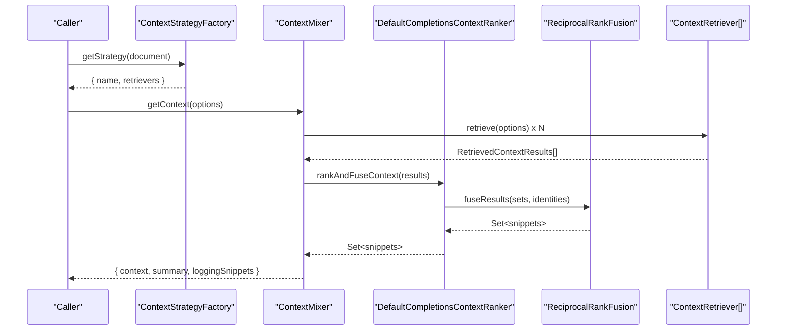

**Diagram sources**
- [context-strategy.ts:175-224](file://vscode/src/completions/context/context-strategy.ts#L175-L224)
- [context-mixer.ts:107-244](file://vscode/src/completions/context/context-mixer.ts#L107-L244)
- [completions-context-ranker.ts:38-76](file://vscode/src/completions/context/completions-context-ranker.ts#L38-L76)
- [reciprocal-rank-fusion.ts:38-125](file://vscode/src/completions/context/reciprocal-rank-fusion.ts#L38-L125)

## Detailed Component Analysis

### ContextRetriever Strategy and Execution
- Strategy selection determines which retrievers are active (local vs graph-based) and how they are combined.
- The factory constructs retrievers lazily and disposes them when strategy changes.
- The mixer executes retrievers concurrently, measures durations, and applies context filters.

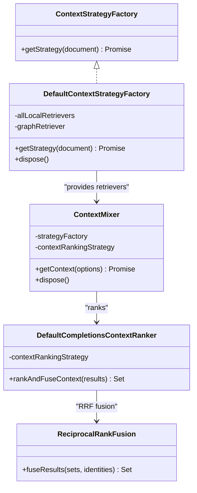

**Diagram sources**
- [context-strategy.ts:36-229](file://vscode/src/completions/context/context-strategy.ts#L36-L229)
- [context-mixer.ts:88-244](file://vscode/src/completions/context/context-mixer.ts#L88-L244)
- [completions-context-ranker.ts:35-154](file://vscode/src/completions/context/completions-context-ranker.ts#L35-L154)
- [reciprocal-rank-fusion.ts:38-125](file://vscode/src/completions/context/reciprocal-rank-fusion.ts#L38-L125)

**Section sources**
- [context-strategy.ts:42-229](file://vscode/src/completions/context/context-strategy.ts#L42-L229)
- [context-mixer.ts:107-244](file://vscode/src/completions/context/context-mixer.ts#L107-L244)

### Ranking and Fusion Algorithms
- Default strategy: Uses RRF when no “recent edits” retriever is present; otherwise prioritizes recent edits and applies RRF to the remainder.
- Priority-based fusion: Splits retrievers into priority and non-priority groups and orders priority ones deterministically.
- Time-based strategy: Orders snippets by time since action (when available).
- Identity function for RRF: Expands snippet identity to per-line ranges to handle overlapping snippets.

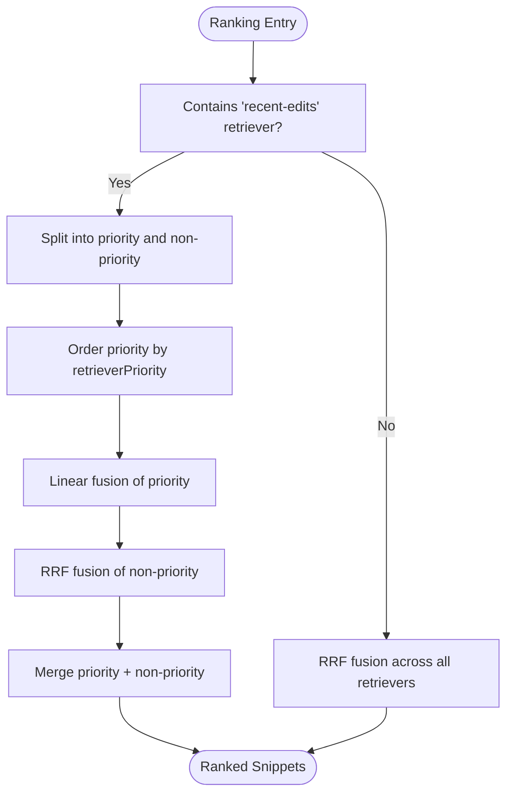

**Diagram sources**
- [completions-context-ranker.ts:69-97](file://vscode/src/completions/context/completions-context-ranker.ts#L69-L97)
- [reciprocal-rank-fusion.ts:38-125](file://vscode/src/completions/context/reciprocal-rank-fusion.ts#L38-L125)

**Section sources**
- [completions-context-ranker.ts:35-154](file://vscode/src/completions/context/completions-context-ranker.ts#L35-L154)
- [reciprocal-rank-fusion.ts:38-125](file://vscode/src/completions/context/reciprocal-rank-fusion.ts#L38-L125)

### Local Workspace Indexing with symf
- SymfRunner manages index lifecycle: creation, refresh, deletion, and status tracking.
- Indexes are stored under a global storage root and scoped per workspace folder.
- Query execution supports live queries and batch queries with timeouts and buffering limits.
- Index management registers commands to update indices and reacts to workspace folder changes.

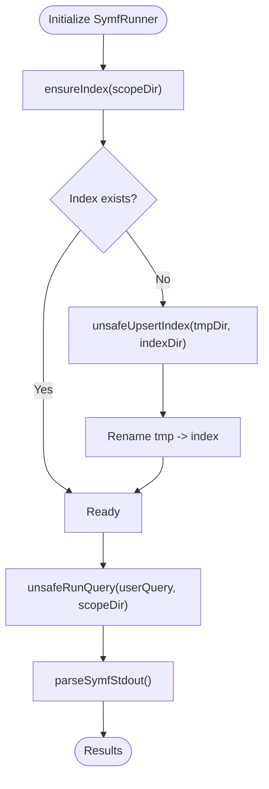

**Diagram sources**
- [symf.ts:289-508](file://vscode/src/local-context/symf.ts#L289-L508)
- [symf.ts:130-202](file://vscode/src/local-context/symf.ts#L130-L202)
- [symf.ts:588-639](file://vscode/src/local-context/symf.ts#L588-L639)

**Section sources**
- [symf.ts:64-134](file://vscode/src/local-context/symf.ts#L64-L134)
- [symf.ts:289-508](file://vscode/src/local-context/symf.ts#L289-L508)

### Remote Repository Integration
- Remote repositories are discovered per workspace folder and resolved to GraphQL IDs.
- The chat context builder adds repository chips for current and other workspace folders, and includes remote repositories when allowed by auth and filters.
- Filtering respects user-defined ignore rules and error handling for missing or invalid data.

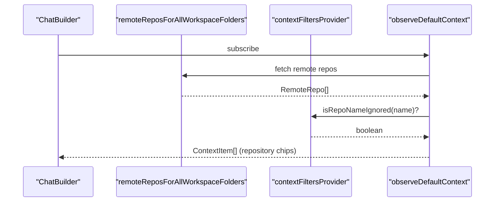

**Diagram sources**
- [initialContext.ts:210-339](file://vscode/src/chat/initialContext.ts#L210-L339)
- [remoteRepos.ts:40-96](file://vscode/src/repository/remoteRepos.ts#L40-L96)

**Section sources**
- [initialContext.ts:210-339](file://vscode/src/chat/initialContext.ts#L210-L339)
- [remoteRepos.ts:20-96](file://vscode/src/repository/remoteRepos.ts#L20-L96)

### Chat Context System
- Initial context combines:
  - Current file/selection context derived from the active editor
  - Corpus context from workspace folders and remote repositories
  - OpenCtx auto-included items based on active editor context
- Debouncing and distinctUntilChanged ensure efficient updates.
- Context item sizing enforces user context window constraints.

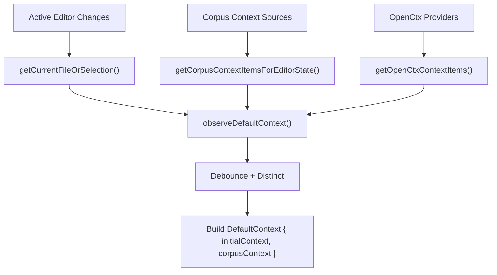

**Diagram sources**
- [initialContext.ts:68-118](file://vscode/src/chat/initialContext.ts#L68-L118)
- [initialContext.ts:126-208](file://vscode/src/chat/initialContext.ts#L126-L208)
- [initialContext.ts:210-339](file://vscode/src/chat/initialContext.ts#L210-L339)
- [initialContext.ts:341-390](file://vscode/src/chat/initialContext.ts#L341-L390)

**Section sources**
- [initialContext.ts:68-118](file://vscode/src/chat/initialContext.ts#L68-L118)
- [selection.ts:75-101](file://vscode/src/commands/context/selection.ts#L75-L101)

### OpenCtx Integration
- Provider configuration is assembled from:
  - Web provider
  - Rules provider (conditional)
  - Remote repository/file/directory providers (enterprise)
  - Git mentions provider (feature-flagged)
  - Code search provider (client-configured)
- Merges viewer settings to allow user overrides of providers.
- Warns on conflicting extensions.

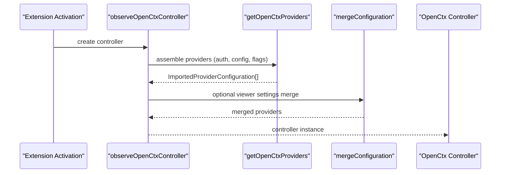

**Diagram sources**
- [openctx.ts:50-105](file://vscode/src/context/openctx.ts#L50-L105)
- [openctx.ts:109-206](file://vscode/src/context/openctx.ts#L109-L206)
- [openctx.ts:257-297](file://vscode/src/context/openctx.ts#L257-L297)

**Section sources**
- [openctx.ts:109-206](file://vscode/src/context/openctx.ts#L109-L206)
- [openctx.ts:257-297](file://vscode/src/context/openctx.ts#L257-L297)

### Agentic Search Tool and OpenCtx Tools
- SearchTool uses the configured context retriever to search within repository context.
- OpenCtxTool wraps a provider to return context items for agentic actions.

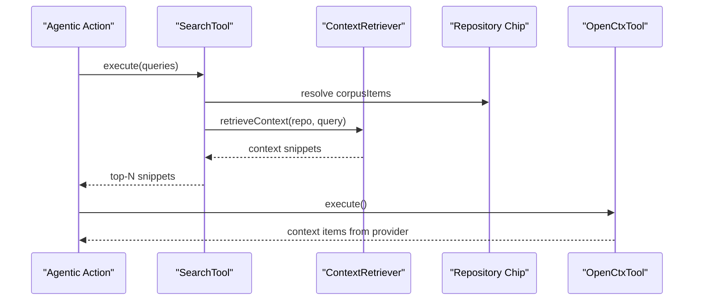

**Diagram sources**
- [CodyTool.ts:243-270](file://vscode/src/chat/agentic/CodyTool.ts#L243-L270)
- [CodyTool.ts:276-282](file://vscode/src/chat/agentic/CodyTool.ts#L276-L282)

**Section sources**
- [CodyTool.ts:243-282](file://vscode/src/chat/agentic/CodyTool.ts#L243-L282)

### Context Data Models
- ContextItem types define the canonical shapes for files, repositories, trees, symbols, and OpenCtx items.
- DefaultContext separates initial pre-filled items from corpus items for the chat input.

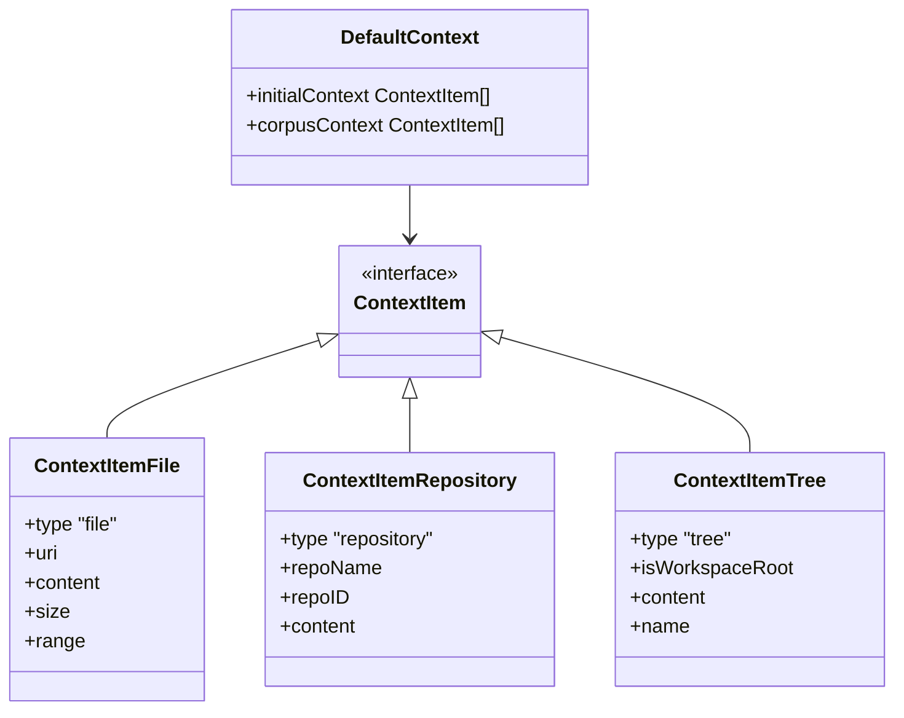

**Diagram sources**
- [messages.ts:134-178](file://lib/shared/src/codebase-context/messages.ts#L134-L178)

**Section sources**
- [messages.ts:134-178](file://lib/shared/src/codebase-context/messages.ts#L134-L178)

## Dependency Analysis
- ContextMixer depends on:
  - ContextStrategyFactory for retrievers
  - DefaultCompletionsContextRanker for ranking
  - ReciprocalRankFusion for fusion
  - Context filters for URI filtering
- OpenCtx integration depends on:
  - Auth status and client configuration
  - Viewer settings for provider overrides
- Chat initial context depends on:
  - Selection/file context extraction
  - Remote repository discovery
  - OpenCtx controller for auto-includes

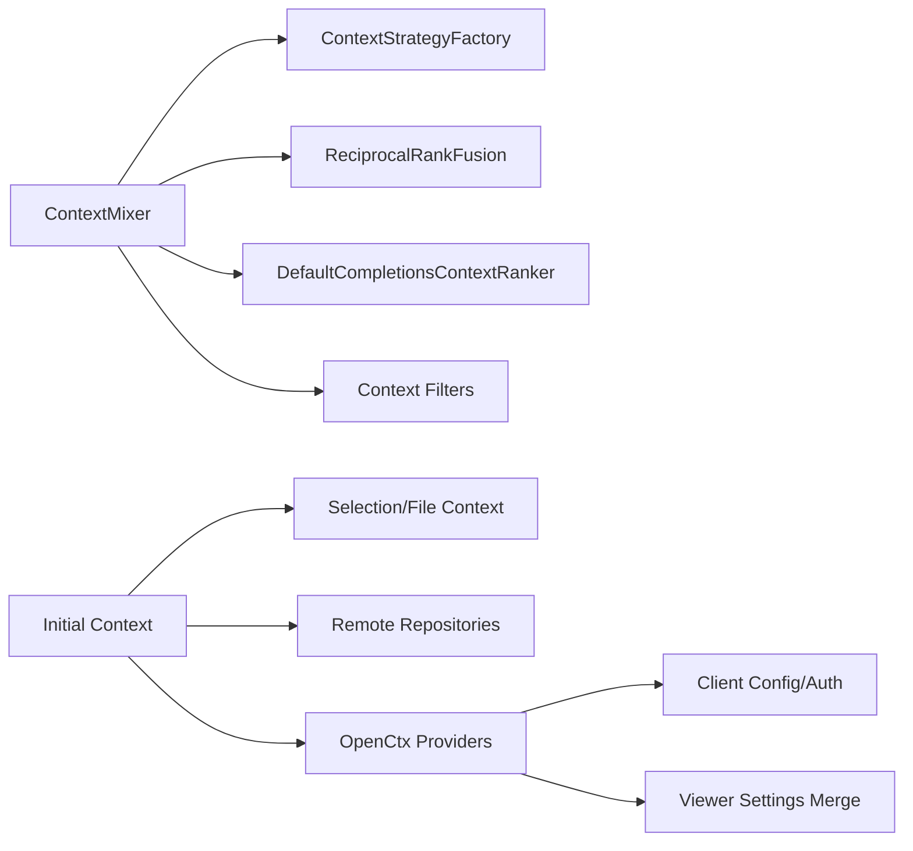

**Diagram sources**
- [context-mixer.ts:88-244](file://vscode/src/completions/context/context-mixer.ts#L88-L244)
- [initialContext.ts:68-118](file://vscode/src/chat/initialContext.ts#L68-L118)
- [openctx.ts:109-206](file://vscode/src/context/openctx.ts#L109-L206)

**Section sources**
- [context-mixer.ts:88-244](file://vscode/src/completions/context/context-mixer.ts#L88-L244)
- [initialContext.ts:68-118](file://vscode/src/chat/initialContext.ts#L68-L118)
- [openctx.ts:109-206](file://vscode/src/context/openctx.ts#L109-L206)

## Performance Considerations
- Concurrency and timeouts:
  - Retriever calls are executed concurrently with per-retriever timing.
  - symf queries enforce timeouts and buffer limits to prevent runaway memory usage.
- Index lifecycle:
  - Index creation uses CPU limits and cancellation tokens.
  - Stale indexes are detected and reindexed atomically.
- Ranking overhead:
  - RRF computes scores per line identity; keep retriever sets reasonable in size.
  - Priority-based fusion avoids RRF cost for high-priority retrievers.
- Filtering:
  - Post-retrieval filtering by URI ignores reduces downstream processing.

[No sources needed since this section provides general guidance]

## Troubleshooting Guide
- OpenCtx provider loading failures:
  - Check auth status and site version checks before enabling enterprise providers.
  - Viewer settings merge failures are logged and skipped gracefully.
- symf indexing issues:
  - Index failures are tracked and retried conditionally.
  - Index deletion moves directories to a trash location for diagnostics.
- Chat context not appearing:
  - Verify remote repository discovery and ignore filters.
  - Confirm OpenCtx auto-include providers are enabled and returning items.
- Context too large:
  - Adjust user context window settings to limit snippet inclusion.

**Section sources**
- [openctx.ts:97-100](file://vscode/src/context/openctx.ts#L97-L100)
- [openctx.ts:280-297](file://vscode/src/context/openctx.ts#L280-L297)
- [symf.ts:513-530](file://vscode/src/local-context/symf.ts#L513-L530)
- [initialContext.ts:285-339](file://vscode/src/chat/initialContext.ts#L285-L339)

## Conclusion
The context integration subsystem combines local symf indexing, graph-based retrievers, and external OpenCtx providers to deliver a robust, ranked, and filtered context set. The modular design allows strategies to evolve, while the ranking and fusion algorithms ensure high-quality, non-redundant snippets. Security and privacy are addressed through filtering and controlled provider configuration, and performance is optimized via concurrency, timeouts, and index lifecycle management.

[No sources needed since this section summarizes without analyzing specific files]

## Appendices

### Practical Workflows

- Semantic search across codebase (completion-time):
  - Strategy selects retrievers; ContextMixer runs them concurrently; DefaultCompletionsContextRanker applies RRF; Context filters prune ignored URIs.
  - Reference: [context-strategy.ts:175-224](file://vscode/src/completions/context/context-strategy.ts#L175-L224), [context-mixer.ts:107-244](file://vscode/src/completions/context/context-mixer.ts#L107-L244), [completions-context-ranker.ts:38-76](file://vscode/src/completions/context/completions-context-ranker.ts#L38-L76)

- Chat initial context assembly:
  - Combine current file/selection, repository chips, and OpenCtx auto-includes; debounce and distinct updates; enforce context window.
  - Reference: [initialContext.ts:68-118](file://vscode/src/chat/initialContext.ts#L68-L118), [selection.ts:75-101](file://vscode/src/commands/context/selection.ts#L75-L101)

- Local workspace indexing:
  - Initialize, ensure index, query, and manage stale indexes; handle failures and retries.
  - Reference: [symf.ts:289-508](file://vscode/src/local-context/symf.ts#L289-L508)

- Remote repository integration:
  - Discover and resolve repositories; add chips to context; respect ignore filters.
  - Reference: [remoteRepos.ts:40-96](file://vscode/src/repository/remoteRepos.ts#L40-L96), [initialContext.ts:292-317](file://vscode/src/chat/initialContext.ts#L292-L317)

- OpenCtx provider configuration:
  - Assemble providers from auth/config/flags; merge viewer settings; warn on conflicts.
  - Reference: [openctx.ts:109-206](file://vscode/src/context/openctx.ts#L109-L206), [openctx.ts:257-297](file://vscode/src/context/openctx.ts#L257-L297)

### Configuration Options and Privacy Controls
- Context sources and filtering:
  - Context filters for URIs and repository names; ignore lists respected in chat context and retriever filtering.
  - Reference: [context-mixer.ts:275-286](file://vscode/src/completions/context/context-mixer.ts#L275-L286), [initialContext.ts:292-295](file://vscode/src/chat/initialContext.ts#L292-L295)

- OpenCtx provider configuration:
  - Viewer settings merge allows user overrides; selective provider enabling based on auth and site version.
  - Reference: [openctx.ts:257-297](file://vscode/src/context/openctx.ts#L257-L297), [openctx.ts:118-132](file://vscode/src/context/openctx.ts#L118-L132)

- Performance tuning:
  - Adjust context window sizes; tune retriever maxMs hints; limit repository counts; use priority-based fusion for critical retrievers.
  - Reference: [context-mixer.ts:134-140](file://vscode/src/completions/context/context-mixer.ts#L134-L140), [completions-context-ranker.ts:86-96](file://vscode/src/completions/context/completions-context-ranker.ts#L86-L96)