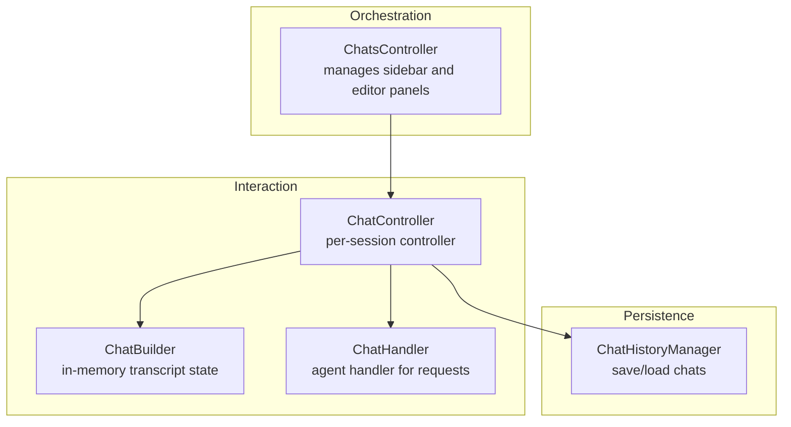
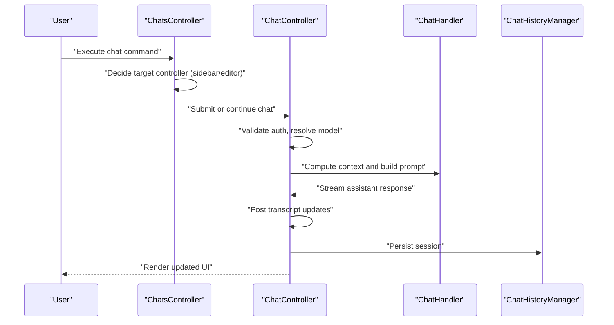
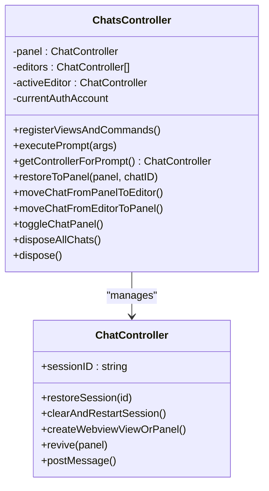
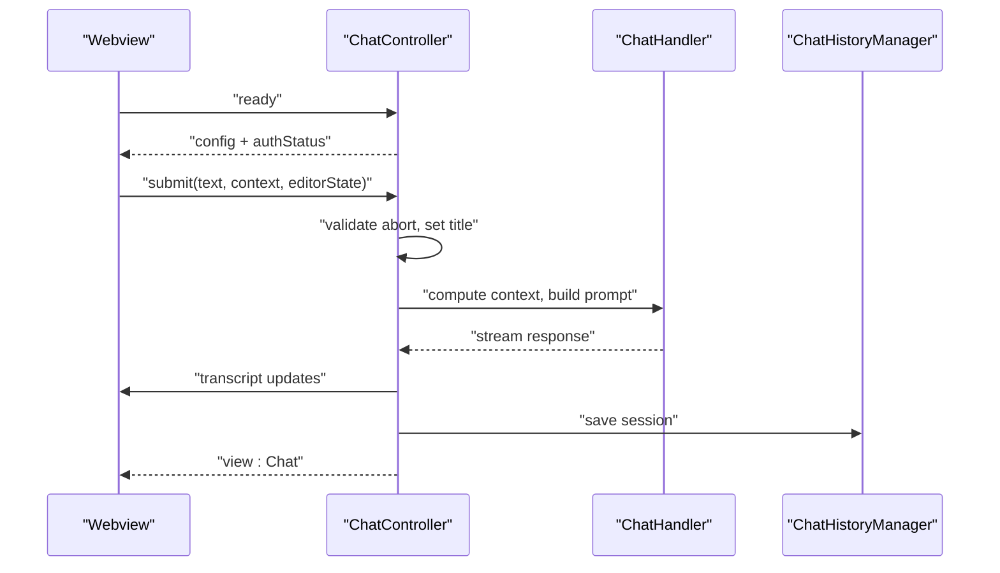
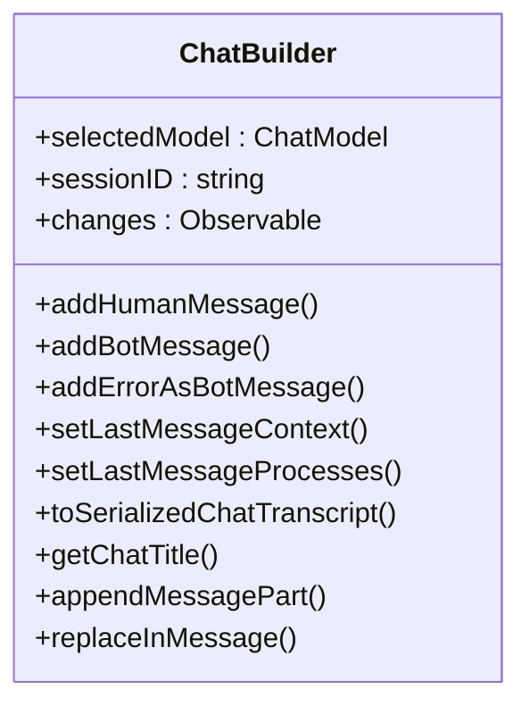
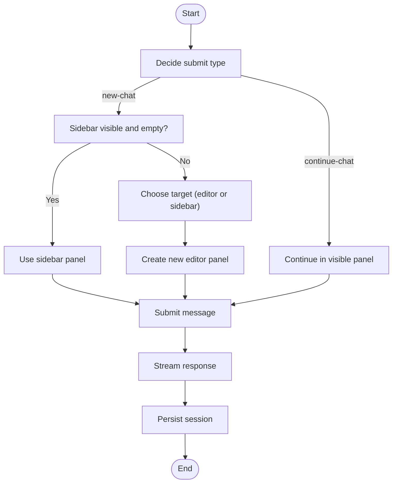
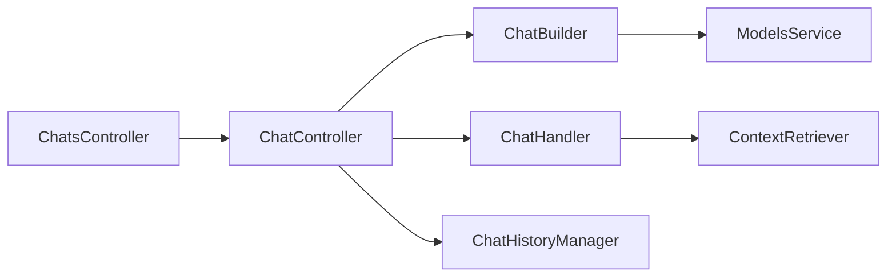

# Conversation Management

<cite>
**Referenced Files in This Document**
- [ChatsController.ts](file://vscode/src/chat/chat-view/ChatsController.ts)
- [ChatController.ts](file://vscode/src/chat/chat-view/ChatController.ts)
- [ChatBuilder.ts](file://vscode/src/chat/chat-view/ChatBuilder.ts)
- [ChatHistoryManager.ts](file://vscode/src/chat/chat-view/ChatHistoryManager.ts)
- [ChatHandler.ts](file://vscode/src/chat/chat-view/handlers/ChatHandler.ts)
- [HistoryChat.ts](file://vscode/src/services/HistoryChat.ts)
</cite>

## Table of Contents
1. [Introduction](#introduction)
2. [Project Structure](#project-structure)
3. [Core Components](#core-components)
4. [Architecture Overview](#architecture-overview)
5. [Detailed Component Analysis](#detailed-component-analysis)
6. [Dependency Analysis](#dependency-analysis)
7. [Performance Considerations](#performance-considerations)
8. [Troubleshooting Guide](#troubleshooting-guide)
9. [Conclusion](#conclusion)

## Introduction
This document explains the conversation management subsystem that orchestrates multiple chat instances across the sidebar and editor panels. It covers how the ChatsController coordinates sessions, how ChatController handles individual chat interactions and webview integration, and how chat sessions are persisted and restored. It also documents session lifecycle management, chat switching, cross-panel communication, configuration options, and error handling strategies.

## Project Structure
The conversation management subsystem is centered around three primary layers:
- Orchestration layer: ChatsController manages multiple ChatController instances, tracks active sessions, and routes commands between sidebar and editor panels.
- Interaction layer: ChatController encapsulates a single chat session, handles user messages, integrates with the webview, and streams model responses.
- Persistence and history: ChatHistoryManager persists chats to local storage, while ChatBuilder maintains in-memory transcript state and serialization.

**Diagram sources**
- [ChatsController.ts:54-683](file://vscode/src/chat/chat-view/ChatsController.ts#L54-L683)
- [ChatController.ts:193-281](file://vscode/src/chat/chat-view/ChatController.ts#L193-L281)
- [ChatBuilder.ts:31-106](file://vscode/src/chat/chat-view/ChatBuilder.ts#L31-L106)
- [ChatHistoryManager.ts:21-196](file://vscode/src/chat/chat-view/ChatHistoryManager.ts#L21-L196)
- [ChatHandler.ts:31-96](file://vscode/src/chat/chat-view/handlers/ChatHandler.ts#L31-L96)

**Section sources**
- [ChatsController.ts:54-683](file://vscode/src/chat/chat-view/ChatsController.ts#L54-L683)
- [ChatController.ts:193-281](file://vscode/src/chat/chat-view/ChatController.ts#L193-L281)
- [ChatBuilder.ts:31-106](file://vscode/src/chat/chat-view/ChatBuilder.ts#L31-L106)
- [ChatHistoryManager.ts:21-196](file://vscode/src/chat/chat-view/ChatHistoryManager.ts#L21-L196)
- [ChatHandler.ts:31-96](file://vscode/src/chat/chat-view/handlers/ChatHandler.ts#L31-L96)

## Core Components
- ChatsController: Coordinates sidebar and editor panels, restores sessions, moves chats between locations, and exposes commands for new chats, history export, and context injection.
- ChatController: Manages a single chat session, posts transcript updates, streams responses via ChatHandler, and integrates with the webview.
- ChatBuilder: Maintains the in-memory transcript, supports serialization/deserialization, and computes context windows and model resolution.
- ChatHistoryManager: Persists chats to local storage, supports renaming, deletion, clearing, and lightweight history for UI lists.
- ChatHandler: Computes context alternatives, builds prompts, and streams model responses to the ChatController.

**Section sources**
- [ChatsController.ts:54-683](file://vscode/src/chat/chat-view/ChatsController.ts#L54-L683)
- [ChatController.ts:193-281](file://vscode/src/chat/chat-view/ChatController.ts#L193-L281)
- [ChatBuilder.ts:31-106](file://vscode/src/chat/chat-view/ChatBuilder.ts#L31-L106)
- [ChatHistoryManager.ts:21-196](file://vscode/src/chat/chat-view/ChatHistoryManager.ts#L21-L196)
- [ChatHandler.ts:31-96](file://vscode/src/chat/chat-view/handlers/ChatHandler.ts#L31-L96)

## Architecture Overview
The subsystem follows a layered pattern:
- Commands originate from UI or keybindings and reach ChatsController.
- ChatsController selects the appropriate ChatController (sidebar or editor) and delegates.
- ChatController validates auth, resolves model, constructs context, and invokes ChatHandler.
- ChatHandler retrieves context, builds prompt, and streams assistant responses.
- ChatController posts transcript updates to the webview and persists state.

**Diagram sources**
- [ChatsController.ts:108-131](file://vscode/src/chat/chat-view/ChatsController.ts#L108-L131)
- [ChatController.ts:804-870](file://vscode/src/chat/chat-view/ChatController.ts#L804-L870)
- [ChatHandler.ts:38-96](file://vscode/src/chat/chat-view/handlers/ChatHandler.ts#L38-L96)
- [ChatHistoryManager.ts:94-109](file://vscode/src/chat/chat-view/ChatHistoryManager.ts#L94-L109)

## Detailed Component Analysis

### ChatsController: Multi-panel orchestration
Responsibilities:
- Manage sidebar panel and multiple editor panels.
- Switch between sidebar and editor modality based on configuration and last-used preference.
- Move chats between sidebar and editor panels.
- Restore sessions to a panel or editor.
- Expose commands for new chats, continuing chats, toggling visibility, exporting history, and injecting context.

Key behaviors:
- New chat creation prefers the active editor if visible; otherwise creates a new editor panel or uses the sidebar depending on default location.
- Moving chats between locations clears or restores sessions appropriately.
- Session restoration attempts to revive a panel and falls back to creating a new editor if revival fails.
- Cross-panel communication is achieved by broadcasting client actions and posting messages to the webview.

**Diagram sources**
- [ChatsController.ts:54-683](file://vscode/src/chat/chat-view/ChatsController.ts#L54-L683)
- [ChatController.ts:193-281](file://vscode/src/chat/chat-view/ChatController.ts#L193-L281)

**Section sources**
- [ChatsController.ts:108-154](file://vscode/src/chat/chat-view/ChatsController.ts#L108-L154)
- [ChatsController.ts:162-272](file://vscode/src/chat/chat-view/ChatsController.ts#L162-L272)
- [ChatsController.ts:274-331](file://vscode/src/chat/chat-view/ChatsController.ts#L274-L331)
- [ChatsController.ts:333-396](file://vscode/src/chat/chat-view/ChatsController.ts#L333-L396)
- [ChatsController.ts:398-536](file://vscode/src/chat/chat-view/ChatsController.ts#L398-L536)
- [ChatsController.ts:538-606](file://vscode/src/chat/chat-view/ChatsController.ts#L538-L606)
- [ChatsController.ts:608-683](file://vscode/src/chat/chat-view/ChatsController.ts#L608-L683)

### ChatController: Individual chat session and webview integration
Responsibilities:
- Receive and route webview messages (ready, submit, edit, abort, auth, etc.).
- Manage session lifecycle: restore, duplicate, clear and restart.
- Stream assistant responses via ChatHandler and post transcript updates.
- Integrate with the webview: initialize HTML, post messages, and expose APIs to the webview.
- Persist sessions to local storage and surface storage warnings.

Key flows:
- On ready, sends configuration and auth status to the webview.
- On submit/edit, validates abort signals, sets custom titles, and streams responses.
- On abort, cancels in-flight operations and notifies the webview.
- On initialized, seeds the chatID and triggers save.

**Diagram sources**
- [ChatController.ts:287-667](file://vscode/src/chat/chat-view/ChatController.ts#L287-L667)
- [ChatController.ts:804-1042](file://vscode/src/chat/chat-view/ChatController.ts#L804-L1042)
- [ChatHandler.ts:38-96](file://vscode/src/chat/chat-view/handlers/ChatHandler.ts#L38-L96)
- [ChatHistoryManager.ts:94-109](file://vscode/src/chat/chat-view/ChatHistoryManager.ts#L94-L109)

**Section sources**
- [ChatController.ts:287-667](file://vscode/src/chat/chat-view/ChatController.ts#L287-L667)
- [ChatController.ts:804-1042](file://vscode/src/chat/chat-view/ChatController.ts#L804-L1042)
- [ChatController.ts:1610-1681](file://vscode/src/chat/chat-view/ChatController.ts#L1610-L1681)
- [ChatController.ts:1697-1903](file://vscode/src/chat/chat-view/ChatController.ts#L1697-L1903)

### ChatBuilder: In-memory transcript and serialization
Responsibilities:
- Maintain ordered human/bot messages and metadata (intent, context, processes).
- Compute context windows and resolve models for the chat.
- Serialize to/from transcript JSON for persistence.
- Support incremental message updates and replacement.

Key capabilities:
- Selected model resolution with fallback to default.
- Append message parts and reconstruct text from parts.
- Serialize interactions and preserve chat title and timestamps.

**Diagram sources**
- [ChatBuilder.ts:31-106](file://vscode/src/chat/chat-view/ChatBuilder.ts#L31-L106)
- [ChatBuilder.ts:168-236](file://vscode/src/chat/chat-view/ChatBuilder.ts#L168-L236)
- [ChatBuilder.ts:324-344](file://vscode/src/chat/chat-view/ChatBuilder.ts#L324-L344)
- [ChatBuilder.ts:404-418](file://vscode/src/chat/chat-view/ChatBuilder.ts#L404-L418)

**Section sources**
- [ChatBuilder.ts:31-106](file://vscode/src/chat/chat-view/ChatBuilder.ts#L31-L106)
- [ChatBuilder.ts:168-236](file://vscode/src/chat/chat-view/ChatBuilder.ts#L168-L236)
- [ChatBuilder.ts:324-344](file://vscode/src/chat/chat-view/ChatBuilder.ts#L324-L344)
- [ChatBuilder.ts:404-418](file://vscode/src/chat/chat-view/ChatBuilder.ts#L404-L418)

### ChatHistoryManager: Persistence and history
Responsibilities:
- Save, load, rename, delete, and clear chat histories.
- Provide lightweight history for UI lists.
- Emit observable changes for UI binding.

Behavior:
- Skips saving empty chats.
- Emits change notifications on modifications.
- Converts full transcripts to lightweight format for efficient UI rendering.

**Section sources**
- [ChatHistoryManager.ts:21-196](file://vscode/src/chat/chat-view/ChatHistoryManager.ts#L21-L196)

### ChatHandler: Request lifecycle and streaming
Responsibilities:
- Compute context alternatives (explicit mentions, OpenCtx, and retrieved context).
- Build prompts and stream assistant responses.
- Report token usage and handle partial responses on errors.

**Section sources**
- [ChatHandler.ts:31-96](file://vscode/src/chat/chat-view/handlers/ChatHandler.ts#L31-L96)
- [ChatHandler.ts:102-231](file://vscode/src/chat/chat-view/handlers/ChatHandler.ts#L102-L231)
- [ChatHandler.ts:249-278](file://vscode/src/chat/chat-view/handlers/ChatHandler.ts#L249-L278)

### Cross-panel communication and session restoration
- Cross-panel actions (e.g., moving a chat from sidebar to editor) are coordinated by ChatsController, which restores or clears sessions as needed.
- Session restoration attempts to revive an existing panel; if that fails, it creates a new editor panel and disposes the old one.
- Client actions (e.g., adding context items to the last human input) are broadcast to the webview.

**Section sources**
- [ChatsController.ts:96-106](file://vscode/src/chat/chat-view/ChatsController.ts#L96-L106)
- [ChatsController.ts:274-292](file://vscode/src/chat/chat-view/ChatsController.ts#L274-L292)
- [ChatController.ts:1313-1320](file://vscode/src/chat/chat-view/ChatController.ts#L1313-L1320)

### Conversation flow: new, continue, and cleanup
- New chat: If the sidebar is visible and empty, reuse it; otherwise create a new editor panel or use the sidebar depending on default location. Clears and restarts the session before submitting.
- Continue chat: If the sidebar is visible or an editor is visible, continue in that location; otherwise create a new editor panel.
- Cleanup: Disposing a chat removes the webview panel and clears the session in the sidebar if applicable.

**Diagram sources**
- [ChatsController.ts:360-396](file://vscode/src/chat/chat-view/ChatsController.ts#L360-L396)
- [ChatController.ts:804-870](file://vscode/src/chat/chat-view/ChatController.ts#L804-L870)
- [ChatHistoryManager.ts:94-109](file://vscode/src/chat/chat-view/ChatHistoryManager.ts#L94-L109)

**Section sources**
- [ChatsController.ts:360-396](file://vscode/src/chat/chat-view/ChatsController.ts#L360-L396)
- [ChatController.ts:804-870](file://vscode/src/chat/chat-view/ChatController.ts#L804-L870)

### Practical workflows and command integration
- New chat in editor: cody.chat.newEditorPanel
- New chat in sidebar: cody.chat.newPanel
- Toggle chat panel: cody.chat.toggle
- Move chat to editor/side bar: cody.chat.moveToEditor, cody.chat.moveFromEditor
- Export history: cody.chat.history.export, cody.chat.history.export.all
- Add context from editor selection/file: cody.mention.selection, cody.mention.file
- Insert or save code from chat: cody.command.insertCodeToCursor, cody.command.insertCodeToNewFile

**Section sources**
- [ChatsController.ts:156-272](file://vscode/src/chat/chat-view/ChatsController.ts#L156-L272)

### Configuration options and defaults
- Default chat location: cody.chat.defaultLocation supports sticky, sidebar, or editor. When sticky, the last-used modality is used.
- Webview type: Editor vs sidebar is derived from capabilities and current view type.
- Endpoint history and attribution: Available in configuration for the webview.

**Section sources**
- [ChatsController.ts:685-695](file://vscode/src/chat/chat-view/ChatsController.ts#L685-L695)
- [ChatController.ts:677-713](file://vscode/src/chat/chat-view/ChatController.ts#L677-L713)

### Authentication and security
- Authentication status drives configuration updates and resets chat when endpoint changes.
- Auth commands (signin, signout, switch) are routed through the controller and validated by the auth provider.
- Token receiver support enables simplified onboarding flows.

**Section sources**
- [ChatController.ts:247-280](file://vscode/src/chat/chat-view/ChatController.ts#L247-L280)
- [ChatController.ts:518-616](file://vscode/src/chat/chat-view/ChatController.ts#L518-L616)

### Error handling and rate limits
- Errors are posted to the transcript or as system banners, with special handling for rate limits and context window limits.
- Partial responses are appended on streaming errors.
- Abort signals cancel in-flight operations and notify the webview.

**Section sources**
- [ChatController.ts:1026-1042](file://vscode/src/chat/chat-view/ChatController.ts#L1026-L1042)
- [ChatController.ts:1517-1532](file://vscode/src/chat/chat-view/ChatController.ts#L1517-L1532)
- [ChatHandler.ts:176-180](file://vscode/src/chat/chat-view/handlers/ChatHandler.ts#L176-L180)

## Dependency Analysis
- ChatsController depends on ChatController instances, ChatHistoryManager, and extension client capabilities.
- ChatController depends on ChatBuilder, ChatHandler, ChatHistoryManager, and webview APIs.
- ChatBuilder depends on models service and context window computations.
- ChatHandler depends on context retriever, prompt builder, and chat client.

**Diagram sources**
- [ChatsController.ts:69-74](file://vscode/src/chat/chat-view/ChatsController.ts#L69-L74)
- [ChatController.ts:193-281](file://vscode/src/chat/chat-view/ChatController.ts#L193-L281)
- [ChatBuilder.ts:31-106](file://vscode/src/chat/chat-view/ChatBuilder.ts#L31-L106)
- [ChatHandler.ts:31-36](file://vscode/src/chat/chat-view/handlers/ChatHandler.ts#L31-L36)

**Section sources**
- [ChatsController.ts:69-74](file://vscode/src/chat/chat-view/ChatsController.ts#L69-L74)
- [ChatController.ts:193-281](file://vscode/src/chat/chat-view/ChatController.ts#L193-L281)
- [ChatBuilder.ts:31-106](file://vscode/src/chat/chat-view/ChatBuilder.ts#L31-L106)
- [ChatHandler.ts:31-36](file://vscode/src/chat/chat-view/handlers/ChatHandler.ts#L31-L36)

## Performance Considerations
- Webview messaging is posted without awaiting to prevent deadlocks; initialization gating ensures messages are delivered after readiness.
- Streaming responses use a typewriter to incrementally update the UI and reduce perceived latency.
- Context window and model resolution are observed to minimize redundant computations.
- Lightweight history reduces payload sizes for UI lists.

[No sources needed since this section provides general guidance]

## Troubleshooting Guide
Common issues and resolutions:
- Chat not restoring: Try moving the chat to the desired location; if restoration fails, a new panel is created automatically.
- Aborting requests: Use the abort button to cancel in-flight operations; the UI clears the in-progress message.
- Storage warnings: When local storage nears capacity, a storage warning is posted; export or clear history to free space.
- Authentication problems: Use auth commands to refresh, sign in/out, or switch accounts; configuration updates are sent to the webview.

**Section sources**
- [ChatsController.ts:96-106](file://vscode/src/chat/chat-view/ChatsController.ts#L96-L106)
- [ChatController.ts:1301-1311](file://vscode/src/chat/chat-view/ChatController.ts#L1301-L1311)
- [ChatController.ts:1633-1647](file://vscode/src/chat/chat-view/ChatController.ts#L1633-L1647)
- [ChatController.ts:518-616](file://vscode/src/chat/chat-view/ChatController.ts#L518-L616)

## Conclusion
The conversation management subsystem cleanly separates orchestration, interaction, and persistence. ChatsController coordinates multiple panels and commands, ChatController manages per-session state and webview integration, and ChatBuilder and ChatHistoryManager provide robust transcript and persistence support. Together, they deliver a responsive, configurable, and resilient chat experience across sidebar and editor contexts.