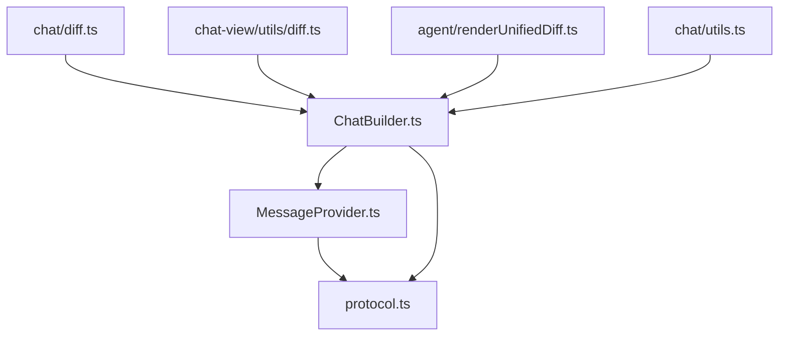
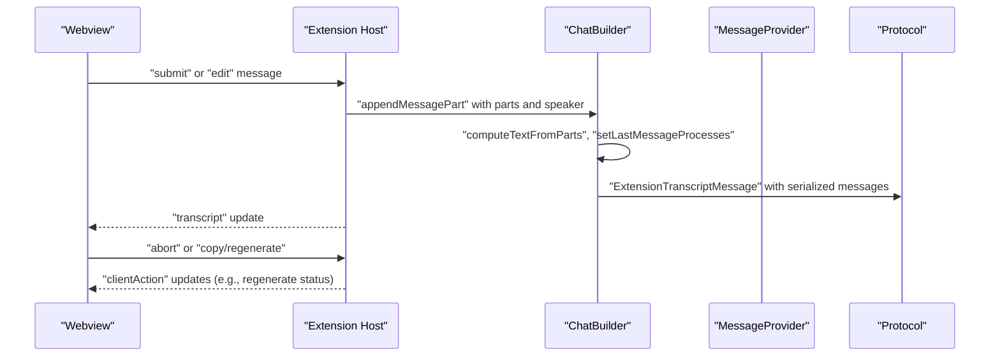
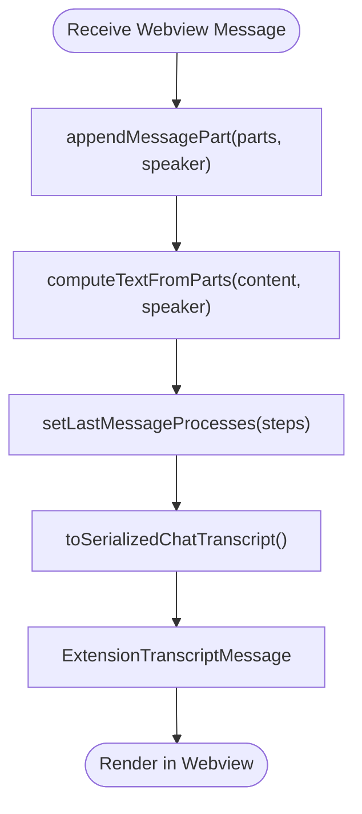
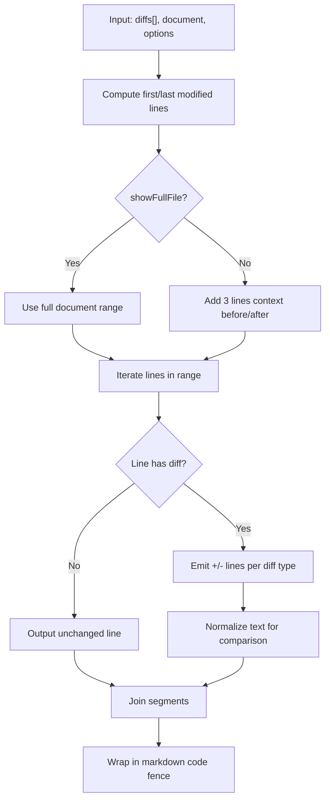
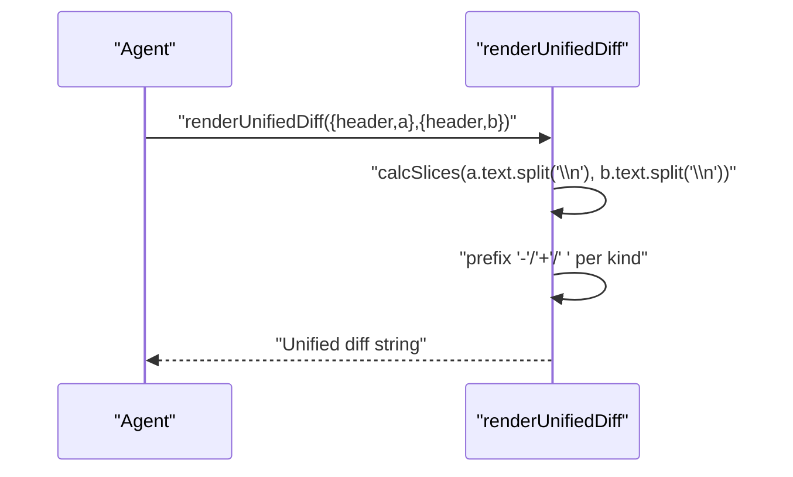
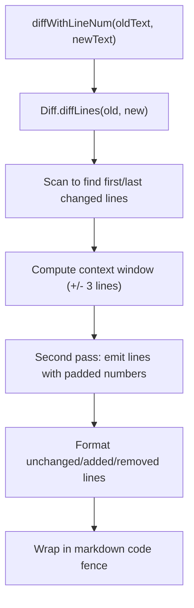
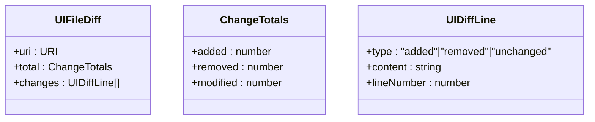
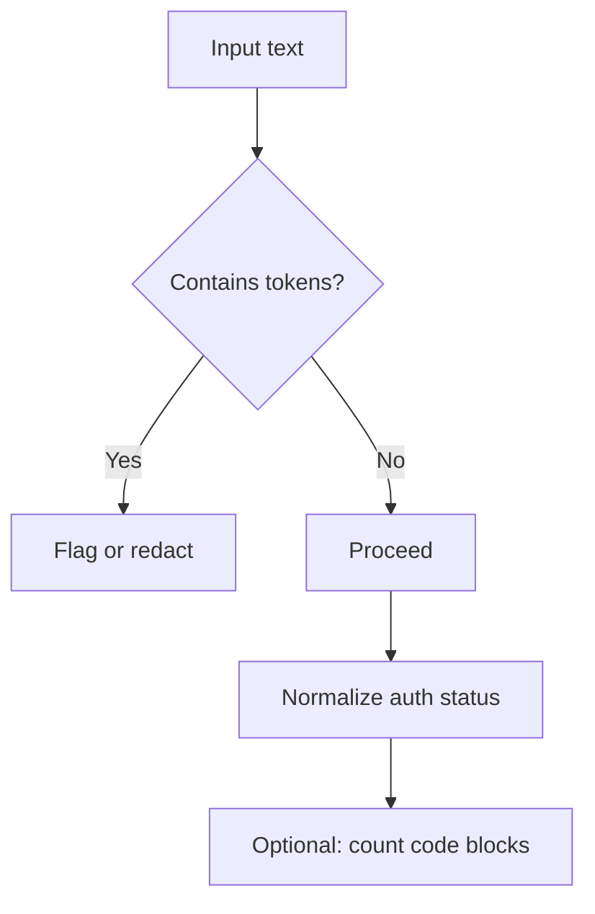
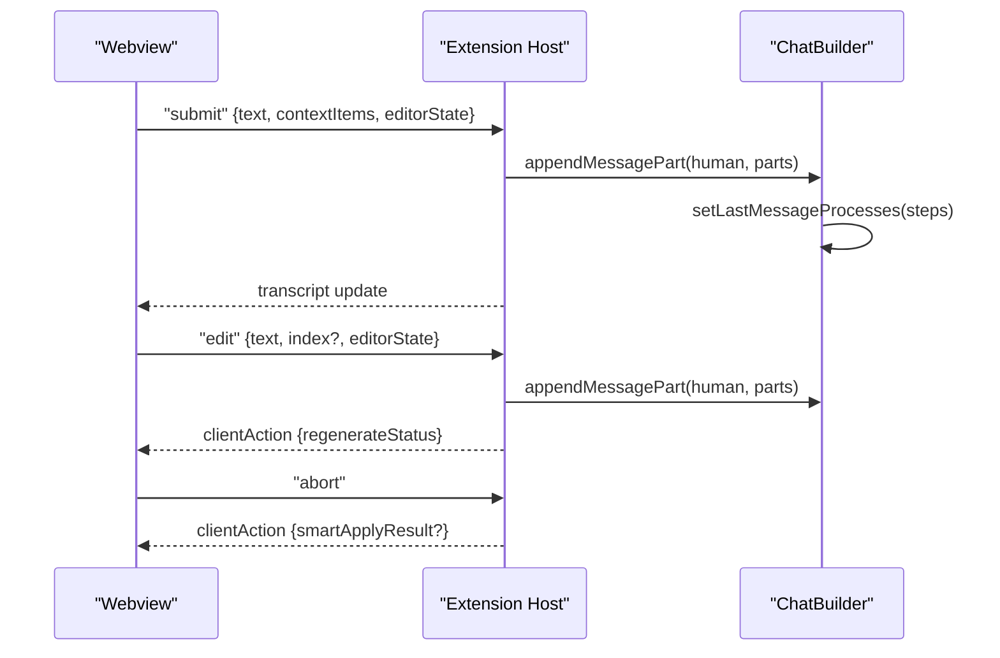
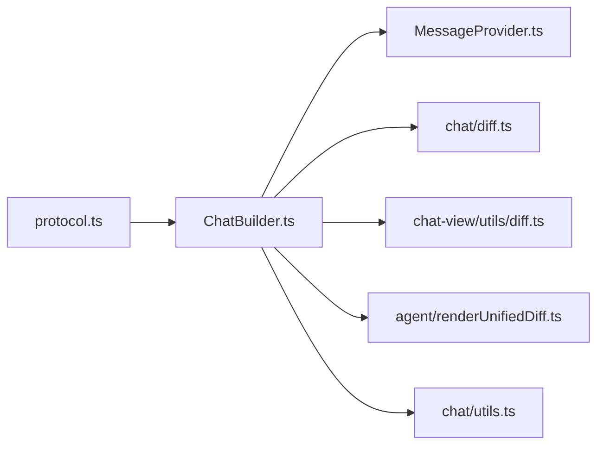

# Message Handling

<cite>
**Referenced Files in This Document**
- [MessageProvider.ts](file://vscode/src/chat/MessageProvider.ts)
- [diff.ts](file://vscode/src/chat/diff.ts)
- [diff.ts](file://vscode/src/chat/chat-view/utils/diff.ts)
- [protocol.ts](file://vscode/src/chat/protocol.ts)
- [utils.ts](file://vscode/src/chat/utils.ts)
- [ChatBuilder.ts](file://vscode/src/chat/chat-view/ChatBuilder.ts)
- [renderUnifiedDiff.ts](file://agent/src/renderUnifiedDiff.ts)
- [renderUnifiedDiff.test.ts](file://agent/src/renderUnifiedDiff.test.ts)
</cite>

## Table of Contents
1. [Introduction](#introduction)
2. [Project Structure](#project-structure)
3. [Core Components](#core-components)
4. [Architecture Overview](#architecture-overview)
5. [Detailed Component Analysis](#detailed-component-analysis)
6. [Dependency Analysis](#dependency-analysis)
7. [Performance Considerations](#performance-considerations)
8. [Troubleshooting Guide](#troubleshooting-guide)
9. [Conclusion](#conclusion)

## Introduction
This document explains the message handling subsystem responsible for managing chat messages in the application. It covers the MessageProvider architecture, message formatting, diff rendering for code responses, and response processing. It documents the message lifecycle from user input through AI processing to final presentation, along with diff handling, unified diff rendering, inline code visualization, validation, sanitization, and security measures. Practical examples, custom message handlers, integration patterns, configuration options, performance considerations, memory management, and error recovery strategies are included.

## Project Structure
The message handling subsystem spans several modules:
- MessageProvider: Defines error types and provider options for chat message orchestration.
- Protocol: Defines the wire-level message contracts exchanged between the webview and extension host.
- ChatBuilder: Manages message assembly, serialization, and transcript construction.
- Diff utilities: Provide compact and unified diff rendering for code changes.
- Utilities: Offer helpers for authentication status and code block counting.



**Diagram sources**
- [MessageProvider.ts:1-18](file://vscode/src/chat/MessageProvider.ts#L1-L18)
- [protocol.ts:55-236](file://vscode/src/chat/protocol.ts#L55-L236)
- [ChatBuilder.ts:238-359](file://vscode/src/chat/chat-view/ChatBuilder.ts#L238-L359)
- [diff.ts:1-121](file://vscode/src/chat/diff.ts#L1-L121)
- [diff.ts:1-198](file://vscode/src/chat/chat-view/utils/diff.ts#L1-L198)
- [renderUnifiedDiff.ts:1-24](file://agent/src/renderUnifiedDiff.ts#L1-L24)
- [utils.ts:1-80](file://vscode/src/chat/utils.ts#L1-L80)

**Section sources**
- [MessageProvider.ts:1-18](file://vscode/src/chat/MessageProvider.ts#L1-L18)
- [protocol.ts:55-236](file://vscode/src/chat/protocol.ts#L55-L236)
- [ChatBuilder.ts:238-359](file://vscode/src/chat/chat-view/ChatBuilder.ts#L238-L359)
- [diff.ts:1-121](file://vscode/src/chat/diff.ts#L1-L121)
- [diff.ts:1-198](file://vscode/src/chat/chat-view/utils/diff.ts#L1-L198)
- [renderUnifiedDiff.ts:1-24](file://agent/src/renderUnifiedDiff.ts#L1-L24)
- [utils.ts:1-80](file://vscode/src/chat/utils.ts#L1-L80)

## Core Components
- MessageProvider options and error types define the contract for chat clients, guardrails, and editor integration.
- Protocol defines bidirectional messaging between the webview and extension host, including submit, edit, abort, and transcript updates.
- ChatBuilder manages message assembly, processing steps, and transcript serialization.
- Diff utilities implement compact diffs for inline chat and unified diffs for agent-side rendering.
- Utilities provide authentication status normalization and code block metrics.

**Section sources**
- [MessageProvider.ts:11-18](file://vscode/src/chat/MessageProvider.ts#L11-L18)
- [protocol.ts:55-236](file://vscode/src/chat/protocol.ts#L55-L236)
- [ChatBuilder.ts:238-359](file://vscode/src/chat/chat-view/ChatBuilder.ts#L238-L359)
- [diff.ts:1-121](file://vscode/src/chat/diff.ts#L1-L121)
- [diff.ts:1-198](file://vscode/src/chat/chat-view/utils/diff.ts#L1-L198)
- [renderUnifiedDiff.ts:1-24](file://agent/src/renderUnifiedDiff.ts#L1-L24)
- [utils.ts:1-80](file://vscode/src/chat/utils.ts#L1-L80)

## Architecture Overview
The message lifecycle follows a clear pipeline:
- User input arrives via webview messages (submit/edit).
- The extension host constructs message parts and processes them through ChatBuilder.
- Responses are formatted and presented to the user, with optional diff rendering.
- Errors are categorized and routed appropriately (transcript/system/storage).



**Diagram sources**
- [protocol.ts:55-236](file://vscode/src/chat/protocol.ts#L55-L236)
- [ChatBuilder.ts:238-359](file://vscode/src/chat/chat-view/ChatBuilder.ts#L238-L359)
- [MessageProvider.ts:11-18](file://vscode/src/chat/MessageProvider.ts#L11-L18)

## Detailed Component Analysis

### MessageProvider Architecture
MessageProvider defines:
- Error categories for handling chat errors gracefully.
- Provider options including chat client, guardrails, and editor integration.

```mermaid
classDiagram
class MessageProviderOptions {
+chat : ChatClient
+guardrails : SourcegraphGuardrailsClient
+editor : VSCodeEditor
}
class MessageErrorType {
<<enumeration>>
"transcript"
"system"
"storage"
}
```

**Diagram sources**
- [MessageProvider.ts:11-18](file://vscode/src/chat/MessageProvider.ts#L11-L18)

**Section sources**
- [MessageProvider.ts:5-18](file://vscode/src/chat/MessageProvider.ts#L5-L18)

### Message Lifecycle and Processing
ChatBuilder orchestrates message assembly and processing:
- Append message parts for human/assistant speakers.
- Track processing steps and compute text from parts.
- Serialize transcripts for persistence and UI updates.



**Diagram sources**
- [ChatBuilder.ts:238-359](file://vscode/src/chat/chat-view/ChatBuilder.ts#L238-L359)

**Section sources**
- [ChatBuilder.ts:238-359](file://vscode/src/chat/chat-view/ChatBuilder.ts#L238-L359)

### Diff Rendering for Code Responses
Two diff rendering modes are supported:

1) Compact inline diff for chat messages
- Computes modified line ranges and renders context-aware diffs.
- Supports full-file or compact view with surrounding context.



**Diagram sources**
- [diff.ts:8-97](file://vscode/src/chat/diff.ts#L8-L97)
- [diff.ts:99-121](file://vscode/src/chat/diff.ts#L99-L121)

2) Unified diff for agent-side rendering
- Uses a slice-based diff engine to produce unified diffs with highlighted trailing whitespace.



**Diagram sources**
- [renderUnifiedDiff.ts:1-24](file://agent/src/renderUnifiedDiff.ts#L1-L24)

**Section sources**
- [diff.ts:1-121](file://vscode/src/chat/diff.ts#L1-L121)
- [renderUnifiedDiff.ts:1-24](file://agent/src/renderUnifiedDiff.ts#L1-L24)
- [renderUnifiedDiff.test.ts:1-88](file://agent/src/renderUnifiedDiff.test.ts#L1-L88)

### Unified Diff Rendering (UI)
The UI diff utility generates a markdown-formatted unified diff with line numbers and selective context.



**Diagram sources**
- [diff.ts:8-130](file://vscode/src/chat/chat-view/utils/diff.ts#L8-L130)

**Section sources**
- [diff.ts:1-198](file://vscode/src/chat/chat-view/utils/diff.ts#L1-L198)

### File-Level Diff Model
The file diff model aggregates change counts and line-wise changes for UI consumption.



**Diagram sources**
- [diff.ts:132-198](file://vscode/src/chat/chat-view/utils/diff.ts#L132-L198)

**Section sources**
- [diff.ts:132-198](file://vscode/src/chat/chat-view/utils/diff.ts#L132-L198)

### Message Validation, Sanitization, and Security
- Authentication status normalization ensures consistent representation across environments.
- Token detection regex is provided for sensitive data checks.
- Code block counting utility helps estimate generated code volume.



**Diagram sources**
- [protocol.ts:345-356](file://vscode/src/chat/protocol.ts#L345-L356)
- [utils.ts:24-52](file://vscode/src/chat/utils.ts#L24-L52)
- [utils.ts:60-80](file://vscode/src/chat/utils.ts#L60-L80)

**Section sources**
- [protocol.ts:345-356](file://vscode/src/chat/protocol.ts#L345-L356)
- [utils.ts:24-52](file://vscode/src/chat/utils.ts#L24-L52)
- [utils.ts:60-80](file://vscode/src/chat/utils.ts#L60-L80)

### Practical Examples and Integration Patterns
- Submitting a new message: The webview sends a submit command with context items and editor state; the extension host appends a human message part and triggers processing steps.
- Editing an existing message: The webview sends an edit command; the extension host updates the last human message and re-processes downstream interactions.
- Abort and regeneration: The webview can request abort or regenerate actions; the extension host responds with clientAction updates.



**Diagram sources**
- [protocol.ts:55-236](file://vscode/src/chat/protocol.ts#L55-L236)
- [ChatBuilder.ts:238-359](file://vscode/src/chat/chat-view/ChatBuilder.ts#L238-L359)

**Section sources**
- [protocol.ts:55-236](file://vscode/src/chat/protocol.ts#L55-L236)
- [ChatBuilder.ts:238-359](file://vscode/src/chat/chat-view/ChatBuilder.ts#L238-L359)

### Configuration Options
- Webview configuration subset exposes flags for experimental features and capabilities relevant to message handling and rendering.
- Endpoint and capability exposure influence UI behavior and available actions.

**Section sources**
- [protocol.ts:297-314](file://vscode/src/chat/protocol.ts#L297-L314)

## Dependency Analysis
Message handling depends on:
- Protocol contracts for message exchange.
- ChatBuilder for assembling and serializing transcripts.
- Diff utilities for inline and unified diff rendering.
- Utilities for authentication and code metrics.



**Diagram sources**
- [protocol.ts:55-236](file://vscode/src/chat/protocol.ts#L55-L236)
- [ChatBuilder.ts:238-359](file://vscode/src/chat/chat-view/ChatBuilder.ts#L238-L359)
- [MessageProvider.ts:11-18](file://vscode/src/chat/MessageProvider.ts#L11-L18)
- [diff.ts:1-121](file://vscode/src/chat/diff.ts#L1-L121)
- [diff.ts:1-198](file://vscode/src/chat/chat-view/utils/diff.ts#L1-L198)
- [renderUnifiedDiff.ts:1-24](file://agent/src/renderUnifiedDiff.ts#L1-L24)
- [utils.ts:1-80](file://vscode/src/chat/utils.ts#L1-L80)

**Section sources**
- [protocol.ts:55-236](file://vscode/src/chat/protocol.ts#L55-L236)
- [ChatBuilder.ts:238-359](file://vscode/src/chat/chat-view/ChatBuilder.ts#L238-L359)
- [MessageProvider.ts:11-18](file://vscode/src/chat/MessageProvider.ts#L11-L18)
- [diff.ts:1-121](file://vscode/src/chat/diff.ts#L1-L121)
- [diff.ts:1-198](file://vscode/src/chat/chat-view/utils/diff.ts#L1-L198)
- [renderUnifiedDiff.ts:1-24](file://agent/src/renderUnifiedDiff.ts#L1-L24)
- [utils.ts:1-80](file://vscode/src/chat/utils.ts#L1-L80)

## Performance Considerations
- Large messages: Prefer streaming or chunked processing to avoid blocking the UI thread. Limit diff context windows to reduce rendering overhead.
- Memory management: Reuse computed structures (e.g., normalized text) and avoid retaining large intermediate buffers after rendering.
- Diff computation: Use compact diff ranges and context trimming to minimize DOM/text generation for inline diffs.
- Unified diffs: Limit context size and avoid rendering unnecessary unchanged lines to keep agent-side diffs concise.
- Serialization: Batch transcript updates and debounce serialization to reduce repeated work.

## Troubleshooting Guide
- Transcript errors: Errors can be displayed directly in the transcript or escalated as system/storage warnings depending on severity.
- Authentication issues: Validate endpoint and token presence; normalize auth status to ensure consistent behavior across environments.
- Diff mismatches: Verify normalized text comparisons and ensure consistent line ending handling.
- Regeneration failures: Monitor clientAction regenerateStatus updates and surface actionable errors to the user.

**Section sources**
- [MessageProvider.ts:5-18](file://vscode/src/chat/MessageProvider.ts#L5-L18)
- [protocol.ts:345-356](file://vscode/src/chat/protocol.ts#L345-L356)
- [diff.ts:99-121](file://vscode/src/chat/diff.ts#L99-L121)

## Conclusion
The message handling subsystem integrates protocol-defined exchanges, builder-driven message assembly, and robust diff rendering to deliver a responsive and secure chat experience. By leveraging categorized error handling, normalized authentication states, and configurable diff preferences, the system supports both inline and unified diff presentations while maintaining performance and reliability.