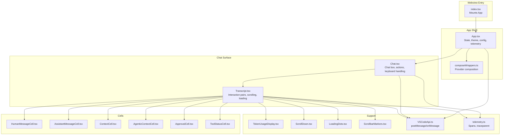
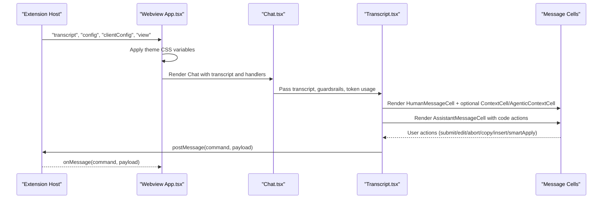
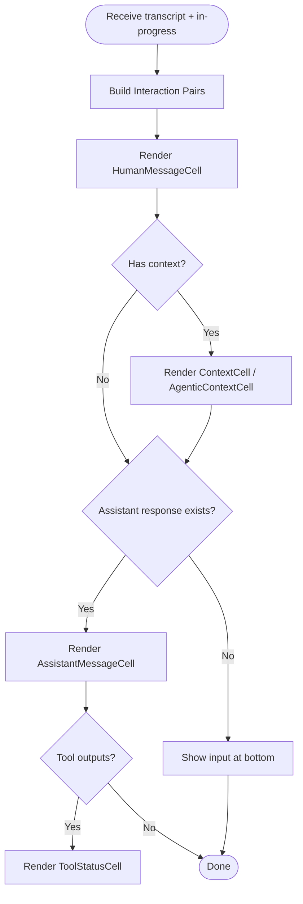
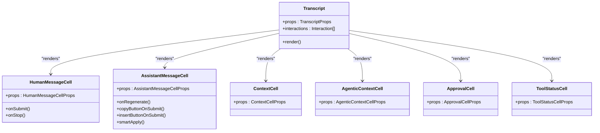
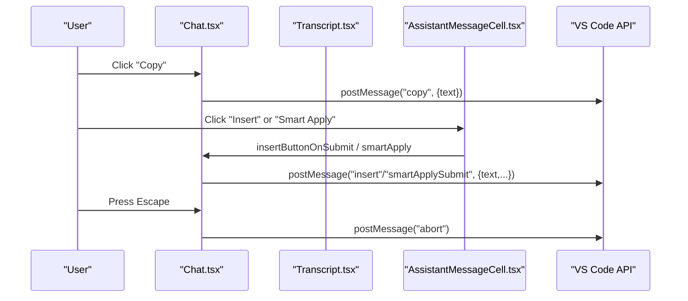
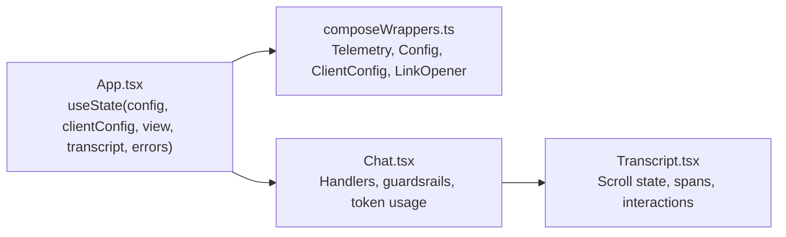
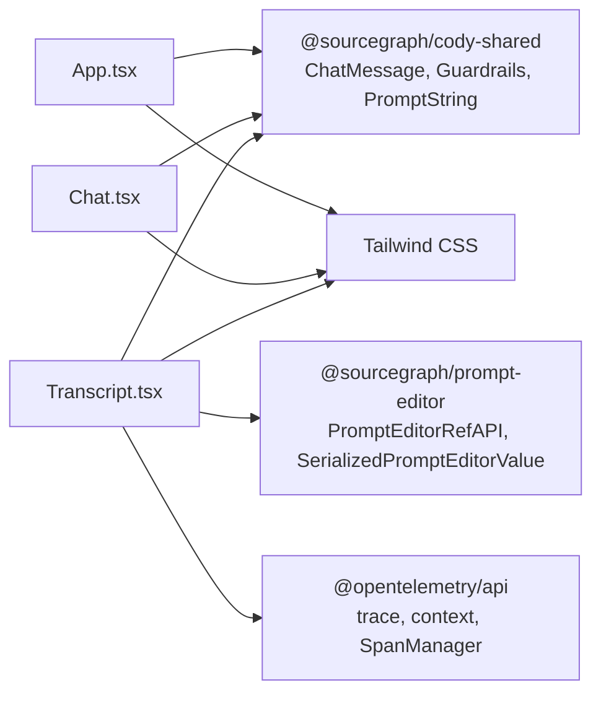

# UI Components

<cite>
**Referenced Files in This Document**
- [index.tsx](file://vscode/webviews/index.tsx)
- [App.tsx](file://vscode/webviews/App.tsx)
- [Chat.tsx](file://vscode/webviews/Chat.tsx)
- [Transcript.tsx](file://vscode/webviews/chat/Transcript.tsx)
- [AssistantMessageCell.tsx](file://vscode/webviews/chat/cells/messageCell/assistant/AssistantMessageCell.tsx)
- [HumanMessageCell.tsx](file://vscode/webviews/chat/cells/messageCell/human/HumanMessageCell.tsx)
- [AgenticContextCell.tsx](file://vscode/webviews/chat/cells/agenticCell/AgenticContextCell.tsx)
- [ApprovalCell.tsx](file://vscode/webviews/chat/cells/agenticCell/ApprovalCell.tsx)
- [ContextCell.tsx](file://vscode/webviews/chat/cells/contextCell/ContextCell.tsx)
- [ToolStatusCell.tsx](file://vscode/webviews/chat/cells/toolCell/ToolStatusCell.tsx)
- [TokenUsageDisplay.tsx](file://vscode/webviews/chat/TokenUsageDisplay.tsx)
- [ScrollDown.tsx](file://vscode/webviews/components/ScrollDown.tsx)
- [LoadingDots.tsx](file://vscode/webviews/chat/components/LoadingDots.tsx)
- [ScrollbarMarkers.tsx](file://vscode/webviews/chat/components/ScrollbarMarkers.tsx)
- [VSCodeApi.ts](file://vscode/webviews/utils/VSCodeApi.ts)
- [telemetry.ts](file://vscode/webviews/utils/telemetry.ts)
- [composeWrappers.ts](file://vscode/webviews/utils/composeWrappers.ts)
- [useClientConfig.ts](file://vscode/webviews/utils/useClientConfig.ts)
- [useConfig.ts](file://vscode/webviews/utils/useConfig.ts)
- [App.module.css](file://vscode/webviews/App.module.css)
- [Chat.module.css](file://vscode/webviews/Chat.module.css)
</cite>

## Table of Contents
1. [Introduction](#introduction)
2. [Project Structure](#project-structure)
3. [Core Components](#core-components)
4. [Architecture Overview](#architecture-overview)
5. [Detailed Component Analysis](#detailed-component-analysis)
6. [Dependency Analysis](#dependency-analysis)
7. [Performance Considerations](#performance-considerations)
8. [Troubleshooting Guide](#troubleshooting-guide)
9. [Conclusion](#conclusion)

## Introduction
This document explains the React component architecture for the chat UI subsystem in the webview. It covers how transcripts are rendered, how message cells are composed for different roles (human, assistant, tool), and how interactive elements integrate with the extension host. It also documents state management patterns, styling approaches, webview integration, cross-platform compatibility, accessibility, responsiveness, performance optimizations, theming, and customization points.

## Project Structure
The chat UI is implemented as a React application mounted inside a VS Code webview. The entry point initializes the app and wraps it with providers for telemetry, configuration, and VS Code communication. The main chat view composes a transcript renderer that orchestrates message cells and contextual UI.



**Diagram sources**
- [index.tsx:1-18](file://vscode/webviews/index.tsx#L1-L18)
- [App.tsx:1-273](file://vscode/webviews/App.tsx#L1-L273)
- [Chat.tsx:1-243](file://vscode/webviews/Chat.tsx#L1-L243)
- [Transcript.tsx:1-882](file://vscode/webviews/chat/Transcript.tsx#L1-L882)
- [AssistantMessageCell.tsx](file://vscode/webviews/chat/cells/messageCell/assistant/AssistantMessageCell.tsx)
- [HumanMessageCell.tsx](file://vscode/webviews/chat/cells/messageCell/human/HumanMessageCell.tsx)
- [AgenticContextCell.tsx](file://vscode/webviews/chat/cells/agenticCell/AgenticContextCell.tsx)
- [ApprovalCell.tsx](file://vscode/webviews/chat/cells/agenticCell/ApprovalCell.tsx)
- [ContextCell.tsx](file://vscode/webviews/chat/cells/contextCell/ContextCell.tsx)
- [ToolStatusCell.tsx](file://vscode/webviews/chat/cells/toolCell/ToolStatusCell.tsx)
- [TokenUsageDisplay.tsx](file://vscode/webviews/chat/TokenUsageDisplay.tsx)
- [ScrollDown.tsx](file://vscode/webviews/components/ScrollDown.tsx)
- [LoadingDots.tsx](file://vscode/webviews/chat/components/LoadingDots.tsx)
- [ScrollbarMarkers.tsx](file://vscode/webviews/chat/components/ScrollbarMarkers.tsx)
- [VSCodeApi.ts](file://vscode/webviews/utils/VSCodeApi.ts)
- [telemetry.ts](file://vscode/webviews/utils/telemetry.ts)
- [composeWrappers.ts](file://vscode/webviews/utils/composeWrappers.ts)

**Section sources**
- [index.tsx:1-18](file://vscode/webviews/index.tsx#L1-L18)
- [App.tsx:1-273](file://vscode/webviews/App.tsx#L1-L273)

## Core Components
- App: Initializes configuration, theme, telemetry, and routes to Login or Chat view. Provides wrappers for telemetry recorder, config, client config, and link opener.
- Chat: Hosts the transcript, handles keyboard shortcuts, snippet insertion and copy actions, and Smart Apply controls. Exposes guardsrails and token usage.
- Transcript: Converts messages into interaction pairs (human/assistant), manages scrolling, auto-focus, and renders the appropriate cells per interaction.

Key props and responsibilities:
- App: Receives VS Code API, config, client config, and dispatches client actions. Applies theme CSS variables and updates document metadata.
- Chat: Accepts transcript, in-progress message, token usage, models, guardsrails, and handlers for copy/insert/smartApply. Manages focus and abort behavior.
- Transcript: Builds interaction pairs, computes loading states, tracks scroll position, and renders HumanMessageCell, AssistantMessageCell, ContextCell, AgenticContextCell, ApprovalCell, and ToolStatusCell.

**Section sources**
- [App.tsx:32-233](file://vscode/webviews/App.tsx#L32-L233)
- [Chat.tsx:24-228](file://vscode/webviews/Chat.tsx#L24-L228)
- [Transcript.tsx:52-376](file://vscode/webviews/chat/Transcript.tsx#L52-L376)

## Architecture Overview
The chat UI follows a provider-based composition pattern. Providers supply configuration, telemetry recorder, client config, and link opening capabilities to the component tree. The VS Code API is exposed via a wrapper to send and receive messages. The transcript orchestrates message rendering and user interactions, delegating to specialized cells.



**Diagram sources**
- [App.tsx:67-136](file://vscode/webviews/App.tsx#L67-L136)
- [Chat.tsx:159-178](file://vscode/webviews/Chat.tsx#L159-L178)
- [Transcript.tsx:431-488](file://vscode/webviews/chat/Transcript.tsx#L431-L488)

## Detailed Component Analysis

### Transcript Rendering and Interaction Pairs
The Transcript converts a flat message array into interaction pairs and manages:
- Scrolling behavior with auto-scroll and user scroll detection
- Debounced “at bottom” state to stabilize UI
- Conditional rendering of the input interaction at the bottom
- Loading indicators and welcome content
- Token usage display for pending input



**Diagram sources**
- [Transcript.tsx:113-116](file://vscode/webviews/chat/Transcript.tsx#L113-L116)
- [Transcript.tsx:317-376](file://vscode/webviews/chat/Transcript.tsx#L317-L376)
- [Transcript.tsx:718-805](file://vscode/webviews/chat/Transcript.tsx#L718-L805)

**Section sources**
- [Transcript.tsx:94-306](file://vscode/webviews/chat/Transcript.tsx#L94-L306)
- [Transcript.tsx:317-376](file://vscode/webviews/chat/Transcript.tsx#L317-L376)

### Cell-Based System for Message Types
- HumanMessageCell: Renders the user’s input editor, supports intents (chat vs agentic), edit/submit lifecycle, and abort.
- AssistantMessageCell: Renders assistant replies, code blocks, regeneration, Smart Apply, thought process toggle, and copy/insert actions.
- ContextCell: Displays context items and alternatives associated with a human message.
- AgenticContextCell: Shows agent processes and context loading states.
- ApprovalCell: Requests approval for agent context retrieval.
- ToolStatusCell: Visualizes tool invocation outputs.



**Diagram sources**
- [Transcript.tsx:726-805](file://vscode/webviews/chat/Transcript.tsx#L726-L805)
- [AssistantMessageCell.tsx](file://vscode/webviews/chat/cells/messageCell/assistant/AssistantMessageCell.tsx)
- [HumanMessageCell.tsx](file://vscode/webviews/chat/cells/messageCell/human/HumanMessageCell.tsx)
- [ContextCell.tsx](file://vscode/webviews/chat/cells/contextCell/ContextCell.tsx)
- [AgenticContextCell.tsx](file://vscode/webviews/chat/cells/agenticCell/AgenticContextCell.tsx)
- [ApprovalCell.tsx](file://vscode/webviews/chat/cells/agenticCell/ApprovalCell.tsx)
- [ToolStatusCell.tsx](file://vscode/webviews/chat/cells/toolCell/ToolStatusCell.tsx)

**Section sources**
- [Transcript.tsx:718-805](file://vscode/webviews/chat/Transcript.tsx#L718-L805)

### Interactive Elements and Actions
- Copy/Insert/Smart Apply: Handlers are passed down to AssistantMessageCell and wired to VS Code API commands.
- Abort: Esc key triggers abort when a message is in progress.
- Focus management: On webview focus, re-focuses the last active lexical editor.
- Regeneration: Tracks code block regeneration status and updates UI accordingly.



**Diagram sources**
- [Chat.tsx:65-97](file://vscode/webviews/Chat.tsx#L65-L97)
- [Chat.tsx:104-155](file://vscode/webviews/Chat.tsx#L104-L155)
- [Chat.tsx:159-178](file://vscode/webviews/Chat.tsx#L159-L178)
- [Transcript.tsx:839-881](file://vscode/webviews/chat/Transcript.tsx#L839-L881)

**Section sources**
- [Chat.tsx:65-178](file://vscode/webviews/Chat.tsx#L65-L178)
- [Transcript.tsx:839-881](file://vscode/webviews/chat/Transcript.tsx#L839-L881)

### State Management Patterns
- App-level state: Transcript, in-progress message, token usage, errors, and view selection.
- Provider composition: Telemetry recorder, config, client config, and link opener are provided via wrappers.
- Local state in Transcript: Scroll tracking, “at bottom” debounce, and rendering spans for performance measurement.
- Local storage: Preferences such as thought process visibility.



**Diagram sources**
- [App.tsx:32-136](file://vscode/webviews/App.tsx#L32-L136)
- [composeWrappers.ts:243-272](file://vscode/webviews/utils/composeWrappers.ts#L243-L272)
- [Chat.tsx:46-59](file://vscode/webviews/Chat.tsx#L46-L59)
- [Transcript.tsx:118-126](file://vscode/webviews/chat/Transcript.tsx#L118-L126)

**Section sources**
- [App.tsx:32-136](file://vscode/webviews/App.tsx#L32-L136)
- [composeWrappers.ts:243-272](file://vscode/webviews/utils/composeWrappers.ts#L243-L272)
- [Transcript.tsx:118-126](file://vscode/webviews/chat/Transcript.tsx#L118-L126)

### Styling Approaches and Theming
- Theme application: The App listens for theme updates and applies CSS variables to the document root, setting IDE metadata.
- Component styles: Tailwind utility classes are used extensively for layout and spacing. Module CSS files define container-level styles.
- Dark/light mode: Controlled by theme variables applied from the extension host.

```mermaid
flowchart TD
Ext["Extension Host"] --> |ui/theme| App["App.tsx"]
App --> |setProperty(name,value)| Root["document.documentElement.style"]
Root --> Classes["Tailwind classes in components"]
App --> Modules["Module CSS (App.module.css, Chat.module.css)"]
```

**Diagram sources**
- [App.tsx:67-78](file://vscode/webviews/App.tsx#L67-L78)
- [App.module.css](file://vscode/webviews/App.module.css)
- [Chat.module.css](file://vscode/webviews/Chat.module.css)

**Section sources**
- [App.tsx:67-78](file://vscode/webviews/App.tsx#L67-L78)
- [App.module.css](file://vscode/webviews/App.module.css)
- [Chat.module.css](file://vscode/webviews/Chat.module.css)

### Accessibility and Responsive Design
- Focus management: Ensures the editor regains focus after actions and on webview focus.
- Scroll behavior: Auto-scroll to bottom when appropriate, with user scroll detection to avoid disrupting reading.
- Keyboard shortcuts: Escape to abort, and suppression of unintended keybindings.
- Responsive layout: Flexbox containers and utility classes adapt to content height and viewport.

**Section sources**
- [Chat.tsx:183-199](file://vscode/webviews/Chat.tsx#L183-L199)
- [Transcript.tsx:144-177](file://vscode/webviews/chat/Transcript.tsx#L144-L177)

### Cross-Platform Compatibility
- VS Code API abstraction: All IPC uses a wrapper that exposes postMessage and onMessage, enabling consistent behavior across platforms.
- Device pixel ratio handling: Notifies the extension host for image generation sizing.
- Environment info: Workspace URIs are propagated for display path resolution.

**Section sources**
- [VSCodeApi.ts](file://vscode/webviews/utils/VSCodeApi.ts)
- [App.tsx:183-185](file://vscode/webviews/App.tsx#L183-L185)
- [App.tsx:97-98](file://vscode/webviews/App.tsx#L97-L98)

### Practical Examples and Extension Points
- Customization options:
  - Chat: Enable/disable chat, code highlighting, show/hide snippet actions, and workspace upgrade CTA.
  - Transcript: Provide welcome content, pass token usage, and configure guardsrails.
- Extension points:
  - Client actions listener for regeneration status.
  - Telemetry spans for render timing and time-to-first-token.
  - Provider wrappers for adding new context providers.

**Section sources**
- [Chat.tsx:24-59](file://vscode/webviews/Chat.tsx#L24-L59)
- [Transcript.tsx:665-691](file://vscode/webviews/chat/Transcript.tsx#L665-L691)
- [telemetry.ts](file://vscode/webviews/utils/telemetry.ts)

## Dependency Analysis
The chat UI depends on:
- Shared types and utilities from @sourcegraph/cody-shared for message serialization and guardrails.
- Prompt Editor for rich text input and context item serialization.
- OpenTelemetry for tracing and performance measurement.
- Tailwind utilities for styling.



**Diagram sources**
- [App.tsx:3-11](file://vscode/webviews/App.tsx#L3-L11)
- [Chat.tsx:5-13](file://vscode/webviews/Chat.tsx#L5-L13)
- [Transcript.tsx:1-8](file://vscode/webviews/chat/Transcript.tsx#L1-L8)
- [telemetry.ts](file://vscode/webviews/utils/telemetry.ts)

**Section sources**
- [App.tsx:3-11](file://vscode/webviews/App.tsx#L3-L11)
- [Chat.tsx:5-13](file://vscode/webviews/Chat.tsx#L5-L13)
- [Transcript.tsx:1-8](file://vscode/webviews/chat/Transcript.tsx#L1-L8)

## Performance Considerations
- Memoization: Interaction pairs and cell rendering are memoized to minimize re-renders.
- Debounced UI state: “At bottom” state is debounced to prevent flicker.
- Conditional rendering: Input interaction is rendered separately to avoid duplication.
- Spans and measurements: Render spans and time-to-first-token spans are used to monitor performance.
- Auto-scroll optimization: Resets user scroll flag when appropriate to avoid jank.

**Section sources**
- [Transcript.tsx:78-92](file://vscode/webviews/chat/Transcript.tsx#L78-L92)
- [Transcript.tsx:179-191](file://vscode/webviews/chat/Transcript.tsx#L179-L191)
- [Transcript.tsx:533-628](file://vscode/webviews/chat/Transcript.tsx#L533-L628)

## Troubleshooting Guide
- Theme not applying: Verify theme messages are received and CSS variables are set on the document root.
- Messages not appearing: Confirm transcript messages are deserialized and the last interaction is rendered at the bottom when applicable.
- Copy/Insert/Abort not working: Ensure VS Code API wrapper is initialized and postMessage is called with correct commands.
- Scroll issues: Check scroll listeners and user scroll flag logic.
- Telemetry missing: Confirm telemetry recorder is configured and spans are started/ended correctly.

**Section sources**
- [App.tsx:67-78](file://vscode/webviews/App.tsx#L67-L78)
- [Transcript.tsx:128-142](file://vscode/webviews/chat/Transcript.tsx#L128-L142)
- [Chat.tsx:159-178](file://vscode/webviews/Chat.tsx#L159-L178)
- [telemetry.ts](file://vscode/webviews/utils/telemetry.ts)

## Conclusion
The chat UI subsystem is structured around a provider-based React application that communicates with the extension host via a VS Code API wrapper. Transcript orchestration, cell-based rendering, and robust state management deliver a responsive, accessible, and performant chat experience. Theming, telemetry, and modular components enable customization and cross-platform compatibility while maintaining visual consistency.