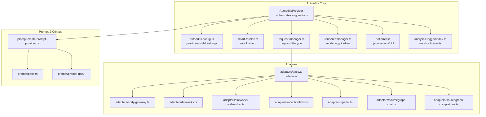
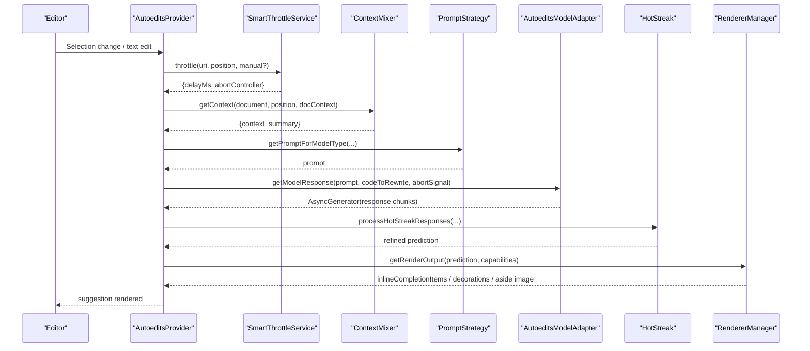
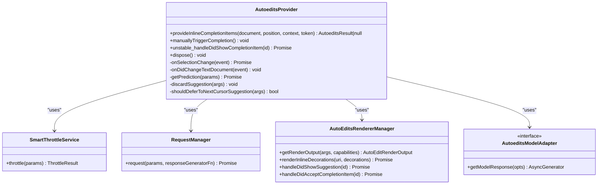
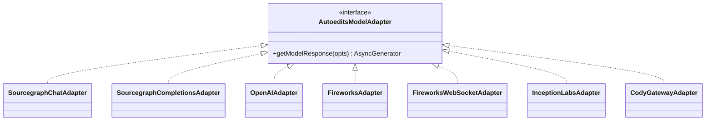
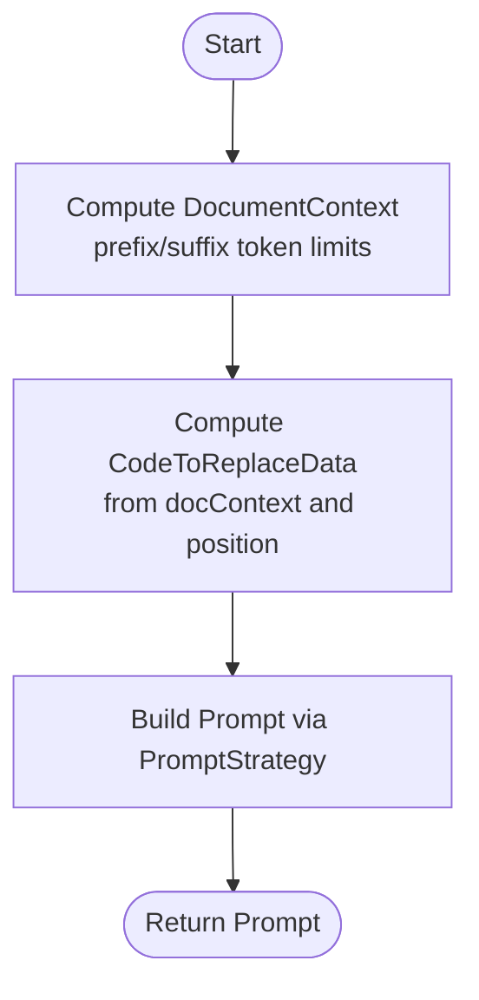
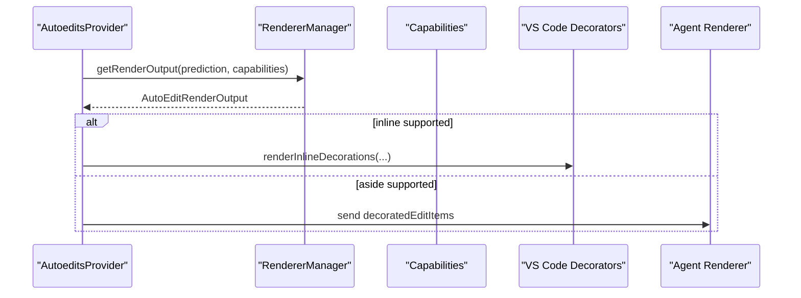
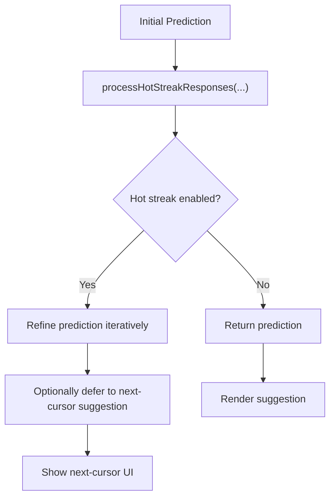
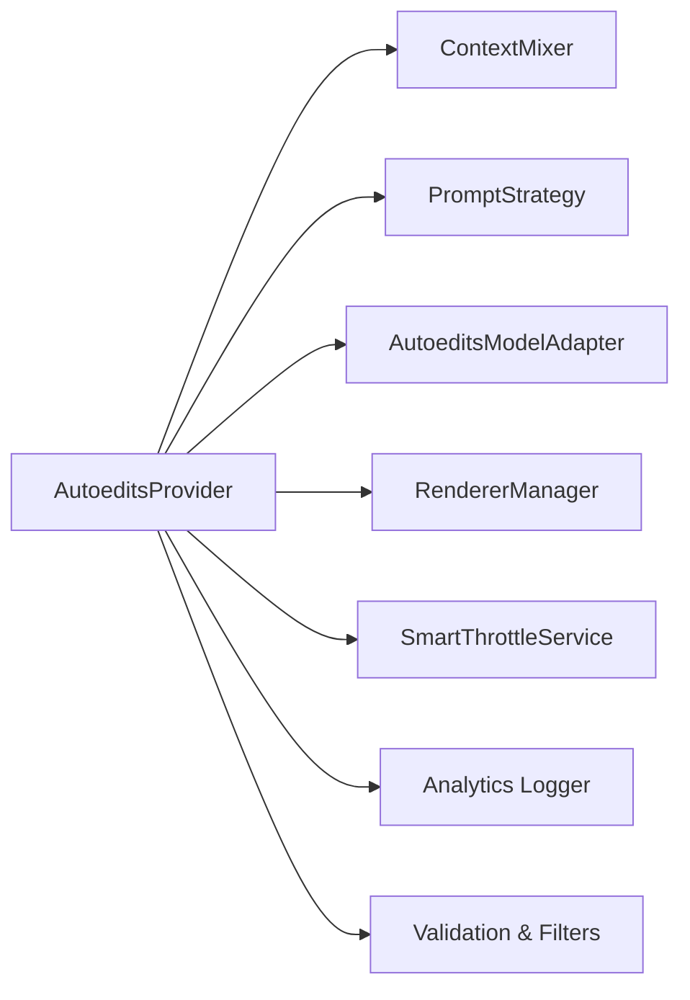

# Autoedits System

<cite>
**Referenced Files in This Document**
- [autoedits-provider.ts](file://vscode/src/autoedits/autoedits-provider.ts)
- [create-adapter.ts](file://vscode/src/autoedits/adapters/create-adapter.ts)
- [base.ts](file://vscode/src/autoedits/adapters/base.ts)
- [cody-gateway.ts](file://vscode/src/autoedits/adapters/cody-gateway.ts)
- [fireworks.ts](file://vscode/src/autoedits/adapters/fireworks.ts)
- [fireworks-websocket.ts](file://vscode/src/autoedits/adapters/fireworks-websocket.ts)
- [inceptionlabs.ts](file://vscode/src/autoedits/adapters/inceptionlabs.ts)
- [openai.ts](file://vscode/src/autoedits/adapters/openai.ts)
- [sourcegraph-chat.ts](file://vscode/src/autoedits/adapters/sourcegraph-chat.ts)
- [sourcegraph-completions.ts](file://vscode/src/autoedits/adapters/sourcegraph-completions.ts)
- [autoedits-config.ts](file://vscode/src/autoedits/autoedits-config.ts)
- [request-manager.ts](file://vscode/src/autoedits/request-manager.ts)
- [request-recycling.ts](file://vscode/src/autoedits/request-recycling.ts)
- [smart-throttle.ts](file://vscode/src/autoedits/smart-throttle.ts)
- [hot-streak/index.ts](file://vscode/src/autoedits/hot-streak/index.ts)
- [hot-streak/process.ts](file://vscode/src/autoedits/hot-streak/process.ts)
- [hot-streak/state.ts](file://vscode/src/autoedits/hot-streak/state.ts)
- [hot-streak/ui.ts](file://vscode/src/autoedits/hot-streak/ui.ts)
- [prompt/create-prompt-provider.ts](file://vscode/src/autoedits/prompt/create-prompt-provider.ts)
- [prompt/base.ts](file://vscode/src/autoedits/prompt/base.ts)
- [prompt/prompt-utils/code-to-replace.ts](file://vscode/src/autoedits/prompt/prompt-utils/code-to-replace.ts)
- [prompt/prompt-utils/common.ts](file://vscode/src/autoedits/prompt/prompt-utils/common.ts)
- [renderer/manager.ts](file://vscode/src/autoedits/renderer/manager.ts)
- [renderer/diff-utils.ts](file://vscode/src/autoedits/renderer/diff-utils.ts)
- [renderer/next-cursor-manager.ts](file://vscode/src/autoedits/renderer/next-cursor-manager.ts)
- [renderer/render-output.ts](file://vscode/src/autoedits/renderer/render-output.ts)
- [analytics-logger/index.ts](file://vscode/src/autoedits/analytics-logger/index.ts)
- [output-channel-logger.ts](file://vscode/src/autoedits/output-channel-logger.ts)
- [autoedit-onboarding.ts](file://vscode/src/autoedits/autoedit-onboarding.ts)
- [autoedit-completion-item.ts](file://vscode/src/autoedits/autoedit-completion-item.ts)
- [big-diff-modification.ts](file://vscode/src/autoedits/big-diff-modification.ts)
- [filter-prediction-edits.ts](file://vscode/src/autoedits/filter-prediction-edits.ts)
- [shrink-prediction.ts](file://vscode/src/autoedits/shrink-prediction.ts)
- [utils.ts](file://vscode/src/autoedits/utils.ts)
- [autoedit.test.ts](file://agent/src/autoedit.test.ts)
- [autoedit.test.ts](file://vscode/test/e2e/auto-edits.test.ts)
- [autoedit-debug.tsx](file://vscode/webviews/autoedit-debug/autoedit-debug.tsx)
- [autoedit-debug-panel.tsx](file://vscode/webviews/autoedit-debug/AutoeditDebugPanel.tsx)
</cite>

## Table of Contents
1. [Introduction](#introduction)
2. [Project Structure](#project-structure)
3. [Core Components](#core-components)
4. [Architecture Overview](#architecture-overview)
5. [Detailed Component Analysis](#detailed-component-analysis)
6. [Dependency Analysis](#dependency-analysis)
7. [Performance Considerations](#performance-considerations)
8. [Troubleshooting Guide](#troubleshooting-guide)
9. [Conclusion](#conclusion)
10. [Appendices](#appendices)

## Introduction
The Autoedits system predicts and renders code suggestions without requiring explicit user commands. It continuously observes editor activity, triggers AI model inference requests, validates and refines predictions, and presents inline diffs and interactive approvals. The system integrates prompt engineering, context mixing, hot streak optimization, request throttling, and a robust rendering pipeline to deliver responsive, high-quality suggestions.

## Project Structure
The autoedits subsystem is primarily located under vscode/src/autoedits and includes:
- Provider orchestration and lifecycle management
- Adapter implementations for multiple AI providers
- Prompt engineering and context gathering
- Rendering pipeline for inline and aside diffs
- Hot streak optimization and next-cursor suggestions
- Request management, throttling, and analytics
- Debugging and onboarding utilities

**Diagram sources**
- [autoedits-provider.ts](file://vscode/src/autoedits/autoedits-provider.ts)
- [autoedits-config.ts](file://vscode/src/autoedits/autoedits-config.ts)
- [smart-throttle.ts](file://vscode/src/autoedits/smart-throttle.ts)
- [request-manager.ts](file://vscode/src/autoedits/request-manager.ts)
- [renderer/manager.ts](file://vscode/src/autoedits/renderer/manager.ts)
- [hot-streak/index.ts](file://vscode/src/autoedits/hot-streak/index.ts)
- [analytics-logger/index.ts](file://vscode/src/autoedits/analytics-logger/index.ts)
- [adapters/base.ts](file://vscode/src/autoedits/adapters/base.ts)
- [adapters/create-adapter.ts](file://vscode/src/autoedits/adapters/create-adapter.ts)
- [prompt/create-prompt-provider.ts](file://vscode/src/autoedits/prompt/create-prompt-provider.ts)
- [prompt/base.ts](file://vscode/src/autoedits/prompt/base.ts)
- [prompt/prompt-utils/code-to-replace.ts](file://vscode/src/autoedits/prompt/prompt-utils/code-to-replace.ts)
- [prompt/prompt-utils/common.ts](file://vscode/src/autoedits/prompt/prompt-utils/common.ts)

**Section sources**
- [autoedits-provider.ts](file://vscode/src/autoedits/autoedits-provider.ts)
- [autoedits-config.ts](file://vscode/src/autoedits/autoedits-config.ts)

## Core Components
- AutoeditsProvider: Central orchestrator that computes document context, builds prompts, invokes model adapters, validates predictions, and renders suggestions.
- Adapters: Pluggable model integrations supporting multiple providers (e.g., Sourcegraph, OpenAI, Fireworks, Cody Gateway).
- Prompt Engineering: Strategies to gather context, compute code-to-replace regions, and construct model prompts.
- Rendering Pipeline: Produces inline decorations and aside diffs; supports image generation and next-cursor suggestions.
- Hot Streak Optimization: Iteratively refines suggestions and enables “next cursor” navigation across edits.
- Request Management: Handles request lifecycle, cancellation, and recycling for efficiency.
- Analytics and Logging: Tracks suggestion latency, discard reasons, and adapter/model timing.

**Section sources**
- [autoedits-provider.ts](file://vscode/src/autoedits/autoedits-provider.ts)
- [adapters/create-adapter.ts](file://vscode/src/autoedits/adapters/create-adapter.ts)
- [prompt/create-prompt-provider.ts](file://vscode/src/autoedits/prompt/create-prompt-provider.ts)
- [renderer/manager.ts](file://vscode/src/autoedits/renderer/manager.ts)
- [hot-streak/index.ts](file://vscode/src/autoedits/hot-streak/index.ts)
- [request-manager.ts](file://vscode/src/autoedits/request-manager.ts)
- [analytics-logger/index.ts](file://vscode/src/autoedits/analytics-logger/index.ts)

## Architecture Overview
The system observes editor selection changes and text edits, applies throttling and smart delays, gathers context, constructs prompts, and requests predictions from the configured adapter. Predictions are validated against thresholds and filters, optionally refined via hot streak, and rendered inline or as aside diffs depending on client capabilities.

**Diagram sources**
- [autoedits-provider.ts](file://vscode/src/autoedits/autoedits-provider.ts)
- [smart-throttle.ts](file://vscode/src/autoedits/smart-throttle.ts)
- [request-manager.ts](file://vscode/src/autoedits/request-manager.ts)
- [prompt/create-prompt-provider.ts](file://vscode/src/autoedits/prompt/create-prompt-provider.ts)
- [adapters/base.ts](file://vscode/src/autoedits/adapters/base.ts)
- [hot-streak/process.ts](file://vscode/src/autoedits/hot-streak/process.ts)
- [renderer/manager.ts](file://vscode/src/autoedits/renderer/manager.ts)

## Detailed Component Analysis

### AutoeditsProvider
Responsibilities:
- Compute document context and code-to-replace region.
- Build prompts and request model predictions.
- Validate predictions (empty, equal to rewrite area, big diffs, overlap).
- Apply filters based on recent edits and duplication checks.
- Render inline decorations or aside diffs; defer to next-cursor suggestions when appropriate.
- Track suggestion latency and discard reasons via analytics.

Key behaviors:
- Debounced selection change handling to avoid frequent triggers.
- Manual vs automatic trigger detection influences UI behavior.
- Metrics recorded for suggestion and model call latency.

**Diagram sources**
- [autoedits-provider.ts](file://vscode/src/autoedits/autoedits-provider.ts)
- [smart-throttle.ts](file://vscode/src/autoedits/smart-throttle.ts)
- [request-manager.ts](file://vscode/src/autoedits/request-manager.ts)
- [renderer/manager.ts](file://vscode/src/autoedits/renderer/manager.ts)
- [adapters/base.ts](file://vscode/src/autoedits/adapters/base.ts)

**Section sources**
- [autoedits-provider.ts](file://vscode/src/autoedits/autoedits-provider.ts)

### Adapter Implementations
The system supports multiple providers via a factory that selects an adapter based on configuration and authentication state. WebSocket proxying is conditionally enabled for specific environments.

Supported adapters:
- Sourcegraph Chat and Completions
- OpenAI
- Fireworks and WebSocket variant
- Inception Labs
- Cody Gateway

**Diagram sources**
- [adapters/base.ts](file://vscode/src/autoedits/adapters/base.ts)
- [adapters/create-adapter.ts](file://vscode/src/autoedits/adapters/create-adapter.ts)
- [adapters/sourcegraph-chat.ts](file://vscode/src/autoedits/adapters/sourcegraph-chat.ts)
- [adapters/sourcegraph-completions.ts](file://vscode/src/autoedits/adapters/sourcegraph-completions.ts)
- [adapters/openai.ts](file://vscode/src/autoedits/adapters/openai.ts)
- [adapters/fireworks.ts](file://vscode/src/autoedits/adapters/fireworks.ts)
- [adapters/fireworks-websocket.ts](file://vscode/src/autoedits/adapters/fireworks-websocket.ts)
- [adapters/inceptionlabs.ts](file://vscode/src/autoedits/adapters/inceptionlabs.ts)
- [adapters/cody-gateway.ts](file://vscode/src/autoedits/adapters/cody-gateway.ts)

**Section sources**
- [adapters/create-adapter.ts](file://vscode/src/autoedits/adapters/create-adapter.ts)

### Prompt Engineering and Context Gathering
- Document context extraction with configurable token limits for prefix and suffix.
- Code-to-replace region determination tailored to the rewrite area.
- Prompt provider abstraction enabling different strategies.
- Context mixing with ranking and summarization.

**Diagram sources**
- [autoedits-provider.ts](file://vscode/src/autoedits/autoedits-provider.ts)
- [prompt/create-prompt-provider.ts](file://vscode/src/autoedits/prompt/create-prompt-provider.ts)
- [prompt/prompt-utils/code-to-replace.ts](file://vscode/src/autoedits/prompt/prompt-utils/code-to-replace.ts)
- [prompt/prompt-utils/common.ts](file://vscode/src/autoedits/prompt/prompt-utils/common.ts)

**Section sources**
- [autoedits-provider.ts](file://vscode/src/autoedits/autoedits-provider.ts)
- [prompt/create-prompt-provider.ts](file://vscode/src/autoedits/prompt/create-prompt-provider.ts)

### Rendering Pipeline and Inline Diff Visualization
- Extracts decoration info from predictions and renders inline insertions/deletions.
- Supports aside diff visualization (images or custom diffs).
- Manages next-cursor suggestions to improve navigation across edits.
- Integrates with VS Code decorators and agent-side rendering.

**Diagram sources**
- [autoedits-provider.ts](file://vscode/src/autoedits/autoedits-provider.ts)
- [renderer/manager.ts](file://vscode/src/autoedits/renderer/manager.ts)
- [renderer/diff-utils.ts](file://vscode/src/autoedits/renderer/diff-utils.ts)
- [renderer/next-cursor-manager.ts](file://vscode/src/autoedits/renderer/next-cursor-manager.ts)

**Section sources**
- [autoedits-provider.ts](file://vscode/src/autoedits/autoedits-provider.ts)
- [renderer/manager.ts](file://vscode/src/autoedits/renderer/manager.ts)

### Hot Streak Optimization
- Iteratively refines predictions to improve quality across repeated interactions.
- Enables “next cursor” suggestions when the predicted edit is far ahead.
- Maintains state and UI affordances for navigating hot streak sequences.

**Diagram sources**
- [hot-streak/process.ts](file://vscode/src/autoedits/hot-streak/process.ts)
- [hot-streak/ui.ts](file://vscode/src/autoedits/hot-streak/ui.ts)
- [hot-streak/state.ts](file://vscode/src/autoedits/hot-streak/state.ts)
- [autoedits-provider.ts](file://vscode/src/autoedits/autoedits-provider.ts)

**Section sources**
- [hot-streak/index.ts](file://vscode/src/autoedits/hot-streak/index.ts)
- [hot-streak/process.ts](file://vscode/src/autoedits/hot-streak/process.ts)
- [autoedits-provider.ts](file://vscode/src/autoedits/autoedits-provider.ts)

### Request Recycling Mechanism
- Reuses and recycles request resources efficiently to reduce overhead.
- Integrates with request manager to coordinate lifecycle and cancellation.

**Section sources**
- [request-recycling.ts](file://vscode/src/autoedits/request-recycling.ts)
- [request-manager.ts](file://vscode/src/autoedits/request-manager.ts)

### Configuration Options
Key configuration keys and responsibilities:
- Provider selection and model identifiers
- Token limits for context windows
- Timeout settings for model calls
- Feature flags for hot streak and WebSocket proxying
- Prompt provider selection

Practical examples:
- Adjust token limits to balance context size and latency.
- Switch provider to match environment capabilities (e.g., Sourcegraph chat vs completions).
- Enable WebSocket proxying for specific authenticated S2 environments.

**Section sources**
- [autoedits-config.ts](file://vscode/src/autoedits/autoedits-config.ts)
- [adapters/create-adapter.ts](file://vscode/src/autoedits/adapters/create-adapter.ts)

### Practical Workflows and Customization
- Automatic suggestion generation on cursor movement after recent edits.
- Manual trigger via dedicated command to override automatic behavior.
- Custom prompt strategies and context mixers for specialized tasks.
- Debug panel usage to inspect suggestion stages and discard reasons.

**Section sources**
- [autoedit-debug.tsx](file://vscode/webviews/autoedit-debug/autoedit-debug.tsx)
- [autoedit-debug-panel.tsx](file://vscode/webviews/autoedit-debug/AutoeditDebugPanel.tsx)
- [autoedit-onboarding.ts](file://vscode/src/autoedits/autoedit-onboarding.ts)

## Dependency Analysis
The provider depends on:
- Context mixing and ranking
- Prompt construction
- Adapter selection and invocation
- Rendering and next-cursor management
- Analytics and logging
- Throttling and request lifecycle

**Diagram sources**
- [autoedits-provider.ts](file://vscode/src/autoedits/autoedits-provider.ts)
- [smart-throttle.ts](file://vscode/src/autoedits/smart-throttle.ts)
- [request-manager.ts](file://vscode/src/autoedits/request-manager.ts)
- [renderer/manager.ts](file://vscode/src/autoedits/renderer/manager.ts)
- [analytics-logger/index.ts](file://vscode/src/autoedits/analytics-logger/index.ts)

**Section sources**
- [autoedits-provider.ts](file://vscode/src/autoedits/autoedits-provider.ts)

## Performance Considerations
- Use smart throttling to limit concurrent or rapid requests.
- Tune token limits to balance context richness and latency.
- Prefer WebSocket proxying when available for lower-latency streaming.
- Monitor suggestion and model call latency histograms to identify bottlenecks.
- Apply prediction shrinking and filtering to reduce unnecessary rendering.

[No sources needed since this section provides general guidance]

## Troubleshooting Guide
Common issues and resolutions:
- Suggestions not appearing:
  - Verify autoedit capability settings and client support.
  - Check throttle delays and manual trigger overrides.
- Conflicts with manual editing:
  - Ensure recent edit filters are not discarding valid suggestions.
  - Review big diff and rewrite overlap checks.
- Provider-specific problems:
  - Confirm adapter selection matches configuration and authentication state.
  - Inspect adapter logs and metrics for timing anomalies.
- Debugging:
  - Use the autoedit debug panel to inspect stages, discard reasons, and render outputs.

**Section sources**
- [autoedit.test.ts](file://vscode/test/e2e/auto-edits.test.ts)
- [autoedit.test.ts](file://agent/src/autoedit.test.ts)
- [autoedit-debug-panel.tsx](file://vscode/webviews/autoedit-debug/AutoeditDebugPanel.tsx)
- [output-channel-logger.ts](file://vscode/src/autoedits/output-channel-logger.ts)

## Conclusion
The Autoedits system combines intelligent prompt engineering, robust validation, and a flexible rendering pipeline to deliver accurate, low-friction code suggestions. Its adapter architecture supports diverse providers, while hot streak optimization and request recycling enhance responsiveness and quality. Configuration options allow tailoring behavior to different environments and workloads.

[No sources needed since this section summarizes without analyzing specific files]

## Appendices

### Example Scenarios
- Inline diff suggestions with insertions and deletions
- Aside image diff visualization for complex changes
- Next-cursor navigation across hot streak suggestions
- Manual trigger override for precise control

**Section sources**
- [autoedit-completion-item.ts](file://vscode/src/autoedits/autoedit-completion-item.ts)
- [renderer/render-output.ts](file://vscode/src/autoedits/renderer/render-output.ts)
- [renderer/next-cursor-manager.ts](file://vscode/src/autoedits/renderer/next-cursor-manager.ts)