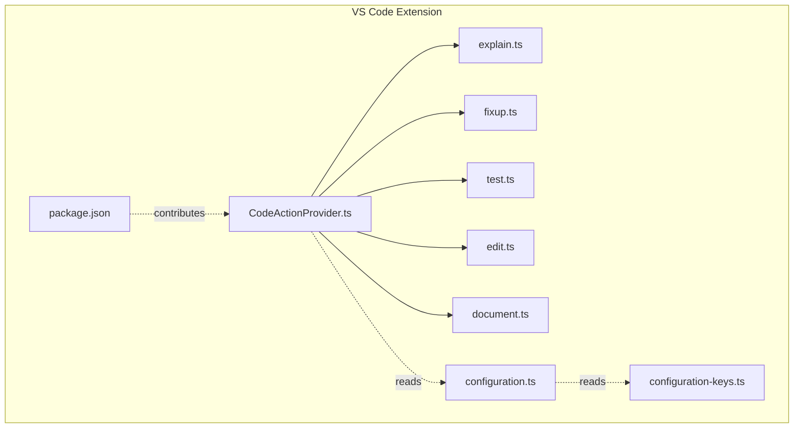
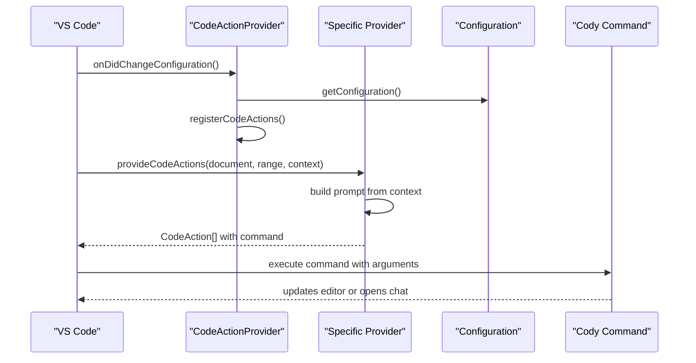
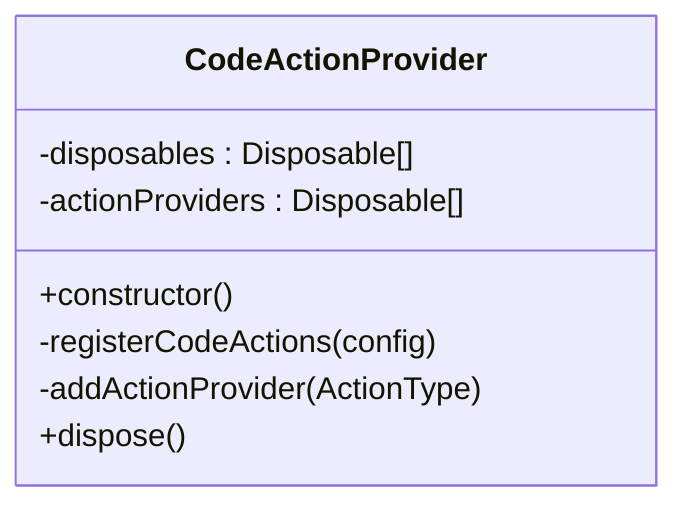
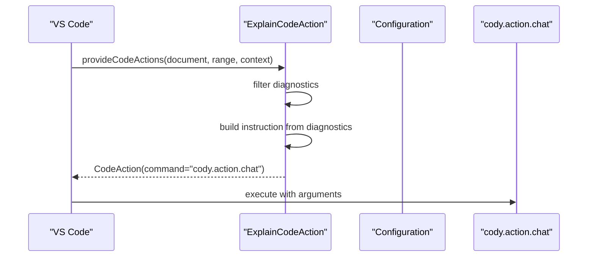
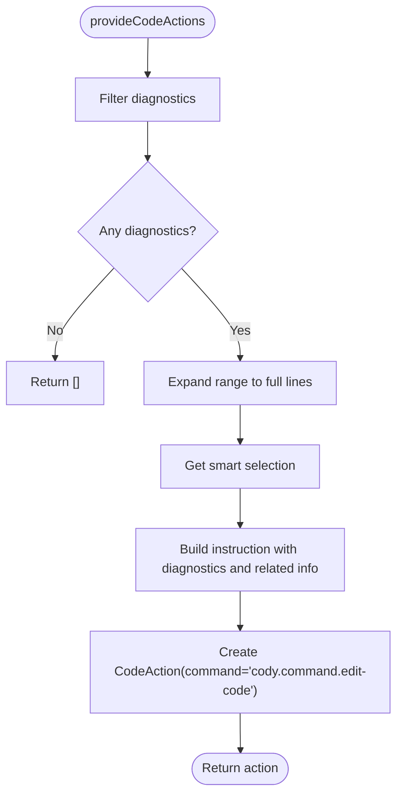
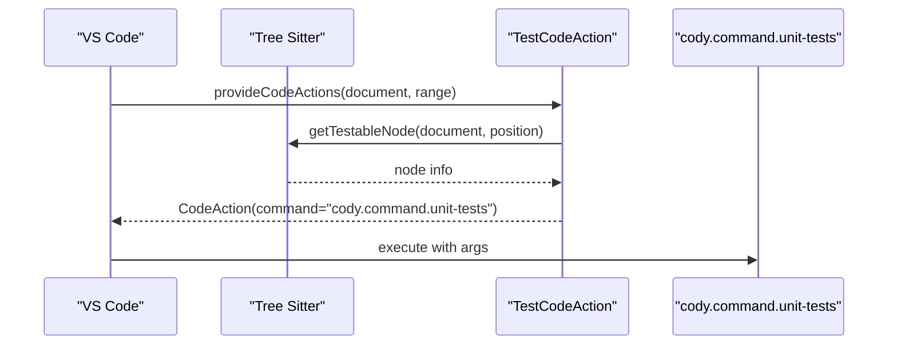
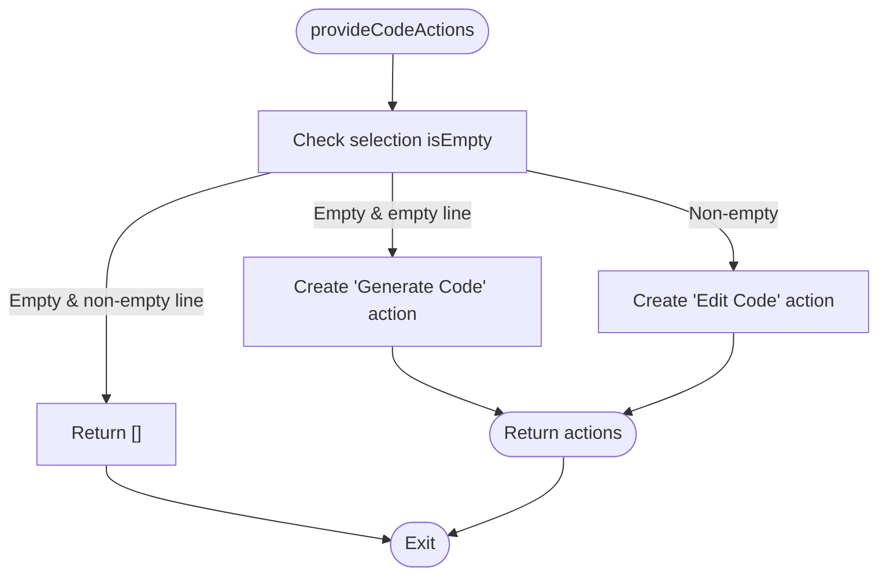
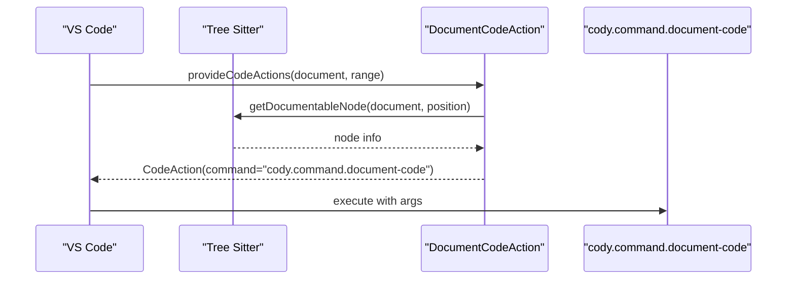
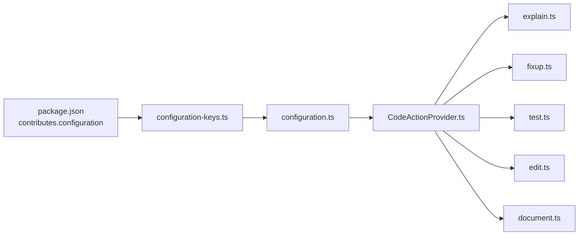

# Code Actions

<cite>
**Referenced Files in This Document**
- [CodeActionProvider.ts](file://vscode/src/code-actions/CodeActionProvider.ts)
- [explain.ts](file://vscode/src/code-actions/explain.ts)
- [fixup.ts](file://vscode/src/code-actions/fixup.ts)
- [test.ts](file://vscode/src/code-actions/test.ts)
- [edit.ts](file://vscode/src/code-actions/edit.ts)
- [document.ts](file://vscode/src/code-actions/document.ts)
- [configuration.ts](file://vscode/src/configuration.ts)
- [configuration-keys.ts](file://vscode/src/configuration-keys.ts)
- [package.json](file://vscode/package.json)
</cite>

## Table of Contents
1. [Introduction](#introduction)
2. [Project Structure](#project-structure)
3. [Core Components](#core-components)
4. [Architecture Overview](#architecture-overview)
5. [Detailed Component Analysis](#detailed-component-analysis)
6. [Dependency Analysis](#dependency-analysis)
7. [Performance Considerations](#performance-considerations)
8. [Troubleshooting Guide](#troubleshooting-guide)
9. [Conclusion](#conclusion)

## Introduction
This document explains the code actions integration system that connects VS Code’s code action framework with Cody’s AI capabilities. It covers how AI-powered actions appear in the editor’s Quick Fix and context menus, how each action type is implemented, how prompts are engineered for different tasks, and how the system extracts context from the editor state. It also documents how actions are registered, how users can customize availability, and how to extend the system with new action types.

## Project Structure
The code actions feature is implemented under the VS Code extension and organized by responsibility:
- A central provider registers and manages AI-powered code actions.
- Individual providers implement specific action types: explain, fix, document, edit, and test.
- Configuration controls whether code actions are enabled and influences behavior.
- Package contributions define commands, menus, and keybindings.

**Diagram sources**
- [CodeActionProvider.ts:1-60](file://vscode/src/code-actions/CodeActionProvider.ts#L1-L60)
- [explain.ts:1-52](file://vscode/src/code-actions/explain.ts#L1-L52)
- [fixup.ts:1-152](file://vscode/src/code-actions/fixup.ts#L1-L152)
- [test.ts:1-56](file://vscode/src/code-actions/test.ts#L1-L56)
- [edit.ts:1-81](file://vscode/src/code-actions/edit.ts#L1-L81)
- [document.ts:1-55](file://vscode/src/code-actions/document.ts#L1-L55)
- [configuration.ts:1-233](file://vscode/src/configuration.ts#L1-L233)
- [configuration-keys.ts:1-55](file://vscode/src/configuration-keys.ts#L1-L55)
- [package.json:122-1344](file://vscode/package.json#L122-L1344)

**Section sources**
- [CodeActionProvider.ts:1-60](file://vscode/src/code-actions/CodeActionProvider.ts#L1-L60)
- [configuration.ts:1-233](file://vscode/src/configuration.ts#L1-L233)
- [configuration-keys.ts:1-55](file://vscode/src/configuration-keys.ts#L1-L55)
- [package.json:122-1344](file://vscode/package.json#L122-L1344)

## Core Components
- Central CodeActionProvider: Registers AI-powered code actions and handles configuration changes.
- ExplainCodeAction: Creates a Quick Fix action to explain diagnostics using Cody chat.
- FixupCodeAction: Creates a Quick Fix action to fix diagnostics using Cody edit.
- TestCodeAction: Adds a Refactor Rewrite action to generate unit tests for a selected or nearby symbol.
- EditCodeAction: Adds Refactor Rewrite actions to generate or edit code based on selection.
- DocumentCodeAction: Adds a Refactor Rewrite action to generate documentation for a documentable symbol.

These providers integrate with VS Code’s CodeActionProvider interface and return actionable items that trigger Cody commands.

**Section sources**
- [CodeActionProvider.ts:11-60](file://vscode/src/code-actions/CodeActionProvider.ts#L11-L60)
- [explain.ts:5-52](file://vscode/src/code-actions/explain.ts#L5-L52)
- [fixup.ts:12-152](file://vscode/src/code-actions/fixup.ts#L12-L152)
- [test.ts:6-56](file://vscode/src/code-actions/test.ts#L6-L56)
- [edit.ts:5-81](file://vscode/src/code-actions/edit.ts#L5-L81)
- [document.ts:6-55](file://vscode/src/code-actions/document.ts#L6-L55)

## Architecture Overview
The system follows a modular architecture:
- Registration: CodeActionProvider registers each action provider when enabled.
- Discovery: VS Code calls provideCodeActions on each provider based on context (selection, diagnostics).
- Prompt Engineering: Providers construct AI prompts from editor context (selection, diagnostics, related info).
- Execution: Actions dispatch to Cody commands (chat, edit, unit tests, document code).

**Diagram sources**
- [CodeActionProvider.ts:15-49](file://vscode/src/code-actions/CodeActionProvider.ts#L15-L49)
- [explain.ts:8-22](file://vscode/src/code-actions/explain.ts#L8-L22)
- [fixup.ts:15-46](file://vscode/src/code-actions/fixup.ts#L15-L46)
- [test.ts:9-39](file://vscode/src/code-actions/test.ts#L9-L39)
- [edit.ts:8-30](file://vscode/src/code-actions/edit.ts#L8-L30)
- [document.ts:9-38](file://vscode/src/code-actions/document.ts#L9-L38)
- [configuration.ts:25-116](file://vscode/src/configuration.ts#L25-L116)

## Detailed Component Analysis

### CodeActionProvider
- Purpose: Central orchestrator that registers/unregisters providers based on configuration.
- Behavior:
  - Reads configuration to determine if code actions are enabled.
  - Registers providers for explain, fix, document, edit, and test actions.
  - Re-registers when configuration changes.

**Diagram sources**
- [CodeActionProvider.ts:11-60](file://vscode/src/code-actions/CodeActionProvider.ts#L11-L60)

**Section sources**
- [CodeActionProvider.ts:15-49](file://vscode/src/code-actions/CodeActionProvider.ts#L15-L49)

### Explain Code Action
- Trigger: Quick Fix actions when diagnostics are present.
- Context extraction:
  - Filters diagnostics to errors and warnings.
  - Builds a natural language instruction summarizing diagnostics.
- Execution:
  - Returns a CodeAction that invokes the Cody chat command with a structured argument.

**Diagram sources**
- [explain.ts:8-42](file://vscode/src/code-actions/explain.ts#L8-L42)
- [configuration.ts:25-116](file://vscode/src/configuration.ts#L25-L116)

**Section sources**
- [explain.ts:8-51](file://vscode/src/code-actions/explain.ts#L8-L51)

### Fixup Action
- Trigger: Quick Fix actions when diagnostics are present.
- Context extraction:
  - Expands selection to full lines.
  - Uses smart selection to capture broader target area.
  - Optionally includes related code from diagnostic locations.
- Prompt engineering:
  - Constructs a structured instruction with a dedicated topic tag for the source code.
  - Iterates diagnostics to describe each issue and attaches related context.
- Execution:
  - Returns a CodeAction that invokes the Cody edit command with intent “fix”.

**Diagram sources**
- [fixup.ts:15-78](file://vscode/src/code-actions/fixup.ts#L15-L78)
- [fixup.ts:81-141](file://vscode/src/code-actions/fixup.ts#L81-L141)

**Section sources**
- [fixup.ts:15-152](file://vscode/src/code-actions/fixup.ts#L15-L152)

### Test Generation Action
- Trigger: Refactor Rewrite action when a testable symbol is identified near the cursor.
- Context extraction:
  - Uses Tree Sitter to locate a testable node at the cursor.
  - Expands to the full node range for context.
- Execution:
  - Returns a CodeAction that invokes the unit test command.

**Diagram sources**
- [test.ts:9-54](file://vscode/src/code-actions/test.ts#L9-L54)

**Section sources**
- [test.ts:9-56](file://vscode/src/code-actions/test.ts#L9-L56)

### Edit Code Action
- Trigger: Refactor Rewrite action based on selection state.
- Behavior:
  - If selection is empty and the line is non-empty, no action is offered.
  - If selection is empty and the line is empty, offers “Generate Code”.
  - If selection is non-empty, offers “Edit Code”.
- Execution:
  - Dispatches the edit command with intent “add” or “edit” and the selected range.

**Diagram sources**
- [edit.ts:8-30](file://vscode/src/code-actions/edit.ts#L8-L30)

**Section sources**
- [edit.ts:8-81](file://vscode/src/code-actions/edit.ts#L8-L81)

### Document Code Action
- Trigger: Refactor Rewrite action when a documentable symbol is identified near the cursor.
- Context extraction:
  - Uses Tree Sitter to locate a documentable node.
  - Expands to the full node range.
- Execution:
  - Returns a CodeAction that invokes the document code command.

**Diagram sources**
- [document.ts:9-53](file://vscode/src/code-actions/document.ts#L9-L53)

**Section sources**
- [document.ts:9-55](file://vscode/src/code-actions/document.ts#L9-L55)

## Dependency Analysis
- Configuration-driven activation:
  - The central provider checks a configuration flag to decide whether to register providers.
  - Configuration values are derived from package.json contributions and runtime settings.
- Provider registration:
  - Providers are registered for all documents (“*”) with specific kinds (Quick Fix, Refactor Rewrite).
- Command integration:
  - Each action’s command targets a Cody command that performs the AI operation.

**Diagram sources**
- [package.json:877-1271](file://vscode/package.json#L877-L1271)
- [configuration-keys.ts:18-55](file://vscode/src/configuration-keys.ts#L18-L55)
- [configuration.ts:25-116](file://vscode/src/configuration.ts#L25-L116)
- [CodeActionProvider.ts:24-39](file://vscode/src/code-actions/CodeActionProvider.ts#L24-L39)

**Section sources**
- [package.json:877-1271](file://vscode/package.json#L877-L1271)
- [configuration-keys.ts:18-55](file://vscode/src/configuration-keys.ts#L18-L55)
- [configuration.ts:25-116](file://vscode/src/configuration.ts#L25-L116)
- [CodeActionProvider.ts:24-39](file://vscode/src/code-actions/CodeActionProvider.ts#L24-L39)

## Performance Considerations
- Prompt construction cost:
  - Fixup action may fetch related code from other files; avoid unnecessary file reads by limiting related info and using targeted ranges.
- Smart selection expansion:
  - Using smart selection helps reduce prompt size and improve relevance; ensure it is only used when beneficial.
- Diagnostic filtering:
  - Limiting actions to errors and warnings reduces noise and improves perceived responsiveness.
- Configuration watching:
  - Re-registering providers on configuration changes avoids stale registrations and keeps UX consistent.

[No sources needed since this section provides general guidance]

## Troubleshooting Guide
- Actions do not appear:
  - Verify the code actions feature flag is enabled in settings.
  - Confirm the editor context matches the action’s requirements (selection, diagnostics, or Tree Sitter node).
- Explain action shows no diagnostics:
  - Ensure diagnostics exist and are errors or warnings.
- Fix action does nothing:
  - Ensure diagnostics are present; the action requires at least one applicable diagnostic.
- Test and Document actions:
  - Ensure the cursor is near a symbol recognized by Tree Sitter as testable or documentable.
- Commands fail to execute:
  - Check that the corresponding Cody command exists and is enabled in menus and keybindings.

**Section sources**
- [explain.ts:13-21](file://vscode/src/code-actions/explain.ts#L13-L21)
- [fixup.ts:20-27](file://vscode/src/code-actions/fixup.ts#L20-L27)
- [test.ts:10-22](file://vscode/src/code-actions/test.ts#L10-L22)
- [document.ts:10-22](file://vscode/src/code-actions/document.ts#L10-L22)
- [package.json:675-876](file://vscode/package.json#L675-L876)

## Conclusion
The code actions integration system leverages VS Code’s CodeActionProvider interface to surface AI-powered operations directly from the editor. By structuring each action around clear contexts—diagnostics for explain/fix, selections for edit, and Tree Sitter nodes for test/document—the system delivers precise, context-aware assistance. Configuration controls availability, while command contributions integrate actions into Quick Fix and context menus. Extending the system involves adding new providers and wiring them through the central provider and configuration.