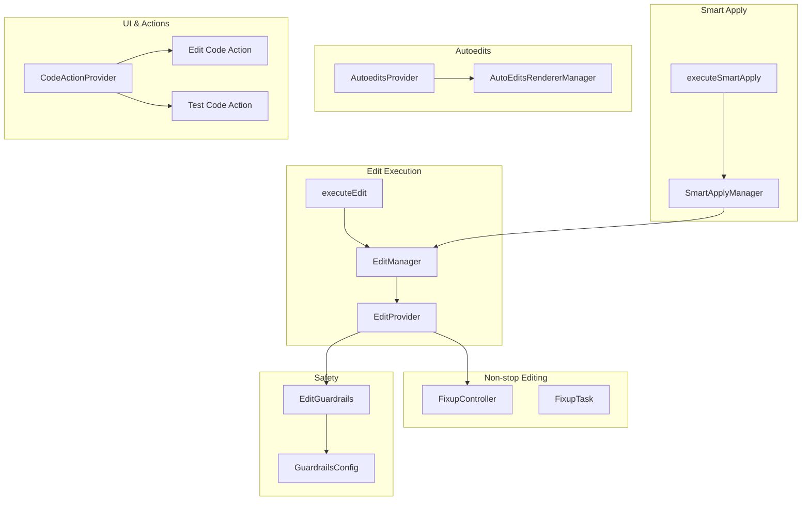
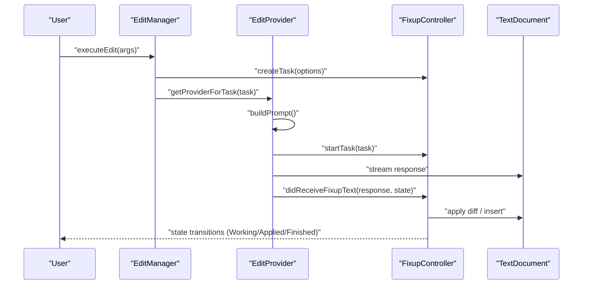
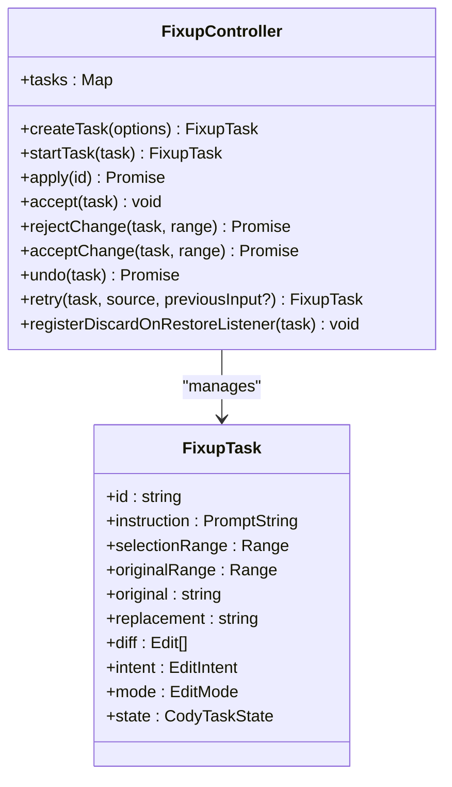
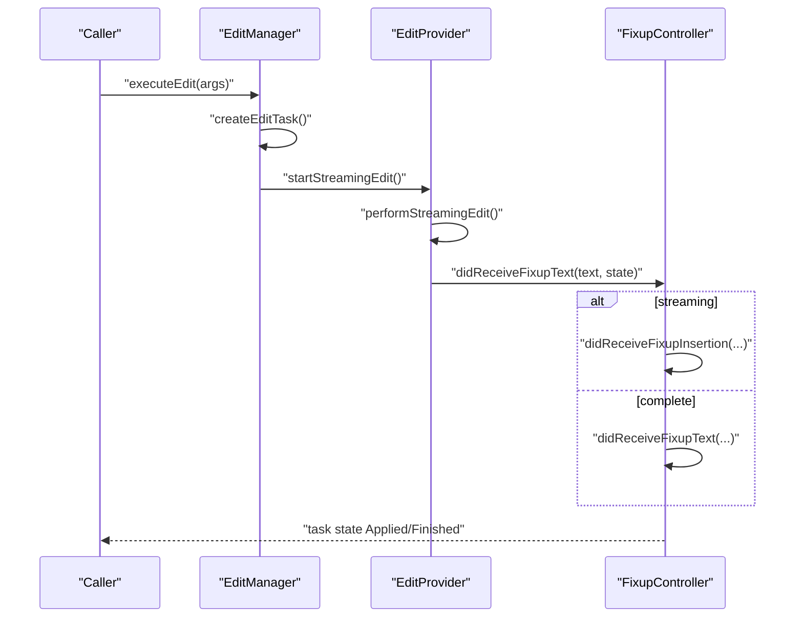
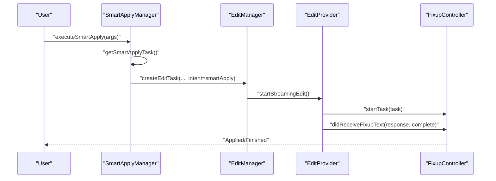
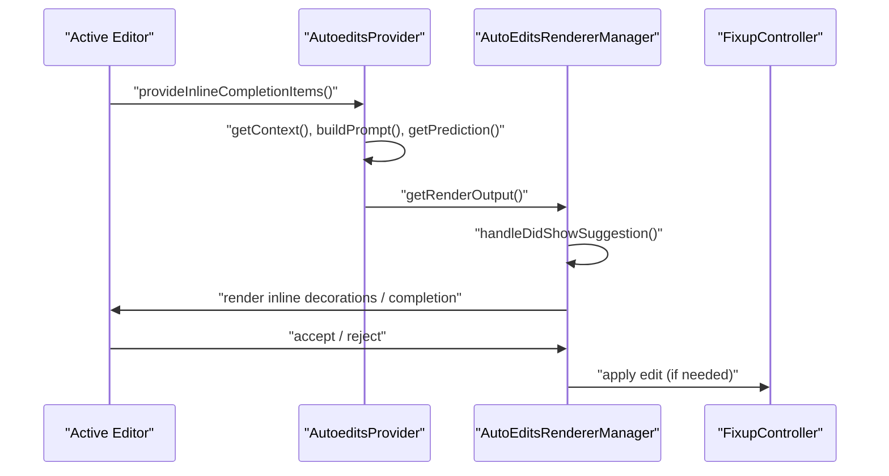
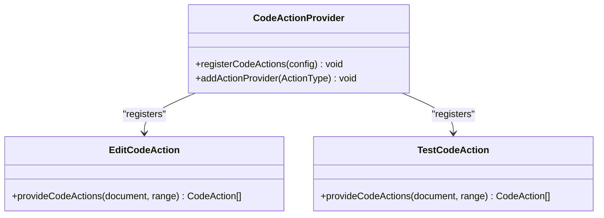
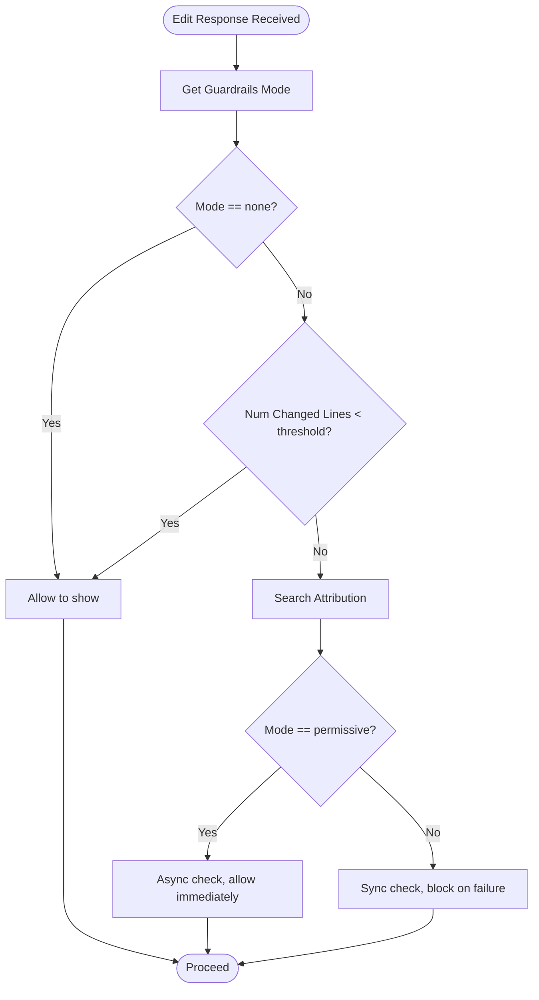
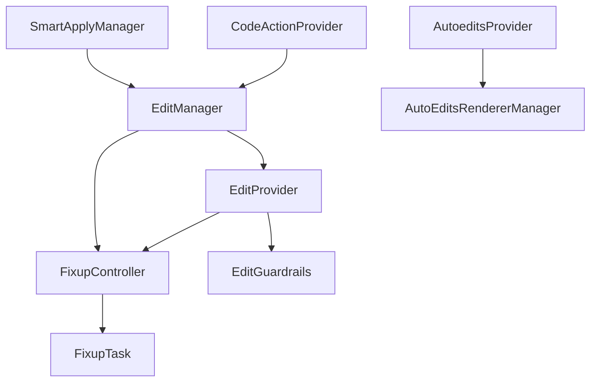

# Code Editing

<cite>
**Referenced Files in This Document**
- [FixupController.ts](file://vscode/src/non-stop/FixupController.ts)
- [FixupTask.ts](file://vscode/src/non-stop/FixupTask.ts)
- [execute.ts](file://vscode/src/edit/execute.ts)
- [edit-manager.ts](file://vscode/src/edit/edit-manager.ts)
- [provider.ts](file://vscode/src/edit/provider.ts)
- [smart-apply.ts](file://vscode/src/edit/smart-apply.ts)
- [smart-apply-manager.ts](file://vscode/src/edit/smart-apply-manager.ts)
- [edit-guardrails.ts](file://vscode/src/edit/edit-guardrails.ts)
- [types.ts](file://vscode/src/edit/types.ts)
- [configuration.ts](file://vscode/src/configuration.ts)
- [configuration-keys.ts](file://vscode/src/configuration-keys.ts)
- [CodeActionProvider.ts](file://vscode/src/code-actions/CodeActionProvider.ts)
- [edit.ts](file://vscode/src/code-actions/edit.ts)
- [test.ts](file://vscode/src/code-actions/test.ts)
- [autoedits-provider.ts](file://vscode/src/autoedits/autoedits-provider.ts)
- [manager.ts](file://vscode/src/autoedits/renderer/manager.ts)
- [config.ts](file://lib/shared/src/guardrails/config.ts)
</cite>

## Table of Contents
1. [Introduction](#introduction)
2. [Project Structure](#project-structure)
3. [Core Components](#core-components)
4. [Architecture Overview](#architecture-overview)
5. [Detailed Component Analysis](#detailed-component-analysis)
6. [Dependency Analysis](#dependency-analysis)
7. [Performance Considerations](#performance-considerations)
8. [Troubleshooting Guide](#troubleshooting-guide)
9. [Conclusion](#conclusion)
10. [Appendices](#appendices)

## Introduction
This document explains Cody’s automated code editing capabilities with a focus on the non-stop editing system, the FixupController orchestrating code transformations, smart apply functionality, and user approval workflows. It covers the edit execution pipeline (prompt processing, model interaction, and code application), autoedit features (prediction-based editing, context-aware suggestions, and visual rendering), code action integrations (explain, refactor, and test generation), guardrails and safety systems, configuration options, practical editing scenarios, batch operations, troubleshooting edit conflicts, and performance considerations for large-scale transformations and version control integration.

## Project Structure
Cody’s code editing spans several subsystems:
- Non-stop editing: FixupController manages tasks, applies diffs, and coordinates user approvals.
- Edit execution: EditManager and EditProvider orchestrate prompt building, streaming, and application.
- Smart apply: SmartApplyManager and SmartApplyProvider select ranges and apply changes without prompting.
- Autoedits: AutoeditsProvider generates contextual suggestions and renders them inline or as side-by-side diffs.
- Code actions: CodeActionProvider registers explain/refactor/test actions integrated with Cody.
- Guardrails: EditGuardrails enforces attribution checks and safety policies.
- Configuration: Centralized configuration and feature flags controlling behavior.

**Diagram sources**
- [FixupController.ts:72-143](file://vscode/src/non-stop/FixupController.ts#L72-L143)
- [FixupTask.ts:1-99](file://vscode/src/non-stop/FixupTask.ts#L1-L99)
- [execute.ts:75-77](file://vscode/src/edit/execute.ts#L75-L77)
- [edit-manager.ts:58-86](file://vscode/src/edit/edit-manager.ts#L58-L86)
- [provider.ts:78-98](file://vscode/src/edit/provider.ts#L78-L98)
- [smart-apply-manager.ts:40-115](file://vscode/src/edit/smart-apply-manager.ts#L40-L115)
- [smart-apply.ts:22-33](file://vscode/src/edit/smart-apply.ts#L22-L33)
- [autoedits-provider.ts:169-265](file://vscode/src/autoedits/autoedits-provider.ts#L169-L265)
- [manager.ts:39-72](file://vscode/src/autoedits/renderer/manager.ts#L39-L72)
- [edit-guardrails.ts:49-140](file://vscode/src/edit/edit-guardrails.ts#L49-L140)
- [config.ts:27-43](file://lib/shared/src/guardrails/config.ts#L27-L43)
- [CodeActionProvider.ts:11-59](file://vscode/src/code-actions/CodeActionProvider.ts#L11-L59)
- [edit.ts:5-30](file://vscode/src/code-actions/edit.ts#L5-L30)
- [test.ts:6-55](file://vscode/src/code-actions/test.ts#L6-L55)

**Section sources**
- [FixupController.ts:72-143](file://vscode/src/non-stop/FixupController.ts#L72-L143)
- [edit-manager.ts:45-87](file://vscode/src/edit/edit-manager.ts#L45-L87)
- [autoedits-provider.ts:169-265](file://vscode/src/autoedits/autoedits-provider.ts#L169-L265)

## Core Components
- FixupController: Factory and orchestrator for FixupTasks, handles applying diffs, user approvals, and state transitions.
- EditManager: Translates user intent and configuration into FixupTasks and coordinates providers.
- EditProvider: Streams model responses, applies guardrails, and inserts code either as streaming or final application.
- SmartApplyManager: Prefetches and applies targeted changes based on predictions, selecting ranges and handling insertions.
- AutoeditsProvider: Generates contextual suggestions, filters predictions, and renders inline or side-by-side diffs.
- AutoEditsRendererManager: Manages suggestion visibility, acceptance/rejection, and inline decorations.
- EditGuardrails: Enforces attribution checks and safety modes before showing or applying edits.
- CodeActionProvider: Registers explain, refactor, and test generation actions.

**Section sources**
- [FixupController.ts:72-143](file://vscode/src/non-stop/FixupController.ts#L72-L143)
- [edit-manager.ts:45-87](file://vscode/src/edit/edit-manager.ts#L45-L87)
- [provider.ts:78-98](file://vscode/src/edit/provider.ts#L78-L98)
- [smart-apply-manager.ts:40-115](file://vscode/src/edit/smart-apply-manager.ts#L40-L115)
- [autoedits-provider.ts:169-265](file://vscode/src/autoedits/autoedits-provider.ts#L169-L265)
- [manager.ts:39-72](file://vscode/src/autoedits/renderer/manager.ts#L39-L72)
- [edit-guardrails.ts:49-140](file://vscode/src/edit/edit-guardrails.ts#L49-L140)
- [CodeActionProvider.ts:11-59](file://vscode/src/code-actions/CodeActionProvider.ts#L11-L59)

## Architecture Overview
The non-stop editing system centers on FixupController, which maintains FixupTasks and applies diffs to documents. EditManager creates tasks and delegates to EditProvider for streaming and application. SmartApplyManager enables targeted, no-prompt edits. AutoeditsProvider and AutoEditsRendererManager deliver context-aware suggestions with inline or side-by-side rendering. Guardrails ensure safety before edits are shown or applied.

**Diagram sources**
- [execute.ts:75-77](file://vscode/src/edit/execute.ts#L75-L77)
- [edit-manager.ts:225-249](file://vscode/src/edit/edit-manager.ts#L225-L249)
- [provider.ts:177-356](file://vscode/src/edit/provider.ts#L177-L356)
- [FixupController.ts:584-800](file://vscode/src/non-stop/FixupController.ts#L584-L800)

**Section sources**
- [provider.ts:177-356](file://vscode/src/edit/provider.ts#L177-L356)
- [FixupController.ts:584-800](file://vscode/src/non-stop/FixupController.ts#L584-L800)

## Detailed Component Analysis

### Non-stop Editing and FixupController
FixupController manages the lifecycle of FixupTasks, including creation, applying diffs, and user approvals. It supports:
- Applying edits via visible editors or WorkspaceEdit for background application.
- Overlapping task handling to avoid conflicting diffs.
- Accept/reject per-change blocks with placeholder line management.
- Auto-accept on save when autoSave settings permit.
- Telemetry and persistence tracking for applied edits.

**Diagram sources**
- [FixupController.ts:72-143](file://vscode/src/non-stop/FixupController.ts#L72-L143)
- [FixupTask.ts:1-99](file://vscode/src/non-stop/FixupTask.ts#L1-L99)

**Section sources**
- [FixupController.ts:230-317](file://vscode/src/non-stop/FixupController.ts#L230-L317)
- [FixupController.ts:584-800](file://vscode/src/non-stop/FixupController.ts#L584-L800)
- [FixupTask.ts:1-99](file://vscode/src/non-stop/FixupTask.ts#L1-L99)

### Edit Execution Pipeline
EditManager translates configuration and intent into FixupTasks and starts streaming via EditProvider. EditProvider builds prompts, streams model responses, applies guardrails, and inserts code either incrementally (streaming) or as a final application.

**Diagram sources**
- [edit-manager.ts:225-249](file://vscode/src/edit/edit-manager.ts#L225-L249)
- [provider.ts:177-356](file://vscode/src/edit/provider.ts#L177-L356)
- [FixupController.ts:584-800](file://vscode/src/non-stop/FixupController.ts#L584-L800)

**Section sources**
- [edit-manager.ts:137-223](file://vscode/src/edit/edit-manager.ts#L137-L223)
- [provider.ts:177-356](file://vscode/src/edit/provider.ts#L177-L356)

### Smart Apply Functionality
SmartApplyManager prefetches and applies targeted changes without prompting. It selects ranges, handles insertions, and integrates with guardrails and telemetry.

**Diagram sources**
- [smart-apply-manager.ts:256-336](file://vscode/src/edit/smart-apply-manager.ts#L256-L336)
- [smart-apply.ts:22-33](file://vscode/src/edit/smart-apply.ts#L22-L33)
- [edit-manager.ts:137-223](file://vscode/src/edit/edit-manager.ts#L137-L223)
- [provider.ts:177-356](file://vscode/src/edit/provider.ts#L177-L356)
- [FixupController.ts:584-800](file://vscode/src/non-stop/FixupController.ts#L584-L800)

**Section sources**
- [smart-apply-manager.ts:117-141](file://vscode/src/edit/smart-apply-manager.ts#L117-L141)
- [smart-apply-manager.ts:256-336](file://vscode/src/edit/smart-apply-manager.ts#L256-L336)

### Autoedit Features and Visual Rendering
AutoeditsProvider generates contextual suggestions, filters predictions, and renders inline or side-by-side diffs. AutoEditsRendererManager controls suggestion visibility, acceptance, and inline decorations.

**Diagram sources**
- [autoedits-provider.ts:311-756](file://vscode/src/autoedits/autoedits-provider.ts#L311-L756)
- [manager.ts:234-414](file://vscode/src/autoedits/renderer/manager.ts#L234-L414)
- [FixupController.ts:584-800](file://vscode/src/non-stop/FixupController.ts#L584-L800)

**Section sources**
- [autoedits-provider.ts:311-756](file://vscode/src/autoedits/autoedits-provider.ts#L311-L756)
- [manager.ts:39-72](file://vscode/src/autoedits/renderer/manager.ts#L39-L72)

### Code Action Integration
CodeActionProvider registers explain, refactor, and test generation actions. These integrate with Cody commands to trigger edits or tests.

**Diagram sources**
- [CodeActionProvider.ts:11-59](file://vscode/src/code-actions/CodeActionProvider.ts#L11-L59)
- [edit.ts:5-30](file://vscode/src/code-actions/edit.ts#L5-L30)
- [test.ts:6-55](file://vscode/src/code-actions/test.ts#L6-L55)

**Section sources**
- [CodeActionProvider.ts:24-39](file://vscode/src/code-actions/CodeActionProvider.ts#L24-L39)
- [edit.ts:8-30](file://vscode/src/code-actions/edit.ts#L8-L30)
- [test.ts:9-39](file://vscode/src/code-actions/test.ts#L9-L39)

### Guardrails and Safety Systems
EditGuardrails enforces attribution checks and safety modes. It can hide code until checks complete and enforce blocking behavior depending on mode.

**Diagram sources**
- [edit-guardrails.ts:49-140](file://vscode/src/edit/edit-guardrails.ts#L49-L140)
- [config.ts:27-43](file://lib/shared/src/guardrails/config.ts#L27-L43)

**Section sources**
- [edit-guardrails.ts:31-141](file://vscode/src/edit/edit-guardrails.ts#L31-L141)
- [config.ts:1-43](file://lib/shared/src/guardrails/config.ts#L1-L43)

## Dependency Analysis
- FixupController depends on FixupTask, line-diff utilities, and FixupDecorator for UI feedback.
- EditManager depends on EditProvider, FixupController, and guardrails.
- EditProvider depends on prompt builders, model parameter providers, and BotResponseMultiplexer for streaming.
- SmartApplyManager depends on EditManager and selection logic to create targeted tasks.
- AutoeditsProvider depends on context mixers, prompt strategies, request managers, and renderer manager.
- CodeActionProvider depends on configuration and registers actions based on settings.

**Diagram sources**
- [FixupController.ts:72-143](file://vscode/src/non-stop/FixupController.ts#L72-L143)
- [edit-manager.ts:45-87](file://vscode/src/edit/edit-manager.ts#L45-L87)
- [provider.ts:78-98](file://vscode/src/edit/provider.ts#L78-L98)
- [smart-apply-manager.ts:40-115](file://vscode/src/edit/smart-apply-manager.ts#L40-L115)
- [autoedits-provider.ts:169-265](file://vscode/src/autoedits/autoedits-provider.ts#L169-L265)
- [manager.ts:39-72](file://vscode/src/autoedits/renderer/manager.ts#L39-L72)
- [edit-guardrails.ts:49-140](file://vscode/src/edit/edit-guardrails.ts#L49-L140)
- [CodeActionProvider.ts:11-59](file://vscode/src/code-actions/CodeActionProvider.ts#L11-L59)

**Section sources**
- [edit-manager.ts:89-98](file://vscode/src/edit/edit-manager.ts#L89-L98)
- [provider.ts:78-98](file://vscode/src/edit/provider.ts#L78-L98)

## Performance Considerations
- Streaming: Prefer streaming for large edits to reduce perceived latency and allow incremental UI updates.
- Prefetching: SmartApplyManager prefetches and caches sessions to reduce latency on accept.
- Throttling: AutoeditsProvider throttles and debounces requests to avoid overwhelming the model and UI.
- Diff computation: FixupController recomputes diffs against the latest document text to minimize conflicts.
- Metrics: Guardrails and provider track latency and outcomes to guide optimization.

[No sources needed since this section provides general guidance]

## Troubleshooting Guide
Common issues and resolutions:
- Edit conflicts: Overlapping tasks are auto-accepted to avoid conflicting diffs; ensure selections do not overlap when possible.
- Guardrails blocking: If edits are blocked, review attribution results and retry; adjust guardrails mode if appropriate.
- Auto-save interference: Auto-accept on save occurs only when autoSave settings permit; adjust settings if codelens flickers.
- Selection errors: SmartApplyManager validates ignored URIs and selection availability; ensure the document is not ignored and selection is valid.
- Streaming interruptions: Abort or network errors are surfaced; retry or check connectivity.

**Section sources**
- [FixupController.ts:120-142](file://vscode/src/non-stop/FixupController.ts#L120-L142)
- [edit-guardrails.ts:103-139](file://vscode/src/edit/edit-guardrails.ts#L103-L139)
- [smart-apply-manager.ts:270-272](file://vscode/src/edit/smart-apply-manager.ts#L270-L272)

## Conclusion
Cody’s automated code editing combines a robust non-stop editing system with intelligent prompt-driven execution, targeted smart apply workflows, and context-aware autoedits. Guardrails ensure safety, while configuration and feature flags tailor behavior to user needs. Together, these components enable efficient, safe, and scalable code transformations across diverse editing scenarios.

[No sources needed since this section summarizes without analyzing specific files]

## Appendices

### Configuration Options
Key configuration areas impacting edit behavior:
- Suggestions mode and auto-edit toggles.
- Experimental auto-edit features and overrides.
- Guardrails mode and thresholds.
- Provider limits and development model settings.

**Section sources**
- [configuration.ts:50-160](file://vscode/src/configuration.ts#L50-L160)
- [configuration-keys.ts:18-52](file://vscode/src/configuration-keys.ts#L18-L52)

### Practical Scenarios
- Prediction-based editing: Use AutoeditsProvider to generate contextual suggestions; accept or reject via inline decorations or commands.
- Targeted edits: Use SmartApplyManager to apply precise changes without prompting; supports insertions and entire-file scenarios.
- Explain/refactor/test actions: Register and trigger via CodeActionProvider to generate explanations, refactorings, and unit tests.

**Section sources**
- [autoedits-provider.ts:311-756](file://vscode/src/autoedits/autoedits-provider.ts#L311-L756)
- [smart-apply-manager.ts:256-336](file://vscode/src/edit/smart-apply-manager.ts#L256-L336)
- [CodeActionProvider.ts:24-39](file://vscode/src/code-actions/CodeActionProvider.ts#L24-L39)

### Batch Operations and Version Control
- Batch operations: Use EditManager to create multiple tasks; coordinate state transitions and apply edits in sequence.
- Version control integration: Apply edits via WorkspaceEdit for background application; ensure document stability before formatting or post-save actions.

**Section sources**
- [edit-manager.ts:137-223](file://vscode/src/edit/edit-manager.ts#L137-L223)
- [FixupController.ts:112-142](file://vscode/src/non-stop/FixupController.ts#L112-L142)