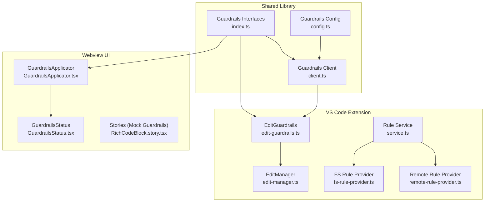
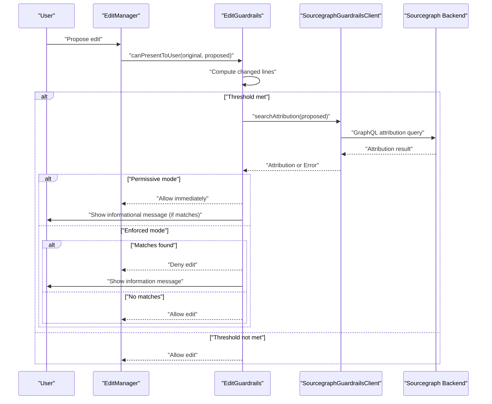
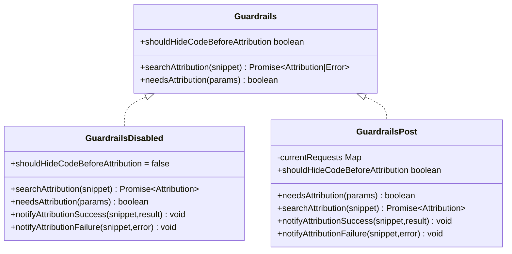
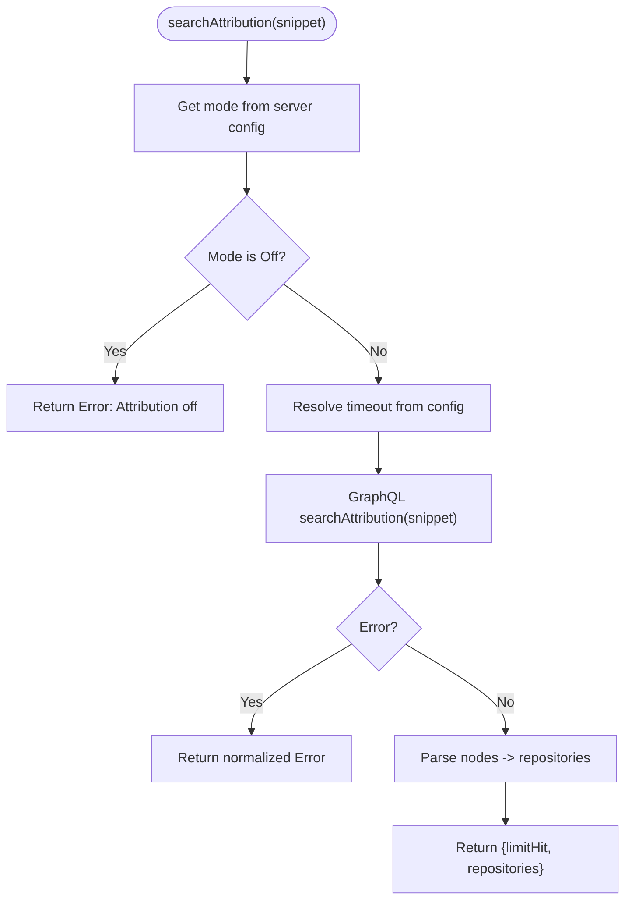
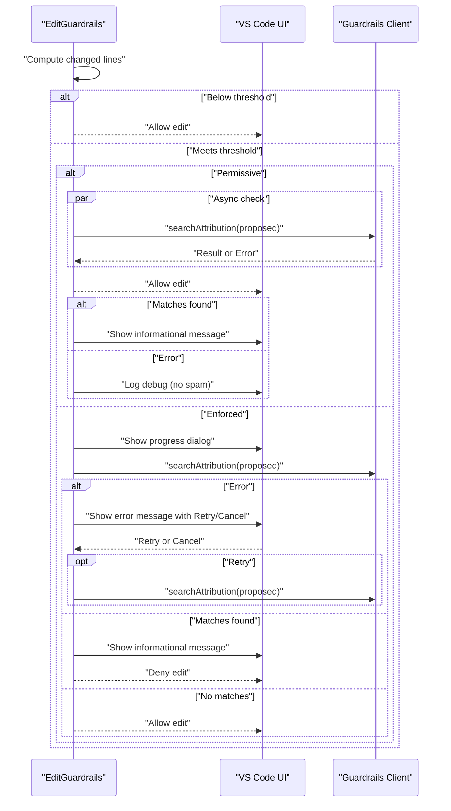
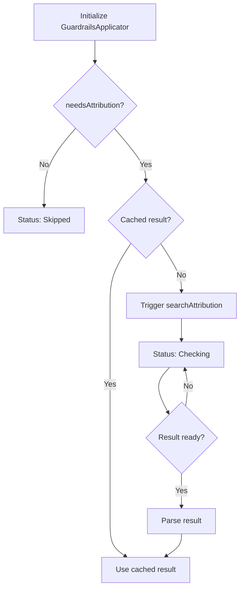
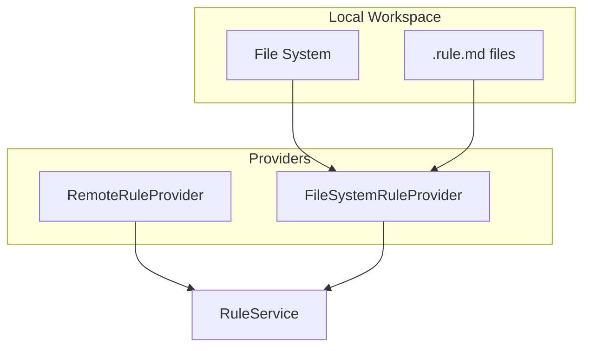
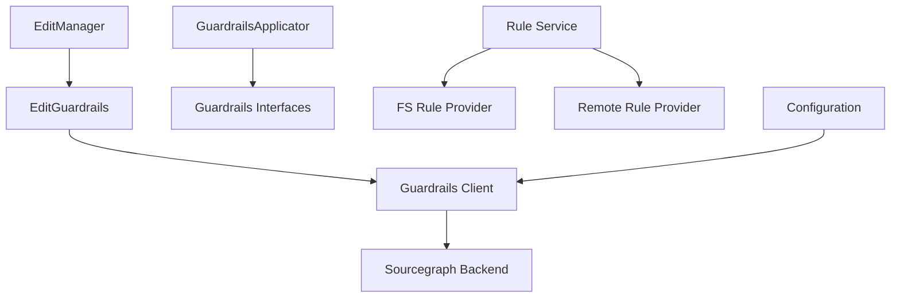

# Edit Guardrails

<cite>
**Referenced Files in This Document**
- [edit-guardrails.ts](file://vscode/src/edit/edit-guardrails.ts)
- [index.ts](file://lib/shared/src/guardrails/index.ts)
- [client.ts](file://lib/shared/src/guardrails/client.ts)
- [config.ts](file://lib/shared/src/guardrails/config.ts)
- [GuardrailsApplicator.tsx](file://vscode/webviews/components/GuardrailsApplicator.tsx)
- [GuardrailsStatus.tsx](file://vscode/webviews/components/GuardrailsStatus.tsx)
- [edit-manager.ts](file://vscode/src/edit/edit-manager.ts)
- [fs-rule-provider.ts](file://vscode/src/rules/fs-rule-provider.ts)
- [remote-rule-provider.ts](file://vscode/src/rules/remote-rule-provider.ts)
- [service.ts](file://vscode/src/rules/service.ts)
- [configuration.ts](file://vscode/src/configuration.ts)
- [RichCodeBlock.story.tsx](file://vscode/webviews/components/RichCodeBlock.story.tsx)
- [IgnoreOverrideAction.kt](file://jetbrains/src/main/kotlin/com/sourcegraph/cody/internals/IgnoreOverrideAction.kt)
</cite>

## Table of Contents
1. [Introduction](#introduction)
2. [Project Structure](#project-structure)
3. [Core Components](#core-components)
4. [Architecture Overview](#architecture-overview)
5. [Detailed Component Analysis](#detailed-component-analysis)
6. [Dependency Analysis](#dependency-analysis)
7. [Performance Considerations](#performance-considerations)
8. [Troubleshooting Guide](#troubleshooting-guide)
9. [Conclusion](#conclusion)
10. [Appendices](#appendices)

## Introduction
This document explains the safety and compliance systems that protect code editing operations in the application. It covers the guardrails architecture that enforces policies and filters content to prevent destructive or inappropriate changes. The system includes:
- Guardrail categories: attribution-based checks, content safety signals, and enterprise compliance controls
- Real-time validation pipeline for AI-generated edits
- Integration with enterprise security systems and custom policy definition mechanisms
- User notification system for guardrail violations and override procedures for authorized users
- Configuration options for guardrail levels, policy customization, and exception handling
- Practical examples, policy configuration, troubleshooting blocked edits, and performance optimization strategies

## Project Structure
The guardrails feature spans shared libraries, the VS Code extension, and webview components:
- Shared guardrails interfaces and implementations define the contract and runtime behavior
- The VS Code extension integrates guardrails into edit workflows and user notifications
- Webview components visualize guardrail status and provide retry/regenerate actions
- Rule providers enable enterprise policy definitions via local or remote sources

**Diagram sources**
- [index.ts:1-208](file://lib/shared/src/guardrails/index.ts#L1-L208)
- [client.ts:1-58](file://lib/shared/src/guardrails/client.ts#L1-L58)
- [config.ts:1-43](file://lib/shared/src/guardrails/config.ts#L1-L43)
- [edit-guardrails.ts:1-142](file://vscode/src/edit/edit-guardrails.ts#L1-L142)
- [edit-manager.ts:1-200](file://vscode/src/edit/edit-manager.ts#L1-L200)
- [fs-rule-provider.ts:1-138](file://vscode/src/rules/fs-rule-provider.ts#L1-L138)
- [remote-rule-provider.ts:1-109](file://vscode/src/rules/remote-rule-provider.ts#L1-L109)
- [service.ts:1-39](file://vscode/src/rules/service.ts#L1-L39)
- [GuardrailsApplicator.tsx:1-312](file://vscode/webviews/components/GuardrailsApplicator.tsx#L1-L312)
- [GuardrailsStatus.tsx:1-100](file://vscode/webviews/components/GuardrailsStatus.tsx#L1-L100)
- [RichCodeBlock.story.tsx:170-209](file://vscode/webviews/components/RichCodeBlock.story.tsx#L170-L209)

**Section sources**
- [index.ts:1-208](file://lib/shared/src/guardrails/index.ts#L1-L208)
- [client.ts:1-58](file://lib/shared/src/guardrails/client.ts#L1-L58)
- [config.ts:1-43](file://lib/shared/src/guardrails/config.ts#L1-L43)
- [edit-guardrails.ts:1-142](file://vscode/src/edit/edit-guardrails.ts#L1-L142)
- [edit-manager.ts:1-200](file://vscode/src/edit/edit-manager.ts#L1-L200)
- [GuardrailsApplicator.tsx:1-312](file://vscode/webviews/components/GuardrailsApplicator.tsx#L1-L312)
- [GuardrailsStatus.tsx:1-100](file://vscode/webviews/components/GuardrailsStatus.tsx#L1-L100)
- [fs-rule-provider.ts:1-138](file://vscode/src/rules/fs-rule-provider.ts#L1-L138)
- [remote-rule-provider.ts:1-109](file://vscode/src/rules/remote-rule-provider.ts#L1-L109)
- [service.ts:1-39](file://vscode/src/rules/service.ts#L1-L39)
- [RichCodeBlock.story.tsx:170-209](file://vscode/webviews/components/RichCodeBlock.story.tsx#L170-L209)

## Core Components
- Guardrails interfaces and modes: define the enforcement levels (Off, Permissive, Enforced), attribution result types, and status lifecycle
- Guardrails client: resolves mode from server configuration, performs attribution queries with timeouts, and normalizes errors
- Edit guardrails: orchestrates real-time checks for proposed edits, respects minimum change thresholds, and coordinates user notifications
- Webview applicator/status: renders guardrail status, hides code in enforced mode, retries on error, and offers regeneration
- Rule providers and service: enable enterprise policies via local .rule.md files or remote Sourcegraph APIs
- Configuration: exposes guardrail-related settings and hidden overrides

**Section sources**
- [index.ts:1-208](file://lib/shared/src/guardrails/index.ts#L1-L208)
- [client.ts:1-58](file://lib/shared/src/guardrails/client.ts#L1-L58)
- [edit-guardrails.ts:1-142](file://vscode/src/edit/edit-guardrails.ts#L1-L142)
- [GuardrailsApplicator.tsx:1-312](file://vscode/webviews/components/GuardrailsApplicator.tsx#L1-L312)
- [GuardrailsStatus.tsx:1-100](file://vscode/webviews/components/GuardrailsStatus.tsx#L1-L100)
- [fs-rule-provider.ts:1-138](file://vscode/src/rules/fs-rule-provider.ts#L1-L138)
- [remote-rule-provider.ts:1-109](file://vscode/src/rules/remote-rule-provider.ts#L1-L109)
- [service.ts:1-39](file://vscode/src/rules/service.ts#L1-L39)
- [configuration.ts:150-170](file://vscode/src/configuration.ts#L150-L170)

## Architecture Overview
The guardrails system integrates three layers:
- Policy and configuration layer: determines guardrail mode and thresholds
- Execution layer: validates proposed edits and manages user feedback
- Presentation layer: shows guardrail status and provides retry/regenerate actions

**Diagram sources**
- [edit-guardrails.ts:49-140](file://vscode/src/edit/edit-guardrails.ts#L49-L140)
- [client.ts:21-57](file://lib/shared/src/guardrails/client.ts#L21-L57)
- [edit-manager.ts:188-200](file://vscode/src/edit/edit-manager.ts#L188-L200)

## Detailed Component Analysis

### Guardrails Interfaces and Modes
The shared library defines:
- Guardrails interface: searchAttribution, shouldHideCodeBeforeAttribution, needsAttribution
- GuardrailsMode: Off, Permissive, Enforced
- GuardrailsCheckStatus: lifecycle statuses for UI and telemetry
- Guardrails implementations: GuardrailsDisabled and GuardrailsPost
- Client configuration and timeout handling

**Diagram sources**
- [index.ts:1-208](file://lib/shared/src/guardrails/index.ts#L1-L208)

**Section sources**
- [index.ts:1-208](file://lib/shared/src/guardrails/index.ts#L1-L208)

### Guardrails Client and Configuration
The client:
- Resolves guardrail mode from server configuration
- Enforces a configurable timeout for attribution queries
- Normalizes GraphQL errors into Error objects
- Returns attribution results with repository matches and limit flags

Configuration:
- Hidden setting for guardrail timeout
- Default configuration and setters for guardrails behavior

**Diagram sources**
- [client.ts:21-57](file://lib/shared/src/guardrails/client.ts#L21-L57)
- [config.ts:27-43](file://lib/shared/src/guardrails/config.ts#L27-L43)

**Section sources**
- [client.ts:1-58](file://lib/shared/src/guardrails/client.ts#L1-L58)
- [config.ts:1-43](file://lib/shared/src/guardrails/config.ts#L1-L43)
- [configuration.ts:150-170](file://vscode/src/configuration.ts#L150-L170)

### Edit Guardrails: Real-Time Validation for Proposed Edits
Responsibilities:
- Determine guardrail mode from client configuration
- Compute changed lines and skip checks below threshold
- Perform asynchronous or synchronous attribution checks depending on mode
- Notify user on matches or errors; offer retry in enforced mode

**Diagram sources**
- [edit-guardrails.ts:49-140](file://vscode/src/edit/edit-guardrails.ts#L49-L140)

**Section sources**
- [edit-guardrails.ts:1-142](file://vscode/src/edit/edit-guardrails.ts#L1-L142)

### Webview GuardrailsApplicator and Status
The applicator:
- Determines whether a guardrail check is needed based on code length and language
- Caches attribution requests and results to avoid redundant work
- Hides code in enforced mode until checks complete
- Provides retry and regenerate actions

The status component:
- Renders guardrail status with icons and tooltips
- Supports auxiliary click to regenerate in success state

**Diagram sources**
- [GuardrailsApplicator.tsx:67-134](file://vscode/webviews/components/GuardrailsApplicator.tsx#L67-L134)
- [GuardrailsStatus.tsx:1-100](file://vscode/webviews/components/GuardrailsStatus.tsx#L1-L100)

**Section sources**
- [GuardrailsApplicator.tsx:1-312](file://vscode/webviews/components/GuardrailsApplicator.tsx#L1-L312)
- [GuardrailsStatus.tsx:1-100](file://vscode/webviews/components/GuardrailsStatus.tsx#L1-L100)

### Enterprise Compliance and Policy Definition
Enterprise policies are defined via:
- Local filesystem rule provider: scans workspace for .rule.md files and parses them into candidate rules
- Remote rule provider: queries Sourcegraph instance for rules applying to a given repository and path
- Rule service: aggregates providers and exposes observable candidates

**Diagram sources**
- [fs-rule-provider.ts:1-138](file://vscode/src/rules/fs-rule-provider.ts#L1-L138)
- [remote-rule-provider.ts:1-109](file://vscode/src/rules/remote-rule-provider.ts#L1-L109)
- [service.ts:1-39](file://vscode/src/rules/service.ts#L1-L39)

**Section sources**
- [fs-rule-provider.ts:1-138](file://vscode/src/rules/fs-rule-provider.ts#L1-L138)
- [remote-rule-provider.ts:1-109](file://vscode/src/rules/remote-rule-provider.ts#L1-L109)
- [service.ts:1-39](file://vscode/src/rules/service.ts#L1-L39)

### Integration with Enterprise Security Systems
- Guardrails client queries Sourcegraph’s GraphQL API for attribution
- Timeout is configurable via hidden settings to accommodate slow environments
- Mode resolution comes from server-provided client configuration

**Section sources**
- [client.ts:1-58](file://lib/shared/src/guardrails/client.ts#L1-L58)
- [configuration.ts:150-170](file://vscode/src/configuration.ts#L150-L170)

### User Notification and Override Procedures
- Edit guardrails shows informational messages when matches are found
- In enforced mode, errors present a Retry/Cancel dialog
- Webview status supports retry and regenerate actions
- JetBrains IDE includes an override action for testing policies

**Section sources**
- [edit-guardrails.ts:106-130](file://vscode/src/edit/edit-guardrails.ts#L106-L130)
- [GuardrailsApplicator.tsx:229-298](file://vscode/webviews/components/GuardrailsApplicator.tsx#L229-L298)
- [IgnoreOverrideAction.kt:38-81](file://jetbrains/src/main/kotlin/com/sourcegraph/cody/internals/IgnoreOverrideAction.kt#L38-L81)

## Dependency Analysis
Key dependencies and relationships:
- EditManager depends on EditGuardrails to gate edits
- EditGuardrails depends on SourcegraphGuardrailsClient for attribution
- GuardrailsApplicator depends on shared Guardrails interfaces for UI state
- Rule providers depend on VS Code workspace APIs and Sourcegraph GraphQL client
- Configuration influences guardrail timeouts and mode resolution

**Diagram sources**
- [edit-manager.ts:188-200](file://vscode/src/edit/edit-manager.ts#L188-L200)
- [edit-guardrails.ts:1-142](file://vscode/src/edit/edit-guardrails.ts#L1-L142)
- [client.ts:1-58](file://lib/shared/src/guardrails/client.ts#L1-L58)
- [GuardrailsApplicator.tsx:1-312](file://vscode/webviews/components/GuardrailsApplicator.tsx#L1-L312)
- [fs-rule-provider.ts:1-138](file://vscode/src/rules/fs-rule-provider.ts#L1-L138)
- [remote-rule-provider.ts:1-109](file://vscode/src/rules/remote-rule-provider.ts#L1-L109)
- [service.ts:1-39](file://vscode/src/rules/service.ts#L1-L39)
- [configuration.ts:150-170](file://vscode/src/configuration.ts#L150-L170)

**Section sources**
- [edit-manager.ts:1-200](file://vscode/src/edit/edit-manager.ts#L1-L200)
- [edit-guardrails.ts:1-142](file://vscode/src/edit/edit-guardrails.ts#L1-L142)
- [index.ts:1-208](file://lib/shared/src/guardrails/index.ts#L1-L208)
- [client.ts:1-58](file://lib/shared/src/guardrails/client.ts#L1-L58)
- [GuardrailsApplicator.tsx:1-312](file://vscode/webviews/components/GuardrailsApplicator.tsx#L1-L312)
- [fs-rule-provider.ts:1-138](file://vscode/src/rules/fs-rule-provider.ts#L1-L138)
- [remote-rule-provider.ts:1-109](file://vscode/src/rules/remote-rule-provider.ts#L1-L109)
- [service.ts:1-39](file://vscode/src/rules/service.ts#L1-L39)
- [configuration.ts:150-170](file://vscode/src/configuration.ts#L150-L170)

## Performance Considerations
- Threshold-based skipping: edits with fewer changed lines bypass checks to reduce overhead
- Asynchronous checks in permissive mode: avoids blocking user workflows while still surfacing results
- Caching in webview applicator: deduplicates requests and reduces repeated network calls
- Timeout configuration: allows tuning for slower networks or large repositories
- Streaming vs. hidden code: in enforced mode, code remains hidden until checks complete

Optimization strategies:
- Increase the minimum lines threshold for large-scale deployments to reduce false positives and network load
- Adjust guardrail timeout based on environment latency
- Use caching effectively by avoiding frequent re-rendering of unchanged code blocks
- Prefer permissive mode for low-risk environments to minimize UI interruptions

[No sources needed since this section provides general guidance]

## Troubleshooting Guide
Common scenarios and resolutions:
- Guardrails API error in enforced mode: retry the check or cancel to abort
- Matches found: regenerate the code or adjust the prompt to avoid reused code
- Slow checks: increase the guardrail timeout setting or reduce code block size
- No matches but still blocked: verify guardrail mode and thresholds
- Testing overrides: use the JetBrains override action to inject test policies

**Section sources**
- [edit-guardrails.ts:106-130](file://vscode/src/edit/edit-guardrails.ts#L106-L130)
- [GuardrailsApplicator.tsx:229-298](file://vscode/webviews/components/GuardrailsApplicator.tsx#L229-L298)
- [configuration.ts:150-170](file://vscode/src/configuration.ts#L150-L170)
- [IgnoreOverrideAction.kt:38-81](file://jetbrains/src/main/kotlin/com/sourcegraph/cody/internals/IgnoreOverrideAction.kt#L38-L81)

## Conclusion
The guardrails system provides a layered approach to protecting code editing operations:
- Real-time validation prevents inappropriate reuse of protected code
- Flexible enforcement modes balance safety and productivity
- Enterprise-grade policy definition enables compliance with organizational standards
- Robust UI and error handling keep users informed and in control

[No sources needed since this section summarizes without analyzing specific files]

## Appendices

### Configuration Options
- Guardrail mode: Off, Permissive, Enforced
- Minimum lines for checks: threshold to skip small diffs
- Metrics enabled: telemetry collection for guardrail usage
- Experimental guardrail timeout: seconds for attribution queries
- Rules enabled: toggle for enterprise policy evaluation

**Section sources**
- [config.ts:1-43](file://lib/shared/src/guardrails/config.ts#L1-L43)
- [configuration.ts:150-170](file://vscode/src/configuration.ts#L150-L170)

### Practical Examples
- Permissive pass/fail scenarios and enforced pass/fail/error states are demonstrated in stories
- Edit guardrails behavior varies by mode and threshold

**Section sources**
- [RichCodeBlock.story.tsx:170-209](file://vscode/webviews/components/RichCodeBlock.story.tsx#L170-L209)
- [edit-guardrails.ts:49-140](file://vscode/src/edit/edit-guardrails.ts#L49-L140)