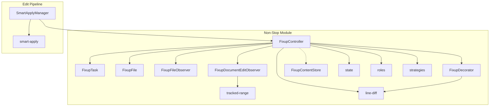
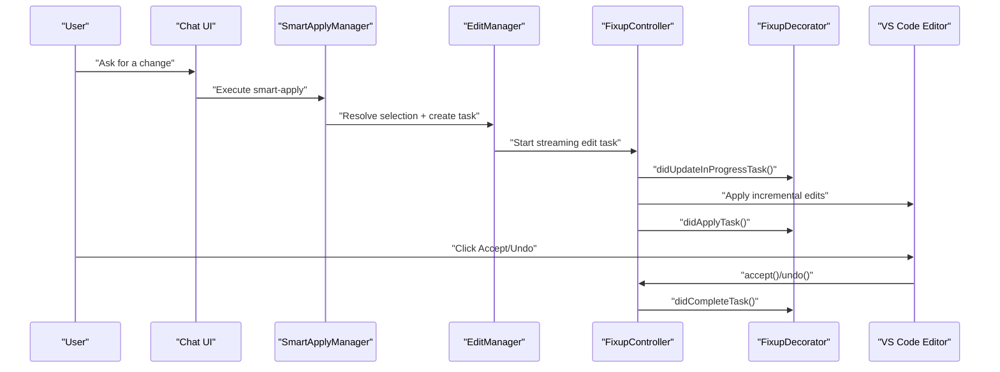
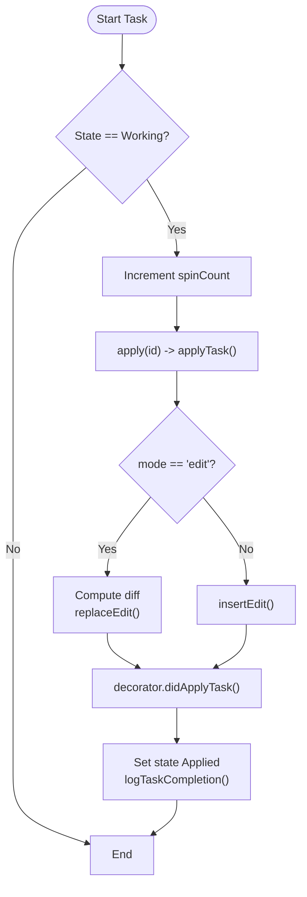
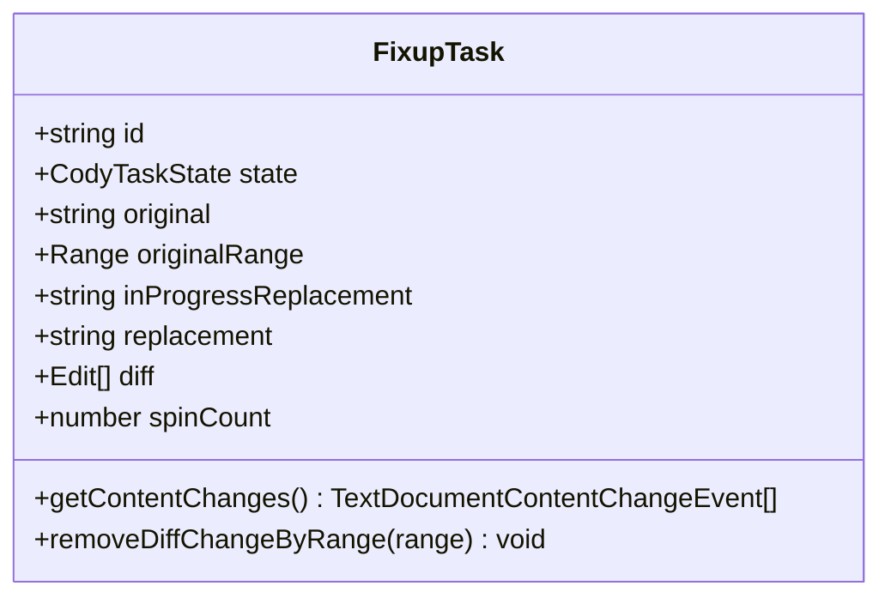
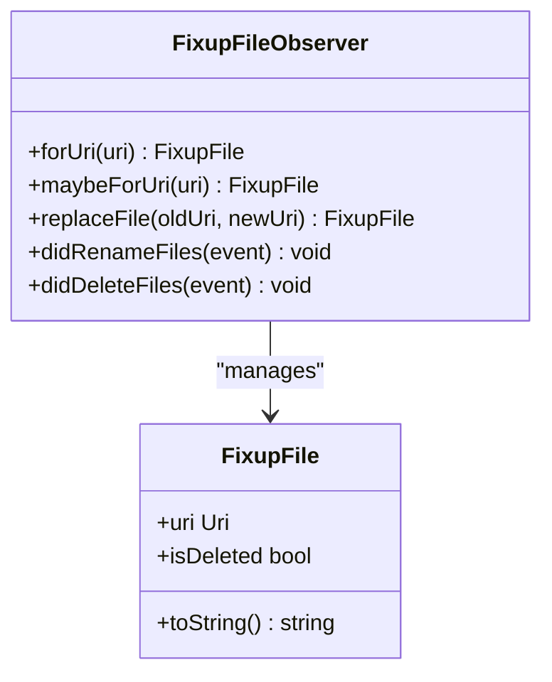
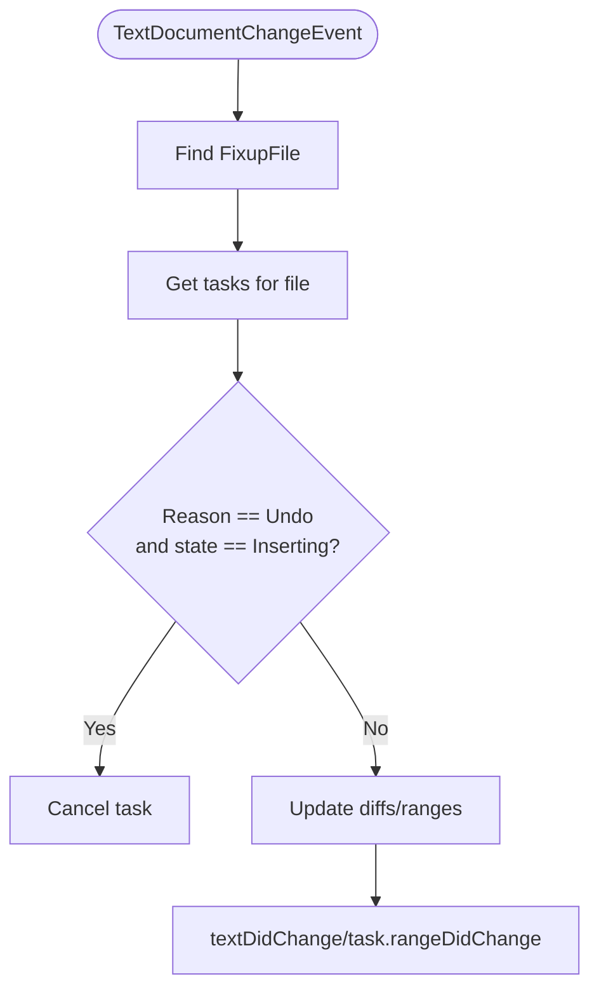
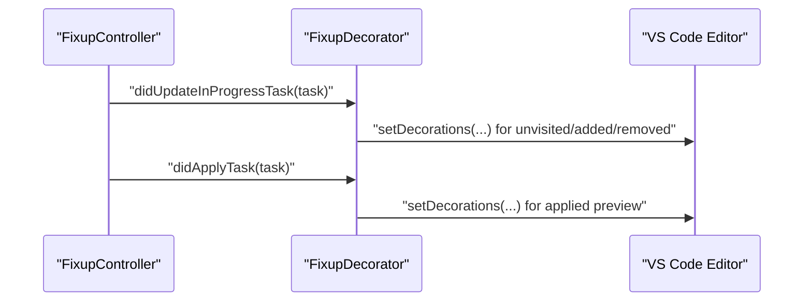
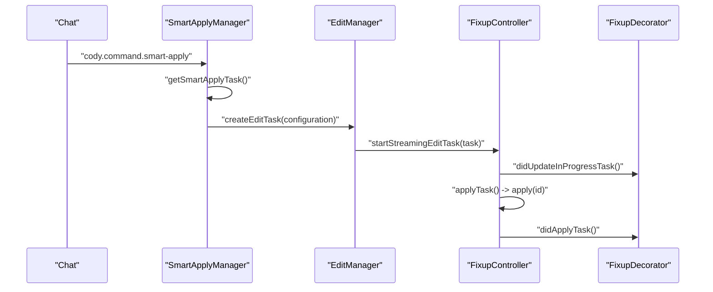
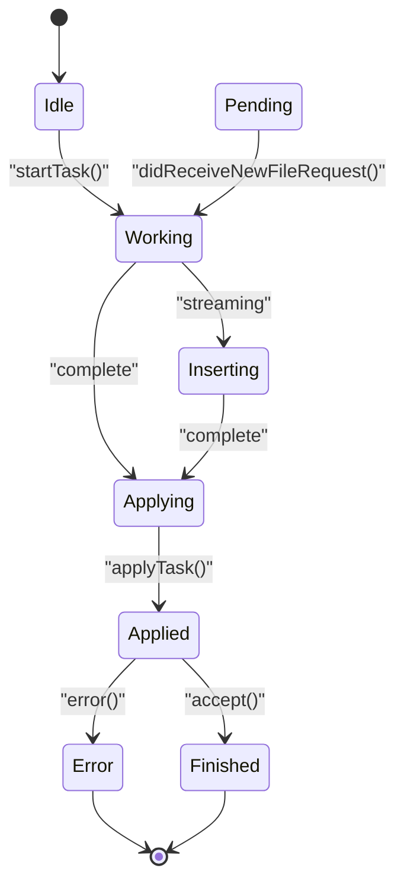
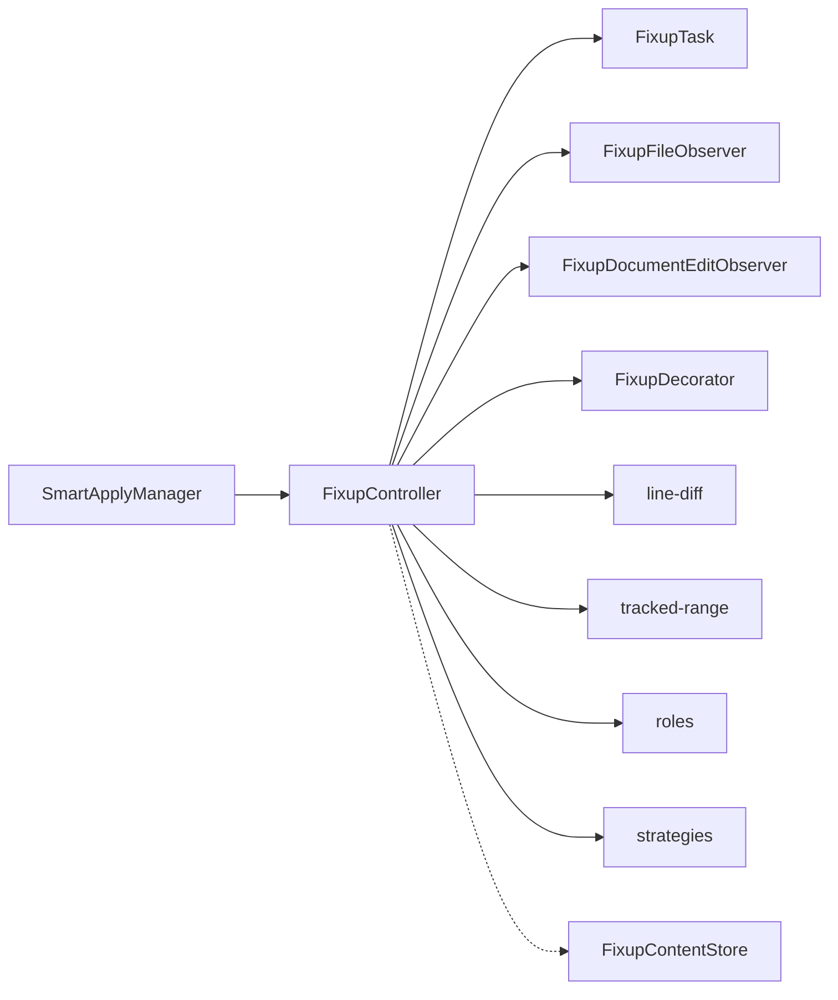

# Non-Stop Editing

<cite>
**Referenced Files in This Document**
- [FixupController.ts](file://vscode/src/non-stop/FixupController.ts)
- [FixupTask.ts](file://vscode/src/non-stop/FixupTask.ts)
- [FixupFile.ts](file://vscode/src/non-stop/FixupFile.ts)
- [FixupFileObserver.ts](file://vscode/src/non-stop/FixupFileObserver.ts)
- [FixupDocumentEditObserver.ts](file://vscode/src/non-stop/FixupDocumentEditObserver.ts)
- [FixupContentStore.ts](file://vscode/src/non-stop/FixupContentStore.ts)
- [state.ts](file://vscode/src/non-stop/state.ts)
- [roles.ts](file://vscode/src/non-stop/roles.ts)
- [strategies.ts](file://vscode/src/non-stop/strategies.ts)
- [tracked-range.ts](file://vscode/src/non-stop/tracked-range.ts)
- [line-diff.ts](file://vscode/src/non-stop/line-diff.ts)
- [FixupDecorator.ts](file://vscode/src/non-stop/decorations/FixupDecorator.ts)
- [compute-decorations.ts](file://vscode/src/non-stop/decorations/compute-decorations.ts)
- [smart-apply.ts](file://vscode/src/edit/smart-apply.ts)
- [smart-apply-manager.ts](file://vscode/src/edit/smart-apply-manager.ts)
</cite>

## Table of Contents
1. [Introduction](#introduction)
2. [Project Structure](#project-structure)
3. [Core Components](#core-components)
4. [Architecture Overview](#architecture-overview)
5. [Detailed Component Analysis](#detailed-component-analysis)
6. [Dependency Analysis](#dependency-analysis)
7. [Performance Considerations](#performance-considerations)
8. [Troubleshooting Guide](#troubleshooting-guide)
9. [Conclusion](#conclusion)
10. [Appendices](#appendices)

## Introduction
This document explains the non-stop editing system centered on FixupController. It covers the continuous editing workflow from task initiation to completion, FixupTask lifecycle management, document observation patterns, smart apply functionality for automatic application of AI suggestions, the decoration system for visual feedback, state management for editing sessions, and integration with VS Code’s editor APIs and document change observers. Practical scenarios such as refactoring, documentation updates, and code generation are included, along with troubleshooting guidance for conflicts, performance optimization for large files, and rollback mechanisms.

## Project Structure
The non-stop editing subsystem lives under the non-stop module and integrates with the broader edit pipeline. Key areas:
- Task orchestration and lifecycle: FixupController
- Task model and state: FixupTask, state enumeration
- Document observation and range tracking: FixupDocumentEditObserver, tracked-range utilities
- File identity and lifecycle: FixupFile, FixupFileObserver
- Visual feedback: FixupDecorator, compute-decorations
- Smart apply integration: smart-apply, smart-apply-manager
- Supporting utilities: line-diff, FixupContentStore

**Diagram sources**
- [FixupController.ts:72-143](file://vscode/src/non-stop/FixupController.ts#L72-L143)
- [FixupTask.ts:35-99](file://vscode/src/non-stop/FixupTask.ts#L35-L99)
- [FixupFile.ts:7-25](file://vscode/src/non-stop/FixupFile.ts#L7-L25)
- [FixupFileObserver.ts:10-54](file://vscode/src/non-stop/FixupFileObserver.ts#L10-L54)
- [FixupDocumentEditObserver.ts:67-146](file://vscode/src/non-stop/FixupDocumentEditObserver.ts#L67-L146)
- [FixupDecorator.ts:17-103](file://vscode/src/non-stop/decorations/FixupDecorator.ts#L17-L103)
- [tracked-range.ts:29-149](file://vscode/src/non-stop/tracked-range.ts#L29-L149)
- [line-diff.ts:29-88](file://vscode/src/non-stop/line-diff.ts#L29-L88)
- [FixupContentStore.ts:10-76](file://vscode/src/non-stop/FixupContentStore.ts#L10-L76)
- [state.ts:1-49](file://vscode/src/non-stop/state.ts#L1-L49)
- [roles.ts:15-97](file://vscode/src/non-stop/roles.ts#L15-L97)
- [strategies.ts:10-27](file://vscode/src/non-stop/strategies.ts#L10-L27)
- [smart-apply-manager.ts:40-115](file://vscode/src/edit/smart-apply-manager.ts#L40-L115)
- [smart-apply.ts:6-33](file://vscode/src/edit/smart-apply.ts#L6-L33)

**Section sources**
- [FixupController.ts:72-143](file://vscode/src/non-stop/FixupController.ts#L72-L143)
- [FixupTask.ts:35-99](file://vscode/src/non-stop/FixupTask.ts#L35-L99)
- [FixupFileObserver.ts:10-54](file://vscode/src/non-stop/FixupFileObserver.ts#L10-L54)
- [FixupDocumentEditObserver.ts:67-146](file://vscode/src/non-stop/FixupDocumentEditObserver.ts#L67-L146)
- [FixupDecorator.ts:17-103](file://vscode/src/non-stop/decorations/FixupDecorator.ts#L17-L103)
- [tracked-range.ts:29-149](file://vscode/src/non-stop/tracked-range.ts#L29-L149)
- [line-diff.ts:29-88](file://vscode/src/non-stop/line-diff.ts#L29-L88)
- [FixupContentStore.ts:10-76](file://vscode/src/non-stop/FixupContentStore.ts#L10-L76)
- [state.ts:1-49](file://vscode/src/non-stop/state.ts#L1-L49)
- [roles.ts:15-97](file://vscode/src/non-stop/roles.ts#L15-L97)
- [strategies.ts:10-27](file://vscode/src/non-stop/strategies.ts#L10-L27)
- [smart-apply-manager.ts:40-115](file://vscode/src/edit/smart-apply-manager.ts#L40-L115)
- [smart-apply.ts:6-33](file://vscode/src/edit/smart-apply.ts#L6-L33)

## Core Components
- FixupController: Central orchestrator for creating, starting, applying, and completing tasks; manages observers, decorators, and persistence tracking; exposes actor operations (accept, reject, undo, retry).
- FixupTask: Immutable task model with state machine, diff caching, spin count, and content change conversion for telemetry/logging.
- FixupFileObserver and FixupFile: Durable file identity abstraction that survives renames/deletes; provides lookup and lifecycle events.
- FixupDocumentEditObserver: Listens to document changes and updates tracked ranges and diffs; cancels insertions on undo and adjusts decorations accordingly.
- FixupDecorator and compute-decorations: Compute and apply visual feedback (added/removed/unvisited lines, current line) for ongoing and applied tasks.
- tracked-range: Robust range update logic supporting overlapping edits, affix appends/prepends, and fixed ranges for retries.
- line-diff: Computes line-wise diffs between original and replacement text, with optional deletion decorations for preview.
- state: Enumerates task states from Idle through Finished/Error, enabling deterministic transitions and UI updates.
- roles and strategies: Defines narrow interfaces for actors, collections, text change sinks, and control applicators to decouple UI and control presentation.
- SmartApplyManager and smart-apply: Integrates AI-generated replacements into the non-stop workflow, selecting target ranges and starting tasks with appropriate modes.

**Section sources**
- [FixupController.ts:72-143](file://vscode/src/non-stop/FixupController.ts#L72-L143)
- [FixupTask.ts:35-99](file://vscode/src/non-stop/FixupTask.ts#L35-L99)
- [FixupFileObserver.ts:10-54](file://vscode/src/non-stop/FixupFileObserver.ts#L10-L54)
- [FixupDocumentEditObserver.ts:67-146](file://vscode/src/non-stop/FixupDocumentEditObserver.ts#L67-L146)
- [FixupDecorator.ts:17-103](file://vscode/src/non-stop/decorations/FixupDecorator.ts#L17-L103)
- [tracked-range.ts:29-149](file://vscode/src/non-stop/tracked-range.ts#L29-L149)
- [line-diff.ts:29-88](file://vscode/src/non-stop/line-diff.ts#L29-L88)
- [state.ts:1-49](file://vscode/src/non-stop/state.ts#L1-L49)
- [roles.ts:15-97](file://vscode/src/non-stop/roles.ts#L15-L97)
- [strategies.ts:10-27](file://vscode/src/non-stop/strategies.ts#L10-L27)
- [smart-apply-manager.ts:40-115](file://vscode/src/edit/smart-apply-manager.ts#L40-L115)
- [smart-apply.ts:6-33](file://vscode/src/edit/smart-apply.ts#L6-L33)

## Architecture Overview
The system follows a reactive, observer-driven architecture:
- Controllers listen to VS Code workspace/document events and maintain FixupTask instances.
- Diff computation and range tracking keep UI and edits aligned as users type.
- Decorations visualize ongoing and applied changes; CodeLenses surface actions.
- Smart apply bridges chat-driven suggestions into the non-stop pipeline.

**Diagram sources**
- [smart-apply-manager.ts:256-336](file://vscode/src/edit/smart-apply-manager.ts#L256-L336)
- [FixupController.ts:1065-1130](file://vscode/src/non-stop/FixupController.ts#L1065-L1130)
- [FixupDecorator.ts:24-42](file://vscode/src/non-stop/decorations/FixupDecorator.ts#L24-L42)

## Detailed Component Analysis

### FixupController: Lifecycle, Application, and Integration
- Creation and start: Creates FixupTask, sets initial state, and delegates to provider for streaming or applying.
- Streaming vs applying: For streamed intents, replaces partial text and expands selection; for complete responses, computes diff and applies edits atomically.
- Conflict handling: On user edits within a task range, updates diffs and selection ranges; for insertions, accepts upon user change to keep flow smooth.
- Auto-accept on save: Accepts tasks on manual saves when auto-save settings permit, clearing placeholder lines beforehand.
- Undo/Retry/Rollback: Reverts to original text, supports retry with updated input, and tracks telemetry for user actions.
- Decoration and CodeLens: Updates decorations and triggers CodeLens refresh; notifies chat for smart apply tasks.
- Persistence tracking: Logs and tracks persisted edits for downstream analytics.

**Diagram sources**
- [FixupController.ts:577-581](file://vscode/src/non-stop/FixupController.ts#L577-L581)
- [FixupController.ts:844-904](file://vscode/src/non-stop/FixupController.ts#L844-L904)
- [FixupController.ts:907-940](file://vscode/src/non-stop/FixupController.ts#L907-L940)
- [FixupController.ts:943-976](file://vscode/src/non-stop/FixupController.ts#L943-L976)
- [FixupController.ts:641-754](file://vscode/src/non-stop/FixupController.ts#L641-L754)

**Section sources**
- [FixupController.ts:577-581](file://vscode/src/non-stop/FixupController.ts#L577-L581)
- [FixupController.ts:844-904](file://vscode/src/non-stop/FixupController.ts#L844-L904)
- [FixupController.ts:907-940](file://vscode/src/non-stop/FixupController.ts#L907-L940)
- [FixupController.ts:943-976](file://vscode/src/non-stop/FixupController.ts#L943-L976)
- [FixupController.ts:641-754](file://vscode/src/non-stop/FixupController.ts#L641-L754)

### FixupTask: Model, Diff, and Telemetry
- Immutable task model with state, selection range, original text, diff cache, spin count, and creation timestamp.
- Diff management: Lazily computed and storable; supports removal of specific changes by range for per-block acceptance/rejection.
- Content change conversion: Converts diff edits into VS Code content change events for logging and telemetry.
- Selection range defaults: Expands for non-add intents to improve diff accuracy; preserves original range for retries.

**Diagram sources**
- [FixupTask.ts:35-211](file://vscode/src/non-stop/FixupTask.ts#L35-L211)

**Section sources**
- [FixupTask.ts:35-211](file://vscode/src/non-stop/FixupTask.ts#L35-L211)

### FixupFileObserver and FixupFile: Durable File Identity
- Provides a stable handle to a file across renames/deletes; maps URIs to FixupFile instances.
- Notifies when files are renamed or deleted; updates internal maps accordingly.

**Diagram sources**
- [FixupFileObserver.ts:10-80](file://vscode/src/non-stop/FixupFileObserver.ts#L10-L80)
- [FixupFile.ts:7-29](file://vscode/src/non-stop/FixupFile.ts#L7-L29)

**Section sources**
- [FixupFileObserver.ts:10-80](file://vscode/src/non-stop/FixupFileObserver.ts#L10-L80)
- [FixupFile.ts:7-29](file://vscode/src/non-stop/FixupFile.ts#L7-L29)

### FixupDocumentEditObserver: Range Tracking and Conflict Resolution
- Observes document changes and updates:
  - Applied task diffs by recalculating ranges and discarding incompatible replacements (e.g., modified placeholder lines).
  - Task selection ranges and insertion points using tracked-range utilities.
  - Cancels insertions on undo to prevent stale streaming content.
- Detects changes within task range and notifies controller.

**Diagram sources**
- [FixupDocumentEditObserver.ts:70-146](file://vscode/src/non-stop/FixupDocumentEditObserver.ts#L70-L146)
- [tracked-range.ts:29-149](file://vscode/src/non-stop/tracked-range.ts#L29-L149)

**Section sources**
- [FixupDocumentEditObserver.ts:70-146](file://vscode/src/non-stop/FixupDocumentEditObserver.ts#L70-L146)
- [tracked-range.ts:29-149](file://vscode/src/non-stop/tracked-range.ts#L29-L149)

### Decorations: Visual Feedback During Editing
- Ongoing decorations: Highlights current line and unvisited lines for streamed or partially applied tasks.
- Applied decorations: Shows inserted lines and deletion previews with hover text for copied content.
- Insert mode decorations: Highlights inserted lines without diff computation.
- Applies decorations to visible editors grouped by file.

**Diagram sources**
- [FixupDecorator.ts:24-42](file://vscode/src/non-stop/decorations/FixupDecorator.ts#L24-L42)
- [compute-decorations.ts:12-75](file://vscode/src/non-stop/decorations/compute-decorations.ts#L12-L75)
- [compute-decorations.ts:113-187](file://vscode/src/non-stop/decorations/compute-decorations.ts#L113-L187)

**Section sources**
- [FixupDecorator.ts:24-42](file://vscode/src/non-stop/decorations/FixupDecorator.ts#L24-L42)
- [compute-decorations.ts:12-75](file://vscode/src/non-stop/decorations/compute-decorations.ts#L12-L75)
- [compute-decorations.ts:113-187](file://vscode/src/non-stop/decorations/compute-decorations.ts#L113-L187)

### Smart Apply: Automatic Application of AI Suggestions
- SmartApplyManager resolves a selection for a given replacement and creates a FixupTask with appropriate intent/mode.
- Supports prefetching to warm providers and caching to reduce latency.
- For insertions, ensures proper trailing newlines and handles empty/new file cases.
- Integrates with chat UI via CodeLens commands and notifies chat on terminal states.

**Diagram sources**
- [smart-apply-manager.ts:256-336](file://vscode/src/edit/smart-apply-manager.ts#L256-L336)
- [smart-apply-manager.ts:179-254](file://vscode/src/edit/smart-apply-manager.ts#L179-L254)
- [FixupController.ts:844-904](file://vscode/src/non-stop/FixupController.ts#L844-L904)
- [FixupController.ts:1065-1130](file://vscode/src/non-stop/FixupController.ts#L1065-L1130)

**Section sources**
- [smart-apply-manager.ts:40-115](file://vscode/src/edit/smart-apply-manager.ts#L40-L115)
- [smart-apply-manager.ts:179-254](file://vscode/src/edit/smart-apply-manager.ts#L179-L254)
- [smart-apply-manager.ts:256-336](file://vscode/src/edit/smart-apply-manager.ts#L256-L336)
- [smart-apply.ts:6-33](file://vscode/src/edit/smart-apply.ts#L6-L33)
- [FixupController.ts:1065-1130](file://vscode/src/non-stop/FixupController.ts#L1065-L1130)
- [FixupController.ts:844-904](file://vscode/src/non-stop/FixupController.ts#L844-L904)

### State Management: Task States and Transitions
- States: Idle, Working, Inserting, Applying, Applied, Finished, Error, Pending.
- Transitions: Controlled by controller; notifies chat for smart apply tasks and persists state via control applicator.

**Diagram sources**
- [state.ts:1-49](file://vscode/src/non-stop/state.ts#L1-L49)
- [FixupController.ts:1241-1275](file://vscode/src/non-stop/FixupController.ts#L1241-L1275)

**Section sources**
- [state.ts:1-49](file://vscode/src/non-stop/state.ts#L1-L49)
- [FixupController.ts:1241-1275](file://vscode/src/non-stop/FixupController.ts#L1241-L1275)

### Supporting Utilities
- line-diff: Computes line-wise diffs with optional deletion decorations; transforms edits to be compatible with VS Code edit builders.
- tracked-range: Robust range update logic for overlapping edits, affix appends/prepends, and fixed ranges for retries.
- FixupContentStore: Stores original and replacement content per task for source control diffs and lifecycle cleanup.

**Section sources**
- [line-diff.ts:29-88](file://vscode/src/non-stop/line-diff.ts#L29-L88)
- [line-diff.ts:95-122](file://vscode/src/non-stop/line-diff.ts#L95-L122)
- [tracked-range.ts:29-149](file://vscode/src/non-stop/tracked-range.ts#L29-L149)
- [tracked-range.ts:156-188](file://vscode/src/non-stop/tracked-range.ts#L156-L188)
- [FixupContentStore.ts:10-76](file://vscode/src/non-stop/FixupContentStore.ts#L10-L76)

## Dependency Analysis
- FixupController depends on:
  - FixupTask for state and diff.
  - FixupFileObserver and FixupFile for durable file identity.
  - FixupDocumentEditObserver for document change reactions.
  - FixupDecorator for visual feedback.
  - line-diff and tracked-range for diff computation and range updates.
  - roles and strategies for decoupled control applicators and user input.
  - SmartApplyManager for chat-driven smart apply tasks.

**Diagram sources**
- [FixupController.ts:72-143](file://vscode/src/non-stop/FixupController.ts#L72-L143)
- [roles.ts:15-97](file://vscode/src/non-stop/roles.ts#L15-L97)
- [strategies.ts:10-27](file://vscode/src/non-stop/strategies.ts#L10-L27)
- [smart-apply-manager.ts:40-115](file://vscode/src/edit/smart-apply-manager.ts#L40-L115)

**Section sources**
- [FixupController.ts:72-143](file://vscode/src/non-stop/FixupController.ts#L72-L143)
- [roles.ts:15-97](file://vscode/src/non-stop/roles.ts#L15-L97)
- [strategies.ts:10-27](file://vscode/src/non-stop/strategies.ts#L10-L27)
- [smart-apply-manager.ts:40-115](file://vscode/src/edit/smart-apply-manager.ts#L40-L115)

## Performance Considerations
- Streaming edits: Immediate application reduces perceived latency; avoid undo stops during streaming to group undo units.
- Diff recomputation: Recompute diffs lazily and only when needed; clear placeholder insertions before formatting on save.
- Range updates: Use tracked-range utilities to minimize redundant computations and handle overlapping edits efficiently.
- Decoration updates: Batch decorations per file and only when visible editors change to reduce redraw overhead.
- Smart apply prefetching: Cache and prefetch tasks to reduce latency; disable for ignored contexts.

[No sources needed since this section provides general guidance]

## Troubleshooting Guide
Common issues and resolutions:
- Edit conflicts:
  - Symptom: Placeholder lines remain after user edits; decorations flicker.
  - Cause: User edits within task range while streamed insertions are ongoing.
  - Resolution: FixupDocumentEditObserver updates diffs and clears incompatible placeholders; controller cancels insertions on undo.
- Undo/Retry behavior:
  - Symptom: Undo fails or reverts unexpected content.
  - Resolution: Ensure task is in Applied state; use revertToOriginal with WorkspaceEdit or TextEditor.edit; controller updates selectionRange on success.
- Auto-accept on save:
  - Symptom: Code lenses linger after save.
  - Resolution: Verify auto-save settings; controller auto-accepts on manual saves and clears placeholder insertions before formatting.
- Large file performance:
  - Symptom: Slow diff computation or UI lag.
  - Resolution: Prefer streaming for large changes; limit decorations to visible editors; avoid unnecessary diff recomputations.
- Rollback mechanisms:
  - Use retry to prompt for updated instructions and start a new task; use undo to revert to original content and discard task.

**Section sources**
- [FixupDocumentEditObserver.ts:70-146](file://vscode/src/non-stop/FixupDocumentEditObserver.ts#L70-L146)
- [FixupController.ts:266-317](file://vscode/src/non-stop/FixupController.ts#L266-L317)
- [FixupController.ts:120-142](file://vscode/src/non-stop/FixupController.ts#L120-L142)
- [FixupController.ts:1025-1063](file://vscode/src/non-stop/FixupController.ts#L1025-L1063)

## Conclusion
The non-stop editing system provides a robust, observable pipeline for continuous AI-assisted editing. FixupController coordinates lifecycle, conflict resolution, and visual feedback, while SmartApplyManager integrates chat-driven suggestions seamlessly. The decoration system and range-tracking utilities ensure accurate, responsive UI updates. With careful handling of concurrency, streaming, and undo semantics, the system supports efficient refactoring, documentation updates, and code generation scenarios.

[No sources needed since this section summarizes without analyzing specific files]

## Appendices

### Practical Scenarios
- Refactoring:
  - Use edit mode with diff computation; accept/reject per-block changes; leverage undo to revert and retry with refined instructions.
- Documentation updates:
  - Use doc intent with trimmed selection ranges; rely on decorations to preview additions; accept upon satisfaction.
- Code generation:
  - Use insert mode for new code blocks; ensure proper indentation and trailing newlines; apply via smart apply for seamless integration.

[No sources needed since this section provides general guidance]