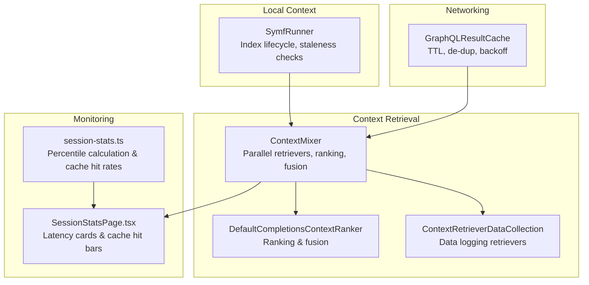
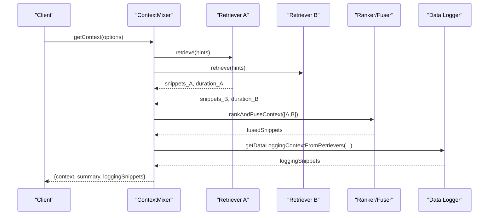
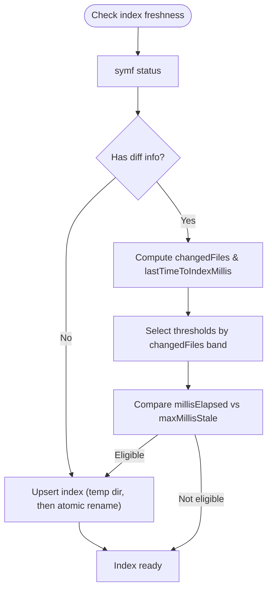
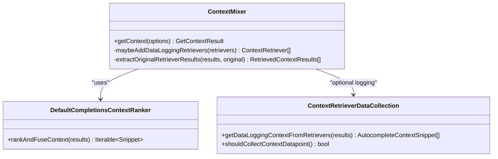
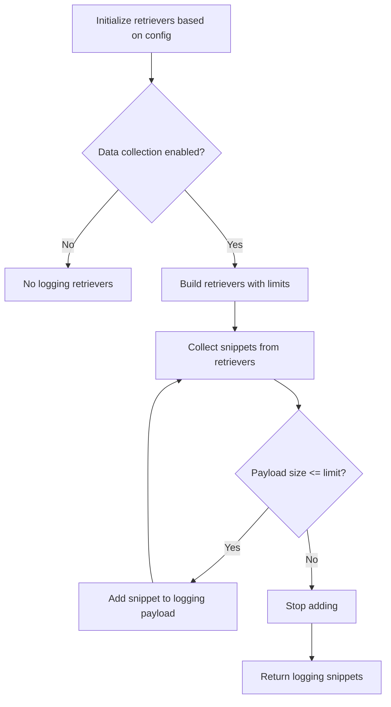
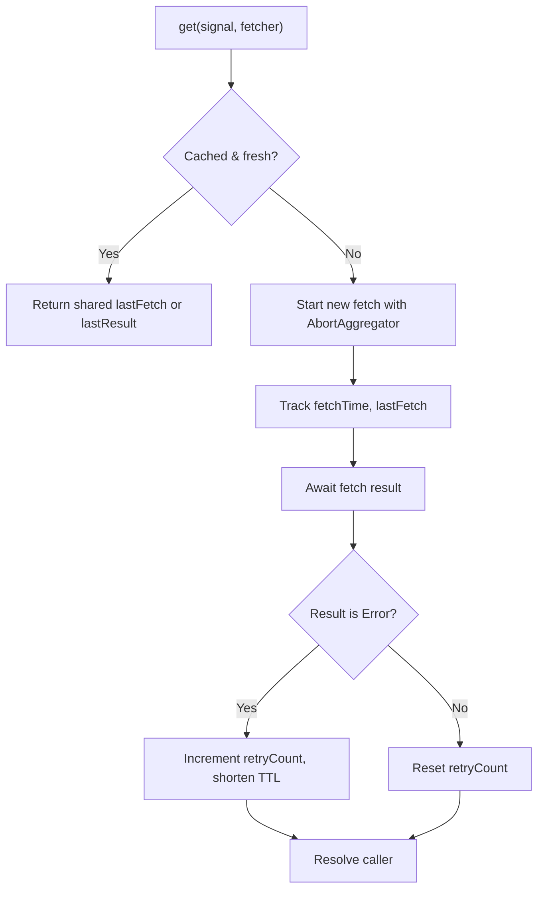
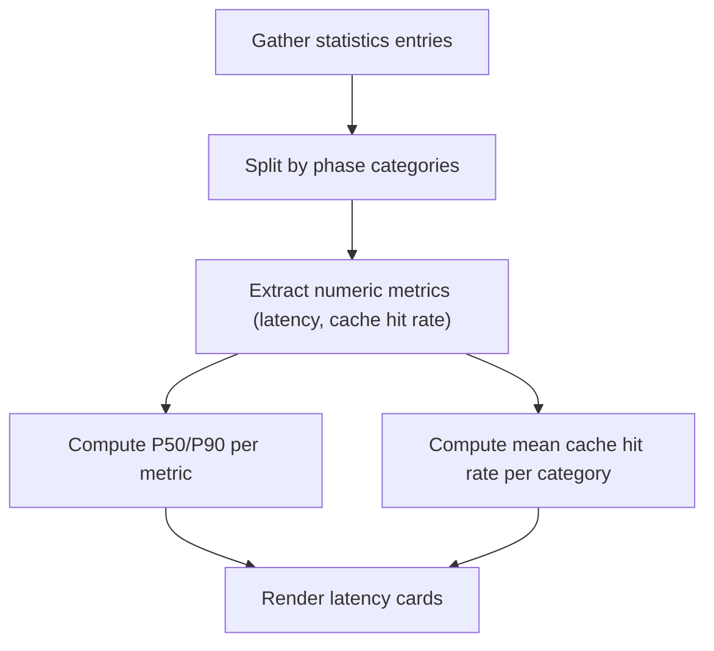
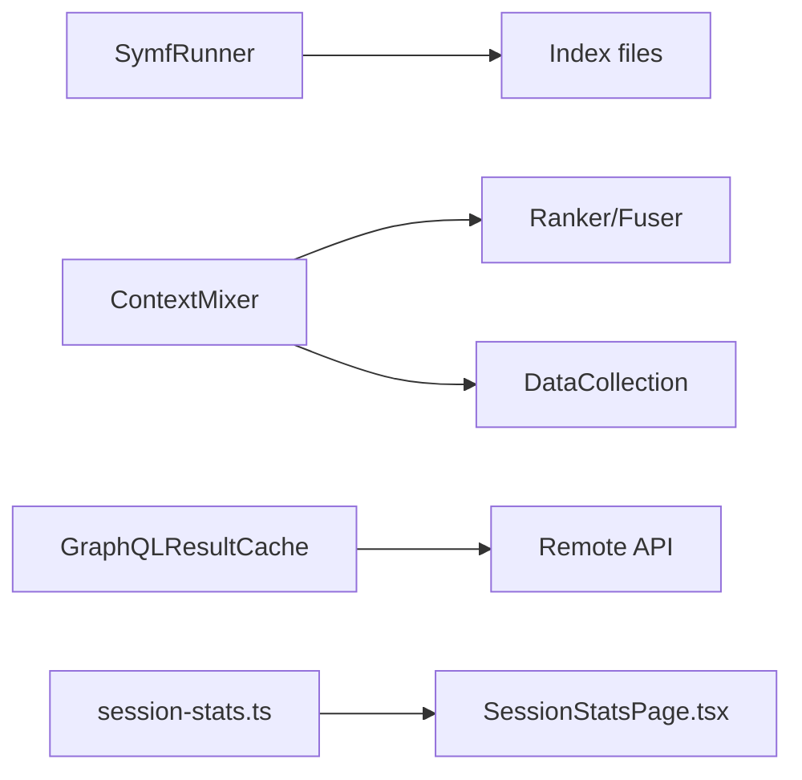

# Context Performance & Optimization

<cite>
**Referenced Files in This Document**
- [symf.ts](file://vscode/src/local-context/symf.ts)
- [context-mixer.ts](file://vscode/src/completions/context/context-mixer.ts)
- [context-data-logging.ts](file://vscode/src/completions/context/context-data-logging.ts)
- [cache.ts](file://lib/shared/src/sourcegraph-api/graphql/cache.ts)
- [limiter.test.ts](file://vscode/src/graph/lsp/limiter.test.ts)
- [SessionStatsPage.tsx](file://vscode/webviews/autoedit-debug/session-stats/SessionStatsPage.tsx)
- [session-stats.ts](file://vscode/src/autoedits/debug-panel/session-stats.ts)
- [reciprocal-rank-fusion.ts](file://vscode/src/completions/context/reciprocal-rank-fusion.ts)
</cite>

## Table of Contents
1. [Introduction](#introduction)
2. [Project Structure](#project-structure)
3. [Core Components](#core-components)
4. [Architecture Overview](#architecture-overview)
5. [Detailed Component Analysis](#detailed-component-analysis)
6. [Dependency Analysis](#dependency-analysis)
7. [Performance Considerations](#performance-considerations)
8. [Troubleshooting Guide](#troubleshooting-guide)
9. [Conclusion](#conclusion)
10. [Appendices](#appendices)

## Introduction
This document explains how context retrieval performance is optimized and monitored in the repository. It covers caching strategies (including TTL-based invalidation and de-duplication), performance monitoring (latency percentiles and cache hit rates), optimization techniques for large codebases (incremental updates, parallel processing, and selective indexing), and the context data logging system. It also outlines configuration options, profiling approaches, bottleneck identification, memory leak prevention, and troubleshooting best practices.

## Project Structure
Key areas involved in context retrieval performance:
- Local search index management and staleness-driven reindexing
- Context retrieval orchestration and ranking
- Data collection for context logging
- GraphQL caching with TTL and exponential backoff
- Monitoring UI and statistics aggregation
- Parallelism and timeouts for responsiveness

**Diagram sources**
- [symf.ts:64-120](file://vscode/src/local-context/symf.ts#L64-L120)
- [context-mixer.ts:88-105](file://vscode/src/completions/context/context-mixer.ts#L88-L105)
- [context-data-logging.ts:25-51](file://vscode/src/completions/context/context-data-logging.ts#L25-L51)
- [SessionStatsPage.tsx:223-393](file://vscode/webviews/autoedit-debug/session-stats/SessionStatsPage.tsx#L223-L393)
- [session-stats.ts:167-208](file://vscode/src/autoedits/debug-panel/session-stats.ts#L167-L208)
- [cache.ts:118-153](file://lib/shared/src/sourcegraph-api/graphql/cache.ts#L118-L153)

**Section sources**
- [symf.ts:64-120](file://vscode/src/local-context/symf.ts#L64-L120)
- [context-mixer.ts:88-105](file://vscode/src/completions/context/context-mixer.ts#L88-L105)
- [context-data-logging.ts:25-51](file://vscode/src/completions/context/context-data-logging.ts#L25-L51)
- [SessionStatsPage.tsx:223-393](file://vscode/webviews/autoedit-debug/session-stats/SessionStatsPage.tsx#L223-L393)
- [session-stats.ts:167-208](file://vscode/src/autoedits/debug-panel/session-stats.ts#L167-L208)
- [cache.ts:118-153](file://lib/shared/src/sourcegraph-api/graphql/cache.ts#L118-L153)

## Core Components
- SymfRunner: Manages local search index lifecycle, staleness detection, and incremental updates. Implements read/write locks for safe concurrent access and throttles CPU usage during indexing.
- ContextMixer: Orchestrates parallel retrievers, measures per-retriever durations, ranks and fuses results, and enforces character limits.
- ContextRetrieverDataCollection: Provides optional retrievers that capture context snippets for data logging, with payload size caps and per-retriever snippet limits.
- GraphQLResultCache: Caches GraphQL results with TTL, de-duplicates concurrent reads, and applies exponential backoff on errors.
- Monitoring UI and Stats: Renders latency percentiles and cache hit rates, and computes percentiles and averages for performance dashboards.

**Section sources**
- [symf.ts:64-120](file://vscode/src/local-context/symf.ts#L64-L120)
- [context-mixer.ts:88-105](file://vscode/src/completions/context/context-mixer.ts#L88-L105)
- [context-data-logging.ts:25-51](file://vscode/src/completions/context/context-data-logging.ts#L25-L51)
- [cache.ts:118-153](file://lib/shared/src/sourcegraph-api/graphql/cache.ts#L118-L153)
- [SessionStatsPage.tsx:223-393](file://vscode/webviews/autoedit-debug/session-stats/SessionStatsPage.tsx#L223-L393)
- [session-stats.ts:167-208](file://vscode/src/autoedits/debug-panel/session-stats.ts#L167-L208)

## Architecture Overview
The system retrieves context by combining multiple retrievers in parallel, ranking and fusing results, and optionally capturing snippets for data logging. Local index staleness drives incremental updates to keep search performance consistent. Monitoring surfaces latency and cache hit metrics to inform tuning.

**Diagram sources**
- [context-mixer.ts:107-244](file://vscode/src/completions/context/context-mixer.ts#L107-L244)
- [context-data-logging.ts:68-97](file://vscode/src/completions/context/context-data-logging.ts#L68-L97)
- [reciprocal-rank-fusion.ts:36-54](file://vscode/src/completions/context/reciprocal-rank-fusion.ts#L36-L54)

## Detailed Component Analysis

### SymfRunner: Incremental Updates, Staleness, and Concurrency Control
- Index lifecycle: Ensures index exists, runs queries safely under read/write locks, and deletes indices atomically.
- Staleness policy: Uses a configurable threshold matrix based on changed file count and last indexing duration to decide reindexing.
- Concurrency: Read-write locks allow concurrent readers and serialized writes to prevent corruption.
- Resource limits: Caps CPU usage during indexing and sets timeouts for external process calls.

**Diagram sources**
- [symf.ts:232-263](file://vscode/src/local-context/symf.ts#L232-L263)
- [symf.ts:885-943](file://vscode/src/local-context/symf.ts#L885-L943)

**Section sources**
- [symf.ts:64-120](file://vscode/src/local-context/symf.ts#L64-L120)
- [symf.ts:232-263](file://vscode/src/local-context/symf.ts#L232-L263)
- [symf.ts:885-943](file://vscode/src/local-context/symf.ts#L885-L943)

### ContextMixer: Parallel Retrieval, Ranking, and Metrics
- Parallel retrievers: Executes retrievers concurrently via Promise.all and measures per-retriever durations.
- Ranking and fusion: Uses reciprocal rank fusion to combine results from multiple retrievers.
- Character budgeting: Enforces a maximum character count for the final context.
- Metrics: Builds a context summary with strategy name, total duration, prefix/suffix lengths, and per-retriever stats.

**Diagram sources**
- [context-mixer.ts:88-105](file://vscode/src/completions/context/context-mixer.ts#L88-L105)
- [context-mixer.ts:107-244](file://vscode/src/completions/context/context-mixer.ts#L107-L244)
- [context-data-logging.ts:68-97](file://vscode/src/completions/context/context-data-logging.ts#L68-L97)
- [reciprocal-rank-fusion.ts:36-54](file://vscode/src/completions/context/reciprocal-rank-fusion.ts#L36-L54)

**Section sources**
- [context-mixer.ts:107-244](file://vscode/src/completions/context/context-mixer.ts#L107-L244)
- [reciprocal-rank-fusion.ts:36-54](file://vscode/src/completions/context/reciprocal-rank-fusion.ts#L36-L54)
- [context-data-logging.ts:68-97](file://vscode/src/completions/context/context-data-logging.ts#L68-L97)

### ContextRetrieverDataCollection: Selective Logging and Payload Limits
- Optional data collection: Creates retrievers only when enabled and authorized.
- Per-retriever limits: Caps number of snippets per retriever to reduce payload size.
- Payload cap: Ensures total logged payload does not exceed a configured maximum.

**Diagram sources**
- [context-data-logging.ts:25-51](file://vscode/src/completions/context/context-data-logging.ts#L25-L51)
- [context-data-logging.ts:68-97](file://vscode/src/completions/context/context-data-logging.ts#L68-L97)

**Section sources**
- [context-data-logging.ts:25-51](file://vscode/src/completions/context/context-data-logging.ts#L25-L51)
- [context-data-logging.ts:68-97](file://vscode/src/completions/context/context-data-logging.ts#L68-L97)

### GraphQLResultCache: TTL, De-duplication, and Exponential Backoff
- TTL-based expiration: Freshness determined by maxAgeMsec, adjusted for error backoff.
- De-duplication: Concurrent readers share a single in-flight fetch via AbortAggregator.
- Backoff: On repeated errors, cache TTL shrinks according to exponential backoff factor.

**Diagram sources**
- [cache.ts:175-239](file://lib/shared/src/sourcegraph-api/graphql/cache.ts#L175-L239)

**Section sources**
- [cache.ts:118-153](file://lib/shared/src/sourcegraph-api/graphql/cache.ts#L118-L153)
- [cache.ts:175-239](file://lib/shared/src/sourcegraph-api/graphql/cache.ts#L175-L239)

### Monitoring: Latency Percentiles and Cache Hit Rates
- Latency cards: Render end-to-end, context loading, and network latency percentiles with visual scaling.
- Cache hit rates: Computes mean cache hit rates across categories (all, suggested, readOrAccepted).
- Percentile calculation: Uses sorted arrays to compute P50/P90 for meaningful performance reporting.

**Diagram sources**
- [SessionStatsPage.tsx:223-393](file://vscode/webviews/autoedit-debug/session-stats/SessionStatsPage.tsx#L223-L393)
- [session-stats.ts:167-208](file://vscode/src/autoedits/debug-panel/session-stats.ts#L167-L208)

**Section sources**
- [SessionStatsPage.tsx:223-393](file://vscode/webviews/autoedit-debug/session-stats/SessionStatsPage.tsx#L223-L393)
- [session-stats.ts:167-208](file://vscode/src/autoedits/debug-panel/session-stats.ts#L167-L208)

## Dependency Analysis
- SymfRunner depends on local filesystem and child process execution; it coordinates index creation and staleness checks.
- ContextMixer orchestrates retrievers and integrates with ranking/fusion utilities and optional data logging.
- GraphQLResultCache is used by higher-level services to cache API responses with TTL and backoff.
- Monitoring components depend on statistics aggregation and UI rendering.

**Diagram sources**
- [symf.ts:64-120](file://vscode/src/local-context/symf.ts#L64-L120)
- [context-mixer.ts:88-105](file://vscode/src/completions/context/context-mixer.ts#L88-L105)
- [context-data-logging.ts:25-51](file://vscode/src/completions/context/context-data-logging.ts#L25-L51)
- [cache.ts:118-153](file://lib/shared/src/sourcegraph-api/graphql/cache.ts#L118-L153)
- [session-stats.ts:167-208](file://vscode/src/autoedits/debug-panel/session-stats.ts#L167-L208)
- [SessionStatsPage.tsx:223-393](file://vscode/webviews/autoedit-debug/session-stats/SessionStatsPage.tsx#L223-L393)

**Section sources**
- [symf.ts:64-120](file://vscode/src/local-context/symf.ts#L64-L120)
- [context-mixer.ts:88-105](file://vscode/src/completions/context/context-mixer.ts#L88-L105)
- [context-data-logging.ts:25-51](file://vscode/src/completions/context/context-data-logging.ts#L25-L51)
- [cache.ts:118-153](file://lib/shared/src/sourcegraph-api/graphql/cache.ts#L118-L153)
- [session-stats.ts:167-208](file://vscode/src/autoedits/debug-panel/session-stats.ts#L167-L208)
- [SessionStatsPage.tsx:223-393](file://vscode/webviews/autoedit-debug/session-stats/SessionStatsPage.tsx#L223-L393)

## Performance Considerations
- Parallel retrievers: ContextMixer executes retrievers concurrently to reduce total retrieval time.
- Timeouts and hints: Per-retriever maxMs hints bound individual retriever work to keep latency predictable.
- Staleness-driven reindexing: SymfRunner avoids unnecessary full rebuilds by checking corpus diffs and applying thresholds.
- CPU throttling: Indexing uses a capped number of CPUs to balance throughput and responsiveness.
- Payload limits: Data logging respects per-retriever snippet counts and a maximum payload size to control overhead.
- Caching with TTL and backoff: GraphQLResultCache reduces redundant network calls and adapts to transient failures.

[No sources needed since this section provides general guidance]

## Troubleshooting Guide
- Symf indexing stuck or slow:
  - Verify index freshness and staleness thresholds; consider forcing a refresh if needed.
  - Check for concurrent indexing attempts and ensure read/write locks are not blocking.
  - Confirm CPU throttling and process timeouts are not overly restrictive.

- Context retrieval latency spikes:
  - Inspect per-retriever durations captured in context summaries.
  - Reduce maxChars or adjust retriever hints to fit within budgets.
  - Review ranking/fusion costs and consider disabling data logging retrievers temporarily.

- Cache-related issues:
  - Monitor cache hit rates and latency percentiles to detect stale or failing caches.
  - Use invalidation triggers to refresh caches when upstream data changes.

- Memory and resource leaks:
  - Ensure disposables are registered and disposed for retrievers and data collectors.
  - Clean up temporary index directories and avoid accumulating stale index snapshots.

**Section sources**
- [symf.ts:825-850](file://vscode/src/local-context/symf.ts#L825-L850)
- [context-mixer.ts:107-244](file://vscode/src/completions/context/context-mixer.ts#L107-L244)
- [context-data-logging.ts:150-163](file://vscode/src/completions/context/context-data-logging.ts#L150-L163)
- [cache.ts:155-164](file://lib/shared/src/sourcegraph-api/graphql/cache.ts#L155-L164)

## Conclusion
The system combines incremental index updates, parallel retrievers, and robust caching to deliver responsive context retrieval. Monitoring provides actionable metrics for latency and cache behavior, while selective logging and payload caps help maintain performance. Proper configuration and cleanup practices ensure long-term stability and scalability across diverse workspace sizes.

[No sources needed since this section summarizes without analyzing specific files]

## Appendices

### Configuration Options and Tunables
- SymfRunner
  - Index CPU usage capped during builds.
  - Process timeouts for query and index operations.
  - Staleness thresholds tuned by changed file counts and last indexing duration.

- ContextMixer
  - Per-retriever maxMs hints to bound latency.
  - maxChars budget for final context size.

- ContextRetrieverDataCollection
  - Per-retriever snippet limits.
  - Maximum payload size for logging.

- GraphQLResultCache
  - maxAgeMsec for TTL.
  - initialRetryDelayMsec and backoffFactor for error backoff.

**Section sources**
- [symf.ts:442-461](file://vscode/src/local-context/symf.ts#L442-L461)
- [context-mixer.ts:134-140](file://vscode/src/completions/context/context-mixer.ts#L134-L140)
- [context-data-logging.ts:28-41](file://vscode/src/completions/context/context-data-logging.ts#L28-L41)
- [cache.ts:44-56](file://lib/shared/src/sourcegraph-api/graphql/cache.ts#L44-L56)

### Examples: Profiling and Bottleneck Identification
- Measure retriever durations and strategy totals via context summaries.
- Use latency cards to compare end-to-end, context loading, and network latencies.
- Compute percentiles to identify outliers and regressions.

**Section sources**
- [context-mixer.ts:230-237](file://vscode/src/completions/context/context-mixer.ts#L230-L237)
- [SessionStatsPage.tsx:223-393](file://vscode/webviews/autoedit-debug/session-stats/SessionStatsPage.tsx#L223-L393)
- [session-stats.ts:199-207](file://vscode/src/autoedits/debug-panel/session-stats.ts#L199-L207)

### Optimization Strategies by Workspace Size
- Small workspace: Frequent incremental updates and relaxed staleness thresholds.
- Medium workspace: Moderate CPU usage for indexing and balanced retriever budgets.
- Large workspace: Tighter per-retriever maxMs, payload caps, and selective logging to control overhead.

[No sources needed since this section provides general guidance]