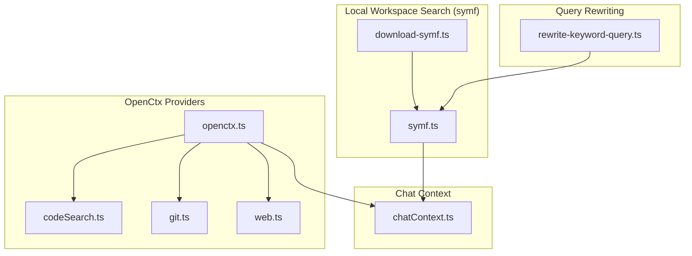
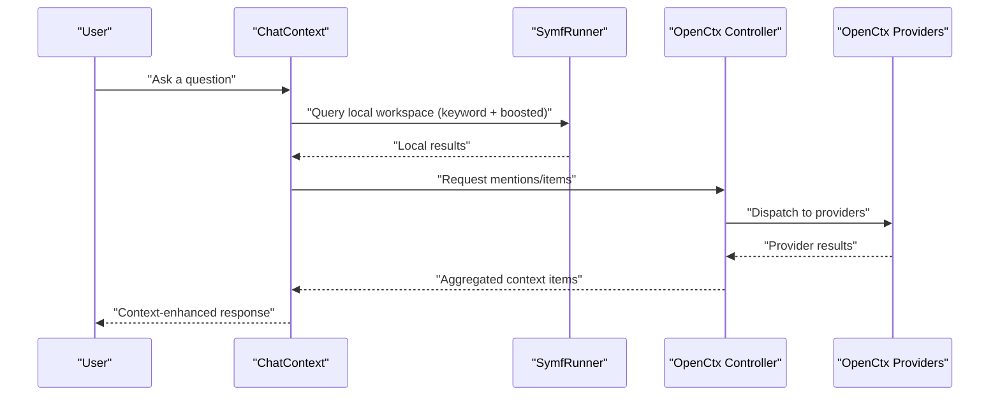
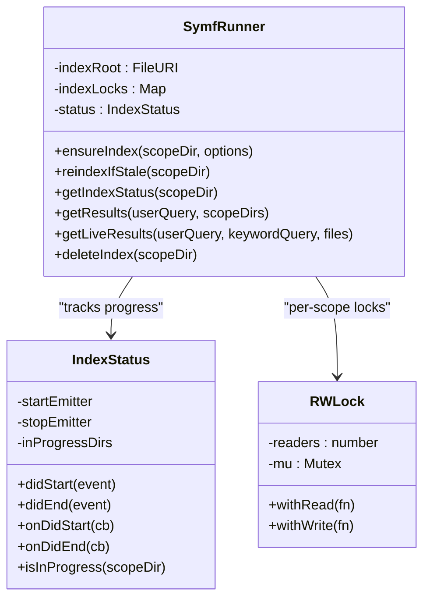
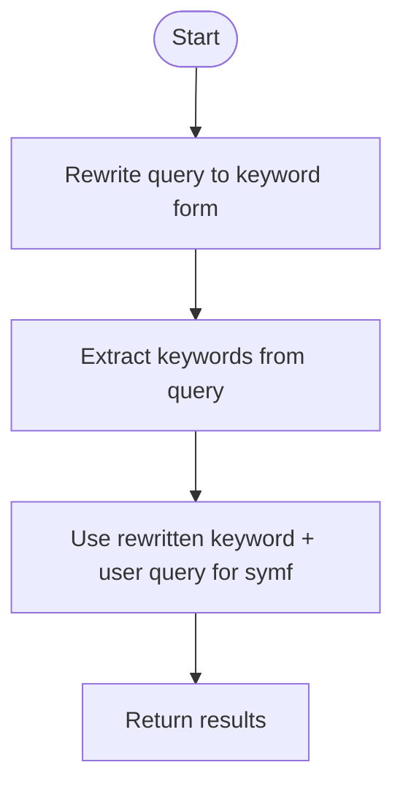
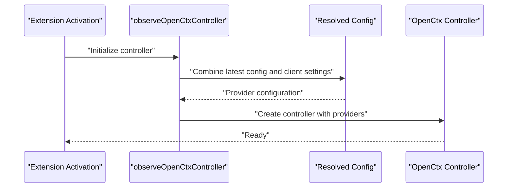
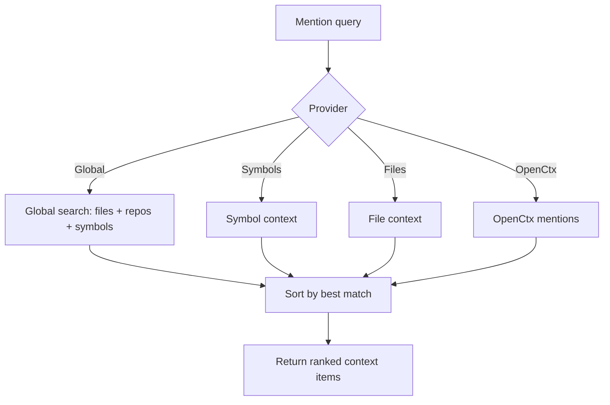
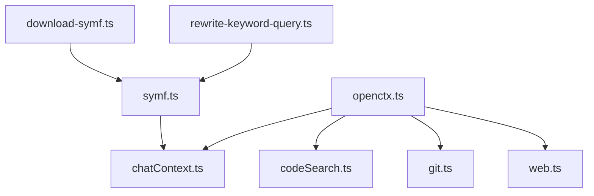

# Context Retrieval

<cite>
**Referenced Files in This Document**
- [openctx.ts](file://vscode/src/context/openctx.ts)
- [symf.ts](file://vscode/src/local-context/symf.ts)
- [download-symf.ts](file://vscode/src/local-context/download-symf.ts)
- [rewrite-keyword-query.ts](file://vscode/src/local-context/rewrite-keyword-query.ts)
- [chatContext.ts](file://vscode/src/chat/context/chatContext.ts)
- [codeSearch.ts](file://vscode/src/context/openctx/codeSearch.ts)
- [git.ts](file://vscode/src/context/openctx/git.ts)
- [web.ts](file://vscode/src/context/openctx/web.ts)
</cite>

## Table of Contents
1. [Introduction](#introduction)
2. [Project Structure](#project-structure)
3. [Core Components](#core-components)
4. [Architecture Overview](#architecture-overview)
5. [Detailed Component Analysis](#detailed-component-analysis)
6. [Dependency Analysis](#dependency-analysis)
7. [Performance Considerations](#performance-considerations)
8. [Troubleshooting Guide](#troubleshooting-guide)
9. [Conclusion](#conclusion)
10. [Appendices](#appendices)

## Introduction
This document explains Cody’s context retrieval and semantic search systems with a focus on:
- Local workspace search powered by symf for keyword and semantic indexing, including query rewriting and result ranking
- The ContextRetriever architecture that combines multiple context sources (recent edits, file paths, repository search)
- OpenCtx integration for external context providers (code search, git repositories, web sources)
- Context mixing strategies using reciprocal rank fusion and relevance scoring
- Performance optimizations (caching, incremental updates, resource management)
- Configuration options and examples for providers, search parameters, and result filtering
- Integration patterns for different VCS systems and enterprise repository access

## Project Structure
The context retrieval system spans several modules:
- Local symf-based search: indexing, querying, and lifecycle management
- Query rewriting and keyword extraction for improved precision
- OpenCtx provider orchestration and provider-specific implementations
- Chat context composition and ranking for mentions and global search

**Diagram sources**
- [download-symf.ts:1-194](file://vscode/src/local-context/download-symf.ts#L1-L194)
- [symf.ts:1-944](file://vscode/src/local-context/symf.ts#L1-L944)
- [rewrite-keyword-query.ts:1-140](file://vscode/src/local-context/rewrite-keyword-query.ts#L1-L140)
- [openctx.ts:1-309](file://vscode/src/context/openctx.ts#L1-L309)
- [codeSearch.ts:1-127](file://vscode/src/context/openctx/codeSearch.ts#L1-L127)
- [git.ts:1-225](file://vscode/src/context/openctx/git.ts#L1-L225)
- [web.ts:1-144](file://vscode/src/context/openctx/web.ts#L1-L144)
- [chatContext.ts:1-396](file://vscode/src/chat/context/chatContext.ts#L1-L396)

**Section sources**
- [openctx.ts:1-309](file://vscode/src/context/openctx.ts#L1-L309)
- [symf.ts:1-944](file://vscode/src/local-context/symf.ts#L1-L944)
- [rewrite-keyword-query.ts:1-140](file://vscode/src/local-context/rewrite-keyword-query.ts#L1-L140)
- [chatContext.ts:1-396](file://vscode/src/chat/context/chatContext.ts#L1-L396)
- [codeSearch.ts:1-127](file://vscode/src/context/openctx/codeSearch.ts#L1-L127)
- [git.ts:1-225](file://vscode/src/context/openctx/git.ts#L1-L225)
- [web.ts:1-144](file://vscode/src/context/openctx/web.ts#L1-L144)

## Core Components
- SymfRunner: manages symf indexing and querying, handles index freshness, locking, and telemetry
- Query rewriting: transforms user queries into optimized keyword search strings and extracts keywords
- OpenCtx controller: orchestrates providers (code search, git, web) and merges configuration
- Chat context builder: aggregates context items from multiple sources and ranks them

Key responsibilities:
- Local search: build per-folder indices, query with boosted keywords, live query for small file sets
- External context: integrate code search, git diffs/logs, and web content
- Ranking: combine results using match-based ranking and contextual relevance

**Section sources**
- [symf.ts:64-531](file://vscode/src/local-context/symf.ts#L64-L531)
- [rewrite-keyword-query.ts:19-82](file://vscode/src/local-context/rewrite-keyword-query.ts#L19-L82)
- [openctx.ts:50-105](file://vscode/src/context/openctx.ts#L50-L105)
- [chatContext.ts:46-111](file://vscode/src/chat/context/chatContext.ts#L46-L111)

## Architecture Overview
The system integrates local and external context:
- Local: symf indexes workspace folders; queries are executed against these indices with optional live queries for small file sets
- External: OpenCtx providers supply context from repositories, git, and web sources
- Composition: chat context merges results from all sources and applies ranking heuristics

**Diagram sources**
- [chatContext.ts:118-156](file://vscode/src/chat/context/chatContext.ts#L118-L156)
- [symf.ts:130-202](file://vscode/src/local-context/symf.ts#L130-L202)
- [openctx.ts:109-207](file://vscode/src/context/openctx.ts#L109-L207)

## Detailed Component Analysis

### Local Workspace Search with symf
SymfRunner encapsulates:
- Index lifecycle: ensure, reindex if stale, delete, and status checks
- Concurrency control: per-scope read/write locks
- Query execution: keyword + boosted query, live query for small file sets
- Telemetry and failure tracking: index size metrics and sentinel files for failures

**Diagram sources**
- [symf.ts:64-531](file://vscode/src/local-context/symf.ts#L64-L531)
- [symf.ts:543-574](file://vscode/src/local-context/symf.ts#L543-L574)
- [symf.ts:649-687](file://vscode/src/local-context/symf.ts#L649-L687)

Key behaviors:
- Index management: ensure index exists, handle failures, and atomically replace during reindex
- Querying: run keyword query against symf index; optionally boost with user query
- Live query: short-circuit for small file lists with live-query mode
- Freshness: stat index to decide whether to reindex

**Section sources**
- [symf.ts:289-393](file://vscode/src/local-context/symf.ts#L289-L393)
- [symf.ts:414-508](file://vscode/src/local-context/symf.ts#L414-L508)
- [symf.ts:130-202](file://vscode/src/local-context/symf.ts#L130-L202)
- [symf.ts:136-168](file://vscode/src/local-context/symf.ts#L136-L168)

### Query Rewriting and Keyword Extraction
The system improves search precision by rewriting queries and extracting keywords:
- Rewriting: use a fast model to produce a structured keyword query
- Keyword extraction: parse XML-formatted keywords from model output

**Diagram sources**
- [rewrite-keyword-query.ts:19-82](file://vscode/src/local-context/rewrite-keyword-query.ts#L19-L82)
- [rewrite-keyword-query.ts:89-139](file://vscode/src/local-context/rewrite-keyword-query.ts#L89-L139)

**Section sources**
- [rewrite-keyword-query.ts:19-82](file://vscode/src/local-context/rewrite-keyword-query.ts#L19-L82)
- [rewrite-keyword-query.ts:89-139](file://vscode/src/local-context/rewrite-keyword-query.ts#L89-L139)

### OpenCtx Integration
The OpenCtx controller dynamically configures providers based on auth status, client capabilities, and feature flags. Providers include:
- Web URLs: fetch and present content from URLs
- Code search: convert server-side search results into context items
- Git mentions: provide diffs and commit logs for recent changes
- Remote repository/file/directory search: enterprise-capable providers

**Diagram sources**
- [openctx.ts:50-105](file://vscode/src/context/openctx.ts#L50-L105)
- [openctx.ts:109-207](file://vscode/src/context/openctx.ts#L109-L207)
- [openctx.ts:209-255](file://vscode/src/context/openctx.ts#L209-L255)

Provider implementations:
- Web provider: fetches content via proxy or direct HTTP, trims HTML, and caps length
- Code search provider: converts server results into context items
- Git provider: generates mentions for diffs vs default branch and uncommitted changes

**Section sources**
- [openctx.ts:109-207](file://vscode/src/context/openctx.ts#L109-L207)
- [web.ts:1-144](file://vscode/src/context/openctx/web.ts#L1-L144)
- [codeSearch.ts:1-127](file://vscode/src/context/openctx/codeSearch.ts#L1-L127)
- [git.ts:1-225](file://vscode/src/context/openctx/git.ts#L1-L225)

### Context Mixing and Ranking
ChatContext composes context from multiple sources and ranks results:
- Global search: combines file, symbol, and repository results with a best-match heuristic
- Mention menu: builds items for at-mentions and respects context window limits
- Ranking: prioritizes exact/starts-with matches and types consistently across match categories

**Diagram sources**
- [chatContext.ts:118-156](file://vscode/src/chat/context/chatContext.ts#L118-L156)
- [chatContext.ts:289-319](file://vscode/src/chat/context/chatContext.ts#L289-L319)
- [chatContext.ts:226-287](file://vscode/src/chat/context/chatContext.ts#L226-L287)

**Section sources**
- [chatContext.ts:118-156](file://vscode/src/chat/context/chatContext.ts#L118-L156)
- [chatContext.ts:226-287](file://vscode/src/chat/context/chatContext.ts#L226-L287)

## Dependency Analysis
- SymfRunner depends on:
  - symf binary availability and platform-specific download logic
  - Workspace folders and per-scope read/write locks
  - Auth status for initialization and telemetry
- OpenCtx controller depends on:
  - Resolved configuration and client capabilities
  - Feature flags for provider availability
  - GraphQL client for server-backed providers
- ChatContext depends on:
  - Editor context utilities for files and symbols
  - OpenCtx controller for external mentions
  - Repo name resolver for repository context

**Diagram sources**
- [download-symf.ts:1-194](file://vscode/src/local-context/download-symf.ts#L1-L194)
- [symf.ts:1-944](file://vscode/src/local-context/symf.ts#L1-L944)
- [rewrite-keyword-query.ts:1-140](file://vscode/src/local-context/rewrite-keyword-query.ts#L1-L140)
- [openctx.ts:1-309](file://vscode/src/context/openctx.ts#L1-L309)
- [codeSearch.ts:1-127](file://vscode/src/context/openctx/codeSearch.ts#L1-L127)
- [git.ts:1-225](file://vscode/src/context/openctx/git.ts#L1-L225)
- [web.ts:1-144](file://vscode/src/context/openctx/web.ts#L1-L144)
- [chatContext.ts:1-396](file://vscode/src/chat/context/chatContext.ts#L1-L396)

**Section sources**
- [openctx.ts:109-207](file://vscode/src/context/openctx.ts#L109-L207)
- [symf.ts:714-767](file://vscode/src/local-context/symf.ts#L714-L767)
- [chatContext.ts:321-360](file://vscode/src/chat/context/chatContext.ts#L321-L360)

## Performance Considerations
- Indexing concurrency: per-scope read/write locks prevent race conditions while allowing concurrent reads
- Incremental updates: reindex only when corpus diff indicates staleness
- Resource limits: symf runs with capped CPU and timeouts; live queries limit file counts
- Telemetry: record index sizes and progress to monitor health
- Query rewriting: reduce search scope and improve recall with structured keywords
- External provider throttling: web fetch uses timeouts and truncation to avoid oversized context

Recommendations:
- Keep workspace folders minimal to reduce index size
- Use query rewriting to narrow searches
- Monitor index status and reindex on significant changes
- Configure provider-specific timeouts and limits

**Section sources**
- [symf.ts:649-687](file://vscode/src/local-context/symf.ts#L649-L687)
- [symf.ts:232-263](file://vscode/src/local-context/symf.ts#L232-L263)
- [symf.ts:442-461](file://vscode/src/local-context/symf.ts#L442-L461)
- [symf.ts:136-168](file://vscode/src/local-context/symf.ts#L136-L168)
- [web.ts:96-132](file://vscode/src/context/openctx/web.ts#L96-L132)

## Troubleshooting Guide
Common issues and resolutions:
- symf not found or unauthorized:
  - Verify binary path or allow automatic download
  - Ensure authentication is active
- Index failures:
  - Check failure sentinel files and reindex
  - Review logs for “symf failed” errors
- Slow queries:
  - Use live queries for small file sets
  - Reindex if stale
- External provider errors:
  - Web provider suppresses invalid URLs and network errors
  - Git provider requires valid repository and branch references

Operational commands:
- Trigger index refresh for current folder or all folders
- Observe index status per scope directory

**Section sources**
- [download-symf.ts:28-60](file://vscode/src/local-context/download-symf.ts#L28-L60)
- [symf.ts:689-701](file://vscode/src/local-context/symf.ts#L689-L701)
- [symf.ts:513-530](file://vscode/src/local-context/symf.ts#L513-L530)
- [web.ts:90-94](file://vscode/src/context/openctx/web.ts#L90-L94)
- [git.ts:165-174](file://vscode/src/context/openctx/git.ts#L165-L174)

## Conclusion
Cody’s context retrieval system blends local symf indexing with external OpenCtx providers to deliver precise, efficient context. By combining query rewriting, incremental index updates, and provider-driven enrichment, it supports both everyday development tasks and complex enterprise scenarios. Proper configuration and monitoring ensure reliable performance across diverse environments.

## Appendices

### Configuration Options
- symf binary path:
  - User-specified path or automatic download
  - Feature flag to disable symf retrieval
- OpenCtx providers:
  - Enable/disable per capability and site version
  - Merge configuration from viewer settings
- Chat context:
  - Context window-aware sizing and warnings
  - Ranking thresholds for match types

**Section sources**
- [download-symf.ts:28-60](file://vscode/src/local-context/download-symf.ts#L28-L60)
- [openctx.ts:257-297](file://vscode/src/context/openctx.ts#L257-L297)
- [chatContext.ts:64-77](file://vscode/src/chat/context/chatContext.ts#L64-L77)

### Example Workflows
- Local search:
  - Initialize symf for workspace folders
  - Query with boosted keywords; fallback to live query for small files
- External context:
  - At-mention repository or file to trigger OpenCtx providers
  - Use web provider to include URL content
- Combined retrieval:
  - ChatContext aggregates local and external items, sorts by best match, and enforces context window limits

**Section sources**
- [symf.ts:714-767](file://vscode/src/local-context/symf.ts#L714-L767)
- [chatContext.ts:289-319](file://vscode/src/chat/context/chatContext.ts#L289-L319)
- [web.ts:19-37](file://vscode/src/context/openctx/web.ts#L19-L37)

### Custom Provider Implementation
Steps to add a new OpenCtx provider:
- Define provider metadata and mentions/items handlers
- Validate and sanitize inputs (e.g., URLs)
- Return standardized items with AI content and UI hints
- Register provider in the OpenCtx controller configuration

**Section sources**
- [openctx.ts:109-207](file://vscode/src/context/openctx.ts#L109-L207)
- [web.ts:8-38](file://vscode/src/context/openctx/web.ts#L8-L38)