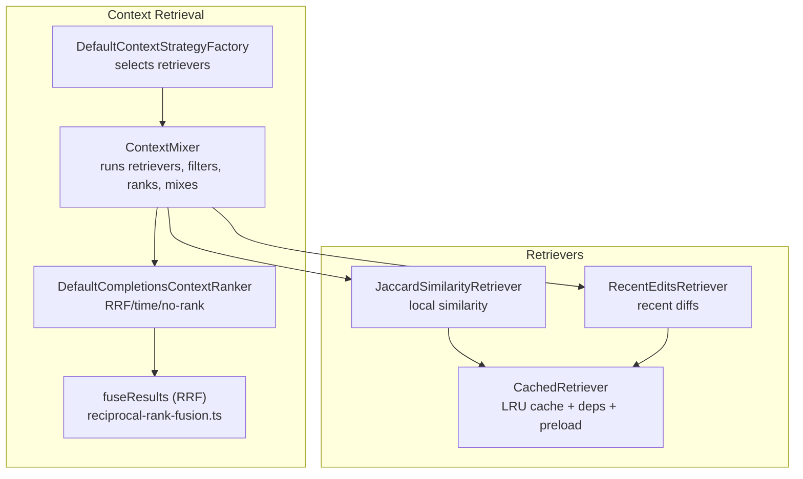
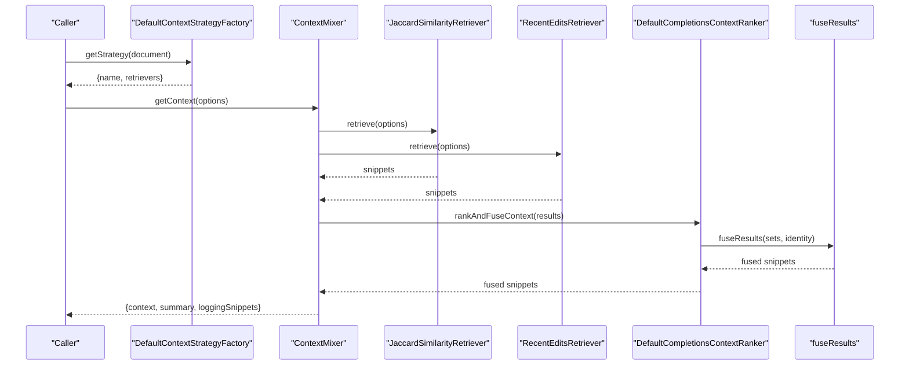
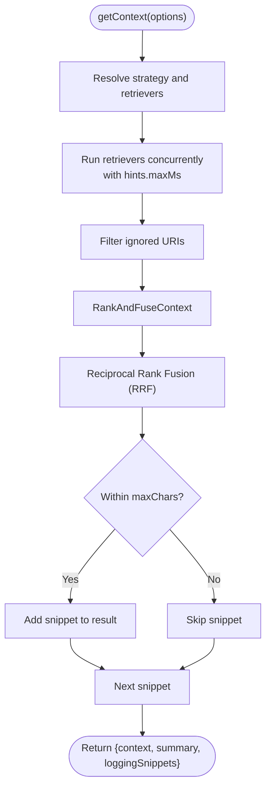
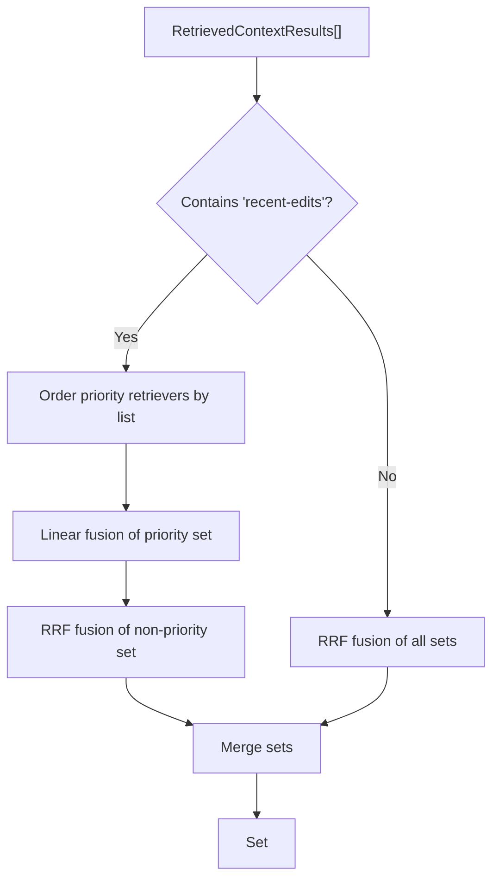
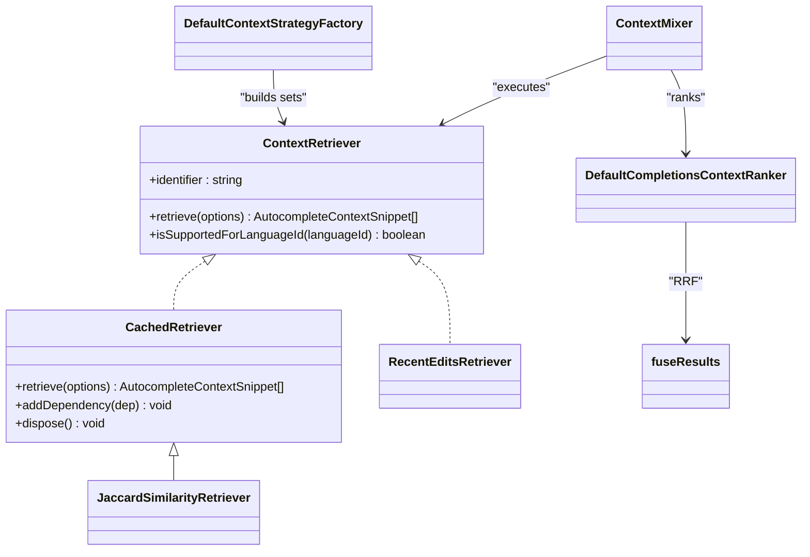

# Context Retriever

<cite>
**Referenced Files in This Document**
- [context-mixer.ts](file://vscode/src/completions/context/context-mixer.ts)
- [context-strategy.ts](file://vscode/src/completions/context/context-strategy.ts)
- [completions-context-ranker.ts](file://vscode/src/completions/context/completions-context-ranker.ts)
- [reciprocal-rank-fusion.ts](file://vscode/src/completions/context/reciprocal-rank-fusion.ts)
- [cached-retriever.ts](file://vscode/src/completions/context/retrievers/cached-retriever.ts)
- [jaccard-similarity-retriever.ts](file://vscode/src/completions/context/retrievers/jaccard-similarity/jaccard-similarity-retriever.ts)
- [recent-edits-retriever.ts](file://vscode/src/completions/context/retrievers/recent-user-actions/recent-edits-retriever.ts)
- [types.ts](file://vscode/src/completions/types.ts)
</cite>

## Table of Contents
1. [Introduction](#introduction)
2. [Project Structure](#project-structure)
3. [Core Components](#core-components)
4. [Architecture Overview](#architecture-overview)
5. [Detailed Component Analysis](#detailed-component-analysis)
6. [Dependency Analysis](#dependency-analysis)
7. [Performance Considerations](#performance-considerations)
8. [Troubleshooting Guide](#troubleshooting-guide)
9. [Conclusion](#conclusion)
10. [Appendices](#appendices)

## Introduction
This document describes the ContextRetriever system that powers AI-assisted code editing by combining multiple context sources. It explains how context is gathered from recent edits, selected files, workspace symbols, and repository search results, and how it is mixed and ranked using reciprocal rank fusion and time-based strategies. It also covers caching, incremental updates, memory management, configuration options, privacy filtering, and performance tuning.

## Project Structure
The ContextRetriever system lives under the completions context subsystem and is composed of:
- A strategy factory that selects which retrievers to run based on configuration
- A context mixer that executes retrievers concurrently, filters results, and merges them
- A ranking module that fuses results via reciprocal rank fusion or time-based ordering
- Reusable caching infrastructure for retrievers
- Concrete retrievers for local and recent actions

**Diagram sources**
- [context-strategy.ts:42-229](file://vscode/src/completions/context/context-strategy.ts#L42-L229)
- [context-mixer.ts:88-244](file://vscode/src/completions/context/context-mixer.ts#L88-L244)
- [completions-context-ranker.ts:35-154](file://vscode/src/completions/context/completions-context-ranker.ts#L35-L154)
- [reciprocal-rank-fusion.ts:38-125](file://vscode/src/completions/context/reciprocal-rank-fusion.ts#L38-L125)
- [cached-retriever.ts:27-279](file://vscode/src/completions/context/retrievers/cached-retriever.ts#L27-L279)
- [jaccard-similarity-retriever.ts:40-99](file://vscode/src/completions/context/retrievers/jaccard-similarity/jaccard-similarity-retriever.ts#L40-L99)
- [recent-edits-retriever.ts:32-84](file://vscode/src/completions/context/retrievers/recent-user-actions/recent-edits-retriever.ts#L32-L84)

**Section sources**
- [context-strategy.ts:20-230](file://vscode/src/completions/context/context-strategy.ts#L20-L230)
- [context-mixer.ts:88-244](file://vscode/src/completions/context/context-mixer.ts#L88-L244)
- [completions-context-ranker.ts:4-18](file://vscode/src/completions/context/completions-context-ranker.ts#L4-L18)
- [reciprocal-rank-fusion.ts:1-126](file://vscode/src/completions/context/reciprocal-rank-fusion.ts#L1-L126)
- [cached-retriever.ts:1-290](file://vscode/src/completions/context/retrievers/cached-retriever.ts#L1-L290)
- [jaccard-similarity-retriever.ts:1-274](file://vscode/src/completions/context/retrievers/jaccard-similarity/jaccard-similarity-retriever.ts#L1-L274)
- [recent-edits-retriever.ts:1-171](file://vscode/src/completions/context/retrievers/recent-user-actions/recent-edits-retriever.ts#L1-L171)
- [types.ts:20-62](file://vscode/src/completions/types.ts#L20-L62)

## Core Components
- ContextRetriever interface: Defines the contract for all retrievers, including retrieval, identification, and language support checks.
- ContextMixer: Orchestrates retriever execution, filtering, ranking, and mixing into a final context list.
- ContextStrategyFactory: Builds the set of retrievers based on the configured strategy.
- DefaultCompletionsContextRanker: Applies ranking strategies (RRF, time-based, no-rank) and fusion.
- CachedRetriever: Provides caching, dependency invalidation, and preloading hooks for retrievers.

**Section sources**
- [types.ts:39-62](file://vscode/src/completions/types.ts#L39-L62)
- [context-mixer.ts:88-244](file://vscode/src/completions/context/context-mixer.ts#L88-L244)
- [context-strategy.ts:42-229](file://vscode/src/completions/context/context-strategy.ts#L42-L229)
- [completions-context-ranker.ts:35-154](file://vscode/src/completions/context/completions-context-ranker.ts#L35-L154)
- [cached-retriever.ts:27-279](file://vscode/src/completions/context/retrievers/cached-retriever.ts#L27-L279)

## Architecture Overview
The system retrieves context from multiple sources, ranks and fuses them, and returns a compact, relevant snippet list constrained by character budgets.

**Diagram sources**
- [context-strategy.ts:175-224](file://vscode/src/completions/context/context-strategy.ts#L175-L224)
- [context-mixer.ts:107-244](file://vscode/src/completions/context/context-mixer.ts#L107-L244)
- [completions-context-ranker.ts:38-76](file://vscode/src/completions/context/completions-context-ranker.ts#L38-L76)
- [reciprocal-rank-fusion.ts:38-125](file://vscode/src/completions/context/reciprocal-rank-fusion.ts#L38-L125)
- [jaccard-similarity-retriever.ts:53-99](file://vscode/src/completions/context/retrievers/jaccard-similarity/jaccard-similarity-retriever.ts#L53-L99)
- [recent-edits-retriever.ts:52-84](file://vscode/src/completions/context/retrievers/recent-user-actions/recent-edits-retriever.ts#L52-L84)

## Detailed Component Analysis

### ContextMixer
Responsibilities:
- Resolve strategy and retrievers
- Run retrievers concurrently with soft timeouts and filtering
- Collect timing and position statistics per retriever
- Apply ranking/fusion and enforce max character budget
- Produce context summary and optional logging snippets

Key behaviors:
- Uses a soft time budget per retriever and filters out ignored URIs
- Aggregates stats for the first 32 results per retriever using a position bitmap
- Enforces maxChars including prefix/suffix contributions

**Diagram sources**
- [context-mixer.ts:107-244](file://vscode/src/completions/context/context-mixer.ts#L107-L244)
- [completions-context-ranker.ts:38-76](file://vscode/src/completions/context/completions-context-ranker.ts#L38-L76)
- [reciprocal-rank-fusion.ts:38-125](file://vscode/src/completions/context/reciprocal-rank-fusion.ts#L38-L125)

**Section sources**
- [context-mixer.ts:88-244](file://vscode/src/completions/context/context-mixer.ts#L88-L244)

### DefaultContextStrategyFactory
Responsibilities:
- Build retriever sets based on the active strategy
- Support combinations like local-only, graph+local, and specialized strategies (e.g., recent edits, diagnostics, viewport)
- Respect language support for graph retrievers

Supported strategies include:
- none
- recent-edits(-1m|-5m|mixed)
- tsc, tsc-mixed
- lsp-light
- jaccard-similarity
- recent-copy
- diagnostics
- recent-view-port
- auto-edit

**Section sources**
- [context-strategy.ts:20-230](file://vscode/src/completions/context/context-strategy.ts#L20-L230)

### DefaultCompletionsContextRanker and Reciprocal Rank Fusion
Ranking strategies:
- Default: RRF across retrievers; prioritizes recent-edits when present
- TimeBased: Sorts by timeSinceActionMs ascending
- NoRanker: Concatenates without reordering

RRF scoring:
- Uses a fixed k=60
- Scores documents by summing 1/(k + rank) across retrievers
- Identity function maps snippets to either file URI (for base snippets) or line IDs for range snippets

**Diagram sources**
- [completions-context-ranker.ts:69-153](file://vscode/src/completions/context/completions-context-ranker.ts#L69-L153)
- [reciprocal-rank-fusion.ts:38-125](file://vscode/src/completions/context/reciprocal-rank-fusion.ts#L38-L125)

**Section sources**
- [completions-context-ranker.ts:4-18](file://vscode/src/completions/context/completions-context-ranker.ts#L4-L18)
- [completions-context-ranker.ts:35-154](file://vscode/src/completions/context/completions-context-ranker.ts#L35-L154)
- [reciprocal-rank-fusion.ts:1-126](file://vscode/src/completions/context/reciprocal-rank-fusion.ts#L1-L126)

### CachedRetriever
Responsibilities:
- LRU caching keyed by retriever-specific keys
- Dependency tracking to invalidate cache entries when dependencies change
- Preloading on cursor movement for responsive UX
- Abort controller to cancel stale retrievals

Mechanisms:
- toCacheKey must reflect inputs that change results
- addDependency links cache entries to dependency keys
- Subscriptions to text changes, visibility, and tabs trigger invalidation
- Optional precomputeOnCursorMove with debounce

**Section sources**
- [cached-retriever.ts:27-279](file://vscode/src/completions/context/retrievers/cached-retriever.ts#L27-L279)

### JaccardSimilarityRetriever
Purpose:
- Local-only similarity search across open tabs and recent files
- Uses sliding window Jaccard matching to find semantically similar code segments

Key points:
- Window size and max matches per file are configurable
- Skips matches overlapping the current context window in the same file
- Uses CachedRetriever for caching and dependency invalidation
- Supports language filtering via shouldBeUsedAsContext

**Section sources**
- [jaccard-similarity-retriever.ts:15-111](file://vscode/src/completions/context/retrievers/jaccard-similarity/jaccard-similarity-retriever.ts#L15-L111)
- [jaccard-similarity-retriever.ts:122-240](file://vscode/src/completions/context/retrievers/jaccard-similarity/jaccard-similarity-retriever.ts#L122-L240)

### RecentEditsRetriever
Purpose:
- Captures recent changes across tracked documents and converts them to diff hunks
- Supports multiple diff strategies (unified, line-level) and caches results

Key points:
- Tracks changes per document and caches diff hunks keyed by tracked document
- Filters candidates by language compatibility
- Adds metadata including time since action and diff strategy metadata

**Section sources**
- [recent-edits-retriever.ts:32-171](file://vscode/src/completions/context/retrievers/recent-user-actions/recent-edits-retriever.ts#L32-L171)

### ContextRetriever Interface
Defines:
- identifier for logging
- retrieve(options) returning AutocompleteContextSnippet[]
- isSupportedForLanguageId(languageId)

Options include hints for maxChars, maxMs, and preloading.

**Section sources**
- [types.ts:20-62](file://vscode/src/completions/types.ts#L20-L62)

## Dependency Analysis
High-level dependencies:
- ContextMixer depends on ContextStrategyFactory, ContextRankingStrategy, and ContextRetriever implementations
- DefaultCompletionsContextRanker depends on fuseResults
- CachedRetriever is extended by concrete retrievers to gain caching and dependency invalidation
- Strategies assemble retrievers and may include graph retrievers conditionally

**Diagram sources**
- [types.ts:39-62](file://vscode/src/completions/types.ts#L39-L62)
- [cached-retriever.ts:27-93](file://vscode/src/completions/context/retrievers/cached-retriever.ts#L27-L93)
- [jaccard-similarity-retriever.ts:40-50](file://vscode/src/completions/context/retrievers/jaccard-similarity/jaccard-similarity-retriever.ts#L40-L50)
- [recent-edits-retriever.ts:32-50](file://vscode/src/completions/context/retrievers/recent-user-actions/recent-edits-retriever.ts#L32-L50)
- [context-strategy.ts:175-224](file://vscode/src/completions/context/context-strategy.ts#L175-L224)
- [context-mixer.ts:107-151](file://vscode/src/completions/context/context-mixer.ts#L107-L151)
- [completions-context-ranker.ts:35-47](file://vscode/src/completions/context/completions-context-ranker.ts#L35-L47)
- [reciprocal-rank-fusion.ts:38-41](file://vscode/src/completions/context/reciprocal-rank-fusion.ts#L38-L41)

**Section sources**
- [context-strategy.ts:42-229](file://vscode/src/completions/context/context-strategy.ts#L42-L229)
- [context-mixer.ts:88-244](file://vscode/src/completions/context/context-mixer.ts#L88-L244)
- [completions-context-ranker.ts:35-154](file://vscode/src/completions/context/completions-context-ranker.ts#L35-L154)
- [cached-retriever.ts:27-279](file://vscode/src/completions/context/retrievers/cached-retriever.ts#L27-L279)
- [jaccard-similarity-retriever.ts:40-99](file://vscode/src/completions/context/retrievers/jaccard-similarity/jaccard-similarity-retriever.ts#L40-L99)
- [recent-edits-retriever.ts:32-84](file://vscode/src/completions/context/retrievers/recent-user-actions/recent-edits-retriever.ts#L32-L84)
- [reciprocal-rank-fusion.ts:38-125](file://vscode/src/completions/context/reciprocal-rank-fusion.ts#L38-L125)

## Performance Considerations
- Soft timeouts: Each retriever receives hints with maxMs to bound work; abortSignal allows early exit
- Concurrency: Retrievers run in parallel to reduce latency
- Caching: CachedRetriever uses LRU cache keyed by retriever-specific keys; dependency invalidation ensures freshness
- Preloading: On cursor movement, retrievers can precompute results with maxChars=0 to warm caches
- Budget enforcement: ContextMixer accumulates snippet lengths and stops when exceeding maxChars
- Memory limits: JaccardSimilarityRetriever caps lines per file loaded; CachedRetriever limits cache sizes

[No sources needed since this section provides general guidance]

## Troubleshooting Guide
Common issues and remedies:
- Empty context: Verify strategy resolves to retrievers and that filters are not overly restrictive
- Slow retrieval: Reduce maxMs hints, disable preloading, or switch to simpler strategies
- Stale context: Ensure dependency invalidation triggers on document changes; check addDependency usage
- Privacy concerns: Confirm contextFiltersProvider ignores unwanted URIs; review ignored patterns

**Section sources**
- [context-mixer.ts:275-286](file://vscode/src/completions/context/context-mixer.ts#L275-L286)
- [cached-retriever.ts:102-151](file://vscode/src/completions/context/retrievers/cached-retriever.ts#L102-L151)
- [cached-retriever.ts:208-213](file://vscode/src/completions/context/retrievers/cached-retriever.ts#L208-L213)

## Conclusion
The ContextRetriever system integrates multiple context sources with robust caching, incremental updates, and flexible ranking. By combining reciprocal rank fusion with time-based prioritization, it balances relevance and recency while respecting performance budgets and privacy constraints.

[No sources needed since this section summarizes without analyzing specific files]

## Appendices

### Configuration Options
- Strategy selection: Choose among recent edits, Jaccard similarity, TSC/graph, LSP-light, diagnostics, viewport, auto-edit, or none
- Strategy-specific parameters:
  - RecentEditsRetriever: maxAgeMs, diff strategy list
  - JaccardSimilarityRetriever: snippetWindowSize, maxMatchesPerFile
  - CachedRetriever: cacheOptions, dependencyCacheOptions, precomputeOnCursorMove.debounceMs
- Ranking strategy: default (RRF), time-based, no-rank
- Filtering: contextFiltersProvider ignores URIs; ensure policies align with privacy requirements

**Section sources**
- [context-strategy.ts:55-155](file://vscode/src/completions/context/context-strategy.ts#L55-L155)
- [jaccard-similarity-retriever.ts:30-48](file://vscode/src/completions/context/retrievers/jaccard-similarity/jaccard-similarity-retriever.ts#L30-L48)
- [recent-edits-retriever.ts:19-22](file://vscode/src/completions/context/retrievers/recent-user-actions/recent-edits-retriever.ts#L19-L22)
- [cached-retriever.ts:9-15](file://vscode/src/completions/context/retrievers/cached-retriever.ts#L9-L15)
- [completions-context-ranker.ts:4-18](file://vscode/src/completions/context/completions-context-ranker.ts#L4-L18)

### Example Workflows
- Basic autocomplete:
  - StrategyFactory builds local-only retrievers (e.g., Jaccard)
  - ContextMixer runs them concurrently, filters, ranks via RRF, and mixes within budget
- Graph-assisted:
  - StrategyFactory adds graph retriever when supported; ContextMixer includes both local and graph results
- Recent edits emphasis:
  - StrategyFactory selects recent-edits variants; DefaultCompletionsContextRanker prioritizes them while applying RRF to others

**Section sources**
- [context-strategy.ts:186-221](file://vscode/src/completions/context/context-strategy.ts#L186-L221)
- [context-mixer.ts:128-185](file://vscode/src/completions/context/context-mixer.ts#L128-L185)
- [completions-context-ranker.ts:72-97](file://vscode/src/completions/context/completions-context-ranker.ts#L72-L97)

### Custom Context Provider Implementation
Steps:
- Implement ContextRetriever with identifier, retrieve(options), and isSupportedForLanguageId
- Extend CachedRetriever to inherit caching and dependency invalidation
- Define toCacheKey to capture inputs affecting results
- Use addDependency for any external dependencies (e.g., URIs)
- Register retriever in a strategy variant via DefaultContextStrategyFactory

**Section sources**
- [types.ts:39-62](file://vscode/src/completions/types.ts#L39-L62)
- [cached-retriever.ts:27-93](file://vscode/src/completions/context/retrievers/cached-retriever.ts#L27-L93)
- [context-strategy.ts:175-224](file://vscode/src/completions/context/context-strategy.ts#L175-L224)

### Privacy and Filtering
- Context filtering: contextFiltersProvider.isUriIgnored is applied to drop snippets from ignored URIs
- Privacy controls: Configure ignored patterns to exclude sensitive repositories or files

**Section sources**
- [context-mixer.ts:275-286](file://vscode/src/completions/context/context-mixer.ts#L275-L286)