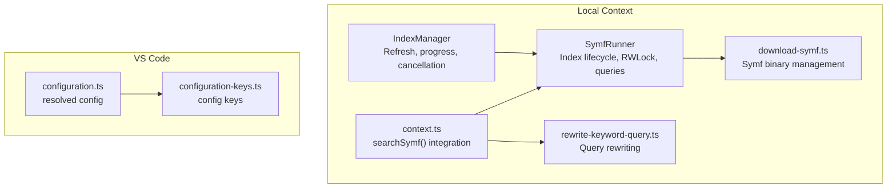
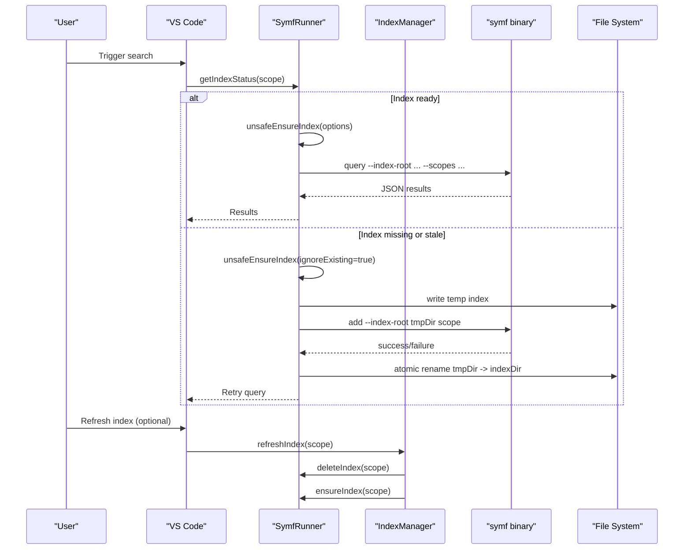
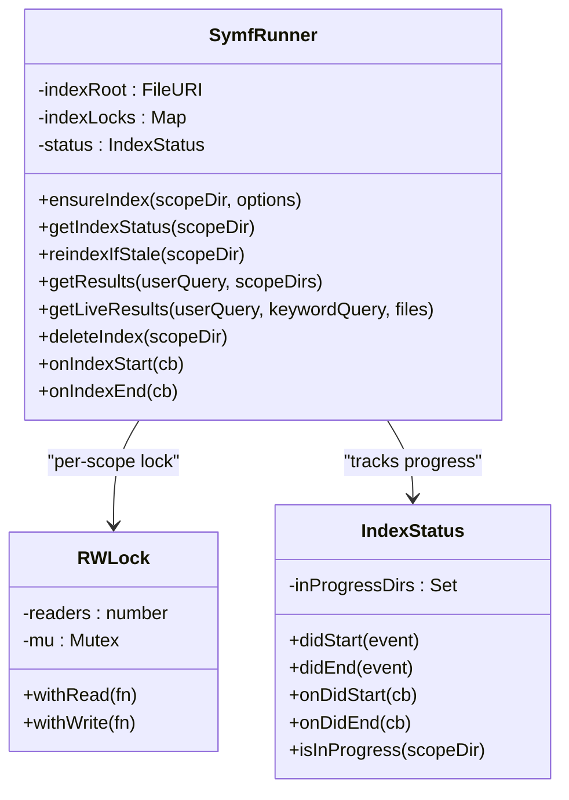
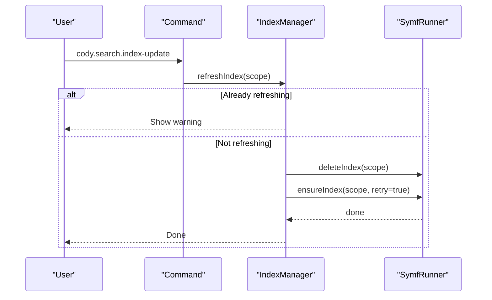
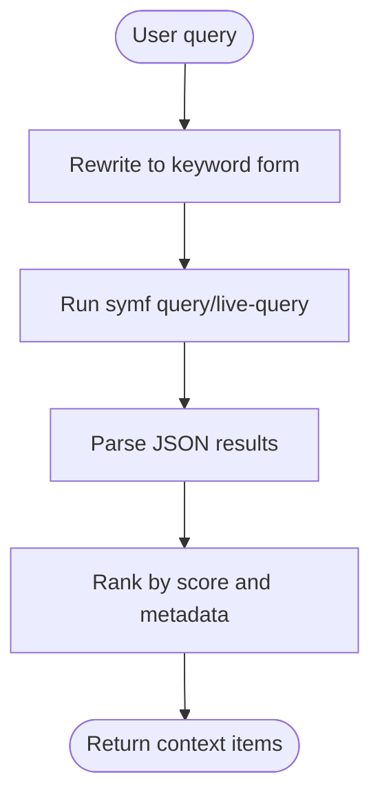
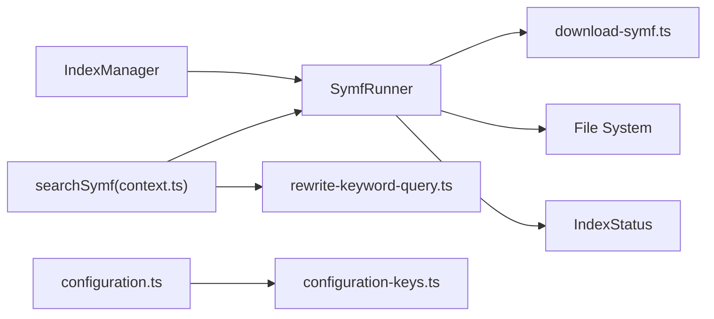

# Local Workspace Search

<cite>
**Referenced Files in This Document**
- [symf.ts](file://vscode/src/local-context/symf.ts)
- [rewrite-keyword-query.ts](file://vscode/src/local-context/rewrite-keyword-query.ts)
- [download-symf.ts](file://vscode/src/local-context/download-symf.ts)
- [context.ts](file://vscode/src/chat/chat-view/context.ts)
- [configuration-keys.ts](file://vscode/src/configuration-keys.ts)
- [configuration.ts](file://vscode/src/configuration.ts)
</cite>

## Table of Contents
1. [Introduction](#introduction)
2. [Project Structure](#project-structure)
3. [Core Components](#core-components)
4. [Architecture Overview](#architecture-overview)
5. [Detailed Component Analysis](#detailed-component-analysis)
6. [Dependency Analysis](#dependency-analysis)
7. [Performance Considerations](#performance-considerations)
8. [Troubleshooting Guide](#troubleshooting-guide)
9. [Conclusion](#conclusion)
10. [Appendices](#appendices)

## Introduction
This document explains Cody’s local workspace search system powered by symf. It covers how semantic indexing and keyword search are orchestrated, how indexes are created and maintained, how queries are processed and ranked, and how concurrency and lifecycle are managed. It also documents configuration options, platform-specific behaviors, and practical operational guidance for monitoring and troubleshooting.

## Project Structure
The local workspace search implementation centers around:
- SymfRunner: orchestrates index lifecycle, thread-safe access, and query execution
- IndexManager: manages refresh workflows and user-facing progress
- Query rewriting: transforms user intent into optimized keyword queries
- Symf binary management: platform-aware download and path resolution
- Workspace detection: single-root and multi-root workspace support

**Diagram sources**
- [symf.ts:64-128](file://vscode/src/local-context/symf.ts#L64-L128)
- [symf.ts:792-879](file://vscode/src/local-context/symf.ts#L792-L879)
- [rewrite-keyword-query.ts:19-32](file://vscode/src/local-context/rewrite-keyword-query.ts#L19-L32)
- [download-symf.ts:28-60](file://vscode/src/local-context/download-symf.ts#L28-L60)
- [context.ts:24-46](file://vscode/src/chat/chat-view/context.ts#L24-L46)
- [configuration.ts:25-204](file://vscode/src/configuration.ts#L25-L204)
- [configuration-keys.ts:18-52](file://vscode/src/configuration-keys.ts#L18-L52)

**Section sources**
- [symf.ts:64-128](file://vscode/src/local-context/symf.ts#L64-L128)
- [symf.ts:792-879](file://vscode/src/local-context/symf.ts#L792-L879)
- [rewrite-keyword-query.ts:19-32](file://vscode/src/local-context/rewrite-keyword-query.ts#L19-L32)
- [download-symf.ts:28-60](file://vscode/src/local-context/download-symf.ts#L28-L60)
- [context.ts:24-46](file://vscode/src/chat/chat-view/context.ts#L24-L46)
- [configuration.ts:25-204](file://vscode/src/configuration.ts#L25-L204)
- [configuration-keys.ts:18-52](file://vscode/src/configuration-keys.ts#L18-L52)

## Core Components
- SymfRunner
  - Manages index directories under a global storage root
  - Provides thread-safe index access via per-scope RWLock
  - Ensures indexes exist, handles failures, and triggers reindexing when stale
  - Executes symf queries and live queries with timeouts and buffering
- IndexManager
  - Exposes commands to refresh indexes for current scope or all workspace folders
  - Tracks in-progress refreshes and shows progress notifications
  - Cancels long-running index builds gracefully
- Query Rewriting
  - Converts natural language queries into optimized keyword forms using a fast model
  - Falls back to the original query if rewriting fails
- Symf Binary Management
  - Resolves symf path from user config or downloads platform-specific binaries
  - Handles locks and cleanup of old binaries
- Workspace Detection
  - Determines scope directories prioritizing the active editor’s workspace folder
  - Supports multi-root workspaces

**Section sources**
- [symf.ts:64-128](file://vscode/src/local-context/symf.ts#L64-L128)
- [symf.ts:298-307](file://vscode/src/local-context/symf.ts#L298-L307)
- [symf.ts:792-879](file://vscode/src/local-context/symf.ts#L792-L879)
- [rewrite-keyword-query.ts:19-32](file://vscode/src/local-context/rewrite-keyword-query.ts#L19-L32)
- [download-symf.ts:28-60](file://vscode/src/local-context/download-symf.ts#L28-L60)
- [context.ts:772-790](file://vscode/src/chat/chat-view/context.ts#L772-L790)

## Architecture Overview
The system integrates index management, query rewriting, and search execution into a cohesive workflow. Authentication gating ensures symf is initialized only after the user is authenticated. Indexes are scoped per workspace folder with per-scope RWLocks to prevent race conditions. Staleness heuristics decide when to rebuild indexes. Queries are executed against symf with timeouts and structured result parsing.

**Diagram sources**
- [symf.ts:210-227](file://vscode/src/local-context/symf.ts#L210-L227)
- [symf.ts:289-296](file://vscode/src/local-context/symf.ts#L289-L296)
- [symf.ts:414-508](file://vscode/src/local-context/symf.ts#L414-L508)
- [symf.ts:852-878](file://vscode/src/local-context/symf.ts#L852-L878)

## Detailed Component Analysis

### SymfRunner: Index Lifecycle and Thread Safety
- Index roots and per-scope locking
  - Indexes are stored under a global storage root with per-scope subdirectories
  - RWLock ensures concurrent reads while preventing interleaved writes
- Status and staleness checks
  - Index status reflects unindexed/indexing/ready/failed
  - Staleness computed via symf status JSON and threshold rules
- Index creation and refresh
  - Creates temporary index directory, spawns symf add, then atomically replaces the index
  - Tracks failures via sentinel files and avoids repeated retries unless forced
- Query execution
  - Runs symf query with boosted keywords and JSON output
  - Parses structured results into a normalized format

**Diagram sources**
- [symf.ts:64-128](file://vscode/src/local-context/symf.ts#L64-L128)
- [symf.ts:298-307](file://vscode/src/local-context/symf.ts#L298-L307)
- [symf.ts:649-687](file://vscode/src/local-context/symf.ts#L649-L687)
- [symf.ts:543-574](file://vscode/src/local-context/symf.ts#L543-L574)

**Section sources**
- [symf.ts:64-128](file://vscode/src/local-context/symf.ts#L64-L128)
- [symf.ts:210-227](file://vscode/src/local-context/symf.ts#L210-L227)
- [symf.ts:232-263](file://vscode/src/local-context/symf.ts#L232-L263)
- [symf.ts:289-296](file://vscode/src/local-context/symf.ts#L289-L296)
- [symf.ts:414-508](file://vscode/src/local-context/symf.ts#L414-L508)
- [symf.ts:649-687](file://vscode/src/local-context/symf.ts#L649-L687)
- [symf.ts:543-574](file://vscode/src/local-context/symf.ts#L543-L574)

### IndexManager: Refresh Workflow and Progress
- Exposes commands to refresh current scope or all workspace folders
- Prevents duplicate refreshes and tracks in-flight operations
- Shows progress notifications with cancellation support

**Diagram sources**
- [symf.ts:720-741](file://vscode/src/local-context/symf.ts#L720-L741)
- [symf.ts:852-878](file://vscode/src/local-context/symf.ts#L852-L878)

**Section sources**
- [symf.ts:720-741](file://vscode/src/local-context/symf.ts#L720-L741)
- [symf.ts:852-878](file://vscode/src/local-context/symf.ts#L852-L878)

### Query Processing Pipeline: Rewriting, Ranking, and Execution
- Keyword rewriting
  - Uses a fast model to extract a concise keyword form from user intent
  - Falls back gracefully to the original query if rewriting fails
- Live and batch queries
  - Batch queries use symf query with boosted keywords and JSON output
  - Live queries target a small set of files with a strict limit and short timeout
- Ranking and scoring
  - Results include structured metadata and a score field suitable for downstream ranking

**Diagram sources**
- [rewrite-keyword-query.ts:19-32](file://vscode/src/local-context/rewrite-keyword-query.ts#L19-L32)
- [rewrite-keyword-query.ts:34-82](file://vscode/src/local-context/rewrite-keyword-query.ts#L34-L82)
- [symf.ts:136-168](file://vscode/src/local-context/symf.ts#L136-L168)
- [symf.ts:309-336](file://vscode/src/local-context/symf.ts#L309-L336)
- [symf.ts:588-639](file://vscode/src/local-context/symf.ts#L588-L639)

**Section sources**
- [rewrite-keyword-query.ts:19-32](file://vscode/src/local-context/rewrite-keyword-query.ts#L19-L32)
- [rewrite-keyword-query.ts:34-82](file://vscode/src/local-context/rewrite-keyword-query.ts#L34-L82)
- [symf.ts:136-168](file://vscode/src/local-context/symf.ts#L136-L168)
- [symf.ts:309-336](file://vscode/src/local-context/symf.ts#L309-L336)
- [symf.ts:588-639](file://vscode/src/local-context/symf.ts#L588-L639)

### Workspace Folder Detection and Multi-root Support
- Scope selection prioritizes the active editor’s workspace folder
- Falls back to all workspace folders if no active editor is available
- Multi-root workspaces are supported by iterating over all file URI folders

**Section sources**
- [context.ts:772-790](file://vscode/src/chat/chat-view/context.ts#L772-L790)
- [symf.ts:742-752](file://vscode/src/local-context/symf.ts#L742-L752)
- [symf.ts:754-763](file://vscode/src/local-context/symf.ts#L754-L763)

### Platform-Specific Considerations
- Windows path normalization for index subdirectory naming
- Platform-aware symf binary naming and download URLs
- CPU utilization capped during indexing to reduce system impact

**Section sources**
- [symf.ts:395-412](file://vscode/src/local-context/symf.ts#L395-L412)
- [download-symf.ts:105-121](file://vscode/src/local-context/download-symf.ts#L105-L121)
- [symf.ts:442-461](file://vscode/src/local-context/symf.ts#L442-L461)

## Dependency Analysis
- SymfRunner depends on:
  - Symf binary path resolution
  - File system operations for index directories and trash
  - Event emitters for index progress
- IndexManager depends on SymfRunner for index operations and VS Code progress UI
- Query rewriting depends on the completions client and structured response parsing
- Configuration keys are derived from package.json and resolved at runtime

**Diagram sources**
- [symf.ts:122-128](file://vscode/src/local-context/symf.ts#L122-L128)
- [symf.ts:543-574](file://vscode/src/local-context/symf.ts#L543-L574)
- [download-symf.ts:28-60](file://vscode/src/local-context/download-symf.ts#L28-L60)
- [context.ts:24-46](file://vscode/src/chat/chat-view/context.ts#L24-L46)
- [rewrite-keyword-query.ts:19-32](file://vscode/src/local-context/rewrite-keyword-query.ts#L19-L32)
- [configuration.ts:25-204](file://vscode/src/configuration.ts#L25-L204)
- [configuration-keys.ts:18-52](file://vscode/src/configuration-keys.ts#L18-L52)

**Section sources**
- [symf.ts:122-128](file://vscode/src/local-context/symf.ts#L122-L128)
- [download-symf.ts:28-60](file://vscode/src/local-context/download-symf.ts#L28-L60)
- [context.ts:24-46](file://vscode/src/chat/chat-view/context.ts#L24-L46)
- [rewrite-keyword-query.ts:19-32](file://vscode/src/local-context/rewrite-keyword-query.ts#L19-L32)
- [configuration.ts:25-204](file://vscode/src/configuration.ts#L25-L204)
- [configuration-keys.ts:18-52](file://vscode/src/configuration-keys.ts#L18-L52)

## Performance Considerations
- Concurrency and contention
  - RWLock allows concurrent readers and exclusive writers, minimizing lock contention
- CPU limits during indexing
  - Limits GOMAXPROCS to reduce CPU usage during index builds
- Query timeouts and buffers
  - Symf queries and live queries enforce timeouts and large output buffers to handle large indexes
- Staleness thresholds
  - Thresholds scale with last indexing duration and number of changed files to balance freshness and cost

**Section sources**
- [symf.ts:649-687](file://vscode/src/local-context/symf.ts#L649-L687)
- [symf.ts:442-461](file://vscode/src/local-context/symf.ts#L442-L461)
- [symf.ts:154-168](file://vscode/src/local-context/symf.ts#L154-L168)
- [symf.ts:326-335](file://vscode/src/local-context/symf.ts#L326-L335)
- [symf.ts:885-943](file://vscode/src/local-context/symf.ts#L885-L943)

## Troubleshooting Guide
- Symf not found
  - Symf path may be disabled by feature flag or missing; check user-specified path or allow download
- Unauthorized or network errors
  - Ensure authentication and network connectivity; errors are surfaced with actionable messages
- Index stuck or failing
  - Use refresh commands to delete and rebuild the index; monitor progress notifications
  - Check for failure sentinel files indicating prior failures
- Slow or unresponsive queries
  - Verify timeouts and CPU limits; consider reducing scope or number of files for live queries

Operational commands:
- Refresh current scope index
  - Command: cody.search.index-update
- Refresh all workspace folder indexes
  - Command: cody.search.index-update-all

**Section sources**
- [download-symf.ts:28-60](file://vscode/src/local-context/download-symf.ts#L28-L60)
- [symf.ts:689-701](file://vscode/src/local-context/symf.ts#L689-L701)
- [symf.ts:852-878](file://vscode/src/local-context/symf.ts#L852-L878)
- [symf.ts:513-530](file://vscode/src/local-context/symf.ts#L513-L530)
- [symf.ts:720-741](file://vscode/src/local-context/symf.ts#L720-L741)

## Conclusion
Cody’s local workspace search leverages symf to deliver fast, accurate results over local codebases. The SymfRunner and IndexManager coordinate index lifecycle, thread safety, and user feedback. Query rewriting improves recall, while staleness heuristics keep results fresh with minimal overhead. With robust error handling, platform awareness, and operational commands, the system is reliable and maintainable across diverse environments.

## Appendices

### Configuration Options
- Symf binary path
  - cody.experimental.symf.path or cody.internal.symf.path
- Feature flags
  - Symf retrieval disabled flag controls availability
- Resolved configuration
  - Runtime configuration is sanitized and resolved from VS Code settings

**Section sources**
- [download-symf.ts:40-50](file://vscode/src/local-context/download-symf.ts#L40-L50)
- [download-symf.ts:29-36](file://vscode/src/local-context/download-symf.ts#L29-L36)
- [configuration.ts:25-204](file://vscode/src/configuration.ts#L25-L204)
- [configuration-keys.ts:18-52](file://vscode/src/configuration-keys.ts#L18-L52)