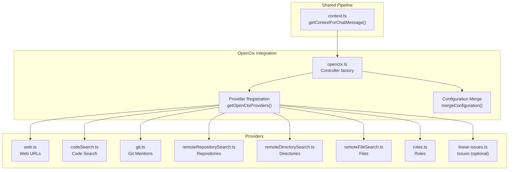
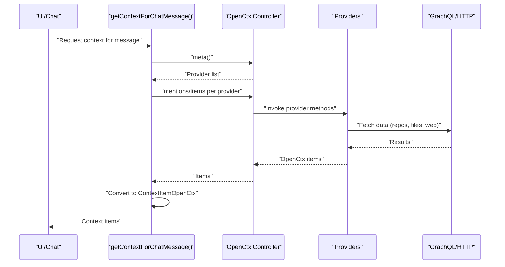
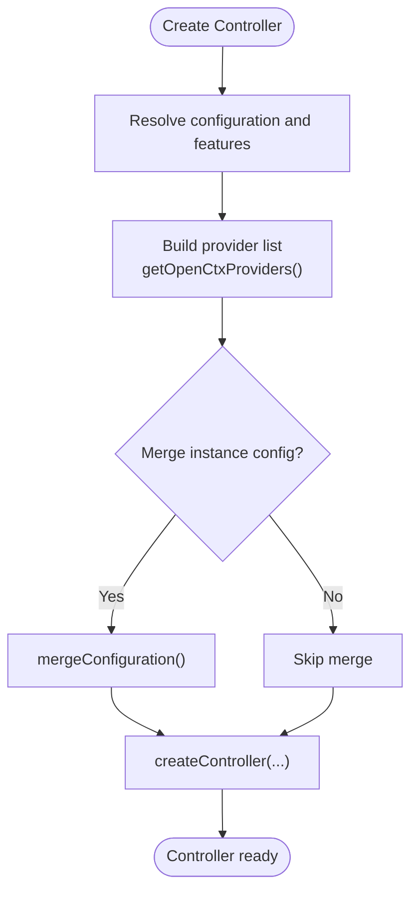
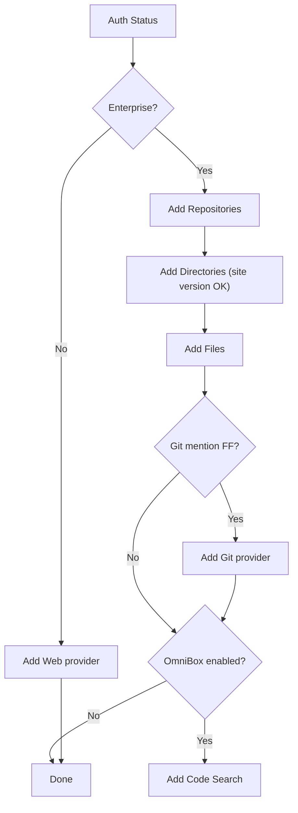
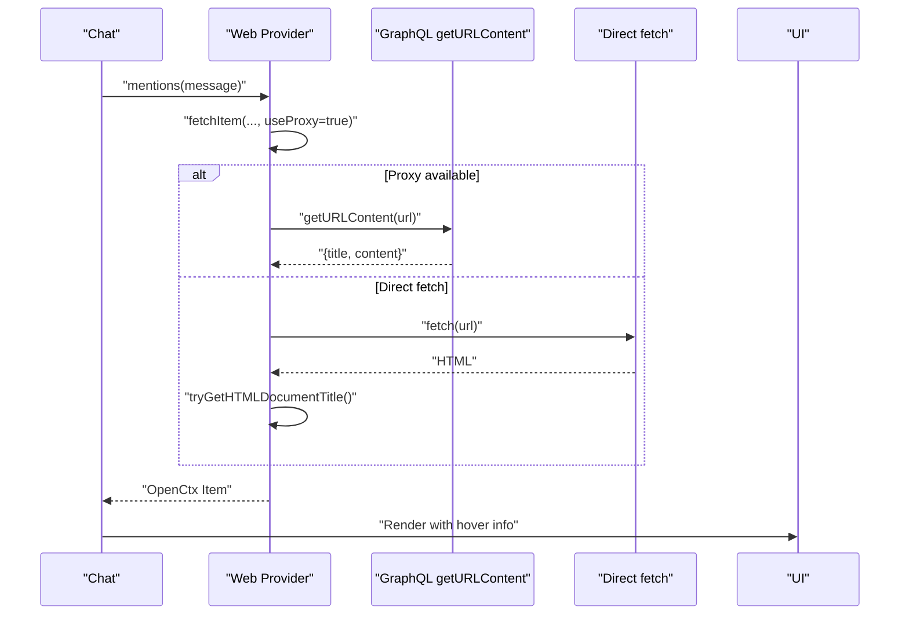
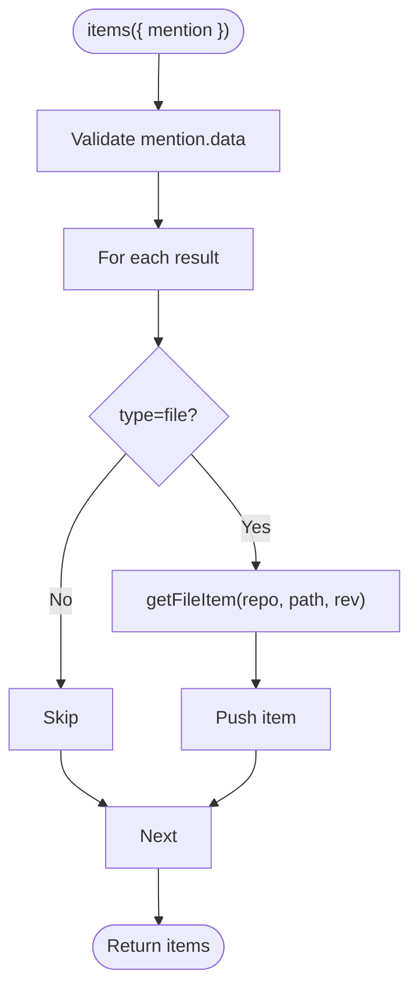
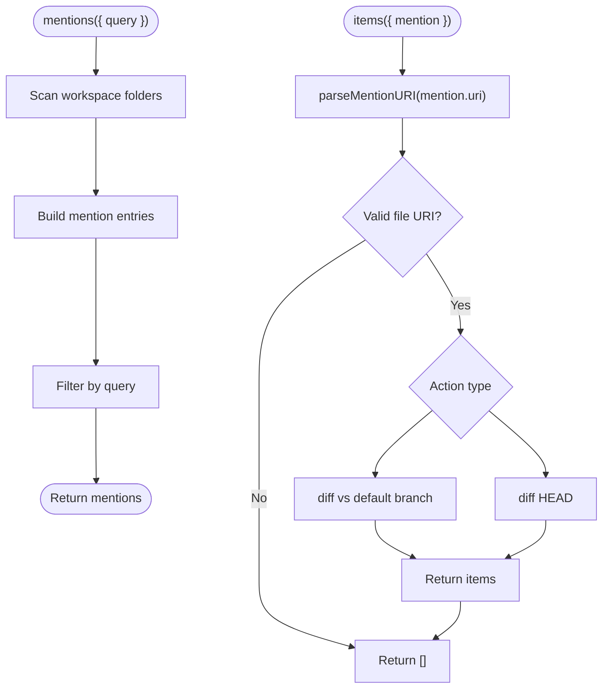
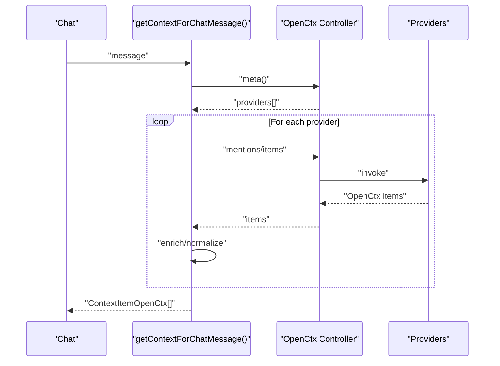
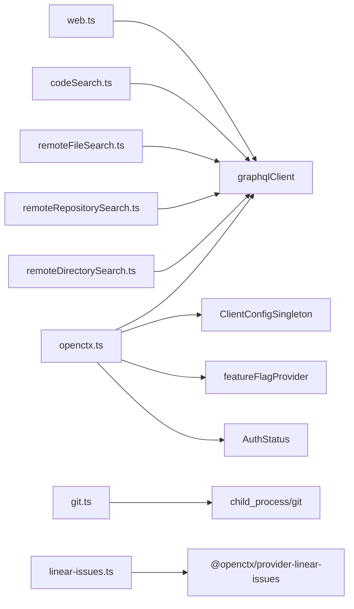

# OpenCtx Integration

<cite>
**Referenced Files in This Document**
- [openctx.ts](file://vscode/src/context/openctx.ts)
- [openctx.test.ts](file://vscode/src/context/openctx.test.ts)
- [types.ts](file://vscode/src/context/openctx/types.ts)
- [codeSearch.ts](file://vscode/src/context/openctx/codeSearch.ts)
- [git.ts](file://vscode/src/context/openctx/git.ts)
- [linear-issues.ts](file://vscode/src/context/openctx/linear-issues.ts)
- [remoteDirectorySearch.ts](file://vscode/src/context/openctx/remoteDirectorySearch.ts)
- [remoteFileSearch.ts](file://vscode/src/context/openctx/remoteFileSearch.ts)
- [remoteRepositorySearch.ts](file://vscode/src/context/openctx/remoteRepositorySearch.ts)
- [rules.ts](file://vscode/src/context/openctx/rules.ts)
- [web.ts](file://vscode/src/context/openctx/web.ts)
- [get-repository-mentions.ts](file://vscode/src/context/openctx/common/get-repository-mentions.ts)
- [context.ts](file://lib/shared/src/context/openctx/context.ts)
- [clientCapabilities.ts](file://lib/shared/src/configuration/clientCapabilities.ts)
- [vscode-shim.test.ts](file://agent/src/vscode-shim.test.ts)
</cite>

## Table of Contents
1. [Introduction](#introduction)
2. [Project Structure](#project-structure)
3. [Core Components](#core-components)
4. [Architecture Overview](#architecture-overview)
5. [Detailed Component Analysis](#detailed-component-analysis)
6. [Dependency Analysis](#dependency-analysis)
7. [Performance Considerations](#performance-considerations)
8. [Troubleshooting Guide](#troubleshooting-guide)
9. [Conclusion](#conclusion)
10. [Appendices](#appendices)

## Introduction
This document explains Cody’s OpenCtx integration that enables external context providers to enhance AI assistance. It covers the OpenCtx protocol implementation, provider registration, authentication handling, request/response protocols, context enrichment pipeline, configuration, rate limiting, error handling, security model, sandboxing, privacy considerations, and practical guidance for building custom providers, enterprise configurations, and troubleshooting connectivity issues.

## Project Structure
Cody integrates OpenCtx via a dedicated module that constructs providers, wires them into the OpenCtx controller, and exposes them to the rest of the application. Providers are grouped by domain: web, code search, git, repositories, directories, files, rules, and optional issue tracking. A shared context pipeline converts OpenCtx results into Cody-compatible context items.



**Diagram sources**
- [openctx.ts:50-105](file://vscode/src/context/openctx.ts#L50-L105)
- [openctx.ts:109-207](file://vscode/src/context/openctx.ts#L109-L207)
- [web.ts:8-38](file://vscode/src/context/openctx/web.ts#L8-L38)
- [codeSearch.ts:35-65](file://vscode/src/context/openctx/codeSearch.ts#L35-L65)
- [git.ts:25-130](file://vscode/src/context/openctx/git.ts#L25-L130)
- [remoteRepositorySearch.ts:14-56](file://vscode/src/context/openctx/remoteRepositorySearch.ts#L14-L56)
- [remoteDirectorySearch.ts:12-45](file://vscode/src/context/openctx/remoteDirectorySearch.ts#L12-L45)
- [remoteFileSearch.ts:17-50](file://vscode/src/context/openctx/remoteFileSearch.ts#L17-L50)
- [rules.ts:20-79](file://vscode/src/context/openctx/rules.ts#L20-L79)
- [linear-issues.ts:4-9](file://vscode/src/context/openctx/linear-issues.ts#L4-L9)
- [context.ts:7-26](file://lib/shared/src/context/openctx/context.ts#L7-L26)

**Section sources**
- [openctx.ts:50-105](file://vscode/src/context/openctx.ts#L50-L105)
- [openctx.ts:109-207](file://vscode/src/context/openctx.ts#L109-L207)
- [context.ts:7-26](file://lib/shared/src/context/openctx/context.ts#L7-L26)

## Core Components
- OpenCtx controller factory: Creates and manages the OpenCtx controller lifecycle, wires providers, and merges configuration from the Sourcegraph instance.
- Provider registry: Dynamically composes providers based on authentication, client configuration, feature flags, and site version checks.
- Provider implementations: Domain-specific providers for web URLs, code search, git, repositories, directories, files, rules, and optional issues.
- Shared context pipeline: Converts OpenCtx results into Cody-compatible context items for chat.

Key responsibilities:
- Provider registration and feature gating
- Authentication-aware provider selection
- Request/response protocol adherence to OpenCtx
- Context enrichment and conversion to Cody context items

**Section sources**
- [openctx.ts:50-105](file://vscode/src/context/openctx.ts#L50-L105)
- [openctx.ts:109-207](file://vscode/src/context/openctx.ts#L109-L207)
- [context.ts:7-26](file://lib/shared/src/context/openctx/context.ts#L7-L26)

## Architecture Overview
The integration follows a layered architecture:
- UI and orchestration trigger context retrieval.
- The shared pipeline calls the OpenCtx controller to enumerate providers and request context.
- Providers fetch data from internal APIs or external services.
- Results are normalized into OpenCtx items and transformed into Cody context items.



**Diagram sources**
- [context.ts:7-26](file://lib/shared/src/context/openctx/context.ts#L7-L26)
- [openctx.ts:50-105](file://vscode/src/context/openctx.ts#L50-L105)
- [web.ts:34-94](file://vscode/src/context/openctx/web.ts#L34-L94)
- [remoteFileSearch.ts:38-112](file://vscode/src/context/openctx/remoteFileSearch.ts#L38-L112)
- [remoteRepositorySearch.ts:30-54](file://vscode/src/context/openctx/remoteRepositorySearch.ts#L30-L54)
- [remoteDirectorySearch.ts:33-105](file://vscode/src/context/openctx/remoteDirectorySearch.ts#L33-L105)
- [codeSearch.ts:45-91](file://vscode/src/context/openctx/codeSearch.ts#L45-L91)
- [git.ts:59-129](file://vscode/src/context/openctx/git.ts#L59-L129)
- [rules.ts:64-76](file://vscode/src/context/openctx/rules.ts#L64-L76)

## Detailed Component Analysis

### OpenCtx Controller Factory
- Observes resolved configuration, client capabilities, and authentication status.
- Creates the OpenCtx controller with providers and optional configuration merging from the Sourcegraph instance.
- Provides an output channel for diagnostics and warns if the standalone OpenCtx extension is installed.



**Diagram sources**
- [openctx.ts:50-105](file://vscode/src/context/openctx.ts#L50-L105)
- [openctx.ts:109-207](file://vscode/src/context/openctx.ts#L109-L207)
- [openctx.ts:257-297](file://vscode/src/context/openctx.ts#L257-L297)

**Section sources**
- [openctx.ts:50-105](file://vscode/src/context/openctx.ts#L50-L105)
- [openctx.ts:109-207](file://vscode/src/context/openctx.ts#L109-L207)
- [openctx.ts:257-297](file://vscode/src/context/openctx.ts#L257-L297)

### Provider Registration System
- DotCom users: Web URLs provider.
- Enterprise users: Adds repositories, directories, files, and optionally git mentions and code search depending on feature flags and site version.
- Optional providers: Rules and issues (experimental).



**Diagram sources**
- [openctx.ts:109-207](file://vscode/src/context/openctx.ts#L109-L207)
- [openctx.ts:209-255](file://vscode/src/context/openctx.ts#L209-L255)

**Section sources**
- [openctx.ts:109-207](file://vscode/src/context/openctx.ts#L109-L207)
- [openctx.ts:209-255](file://vscode/src/context/openctx.ts#L209-L255)
- [openctx.test.ts:23-81](file://vscode/src/context/openctx.test.ts#L23-L81)

### Web Provider
- Fetches content from a URL either via a proxy (GraphQL) or direct HTTP (with safety checks).
- Extracts a title and cleans HTML for LLM consumption.
- Returns an OpenCtx item with AI content and hover metadata.



**Diagram sources**
- [web.ts:8-38](file://vscode/src/context/openctx/web.ts#L8-L38)
- [web.ts:40-94](file://vscode/src/context/openctx/web.ts#L40-L94)

**Section sources**
- [web.ts:8-38](file://vscode/src/context/openctx/web.ts#L8-L38)
- [web.ts:40-94](file://vscode/src/context/openctx/web.ts#L40-L94)

### Code Search Provider
- Interprets a mention payload containing file search results.
- Resolves file content via GraphQL and returns OpenCtx items suitable for chat.



**Diagram sources**
- [codeSearch.ts:45-65](file://vscode/src/context/openctx/codeSearch.ts#L45-L65)
- [codeSearch.ts:67-91](file://vscode/src/context/openctx/codeSearch.ts#L67-L91)

**Section sources**
- [codeSearch.ts:35-65](file://vscode/src/context/openctx/codeSearch.ts#L35-L65)
- [codeSearch.ts:67-91](file://vscode/src/context/openctx/codeSearch.ts#L67-L91)

### Git Mentions Provider
- Generates “mentions” for diffs against default branch and uncommitted changes.
- Parses custom URIs to determine action and executes git commands in the repository directory.
- Returns AI-ready content for inclusion in context.



**Diagram sources**
- [git.ts:30-57](file://vscode/src/context/openctx/git.ts#L30-L57)
- [git.ts:59-129](file://vscode/src/context/openctx/git.ts#L59-L129)
- [git.ts:183-214](file://vscode/src/context/openctx/git.ts#L183-L214)

**Section sources**
- [git.ts:25-130](file://vscode/src/context/openctx/git.ts#L25-L130)
- [git.ts:183-214](file://vscode/src/context/openctx/git.ts#L183-L214)

### Remote Repository, Directory, and File Providers
- Repository provider: Suggests repositories and builds mentions with metadata.
- Directory provider: Searches directories within a repository and returns context snippets.
- File provider: Resolves file content via GraphQL and returns OpenCtx items.

```mermaid
classDiagram
class RemoteRepositoryProvider {
+meta()
+mentions({query})
+items({message, mention})
}
class RemoteDirectoryProvider {
+meta()
+mentions({query})
+items({message, mention})
}
class RemoteFileProvider {
+meta()
+mentions({query})
+items({mention})
}
RemoteRepositoryProvider <.. get-repository-mentions : "uses"
RemoteDirectoryProvider <.. get-repository-mentions : "uses"
RemoteFileProvider <.. get-repository-mentions : "uses"
```

**Diagram sources**
- [remoteRepositorySearch.ts:14-56](file://vscode/src/context/openctx/remoteRepositorySearch.ts#L14-L56)
- [remoteDirectorySearch.ts:12-45](file://vscode/src/context/openctx/remoteDirectorySearch.ts#L12-L45)
- [remoteFileSearch.ts:17-50](file://vscode/src/context/openctx/remoteFileSearch.ts#L17-L50)
- [get-repository-mentions.ts:35-89](file://vscode/src/context/openctx/common/get-repository-mentions.ts#L35-L89)

**Section sources**
- [remoteRepositorySearch.ts:14-56](file://vscode/src/context/openctx/remoteRepositorySearch.ts#L14-L56)
- [remoteDirectorySearch.ts:12-45](file://vscode/src/context/openctx/remoteDirectorySearch.ts#L12-L45)
- [remoteFileSearch.ts:17-50](file://vscode/src/context/openctx/remoteFileSearch.ts#L17-L50)
- [get-repository-mentions.ts:35-89](file://vscode/src/context/openctx/common/get-repository-mentions.ts#L35-L89)

### Rules Provider
- Automatically includes rules applicable to the current file or workspace root.
- Translates rule definitions into OpenCtx items for AI consumption.

**Section sources**
- [rules.ts:20-79](file://vscode/src/context/openctx/rules.ts#L20-L79)

### Linear Issues Provider
- Integrates an external OpenCtx provider for issues; included conditionally.

**Section sources**
- [linear-issues.ts:4-9](file://vscode/src/context/openctx/linear-issues.ts#L4-L9)

### Context Enrichment Pipeline
- Orchestrates provider discovery and invocation.
- Normalizes results into Cody-compatible context items with metadata and source.



**Diagram sources**
- [context.ts:7-26](file://lib/shared/src/context/openctx/context.ts#L7-L26)
- [openctx.ts:50-105](file://vscode/src/context/openctx.ts#L50-L105)

**Section sources**
- [context.ts:7-26](file://lib/shared/src/context/openctx/context.ts#L7-L26)

## Dependency Analysis
- Internal dependencies:
  - GraphQL client for repository/file/content queries.
  - Feature flags and client configuration for provider gating.
  - Authentication status and endpoint for resource URLs.
- External dependencies:
  - OpenCtx client library and VS Code integration library.
  - Optional external providers (e.g., Linear issues).



**Diagram sources**
- [openctx.ts:109-207](file://vscode/src/context/openctx.ts#L109-L207)
- [web.ts:6-8](file://vscode/src/context/openctx/web.ts#L6-L8)
- [codeSearch.ts:9-13](file://vscode/src/context/openctx/codeSearch.ts#L9-L13)
- [remoteFileSearch.ts:2-9](file://vscode/src/context/openctx/remoteFileSearch.ts#L2-L9)
- [remoteRepositorySearch.ts:2-7](file://vscode/src/context/openctx/remoteRepositorySearch.ts#L2-L7)
- [remoteDirectorySearch.ts:1-6](file://vscode/src/context/openctx/remoteDirectorySearch.ts#L1-L6)
- [git.ts:1-18](file://vscode/src/context/openctx/git.ts#L1-L18)
- [linear-issues.ts:1-2](file://vscode/src/context/openctx/linear-issues.ts#L1-L2)

**Section sources**
- [openctx.ts:109-207](file://vscode/src/context/openctx.ts#L109-L207)
- [web.ts:6-8](file://vscode/src/context/openctx/web.ts#L6-L8)
- [codeSearch.ts:9-13](file://vscode/src/context/openctx/codeSearch.ts#L9-L13)
- [remoteFileSearch.ts:2-9](file://vscode/src/context/openctx/remoteFileSearch.ts#L2-L9)
- [remoteRepositorySearch.ts:2-7](file://vscode/src/context/openctx/remoteRepositorySearch.ts#L2-L7)
- [remoteDirectorySearch.ts:1-6](file://vscode/src/context/openctx/remoteDirectorySearch.ts#L1-L6)
- [git.ts:1-18](file://vscode/src/context/openctx/git.ts#L1-L18)
- [linear-issues.ts:1-2](file://vscode/src/context/openctx/linear-issues.ts#L1-L2)

## Performance Considerations
- Provider gating: Only enable providers appropriate for the user’s environment to reduce overhead.
- Site version checks: Conditional inclusion of directory provider based on server capability.
- Caching: Viewer settings providers are cached during configuration merge to avoid repeated network calls.
- Trimming: Web content is trimmed to fit context windows.
- Abort signals: The pipeline respects abort signals to cancel long-running operations.

Recommendations:
- Prefer repository-level context over file-level when possible to minimize item count.
- Use concise queries and filters to limit result sets.
- Leverage caching for repeated mentions and repository suggestions.

**Section sources**
- [openctx.ts:257-297](file://vscode/src/context/openctx.ts#L257-L297)
- [web.ts:128-131](file://vscode/src/context/openctx/web.ts#L128-L131)
- [context.ts:11-16](file://lib/shared/src/context/openctx/context.ts#L11-L16)

## Troubleshooting Guide
Common issues and remedies:
- Conflicting extensions: The controller warns if the standalone OpenCtx extension is installed; disable it to avoid conflicts.
- Connectivity to external services:
  - Web provider requires a valid URL and reachable host; ensure network access and HTTPS.
  - Git provider requires git CLI availability and repository access; verify PATH and working directories.
- Authentication:
  - Providers that rely on GraphQL require a valid session; ensure the user is authenticated.
- Rate limiting and timeouts:
  - Web provider uses timeouts for direct fetch; adjust or rely on proxy mode.
  - Repository/file queries are constrained by backend limits; simplify queries.
- Error suppression:
  - Providers suppress errors during mention generation to improve UX; check the OpenCtx output channel for diagnostics.

Operational tips:
- Use the OpenCtx output channel for logs and warnings.
- Temporarily disable optional providers to isolate issues.
- Validate repository/site version compatibility for advanced providers.

**Section sources**
- [openctx.ts:299-309](file://vscode/src/context/openctx.ts#L299-L309)
- [web.ts:90-94](file://vscode/src/context/openctx/web.ts#L90-L94)
- [git.ts:165-174](file://vscode/src/context/openctx/git.ts#L165-L174)

## Conclusion
Cody’s OpenCtx integration provides a robust, extensible framework for bringing external context into AI-assisted development. It balances flexibility with safety, performance, and usability through careful provider gating, configuration merging, error handling, and context normalization. The modular design allows enterprises to tailor providers to their needs while maintaining strong security and privacy controls.

## Appendices

### Provider Configuration Options
- Global configuration keys:
  - openctx.providers: Map of provider URIs to provider-specific settings.
  - Scope behavior: Configuration is retrieved globally for the openctx section; language-scoped or workspace-scoped requests fall back to global scope.
- Example keys:
  - openctx.providers.<provider_uri>: Provider-specific configuration object.

**Section sources**
- [vscode-shim.test.ts:404-434](file://agent/src/vscode-shim.test.ts#L404-L434)

### Authentication Handling
- Authentication status determines provider availability (e.g., enterprise vs. dotcom).
- GraphQL client operations require a valid session; providers surface errors gracefully.
- Secrets and extension context are passed to the OpenCtx controller for secure storage and retrieval.

**Section sources**
- [openctx.ts:80-95](file://vscode/src/context/openctx.ts#L80-L95)
- [openctx.ts:117-132](file://vscode/src/context/openctx.ts#L117-L132)

### Request/Response Protocols
- Providers implement the OpenCtx Provider interface with meta, mentions, and items methods.
- Items returned conform to the OpenCtx Item schema with URL, title, and AI content.
- Mentions carry provider-specific data payloads for later resolution.

**Section sources**
- [types.ts:3-5](file://vscode/src/context/openctx/types.ts#L3-L5)
- [web.ts:34-37](file://vscode/src/context/openctx/web.ts#L34-L37)
- [remoteFileSearch.ts:38-48](file://vscode/src/context/openctx/remoteFileSearch.ts#L38-L48)
- [remoteRepositorySearch.ts:30-54](file://vscode/src/context/openctx/remoteRepositorySearch.ts#L30-L54)
- [remoteDirectorySearch.ts:33-43](file://vscode/src/context/openctx/remoteDirectorySearch.ts#L33-L43)
- [codeSearch.ts:45-64](file://vscode/src/context/openctx/codeSearch.ts#L45-L64)
- [git.ts:59-129](file://vscode/src/context/openctx/git.ts#L59-L129)
- [rules.ts:64-76](file://vscode/src/context/openctx/rules.ts#L64-L76)

### Security Model, Sandboxing, and Privacy
- Sandboxing:
  - Git provider actions are restricted to repository directories and use child_process with controlled arguments.
  - Web provider enforces protocol and hostname checks for direct fetch.
- Privacy:
  - Web content fetched via proxy avoids exposing local network resources.
  - Repository/file queries are executed server-side through GraphQL.
- Capabilities:
  - Shell context is guarded behind a capability flag and requires node integration.

**Section sources**
- [git.ts:216-224](file://vscode/src/context/openctx/git.ts#L216-L224)
- [web.ts:96-112](file://vscode/src/context/openctx/web.ts#L96-L112)
- [clientCapabilities.ts:120-133](file://lib/shared/src/configuration/clientCapabilities.ts#L120-L133)

### Implementing a Custom OpenCtx Provider
Steps:
- Define a Provider with meta, mentions, and items methods.
- Use providerUri to uniquely identify the provider.
- Integrate into the provider registry via getOpenCtxProviders or the web controller.
- Ensure proper error handling and graceful degradation.

Reference implementations:
- Web provider: [web.ts:8-38](file://vscode/src/context/openctx/web.ts#L8-L38)
- File provider: [remoteFileSearch.ts:17-50](file://vscode/src/context/openctx/remoteFileSearch.ts#L17-L50)
- Repository provider: [remoteRepositorySearch.ts:14-56](file://vscode/src/context/openctx/remoteRepositorySearch.ts#L14-L56)
- Directory provider: [remoteDirectorySearch.ts:12-45](file://vscode/src/context/openctx/remoteDirectorySearch.ts#L12-L45)
- Code search provider: [codeSearch.ts:35-65](file://vscode/src/context/openctx/codeSearch.ts#L35-L65)
- Git provider: [git.ts:25-130](file://vscode/src/context/openctx/git.ts#L25-L130)
- Rules provider: [rules.ts:20-79](file://vscode/src/context/openctx/rules.ts#L20-L79)

**Section sources**
- [types.ts:3-5](file://vscode/src/context/openctx/types.ts#L3-L5)
- [openctx.ts:109-207](file://vscode/src/context/openctx.ts#L109-L207)

### Enterprise Integration Examples
- Enable omnibox code search for supported clients.
- Gate advanced providers by site version checks.
- Merge instance-provided provider configurations with user overrides.

**Section sources**
- [openctx.ts:189-202](file://vscode/src/context/openctx.ts#L189-L202)
- [openctx.ts:165-171](file://vscode/src/context/openctx.ts#L165-L171)
- [openctx.ts:257-297](file://vscode/src/context/openctx.ts#L257-L297)

### Rate Limiting and Fallback Mechanisms
- Rate limiting:
  - Backend GraphQL operations enforce limits; simplify queries and reduce result counts.
- Fallbacks:
  - Mentions methods suppress errors to keep the UI responsive.
  - Web provider falls back to proxy mode when direct fetch fails.
  - Repository suggestions use fuzzy matching and prioritization to provide useful defaults.

**Section sources**
- [web.ts:90-94](file://vscode/src/context/openctx/web.ts#L90-L94)
- [get-repository-mentions.ts:35-65](file://vscode/src/context/openctx/common/get-repository-mentions.ts#L35-L65)