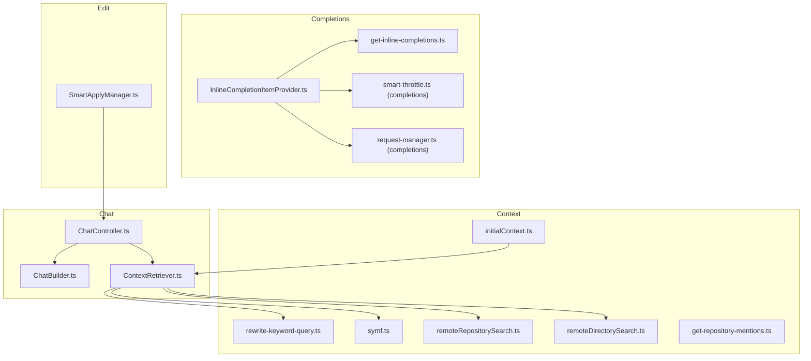
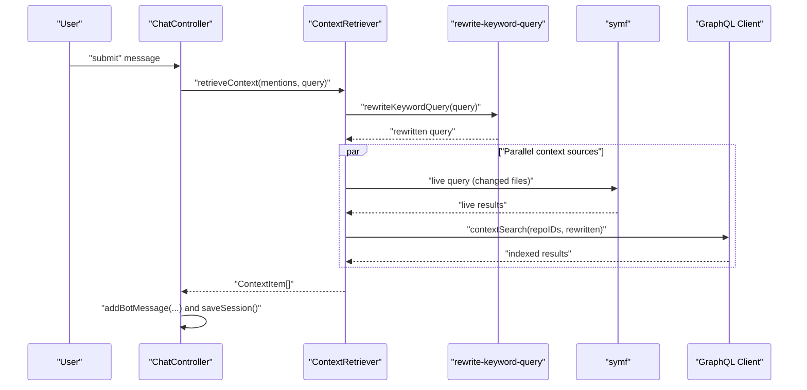
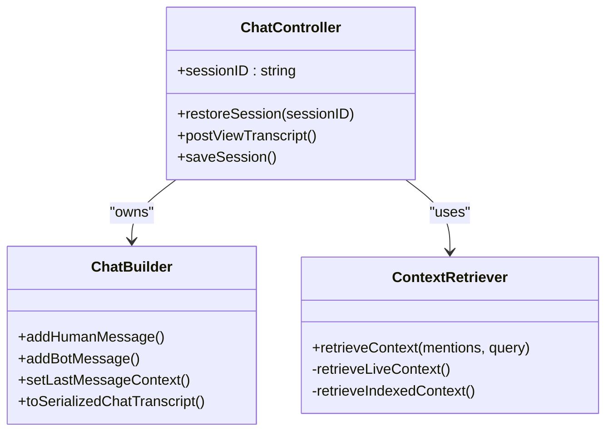
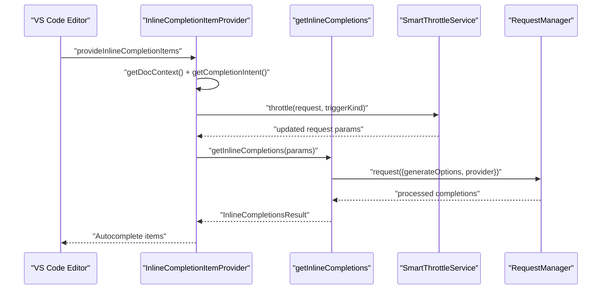
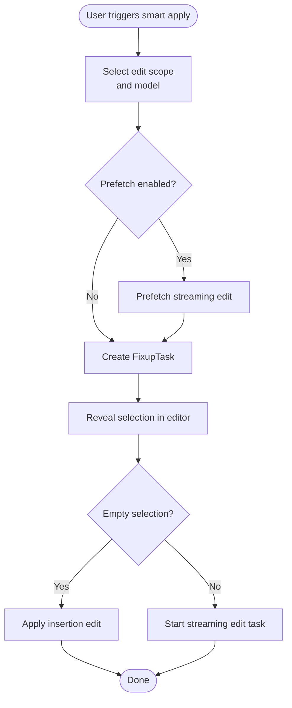
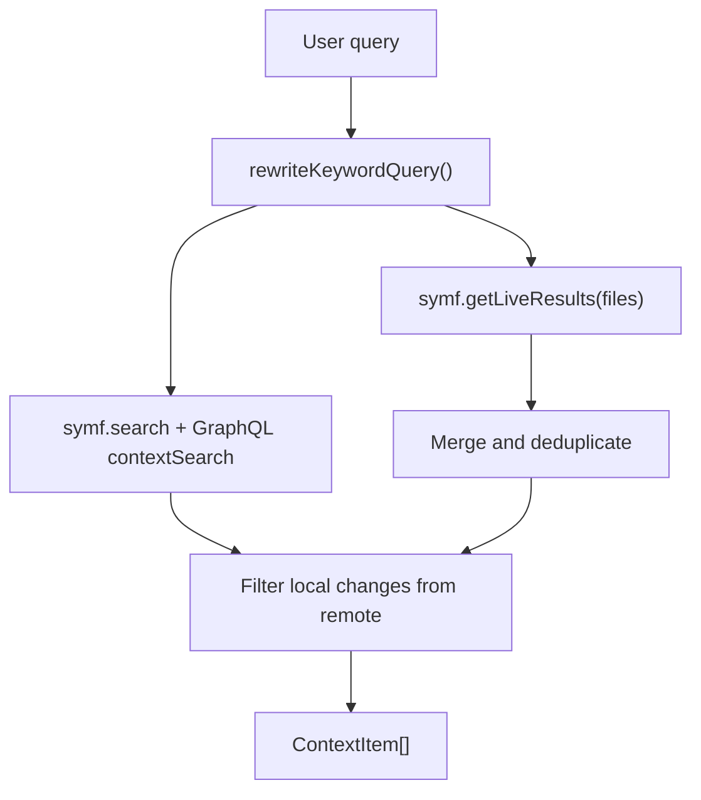
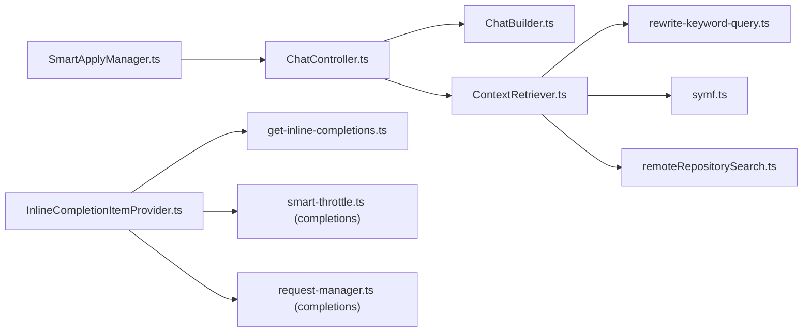

# Core Features

<cite>
**Referenced Files in This Document**
- [ChatController.ts](file://vscode/src/chat/chat-view/ChatController.ts)
- [ChatBuilder.ts](file://vscode/src/chat/chat-view/ChatBuilder.ts)
- [ContextRetriever.ts](file://vscode/src/chat/chat-view/ContextRetriever.ts)
- [rewrite-keyword-query.ts](file://vscode/src/local-context/rewrite-keyword-query.ts)
- [symf.ts](file://vscode/src/local-context/symf.ts)
- [InlineCompletionItemProvider.ts](file://vscode/src/completions/inline-completion-item-provider.ts)
- [get-inline-completions.ts](file://vscode/src/completions/get-inline-completions.ts)
- [smart-throttle.ts (completions)](file://vscode/src/completions/smart-throttle.ts)
- [request-manager.ts (completions)](file://vscode/src/completions/request-manager.ts)
- [SmartApplyManager.ts](file://vscode/src/edit/smart-apply-manager.ts)
- [remoteRepositorySearch.ts](file://vscode/src/context/openctx/remoteRepositorySearch.ts)
- [remoteDirectorySearch.ts](file://vscode/src/context/openctx/remoteDirectorySearch.ts)
- [get-repository-mentions.ts](file://vscode/src/context/openctx/common/get-repository-mentions.ts)
- [initialContext.ts](file://vscode/src/chat/initialContext.ts)
- [smart-throttle.ts (autoedits)](file://vscode/src/autoedits/smart-throttle.ts)
- [request-manager.ts (autoedits)](file://vscode/src/autoedits/request-manager.ts)
- [autoedits-provider.ts](file://vscode/src/autoedits/autoedits-provider.ts)
</cite>

## Table of Contents
1. [Introduction](#introduction)
2. [Project Structure](#project-structure)
3. [Core Components](#core-components)
4. [Architecture Overview](#architecture-overview)
5. [Detailed Component Analysis](#detailed-component-analysis)
6. [Dependency Analysis](#dependency-analysis)
7. [Performance Considerations](#performance-considerations)
8. [Troubleshooting Guide](#troubleshooting-guide)
9. [Conclusion](#conclusion)

## Introduction
This document explains Cody’s core AI-powered features with a focus on:
- The chat system: multi-modal conversation interface, context-aware responses, and session management
- Intelligent autocomplete: inline completion suggestions, language-specific optimizations, and performance throttling
- Automated code editing: refactoring, documentation generation, unit test creation, and smart apply
- Context retrieval: semantic search across local and remote codebases, including indexing and repository integration

It synthesizes the actual codebase to describe how each feature works, how they integrate, and how to configure and operate them effectively.

## Project Structure
Cody’s core features are implemented primarily in the VS Code extension under the vscode/ directory. The key areas are:
- Chat: chat UI orchestration, message building, context retrieval, and session persistence
- Completions: inline completion provider, request management, smart throttling, and analytics
- Edit: smart apply workflow, edit execution, and streaming edits
- Context: local symf indexing, remote GraphQL search, and OpenCtx integrations

**Diagram sources**
- [ChatController.ts:193-281](file://vscode/src/chat/chat-view/ChatController.ts#L193-L281)
- [ChatBuilder.ts:31-106](file://vscode/src/chat/chat-view/ChatBuilder.ts#L31-L106)
- [ContextRetriever.ts:171-181](file://vscode/src/chat/chat-view/ContextRetriever.ts#L171-L181)
- [rewrite-keyword-query.ts:19-32](file://vscode/src/local-context/rewrite-keyword-query.ts#L19-L32)
- [symf.ts:64-104](file://vscode/src/local-context/symf.ts#L64-L104)
- [InlineCompletionItemProvider.ts:97-124](file://vscode/src/completions/inline-completion-item-provider.ts#L97-L124)
- [get-inline-completions.ts:184-216](file://vscode/src/completions/get-inline-completions.ts#L184-L216)
- [smart-throttle.ts (completions):21-32](file://vscode/src/completions/smart-throttle.ts#L21-L32)
- [request-manager.ts (completions):152-176](file://vscode/src/completions/request-manager.ts#L152-L176)
- [SmartApplyManager.ts:40-56](file://vscode/src/edit/smart-apply-manager.ts#L40-L56)
- [remoteRepositorySearch.ts:12-58](file://vscode/src/context/openctx/remoteRepositorySearch.ts#L12-L58)
- [remoteDirectorySearch.ts:84-107](file://vscode/src/context/openctx/remoteDirectorySearch.ts#L84-L107)
- [get-repository-mentions.ts:35-65](file://vscode/src/context/openctx/common/get-repository-mentions.ts#L35-L65)
- [initialContext.ts:306-339](file://vscode/src/chat/initialContext.ts#L306-L339)

**Section sources**
- [ChatController.ts:1-120](file://vscode/src/chat/chat-view/ChatController.ts#L1-L120)
- [InlineCompletionItemProvider.ts:1-60](file://vscode/src/completions/inline-completion-item-provider.ts#L1-L60)
- [SmartApplyManager.ts:1-40](file://vscode/src/edit/smart-apply-manager.ts#L1-L40)

## Core Components
- ChatController: orchestrates chat UI events, builds transcripts, manages sessions, and coordinates context retrieval
- ChatBuilder: immutable chat model builder with serialization, intent tagging, and context attachment
- ContextRetriever: merges live and indexed context from local symf and remote GraphQL, with query rewriting and filtering
- InlineCompletionItemProvider: VS Code inline completion provider with request orchestration, throttling, caching, and analytics
- SmartApplyManager: end-to-end “smart apply” workflow for automated edits with selection, streaming, and telemetry
- Context providers: OpenCtx repository and directory search, plus repository mention discovery

**Section sources**
- [ChatController.ts:193-281](file://vscode/src/chat/chat-view/ChatController.ts#L193-L281)
- [ChatBuilder.ts:31-106](file://vscode/src/chat/chat-view/ChatBuilder.ts#L31-L106)
- [ContextRetriever.ts:171-181](file://vscode/src/chat/chat-view/ContextRetriever.ts#L171-L181)
- [InlineCompletionItemProvider.ts:97-124](file://vscode/src/completions/inline-completion-item-provider.ts#L97-L124)
- [SmartApplyManager.ts:40-56](file://vscode/src/edit/smart-apply-manager.ts#L40-L56)

## Architecture Overview
The chat pipeline integrates user input, context retrieval, and model responses. Autocomplete and smart apply operate as complementary productivity features.

**Diagram sources**
- [ChatController.ts:287-322](file://vscode/src/chat/chat-view/ChatController.ts#L287-L322)
- [ContextRetriever.ts:182-254](file://vscode/src/chat/chat-view/ContextRetriever.ts#L182-L254)
- [rewrite-keyword-query.ts:19-32](file://vscode/src/local-context/rewrite-keyword-query.ts#L19-L32)
- [symf.ts:130-168](file://vscode/src/local-context/symf.ts#L130-L168)
- [remoteRepositorySearch.ts:30-54](file://vscode/src/context/openctx/remoteRepositorySearch.ts#L30-L54)

## Detailed Component Analysis

### Chat System: Multi-modal Conversation, Context-Aware Responses, Session Management
- Multi-modal conversation: messages support text parts and can carry structured context (files, symbols, repositories)
- Context-aware responses: ContextRetriever augments prompts with live and indexed context, with query rewriting and filtering
- Session management: ChatBuilder persists transcripts, supports restoring sessions, and updates UI state

**Diagram sources**
- [ChatController.ts:1600-1625](file://vscode/src/chat/chat-view/ChatController.ts#L1600-L1625)
- [ChatBuilder.ts:168-236](file://vscode/src/chat/chat-view/ChatBuilder.ts#L168-L236)
- [ContextRetriever.ts:182-254](file://vscode/src/chat/chat-view/ContextRetriever.ts#L182-L254)

Practical examples and workflows:
- Submitting a message triggers context retrieval and appends a bot reply
- Restoring a session reloads a prior transcript and resumes the UI
- Initial context includes repository mentions and guidance for indexing

**Section sources**
- [ChatController.ts:287-404](file://vscode/src/chat/chat-view/ChatController.ts#L287-L404)
- [ChatBuilder.ts:168-236](file://vscode/src/chat/chat-view/ChatBuilder.ts#L168-L236)
- [initialContext.ts:306-339](file://vscode/src/chat/initialContext.ts#L306-L339)

### Intelligent Autocomplete Engine: Inline Completions, Language-Specific Optimizations, Throttling
- Inline completion provider: integrates with VS Code, computes document context, and decides trigger kinds
- Request orchestration: context mixing, debouncing, smart throttling, and caching
- Language-specific optimizations: intent detection, suggest widget handling, and device inference hints

**Diagram sources**
- [InlineCompletionItemProvider.ts:317-475](file://vscode/src/completions/inline-completion-item-provider.ts#L317-L475)
- [get-inline-completions.ts:184-216](file://vscode/src/completions/get-inline-completions.ts#L184-L216)
- [smart-throttle.ts (completions):33-86](file://vscode/src/completions/smart-throttle.ts#L33-L86)
- [request-manager.ts (completions):152-176](file://vscode/src/completions/request-manager.ts#L152-L176)

Configuration highlights:
- Trigger delay and debounce intervals tune responsiveness
- Smart throttle balances concurrency and staleness
- Device inference affects provider behavior and debounce timing

**Section sources**
- [InlineCompletionItemProvider.ts:419-441](file://vscode/src/completions/inline-completion-item-provider.ts#L419-L441)
- [get-inline-completions.ts:418-458](file://vscode/src/completions/get-inline-completions.ts#L418-L458)
- [smart-throttle.ts (completions):21-32](file://vscode/src/completions/smart-throttle.ts#L21-L32)
- [request-manager.ts (completions):152-176](file://vscode/src/completions/request-manager.ts#L152-L176)

### Automated Code Editing: Refactoring, Documentation, Unit Tests, Smart Apply
- Smart apply: end-to-end workflow to select edit scope, stream edits, and apply with telemetry
- Edit execution: streaming provider, guardrails, and duplicate task avoidance
- Auto-edit throttling: manages frequency and prevents redundant processing

**Diagram sources**
- [SmartApplyManager.ts:256-336](file://vscode/src/edit/smart-apply-manager.ts#L256-L336)
- [SmartApplyManager.ts:358-437](file://vscode/src/edit/smart-apply-manager.ts#L358-L437)

Common workflows:
- Refactor code by selecting a region and letting the model propose changes
- Generate documentation or unit tests and apply the result directly
- Use smart apply to insert new code at the end of a file or at a specific range

**Section sources**
- [SmartApplyManager.ts:48-315](file://vscode/src/edit/smart-apply-manager.ts#L48-L315)
- [smart-throttle.ts (autoedits):79-112](file://vscode/src/autoedits/smart-throttle.ts#L79-L112)
- [request-manager.ts (autoedits):52-103](file://vscode/src/autoedits/request-manager.ts#L52-L103)

### Context Retrieval: Semantic Search Across Local and Remote Codebases
- Live context: symf live query on changed files
- Indexed context: symf index per workspace root and remote GraphQL context search
- Query rewriting: improves keyword search precision
- Repository integration: OpenCtx repository and directory providers, plus repository mentions

**Diagram sources**
- [ContextRetriever.ts:199-254](file://vscode/src/chat/chat-view/ContextRetriever.ts#L199-L254)
- [rewrite-keyword-query.ts:19-32](file://vscode/src/local-context/rewrite-keyword-query.ts#L19-L32)
- [symf.ts:130-168](file://vscode/src/local-context/symf.ts#L130-L168)
- [remoteRepositorySearch.ts:30-54](file://vscode/src/context/openctx/remoteRepositorySearch.ts#L30-L54)

Integration patterns:
- Repository mentions: fuzzy search and ranking of repositories for quick linking
- Directory search: scoped file search within a repository path
- Initial context: contextual suggestions for current codebase and indexing guidance

**Section sources**
- [ContextRetriever.ts:301-369](file://vscode/src/chat/chat-view/ContextRetriever.ts#L301-L369)
- [get-repository-mentions.ts:35-65](file://vscode/src/context/openctx/common/get-repository-mentions.ts#L35-L65)
- [remoteDirectorySearch.ts:84-107](file://vscode/src/context/openctx/remoteDirectorySearch.ts#L84-L107)
- [initialContext.ts:306-339](file://vscode/src/chat/initialContext.ts#L306-L339)

## Dependency Analysis
Key dependencies and coupling:
- ChatController depends on ChatBuilder for model state and ContextRetriever for context augmentation
- InlineCompletionItemProvider depends on get-inline-completions, smart throttle, and request manager
- SmartApplyManager coordinates with edit execution and telemetry
- ContextRetriever depends on symf for local indexing and GraphQL for remote search

**Diagram sources**
- [ChatController.ts:193-281](file://vscode/src/chat/chat-view/ChatController.ts#L193-L281)
- [ContextRetriever.ts:171-181](file://vscode/src/chat/chat-view/ContextRetriever.ts#L171-L181)
- [InlineCompletionItemProvider.ts:97-124](file://vscode/src/completions/inline-completion-item-provider.ts#L97-L124)
- [get-inline-completions.ts:184-216](file://vscode/src/completions/get-inline-completions.ts#L184-L216)
- [smart-throttle.ts (completions):21-32](file://vscode/src/completions/smart-throttle.ts#L21-L32)
- [request-manager.ts (completions):152-176](file://vscode/src/completions/request-manager.ts#L152-L176)
- [SmartApplyManager.ts:40-56](file://vscode/src/edit/smart-apply-manager.ts#L40-L56)

**Section sources**
- [ChatController.ts:193-281](file://vscode/src/chat/chat-view/ChatController.ts#L193-L281)
- [InlineCompletionItemProvider.ts:97-124](file://vscode/src/completions/inline-completion-item-provider.ts#L97-L124)
- [SmartApplyManager.ts:40-56](file://vscode/src/edit/smart-apply-manager.ts#L40-L56)

## Performance Considerations
- Smart throttling: limits concurrent requests and promotes tail requests after a timeout to balance responsiveness and throughput
- Debounce and trigger delays: reduce unnecessary network calls and improve perceived smoothness
- Caching: request manager caches completions and recycles partial results for nearby requests
- Parallelization: live and indexed context retrieval run concurrently
- Index freshness: symf reindexes when corpus diff indicates changes, trading accuracy for latency

[No sources needed since this section provides general guidance]

## Troubleshooting Guide
Common issues and diagnostics:
- Autocomplete disabled or slow: verify client config and rate limit status; check status bar indicators
- Context not found: ensure symf is available and indexes exist; confirm repository mentions and permissions
- Session restore fails: verify auth status and that the requested session exists in history
- Smart apply not working: check edit capability and guardrails; confirm selection scope and streaming availability

Operational tips:
- Inspect output channels for detailed logs
- Use telemetry and stage timers to identify bottlenecks
- Validate repository indexing and mention discovery

**Section sources**
- [InlineCompletionItemProvider.ts:357-363](file://vscode/src/completions/inline-completion-item-provider.ts#L357-L363)
- [ContextRetriever.ts:265-268](file://vscode/src/chat/chat-view/ContextRetriever.ts#L265-L268)
- [ChatController.ts:1610-1625](file://vscode/src/chat/chat-view/ChatController.ts#L1610-L1625)
- [SmartApplyManager.ts:270-272](file://vscode/src/edit/smart-apply-manager.ts#L270-L272)

## Conclusion
Cody’s core features combine a robust chat system with intelligent autocomplete and automated editing. Context retrieval leverages both local symf indexing and remote GraphQL search, while smart throttling and caching ensure responsive performance. The architecture cleanly separates concerns across chat orchestration, completion orchestration, edit execution, and context providers, enabling extensible enhancements and reliable user experiences.