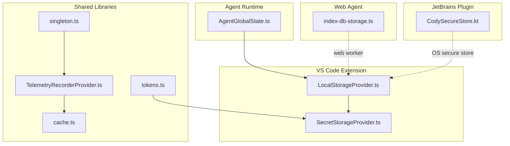
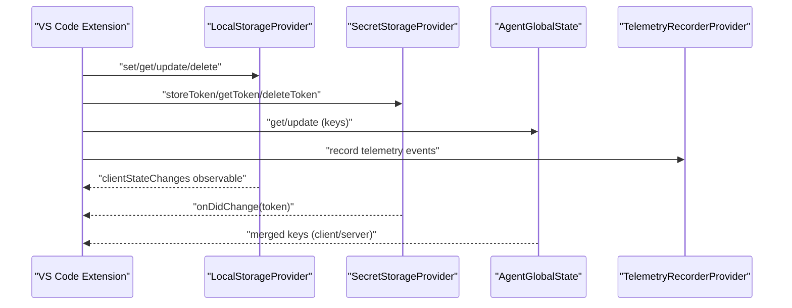
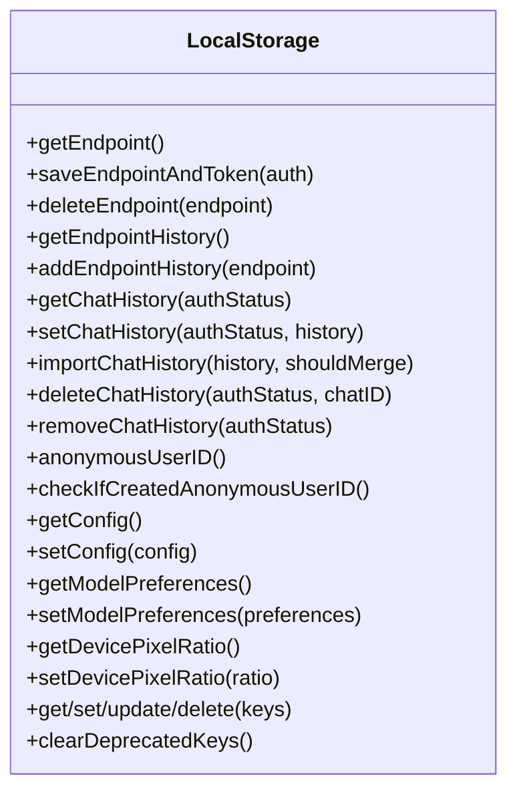
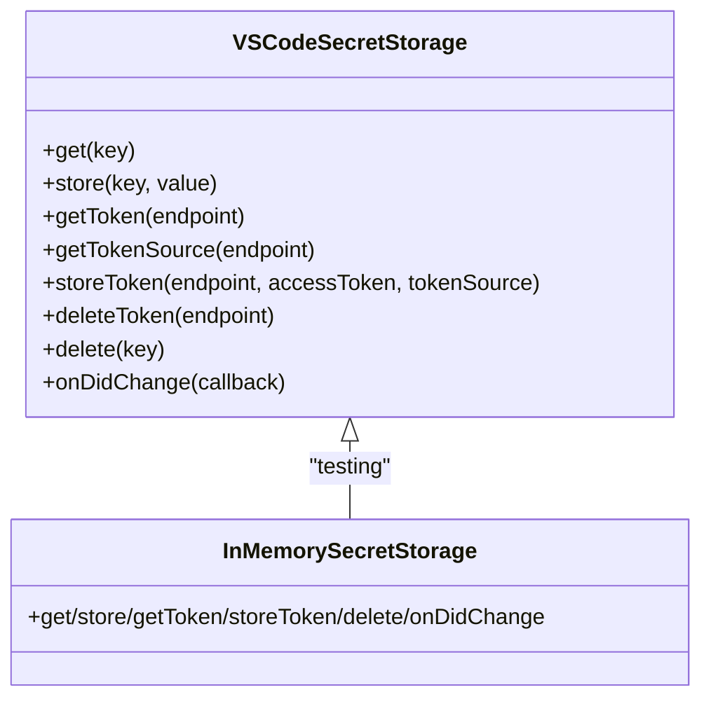
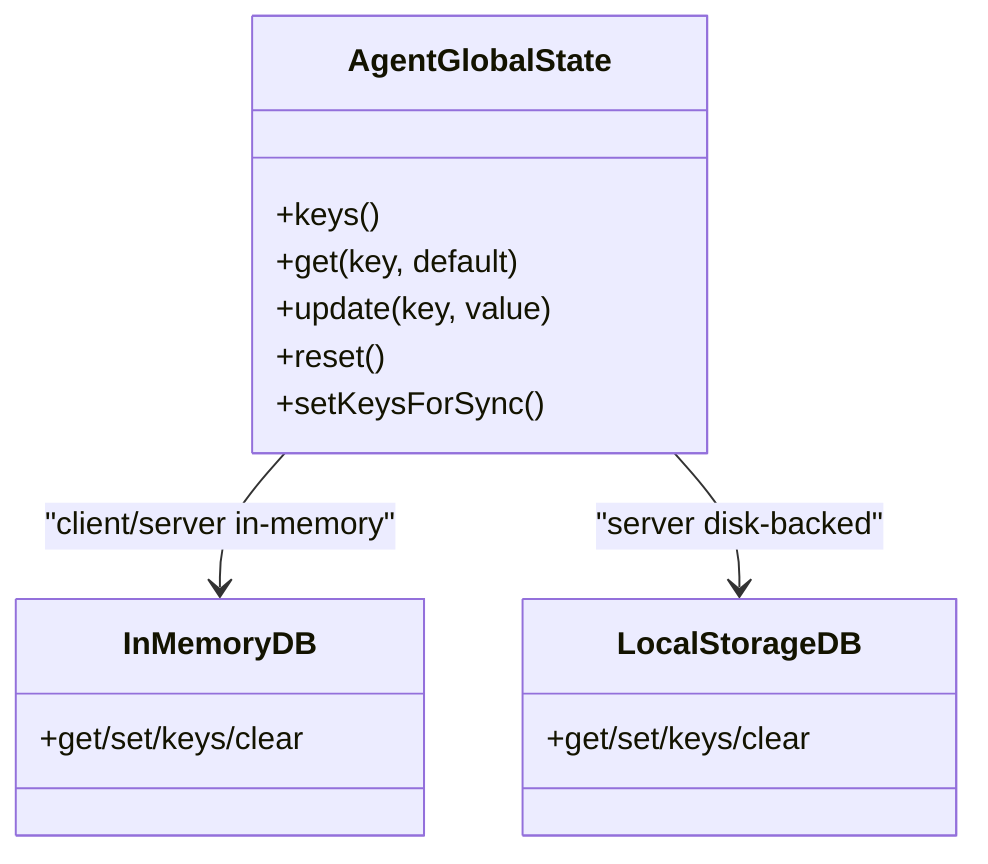
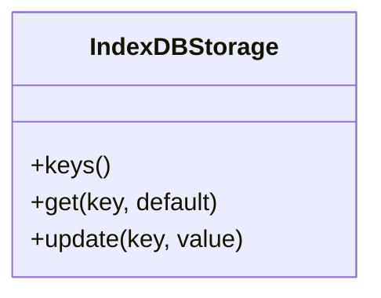
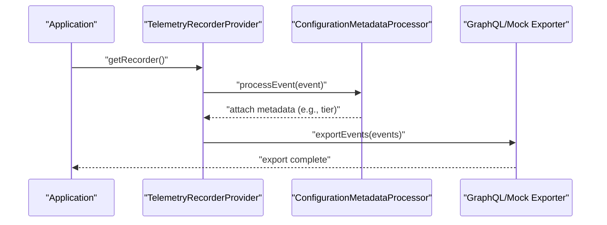
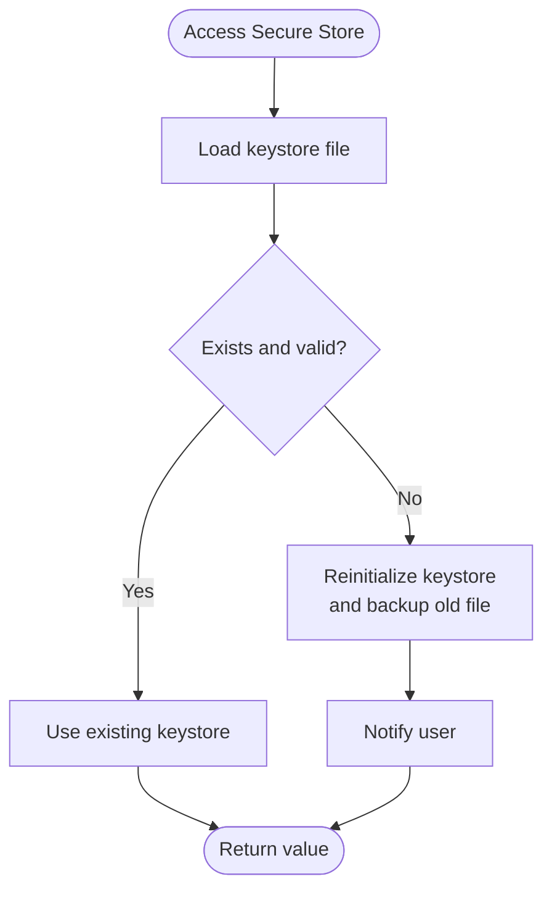
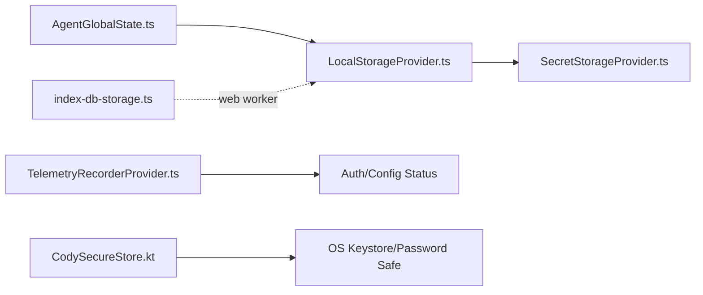

# Data Management

<cite>
**Referenced Files in This Document**
- [LocalStorageProvider.ts](file://vscode/src/services/LocalStorageProvider.ts)
- [SecretStorageProvider.ts](file://vscode/src/services/SecretStorageProvider.ts)
- [AgentGlobalState.ts](file://agent/src/global-state/AgentGlobalState.ts)
- [index-db-storage.ts](file://web/lib/agent/index-db-storage.ts)
- [TelemetryRecorderProvider.ts](file://lib/shared/src/telemetry-v2/TelemetryRecorderProvider.ts)
- [singleton.ts](file://lib/shared/src/telemetry-v2/singleton.ts)
- [CodySecureStore.kt](file://jetbrains/src/main/kotlin/com/sourcegraph/cody/auth/CodySecureStore.kt)
- [tokens.ts](file://lib/shared/src/auth/tokens.ts)
- [cache.ts](file://lib/shared/src/sourcegraph-api/graphql/cache.ts)
- [SessionStatsPage.tsx](file://vscode/webviews/autoedit-debug/session-stats/SessionStatsPage.tsx)
</cite>

## Table of Contents
1. [Introduction](#introduction)
2. [Project Structure](#project-structure)
3. [Core Components](#core-components)
4. [Architecture Overview](#architecture-overview)
5. [Detailed Component Analysis](#detailed-component-analysis)
6. [Dependency Analysis](#dependency-analysis)
7. [Performance Considerations](#performance-considerations)
8. [Troubleshooting Guide](#troubleshooting-guide)
9. [Conclusion](#conclusion)
10. [Appendices](#appendices)

## Introduction
This document explains Cody’s data management systems across local storage, secret storage, telemetry/analytics, state synchronization, and data lifecycle management. It covers how persistent data is stored, how secrets are handled securely, how telemetry is collected and processed, and how data is synchronized across components and platforms. It also includes guidance on performance, privacy, and compliance considerations, along with practical examples of programmatic access patterns.

## Project Structure
Cody’s data management spans multiple packages and platforms:
- VS Code extension: local and secret storage, telemetry, and chat history persistence
- Agent runtime: global state abstraction with in-memory and disk-backed storage
- Web agent: IndexedDB-backed storage for web workers
- JetBrains plugin: OS-level secure store integration
- Shared libraries: telemetry provider, GraphQL caching, and token utilities

**Diagram sources**
- [LocalStorageProvider.ts:27-385](file://vscode/src/services/LocalStorageProvider.ts#L27-L385)
- [SecretStorageProvider.ts:26-133](file://vscode/src/services/SecretStorageProvider.ts#L26-L133)
- [AgentGlobalState.ts:12-86](file://agent/src/global-state/AgentGlobalState.ts#L12-L86)
- [index-db-storage.ts:9-77](file://web/lib/agent/index-db-storage.ts#L9-L77)
- [TelemetryRecorderProvider.ts:61-100](file://lib/shared/src/telemetry-v2/TelemetryRecorderProvider.ts#L61-L100)
- [singleton.ts:34-54](file://lib/shared/src/telemetry-v2/singleton.ts#L34-L54)
- [cache.ts:73-107](file://lib/shared/src/sourcegraph-api/graphql/cache.ts#L73-L107)
- [tokens.ts:1-25](file://lib/shared/src/auth/tokens.ts#L1-L25)

**Section sources**
- [LocalStorageProvider.ts:1-432](file://vscode/src/services/LocalStorageProvider.ts#L1-L432)
- [SecretStorageProvider.ts:1-256](file://vscode/src/services/SecretStorageProvider.ts#L1-L256)
- [AgentGlobalState.ts:1-150](file://agent/src/global-state/AgentGlobalState.ts#L1-L150)
- [index-db-storage.ts:1-78](file://web/lib/agent/index-db-storage.ts#L1-L78)
- [TelemetryRecorderProvider.ts:1-208](file://lib/shared/src/telemetry-v2/TelemetryRecorderProvider.ts#L1-L208)
- [singleton.ts:34-54](file://lib/shared/src/telemetry-v2/singleton.ts#L34-L54)
- [cache.ts:73-107](file://lib/shared/src/sourcegraph-api/graphql/cache.ts#L73-L107)
- [tokens.ts:1-25](file://lib/shared/src/auth/tokens.ts#L1-L25)

## Core Components
- Local storage (VS Code): persistent key-value storage for configuration, chat history, endpoint history, model preferences, and device pixel ratio. Supports ephemeral and no-op modes for testing.
- Secret storage (VS Code): secure token storage with optional fallback to a local file path. Provides token source tracking and change notifications.
- Agent global state: unified Memento-like interface for client/server contexts, supporting in-memory and disk-backed stores with migration support.
- Web agent storage: IndexedDB-backed Memento for web workers, with in-memory hydration for synchronous APIs.
- Telemetry provider: centralized telemetry recorder with metadata processors, exporters, and buffering configuration.
- Secure storage (JetBrains): OS-level keystore-backed secure store with password protection and reinitialization on corruption.
- Token utilities: token normalization and hashing helpers for interoperability.

**Section sources**
- [LocalStorageProvider.ts:27-385](file://vscode/src/services/LocalStorageProvider.ts#L27-L385)
- [SecretStorageProvider.ts:26-133](file://vscode/src/services/SecretStorageProvider.ts#L26-L133)
- [AgentGlobalState.ts:12-86](file://agent/src/global-state/AgentGlobalState.ts#L12-L86)
- [index-db-storage.ts:9-77](file://web/lib/agent/index-db-storage.ts#L9-L77)
- [TelemetryRecorderProvider.ts:61-100](file://lib/shared/src/telemetry-v2/TelemetryRecorderProvider.ts#L61-L100)
- [CodySecureStore.kt:28-89](file://jetbrains/src/main/kotlin/com/sourcegraph/cody/auth/CodySecureStore.kt#L28-L89)
- [tokens.ts:1-25](file://lib/shared/src/auth/tokens.ts#L1-L25)

## Architecture Overview
Cody’s data architecture separates concerns across persistence, security, telemetry, and synchronization:
- Persistence: VS Code Memento, Agent Memento, and IndexedDB for web workers
- Security: VS Code SecretStorage, OS keystore for JetBrains, and token utilities
- Telemetry: Provider with processors and exporters, plus global singleton updates
- Synchronization: AgentGlobalState bridges client/server views and exposes selected keys

**Diagram sources**
- [LocalStorageProvider.ts:84-90](file://vscode/src/services/LocalStorageProvider.ts#L84-L90)
- [SecretStorageProvider.ts:124-132](file://vscode/src/services/SecretStorageProvider.ts#L124-L132)
- [AgentGlobalState.ts:54-76](file://agent/src/global-state/AgentGlobalState.ts#L54-L76)
- [TelemetryRecorderProvider.ts:61-100](file://lib/shared/src/telemetry-v2/TelemetryRecorderProvider.ts#L61-L100)

## Detailed Component Analysis

### Local Storage (VS Code)
- Responsibilities: persist configuration, chat history per account, endpoint history, model preferences, anonymous user ID, and device pixel ratio.
- Keys and semantics:
  - Endpoint history and last used endpoint with token filtering
  - Anonymous user ID generation and detection of newly created IDs
  - Model preferences keyed by endpoint
  - Chat history stored under an account-scoped key
- Change propagation: emits observable client state changes and supports batched updates.
- Cleanup: supports deleting individual chat entries, clearing histories, and resetting all storage.

**Diagram sources**
- [LocalStorageProvider.ts:27-385](file://vscode/src/services/LocalStorageProvider.ts#L27-L385)

**Section sources**
- [LocalStorageProvider.ts:27-385](file://vscode/src/services/LocalStorageProvider.ts#L27-L385)

### Secret Storage (VS Code)
- Responsibilities: secure token storage with optional local file fallback, token source tracking, and change notifications.
- Key behaviors:
  - Store and retrieve tokens per endpoint
  - Optional local token path configuration
  - Event subscription for token changes
  - Delete tokens and sources

**Diagram sources**
- [SecretStorageProvider.ts:26-133](file://vscode/src/services/SecretStorageProvider.ts#L26-L133)
- [SecretStorageProvider.ts:135-223](file://vscode/src/services/SecretStorageProvider.ts#L135-L223)

**Section sources**
- [SecretStorageProvider.ts:26-133](file://vscode/src/services/SecretStorageProvider.ts#L26-L133)
- [SecretStorageProvider.ts:135-223](file://vscode/src/services/SecretStorageProvider.ts#L135-L223)

### Agent Global State
- Responsibilities: unify storage across client and server contexts, support in-memory and disk-backed stores, and expose selected keys for synchronization.
- Key behaviors:
  - Initialize with IDE and directory; migrate on disk-backed initialization
  - Merge keys from server and client contexts
  - Reset clears storage and triggers change in local storage

**Diagram sources**
- [AgentGlobalState.ts:12-86](file://agent/src/global-state/AgentGlobalState.ts#L12-L86)
- [AgentGlobalState.ts:95-149](file://agent/src/global-state/AgentGlobalState.ts#L95-L149)

**Section sources**
- [AgentGlobalState.ts:12-86](file://agent/src/global-state/AgentGlobalState.ts#L12-L86)
- [AgentGlobalState.ts:115-149](file://agent/src/global-state/AgentGlobalState.ts#L115-L149)

### Web Agent Storage (IndexedDB)
- Responsibilities: provide a Memento-compatible interface backed by IndexedDB for web workers.
- Key behaviors:
  - Initialize DB and hydrate in-memory map on creation
  - Synchronous get API backed by async IndexedDB writes
  - Update persists to IndexedDB and mirrors in-memory state

**Diagram sources**
- [index-db-storage.ts:9-77](file://web/lib/agent/index-db-storage.ts#L9-L77)

**Section sources**
- [index-db-storage.ts:9-77](file://web/lib/agent/index-db-storage.ts#L9-L77)

### Telemetry and Analytics
- Responsibilities: record telemetry events, attach metadata, and export to configured targets.
- Key behaviors:
  - Provider with timestamp processor and configuration metadata processor
  - Exporters for production and testing/mocking
  - Global singleton update for telemetry recorder providers

**Diagram sources**
- [TelemetryRecorderProvider.ts:61-100](file://lib/shared/src/telemetry-v2/TelemetryRecorderProvider.ts#L61-L100)
- [TelemetryRecorderProvider.ts:186-207](file://lib/shared/src/telemetry-v2/TelemetryRecorderProvider.ts#L186-L207)
- [singleton.ts:34-54](file://lib/shared/src/telemetry-v2/singleton.ts#L34-L54)

**Section sources**
- [TelemetryRecorderProvider.ts:61-100](file://lib/shared/src/telemetry-v2/TelemetryRecorderProvider.ts#L61-L100)
- [TelemetryRecorderProvider.ts:186-207](file://lib/shared/src/telemetry-v2/TelemetryRecorderProvider.ts#L186-L207)
- [singleton.ts:34-54](file://lib/shared/src/telemetry-v2/singleton.ts#L34-L54)

### Secure Storage (JetBrains)
- Responsibilities: OS-level secure storage using keystores with password protection and reinitialization on corruption.
- Key behaviors:
  - Read/write/delete from secure store
  - Generate and persist keystore password in OS password store
  - Reinitialize keystore and notify user on corruption

**Diagram sources**
- [CodySecureStore.kt:135-149](file://jetbrains/src/main/kotlin/com/sourcegraph/cody/auth/CodySecureStore.kt#L135-L149)
- [CodySecureStore.kt:110-133](file://jetbrains/src/main/kotlin/com/sourcegraph/cody/auth/CodySecureStore.kt#L110-L133)

**Section sources**
- [CodySecureStore.kt:28-89](file://jetbrains/src/main/kotlin/com/sourcegraph/cody/auth/CodySecureStore.kt#L28-L89)
- [CodySecureStore.kt:110-149](file://jetbrains/src/main/kotlin/com/sourcegraph/cody/auth/CodySecureStore.kt#L110-L149)

### Token Utilities
- Responsibilities: normalize and hash tokens for interoperability.
- Key behaviors:
  - Convert dotcom tokens to gateway tokens via hashing

**Section sources**
- [tokens.ts:1-25](file://lib/shared/src/auth/tokens.ts#L1-L25)

### GraphQL Result Cache
- Responsibilities: invalidate caches in response to observable events.
- Key behaviors:
  - Factory subscribes to an observable and invalidates created caches
  - Dispose unsubscribes and clears caches

**Section sources**
- [cache.ts:73-107](file://lib/shared/src/sourcegraph-api/graphql/cache.ts#L73-L107)

### Session Metrics and Cache Hit Rates
- Responsibilities: visualize latency percentiles and cache hit rates for auto-edit sessions.
- Key behaviors:
  - Compute and display cache hit rate bars and indicators
  - Show percentile metrics and help text for interpretation

**Section sources**
- [SessionStatsPage.tsx:97-121](file://vscode/webviews/autoedit-debug/session-stats/SessionStatsPage.tsx#L97-L121)
- [SessionStatsPage.tsx:274-336](file://vscode/webviews/autoedit-debug/session-stats/SessionStatsPage.tsx#L274-L336)
- [SessionStatsPage.tsx:352-370](file://vscode/webviews/autoedit-debug/session-stats/SessionStatsPage.tsx#L352-L370)

## Dependency Analysis
- Local storage depends on VS Code Memento and emits observable state changes for downstream consumers.
- Secret storage integrates with VS Code SecretStorage and optionally falls back to a local file path.
- Agent global state depends on local storage for client-side keys and on disk-backed storage for server-side keys.
- Telemetry provider depends on configuration and auth status to enrich events with metadata.
- JetBrains secure store depends on OS password safe and keystore facilities.

**Diagram sources**
- [LocalStorageProvider.ts:27-385](file://vscode/src/services/LocalStorageProvider.ts#L27-L385)
- [SecretStorageProvider.ts:26-133](file://vscode/src/services/SecretStorageProvider.ts#L26-L133)
- [AgentGlobalState.ts:12-86](file://agent/src/global-state/AgentGlobalState.ts#L12-L86)
- [index-db-storage.ts:9-77](file://web/lib/agent/index-db-storage.ts#L9-L77)
- [TelemetryRecorderProvider.ts:61-100](file://lib/shared/src/telemetry-v2/TelemetryRecorderProvider.ts#L61-L100)
- [CodySecureStore.kt:28-89](file://jetbrains/src/main/kotlin/com/sourcegraph/cody/auth/CodySecureStore.kt#L28-L89)

**Section sources**
- [LocalStorageProvider.ts:27-385](file://vscode/src/services/LocalStorageProvider.ts#L27-L385)
- [SecretStorageProvider.ts:26-133](file://vscode/src/services/SecretStorageProvider.ts#L26-L133)
- [AgentGlobalState.ts:12-86](file://agent/src/global-state/AgentGlobalState.ts#L12-L86)
- [index-db-storage.ts:9-77](file://web/lib/agent/index-db-storage.ts#L9-L77)
- [TelemetryRecorderProvider.ts:61-100](file://lib/shared/src/telemetry-v2/TelemetryRecorderProvider.ts#L61-L100)
- [CodySecureStore.kt:28-89](file://jetbrains/src/main/kotlin/com/sourcegraph/cody/auth/CodySecureStore.kt#L28-L89)

## Performance Considerations
- Local storage operations are synchronous via Memento; batching updates reduces overhead.
- IndexedDB-backed storage for web agents synchronizes via in-memory hydration to satisfy synchronous APIs.
- Telemetry buffering is disabled by default to minimize event latency in tests and interactive scenarios.
- Cache invalidation via observable ensures stale data is evicted promptly.
- Device pixel ratio and model preferences reduce repeated computations and improve rendering performance.

[No sources needed since this section provides general guidance]

## Troubleshooting Guide
- Local storage not initialized: ensure storage is set via the singleton setter during extension activation.
- Secret storage fallback: if local token path is configured, tokens are read from the specified file; verify file permissions and JSON structure.
- Agent reset: resetting global state triggers a change in local storage; confirm observers react accordingly.
- Telemetry export: in testing environments, use the testing exporter and inspect exported events via the delegate exporter.
- JetBrains secure store corruption: on keystore errors, the store is reinitialized and a backup is created; verify the backup and restore as needed.

**Section sources**
- [LocalStorageProvider.ts:63-72](file://vscode/src/services/LocalStorageProvider.ts#L63-L72)
- [SecretStorageProvider.ts:48-57](file://vscode/src/services/SecretStorageProvider.ts#L48-L57)
- [AgentGlobalState.ts:47-52](file://agent/src/global-state/AgentGlobalState.ts#L47-L52)
- [TelemetryRecorderProvider.ts:86-98](file://lib/shared/src/telemetry-v2/TelemetryRecorderProvider.ts#L86-L98)
- [CodySecureStore.kt:110-133](file://jetbrains/src/main/kotlin/com/sourcegraph/cody/auth/CodySecureStore.kt#L110-L133)

## Conclusion
Cody’s data management system balances persistence, security, observability, and cross-platform compatibility. Local and secret storage provide robust, testable abstractions; the agent global state enables seamless synchronization across contexts; telemetry offers rich insights with configurable exporters; and secure storage leverages OS capabilities for sensitive data. Together, these components form a cohesive foundation for reliable, privacy-conscious operation across VS Code, JetBrains, and web environments.

[No sources needed since this section summarizes without analyzing specific files]

## Appendices

### Data Lifecycle Management
- Retention and cleanup:
  - Chat history per account can be removed individually or cleared entirely.
  - Endpoint history maintains a set of recent endpoints; outdated entries are filtered by time-based logic.
  - Deprecated keys are periodically cleared to maintain clean storage.
- Export/import:
  - Chat history supports merging and replacement during import operations.

**Section sources**
- [LocalStorageProvider.ts:215-229](file://vscode/src/services/LocalStorageProvider.ts#L215-L229)
- [LocalStorageProvider.ts:261-268](file://vscode/src/services/LocalStorageProvider.ts#L261-L268)
- [LocalStorageProvider.ts:374-384](file://vscode/src/services/LocalStorageProvider.ts#L374-L384)

### Data Access Patterns and Examples
- Programmatic access to local storage:
  - Retrieve client state and subscribe to changes
  - Save endpoint and token atomically
  - Import/export chat history with merge option
- Programmatic access to secret storage:
  - Store and retrieve tokens per endpoint
  - Subscribe to token change events
- Programmatic access to agent global state:
  - Read merged keys from client/server contexts
  - Reset storage and trigger change events

**Section sources**
- [LocalStorageProvider.ts:74-90](file://vscode/src/services/LocalStorageProvider.ts#L74-L90)
- [LocalStorageProvider.ts:108-132](file://vscode/src/services/LocalStorageProvider.ts#L108-L132)
- [LocalStorageProvider.ts:215-229](file://vscode/src/services/LocalStorageProvider.ts#L215-L229)
- [SecretStorageProvider.ts:97-112](file://vscode/src/services/SecretStorageProvider.ts#L97-L112)
- [SecretStorageProvider.ts:124-132](file://vscode/src/services/SecretStorageProvider.ts#L124-L132)
- [AgentGlobalState.ts:54-76](file://agent/src/global-state/AgentGlobalState.ts#L54-L76)
- [AgentGlobalState.ts:47-52](file://agent/src/global-state/AgentGlobalState.ts#L47-L52)

### Privacy and Compliance Considerations
- Telemetry metadata enrichment is gated by auth status; tier metadata is attached only when available.
- Tokens are stored in secure storage; optional local file fallback requires careful configuration and auditing.
- Anonymous user IDs are generated locally and not transmitted unless telemetry is enabled.

**Section sources**
- [TelemetryRecorderProvider.ts:186-207](file://lib/shared/src/telemetry-v2/TelemetryRecorderProvider.ts#L186-L207)
- [SecretStorageProvider.ts:48-57](file://vscode/src/services/SecretStorageProvider.ts#L48-L57)
- [LocalStorageProvider.ts:303-320](file://vscode/src/services/LocalStorageProvider.ts#L303-L320)