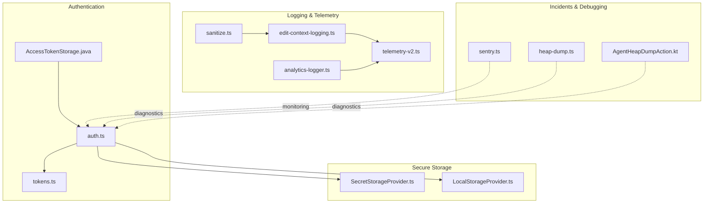
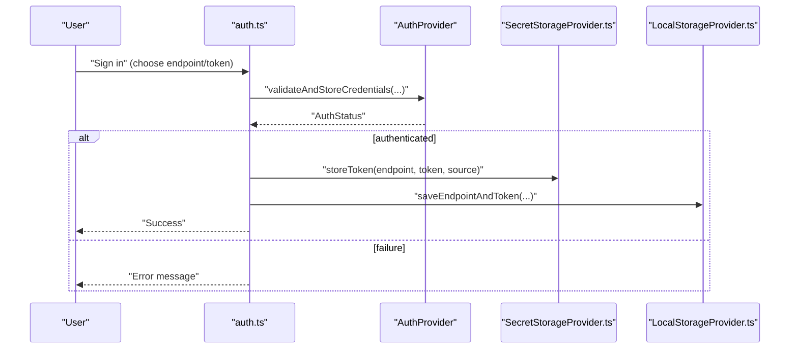
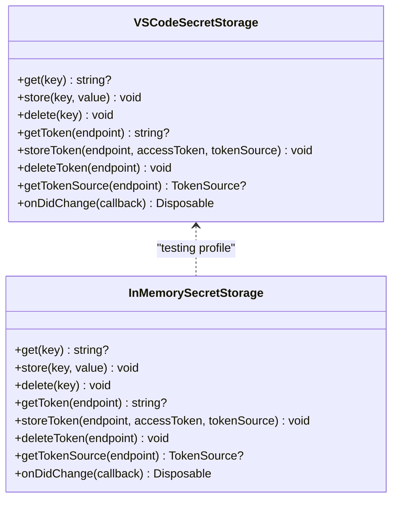
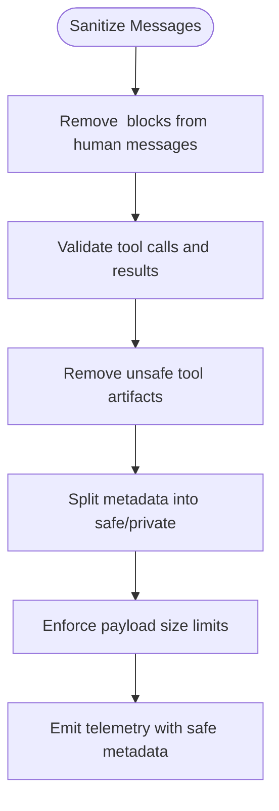
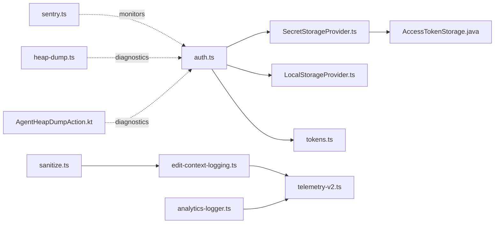

# Data Security & Lifecycle

<cite>
**Referenced Files in This Document**
- [SecretStorageProvider.ts](file://vscode/src/services/SecretStorageProvider.ts)
- [auth.ts](file://vscode/src/auth/auth.ts)
- [LocalStorageProvider.ts](file://vscode/src/services/LocalStorageProvider.ts)
- [telemetry-v2.ts](file://vscode/src/services/telemetry-v2.ts)
- [sanitize.ts](file://vscode/src/prompt-builder/sanitize.ts)
- [edit-context-logging.ts](file://vscode/src/edit/edit-context-logging.ts)
- [analytics-logger.ts](file://vscode/src/completions/analytics-logger.ts)
- [types.ts](file://vscode/src/common/persistence-tracker/types.ts)
- [heap-dump.ts](file://vscode/src/services/utils/heap-dump.ts)
- [AgentHeapDumpAction.kt](file://jetbrains/src/main/kotlin/com/sourcegraph/cody/debugging/AgentHeapDumpAction.kt)
- [AccessTokenStorage.java](file://jetbrains/src/main/java/com/sourcegraph/config/AccessTokenStorage.java)
- [tokens.ts](file://lib/shared/src/auth/tokens.ts)
- [sentry.ts](file://vscode/src/services/sentry/sentry.ts)
- [plg-es-access.ts](file://vscode/src/utils/plg-es-access.ts)
- [lints.yml](file://.github/workflows/lints.yml)
</cite>

## Table of Contents
1. [Introduction](#introduction)
2. [Project Structure](#project-structure)
3. [Core Components](#core-components)
4. [Architecture Overview](#architecture-overview)
5. [Detailed Component Analysis](#detailed-component-analysis)
6. [Dependency Analysis](#dependency-analysis)
7. [Performance Considerations](#performance-considerations)
8. [Troubleshooting Guide](#troubleshooting-guide)
9. [Conclusion](#conclusion)
10. [Appendices](#appendices)

## Introduction
This document describes Cody’s data security and lifecycle management systems. It covers encryption and secure transport for tokens and communications, authentication data protection, sensitive data handling in logs and telemetry, access control and authorization, lifecycle policies for data retention and deletion, incident response capabilities, memory debugging and heap dump tools, and compliance considerations. The goal is to provide a practical, code-backed guide for developers and operators to understand how sensitive data is handled, where safeguards exist, and how to operate securely.

## Project Structure
Security-related functionality spans several subsystems:
- Authentication and token management: authentication flows, token storage, and logout behavior
- Secure storage: platform secret storage and local storage for non-sensitive data
- Logging and telemetry: sanitization, safe metadata splitting, and payload limits
- Memory debugging: heap dump utilities for Node environments
- Compliance and policy enforcement: feature flags and access restrictions

**Diagram sources**
- [auth.ts:1-603](file://vscode/src/auth/auth.ts#L1-L603)
- [tokens.ts:1-25](file://lib/shared/src/auth/tokens.ts#L1-L25)
- [AccessTokenStorage.java:32-68](file://jetbrains/src/main/java/com/sourcegraph/config/AccessTokenStorage.java#L32-L68)
- [SecretStorageProvider.ts:1-256](file://vscode/src/services/SecretStorageProvider.ts#L1-L256)
- [LocalStorageProvider.ts:1-432](file://vscode/src/services/LocalStorageProvider.ts#L1-L432)
- [sanitize.ts:1-137](file://vscode/src/prompt-builder/sanitize.ts#L1-L137)
- [edit-context-logging.ts:1-311](file://vscode/src/edit/edit-context-logging.ts#L1-L311)
- [analytics-logger.ts:322-379](file://vscode/src/completions/analytics-logger.ts#L322-L379)
- [telemetry-v2.ts:1-172](file://vscode/src/services/telemetry-v2.ts#L1-L172)
- [sentry.ts:1-33](file://vscode/src/services/sentry/sentry.ts#L1-L33)
- [heap-dump.ts:1-46](file://vscode/src/services/utils/heap-dump.ts#L1-L46)
- [AgentHeapDumpAction.kt:1-12](file://jetbrains/src/main/kotlin/com/sourcegraph/cody/debugging/AgentHeapDumpAction.kt#L1-L12)

**Section sources**
- [auth.ts:1-603](file://vscode/src/auth/auth.ts#L1-L603)
- [SecretStorageProvider.ts:1-256](file://vscode/src/services/SecretStorageProvider.ts#L1-L256)
- [LocalStorageProvider.ts:1-432](file://vscode/src/services/LocalStorageProvider.ts#L1-L432)
- [telemetry-v2.ts:1-172](file://vscode/src/services/telemetry-v2.ts#L1-L172)
- [sanitize.ts:1-137](file://vscode/src/prompt-builder/sanitize.ts#L1-L137)
- [edit-context-logging.ts:1-311](file://vscode/src/edit/edit-context-logging.ts#L1-L311)
- [analytics-logger.ts:322-379](file://vscode/src/completions/analytics-logger.ts#L322-L379)
- [heap-dump.ts:1-46](file://vscode/src/services/utils/heap-dump.ts#L1-L46)
- [AgentHeapDumpAction.kt:1-12](file://jetbrains/src/main/kotlin/com/sourcegraph/cody/debugging/AgentHeapDumpAction.kt#L1-L12)
- [AccessTokenStorage.java:32-68](file://jetbrains/src/main/java/com/sourcegraph/config/AccessTokenStorage.java#L32-L68)
- [tokens.ts:1-25](file://lib/shared/src/auth/tokens.ts#L1-L25)
- [sentry.ts:1-33](file://vscode/src/services/sentry/sentry.ts#L1-L33)

## Core Components
- Authentication and token lifecycle: handles sign-in, token retrieval, validation, and sign-out, including deletion of tokens from remote instances when appropriate.
- Secure storage: separates sensitive tokens from non-sensitive configuration and history using platform secret storage and local storage.
- Logging and telemetry: sanitizes messages, splits metadata into safe and private buckets, enforces payload size limits, and restricts logging to authorized users.
- Memory debugging: provides heap dump utilities for Node environments to aid security auditing and memory leak investigations.
- Monitoring and incident response: integrates Sentry for error capture and includes CI automation to alert security reviewers for risky changes.

**Section sources**
- [auth.ts:405-444](file://vscode/src/auth/auth.ts#L405-L444)
- [SecretStorageProvider.ts:26-133](file://vscode/src/services/SecretStorageProvider.ts#L26-L133)
- [LocalStorageProvider.ts:108-132](file://vscode/src/services/LocalStorageProvider.ts#L108-L132)
- [telemetry-v2.ts:126-171](file://vscode/src/services/telemetry-v2.ts#L126-L171)
- [edit-context-logging.ts:19-311](file://vscode/src/edit/edit-context-logging.ts#L19-L311)
- [heap-dump.ts:5-45](file://vscode/src/services/utils/heap-dump.ts#L5-L45)
- [sentry.ts:16-33](file://vscode/src/services/sentry/sentry.ts#L16-L33)

## Architecture Overview
The system separates sensitive token storage from non-sensitive data, validates and stores tokens securely, and restricts logging and telemetry to authorized contexts. Memory debugging tools are available for Node-based environments.

**Diagram sources**
- [auth.ts:61-146](file://vscode/src/auth/auth.ts#L61-L146)
- [auth.ts:423-444](file://vscode/src/auth/auth.ts#L423-L444)
- [SecretStorageProvider.ts:97-118](file://vscode/src/services/SecretStorageProvider.ts#L97-L118)
- [LocalStorageProvider.ts:108-132](file://vscode/src/services/LocalStorageProvider.ts#L108-L132)

## Detailed Component Analysis

### Authentication and Token Management
- Token storage and retrieval:
  - Tokens are persisted via platform secret storage with a dedicated key per endpoint and a global access token key.
  - A fallback reads tokens from a configurable local file path when provided.
  - Token source (e.g., redirect vs paste) is stored separately to inform deletion behavior on sign-out.
- Logout and deletion:
  - On sign-out, tokens are deleted from secret storage and local storage, and tokens created via redirect are deleted remotely.
- Token transformation:
  - DotCom tokens are transformed into a gateway token using hashing for downstream consumption.

**Diagram sources**
- [SecretStorageProvider.ts:26-133](file://vscode/src/services/SecretStorageProvider.ts#L26-L133)
- [SecretStorageProvider.ts:135-223](file://vscode/src/services/SecretStorageProvider.ts#L135-L223)

**Section sources**
- [SecretStorageProvider.ts:59-118](file://vscode/src/services/SecretStorageProvider.ts#L59-L118)
- [auth.ts:423-444](file://vscode/src/auth/auth.ts#L423-L444)
- [tokens.ts:3-25](file://lib/shared/src/auth/tokens.ts#L3-L25)

### Secure Communication Protocols and Transport
- Authentication flows use HTTPS endpoints and rely on platform-native secure storage.
- JetBrains plugin stores tokens via the IDE’s secure credential store abstraction.
- HTTP security headers observed in recordings include strict transport security, frame options, and XSS protections.

**Section sources**
- [AccessTokenStorage.java:32-68](file://jetbrains/src/main/java/com/sourcegraph/config/AccessTokenStorage.java#L32-L68)
- [recordings:492-503](file://vscode/recordings/e2e/features/enterprise/cody-ignore/it-works_975398570/recording.har.yaml#L492-L503)

### Data Lifecycle Policies
- Endpoint history and tokens:
  - Endpoint history is maintained in local storage; tokens are stored in secret storage.
  - Deleting an endpoint removes both endpoint history and the token for that endpoint.
- Chat history:
  - Local chat history is keyed by endpoint and username; can be cleared or removed per user/session.
- Token deletion on sign-out:
  - Tokens created via redirect are requested to be deleted from the remote instance; local secret storage entries are removed.
- Access restriction:
  - Certain features (e.g., PLG ES access) are gated by policy dates.

**Section sources**
- [LocalStorageProvider.ts:134-155](file://vscode/src/services/LocalStorageProvider.ts#L134-L155)
- [LocalStorageProvider.ts:174-241](file://vscode/src/services/LocalStorageProvider.ts#L174-L241)
- [auth.ts:423-444](file://vscode/src/auth/auth.ts#L423-L444)
- [plg-es-access.ts:1-6](file://vscode/src/utils/plg-es-access.ts#L1-L6)

### Logging Security and Audit Trails
- Sanitization:
  - Chat messages are sanitized to remove internal “think” blocks and tool artifacts, ensuring only safe content is processed further.
- Safe metadata splitting:
  - Telemetry helpers split event metadata into safe and private categories, exporting only safe metadata externally.
- Payload limits and feature flags:
  - Edit context logging is restricted to authorized users and limited by payload size; similar guards apply to completion persistence diffs.
- Audit trail maintenance:
  - Telemetry recorder is configured centrally and supports dev/test modes with whitelisted events.

**Diagram sources**
- [sanitize.ts:9-110](file://vscode/src/prompt-builder/sanitize.ts#L9-L110)
- [telemetry-v2.ts:126-171](file://vscode/src/services/telemetry-v2.ts#L126-L171)
- [edit-context-logging.ts:293-310](file://vscode/src/edit/edit-context-logging.ts#L293-L310)
- [analytics-logger.ts:322-379](file://vscode/src/completions/analytics-logger.ts#L322-L379)

**Section sources**
- [sanitize.ts:9-137](file://vscode/src/prompt-builder/sanitize.ts#L9-L137)
- [telemetry-v2.ts:126-171](file://vscode/src/services/telemetry-v2.ts#L126-L171)
- [edit-context-logging.ts:19-311](file://vscode/src/edit/edit-context-logging.ts#L19-L311)
- [analytics-logger.ts:322-379](file://vscode/src/completions/analytics-logger.ts#L322-L379)
- [types.ts:17-18](file://vscode/src/common/persistence-tracker/types.ts#L17-L18)

### Data Access Controls and Authorization
- Access is controlled by authentication status and endpoint:
  - Logging and sensitive telemetry are restricted to DotCom or S2 users with feature flags enabled.
  - Completion persistence diffs are guarded by size and user authorization.
- Token source awareness:
  - Token origin (redirect vs paste) influences deletion behavior during sign-out.

**Section sources**
- [edit-context-logging.ts:293-301](file://vscode/src/edit/edit-context-logging.ts#L293-L301)
- [types.ts:17-18](file://vscode/src/common/persistence-tracker/types.ts#L17-L18)
- [auth.ts:428-434](file://vscode/src/auth/auth.ts#L428-L434)

### Incident Response Procedures
- Error monitoring:
  - Sentry integration initializes based on environment and configuration, enabling error reporting in production or opt-in development.
- CI security alerts:
  - Pull requests touching potentially unsafe APIs trigger automated comments to engage security reviewers.

**Section sources**
- [sentry.ts:16-33](file://vscode/src/services/sentry/sentry.ts#L16-L33)
- [.github/workflows/lints.yml:45-75](file://.github/workflows/lints.yml#L45-L75)

### Heap Dump Analysis Tools and Memory Debugging
- Node-based heap dumps:
  - A VS Code command writes a V8 heap snapshot to a user-selected location for diagnostics.
- JetBrains agent heap dump:
  - An IDE action invokes the agent to produce a heap snapshot for debugging.

**Section sources**
- [heap-dump.ts:5-45](file://vscode/src/services/utils/heap-dump.ts#L5-L45)
- [AgentHeapDumpAction.kt:7-10](file://jetbrains/src/main/kotlin/com/sourcegraph/cody/debugging/AgentHeapDumpAction.kt#L7-L10)

### Compliance Considerations
- Data minimization and sanitization:
  - Sanitization removes internal artifacts and limits payload sizes to reduce risk exposure.
- Feature-flagged logging:
  - Logging of sensitive context is restricted to authorized users and controlled by feature flags.
- Access restrictions:
  - Some features are disabled after specific dates to enforce policy compliance.

**Section sources**
- [sanitize.ts:9-137](file://vscode/src/prompt-builder/sanitize.ts#L9-L137)
- [edit-context-logging.ts:293-301](file://vscode/src/edit/edit-context-logging.ts#L293-L301)
- [plg-es-access.ts:1-6](file://vscode/src/utils/plg-es-access.ts#L1-L6)

## Dependency Analysis

**Diagram sources**
- [auth.ts:1-603](file://vscode/src/auth/auth.ts#L1-L603)
- [SecretStorageProvider.ts:1-256](file://vscode/src/services/SecretStorageProvider.ts#L1-L256)
- [LocalStorageProvider.ts:1-432](file://vscode/src/services/LocalStorageProvider.ts#L1-L432)
- [tokens.ts:1-25](file://lib/shared/src/auth/tokens.ts#L1-L25)
- [AccessTokenStorage.java:32-68](file://jetbrains/src/main/java/com/sourcegraph/config/AccessTokenStorage.java#L32-L68)
- [edit-context-logging.ts:1-311](file://vscode/src/edit/edit-context-logging.ts#L1-L311)
- [telemetry-v2.ts:1-172](file://vscode/src/services/telemetry-v2.ts#L1-L172)
- [analytics-logger.ts:322-379](file://vscode/src/completions/analytics-logger.ts#L322-L379)
- [sanitize.ts:1-137](file://vscode/src/prompt-builder/sanitize.ts#L1-L137)
- [sentry.ts:1-33](file://vscode/src/services/sentry/sentry.ts#L1-L33)
- [heap-dump.ts:1-46](file://vscode/src/services/utils/heap-dump.ts#L1-L46)
- [AgentHeapDumpAction.kt:1-12](file://jetbrains/src/main/kotlin/com/sourcegraph/cody/debugging/AgentHeapDumpAction.kt#L1-L12)

**Section sources**
- [auth.ts:1-603](file://vscode/src/auth/auth.ts#L1-L603)
- [SecretStorageProvider.ts:1-256](file://vscode/src/services/SecretStorageProvider.ts#L1-L256)
- [LocalStorageProvider.ts:1-432](file://vscode/src/services/LocalStorageProvider.ts#L1-L432)
- [telemetry-v2.ts:1-172](file://vscode/src/services/telemetry-v2.ts#L1-L172)
- [sanitize.ts:1-137](file://vscode/src/prompt-builder/sanitize.ts#L1-L137)
- [edit-context-logging.ts:1-311](file://vscode/src/edit/edit-context-logging.ts#L1-L311)
- [analytics-logger.ts:322-379](file://vscode/src/completions/analytics-logger.ts#L322-L379)
- [heap-dump.ts:1-46](file://vscode/src/services/utils/heap-dump.ts#L1-L46)
- [AgentHeapDumpAction.kt:1-12](file://jetbrains/src/main/kotlin/com/sourcegraph/cody/debugging/AgentHeapDumpAction.kt#L1-L12)
- [AccessTokenStorage.java:32-68](file://jetbrains/src/main/java/com/sourcegraph/config/AccessTokenStorage.java#L32-L68)
- [tokens.ts:1-25](file://lib/shared/src/auth/tokens.ts#L1-L25)
- [sentry.ts:1-33](file://vscode/src/services/sentry/sentry.ts#L1-L33)

## Performance Considerations
- Payload size limits:
  - Enforcing maximum payload sizes for logging reduces overhead and protects against excessive data transmission.
- Metadata splitting:
  - Separating safe and private metadata avoids unnecessary export of sensitive attributes.
- Token operations:
  - Batched storage and deletion operations minimize repeated I/O and race conditions.

[No sources needed since this section provides general guidance]

## Troubleshooting Guide
- Authentication failures:
  - Validate URL formatting and ensure HTTPS endpoints are used.
  - Confirm token validity and that tokens are stored in secret storage or local fallback path.
- Token deletion on sign-out:
  - Verify token source; tokens created via redirect are deleted remotely and locally.
- Logging not appearing:
  - Check authorization (DotCom/S2) and feature flags; ensure payload size is within limits.
- Heap dump issues:
  - Ensure Node runtime; use provided commands to write snapshots and inspect memory.

**Section sources**
- [auth.ts:380-403](file://vscode/src/auth/auth.ts#L380-L403)
- [auth.ts:423-444](file://vscode/src/auth/auth.ts#L423-L444)
- [edit-context-logging.ts:293-310](file://vscode/src/edit/edit-context-logging.ts#L293-L310)
- [heap-dump.ts:5-45](file://vscode/src/services/utils/heap-dump.ts#L5-L45)

## Conclusion
Cody’s security posture relies on platform secret storage for tokens, strict sanitization and safe metadata splitting for telemetry, payload size limits for logging, and targeted access controls. Incident response is supported by Sentry and CI-driven security reviews. Memory debugging tools are available for Node-based environments. Operators should adhere to the documented storage and logging practices, enforce feature flags and authorization checks, and use heap dumps and telemetry to investigate anomalies.

[No sources needed since this section summarizes without analyzing specific files]

## Appendices
- Best practices for developers:
  - Store tokens only in secret storage; avoid embedding in logs or telemetry.
  - Sanitize messages and limit payload sizes before logging or sending telemetry.
  - Respect authorization and feature flags when emitting sensitive data.
  - Use heap dump tools to investigate memory issues and potential leaks.
- Guidelines for extensions:
  - Follow the same token storage and sanitization patterns.
  - Use safe metadata splitting and payload limits for telemetry.
  - Restrict sensitive logging to authorized users and environments.

[No sources needed since this section provides general guidance]