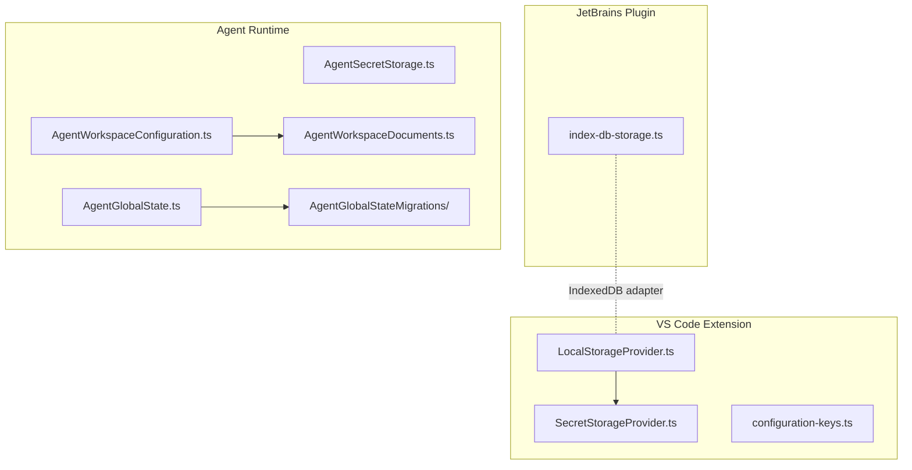
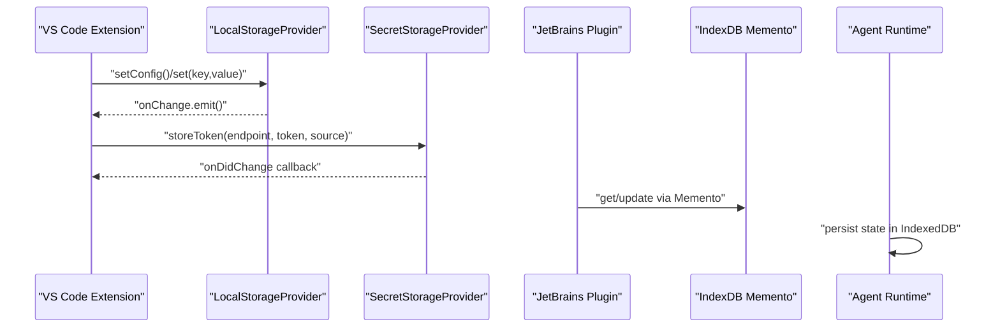
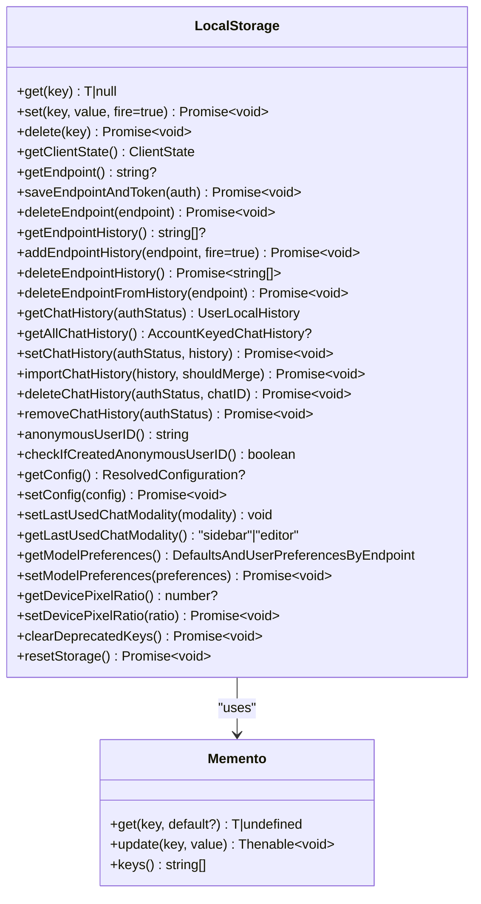
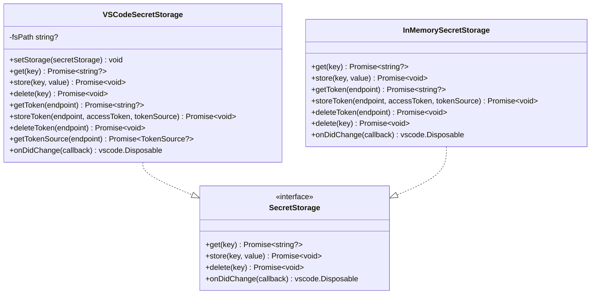
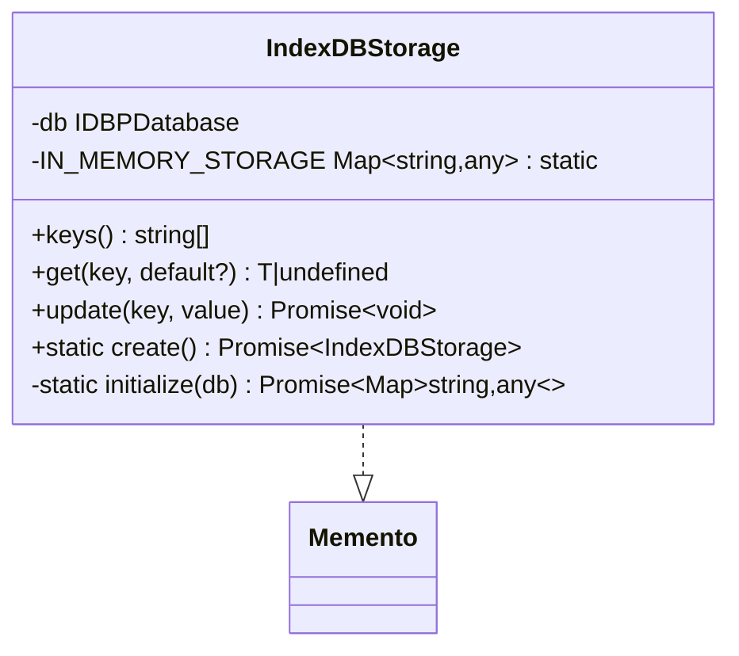
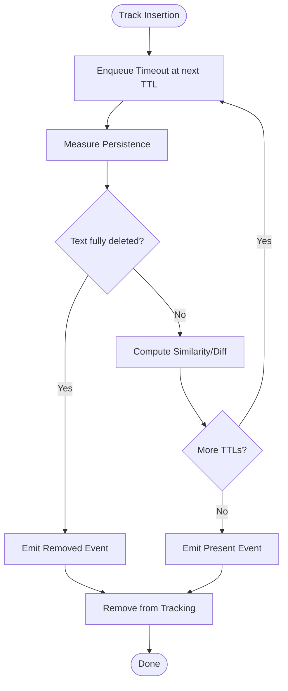
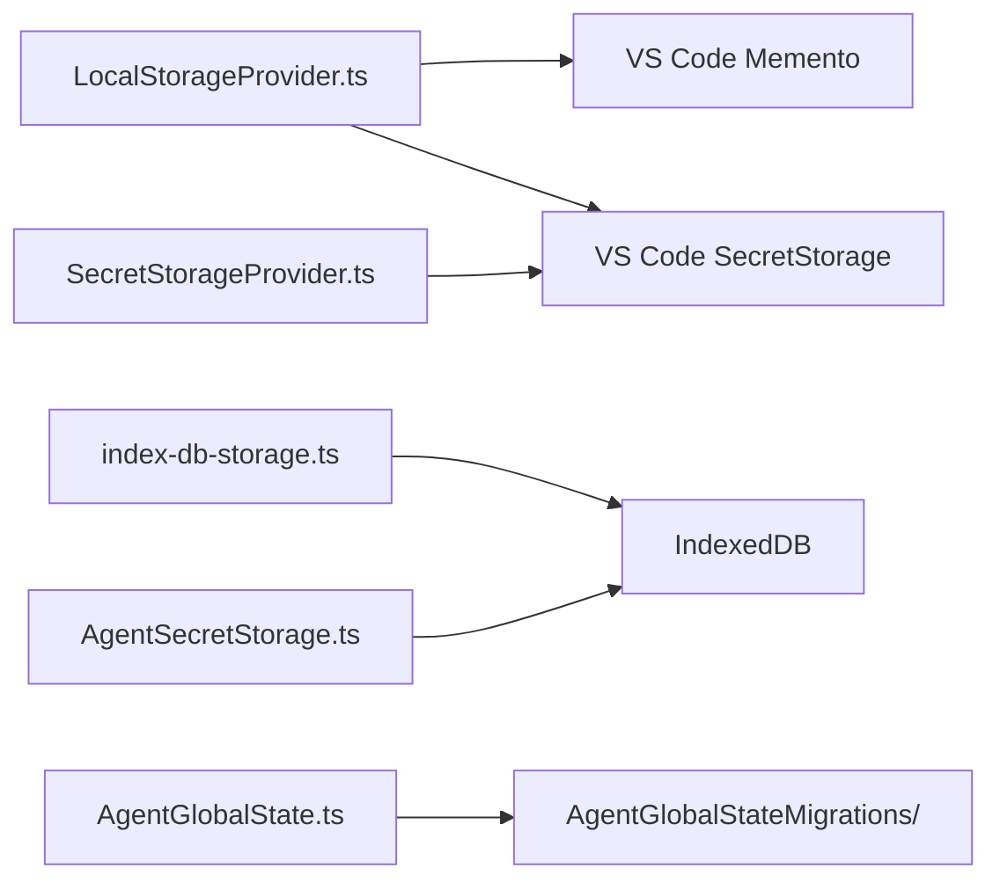

# Local Storage & Persistence

<cite>
**Referenced Files in This Document**
- [LocalStorageProvider.ts](file://vscode/src/services/LocalStorageProvider.ts)
- [SecretStorageProvider.ts](file://vscode/src/services/SecretStorageProvider.ts)
- [index-db-storage.ts](file://web/lib/agent/index-db-storage.ts)
- [PersistenceTracker.ts](file://vscode/src/common/persistence-tracker/index.ts)
- [PersistenceTrackerTypes.ts](file://vscode/src/common/persistence-tracker/types.ts)
- [configuration-keys.ts](file://vscode/src/configuration-keys.ts)
- [AgentSecretStorage.ts](file://agent/src/AgentSecretStorage.ts)
- [AgentWorkspaceConfiguration.ts](file://agent/src/AgentWorkspaceConfiguration.ts)
- [AgentWorkspaceDocuments.ts](file://agent/src/AgentWorkspaceDocuments.ts)
- [AgentGlobalState.ts](file://agent/src/global-state/AgentGlobalState.ts)
- [AgentGlobalStateMigrations.ts](file://agent/src/global-state/migrations/)
- [LocalStorageProvider.test.ts](file://vscode/src/services/LocalStorageProvider.test.ts)
- [SecretStorageProvider.test.ts](file://vscode/src/services/SecretStorageProvider.test.ts)
- [AgentSecretStorage.test.ts](file://agent/src/AgentSecretStorage.test.ts)
</cite>

## Table of Contents
1. [Introduction](#introduction)
2. [Project Structure](#project-structure)
3. [Core Components](#core-components)
4. [Architecture Overview](#architecture-overview)
5. [Detailed Component Analysis](#detailed-component-analysis)
6. [Dependency Analysis](#dependency-analysis)
7. [Performance Considerations](#performance-considerations)
8. [Troubleshooting Guide](#troubleshooting-guide)
9. [Conclusion](#conclusion)
10. [Appendices](#appendices)

## Introduction
This document explains Cody’s local storage and persistence systems across the VS Code extension, JetBrains plugin, and agent runtime. It covers:
- LocalStorageProvider for non-sensitive user preferences, configuration, chat history, and device metadata
- SecretStorageProvider for secure token and credential storage with encryption at rest
- Cross-session persistence and synchronization between VS Code, JetBrains, and agent runtimes
- Data migration strategies and version compatibility handling
- Cache management, TTL policies, and memory optimization
- Practical examples, error handling, and guidance for implementing custom storage providers

## Project Structure
Cody’s persistence stack is split by platform/runtime:
- VS Code extension: Uses VS Code Memento and SecretStorage APIs
- JetBrains plugin: Uses IndexedDB via a custom Memento adapter
- Agent runtime: Uses IndexedDB for web workers and includes a dedicated secret storage implementation

**Diagram sources**
- [LocalStorageProvider.ts](file://vscode/src/services/LocalStorageProvider.ts)
- [SecretStorageProvider.ts](file://vscode/src/services/SecretStorageProvider.ts)
- [index-db-storage.ts](file://web/lib/agent/index-db-storage.ts)
- [AgentSecretStorage.ts](file://agent/src/AgentSecretStorage.ts)
- [AgentWorkspaceConfiguration.ts](file://agent/src/AgentWorkspaceConfiguration.ts)
- [AgentWorkspaceDocuments.ts](file://agent/src/AgentWorkspaceDocuments.ts)
- [AgentGlobalState.ts](file://agent/src/global-state/AgentGlobalState.ts)
- [AgentGlobalStateMigrations.ts](file://agent/src/global-state/migrations/)

**Section sources**
- [LocalStorageProvider.ts](file://vscode/src/services/LocalStorageProvider.ts)
- [SecretStorageProvider.ts](file://vscode/src/services/SecretStorageProvider.ts)
- [index-db-storage.ts](file://web/lib/agent/index-db-storage.ts)
- [AgentSecretStorage.ts](file://agent/src/AgentSecretStorage.ts)
- [AgentWorkspaceConfiguration.ts](file://agent/src/AgentWorkspaceConfiguration.ts)
- [AgentWorkspaceDocuments.ts](file://agent/src/AgentWorkspaceDocuments.ts)
- [AgentGlobalState.ts](file://agent/src/global-state/AgentGlobalState.ts)
- [AgentGlobalStateMigrations.ts](file://agent/src/global-state/migrations/)

## Core Components
- LocalStorageProvider (VS Code): Provides typed accessors for configuration, chat history, endpoint history, model preferences, anonymous user ID, and related metadata. It supports observable state changes and emits events on updates.
- SecretStorageProvider (VS Code): Encapsulates secure token storage with optional fallback to a local file path for environments without native secret storage.
- IndexedDB Memento (JetBrains/Web Agent): Bridges VS Code’s Memento API semantics to IndexedDB for web workers and JetBrains plugin contexts.
- Agent Secret Storage: Dedicated secret storage for agent runtime with token source tracking and deletion routines.
- Persistence Tracker: Measures how accepted edits persist over time with configurable TTLs and optional code diffs.

**Section sources**
- [LocalStorageProvider.ts](file://vscode/src/services/LocalStorageProvider.ts)
- [SecretStorageProvider.ts](file://vscode/src/services/SecretStorageProvider.ts)
- [index-db-storage.ts](file://web/lib/agent/index-db-storage.ts)
- [AgentSecretStorage.ts](file://agent/src/AgentSecretStorage.ts)
- [PersistenceTracker.ts](file://vscode/src/common/persistence-tracker/index.ts)
- [PersistenceTrackerTypes.ts](file://vscode/src/common/persistence-tracker/types.ts)

## Architecture Overview
Cody’s persistence architecture separates concerns:
- Non-sensitive data (preferences, configuration, chat history) is persisted via Memento-compatible stores
- Sensitive data (tokens, secrets) is persisted via SecretStorage-compatible stores
- Cross-runtime synchronization is achieved by aligning keys and values across VS Code, JetBrains, and agent runtimes

**Diagram sources**
- [LocalStorageProvider.ts](file://vscode/src/services/LocalStorageProvider.ts)
- [SecretStorageProvider.ts](file://vscode/src/services/SecretStorageProvider.ts)
- [index-db-storage.ts](file://web/lib/agent/index-db-storage.ts)
- [AgentSecretStorage.ts](file://agent/src/AgentSecretStorage.ts)

## Detailed Component Analysis

### LocalStorageProvider (VS Code)
Responsibilities:
- Store and retrieve user preferences, resolved configuration, endpoint history, and chat history keyed by endpoint and username
- Manage anonymous user ID generation and detection of newly created IDs
- Track feature enrollment history and device pixel ratio
- Provide observable client state changes and emit events on updates
- Support ephemeral in-memory and no-op storage modes for testing

Key behaviors:
- Serialization: Values are stored as-is; consumers should ensure serializable data
- Cross-session persistence: Backed by VS Code Memento
- Deprecated key cleanup: Automatically clears legacy keys on initialization
- Endpoint handling: Prevents saving tokens as endpoints and clears invalid endpoints

**Diagram sources**
- [LocalStorageProvider.ts](file://vscode/src/services/LocalStorageProvider.ts)

Practical examples (paths):
- Storing configuration: [LocalStorageProvider.ts](file://vscode/src/services/LocalStorageProvider.ts)
- Saving endpoint and token atomically: [LocalStorageProvider.ts](file://vscode/src/services/LocalStorageProvider.ts)
- Retrieving chat history per account: [LocalStorageProvider.ts](file://vscode/src/services/LocalStorageProvider.ts)
- Observing client state changes: [LocalStorageProvider.ts](file://vscode/src/services/LocalStorageProvider.ts)
- Resetting storage: [LocalStorageProvider.ts](file://vscode/src/services/LocalStorageProvider.ts)

**Section sources**
- [LocalStorageProvider.ts](file://vscode/src/services/LocalStorageProvider.ts)
- [LocalStorageProvider.test.ts](file://vscode/src/services/LocalStorageProvider.test.ts)

### SecretStorageProvider (VS Code)
Responsibilities:
- Securely store and retrieve access tokens per endpoint
- Track token source and broadcast changes
- Fallback to a local file path when native secret storage is unavailable
- Delete tokens and sources for a given endpoint

Key behaviors:
- Encryption at rest: Delegates to VS Code SecretStorage (platform-specific)
- Fallback mechanism: Reads/writes a JSON file containing a token when configured
- Eventing: Emits change events for the global token key

**Diagram sources**
- [SecretStorageProvider.ts](file://vscode/src/services/SecretStorageProvider.ts)

Practical examples (paths):
- Storing a token for an endpoint: [SecretStorageProvider.ts](file://vscode/src/services/SecretStorageProvider.ts)
- Retrieving token source: [SecretStorageProvider.ts](file://vscode/src/services/SecretStorageProvider.ts)
- Listening to token changes: [SecretStorageProvider.ts](file://vscode/src/services/SecretStorageProvider.ts)
- Fallback file-based retrieval: [SecretStorageProvider.ts](file://vscode/src/services/SecretStorageProvider.ts)

**Section sources**
- [SecretStorageProvider.ts](file://vscode/src/services/SecretStorageProvider.ts)
- [SecretStorageProvider.test.ts](file://vscode/src/services/SecretStorageProvider.test.ts)

### IndexedDB Memento Adapter (JetBrains/Web Agent)
Responsibilities:
- Provide a Memento-compatible interface backed by IndexedDB for web workers and JetBrains plugin
- Hydrate in-memory cache on initialization and keep it synchronized with IndexedDB
- Serialize values using hydration helpers before storage

Key behaviors:
- Initialization: Scans the object store and populates an in-memory map
- Sync reads/writes: Update IndexedDB and the in-memory map
- Schema: Single object store created on upgrade

**Diagram sources**
- [index-db-storage.ts](file://web/lib/agent/index-db-storage.ts)

Practical examples (paths):
- Creating and initializing IndexedDB store: [index-db-storage.ts](file://web/lib/agent/index-db-storage.ts)
- Getting and updating values: [index-db-storage.ts](file://web/lib/agent/index-db-storage.ts)

**Section sources**
- [index-db-storage.ts](file://web/lib/agent/index-db-storage.ts)

### Agent Secret Storage (Agent Runtime)
Responsibilities:
- Persist tokens and sources in the agent runtime environment
- Provide token retrieval and deletion routines aligned with VS Code SecretStorage semantics

Key behaviors:
- Token source tracking and deletion
- Compatibility with agent-side configuration and workspace documents

Practical examples (paths):
- Storing tokens and sources: [AgentSecretStorage.ts](file://agent/src/AgentSecretStorage.ts)
- Retrieving tokens: [AgentSecretStorage.ts](file://agent/src/AgentSecretStorage.ts)
- Deleting tokens: [AgentSecretStorage.ts](file://agent/src/AgentSecretStorage.ts)

**Section sources**
- [AgentSecretStorage.ts](file://agent/src/AgentSecretStorage.ts)
- [AgentSecretStorage.test.ts](file://agent/src/AgentSecretStorage.test.ts)

### Persistence Tracker (TTL and Edit Persistence)
Responsibilities:
- Measure whether accepted completions persist over time with configurable TTLs
- Compute similarity metrics and optional code diffs
- Handle document rename/delete events and adjust tracked ranges accordingly

Key behaviors:
- TTL policy: Default timeouts at 30s, 2m, 5m, 10m
- Metrics: Difference computed via Levenshtein distance; optional code diff
- Memory optimization: Cleans up tracked insertions and timeouts on disposal

**Diagram sources**
- [PersistenceTracker.ts](file://vscode/src/common/persistence-tracker/index.ts)
- [PersistenceTrackerTypes.ts](file://vscode/src/common/persistence-tracker/types.ts)

Practical examples (paths):
- Tracking an insertion: [PersistenceTracker.ts](file://vscode/src/common/persistence-tracker/index.ts)
- Emitting persistence events: [PersistenceTracker.ts](file://vscode/src/common/persistence-tracker/index.ts)
- Disposing tracker: [PersistenceTracker.ts](file://vscode/src/common/persistence-tracker/index.ts)

**Section sources**
- [PersistenceTracker.ts](file://vscode/src/common/persistence-tracker/index.ts)
- [PersistenceTrackerTypes.ts](file://vscode/src/common/persistence-tracker/types.ts)

## Dependency Analysis
- LocalStorageProvider depends on VS Code Memento and SecretStorage for endpoint/token coordination
- SecretStorageProvider depends on VS Code SecretStorage and optionally a local file path
- JetBrains plugin and agent runtime depend on IndexedDB via a Memento adapter
- Agent runtime maintains separate state and migrations for global state

**Diagram sources**
- [LocalStorageProvider.ts](file://vscode/src/services/LocalStorageProvider.ts)
- [SecretStorageProvider.ts](file://vscode/src/services/SecretStorageProvider.ts)
- [index-db-storage.ts](file://web/lib/agent/index-db-storage.ts)
- [AgentSecretStorage.ts](file://agent/src/AgentSecretStorage.ts)
- [AgentGlobalState.ts](file://agent/src/global-state/AgentGlobalState.ts)
- [AgentGlobalStateMigrations.ts](file://agent/src/global-state/migrations/)

**Section sources**
- [LocalStorageProvider.ts](file://vscode/src/services/LocalStorageProvider.ts)
- [SecretStorageProvider.ts](file://vscode/src/services/SecretStorageProvider.ts)
- [index-db-storage.ts](file://web/lib/agent/index-db-storage.ts)
- [AgentSecretStorage.ts](file://agent/src/AgentSecretStorage.ts)
- [AgentGlobalState.ts](file://agent/src/global-state/AgentGlobalState.ts)
- [AgentGlobalStateMigrations.ts](file://agent/src/global-state/migrations/)

## Performance Considerations
- IndexedDB vs Memento: IndexedDB-backed Memento synchronizes in-memory state to serve synchronous get() calls; ensure to batch updates to minimize transaction overhead
- Event emission: LocalStorageProvider emits change events on updates; subscribe selectively to reduce unnecessary recomputation
- Persistence Tracker: TTL scheduling uses timers; dispose trackers to free memory and timers
- Storage quotas: Prefer compact JSON structures for chat history and avoid storing large binary blobs
- Cleanup: Periodically clear deprecated keys and endpoint history to keep storage lean

[No sources needed since this section provides general guidance]

## Troubleshooting Guide
Common issues and resolutions:
- Secret storage failures: The provider logs errors and falls back to undefined; verify platform secret storage availability or configure local token path
- Corrupted tokens: The provider catches and logs errors during retrieval; clear and re-enter tokens
- IndexedDB initialization failures: Confirm IndexedDB is supported and accessible in the environment; inspect console logs for upgrade errors
- Persistence Tracker not emitting events: Ensure the tracker is disposed properly and timeouts are scheduled; verify document change handlers are registered

**Section sources**
- [SecretStorageProvider.ts](file://vscode/src/services/SecretStorageProvider.ts)
- [index-db-storage.ts](file://web/lib/agent/index-db-storage.ts)
- [PersistenceTracker.ts](file://vscode/src/common/persistence-tracker/index.ts)

## Conclusion
Cody’s persistence system cleanly separates sensitive and non-sensitive data, provides cross-runtime compatibility via Memento/IndexedDB abstractions, and offers robust mechanisms for configuration, chat history, and token management. The persistence tracker adds valuable insights into edit retention over time. For production deployments, monitor storage sizes, clean deprecated keys, and ensure proper disposal of timers and disposables.

[No sources needed since this section summarizes without analyzing specific files]

## Appendices

### Configuration Keys Reference
- Configuration keys are defined centrally for consistent access across components.

**Section sources**
- [configuration-keys.ts](file://vscode/src/configuration-keys.ts)

### Cross-Session Persistence and Synchronization
- VS Code extension: Uses Memento and SecretStorage
- JetBrains plugin: Uses IndexedDB via IndexDBStorage
- Agent runtime: Uses IndexedDB and dedicated secret storage
- Align keys and values across runtimes to maintain consistent state

**Section sources**
- [LocalStorageProvider.ts](file://vscode/src/services/LocalStorageProvider.ts)
- [SecretStorageProvider.ts](file://vscode/src/services/SecretStorageProvider.ts)
- [index-db-storage.ts](file://web/lib/agent/index-db-storage.ts)
- [AgentSecretStorage.ts](file://agent/src/AgentSecretStorage.ts)

### Data Migration Strategies
- VS Code LocalStorageProvider: Clears deprecated keys on initialization to maintain schema hygiene
- Agent Global State: Maintains migrations under a dedicated folder to evolve persisted structures safely

**Section sources**
- [LocalStorageProvider.ts](file://vscode/src/services/LocalStorageProvider.ts)
- [AgentGlobalStateMigrations.ts](file://agent/src/global-state/migrations/)

### Practical Examples (Paths)
- Store configuration: [LocalStorageProvider.ts](file://vscode/src/services/LocalStorageProvider.ts)
- Save endpoint and token atomically: [LocalStorageProvider.ts](file://vscode/src/services/LocalStorageProvider.ts)
- Retrieve token source: [SecretStorageProvider.ts](file://vscode/src/services/SecretStorageProvider.ts)
- Initialize IndexedDB store: [index-db-storage.ts](file://web/lib/agent/index-db-storage.ts)
- Track edit persistence: [PersistenceTracker.ts](file://vscode/src/common/persistence-tracker/index.ts)