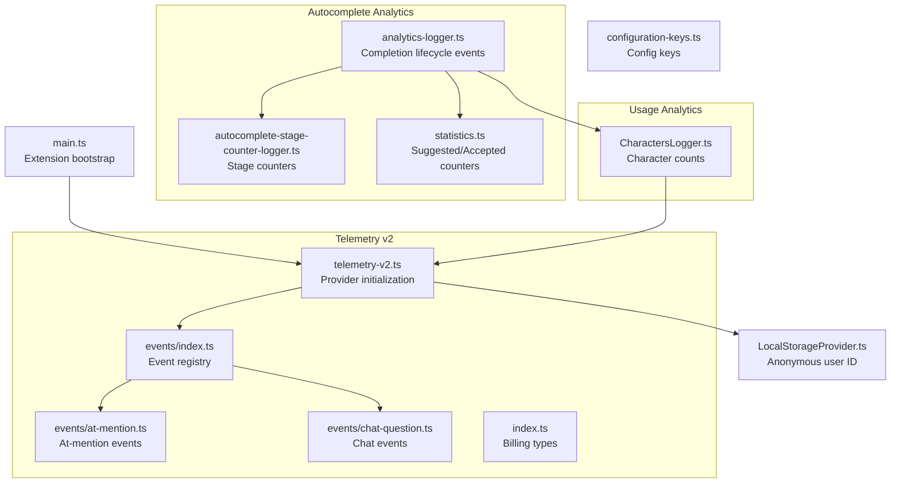
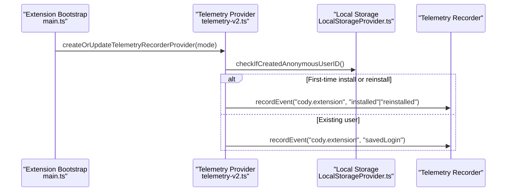
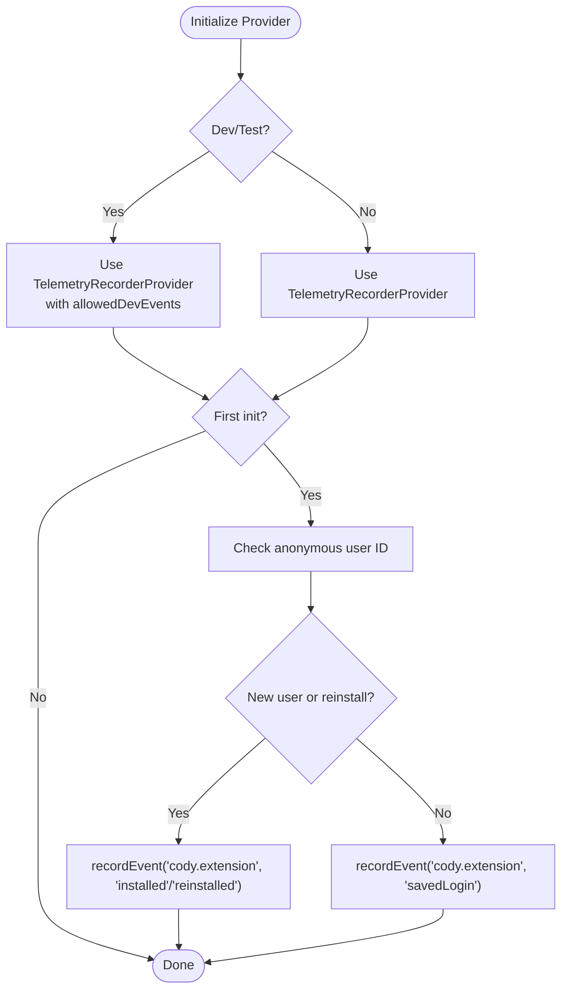
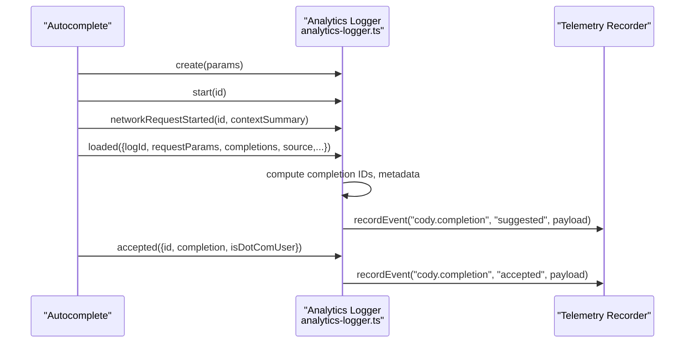
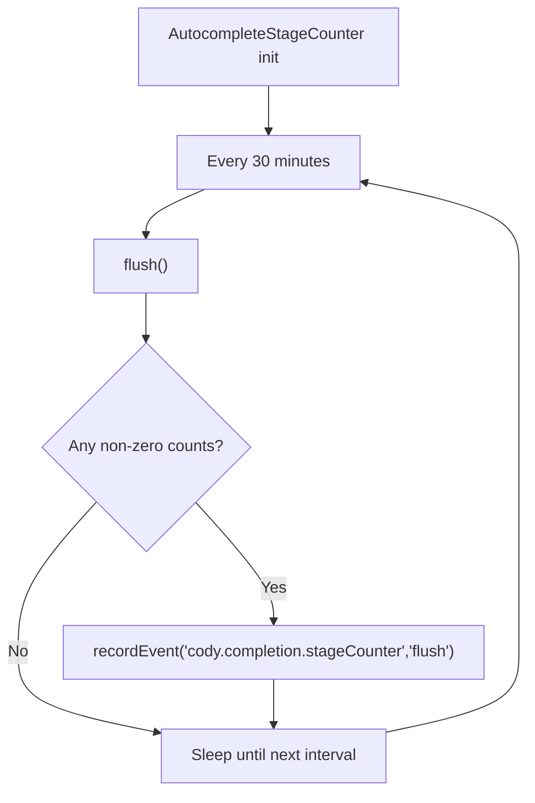
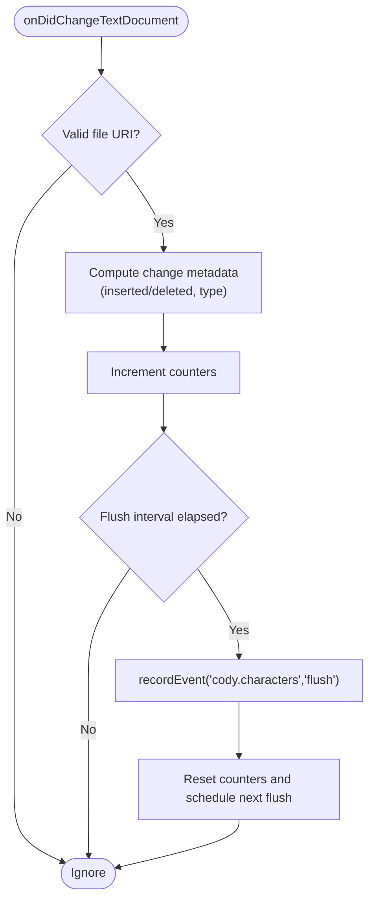
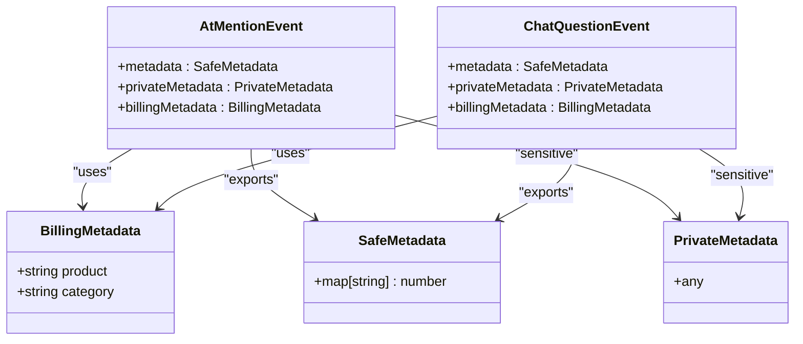
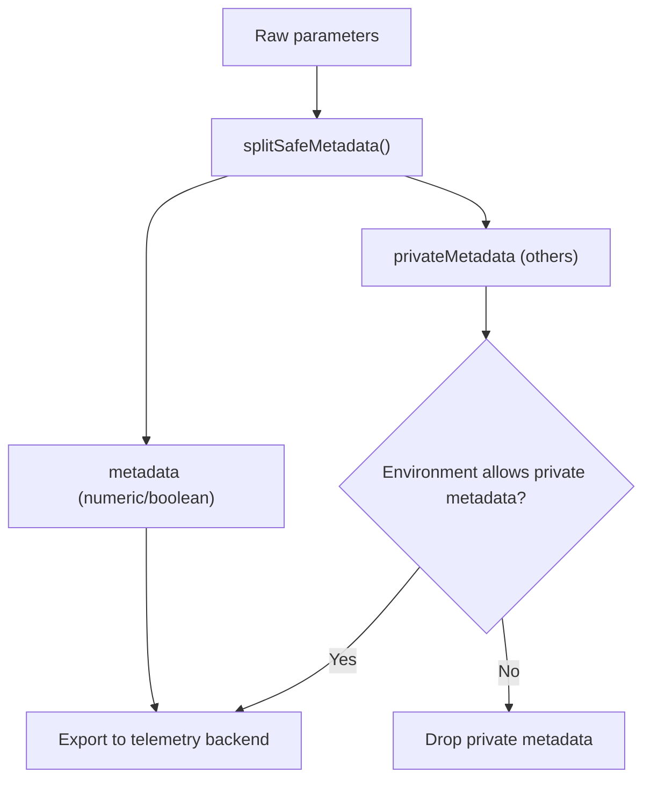
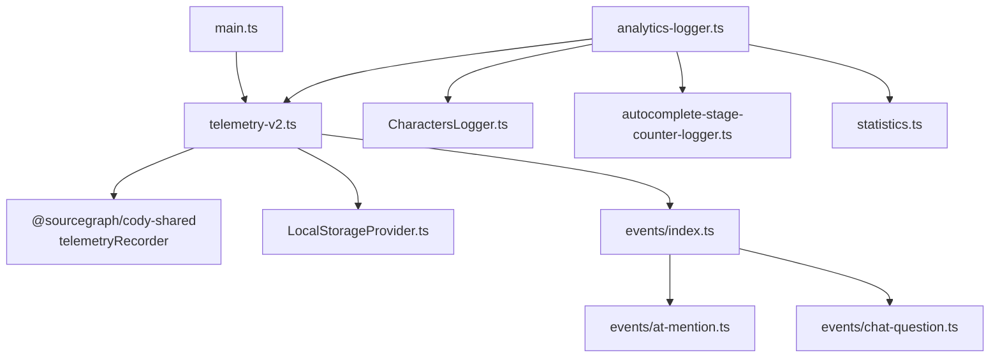

# Telemetry & Analytics

<cite>
**Referenced Files in This Document**
- [telemetry-v2.ts](file://vscode/src/services/telemetry-v2.ts)
- [telemetry-v2.test.ts](file://vscode/src/services/telemetry-v2.test.ts)
- [analytics-logger.ts](file://vscode/src/completions/analytics-logger.ts)
- [analytics-logger.test.ts](file://vscode/src/completions/analytics-logger.test.ts)
- [autocomplete-stage-counter-logger.ts](file://vscode/src/services/autocomplete-stage-counter-logger.ts)
- [CharactersLogger.ts](file://vscode/src/services/CharactersLogger.ts)
- [statistics.ts](file://vscode/src/completions/statistics.ts)
- [index.ts](file://lib/shared/src/telemetry-v2/index.ts)
- [events/at-mention.ts](file://lib/shared/src/telemetry-v2/events/at-mention.ts)
- [events/chat-question.ts](file://lib/shared/src/telemetry-v2/events/chat-question.ts)
- [events/index.ts](file://lib/shared/src/telemetry-v2/events/index.ts)
- [main.ts](file://vscode/src/main.ts)
- [LocalStorageProvider.ts](file://vscode/src/services/LocalStorageProvider.ts)
- [configuration-keys.ts](file://vscode/src/configuration-keys.ts)
</cite>

## Table of Contents
1. [Introduction](#introduction)
2. [Project Structure](#project-structure)
3. [Core Components](#core-components)
4. [Architecture Overview](#architecture-overview)
5. [Detailed Component Analysis](#detailed-component-analysis)
6. [Dependency Analysis](#dependency-analysis)
7. [Performance Considerations](#performance-considerations)
8. [Troubleshooting Guide](#troubleshooting-guide)
9. [Conclusion](#conclusion)
10. [Appendices](#appendices)

## Introduction
This document explains Cody’s telemetry and analytics collection system with a focus on the telemetry-v2 architecture. It covers event tracking for autocomplete and chat, performance metrics, usage analytics, and privacy-preserving data handling. It also documents character counting for code statistics, autocomplete stage counters, and completion quality monitoring. Finally, it outlines telemetry event types, payload structures, collection intervals, and configuration options for consent and opt-out.

## Project Structure
The telemetry system is implemented across three primary areas:
- Telemetry v2 provider and initialization
- Autocomplete analytics and performance instrumentation
- Usage analytics for code generation and character counts

**Diagram sources**
- [telemetry-v2.ts:1-172](file://vscode/src/services/telemetry-v2.ts#L1-172)
- [events/index.ts:1-14](file://lib/shared/src/telemetry-v2/events/index.ts#L1-14)
- [events/at-mention.ts:1-58](file://lib/shared/src/telemetry-v2/events/at-mention.ts#L1-58)
- [events/chat-question.ts:1-381](file://lib/shared/src/telemetry-v2/events/chat-question.ts#L1-381)
- [index.ts:1-12](file://lib/shared/src/telemetry-v2/index.ts#L1-12)
- [analytics-logger.ts:1-800](file://vscode/src/completions/analytics-logger.ts#L1-800)
- [autocomplete-stage-counter-logger.ts:1-91](file://vscode/src/services/autocomplete-stage-counter-logger.ts#L1-91)
- [CharactersLogger.ts:1-389](file://vscode/src/services/CharactersLogger.ts#L1-389)
- [statistics.ts:1-29](file://vscode/src/completions/statistics.ts#L1-29)
- [main.ts:122-214](file://vscode/src/main.ts#L122-214)
- [LocalStorageProvider.ts:29-320](file://vscode/src/services/LocalStorageProvider.ts#L29-320)
- [configuration-keys.ts:1-55](file://vscode/src/configuration-keys.ts#L1-55)

**Section sources**
- [telemetry-v2.ts:1-172](file://vscode/src/services/telemetry-v2.ts#L1-172)
- [main.ts:122-214](file://vscode/src/main.ts#L122-214)

## Core Components
- Telemetry v2 provider and initialization: Creates and updates the global telemetry recorder provider, supports dev/test modes, and records initial extension lifecycle events.
- Autocomplete analytics logger: Tracks suggestion lifecycles, acceptance, partial acceptance, errors, and formatting; computes and logs character counts per event.
- Autocomplete stage counter: Periodically flushes pipeline stage counters to monitor completion quality and throughput.
- Characters logger: Aggregates and periodically flushes character insertion/deletion counts and change types to understand usage patterns.
- Event registries: Define structured telemetry events for at-mentions and chat, including billing metadata and privacy controls.

**Section sources**
- [telemetry-v2.ts:26-99](file://vscode/src/services/telemetry-v2.ts#L26-99)
- [analytics-logger.ts:268-530](file://vscode/src/completions/analytics-logger.ts#L268-530)
- [autocomplete-stage-counter-logger.ts:1-91](file://vscode/src/services/autocomplete-stage-counter-logger.ts#L1-91)
- [CharactersLogger.ts:100-173](file://vscode/src/services/CharactersLogger.ts#L100-173)
- [events/at-mention.ts:11-57](file://lib/shared/src/telemetry-v2/events/at-mention.ts#L11-57)
- [events/chat-question.ts:36-175](file://lib/shared/src/telemetry-v2/events/chat-question.ts#L36-175)

## Architecture Overview
The telemetry-v2 architecture centers on a provider that records structured events with optional private metadata. Events are categorized with billing metadata and exported according to environment policies. Autocomplete and chat subsystems instrument their workflows to produce rich telemetry payloads. Usage analytics are captured separately via character counting and periodic flushes.

**Diagram sources**
- [main.ts:211-211](file://vscode/src/main.ts#L211-211)
- [telemetry-v2.ts:33-96](file://vscode/src/services/telemetry-v2.ts#L33-96)
- [LocalStorageProvider.ts:303-320](file://vscode/src/services/LocalStorageProvider.ts#L303-320)

## Detailed Component Analysis

### Telemetry v2 Provider and Initialization
- Initializes the global telemetry recorder provider based on environment (dev/test vs production).
- Supports a dev-mode whitelist for allowed events.
- Records initial extension lifecycle events (install, reinstall, saved login) using anonymous user IDs persisted in local storage.
- Provides a helper to split legacy metadata into safe numeric/private buckets for export policies.

**Diagram sources**
- [telemetry-v2.ts:26-99](file://vscode/src/services/telemetry-v2.ts#L26-99)
- [LocalStorageProvider.ts:303-320](file://vscode/src/services/LocalStorageProvider.ts#L303-320)

**Section sources**
- [telemetry-v2.ts:26-99](file://vscode/src/services/telemetry-v2.ts#L26-99)
- [telemetry-v2.test.ts:8-184](file://vscode/src/services/telemetry-v2.test.ts#L8-184)

### Autocomplete Analytics Logger
- Tracks completion lifecycle: creation, start, network request, loaded, suggested, accepted, partially accepted, no response, error, format.
- Computes and logs character counts per item and aggregates metadata for billing and analysis.
- Uses a LRU cache to reuse completion IDs across suggestions and prevent double counting.
- Applies privacy controls: sensitive context is only recorded for specific environments and repositories.

**Diagram sources**
- [analytics-logger.ts:636-745](file://vscode/src/completions/analytics-logger.ts#L636-745)
- [analytics-logger.ts:268-320](file://vscode/src/completions/analytics-logger.ts#L268-320)
- [analytics-logger.ts:293-306](file://vscode/src/completions/analytics-logger.ts#L293-306)

**Section sources**
- [analytics-logger.ts:104-195](file://vscode/src/completions/analytics-logger.ts#L104-195)
- [analytics-logger.ts:268-530](file://vscode/src/completions/analytics-logger.ts#L268-530)
- [analytics-logger.test.ts:59-107](file://vscode/src/completions/analytics-logger.test.ts#L59-107)

### Autocomplete Stage Counter
- Periodically flushes pipeline stage counters (e.g., pre-cache, pre-smart-throttle, pre-context retrieval) to track completion quality and drop-offs.
- Resets counters on model changes and clears timeouts on disposal.

**Diagram sources**
- [autocomplete-stage-counter-logger.ts:1-91](file://vscode/src/services/autocomplete-stage-counter-logger.ts#L1-91)

**Section sources**
- [autocomplete-stage-counter-logger.ts:1-91](file://vscode/src/services/autocomplete-stage-counter-logger.ts#L1-91)

### Characters Logger (Code Statistics)
- Aggregates character counts for insertions/deletions grouped by change types (e.g., undo, redo, disjoint, rapid, stale).
- Periodically flushes aggregated counters to the telemetry recorder.
- Uses safe metadata splitting for privacy-preserving exports.

**Diagram sources**
- [CharactersLogger.ts:175-217](file://vscode/src/services/CharactersLogger.ts#L175-217)
- [CharactersLogger.ts:154-173](file://vscode/src/services/CharactersLogger.ts#L154-173)

**Section sources**
- [CharactersLogger.ts:100-173](file://vscode/src/services/CharactersLogger.ts#L100-173)
- [CharactersLogger.ts:269-347](file://vscode/src/services/CharactersLogger.ts#L269-347)

### Event Schema Design and Payload Structures
- Billing metadata: Events include product and category for analytics categorization.
- Private metadata: Sensitive attributes are kept separate and exported only under specific policies and environments.
- At-mention events: Capture source and provider with numeric mappings for export safety.
- Chat events: Include session identifiers, trace IDs, prompt text (truncated), and context summaries with counts and sizes.

**Diagram sources**
- [index.ts:1-12](file://lib/shared/src/telemetry-v2/index.ts#L1-12)
- [events/at-mention.ts:11-57](file://lib/shared/src/telemetry-v2/events/at-mention.ts#L11-57)
- [events/chat-question.ts:36-175](file://lib/shared/src/telemetry-v2/events/chat-question.ts#L36-175)

**Section sources**
- [index.ts:1-12](file://lib/shared/src/telemetry-v2/index.ts#L1-12)
- [events/at-mention.ts:11-57](file://lib/shared/src/telemetry-v2/events/at-mention.ts#L11-57)
- [events/chat-question.ts:36-175](file://lib/shared/src/telemetry-v2/events/chat-question.ts#L36-175)

### Data Collection Pipelines and Privacy Controls
- Splitting metadata: A helper converts booleans/numbers to numeric fields and preserves others as private metadata.
- Environment-specific exports: Private metadata is exported only for specific environments and under allowlists.
- Sensitive context: Inline completion context and chat transcripts are restricted to specific environments and repositories.

**Diagram sources**
- [telemetry-v2.ts:126-171](file://vscode/src/services/telemetry-v2.ts#L126-171)
- [analytics-logger.ts:274-291](file://vscode/src/completions/analytics-logger.ts#L274-291)
- [events/chat-question.ts:45-83](file://lib/shared/src/telemetry-v2/events/chat-question.ts#L45-83)

**Section sources**
- [telemetry-v2.ts:126-171](file://vscode/src/services/telemetry-v2.ts#L126-171)
- [analytics-logger.ts:274-291](file://vscode/src/completions/analytics-logger.ts#L274-291)
- [events/chat-question.ts:45-83](file://lib/shared/src/telemetry-v2/events/chat-question.ts#L45-83)

### Telemetry Event Types and Payloads
- Extension lifecycle: cody.extension (installed, reinstalled, savedLogin)
- Autocomplete: cody.completion (suggested, accepted, partiallyAccepted, noResponse, error, format)
- Autocomplete stage counters: cody.completion.stageCounter (flush)
- Characters: cody.characters (flush)
- Chat: cody.chat-question (submitted, executed)
- At-mention: cody.at-mention/selected

**Section sources**
- [telemetry-v2.ts:77-95](file://vscode/src/services/telemetry-v2.ts#L77-95)
- [analytics-logger.ts:505-529](file://vscode/src/completions/analytics-logger.ts#L505-529)
- [autocomplete-stage-counter-logger.ts:53-56](file://vscode/src/services/autocomplete-stage-counter-logger.ts#L53-56)
- [CharactersLogger.ts:161-163](file://vscode/src/services/CharactersLogger.ts#L161-163)
- [events/chat-question.ts:37-174](file://lib/shared/src/telemetry-v2/events/chat-question.ts#L37-174)
- [events/at-mention.ts:11-57](file://lib/shared/src/telemetry-v2/events/at-mention.ts#L11-57)

### Collection Intervals and Reporting
- Autocomplete stage counters: Flush every 30 minutes.
- Characters logger: Flush every 30 minutes.
- Completion statistics: In-memory counters updated on suggested/accepted events.

**Section sources**
- [autocomplete-stage-counter-logger.ts:5-5](file://vscode/src/services/autocomplete-stage-counter-logger.ts#L5-5)
- [CharactersLogger.ts:14-14](file://vscode/src/services/CharactersLogger.ts#L14-14)
- [statistics.ts:15-28](file://vscode/src/completions/statistics.ts#L15-28)

### Instrumenting New Features with Telemetry
- Use the global telemetry recorder to emit structured events with metadata and billing metadata.
- Prefer numeric/boolean metadata for export safety; put sensitive data in private metadata.
- For autocomplete features, follow the lifecycle pattern: create/start/networkRequestStarted/loaded/suggested/accepted/error/format.

**Section sources**
- [telemetry-v2.ts:505-529](file://vscode/src/services/telemetry-v2.ts#L505-529)
- [analytics-logger.ts:636-745](file://vscode/src/completions/analytics-logger.ts#L636-745)

### Analyzing Collected Data
- Use billing metadata to segment billable vs core events.
- Use session IDs, trace IDs, and request IDs to correlate events across systems.
- Combine autocomplete stage counters with suggestion/acceptance rates to assess completion quality.

**Section sources**
- [events/chat-question.ts:52-83](file://lib/shared/src/telemetry-v2/events/chat-question.ts#L52-83)
- [autocomplete-stage-counter-logger.ts:53-56](file://vscode/src/services/autocomplete-stage-counter-logger.ts#L53-56)

## Dependency Analysis

**Diagram sources**
- [telemetry-v2.ts:1-172](file://vscode/src/services/telemetry-v2.ts#L1-172)
- [main.ts:106-106](file://vscode/src/main.ts#L106-106)
- [analytics-logger.ts:14-35](file://vscode/src/completions/analytics-logger.ts#L14-35)
- [CharactersLogger.ts:1-389](file://vscode/src/services/CharactersLogger.ts#L1-389)
- [autocomplete-stage-counter-logger.ts:1-91](file://vscode/src/services/autocomplete-stage-counter-logger.ts#L1-91)
- [statistics.ts:1-29](file://vscode/src/completions/statistics.ts#L1-29)
- [events/index.ts:1-14](file://lib/shared/src/telemetry-v2/events/index.ts#L1-14)

**Section sources**
- [telemetry-v2.ts:1-172](file://vscode/src/services/telemetry-v2.ts#L1-172)
- [main.ts:106-106](file://vscode/src/main.ts#L106-106)

## Performance Considerations
- Avoid logging large payloads: Inline context and diffs are filtered by size limits to prevent excessive telemetry volume.
- Batch and throttle: Stage counters and character counters flush periodically to reduce overhead.
- Lightweight metadata: Prefer numeric/boolean metadata to minimize export costs and improve downstream processing.

[No sources needed since this section provides general guidance]

## Troubleshooting Guide
- Dev/test mode: In development or test mode, only whitelisted events are exported; verify allowedDevEvents configuration.
- Private metadata visibility: Private metadata is exported only under specific environment policies; confirm environment and allowlists.
- Anonymous user ID: Ensure anonymous user ID is persisted to avoid double counting and missing attribution.
- Autocomplete lifecycle: Verify that create/start/networkRequestStarted/loaded/suggested/accepted are called in order for accurate analytics.

**Section sources**
- [telemetry-v2.ts:48-65](file://vscode/src/services/telemetry-v2.ts#L48-65)
- [LocalStorageProvider.ts:303-320](file://vscode/src/services/LocalStorageProvider.ts#L303-320)
- [analytics-logger.ts:636-745](file://vscode/src/completions/analytics-logger.ts#L636-745)

## Conclusion
Cody’s telemetry-v2 system provides a robust, privacy-conscious framework for collecting autocomplete and chat analytics. It separates sensitive data, uses structured billing metadata, and instruments key workflows to measure completion quality and usage patterns. With periodic flushing and careful payload design, it balances observability with performance and compliance.

[No sources needed since this section summarizes without analyzing specific files]

## Appendices

### Configuration Options for Consent and Opt-Out
- Anonymous user ID: Persisted to attribute events without personal identifiers.
- Environment-based exports: Private metadata export depends on environment and policies.
- Dev/test mode: Restricts exports to whitelisted events for development and testing.

**Section sources**
- [LocalStorageProvider.ts:303-320](file://vscode/src/services/LocalStorageProvider.ts#L303-320)
- [telemetry-v2.ts:48-65](file://vscode/src/services/telemetry-v2.ts#L48-65)