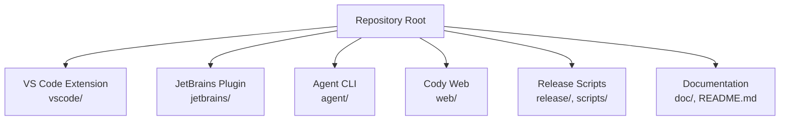
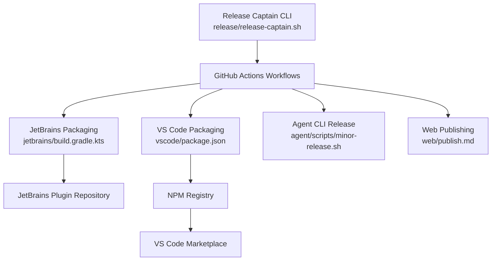
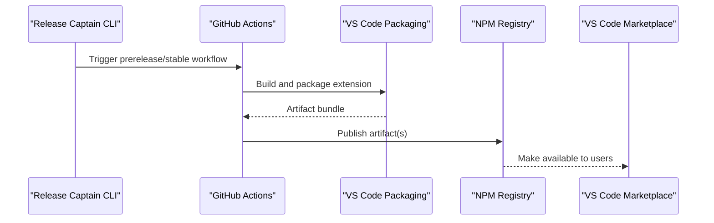
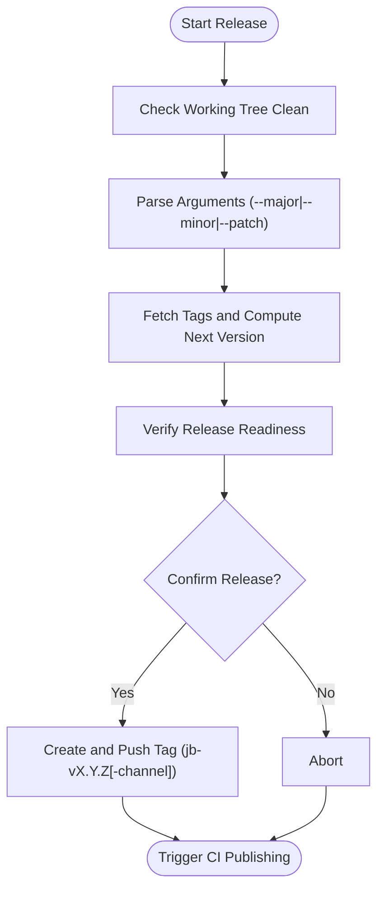
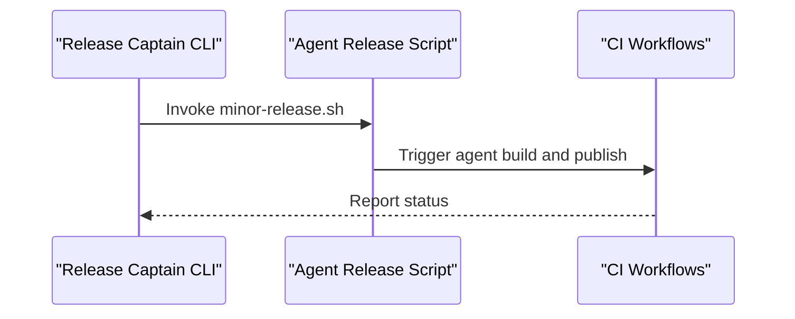
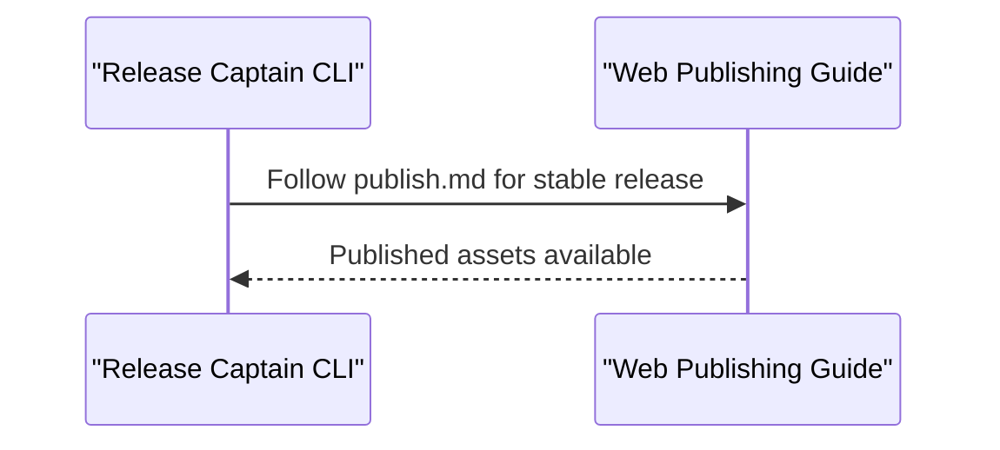
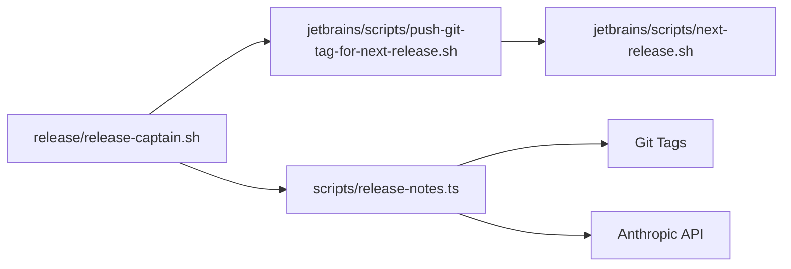
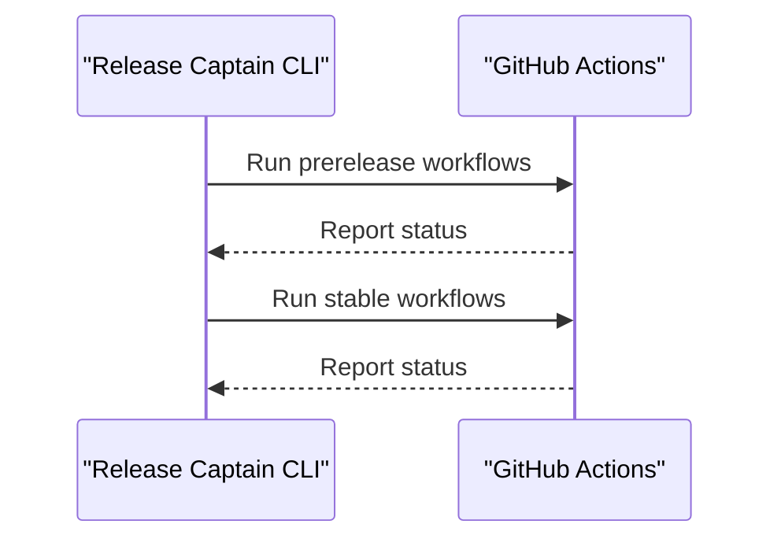
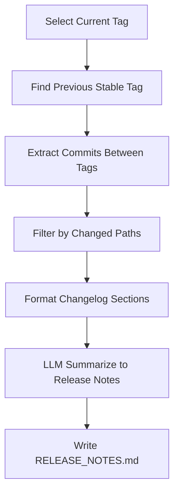

# Deployment & Distribution

<cite>
**Referenced Files in This Document**
- [README.md](file://README.md)
- [package.json](file://package.json)
- [release/README.md](file://release/README.md)
- [release/release-captain.sh](file://release/release-captain.sh)
- [scripts/release-notes.ts](file://scripts/release-notes.ts)
- [jetbrains/scripts/push-git-tag-for-next-release.sh](file://jetbrains/scripts/push-git-tag-for-next-release.sh)
- [jetbrains/scripts/next-release.sh](file://jetbrains/scripts/next-release.sh)
- [vscode/scripts/changelog.sh](file://vscode/scripts/changelog.sh)
- [vscode/scripts/jb-changelogs.sh](file://vscode/scripts/jb-changelogs.sh)
- [agent/scripts/minor-release.sh](file://agent/scripts/minor-release.sh)
- [web/publish.md](file://web/publish.md)
- [vscode/package.json](file://vscode/package.json)
- [jetbrains/build.gradle.kts](file://jetbrains/build.gradle.kts)
- [jetbrains/settings.gradle.kts](file://jetbrains/settings.gradle.kts)
- [jetbrains/gradle.properties](file://jetbrains/gradle.properties)
- [jetbrains/features.json5](file://jetbrains/features.json5)
- [jetbrains/CONTRIBUTING.md](file://jetbrains/CONTRIBUTING.md)
- [jetbrains/README.md](file://jetbrains/README.md)
- [vscode/README.md](file://vscode/README.md)
- [Dockerfile](file://Dockerfile)
- [.dockerignore](file://.dockerignore)
</cite>

## Table of Contents
1. [Introduction](#introduction)
2. [Project Structure](#project-structure)
3. [Core Components](#core-components)
4. [Architecture Overview](#architecture-overview)
5. [Detailed Component Analysis](#detailed-component-analysis)
6. [Dependency Analysis](#dependency-analysis)
7. [Performance Considerations](#performance-considerations)
8. [Security Considerations](#security-considerations)
9. [Distribution Channels](#distribution-channels)
10. [Enterprise Deployment Options](#enterprise-deployment-options)
11. [CI/CD Pipeline](#cicd-pipeline)
12. [Version Management and Release Notes](#version-management-and-release-notes)
13. [Troubleshooting Guide](#troubleshooting-guide)
14. [Conclusion](#conclusion)

## Introduction
This document explains how Cody is deployed and distributed across platforms and environments. It covers package management, extension packaging, platform-specific builds, CI/CD automation, versioning, changelog generation, release notes preparation, distribution channels (VS Code Marketplace, JetBrains Plugin Repository, and direct downloads), enterprise deployment options, infrastructure requirements, scaling, monitoring, and security considerations for distribution, code signing, and integrity verification.

## Project Structure
Cody is a multi-platform project with distinct packages and build systems:
- VS Code extension: packaged and published via npm and the VS Code Marketplace.
- JetBrains plugin: built with Gradle and published to the JetBrains Plugin Repository.
- Agent CLI: platform-specific binaries built and released independently.
- Web: static assets published per the web publishing guide.
- Shared monorepo tooling: scripts for release automation, changelog generation, and versioning.

**Diagram sources**
- [README.md](file://README.md)
- [package.json](file://package.json)

**Section sources**
- [README.md](file://README.md)
- [package.json](file://package.json)

## Core Components
- VS Code extension packaging and publishing is orchestrated via npm scripts and GitHub Actions workflows referenced by the release captain tooling.
- JetBrains plugin packaging uses Gradle with dedicated scripts for tagging and triggering CI workflows.
- Agent CLI releases are handled by a dedicated script.
- Changelog generation and release notes are automated via scripts that leverage git history and LLM summarization.

Key responsibilities:
- Versioning and tagging across platforms.
- Automated prerelease and stable builds.
- Changelog extraction and release note generation.
- Publishing to respective distribution channels.

**Section sources**
- [release/release-captain.sh](file://release/release-captain.sh)
- [jetbrains/scripts/push-git-tag-for-next-release.sh](file://jetbrains/scripts/push-git-tag-for-next-release.sh)
- [agent/scripts/minor-release.sh](file://agent/scripts/minor-release.sh)
- [scripts/release-notes.ts](file://scripts/release-notes.ts)

## Architecture Overview
The deployment and distribution architecture spans multiple build systems and distribution channels, coordinated by release automation scripts and CI workflows.

**Diagram sources**
- [release/release-captain.sh](file://release/release-captain.sh)
- [jetbrains/scripts/push-git-tag-for-next-release.sh](file://jetbrains/scripts/push-git-tag-for-next-release.sh)
- [agent/scripts/minor-release.sh](file://agent/scripts/minor-release.sh)
- [web/publish.md](file://web/publish.md)

## Detailed Component Analysis

### VS Code Extension Packaging and Publishing
- The VS Code extension is packaged and published through npm and the VS Code Marketplace. The release captain tooling triggers prerelease and stable workflows and manages tagging.
- Version updates and packaging are driven by the VS Code package manifest and CI workflows.

**Diagram sources**
- [release/release-captain.sh](file://release/release-captain.sh)
- [vscode/package.json](file://vscode/package.json)

**Section sources**
- [release/release-captain.sh](file://release/release-captain.sh)
- [vscode/package.json](file://vscode/package.json)

### JetBrains Plugin Packaging and Publishing
- JetBrains plugin builds are managed via Gradle. A release script computes the next version, verifies readiness, and pushes a tag that triggers CI publishing.
- The script supports major, minor, and patch increments and optional nightly/experimental channels.

**Diagram sources**
- [jetbrains/scripts/push-git-tag-for-next-release.sh](file://jetbrains/scripts/push-git-tag-for-next-release.sh)
- [jetbrains/scripts/next-release.sh](file://jetbrains/scripts/next-release.sh)

**Section sources**
- [jetbrains/scripts/push-git-tag-for-next-release.sh](file://jetbrains/scripts/push-git-tag-for-next-release.sh)
- [jetbrains/scripts/next-release.sh](file://jetbrains/scripts/next-release.sh)
- [jetbrains/build.gradle.kts](file://jetbrains/build.gradle.kts)
- [jetbrains/settings.gradle.kts](file://jetbrains/settings.gradle.kts)
- [jetbrains/gradle.properties](file://jetbrains/gradle.properties)
- [jetbrains/features.json5](file://jetbrains/features.json5)
- [jetbrains/CONTRIBUTING.md](file://jetbrains/CONTRIBUTING.md)
- [jetbrains/README.md](file://jetbrains/README.md)

### Agent CLI Release
- The Agent CLI has a dedicated release script that bumps versions and publishes artifacts according to the project’s release cadence.

**Diagram sources**
- [release/release-captain.sh](file://release/release-captain.sh)
- [agent/scripts/minor-release.sh](file://agent/scripts/minor-release.sh)

**Section sources**
- [release/release-captain.sh](file://release/release-captain.sh)
- [agent/scripts/minor-release.sh](file://agent/scripts/minor-release.sh)

### Web Publishing
- The web publishing process is documented separately and is triggered as part of the stable release workflow.

**Diagram sources**
- [release/release-captain.sh](file://release/release-captain.sh)
- [web/publish.md](file://web/publish.md)

**Section sources**
- [release/release-captain.sh](file://release/release-captain.sh)
- [web/publish.md](file://web/publish.md)

## Dependency Analysis
- The release captain orchestrates cross-repo operations and depends on GitHub CLI, jq, and Git.
- JetBrains packaging depends on Gradle and the next-release helper to compute semantic versions.
- Release notes generation depends on git tags and an LLM API for summarization.

**Diagram sources**
- [release/release-captain.sh](file://release/release-captain.sh)
- [jetbrains/scripts/push-git-tag-for-next-release.sh](file://jetbrains/scripts/push-git-tag-for-next-release.sh)
- [jetbrains/scripts/next-release.sh](file://jetbrains/scripts/next-release.sh)
- [scripts/release-notes.ts](file://scripts/release-notes.ts)

**Section sources**
- [release/release-captain.sh](file://release/release-captain.sh)
- [jetbrains/scripts/push-git-tag-for-next-release.sh](file://jetbrains/scripts/push-git-tag-for-next-release.sh)
- [jetbrains/scripts/next-release.sh](file://jetbrains/scripts/next-release.sh)
- [scripts/release-notes.ts](file://scripts/release-notes.ts)

## Performance Considerations
- Pre-release builds reduce risk by enabling early validation across platforms.
- Automated changelog generation avoids manual effort and reduces human error.
- CI workflows should be optimized to cache dependencies and parallelize independent jobs where possible.

## Security Considerations
- Code signing and integrity verification: Ensure that release artifacts are cryptographically signed and checksums are published alongside releases.
- Trusted publishing: Restrict publishing permissions to authorized release captains and enforce review gates.
- Supply chain security: Pin dependency versions, monitor for vulnerable transitive dependencies, and scan artifacts before publishing.
- Integrity checks: Provide SHA-256 hashes for downloadable artifacts and verify them during installation.

## Distribution Channels
- VS Code Marketplace: Published via NPM and the VS Code Marketplace.
- JetBrains Plugin Repository: Published via the JetBrains Plugin Repository after CI tagging.
- Direct downloads: Stable and prerelease artifacts are available through CI and release tags.

**Section sources**
- [README.md](file://README.md)
- [release/release-captain.sh](file://release/release-captain.sh)

## Enterprise Deployment Options
- Self-hosted installations: Enterprise customers can deploy Cody with Sourcegraph Enterprise Server.
- Custom builds: Internal teams can fork and build custom distributions following the existing packaging scripts.
- Private registries: Organizations can mirror and host artifacts internally for compliance and offline environments.

**Section sources**
- [README.md](file://README.md)

## CI/CD Pipeline
- The release captain CLI coordinates prerelease and stable workflows for VS Code, JetBrains, Agent, and Web.
- Prerelease workflows build and publish nightly or insiders versions.
- Stable workflows finalize releases and publish to distribution channels.

**Diagram sources**
- [release/release-captain.sh](file://release/release-captain.sh)

**Section sources**
- [release/release-captain.sh](file://release/release-captain.sh)

## Version Management and Release Notes
- Semantic versioning: JetBrains uses a major.minor.patch scheme with optional channels (nightly/experimental).
- Changelog generation: Scripts extract changes between tags and organize them by type and domain.
- Release notes: An LLM summarizes changes into user-friendly release notes.

**Diagram sources**
- [scripts/release-notes.ts](file://scripts/release-notes.ts)
- [vscode/scripts/jb-changelogs.sh](file://vscode/scripts/jb-changelogs.sh)

**Section sources**
- [scripts/release-notes.ts](file://scripts/release-notes.ts)
- [vscode/scripts/jb-changelogs.sh](file://vscode/scripts/jb-changelogs.sh)
- [vscode/scripts/changelog.sh](file://vscode/scripts/changelog.sh)

## Troubleshooting Guide
- Release prerequisites: Ensure Git, GitHub CLI, jq, and required tokens are configured.
- Working tree clean: JetBrains release script aborts if there are uncommitted changes.
- Tag conflicts: Verify tag uniqueness and correct branch context before pushing.
- Changelog discrepancies: Confirm git tags exist and are reachable; re-run changelog scripts if needed.
- Marketplace visibility: JetBrains releases require unhiding the version in the JetBrains Plugin Repository.

**Section sources**
- [release/release-captain.sh](file://release/release-captain.sh)
- [jetbrains/scripts/push-git-tag-for-next-release.sh](file://jetbrains/scripts/push-git-tag-for-next-release.sh)
- [jetbrains/scripts/next-release.sh](file://jetbrains/scripts/next-release.sh)

## Conclusion
Cody’s deployment and distribution rely on a coordinated set of scripts and CI workflows that automate prerelease and stable releases across VS Code, JetBrains, Agent, and Web. Versioning, changelog generation, and release notes are streamlined through git-based automation and LLM-assisted summarization. Enterprises can adopt self-hosted and private registry strategies, while distribution channels remain accessible via official marketplaces and direct downloads.